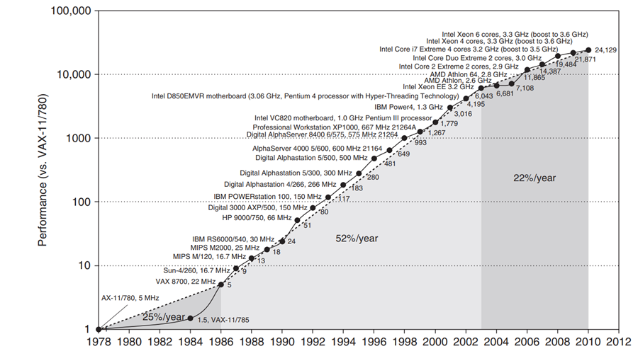
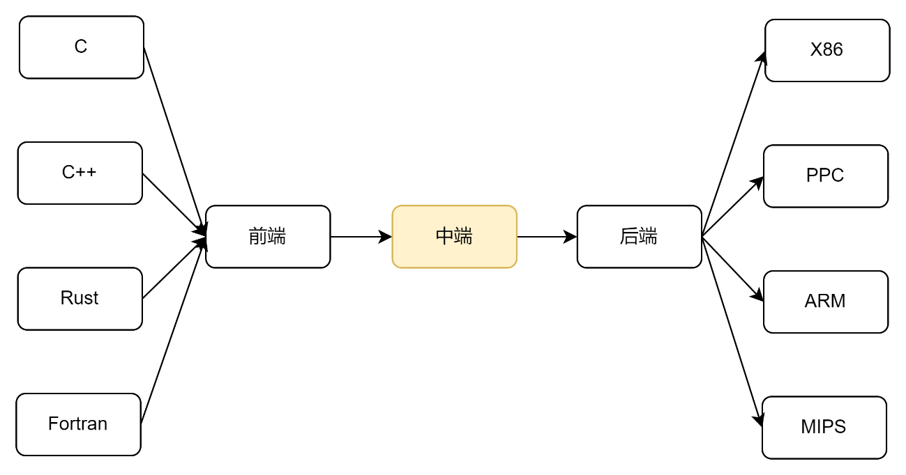
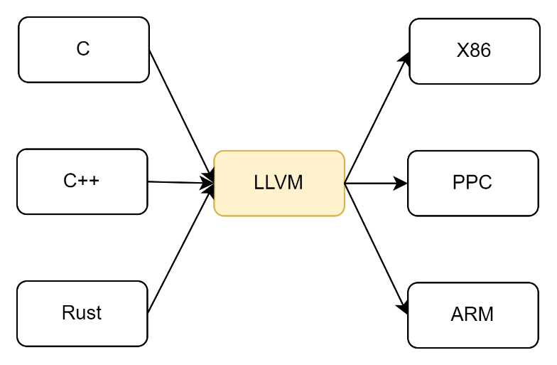
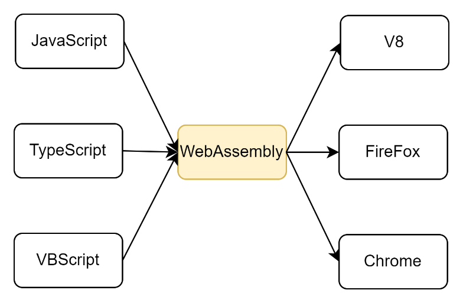
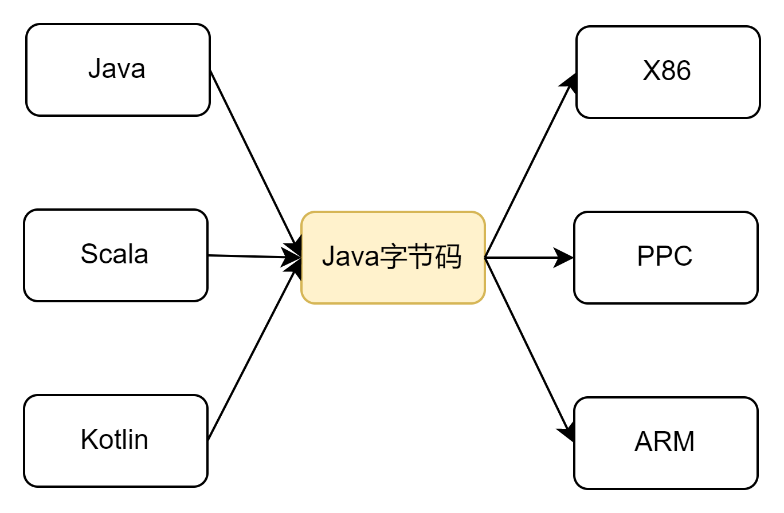
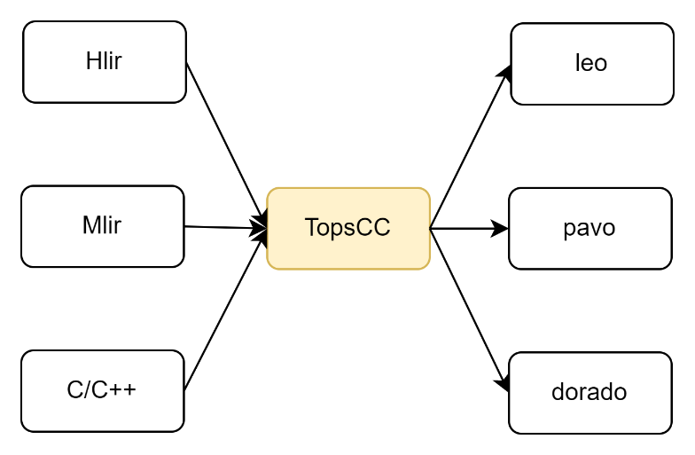
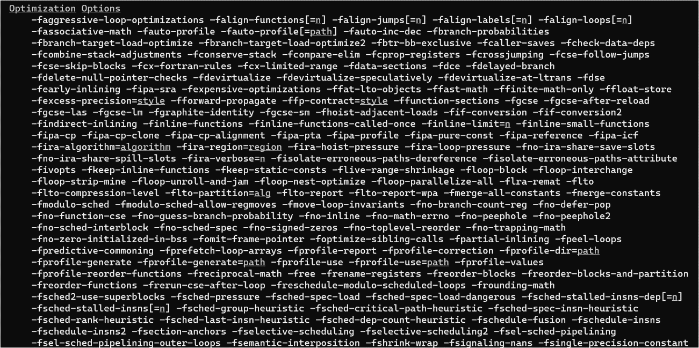

# 第 1 章 导论

本章是整个课程的第一章，主要介绍了一下文章的起源，编译器的历史和相关概念。

为了方便后面LLVM的代码和编译器理论相结合，本章最后介绍了LLVM源代码的基本目录结构。

黄昏是我一天中视力最差的时候，一眼望去满街都是美女。

——孟京辉《恋爱的犀牛》

## 1.1 什么是编译器

编译器这个概念是从英语翻译过来的，英文compiler这个单词最早出现在14世纪最早出现在古法语里面，起源于13世纪的compile一词。Compile按词根拆分可以形成com和pile两段，其中com是强调的意思，pil和pile、pellet源头相同，意思是堆。把2个词根连起来，就形成了compile， compile的字面意思就是把一堆东西堆起来，引申出来就是堆积，汇集的意思。古法语对compile + r的意思和现代英语类似，意思就是什么什么的人，这里compiler就是把一堆东西堆起来，汇聚起来的人，引申出来编译书籍的编辑，编辑者，汇编者。

中文的编译器中的器首先就把人排除在外了，明显说的是某个工具。编译器的编和译分别表示了两层含义。

《史记·孔子世家》上说“孔子晚而喜《易》，序彖、系、象、说卦、文言。读《易》，韦编三绝”，也就是说孔子晚年，喜欢读《易经》，整理了《易经》的《彖》、《系》、《象》、《说卦》、《文言》等章节。读《易经》，翻的次数太多，牛皮都翻烂了。这里说的“韦编”的韦就是牛皮，编就是用来把竹简连起来的带子，古代的书都比较珍贵，孔子看的这个《易经》是用牛皮串起来的竹简，翻烂了三次，不知道这本书是不是他自己的，要不然书的主人估计要和他没完。扯远了，说这个例子是想说中文的“编”主要是把知识连接起来，和英语里面的compile意思很像。

相对于“编”的直译，“译”更像是意译了。《说文解字》上说“译，传译四夷之言者。”，这个和现代说的翻译的概念是一样的，就是把一种语法翻译成另外一种语言。

编译器之所以被称为编译器，前端做的基本上是编的工作，就是收集语言的语法、语义，并按需求做一下排序或者归并；中端既有编的工作，也有译的工作，其中一些分析类工作可以称为编，一些优化类工作可以称为译（用另外一种说法描述程序的语义）；后端基本上都是译的工作，将程序的语义，用完全不一样的另外一种语言来表达。

## 1.2 编译器缔造者

计算机科学发展到现在，程序员面对的编程语言从最底层的机器码，到各种汇编语言，基础的C语言，到各种高级语言，到现在的无代码平台，为了提升程序员的生产力，编程语言不断抽象，越来越接近现实人类世界。

相对的，物理层面，芯片本身也在不断更新换代，新的硬件技术层出不穷，怎么让很久之前写的老代码在新的芯片架构上运行，并且发挥出更高的性能，是每个芯片设计商，尤其是芯片设计厂商中的编译器团队，需要特别关注的。

编译器就是人类世界和机器世界的桥梁，没有编译器编程语言做的任何优化都无法落地，更加谈不上更高性能。

## 1.3 课程目标

### 1.3.1 了解编译过程

•	编译器如何自动的将程序转换成计算机可识别的代码（学习编译器的前端、中端和后端各自的职责是什么？）

•	转换过程中要保留原始语义（如何分析代码的语义？）

•	转换之后的代码在时间、空间和能耗上综合性能更高

•	我们尤其关注运行时间（当前代码里面哪些代码对最终结果是无意义的，可以删除的？怎么通过一种新的逻辑能实现当前语义但计算量更小？）

图1.1是《Computer Architecture: A Quantitative Approach》中整理的20世纪70年代末，也就是VAX-11处理器诞生以来，计算机硬件性能变化图。计算机硬件的性能在1978年到2012年的34年内提升了24129倍，但最后十年的增长率相对于之前的二十多年已经明显降速了。从图上可以看出VAX-11诞生的1978年到VAX8700诞生的1986年，计算机硬件性能每年平均提升25%；但从1986年到2003年，计算机硬件每年平均提升52%；2003年以后，硬件的性能提升速度又降了下来，变成了22%。

图1.1 从20世纪70年代末以来处理器性能变化

相比较而言，软件的提速度就要慢很多。

Proebsting定律：编译器每隔18年可以把代码的算力提升一倍。

按照Proebsting定律，每18年翻一倍，平均下来每年的提升其实只有4%（1.0418≈2）。

尽管如此，由于编译器的优化除了研发成本，复制成本几乎为0，所以即使是4%，对大规模集群而言，也是非常可观的，相对于新增硬件采购的成本而言，软件优化的成本基本上可以忽略不计。

### 1.3.2  理解程序的底层语义

学完这个课程，可以学习到：

代码的静态分析技术。通过代码的语法分析和语义分析，构建代码的控制流和数据流图等。

通过静态分析来优化性能。由于一段代码实际要做的就是通过一个输入生成一个输出，只要确保输出不变的情况下，完全有可能有一些更快的实现方案。

通过静态分析来证明程序的正确性。静态分析可以通过数学的方式证明一种计算能达到要求的值。

通过静态分析来发现代码的bug。静态分析可以发现一些异常场景导致的程序异常，并提示程序员进行修复，甚至自动修复。

代码性能优化的技术有很多：

删除冗余拷贝。冗余代码的体现有一些是源代码本身就存在的，例如用户定义了多余的变量或者函数，但实际上没可能用到，这些变量或者函数定义就是冗余代码。也有一些是指令生成过程中产生的，例如编译器将一个内存中的变量拷贝到寄存器中，如果这个内存中的值后续不需要回写，完全可以将对应的值直接写到寄存器中，减少不必要的拷贝。

常量折叠。通过常量的折叠，在编译器就把能计算出来的值一次性计算好，运行期就可以直接用。

Lazy Code Motion（延迟执行）。部分流程产生的输出被其他流程当做输入的概率非常低，通过延迟执行，可以在大多数情况下减小多余的代码执行。

寄存器分配。通过将部分内存变量优化成寄存器（尤其对寄存器特别多的现处理器而言），可以有效的提升运行效率。函数调用过程中的入参和出参使用寄存器，可以有效减少堆栈切换开销。当然，这些分配的前提是整个执行流程中的寄存器使用不能冲突。

循环展开。循环的反复从循环体开始执行，会破坏流水线的加速效果，如果通过把两次或者多次循环执行的过程，转换成一个顺序执行，可以有效降低循环的次数，达到加速流水线的效果。

值标记。通过值标记，可以很清楚的知道当前使用的变量的版本（如果一个变量的值修改一次，我们认为它的版本增加了一个）。

计算强度降维。一些高阶的计算可以通过等价变换变成低阶的计算。例如乘2操作，可以转换成移位。

等等。编译器的技术一直的进步，每年都会有一些新的研究成果集成到最新的编译器中。

哪些bug是编译器能发现的：

空指针求值。虽然不是所有空指针都能被编译器发现，但如果通过代码的静态分析，定是空指针的语义错误，编译器都会给出相应的提示。

数组越界。数组越界和空指针的检测类似，主要是通过一些常量的折叠技术，或者通过语义里面本身增加的阈值检查，发现静态分析就能推导出来的数组越界。

非法类转换。根据不同语义的特性，一般类型强制转换必须是有继承关系的，要不然就要通过void指针做个接力转换。很明显的对象和指针之间的强制转换是明确禁止的。

缓冲区溢出漏洞。缓冲区溢出的检测和数组越界非常像，不过缓冲区溢出针对的是栈上的变量，栈上变量溢出会导致堆栈被破坏，如果堆栈上被有选择的填充特定的值序列，会导致执行非法代码。

整数溢出。相对于数学中的理论整型，编程语言中的整型都是数学整型的一个子集，所以当某个整数在跨这个子集的边界做算术运算的时候，会存在溢出的可能性。例如将一个int8类型和大于255的整数做比较，就是明显的整数溢出的例子。编译器能检测到某些判断是永远为真或者永远为假的，会提示程序员这里可能有错误。

信息泄漏。信息泄漏问题是安全领域近期的热点，主要体现在将一些敏感信息明文放到各级缓存，如果其他用户能够获取到访问物理内存或者缓存的权限，这些信息就会存在泄漏的风险。

下面代码里面有个安全漏洞，看看大家能否找出来？

void read_matrix(int* data, char w, char h) {

char buf_size = w * h;

if (buf_size < BUF_SIZE) {

int c0, c1;

int buf[BUF_SIZE];

for (c0 = 0; c0 < h; c0++) {

for (c1 = 0; c1 < w; c1++) {

int index = c0 * w + c1;

buf[index] = data[index];

}

}

process(buf);

}

}

提示，变量存在整数溢出，导致一些边界判断失效。

## 1.4 课程主要内容

课程大纲：

1.导论

2.控制流图CFG

3.数据流分析

4.工作列表算法

5.指针分析

6.循环优化

7.静态单赋值SSA

8. 寄存器分配

9.

分支分析

附录A XLA的缓冲区指派

## 1.5 常见的编译器的架构

每个编译器都有自己的前端、中端和后端，其中前端对接各种编程语言，对编程语言本身进行语法和语义分析，中端负责代码优化，后端对接各种硬件架构，负责生成对应硬件下的可执行软件。当前课程主要专注于中端的功能，也就是代码本身的分析和优化。

图1.2 编译器的架构

下面是一些常见的编译器框架，大家哪些框架用的比较多？

图1.3 基于LLVM的编译框架

图1.4 基于WebAssembly的编译框架

图1.5 基于Java字节码的编译框架

图1.6 燧原科技当前各个芯片的编译框架

其中最后一个是燧原科技基于LLVM研发的GCU编译器TopsCC，可以将上层IR（hlir）、多层IR（MLIR）和C/C++代码转换成燧原自己的leo、pavo和dorado等芯片上运行的代码。

## 1.6 完美编译器

完美的编译器，基于当前的程序P，生成Popt，后者保持同样的输入和输出流，但程序规模最少。

但由于输出很难界定，所以不可能存在完美的编译器。例如一个永不终止的程序的最简版本是这样的：

Pleast= L: goto L;

但这个代码不解决实际问题。

所以，对于任意一个图灵完备语言，总是有办法产生一个更好的编译器。

## 1.7 为什么要学习编译器

### 1.7.1成为更好的程序员

gcc编译中有很多优化选项，下图是gcc5.4的不完全的优化选项列表：

图1.7 gcc 5.4的部分优化选项列表

如果想要知道这些优化选项分别是什么含义，并且应该在什么场合使用哪些特定的优化选项，什么情况下不能打开某个优化选项？这对程序的性能优化会非常有帮助。

通过对编译器的了解，也可以消除一些误解。

有的人认为少用变量名，所有变量都复用一个名称会减少内存占用？

也有人认为应该少用继承，这样函数调用过程中的遍历会减少？

使用宏比函数能减少函数调用过程中的开销？

上面这些疑问，如果学完编译器课程，都会得到答案。

### 1.7.2更多的工作机会

很多高级岗位都要求C/C++专家，熟悉计算机的理论，编译器理论是称为编程语言专家的标签之一。

很多大型公司本身就要发布自己的编译器版本。

还有一些专门做编译器或者编译优化的公司。

常见的人工智能的训练和推理框架里面都自带一些类似编译器的编译优化功能。

### 1.7.3更好的计算机科学家

理解编译器技术在geek圈也是非常酷的事。作为一个计算机科学家，学好编译器的原理，可以打破一些理论知识的局限。

## 1.8 编译器课程的相关知识

编译器是计算机科学各种理论的综合系统。

### 1.8.1编译器涉及的理论知识

算法（图论，集合论，动态规划）

人工智能（贪婪算法，机器学习）

自动机理论（DFA确定有限自动机，解析器生成器，上下文无关语法）

线性代数（栅格，定点理论，伽罗瓦连接，类型系统）

体系架构（流水线管理，内存体系架构，指令集）

优化（运算研究，负荷均衡，打包，调度）

### 1.8.2动态分析

打点采样，例如gprof，火焰图

测试用例生成，例如Klee

仿真，例如valgrind，CFGGrind

编排，例如AddressSanitizer

### 1.8.3静态分析

数据流分析

基于属性的分析

类型分析

## 1.9 理论基础

### 1.9.1图论

很多地方用到图论，包括但不限于：

控制流图。用来分析控制流的特性。

属性图。用来分析各个对象的属性约束关系。

依赖图。用来分析各个图中各个节点之间的依赖关系。

强连接组件图。每个连通图都可以通过强连接组件图来进行运算。

图的着色。在寄存器分配等领域有非常多的应用。

如果会一些拓扑学知识，对这些图的运算理解会有很大帮助。

### 1.9.2不动点原理

如果总的信息是有限的，每次迭代都会有新的信息增加的情况下，稳定的算法的迭代是否会终止？不动点原理是程序分析的理论基础。

### 1.9.3 程序演示方法

抽象语法树。通过抽象语法树展示各片段之间的关系。

控制流图（SSA表）。控制流图是对程序逻辑的抽象。

程序依赖图。程序依赖图用来对变量之间的关系进行推导。

属性系统。属性系统用来演示各种约束关系。

### 1.9.4 用dot语言作图

画上面这些图，如果都从头一笔一笔画，非常费劲，所以能熟练掌握dot语言，并使用dot语言描述出图的内容，用dot的工具生成svg或者其他格式的图，会极大的提高效率。

## 1.10 开源社区

GCC：影响最广的编译器相关开源社区，网址https://gcc.gnu.org/。GCC和GLIBC是著名的linux内核的基础。

LLVM：新兴的编译器社区，以模块化和前后端解耦著称，网址https://llvm.org/，LLVM还有一些子项目，MLIR和clang等是其中最有名的几个。

WebAssembly：web界最有名的编译器框架，底层使用LLVM的IR作为中间层，网址https://webassembly.org/

方舟编译器：华为推出的资源编译器，第一个国产的编译器开源软件，网址https://code.opensource.huaweicloud.com/HarmonyOS/OpenArkCompiler/home

Yadcc：腾讯推出的开源编译器，在腾讯技术帝国里面享誉颇多，网址https://github.com/Tencent/yadcc

## 1.11 会议和杂志

### 1.11.1 国外会议和杂志

PLDI: Programming Languages Design and Implementation，中文名编程语言设计与实现，是研究人员、开发人员、实践者和学生展示编程语言设计和实现研究的主要论坛。

POPL: Principles of Programming Languages，编程语言原理研讨会讨论编程语言、编程系统和编程接口的设计、定义、分析和实现方面的基本原理和重要创新。每年都会选出一篇“最具影响力”的POPL论文，并在POPL进行演讲。

ASPLOS: Architectural Support for Programming Languages and Operating Systems，编程语言和操作系统体系结构支持国际会议为科学家和工程师提供了一个高质量的论坛，以展示他们在这些快速变化的领域的最新研究成果。它囊括了过去15年的一些主要计算机系统创新（例如，RISC和VLIW处理器、小型和大规模多处理器、集群和工作站网络、优化编译器、RAID和网络存储系统设计）。

CGO: Code Generation and Optimization，代码生成和优化国际研讨会（CGO）是一个聚集了在硬件和软件界面工作的研究人员和实践者，讨论广泛的优化和代码生成技术和相关问题的主要场所。会议涵盖了从纯静态到完全动态的方法，从纯基于软件的方法到特定的体系结构特性以及对代码生成和优化的支持。

CC: Compiler Construction，国际编译器构造会议(CC)对最一般意义上的处理程序的工作感兴趣:分析、转换或执行描述系统如何运行的输入，包括作为特殊情况的传统编译器构造。CC是ACM SIGPLAN（The ACM Special Interest Group on Programming Languages，ACM编程语言特别兴趣小组）会议，执行SIGPLAN推荐的指导方针和程序。CC 2022与CGO、HPCA和PPoPP共存。

TOPLAS – ACM Transactions on Programming Languages and Systems，ACM编程语言与系统汇刊是报告编程语言和辅助编程任务的系统领域的最新研究进展的主要期刊。论文可以是理论风格的，也可以是实验风格的，但无论在哪种情况下，它们都必须包含创新和新颖的内容，推动编程语言和系统的艺术状态。这个是国外与编程语言相关的比较著名的唯一期刊，其他都是会议。

### 1.11.2 国内杂志

国内的杂志大家都听说的比较多，就不多介绍了，当前排名比较靠前的与计算机相关的主要有计算机学报，软件学报，自动化学报，计算机科学等。

## 1.12 振奋人心的时代

每隔一段时间都会有编译器相关的新语言，新概念，新方法，新工具问世。

诞生于21世纪初的Rust编程语言，引入了所有者类型，吸取了C++智能指针设计上的优点，能够自动进行生命期管理，通过编译期的检查有效减少了内存泄漏的问题。

Scala的依赖类型是基于某个值作为某个类型的约束生成新的类型，而路径依赖类型是基于路径的依赖类型，可以通过在类型里面增加特定的类型描述字段让编译器知道哪些类型是一类的。路径依赖类型类似C++的RTTI，不过路径依赖类型主要服务于编译期，方便程序员尽早发现问题。

Haskell的函数式编程。函数式编程让代码更加简洁，看起来更像一篇文章，而不是数学公式的堆积。

量子计算。全新的材料和底层原理，相同的是编译和优化的理论。

张量编译器。GPU引入的大量矩阵和张量的计算，内存占用和代码并行模式，和传统的CPU都有明显区别，需要针对这些新特性优化编译器的功能。

WebAssembly。一直以来web都是低速的代名词，但WebAssembly可以将场景的网页上的脚本语言转换成本地芯片认识的汇编语言，极大的提升了网页的浏览效率。

LLVM和clang对c/c++的编译检查和代码优化。LLVM以模块化和前后端解耦的形态出现在编译器领域，多个芯片产商联合打造的一个开源的编译器。在前端和后端能够同主要的优化逻辑——编译器中端——进行解耦的前提下，各个芯片产商只用关注自己的后端，各个新的编程语言设计者只用关注自己的前端，极大的提升了一个新的编程语言的落地速度，也给各个芯片产商的产品走向客户提供了便利。

Coverity、Valgrind等一系列开源或者商用的静态检查工具。之前都是付费的一些检查和优化工具，甚至是付费的人肉检查和优化，被这些开源的静态检查工具分担了不少，也对整个产业界的代码质量提升提供了帮助。

## 1.13 编译器的未来

展望未来，编译器发展方向可能主要体现在以下一些方面：

并行计算。尤其是基于异构模型的并行计算。由于受到物理的限制，单个处理核的处理能力上限基本上不太可能有大的飞跃了，根据不同处理场景设计的不同的IP在相互协作的情况下对数据进行处理，对整体性能的提升非常明显，CPU、DPU、GPU、NPU等不同的XPU概念都是基于这种异构模型设计出来的。现在的异构加速基本上需要堆上很多人力来做特定场景的优化，如果能靠编译器实现相关功能，就能极大的提升效率。

动态语言。能够在运行时修改的语言可能在程序不退出的情况下修改业务逻辑，这对升级非常麻烦的超大系统是个巨大的诱惑。常规的解释性语言性能太差，各大软件厂商通过自研的热补丁功能可能在部分场景下满足类似动态语言的特性。eBPF是对内核的动态性的有意义尝试。

正确性。由于人本身的发挥不确定性，会导致人生成的代码难免会有一些问题，如果编译器能尽可能多的发现一些程序本身的问题，这样可以尽可能早的发现并解决问题，给故障的自动发现和自动修复提供了可能性。

安全。安全性和正确性的分析对编译器而言是类似的，不过两者的关注点不同，正确性考虑的是同样的输入的前提下生成同样的输出，安全性考虑的是异常场景下程序的副作用。

## 1.14 优化编译器简史

1951-1952年，工作在Eckert-Mauchly Computer Corporation的Grace Hopper开发的面向UNIVAC I的A0系统是第一个有文献记载的编译器实现。

第一代优化编译器，Fortran。

早期代码优化，Frances E. Allen和John Cocke引入控制流图，数据流分析，进程间数据流分析，工作列表算法。

Gary Kildall，代码优化和分析之父，数据流单调框架，信息折叠，迭代算法，不动点原理。

Abstract Interpretation，程序的静态行为表达。

寄存器分配，1981年Gregory Chaitin利用图着色理论引入了寄存器分配算法；1999年Poletto and Sarkar将线性扫描算法引入JIT编译器。

SSA，80年代后期，Cytron等引入SSA范式，这之后SSA经过多次改进，现在被广泛用到几乎所有编译器中。

1988年，Olin Shivers在PLDI上引入了控制流分析法，多人创立了指针分析法。

类型理论最早是美国约翰•霍普金斯大学心理学教授霍兰德于1959年首次提出的，作为现代编程语言的基本特性，不同编程语言在类型理论中各自站队，满足集合论、弱类型语言、强类型语言、泛型语言，不同类型的编程语言设计出来为了满足不同的应用场景。

## 1.15 初识LLVM

### 1.15.1 获取LLVM源代码

本书引用的LLVM的源代码，均来自LLVM社区，选取了11.0.0版本作为定格版本，该版本源代码下载地址：

https://github.com/llvm/llvm-project/releases/download/llvmorg-11.0.0/llvm-project-11.0.0.tar.xz

读者如果有兴趣也可以自己下载解压来查看，后面各章的实现分析中提到的源代码位置，如果没有特别说明，都是基于该软件包解压出来的相对路径。

后面摘录的代码里面也都有行号，不过由于增加新的注释之后，后续代码的行号会发生变化。本着方便大家对照查阅的目的，每个代码段的起始行号尽量和原始代码行号保持一致，这样处理可能，。

上面链接里面是llvm-project monorepo source code，意思是把LLVM关联项目的源代码也打包在了一起，这样可以单独下载编译，不用的编译过程中另外下载外部库，这里涉及的外部库包括libc++这个C++标准库（社区地址https://libcxx.llvm.org）和lld链接器（社区地址https://lld.llvm.org）等等。

### 1.15.2 编译llvm源代码

早期的llvm版本是用makefile构建编译的，但从2.5版本开始，统一切换到CMAKE来构建，所以要编译llvm，需要在编译机上安装cmake。CMake的安装大家可以参照https://cmake.org/install/，这里就不细说了。CMake一般和Ninja配套使用，所以建议大家也安装一下Ninja，安装方法参见https://www.ninjaframework.org/documentation/getting_started/installing_ninja.html。

CMake编译llvm的命令如下：

cd llvm-project

mkdir build

cd build

cmake -G <generator> [options] ../llvm

其中generator我们一般选择Ninja，常见的options有下面几种选项：

-DLLVM_ENABLE_PROJECTS='...' 配置需要编译的项目，一般推荐clang、libcxx和libcxxabi，也就是这样配置：

-DLLVM_ENABLE_PROJECTS="clang;libcxx;libcxxabi"

-DCMAKE_INSTALL_PREFIX=directory --- 安装目录，默认 /usr/local，一般情况下不用修改，就可以不配置这个参数。

-DCMAKE_BUILD_TYPE=type --- 编译类型，默认是Debug版本，对我们研究llvm的读者而言，用Debug也非常友好，不用修改。

-DLLVM_ENABLE_ASSERTIONS=On 是否需要打开assert选项，默认是debug打开，也可以不改。

除了这些，还有一些其他编译配置，后面需要定制llvm的时候，可能会用到，等大家需要的时候再研究。总结下来上面的cmake配置命令一般推荐值是：

cmake -G Ninja -DLLVM_ENABLE_PROJECTS="clang;libcxx;libcxxabi" ../llvm

配置完之后敲ninja可以开始编译，敲ninja install的话，除了编译，还会触发把编译好的版本拷贝到安装目录。

### 1.15.3 LLVM的代码结构

11.0.0版本的LLVM源代码中，顶级目录有19个，其中：

clang和flang分别是C/C++和fortran的前端

clang-tools-extra是clang的一些分析工具

compiler-rt是clang编译的程序的运行时支持库

debuginfo-tests是用来检查编译器生成的支持gdb或者lldb调试的符号信息的正确性的测试用例

libc、libcxx和libcxxabi分别是底层的C库和C++库，其中带abi的是abi=1的c++库。LLVM的c库不是闭包，虽然自带一个c库，但它仍然需要链接glibc的c库函数。

libclc是一个开源的OpenCL库，用来支持OpenCL的C接口调用

libunwind是一个开源的生成程序调用链的C库

lld是LLVM的链接器，对应gcc的ld或者ld.gold

lldb功能类似gdb，但垃圾信息比gdb少，错误提示比gdb也更好用。

llvm是LLVM层的核心源代码，主要实现了常见的中端优化算法和后端功能

mlir是LLVM的一个子项目，主要是为了支持异构计算、多种编程语言和多种中间表达的合并

openmp是clang自带的openmp库，openmp是一个跨平台基于共享内存的并行编程库

parallel-libs是LLVM的并行计算库

polly使用polyhedral模型，对LLVM的IR进行优化

pstl是LLVM自带的并行计算的STL（标准模板库）库实现

utils是为了让代码更加美化，对clang-format的一个封装

| 1 | clang/ |
| --- | --- |
| 2 | clang-tools-extra/ |
| 3 | compiler-rt/ |
| 4 | debuginfo-tests/ |
| 5 | flang/ |
| 6 | libc/ |
| 7 | libclc/ |
| 8 | libcxx/ |
| 9 | libcxxabi/ |
| 10 | libunwind/ |
| 11 | lld/ |
| 12 | lldb/ |
| 13 | llvm/ |
| 14 | mlir/ |
| 15 | openmp/ |
| 16 | parallel-libs/ |
| 17 | polly/ |
| 18 | pstl/ |
| 19 | utils/ |

