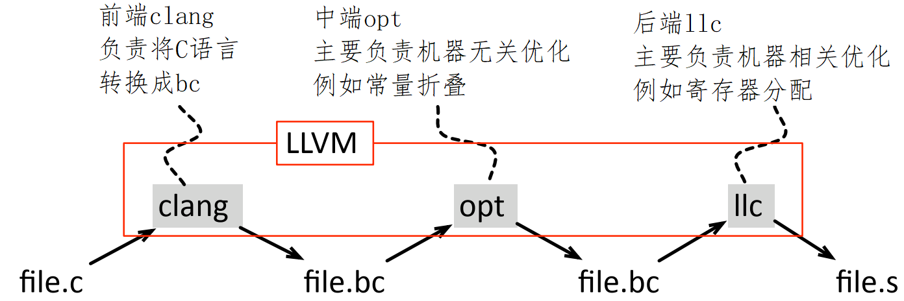
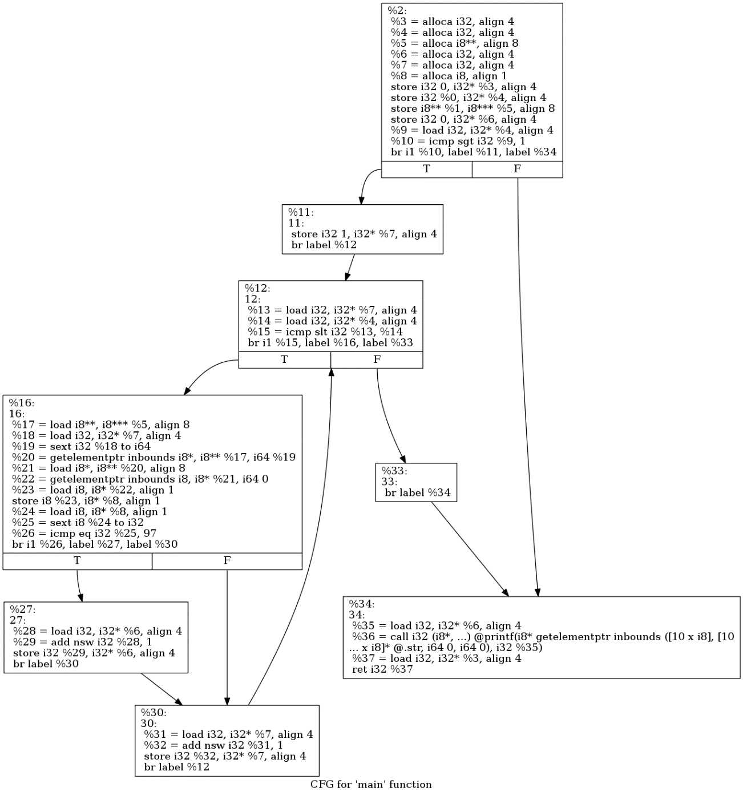
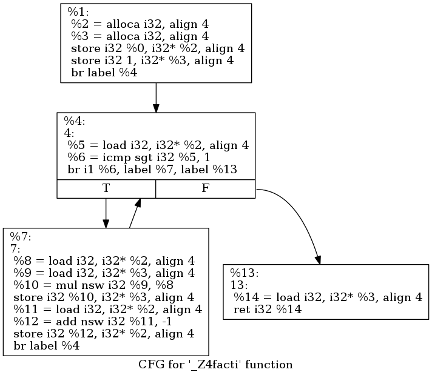
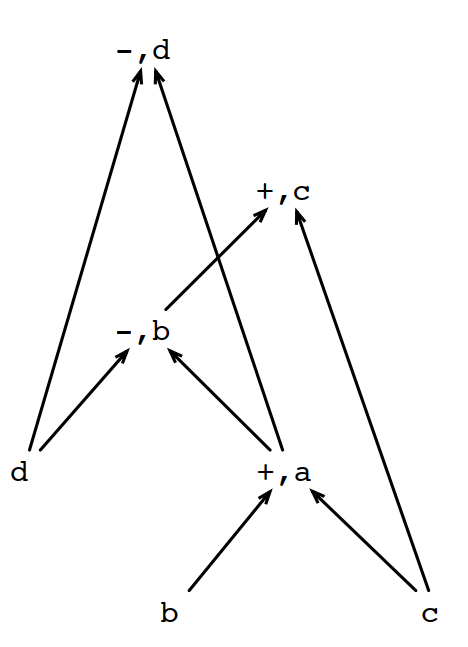
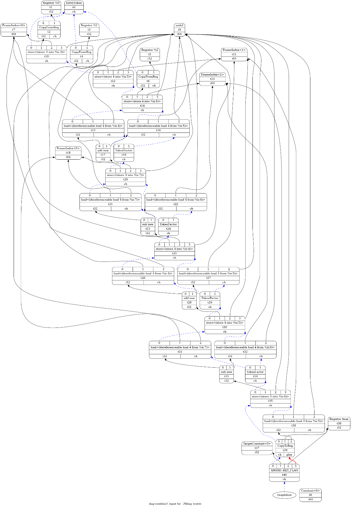
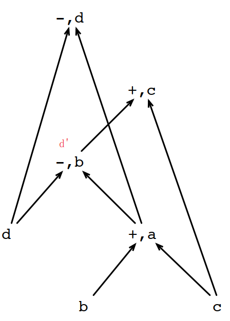
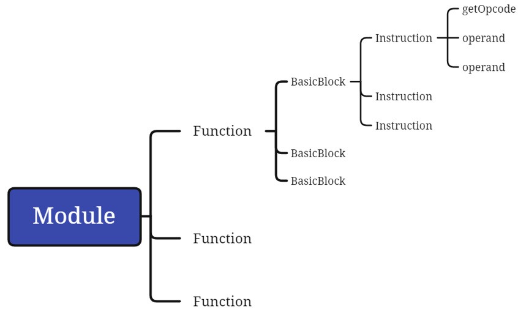

# 第 2 章 控制流图

本章是系列文章的第二章，介绍了基于控制流图的一些优化方法。包括DAG、值标记、相同子表达式等方法。本节后半介绍 LLVM 的一些基本概念，并引导读者编写一个简单的 pass。

汤、武因夏、商之民也，得所以用之也。管、商亦因齐、秦之民也，得所以用之也。民之用也有故，得其故，民无所不用。用民有纪有纲，一引其纪，万目皆起，一引其纲，万目皆张。

——吕不韦《吕氏春秋·用民》

## 2.1 基本概念

### 2.1.1 中间程序表达

优化编译器和人类检视代码的角度是不一样的。

人类更关注源代码，但源代码和机器码相差太大，另外，从工程师的角度，最好能有一种通用的方法来表示不同编程语言，并且面向不同的target硬件架构，这种通用的表达我们通常称为程序的中间表达（Intermediate Representations），简称IR。针对不同层，我们经常会看到不同的IR，高级的有HLIR，低级的有LLIR，还有多级的IR，叫MLIR（Multi-Level Intermediate  representation，有时MLIR也会当做中级IR，也就是Middle Level IR的简称）。

### 2.1.2 控制流图CFG

控制流图是编译器表示程序的一种方式。

控制流图是BB（Basic Block，基本块）为结点，根据程序在BB之间的流动方向作为有向边的有向图。

### 2.1.3 LLVM

LLVM是The Low Level Virtual Machine（低级虚拟机）的简称，是当前各种研究领域最常用的编译器，也是很多大公司普遍使用的编译器。和其他编译器一样，LLVM分为前端（clang），中端（opt）和后端（llc）。

图2.1 LLVM的前端中端和后端

llvm可以帮我们生成dot格式的CFG，例如对2.1.cc：

| 1 | #include<stdio.h> |
| --- | --- |
| 2 | int main(int argc, char** argv) { |
| 3 | int sum = 0; |
| 4 | if (argc > 1) { |
| 5 | int i = 1; |
| 6 | while (i < argc) { |
| 7 | char c = argv[i][0]; |
| 8 | if (c == 'a'){ |
| 9 | sum++; |
| 10 | } |
| 11 | i++; |
| 12 | } |
| 13 | } |
| 14 | printf("sum = %d\n", sum); |
| 15 | } |

可以先用clang将c源文件转换成bc文件，然后用opt转换成dot文件，如果环境上有dot工具，用dot工具将dot文件转换成windows认识的svg或者png文件，推荐svg，因为文本可以拷贝。

clang -c -emit-llvm 2.1.cc -o 2.1.bc

opt -view-cfg 2.1.bc

WARNING: You're attempting to print out a bitcode file.

This is inadvisable as it may cause display problems. If

you REALLY want to taste LLVM bitcode first-hand, you

can force output with the `-f' option.

Writing '/tmp/cfgmain-f1b1f8.dot'...  done.

Running 'dotty' program... Remember to erase graph file: /tmp/cfgmain-f1b1f8.dot

dot -Tpng /tmp/cfgmain-f1b1f8.dot >2.1.png

将刚刚生成的2.1.png拷贝到windows，用浏览器可以打开对应c/c++或者bc文件的CFG，如图2.2。

图2.2 一个简单main函数的控制流图

此处的控制流图较常规 CFG 更为复杂，因其基于 LLVM IR 生成，类似汇编，且包含从内存加载到寄存器的操作（LLVM IR 中的寄存器通常称为虚拟寄存器，在向目标硬件发射指令时需映射到物理寄存器，不足时需做溢出处理）。

LLVM用一种指令的序列来表达程序，这些指令的序列称为bytecodes，或者简称bc。LLVM的指令又称为LLVM IR，LLVM IR和target机器没有绑定关系，是一种类汇编的代码，LLVM的汇编代码的详细说明参见https://releases.llvm.org/2.6/docs/LangRef.html。

### 2.1.4 基本块（Basic Blocks）

基本块是满足下面属性的最大的连续指令序列：

控制流只能从基本块的第一行开始执行（不能有jump执行块中间的某行代码），

除非是基本块的最后一条指令，否则不允许包含离开基本块的分支或挂起指令。

后续文章中，我们经常把基本块简称为BB。

### 2.1.5 基本块的首领（leader）

基本块首领的定义如下：

代码的第一行是基本块首领，

任何条件或者非条件跳转指令的目标行是基本块首领，

任意条件或者非条件跳转指令的下一行是基本块首领。

### 2.1.6 基本块的界定方法

了解了基本块和基本块首领的定义之后，可以得出界定基本块的方法：

基本块的首领是基本块的一部分

基本块首领到下一个基本块的首领直接的代码，属于该基本块

下面是一个简单的例子：

| 1 | int fact(int n) { |
| --- | --- |
| 2 | int ans = 1; |
| 3 | while (n > 1) { |
| 4 | ans *= n; |
| 5 | n--; |
| 6 | } |
| 7 | return ans; |
| 8 | } |

这个函数用opt生成的CFG是这样的：

图2.3 阶乘函数的控制流图

控制流程图中的每个方框就是一个基本块，而方框中的第一条指令就是基本块的首领。可以看出，对while循环，循环控制部分和循环体是两个不同的基本块。上面图标题中的“_Z4facti”是函数原型fact(int)经过C++的语法转换之后的结果。

### 2.1.7 本地优化和全局优化

作用于在一个BB内部的优化称为本地优化。常见的有：

基于DAG的优化

窥孔优化

本地寄存器分配

基于整个程序的优化称为全局优化。本课程介绍的大多数优化都是全局优化。

## 2.2 基于程序DAG的优化

### 2.2.1 程序的有向无环图（Directed Acyclic Graph）

程序的有向无环图的定义如下：

每个输入值对应DAG中的一个结点，

BB中的每行指令生成一个结点，

如果指令S用到了指令S1, ..., Sn中的变量，画一条从Si, i∈{1, ..., n}到S的边，

BB中定义但未在BB中使用的变量称为输出值。

有向无环图的英文简称是DAG。

例如下面的BB：

| 1 | a = b + c |
| --- | --- |
| 2 | b = a – d |
| 3 | c = b + c |
| 4 | d = a – d |

生成的DAG是这样的：

图2.4 简化版DAG

LLVM也支持自动生成DAG，不过LLVM生成的DAG是基于LLVM IR，所以如果是用高级语言写的代码，转换成LLVM IR的时候会有很多寄存器相关的操作，这样DAG显得非常大，例如上面的代码，如果要编译成LLVM IR的话，还需要封装一个函数，变成：

| 1 | int dag_test(int b, int c, int d) { |
| --- | --- |
| 2 | int a = b + c; |
| 3 | b = a - d; |
| 4 | c = b + c; |
| 5 | d = a - d; |
| 6 | return c; |
| 7 | } |

保存成bb2.cc，然后用clang生成对应的LLVM IR：

| clang -c -emit-llvm bb2.cc |
| --- |

生成的 LLVM IR 自动取名 bb2.ll，内容如下：

| 1 | ; ModuleID = 'bb2.cc' |
| --- | --- |
| 2 | source_filename = "bb2.cc" |
| 3 | target datalayout = "e-m:e-p270:32:32-p271:32:32-p272:64:64-i64:64-f80:128-n8:16:32:64-S128" |
| 4 | target triple = "x86_64-unknown-linux-gnu" |
| 5 | ; Function Attrs: noinline nounwind optnone uwtable |
| 6 | define dso_local i32 @_Z8dag_testiii(i32 %0, i32 %1, i32 %2) #0 { |
| 7 | %4 = alloca i32, align 4 |
| 8 | %5 = alloca i32, align 4 |
| 9 | %6 = alloca i32, align 4 |
| 10 | %7 = alloca i32, align 4 |
| 11 | store i32 %0, i32* %4, align 4 |
| 12 | store i32 %1, i32* %5, align 4 |
| 13 | store i32 %2, i32* %6, align 4 |
| 14 | %8 = load i32, i32* %4, align 4 |
| 15 | %9 = load i32, i32* %5, align 4 |
| 16 | %10 = add nsw i32 %8, %9 |
| 17 | store i32 %10, i32* %7, align 4 |
| 18 | %11 = load i32, i32* %7, align 4 |
| 19 | %12 = load i32, i32* %6, align 4 |
| 20 | %13 = sub nsw i32 %11, %12 |
| 21 | store i32 %13, i32* %4, align 4 |
| 22 | %14 = load i32, i32* %4, align 4 |
| 23 | %15 = load i32, i32* %5, align 4 |
| 24 | %16 = add nsw i32 %14, %15 |
| 25 | store i32 %16, i32* %5, align 4 |
| 26 | %17 = load i32, i32* %7, align 4 |
| 27 | %18 = load i32, i32* %6, align 4 |
| 28 | %19 = sub nsw i32 %17, %18 |
| 29 | store i32 %19, i32* %6, align 4 |
| 30 | %20 = load i32, i32* %5, align 4 |
| 31 | ret i32 %20 |
| 32 | } |
| 33 | ; attributes #0 = { noinline nounwind optnone uwtable "correctly-rounded-divide-sqrt-fp-math"="false" "disable-tail-calls"="false" "frame-pointer"="all" "less-precise-fpmad"="false" "min-legal-vector-width"="0" "no-infs-fp-math"="false" "no-jump-tables"="false" "no-nans-fp-math"="false" "no-signed-zeros-fp-math"="false" "no-trapping-math"="true" "stack-protector-buffer-size"="8" "target-cpu"="x86-64" "target-features"="+cx8,+fxsr,+mmx,+sse,+sse2,+x87" "unsafe-fp-math"="false" "use-soft-float"="false" } |
| 34 | attributes #0 = { nounwind uwtable "disable-tail-calls"="false" "less-precise-fpmad"="false" "no-frame-pointer-elim"="true" "no-frame-pointer-elim-non-leaf" "no-infs-fp-math"="false" "no-jump-tables"="false" "no-nans-fp-math"="false" "no-signed-zeros-fp-math"="false" "stack-protector-buffer-size"="8" "target-cpu"="x86-64" "target-features"="+fxsr,+mmx,+sse,+sse2,+x87" "unsafe-fp-math"="false" "use-soft-float"="false" } |
| 35 | !llvm.module.flags = !{!0} |
| 36 | !llvm.ident = !{!1} |
| 37 | !0 = !{i32 1, !"wchar_size", i32 4} |
| 38 | !1 = !{!"clang version 11.1.0"} |
| 39 |  |
| 40 |  |
| 41 |  |
| 42 |  |
| 43 |  |
| 44 |  |

本书示例使用 LLVM 11 的 clang；生成的 LLVM IR 的 module 原始 attributes 为 35 行，该 attributes（optnone 会抑制优化）会导致无法生成 DAG，需改为 36 行的 attributes。

然后用 LLVM 的 llc（注意：LLVM 发布版默认为 release，若需查看 DAG 需自行从源码编译 debug 版；内网有编译好的 debug 版 LLVM 11，位于 /home/.devtools/efb/clang11/bin，读者可将其加入 PATH 后使用）将 LLVM IR 转为 dot 文件：

| llc -view-dag-combine1-dags bb2.ll |
| --- |

如果是命令行连接的linux系统，由于没有window可以展示，会提示生成了dot文件。读者可将 dot 文件转换为 svg 或 png 等格式；更推荐使用 svg，因其保留文本可拷贝，而 png 为纯位图不便复制。svg 图有时较大，在文档中作为截图易变形。生成 svg 的命令如下，若提示生成的 dot 文件名为 dag._Z8dag_testiii-3c598e.dot；若需 png，将参数中的 -Tsvg 改为 -Tpng，输出后缀改为 png 即可：

| dot -Tsvg dag._Z8dag_testiii-3c598e.dot > dag._Z8dag_testiii-3c598e.dot.svg |
| --- |

生成出来的dag._Z8dag_testiii-3c598e.dot.svg是文本文件，可以拷贝到支持HTML的浏览器中打开，效果如下（转换成LLVM IR之后的代码，增加了很多寄存器操作，所以虽然简单的7行代码，生成的DAG也非常夸张）：

图2.5 LLC生成的完整DAG

### 2.2.2 基于相同子表达式的优化

回到刚才画的简化版DAG，我们重复画图过程，增加利用相同子表达式优化的方法重新画一次：

对任意输入vi:

在DAG上画结点vi

并打上in标签

按BB中的顺序对每条指令v=f(v1, ..., vn)：

如果DAG中存在一个标签为f的结点v'，按顺序包含v的所有子结点，定义v'是v的一个别名

如果不存在，

画一个结点v，

对每个1≤i≤n，画一条边(vi, v)，

并给v打标签f

按上面的画法，到第4行的d的时候，就能发现它和第2行的b，拥有相同的子结点{d, a}并且顺序一样，所以第4行的d和第2行的b是别名关系。

图2.6 使用DAG发现相同子表达式

实际应用过程中，我们使用值标记的方法来计算相同子表达式：

对DAG的每个结点关联一个签名(lb, v1, ..., vn)，其中lb是该结点的标签，vi (1≤i≤n)是该结点的所有子结点。

将签名中的子结点序列作为hash函数的key，

hash函数的值就是该变量的值标记

当有新结点加入到DAG时，

先根据它的所有子结点计算出一个hash值，如果已经存在，我们直接返回该hash值对应对应的索引。

如果找不到，则创建该结点。

对上面的DAG，我们生成的值标记的hash表如下，最后一列很显然是不必要的：

| 表达式 | b | c | d | a=b+c | b=a-d | c=b+c | d=a-d |
| --- | --- | --- | --- | --- | --- | --- | --- |
| hash key | b | c | d | (+, 1, 2) | (-, 4, 3) | (+, 5, 2) | (-, 4, 3) |
| Value number | 1 | 2 | 3 | 4 | 5 | 6 | 5 |

### 2.2.3 CSE定理

为了找到更多的CSE（Common SubExpressions），需要制定更多的定理：

交换律：

对+运算符，x+y和y+x等同。

特性转换：

x<y一般转换成t=x-y; t<0

结合律:

对

a=b+c; t=c+d; e=t+b;

等同于：

a=b+c; e=a+d;

算术特性转换：

x+0=0+x=x;

x*1=1*x=x;

x-0=x;

x/1=x;

计算强度降维转换：

x2=x*x;

2*x=x+x;

x/2=x*0.5;

常量折叠：

在编译阶段计算表达式的值，并将表达式替换成对应的值。

### 2.2.4 死代码删除

死代码（Dead Code）是满足下面2个条件的DAG结点：

该结点没有子结点；

该结点不是输出结点。

上面的删除过程可以通过多轮迭代实现。

## 2.3 窥孔优化（Peephole Optimizations）

窥孔优化过程：

优化器分析一个指令的集合

每次只分析比较小的固定窗口内的指令

这个固定窗口不断往下滑动

当窗口内发现某种可以优化的模式，则执行该优化。

窥孔优化的实例：

冗余的load和store指令删除，

冗余分支指令的删除，

冗余调整指令的删除，

计算强度降维：除法 > 乘法 > 减法 > 移位/加法，

机器特有属性：addl > incl。

## 2.4 局部寄存器分配

局部寄存器分配的伪代码类似这样：

| 1 | allocate(Block b) { |
| --- | --- |
| 2 | for (Inst i : b.instructions()) { |
| 3 | for (Operand o : i.operands()) { |
| 4 | if (o is in memory m) { |
| 5 | r = find_reg(i) assign r to o add "r = load m" before i |
| 6 | } |
| 7 | } |
| 8 | for (Operand o : i.operands()) { |
| 9 | if (i is the last use of o) { |
| 10 | return the register bound to o to the list of free registers |
| 11 | } |
| 12 | } |
| 13 | v = i.definition r = find_reg(i) assign r to v |
| 14 | } |
| 15 | } |

溢出（spilling）：大多数情况下寄存器是有限的，需要在寄存器不够用的情况下将之前保存在寄存器里面的内容映射回内存，这个操作叫做溢出。

find_reg函数的伪代码是这样的：

| 1 | find_reg(i) { |
| --- | --- |
| 2 | if there is free register r |
| 3 | return r |
| 4 | else |
| 5 | let v be the latest variable to be used after i, that is in a register |
| 6 | if v does not have a memory slot |
| 7 | let m be a fresh memory slot |
| 8 | else |
| 9 | let m be the memory slot assigned to v |
| 10 | add "store v m" right after the definition of v |
| 11 | return r |
| 12 | } |

可以看出局部寄存器的分配，主要依赖在变量使用前插入"r = load m"指令，并在变量使用完之后插入"store v m"来实现。

但当寄存器不足的时候，要选择将哪个变量从寄存器溢出到内存里面？

伯克利算法策略：溢出时通常选择离溢出点最远的变量，也称为LRU（Least Recently Used，最近最少使用算法）。该算法在各种缓存溢出过程中广泛采用，包括页面置换，cache miss等过程。

对只有2个寄存器的机器，要实现下面的计算：

| 1 | a = load m0 |
| --- | --- |
| 2 | b = load m1 |
| 3 | c = a + b |
| 4 | d = 4 * c |
| 5 | e = b + 1 |
| 6 | f = e + a |
| 7 | g = d / e |
| 8 | h = f - g |
| 9 | ret h |

实际完成局部寄存器分配之后的代码和各变量在寄存器，内存里面的生命周期是这样的：

|  |  | R0 | R1 | ma | mb | md | mf |
| --- | --- | --- | --- | --- | --- | --- | --- |
| a = load m0 |  | a |  |  |  |  |  |
| store a ma |  | a |  |  |  |  |  |
| b = load m1 |  | a | b |  |  |  |  |
| store b mb |  | c | b | a |  |  |  |
| c = a + b |  | c | b | a |  |  |  |
|  |  | c | b | a |  |  |  |
| d = 4 * c |  | c | d | a | b |  |  |
| b=load mb; store d md |  | c | d | a | b |  |  |
| e = b + 1 |  | b | e | a | b | d |  |
| a=load ma |  | b | e | a | b | d |  |
| f = e + a |  | a | e | a | b | d |  |
| d=load md; store f mf |  | f | e | a | b | d |  |
| g = d / e |  | d | e | a | b | d | f |
| f=load mf |  | d | g | a | b | d | f |
| h = f - g |  | f | g | a | b | d | f |
|  |  | f | h | a | b | d | f |
| ret h |  | f | h | a | b | d | f |

图2.7 寄存器分配和溢出示例

上面的算法在这次运算中其实不是最优解。如果在"c=a+b"计算之前不把b踢出寄存器，而是在"d=4*c"计算中让d复用c的寄存器，就可以少store一次b并且少load一次b。

但在1998年就有科学家证明了，找到每次分配寄存器的最优解是NP完全问题（NP-completeness，是"nondeterministic polynomial-time completeness"的简称，也就是不确定的多项式时间完全问题，其中不确定性指的是不确定图灵机，是数学上形式化描述的暴力搜索算法。对确定性的算法，只需要进行一次迭代就能得出结果，对不确定的算法，需要遍历整个空间。）。也就是说，如果遍历所有分配选项，当然是能找出一个最优解的，但时间消耗非常大，所以各个类似领域都是用LRU作为较优解。

## 2.5 LLVM简介

### 2.5.1 LLVM是一种编译框架结构

llvm有很多编译工具：

| 1 | root@e6db4f256fba:/home/.devtools/efb/clang11/bin# cd /home/.devtools/efb/clang11/bin/ |
| --- | --- |
| 2 | root@e6db4f256fba:/home/.devtools/efb/clang11/bin# ls |
| 3 | bugpoint                  ld64.lld         llvm-gsymutil                   llvm-rtdyld |
| 4 | c-index-test              llc              llvm-ifs                        llvm-size |
| 5 | clang                     lld              llvm-install-name-tool          llvm-special-case-list-fuzzer |
| 6 | clang++                   lld-link         llvm-isel-fuzzer                llvm-split |
| 7 | clang-11                  lldb             llvm-itanium-demangle-fuzzer    llvm-stress |
| 8 | clang-apply-replacements  lldb-argdumper   llvm-jitlink                    llvm-strings |
| 9 | clang-change-namespace    lldb-instr       llvm-lib                        llvm-strip |
| 10 | clang-check               lldb-server      llvm-link                       llvm-symbolizer |
| 11 | clang-cl                  lldb-vscode      llvm-lipo                       llvm-tblgen |
| 12 | clang-cpp                 lli              llvm-lit                        llvm-undname |
| 13 | clang-doc                 llvm-addr2line   llvm-locstats                   llvm-xray |
| 14 | clang-extdef-mapping      llvm-ar          llvm-lto                        llvm-yaml-numeric-parser-fuzzer |
| 15 | clang-format              llvm-as          llvm-lto2                       mlir-cpu-runner |
| 16 | clang-include-fixer       llvm-bcanalyzer  llvm-mc                         mlir-edsc-builder-api-test |
| 17 | clang-move                llvm-c-test      llvm-mca                        mlir-linalg-ods-gen |
| 18 | clang-offload-bundler     llvm-cat         llvm-microsoft-demangle-fuzzer  mlir-opt |
| 19 | clang-offload-wrapper     llvm-cfi-verify  llvm-ml                         mlir-reduce |
| 20 | clang-query               llvm-config      llvm-modextract                 mlir-sdbm-api-test |
| 21 | clang-refactor            llvm-cov         llvm-mt                         mlir-tblgen |
| 22 | clang-rename              llvm-cvtres      llvm-nm                         mlir-translate |
| 23 | clang-reorder-fields      llvm-cxxdump     llvm-objcopy                    modularize |
| 24 | clang-scan-deps           llvm-cxxfilt     llvm-objdump                    obj2yaml |
| 25 | clang-tblgen              llvm-cxxmap      llvm-opt-fuzzer                 opt |
| 26 | clang-tidy                llvm-diff        llvm-opt-report                 pp-trace |
| 27 | clangd                    llvm-dis         llvm-pdbutil                    sancov |
| 28 | diagtool                  llvm-dlltool     llvm-profdata                   sanstats |
| 29 | dsymutil                  llvm-dwarfdump   llvm-ranlib                     scan-build |
| 30 | find-all-symbols          llvm-dwp         llvm-rc                         scan-view |
| 31 | git-clang-format          llvm-elfabi      llvm-readelf                    verify-uselistorder |
| 32 | hmaptool                  llvm-exegesis    llvm-readobj                    wasm-ld |
| 33 | ld.lld                    llvm-extract     llvm-reduce                     yaml2obj |

### 2.5.2 使用 opt 进行机器无关优化，输入输出均为 bc 或 LLVM IR

| 1 | root@e6db4f256fba:/home/.devtools/efb/clang11/bin# opt --help |
| --- | --- |
| 2 | OVERVIEW: llvm .bc -> .bc modular optimizer and analysis printer |
| 3 | USAGE: opt [options] <input bitcode file> |
| 4 | OPTIONS: |
| 5 | Color Options: |
| 6 | --color                                            - Use colors in output (default=autodetect) |
| 7 | General options: |
| 8 | --Emit-dtu-info                                    - Enable DTU info section generation |
| 9 | --O0                                               - Optimization level 0. Similar to clang -O0 |
| 10 | --O1                                               - Optimization level 1. Similar to clang -O1 |
| 11 | --O2                                               - Optimization level 2. Similar to clang -O2 |
| 12 | --O3                                               - Optimization level 3. Similar to clang -O3 |
| 13 | --Os                                               - Like -O2 with extra optimizations for size. Similar to clang -Os |
| 14 | --Oz                                               - Like -Os but reduces code size further. Similar to clang -Oz |
| 15 | -S                                                 - Write output as LLVM assembly |
| 16 | --aarch64-neon-syntax=<value>                      - Choose style of NEON code to emit from AArch64 backend: |
| 17 | =generic                                         -   Emit generic NEON assembly |
| 18 | =apple                                           -   Emit Apple-style NEON assembly |
| 19 | --addrsig                                          - Emit an address-significance table |
| 20 | --analyze                                          - Only perform analysis, no optimization |
| 21 | --asm-show-inst                                    - Emit internal instruction representation to assembly file |
| 22 | --atomic-counter-update-promoted                   - Do counter update using atomic fetch add  for promoted counters only |
| 23 | Optimizations available: |
| 24 | --X86CondBrFolding                                - X86CondBrFolding |
| 25 | --aa                                              - Function Alias Analysis Results |
| 26 | --aa-eval                                         - Exhaustive Alias Analysis Precision Evaluator |
| 27 | --aarch64-a57-fp-load-balancing                   - AArch64 A57 FP Load-Balancing |
| 28 | --aarch64-branch-targets                          - AArch64 Branch Targets |
| 29 | --aarch64-ccmp                                    - AArch64 CCMP Pass |
| 30 | --aarch64-collect-loh                             - AArch64 Collect Linker Optimization Hint (LOH) |
| 31 | --aarch64-condopt                                 - AArch64 CondOpt Pass |
| 32 | --aarch64-copyelim                                - AArch64 redundant copy elimination pass |
| 33 | --aarch64-dead-defs                               - AArch64 Dead register definitions |
| 34 | --aarch64-expand-pseudo                           - AArch64 pseudo instruction expansion pass |
| 35 | --aarch64-fix-cortex-a53-835769-pass              - AArch64 fix for A53 erratum 835769 |
| 36 | --aarch64-jump-tables                             - AArch64 compress jump tables pass |
| 37 | --aarch64-ldst-opt                                - AArch64 load / store optimization pass |
| 38 | --aarch64-local-dynamic-tls-cleanup               - AArch64 Local Dynamic TLS Access Clean-up |
| 39 | --aarch64-prelegalizer-combiner                   - Combine AArch64 machine instrs before legalization |
| 40 | --aarch64-promote-const                           - AArch64 Promote Constant Pass |
| 41 | --aarch64-simd-scalar                             - AdvSIMD Scalar Operation Optimization |
| 42 | --aarch64-simdinstr-opt                           - AArch64 SIMD instructions optimization pass |
| 43 | --aarch64-speculation-hardening                   - AArch64 speculation hardening pass |
| 44 | --aarch64-stack-tagging-pre-ra                    - AArch64 Stack Tagging PreRA Pass |
| 45 | --aarch64-stp-suppress                            - AArch64 Store Pair Suppression |
| 46 | --adce                                            - Aggressive Dead Code Elimination |
| 47 | ………… |
| 48 |  |
| 49 |  |
| 50 |  |
| 51 |  |
| 52 |  |
| 53 |  |

不同优化级别的优化使能的优化选项：

| 1 | root@e6db4f256fba:/home/.devtools/efb/clang11/bin# llvm-as < /dev/null | opt -O0 -disable-output -debug-pass=Arguments |
| --- | --- |
| 2 | Pass Arguments:  -tti -verify -ee-instrument |
| 3 | Pass Arguments:  -targetlibinfo -tti -assumption-cache-tracker -profile-summary-info -forceattrs -basiccg -always-inline -verify |
| 4 | root@e6db4f256fba:/home/.devtools/efb/clang11/bin# llvm-as < /dev/null | opt -O3 -disable-output -debug-pass=Arguments |
| 5 | Pass Arguments:  -tti -tbaa -scoped-noalias -assumption-cache-tracker -targetlibinfo -verify -ee-instrument -simplifycfg -domtree -sroa -early-cse -lower-expect |
| 6 | Pass Arguments:  -targetlibinfo -tti -tbaa -scoped-noalias -assumption-cache-tracker -profile-summary-info -forceattrs -inferattrs -domtree -callsite-splitting -ipsccp -called-value-propagation -attributor -globalopt -domtree -mem2reg -deadargelim -domtree -basicaa -aa -loops -lazy-branch-prob -lazy-block-freq -opt-remark-emitter -instcombine -simplifycfg -basiccg -globals-aa -prune-eh -inline -functionattrs -argpromotion -domtree -sroa -basicaa -aa -memoryssa -early-cse-memssa -speculative-execution -basicaa -aa -lazy-value-info -jump-threading -correlated-propagation -simplifycfg -domtree -aggressive-instcombine -basicaa -aa -loops -lazy-branch-prob -lazy-block-freq -opt-remark-emitter -instcombine -libcalls-shrinkwrap -loops -branch-prob -block-freq -lazy-branch-prob -lazy-block-freq -opt-remark-emitter -pgo-memop-opt -basicaa -aa -loops -lazy-branch-prob -lazy-block-freq -opt-remark-emitter -tailcallelim -simplifycfg -reassociate -domtree -basicaa -aa -memoryssa -loops -loop-simplify -lcssa-verification -lcssa -scalar-evolution -loop-rotate -licm -loop-unswitch -simplifycfg -domtree -basicaa -aa -loops -lazy-branch-prob -lazy-block-freq -opt-remark-emitter -instcombine -loop-simplify -lcssa-verification -lcssa -scalar-evolution -indvars -loop-idiom -loop-deletion -loop-unroll -mldst-motion -phi-values -basicaa -aa -memdep -lazy-branch-prob -lazy-block-freq -opt-remark-emitter -gvn -phi-values -basicaa -aa -memdep -memcpyopt -sccp -demanded-bits -bdce -basicaa -aa -lazy-branch-prob -lazy-block-freq -opt-remark-emitter -instcombine -lazy-value-info -jump-threading -correlated-propagation -basicaa -aa -phi-values -memdep -dse -basicaa -aa -memoryssa -loops -loop-simplify -lcssa-verification -lcssa -scalar-evolution -licm -postdomtree -adce -simplifycfg -domtree -basicaa -aa -loops -lazy-branch-prob -lazy-block-freq -opt-remark-emitter -instcombine -barrier -elim-avail-extern -basiccg -rpo-functionattrs -globalopt -globaldce -basiccg -globals-aa -domtree -float2int -lower-constant-intrinsics -domtree -basicaa -aa -memoryssa -loops -loop-simplify -lcssa-verification -lcssa -scalar-evolution -loop-rotate -loop-accesses -lazy-branch-prob -lazy-block-freq -opt-remark-emitter -loop-distribute -branch-prob -block-freq -scalar-evolution -basicaa -aa -loop-accesses -demanded-bits -lazy-branch-prob -lazy-block-freq -opt-remark-emitter -inject-tli-mappings -loop-vectorize -loop-simplify -scalar-evolution -basicaa -aa -loop-accesses -lazy-branch-prob -lazy-block-freq -loop-load-elim -basicaa -aa -lazy-branch-prob -lazy-block-freq -opt-remark-emitter -instcombine -simplifycfg -domtree -loops -scalar-evolution -basicaa -aa -demanded-bits -lazy-branch-prob -lazy-block-freq -opt-remark-emitter -slp-vectorizer -opt-remark-emitter -instcombine -loop-simplify -lcssa-verification -lcssa -scalar-evolution -loop-unroll -lazy-branch-prob -lazy-block-freq -opt-remark-emitter -instcombine -memoryssa -loop-simplify -lcssa-verification -lcssa -scalar-evolution -licm -lazy-branch-prob -lazy-block-freq -opt-remark-emitter -transform-warning -alignment-from-assumptions -strip-dead-prototypes -globaldce -constmerge -domtree -loops -branch-prob -block-freq -loop-simplify -lcssa-verification -lcssa -basicaa -aa -scalar-evolution -block-freq -loop-sink -lazy-branch-prob -lazy-block-freq -opt-remark-emitter -instsimplify -div-rem-pairs -simplifycfg -verify |
| 7 | Pass Arguments:  -domtree |
| 8 | Pass Arguments:  -targetlibinfo -domtree -loops -branch-prob -block-freq |
| 9 | Pass Arguments:  -targetlibinfo -domtree -loops -branch-prob -block-freq |

### 2.5.3 pass

pass是llvm特有的概念。Llvm的paas框架是llvm系统中的重要部分，也是编译器中最有趣的部分，llvm通过应用一连串的pass来达到优化效果。部分pass为编译器提供转换或者优化功能，而这些pass又依赖其他pass提供这些转换和优化需要的分析结果。Pass是llvm提供的编译代码的一种结构化的技术。

所有llvm的pass都是Pass类的子类，它们重载继承自Pass类的虚拟函数，根据pass的功能需要，可以选择继承自ModulePass, CallGraphSCCPass, FunctionPass, LoopPass, RegionPass, 或者 BasicBlockPass 类，这些类相对于最上层的Pass类，提供了更多上下文信息。

### 2.5.4 虚拟寄存器分配mem2reg

例如下面这个函数：

| 1 | int main() { |
| --- | --- |
| 2 | int c1 = 17; |
| 3 | int c2 = 25; |
| 4 | int c3 = c1 + c2; |
| 5 | printf("Value = %d\n", c3); |
| 6 | } |

编译生成的 LLVM IR 如下（省略部分属性，仅显示函数体）：

| 1 | clang -S -emit-llvm mem2reg.cc |
| --- | --- |
| 2 | llvm-dis mem2reg.bc |
| 3 | cat mem2reg.ll |
| 4 | ; ModuleID = 'mem2reg.bc' |
| 5 | source_filename = "mem2reg.cc" |
| 6 | target datalayout = "e-m:e-p270:32:32-p271:32:32-p272:64:64-i64:64-f80:128-n8:16:32:64-S128" |
| 7 | target triple = "x86_64-unknown-linux-gnu" |
| 8 | @.str = private unnamed_addr constant [12 x i8] c"Value = %d\0A\00", align 1 |
| 9 | ; Function Attrs: noinline norecurse optnone uwtable |
| 10 | define dso_local i32 @main() #0 { |
| 11 | %1 = alloca i32, align 4 |
| 12 | %2 = alloca i32, align 4 |
| 13 | %3 = alloca i32, align 4 |
| 14 | store i32 17, i32* %1, align 4 |
| 15 | store i32 25, i32* %2, align 4 |
| 16 | %4 = load i32, i32* %1, align 4 |
| 17 | %5 = load i32, i32* %2, align 4 |
| 18 | %6 = add nsw i32 %4, %5 |
| 19 | store i32 %6, i32* %3, align 4 |
| 20 | %7 = load i32, i32* %3, align 4 |
| 21 | %8 = call i32 (i8*, ...) @printf(i8* getelementptr inbounds ([12 x i8], [12 x i8]* @.str, i64 0, i64 0), i32 %7) |
| 22 | ret i32 0 |
| 23 | } |
| 24 | declare dso_local i32 @printf(i8*, ...) #1 |
| 25 | attributes #0 = { noinline norecurse optnone uwtable "correctly-rounded-divide-sqrt-fp-math"="false" "disable-tail-calls"="false" "frame-pointer"="all" "less-precise-fpmad"="false" "min-legal-vector-width"="0" "no-infs-fp-math"="false" "no-jump-tables"="false" "no-nans-fp-math"="false" "no-signed-zeros-fp-math"="false" "no-trapping-math"="true" "stack-protector-buffer-size"="8" "target-cpu"="x86-64" "target-features"="+cx8,+fxsr,+mmx,+sse,+sse2,+x87" "unsafe-fp-math"="false" "use-soft-float"="false" } |
| 26 | attributes #1 = { "correctly-rounded-divide-sqrt-fp-math"="false" "disable-tail-calls"="false" "frame-pointer"="all" "less-precise-fpmad"="false" "no-infs-fp-math"="false" "no-nans-fp-math"="false" "no-signed-zeros-fp-math"="false" "no-trapping-math"="true" "stack-protector-buffer-size"="8" "target-cpu"="x86-64" "target-features"="+cx8,+fxsr,+mmx,+sse,+sse2,+x87" "unsafe-fp-math"="false" "use-soft-float"="false" } |
| 27 | !llvm.module.flags = !{!0} |
| 28 | !llvm.ident = !{!1} |
| 29 | !0 = !{i32 1, !"wchar_size", i32 4} |
| 30 | !1 = !{!"clang version 11.1.0"} |
| 31 |  |
| 32 |  |
| 33 |  |
| 34 |  |
| 35 |  |
| 36 |  |

直接对上述 bc 文件运行 opt，发现优化前后 LLVM IR 几乎一致，未达预期。删除属性中的 optnone 后即可正常优化。

下面为优化后的 LLVM IR 及所用命令；main 函数由 8 行指令优化为 2 行。在寄存器充足时，仅 mem2reg 这一 pass 的效果即很显著。

| 1 | root@e6db4f256fba:~/DCC888# opt --mem2reg mem2reg.ll > mem2reg_after.bc |
| --- | --- |
| 2 | root@e6db4f256fba:~/DCC888# llvm-dis mem2reg_after.bc |
| 3 | root@e6db4f256fba:~/DCC888# cat mem2reg_after.ll |
| 4 | ; Function Attrs: noinline norecurse uwtable |
| 5 | define dso_local i32 @main() #0 { |
| 6 | %1 = add nsw i32 17, 25 |
| 7 | %2 = call i32 (i8*, ...) @printf(i8* getelementptr inbounds ([12 x i8], [12 x i8]* @.str, i64 0, i64 0), i32 %1) |
| 8 | ret i32 0 |
| 9 | } |

### 2.5.5 常量折叠constprop

经一轮常量折叠后 main 可精简为 1 行，下面为命令与优化后的 LLVM IR。

| 1 | root@e6db4f256fba:~/DCC888# opt --constprop mem2reg_after.ll > mem2reg_constprop.bc |
| --- | --- |
| 2 | root@e6db4f256fba:~/DCC888# llvm-dis mem2reg_constprop.bc |
| 3 | root@e6db4f256fba:~/DCC888# cat mem2reg_constprop.ll |
| 4 | define dso_local i32 @main() #0 { |
| 5 | %1 = call i32 (i8*, ...) @printf(i8* getelementptr inbounds ([12 x i8], [12 x i8]* @.str, i64 0, i64 0), i32 42) |
| 6 | ret i32 0 |
| 7 | } |

### 2.5.6 通用子表达式early-cse

再来一个CSE的例子，源代码如下：

| 1 | root@e6db4f256fba:~/DCC888# cat cse.cc |
| --- | --- |
| 2 | #include<stdio.h> |
| 3 | int main(int argc, char** argv) { |
| 4 | char c1 = argc + 1; |
| 5 | char c2 = argc - 1; |
| 6 | char c3 = c1 + c2; |
| 7 | char c4 = c1 + c2; |
| 8 | char c5 = c4 * 4; |
| 9 | if (argc % 2) |
| 10 | printf("Value = %d\n", c3); |
| 11 | else |
| 12 | printf("Value = %d\n", c5); |
| 13 | } |

下面给出未做 CSE 之前的 LLVM IR（省略无关 attributes；自行运行时请先删除 optnone 属性）：

| 1 | root@e6db4f256fba:~/DCC888# clang -S -emit-llvm cse.cc |
| --- | --- |
| 2 | root@e6db4f256fba:~/DCC888# opt --mem2reg cse.ll > cse_mem2reg.bc |
| 3 | root@e6db4f256fba:~/DCC888# llvm-dis cse_mem2reg.bc |
| 4 | root@e6db4f256fba:~/DCC888# cat cse_mem2reg.ll |
| 5 | define dso_local i32 @main(i32 %0, i8** %1) #0 { |
| 6 | %3 = add nsw i32 %0, 1 |
| 7 | %4 = trunc i32 %3 to i8 |
| 8 | %5 = sub nsw i32 %0, 1 |
| 9 | %6 = trunc i32 %5 to i8 |
| 10 | %7 = sext i8 %4 to i32 |
| 11 | %8 = sext i8 %6 to i32 |
| 12 | %9 = add nsw i32 %7, %8 |
| 13 | %10 = trunc i32 %9 to i8 |
| 14 | %11 = sext i8 %4 to i32 |
| 15 | %12 = sext i8 %6 to i32 |
| 16 | %13 = add nsw i32 %11, %12 |
| 17 | %14 = trunc i32 %13 to i8 |
| 18 | %15 = sext i8 %14 to i32 |
| 19 | %16 = mul nsw i32 %15, 4 |
| 20 | %17 = trunc i32 %16 to i8 |
| 21 | %18 = srem i32 %0, 2 |
| 22 | %19 = icmp ne i32 %18, 0 |
| 23 | br i1 %19, label %20, label %23 |
| 24 | 20:                                               ; preds = %2 |
| 25 | %21 = sext i8 %10 to i32 |
| 26 | %22 = call i32 (i8*, ...) @printf(i8* getelementptr inbounds ([12 x i8], [12 x i8]* @.str, i64 0, i64 0), i32 %21) |
| 27 | br label %26 |
| 28 | 23:                                               ; preds = %2 |
| 29 | %24 = sext i8 %17 to i32 |
| 30 | %25 = call i32 (i8*, ...) @printf(i8* getelementptr inbounds ([12 x i8], [12 x i8]* @.str, i64 0, i64 0), i32 %24) |
| 31 | br label %26 |
| 32 | 26:                                               ; preds = %23, %20 |
| 33 | ret i32 0 |
| 34 | } |
| 35 |  |
| 36 |  |
| 37 |  |

经过cse优化之后的结果，注意，优化前的7~10和11~14行的代码一样，被优化成一份了：

| 1 | root@e6db4f256fba:~/DCC888# opt --early-cse cse_mem2reg.ll | llvm-dis |
| --- | --- |
| 2 | ; Function Attrs: noinline norecurse uwtable |
| 3 | define dso_local i32 @main(i32 %0, i8** %1) #0 { |
| 4 | %3 = add nsw i32 %0, 1 |
| 5 | %4 = trunc i32 %3 to i8 |
| 6 | %5 = sub nsw i32 %0, 1 |
| 7 | %6 = trunc i32 %5 to i8 |
| 8 | %7 = sext i8 %4 to i32 |
| 9 | %8 = sext i8 %6 to i32 |
| 10 | %9 = add nsw i32 %7, %8 |
| 11 | %10 = trunc i32 %9 to i8 |
| 12 | %11 = sext i8 %10 to i32 |
| 13 | %12 = mul nsw i32 %11, 4 |
| 14 | %13 = trunc i32 %12 to i8 |
| 15 | %14 = srem i32 %0, 2 |
| 16 | %15 = icmp ne i32 %14, 0 |
| 17 | br i1 %15, label %16, label %18 |
| 18 | 16:                                               ; preds = %2 |
| 19 | %17 = call i32 (i8*, ...) @printf(i8* getelementptr inbounds ([12 x i8], [12 x i8]* @.str, i64 0, i64 0), i32 %11) |
| 20 | br label %21 |
| 21 | 18:                                               ; preds = %2 |
| 22 | %19 = sext i8 %13 to i32 |
| 23 | %20 = call i32 (i8*, ...) @printf(i8* getelementptr inbounds ([12 x i8], [12 x i8]* @.str, i64 0, i64 0), i32 %19) |
| 24 | br label %21 |
| 25 | 21:                                               ; preds = %18, %16 |
| 26 | ret i32 0 |
| 27 | } |
| 28 |  |
| 29 |  |
| 30 |  |

上面代码里面的trunc指令负责把大的数据类型转换成小的数据类型，因为函数入参是int，但计算时需要转换成char，但计算时编译器又会自动把它扩展成int32，这时又需要调用sext指令，加法运算完又要调用trunc指令转回char。

这就是为何经常有人建议，除非涉及协议对接，要不然不要用char当做整数处理，如果编译器不做优化的话，性能比直接用int会差很多。

### 2.5.7 自己动手写一个llvm的pass

编写 pass 前需先了解 LLVM 对代码的抽象：最上层为 Module，每个 Module 包含一个或多个 Function，其下依次为 BasicBlock、Instruction，每条 Instruction 由一个 OpCode 与一个或多个 operand 组成。

我们的pass可以是针对下面任意一个层次的处理。

图2.8 LLVM对编程语言的抽象

下面的例子是基于llvm11验证通过，参考了官网的例子https://www.llvm.org/docs/WritingAnLLVMPass.html#quick-start-writing-hello-world。

例如要写一个基于Function的Pass，需要继承自FunctionPass类，重载基于该类的runOnFunction虚函数。下面是一个计算函数内操作符个数的Pass：

| 1 | #define DEBUG_TYPE "opCounter" |
| --- | --- |
| 2 | #include "llvm/IR/Function.h" |
| 3 | #include "llvm/Pass.h" |
| 4 | #include "llvm/Support/raw_ostream.h" |
| 5 | #include <map> |
| 6 | using namespace llvm; |
| 7 | namespace { |
| 8 | struct CountOp : public FunctionPass { |
| 9 | std::map<std::string, int> opCounter; |
| 10 | static char ID; |
| 11 | CountOp() : FunctionPass(ID) {} |
| 12 | virtual bool runOnFunction(Function &F) { |
| 13 | errs() << "Function " << F.getName() << '\n'; |
| 14 | for (Function::iterator bb = F.begin(), e = F.end(); bb != e; ++bb) { |
| 15 | for (BasicBlock::iterator i = bb->begin(), e = bb->end(); i != e; ++i) { |
| 16 | if (opCounter.find(i->getOpcodeName()) == opCounter.end()) { |
| 17 | opCounter[i->getOpcodeName()] = 1; |
| 18 | } else { |
| 19 | opCounter[i->getOpcodeName()] += 1; |
| 20 | } |
| 21 | } |
| 22 | } |
| 23 | std::map<std::string, int>::iterator i = opCounter.begin(); |
| 24 | std::map<std::string, int>::iterator e = opCounter.end(); |
| 25 | while (i != e) { |
| 26 | errs() << i->first << ": " << i->second << "\n"; |
| 27 | i++; |
| 28 | } |
| 29 | errs() << "\n"; |
| 30 | opCounter.clear(); |
| 31 | return false; |
| 32 | } |
| 33 | }; |
| 34 | } // namespace |
| 35 | char CountOp::ID = 0; |
| 36 | static RegisterPass<CountOp> X("opCounter", "Counts opcodes per functions"); |

通过runOnFunction的入参就是Function，通过遍历Function找到BasicBlock，通过遍历BasicBlock找到Instruction，获得Instruction的OpcodeName，并增加累加功能。函数遍历完之后，使用errors()错误输出流将计算的操作符的次数打印出来。

每个 Pass 都会定义一个 ID，各实现中多将其赋为 0；传给 FunctionPass 的实为引用，该引用再传给其父类 Pass，Pass 将 ID 的地址传给 PassID，从而以各类中定义的 ID 地址作为该类的真实 ID。下面代码为表达该传递关系，省略了无关部分：

FunctionPass

| 282 | class FunctionPass : public Pass { |
| --- | --- |
| 283 | public: |
| 284 | explicit FunctionPass(char &pid) : Pass(PT_Function, pid) {} |

Pass

| 78 | class Pass { |
| --- | --- |
| 79 | AnalysisResolver *Resolver = nullptr;  // Used to resolve analysis |
| 80 | const void *PassID; |
| 81 | PassKind Kind; |
| 82 | public: |
| 83 | explicit Pass(PassKind K, char &pid) : PassID(&pid), Kind(K) {} |
| 84 |  |
| 85 |  |

将上面写好的CountOp.cpp拷贝到llvm/lib/Transforms/CountOP目录下面，并将llvm/lib/Transforms/Hello/CMakeLists.txt拷贝到本目录下，将其中的Hello替换成我们新创建的CountOP：

| 1 | # If we don't need RTTI or EH, there's no reason to export anything |
| --- | --- |
| 2 | # from the hello plugin. |
| 3 | if( NOT LLVM_REQUIRES_RTTI ) |
| 4 | if( NOT LLVM_REQUIRES_EH ) |
| 5 | set(LLVM_EXPORTED_SYMBOL_FILE ${CMAKE_CURRENT_SOURCE_DIR}/CountOP.exports) |
| 6 | endif() |
| 7 | endif() |
| 8 | if(WIN32 OR CYGWIN) |
| 9 | set(LLVM_LINK_COMPONENTS Core Support) |
| 10 | endif() |
| 11 | add_llvm_library( LLVMCountOP MODULE BUILDTREE_ONLY |
| 12 | CountOP.cpp |
| 13 | DEPENDS |
| 14 | intrinsics_gen |
| 15 | PLUGIN_TOOL |
| 16 | opt |
| 17 | ) |
| 18 |  |
| 19 |  |
| 20 |  |

修改llvm/lib/Transforms/CMakeLists.txt，增加一行“add_subdirectory(CountOP)”，然后启动llvm的编译。编译完会在当前build目录下面生成lib/LLVMCountOP.so库，将这个库拷贝到当前代码目录，执行下面命令就可以看到这个pass的执行结果：

| 1 | root@e6db4f256fba:~/DCC888# opt -load LLVMCountOP.so --opCounter mem2reg.bc -disable-output |
| --- | --- |
| 2 | Function main |
| 3 | add: 1 |
| 4 | alloca: 3 |
| 5 | call: 1 |
| 6 | load: 3 |
| 7 | ret: 1 |
| 8 | store: 3 |

## 2.6 LLVM的控制流分析实现

### 2.6.1 mem2reg

LLVM的mem2reg的实现，主要体现在llvm\lib\Transforms\Utils\Mem2Reg.cpp里面。

除了注释，Mem2Reg.cpp刚开始是一堆头文件包含，按照google的C++编码规范，第一个头文件是与cpp源代码同名的头文件。然后是其他头文件。头文件包含完之后，就是包含的模板文件列表。

llvm\lib\Transforms\Utils\Mem2Reg.cpp

| 14 | #include "llvm/Transforms/Utils/Mem2Reg.h" |
| --- | --- |
| 15 | #include "llvm/ADT/Statistic.h" |
| 16 | #include "llvm/Analysis/AssumptionCache.h" |
| 17 | #include "llvm/IR/BasicBlock.h" |
| 18 | #include "llvm/IR/Dominators.h" |
| 19 | #include "llvm/IR/Function.h" |
| 20 | #include "llvm/IR/Instructions.h" |
| 21 | #include "llvm/IR/PassManager.h" |
| 22 | #include "llvm/InitializePasses.h" |
| 23 | #include "llvm/Pass.h" |
| 24 | #include "llvm/Support/Casting.h" |
| 25 | #include "llvm/Transforms/Utils.h" |
| 26 | #include "llvm/Transforms/Utils/PromoteMemToReg.h" |
| 27 | #include <vector> |

导入统计模块，统计变量：

llvm\lib\Transforms\Utils\Mem2Reg.cpp

| 29 | using namespace llvm; |
| --- | --- |
| 30 |  |
| 31 | #define DEBUG_TYPE "mem2reg" |
| 32 |  |
| 33 | STATISTIC(NumPromoted, "Number of alloca's promoted"); |
| 34 |  |
| 35 |  |
| 36 |  |

LLVM的对外和对内接口都在llvm命名空间，所以使用using避免多余的命名空间说明，又不会导致命名空间污染。

DEBUG_TYPE定义了调试类型，llvm里面的统计项都有自己的类型，每个类型下面会多个计数器。

在EarlyCSE.cpp这个文件里面DEBUG_TYPE仅在定义NumPromoted这个统计变量时引用了，具体参见STATISTIC的定义（llvm\include\llvm\ADT\Statistic.h）：

llvm\include\llvm\ADT\Statistic.h

| 165 | // STATISTIC - A macro to make definition of statistics really simple.  This |
| --- | --- |
| 166 | // automatically passes the DEBUG_TYPE of the file into the statistic. |
| 167 | #define STATISTIC(VARNAME, DESC)                                               \ |
| 168 | static llvm::Statistic VARNAME = {DEBUG_TYPE, #VARNAME, DESC} |

Statistic根据LLVM_ENABLE_STATS这个宏是否定义，可能是TrackingStatistic，也可能是NoopStatistic，这2个统计类型都是基于StatisticBase的子类，唯一区别就是前者是多线程安全的（每个统计值的加和减都是原子操作），后者是多线程不安全的（统计计数器的增加和减少是普通的算术操作）。

综上NumPromoted是一个StatisticBase类型的对象，计数器的类型是“mem2reg” ，名称是“NumPromoted” ，英文描述是“Number of alloca's promoted” ，意思是提示次数统计。

llvm\include\llvm\ADT\Statistic.h

| 47 | class StatisticBase { |
| --- | --- |
| 48 | public: |
| 49 | const char *DebugType; |
| 50 | const char *Name; |
| 51 | const char *Desc; |
| 52 |  |
| 53 | StatisticBase(const char *DebugType, const char *Name, const char *Desc) |
| 54 | : DebugType(DebugType), Name(Name), Desc(Desc) {} |
| 55 |  |
| 56 | const char *getDebugType() const { return DebugType; } |
| 57 | const char *getName() const { return Name; } |
| 58 | const char *getDesc() const { return Desc; } |
| 59 | }; |
| 60 |  |
| 61 | class TrackingStatistic : public StatisticBase { |
| 62 | public: |
| 63 | std::atomic<unsigned> Value; |
| 64 | std::atomic<bool> Initialized; |
| 65 |  |
| 66 | TrackingStatistic(const char *DebugType, const char *Name, const char *Desc) |
| 67 | : StatisticBase(DebugType, Name, Desc), Value(0), Initialized(false) {} |
| 68 |  |
| 69 | unsigned getValue() const { return Value.load(std::memory_order_relaxed); } |
| 70 |  |
| 71 | // Allow use of this class as the value itself. |
| 72 | operator unsigned() const { return getValue(); } |
| 73 |  |
| 74 | const TrackingStatistic &operator=(unsigned Val) { |
| 75 | Value.store(Val, std::memory_order_relaxed); |
| 76 | return init(); |
| 77 | } |
| 78 |  |
| 79 | const TrackingStatistic &operator++() { |
| 80 | Value.fetch_add(1, std::memory_order_relaxed); |
| 81 | return init(); |
| 82 | } |
| 83 |  |
| 84 | unsigned operator++(int) { |
| 85 | init(); |
| 86 | return Value.fetch_add(1, std::memory_order_relaxed); |
| 87 | } |
| 88 |  |
| 89 | const TrackingStatistic &operator--() { |
| 90 | Value.fetch_sub(1, std::memory_order_relaxed); |
| 91 | return init(); |
| 92 | } |
| 93 |  |
| 94 | unsigned operator--(int) { |
| 95 | init(); |
| 96 | return Value.fetch_sub(1, std::memory_order_relaxed); |
| 97 | } |
| 98 |  |
| 99 | const TrackingStatistic &operator+=(unsigned V) { |
| 100 | if (V == 0) |
| 101 | return *this; |
| 102 | Value.fetch_add(V, std::memory_order_relaxed); |
| 103 | return init(); |
| 104 | } |
| 105 |  |
| 106 | const TrackingStatistic &operator-=(unsigned V) { |
| 107 | if (V == 0) |
| 108 | return *this; |
| 109 | Value.fetch_sub(V, std::memory_order_relaxed); |
| 110 | return init(); |
| 111 | } |
| 112 |  |
| 113 | void updateMax(unsigned V) { |
| 114 | unsigned PrevMax = Value.load(std::memory_order_relaxed); |
| 115 | // Keep trying to update max until we succeed or another thread produces |
| 116 | // a bigger max than us. |
| 117 | while (V > PrevMax && !Value.compare_exchange_weak( |
| 118 | PrevMax, V, std::memory_order_relaxed)) { |
| 119 | } |
| 120 | init(); |
| 121 | } |
| 122 |  |
| 123 | protected: |
| 124 | TrackingStatistic &init() { |
| 125 | if (!Initialized.load(std::memory_order_acquire)) |
| 126 | RegisterStatistic(); |
| 127 | return *this; |
| 128 | } |
| 129 |  |
| 130 | void RegisterStatistic(); |
| 131 | }; |
| 132 |  |
| 133 | class NoopStatistic : public StatisticBase { |
| 134 | public: |
| 135 | using StatisticBase::StatisticBase; |
| 136 |  |
| 137 | unsigned getValue() const { return 0; } |
| 138 |  |
| 139 | // Allow use of this class as the value itself. |
| 140 | operator unsigned() const { return 0; } |
| 141 |  |
| 142 | const NoopStatistic &operator=(unsigned Val) { return *this; } |
| 143 |  |
| 144 | const NoopStatistic &operator++() { return *this; } |
| 145 |  |
| 146 | unsigned operator++(int) { return 0; } |
| 147 |  |
| 148 | const NoopStatistic &operator--() { return *this; } |
| 149 |  |
| 150 | unsigned operator--(int) { return 0; } |
| 151 |  |
| 152 | const NoopStatistic &operator+=(const unsigned &V) { return *this; } |
| 153 |  |
| 154 | const NoopStatistic &operator-=(const unsigned &V) { return *this; } |
| 155 |  |
| 156 | void updateMax(unsigned V) {} |
| 157 | }; |
| 158 |  |
| 159 | #if LLVM_ENABLE_STATS |
| 160 | using Statistic = TrackingStatistic; |
| 161 | #else |
| 162 | using Statistic = NoopStatistic; |
| 163 | #endif |
| 164 |  |
| 165 |  |
| 166 |  |
| 167 |  |
| 168 |  |
| 169 |  |
| 170 |  |
| 171 |  |
| 172 |  |
| 173 |  |
| 174 |  |
| 175 |  |
| 176 |  |
| 177 |  |
| 178 |  |
| 179 |  |
| 180 |  |
| 181 |  |
| 182 |  |
| 183 |  |
| 184 |  |
| 185 |  |
| 186 |  |
| 187 |  |
| 188 |  |
| 189 |  |
| 190 |  |
| 191 |  |

下面是从内存到寄存器提升的具体实现。

promoteMemoryToRegister有3个入参。F表示一个函数。DT的类型是DominatorTree，支配树的概念在第 7 章 SSA 中会讲，感兴趣的读者可先行阅读，暂不了解亦不影响，可先简单理解为控制流图上节点的先后关系。AC 的类型为 AssumptionCache，即假定缓存：先将变量 v1 假定分配给寄存器 r1，若整体推导无冲突则采用该假定，若有冲突再行调整。

llvm\lib\Transforms\Utils\Mem2Reg.cpp

| 35 | static bool promoteMemoryToRegister(Function &F, DominatorTree &DT, |
| --- | --- |
| 36 | AssumptionCache &AC) { |
| 37 | std::vector<AllocaInst *> Allocas; //先定义一个空的向量Allocas，该向量后面会用来保存需要转换成寄存器的变量定义。 |
| 38 | BasicBlock &BB = F.getEntryBlock(); // BB初始化为函数F的第一个基本块 |
| 39 | bool Changed = false; //初始化是否做过提升的结果为false |
| 40 |  |
| 41 | while (true) { |
| 42 | Allocas.clear();//对每个BB，先清空一下转换成寄存器的变量向量 |
| 43 |  |
| 44 | // Find allocas that are safe to promote, by looking at all instructions in |
| 45 | // the entry node |
| 46 | for (BasicBlock::iterator I = BB.begin(), E = --BB.end(); I != E; ++I) |
| 47 | // the entry node |
|   | // 遍历当前的BB，注意--BB的结果是while循环下一次走到这里的时候，访问的就是下一个BB了 |
| 48 | for (BasicBlock::iterator I = BB.begin(), E = --BB.end(); I != E; ++I) // 遍历当前BB的所有指令 |
| 49 | if (AllocaInst *AI = dyn_cast<AllocaInst>(I)) |
| 50 | if (AllocaInst *AI = dyn_cast<AllocaInst>(I)) // Is it an alloca? |
| 51 | if (isAllocaPromotable(AI)) |
|   | // AllocaInst是定义变量的语句的抽象，使用dyn_cast会自动做类型判断，如果当前指令是定义变量的语句类型的子类，则返回正常指针，否则返回空指针，for循环的这轮执行结束 |
| 52 | if (isAllocaPromotable(AI))  // 为了不出错，编译器的很多优化都相对保守，先判断一下是否可以转换 |
| 53 | Allocas.push_back(AI); // 将当前的变量定义语句加入到定义向量 |
| 54 | if (Allocas.empty()) // 这里为什么要break？如果当前BB没有需要提升的变量定义，那后面的BB也可能有啊？是不是应该填continue？ |
| 55 | break; |
| 56 | PromoteMemToReg(Allocas, DT, &AC); |
| 57 | NumPromoted += Allocas.size(); |
| 58 | Changed = true; |
| 59 | } |
| 60 | return Changed; |
| 66 |  |
| 70 | } |
| 71 |  |
| 72 |  |
| 73 |  |
| 74 |  |

来到mem2reg的run函数，run函数是一个pass的入口，就能提纲挈领的找到pass运行的主要流程。

mem2reg这个优化项中定义的pass是PromotePass，从下面代码可以看出PromotePass依赖DominatorTreeAnalysis、AssumptionAnalysis和CFGAnalyses的分析结果。DominatorTreeAnalysis，字面意思就是支配树的分析，AssumptionAnalysis，字面意思是假定分析，通过前面介绍过的promoteMemoryToRegister函数对支配树和假定分析结果的应用，很容易就得到了内存到寄存器的映射关系。

LLVM的pass有几种分类方法。

如果根据pass关注的对象，可以分为ModulePass、FunctionPass、RegionPass（关注基于基本块的优化）、LoopPass、OperationPass等，它们都是专注于对某类对象进行分析和优化。上一节的例子CountOp就是一个基于FunctionPass的pass。这节提到的PromotePass比较特殊，内存到寄存器的提升，可以是基于基本块，也可以是基于函数，甚至跨函数调用，所以LLVM又定义了一个PassInfoMixin来处理这种跨多个对象的分析和优化pass。

如果根据pass的功能差异，也可以分为分析型pass和优化型pass。上一节提到的CountOp是分析型pass，这一节提到的PromotePass就是优化型pass。分析型pass主要提供弹药，优化型pass才是真正上战场杀敌攻坚的主力。例如PromotePass依赖支配树的分析结果和假定分析结果，而支配树的分析结果在很多优化类pass中都会用到，本章控制流分析的两个例子都是需要支配树分析的，后面还会有很多。LLVM靠优化型pass和分析型pass的分类，有效实现了功能的复用。

llvm\lib\Transforms\Utils\Mem2Reg.cpp

| 61 | PreservedAnalyses PromotePass::run(Function &F, FunctionAnalysisManager &AM) { |
| --- | --- |
| 62 | auto &DT = AM.getResult<DominatorTreeAnalysis>(F); |
| 63 | auto &AC = AM.getResult<AssumptionAnalysis>(F); |
| 64 | if (!promoteMemoryToRegister(F, DT, AC)) |
| 65 | return PreservedAnalyses::all(); |
| 66 |  |
| 67 | PreservedAnalyses PA; |
| 68 | PA.preserveSet<CFGAnalyses>(); |
| 69 | return PA; |
| 70 | } |
| 71 |  |

本节上面的内容已经将PromotePass的功能本身介绍清楚了，但怎么让LLVM感知到这个pass？这里涉及到了一些pass注册的流程，CountOp 讲解了直接调用RegisterPass 函数来注册pass，这对一个简单的pass已经足够了，但如果pass本身还和其他pass有依赖关系，就要用到下面的一堆宏。

CountOp中讲到每个pass有个run函数，对FunctionPass而言，除了父类的run函数，还有自己的runOnFunction函数，可以直接获取到自己要分析或者优化的Function对象。

llvm\lib\Transforms\Utils\Mem2Reg.cpp

| 72 | namespace { |
| --- | --- |
| 73 |  |
| 74 | struct PromoteLegacyPass : public FunctionPass { |
| 75 | // Pass identification, replacement for typeid |
| 76 | static char ID; // 每个pass的ID在之前讲CountOp时说过原理，后面都不重复了 |
| 77 |  |
| 78 | PromoteLegacyPass() : FunctionPass(ID) { |
| 79 |  |
|   | // initializePromoteLegacyPassPass定义来自于INITIALIZE_PASS_END宏， |
| 80 | PromoteLegacyPass() : FunctionPass(ID) { |
|   | // 等讲到这个宏的时候再细说，它的主要功能是在构造函数中用来初始化pass的依赖 |
| 81 | initializePromoteLegacyPassPass(*PassRegistry::getPassRegistry()); |
| 87 |  |
| 92 | } |
| 93 | // runOnFunction - To run this pass, first we calculate the alloca |
| 94 | // instructions that are safe for promotion, then we promote each one. |
| 95 | // instructions that are safe for promotion, then we promote each one. |
|   | // 除了入参中多了一个Function对象外，其他流程和PromotePass类似 |
| 96 | bool runOnFunction(Function &F) override { |
| 97 | if (skipFunction(F)) |
| 98 | return false; |
| 99 | DominatorTree &DT = getAnalysis<DominatorTreeWrapperPass>().getDomTree(); |
| 100 | AssumptionCache &AC = |
| 101 | getAnalysis<AssumptionCacheTracker>().getAssumptionCache(F); |
| 102 | return promoteMemoryToRegister(F, DT, AC); |
| 104 |  |
| 112 |  |
| 116 | } |
| 117 | void getAnalysisUsage(AnalysisUsage &AU) const override { |
| 118 | AU.addRequired<AssumptionCacheTracker>(); |
| 119 | AU.addRequired<DominatorTreeWrapperPass>(); |
| 120 | AU.setPreservesCFG(); |
| 121 | } |
| 122 | }; |
| 123 | } // end anonymous namespace |
| 124 | char PromoteLegacyPass::ID = 0; |
| 125 | INITIALIZE_PASS_BEGIN(PromoteLegacyPass, "mem2reg", "Promote Memory to " |
| 126 | "Register", |
| 127 | false, false) |
| 128 | INITIALIZE_PASS_DEPENDENCY(AssumptionCacheTracker) |
| 129 | INITIALIZE_PASS_DEPENDENCY(DominatorTreeWrapperPass) |
| 130 | INITIALIZE_PASS_END(PromoteLegacyPass, "mem2reg", "Promote Memory to Register", |
| 131 | false, false) |
| 132 | false, false) |
| 133 | INITIALIZE_PASS_DEPENDENCY(AssumptionCacheTracker) |
|   | // createPromoteMemoryToRegister是个全局函数，方便其他地方单独调用 |
| 134 | FunctionPass *llvm::createPromoteMemoryToRegisterPass() { |
| 135 | return new PromoteLegacyPass(); |
| 136 | } |
| 137 |  |
| 138 |  |
| 139 |  |
| 140 |  |
| 141 |  |
| 142 |  |
| 143 |  |
| 144 |  |
| 145 |  |
| 146 |  |

下面说明 INITIALIZE_PASS_BEGIN、INITIALIZE_PASS_DEPENDENCY 与 INITIALIZE_PASS_END 的定义，见 llvm\\include\\llvm\\PassSupport.h。

llvm\include\llvm\PassSupport.h

|   | // INITIALIZE_PASS_BEGIN这个宏定义了5个入参，但实际上只用了passName这一个 |
| --- | --- |
|   | // INITIALIZE_PASS_BEGIN定义了一个初始化函数的函数头 |
| 51 | #define INITIALIZE_PASS_BEGIN(passName, arg, name, cfg, analysis)              \ |
| 52 | static void *initialize##passName##PassOnce(PassRegistry &Registry) { |
| 53 |  |
| 54 | #define INITIALIZE_PASS_DEPENDENCY(depName) initialize##depName##Pass(Registry); |
|   | // 每个INITIALIZE_PASS_DEPENDENCY根据入参里面的depName，生成了对应pass的初始化函数的调用 |
| 55 | #define INITIALIZE_AG_DEPENDENCY(depName)                                      \ |
| 56 | initialize##depName##AnalysisGroup(Registry); |
|   | // 每个INITIALIZE_AG_DEPENDENCY在PromoteLegacyPass中没有用到，主要是调用分析组的初始化函数 |
| 57 | #define INITIALIZE_AG_DEPENDENCY(depName)                                      \ |
| 58 | initialize##depName##AnalysisGroup(Registry); |
| 59 | #define INITIALIZE_PASS_END(passName, arg, name, cfg, analysis)                \ |
| 60 | PassInfo *PI = new PassInfo(                                                 \ |
|   | // INITIALIZE_PASS_END定义了一个PassInfo的局部变量，并在pass初始化函数中返回 |
| 61 | name, arg, &passName::ID,                                                \ |
| 62 | PassInfo::NormalCtor_t(callDefaultCtor<passName>), cfg, analysis);       \ |
| 63 | Registry.registerPass(*PI, true);                                            \ |
| 64 | return PI;                                                                   \ |
| 65 | }                                                                            \ |
| 66 | static llvm::once_flag Initialize##passName##PassFlag;                       \ |
| 67 | void llvm::initialize##passName##Pass(PassRegistry &Registry) {              \ |
| 68 | llvm::call_once(Initialize##passName##PassFlag,                            \ |
| 69 | initialize##passName##PassOnce, std::ref(Registry));       \ |
| 70 |  |
| 75 |  |
| 79 |  |
| 80 | } |
| 81 |  |
| 82 |  |
| 83 |  |

### 2.6.2 early-cse

LLVM的early-cse的实现，主要体现在llvm\lib\Transforms\Scalar\EarlyCSE.cpp里面，下面解析该文件中的实现，便于读者理解 CSE 的具体实现。

文件头的注释和头文件省略。

导入命名空间，统计模块，统计变量：

llvm\lib\Transforms\Scalar\EarlyCSE.cpp

| 66 | using namespace llvm; |
| --- | --- |
| 67 | using namespace llvm::PatternMatch; |
| 68 |  |
| 69 | #define DEBUG_TYPE "early-cse" |
| 70 |  |
| 71 | STATISTIC(NumSimplify, "Number of instructions simplified or DCE'd"); |
| 72 | STATISTIC(NumCSE,      "Number of instructions CSE'd"); |
| 73 | STATISTIC(NumCSECVP,   "Number of compare instructions CVP'd"); |
| 74 | STATISTIC(NumCSELoad,  "Number of load instructions CSE'd"); |
| 75 | STATISTIC(NumCSECall,  "Number of call instructions CSE'd"); |
| 76 | STATISTIC(NumDSE,      "Number of trivial dead stores removed"); |
| 77 |  |
| 78 |  |

DEBUG_TYPE和Statistic的定义前面mem2reg说过，不展开了。

NumSimplify是一个StatisticBase类型的对象，计数器的类型是“early-cse” ，名称是“NumSimplify”，描述是“Number of instructions simplified or DCE'd”。

其他几个STATISTIC定义的变量也是类似的。

llvm\lib\Transforms\Scalar\EarlyCSE.cpp

| 78 | DEBUG_COUNTER(CSECounter, "early-cse", |
| --- | --- |
| 79 | "Controls which instructions are removed"); |
| 80 |  |
| 81 | static cl::opt<unsigned> EarlyCSEMssaOptCap( |
| 82 | "earlycse-mssa-optimization-cap", cl::init(500), cl::Hidden, |
| 83 | cl::desc("Enable imprecision in EarlyCSE in pathological cases, in exchange " |
| 84 | "for faster compile. Caps the MemorySSA clobbering calls.")); |
| 85 |  |
| 86 | static cl::opt<bool> EarlyCSEDebugHash( |
| 87 | "earlycse-debug-hash", cl::init(false), cl::Hidden, |
| 88 | cl::desc("Perform extra assertion checking to verify that SimpleValue's hash " |
| 89 | "function is well-behaved w.r.t. its isEqual predicate")); |
| 90 |  |
| 91 |  |
| 92 |  |

“early-cse”功能有几个开关和选项，其中CSECounter用来确定是否打开CSE删除功能（老外的脑洞让人摸不着头脑，按下面的引用，都是类似开关的用户，不是叫CSESwitch更合适么？反而我认为上面的统计项才应该叫Counter）。

EarlyCSEMssaOptCap选项是一个无符号整型数据，定义了CSE的个数上限，默认500个。CSE实现过程中需要额外增加寄存器或者变量定义，所以不能无限制增加。

EarlyCSEDebugHash选项是一个布尔型数据，用来控制是否对CSE的hash值打开assert验证，默认是false，表示关闭，查问题的时候可以打开。

紧接着定义了一个SimpleValue类型来判断是否可以做CSE处理。C++里面很多时候用匿名namespace来隐藏不想被其他文件访问的类或者变量定义，类似C语言里面的static对全局符号的修饰，这些变量和类型的定义在本文件内可以正常访问，但出了当前源文件，就无法访问。不过和static不一样，匿名namespace不用每个变量都加个修饰符，只要把这些符号都放在匿名namespace内部定义就可以了。

isSentinel表示空指令，例如一个没有其他指令的“;”分号；或者只有一个空指针的指令，例如“(void *)p;”, 这种指令主要是告知各种编译检查，我知道变量p定义了没使用，你不用报警了。

哪些语句能做CSE处理？参照下面代码中增加的注释：

llvm\lib\Transforms\Scalar\EarlyCSE.cpp

| 91 | //===----------------------------------------------------------------------===// |
| --- | --- |
| 92 | // SimpleValue |
| 93 | //===----------------------------------------------------------------------===// |
| 94 |  |
| 95 | namespace { |
| 96 |  |
| 97 | /// Struct representing the available values in the scoped hash table. |
| 98 | struct SimpleValue { |
| 99 | Instruction *Inst; |
| 100 |  |
| 101 | SimpleValue(Instruction *I) : Inst(I) { |
| 102 | assert((isSentinel() || canHandle(I)) && "Inst can't be handled!"); |
| 103 | } |
| 104 |  |
| 105 | bool isSentinel() const { |
| 106 | return Inst == DenseMapInfo<Instruction *>::getEmptyKey() |
| 108 | } |
| 109 |  |
|   | // 空指令，就是没有实体只有一个“;”的指令 |
| 110 | Inst == DenseMapInfo<Instruction *>::getTombstoneKey(); // 墓碑指令，就是只有一个指针“(void *)p;”的指令 |
| 120 | } |
| 121 | static bool canHandle(Instruction *Inst) { |
| 122 | // This can only handle non-void readnone functions. |
| 123 | if (CallInst *CI = dyn_cast<CallInst>(Inst)) // 如果是函数调用指令 |
| 124 | return CI->doesNotAccessMemory() && !CI->getType()->isVoidTy(); // 不能访问内存，也不能是返回值为void的函数调用 |
| 125 | return isa<CastInst>(Inst) || isa<UnaryOperator>(Inst) |
| 126 | static bool canHandle(Instruction *Inst) { |
| 127 | // This can only handle non-void readnone functions. |
|   | // 强转指令或者一元操作符可以做CSE处理 |
| 128 | isa<BinaryOperator>(Inst) || isa<GetElementPtrInst>(Inst) || // 二元操作符或获取成员指针指令 |
| 129 | isa<CmpInst>(Inst) || isa<SelectInst>(Inst) || // 比较指令或者选择指令 |
| 130 | isa<ExtractElementInst>(Inst) || isa<InsertElementInst>(Inst) || // 删除或者添加元素指令 |
| 131 | return CI->doesNotAccessMemory() && !CI->getType()->isVoidTy(); |
| 132 | return isa<CastInst>(Inst) || isa<UnaryOperator>(Inst) || |
|   | // ShuffleVectorInst是指多个向量合并指令，ExtractValueInst是从向量中删除一个值 |
| 133 | isa<ShuffleVectorInst>(Inst) || isa<ExtractValueInst>(Inst) || |
| 134 | isa<InsertValueInst>(Inst) || isa<FreezeInst>(Inst); //向向量插入值指令或者FreezeInst |
| 135 |  |
| 138 | } |
| 139 | }; |
| 140 | } // end anonymous namespace |
| 141 |  |
| 142 |  |
| 143 |  |
| 144 |  |
| 145 |  |

上面代码中提到一个FreezeInst，看代码的注释是说，如果一个函数在参数非法或者未定义的情况下，返回一个随机值的函数，这种好像很少用到。

开始定义对外接口了。LLVM代码里面一个明显的约定就是，对外暴露的接口体现在llvm的命名空间里面，不对外暴露的就定义在匿名命名空间中：

llvm\lib\Transforms\Scalar\EarlyCSE.cpp

| 125 | namespace llvm { |
| --- | --- |
| 126 |  |
| 127 | template <> struct DenseMapInfo<SimpleValue> { |
| 128 | static inline SimpleValue getEmptyKey() { |
| 129 | return DenseMapInfo<Instruction *>::getEmptyKey(); |
| 130 | } |
| 131 |  |
| 132 | static inline SimpleValue getTombstoneKey() { |
| 133 | return DenseMapInfo<Instruction *>::getTombstoneKey(); |
| 134 | } |
| 135 |  |
| 136 | static unsigned getHashValue(SimpleValue Val); |
| 137 | static bool isEqual(SimpleValue LHS, SimpleValue RHS); |
| 138 | }; |
| 139 |  |
| 140 | } // end namespace llvm |
| 141 |  |
| 142 |  |
| 143 |  |
| 144 |  |

DenseMapInfo用到了接口和实现分离的设计模式，常规的接口和实现分离的设计模式是为了将头文件里面仅保留用户需要看到的内容，其他私有对象和接口只在实现类里面体现。这里用这种模式让本来很直白的2个单独函数封装成了一个类，体现了接口聚合的概念。getHashValue和isEqual都有自己的实现函数，分别是getHashValueImpl和isEqualImpl。

下面是matchSelectWithOptionalNotCond的实现，该函数是getHashValueImpl的基础。前面我们学习CSE的时候，提到了很多CSE定理，但理论里面的CSE定理都是相对简单的，matchSelectWithOptionalNotCond需要解决的是一个三元运算符，也就是C里面的条件表达式。我们知道:

P? A: B

等价于

(! P)? B: A

#### 2.6.2.1 函数matchSelectWithOptionalNotCond

matchSelectWithOptionalNotCond主要就是处理这种转换，具体看代码内部注释。

llvm\lib\Transforms\Scalar\EarlyCSE.cpp

| 142 | /// Match a 'select' including an optional 'not's of the condition. |
| --- | --- |
| 143 | static bool matchSelectWithOptionalNotCond(Value *V, Value *&Cond, Value *&A, |
| 144 | Value *&B, |
| 145 | SelectPatternFlavor &Flavor) { |
| 146 | // Return false if V is not even a select. |
| 147 | if (!match(V, m_Select(m_Value(Cond), m_Value(A), m_Value(B)))) // m_Select是一个模板，可以识别二元和三元运算，这里是将指令V和三元运算匹配 |
| 148 | return false; // 不是一个三元运算，就不用继续 |
| 149 |  |
| 150 | // Look through a 'not' of the condition operand by swapping A/B. |
| 151 | Value *CondNot; |
| 152 | if (match(Cond, m_Not(m_Value(CondNot)))) { // 如果条件表达式的条件运算中有非运算，可以把非运算去掉，然后交换A/B，这样还是等价的 |
| 153 | Cond = CondNot; |
| 154 | std::swap(A, B); |
| 155 | } |
| 156 |  |
| 157 | // Match canonical forms of abs/nabs/min/max. We are not using ValueTracking's |
| 158 | // more powerful matchSelectPattern() because it may rely on instruction flags |
| 159 | // such as "nsw". That would be incompatible with the current hashing |
| 160 | // mechanism that may remove flags to increase the likelihood of CSE. |
| 161 |  |
| 162 | // These are the canonical forms of abs(X) and nabs(X) created by instcombine: |
| 163 | // %N = sub i32 0, %X |
| 164 | // %C = icmp slt i32 %X, 0 |
| 165 | // %ABS = select i1 %C, i32 %N, i32 %X |
| 166 | // |
| 167 | // %N = sub i32 0, %X |
| 168 | // %C = icmp slt i32 %X, 0 |
| 169 | // %NABS = select i1 %C, i32 %X, i32 %N |
| 170 | Flavor = SPF_UNKNOWN; // Flavor是输出参数，先初始化为SPF_UNKNOWN |
| 171 | CmpInst::Predicate Pred; |
| 172 | // %NABS = select i1 %C, i32 %X, i32 %N |
| 173 | Flavor = SPF_UNKNOWN; |
|   | // 几种特殊的问号运算的降维 |
| 174 | Flavor = SPF_UNKNOWN; |
| 175 | CmpInst::Predicate Pred; |
|   | // 如果问号运算的条件是某个数和0做比较，并且A是一个负的一元运算符，那说明该指令是计算绝对值的 |
| 176 | if (match(Cond, m_ICmp(Pred, m_Specific(B), m_ZeroInt())) && |
| 177 | Pred == ICmpInst::ICMP_SLT && match(A, m_Neg(m_Specific(B)))) { |
| 178 | // ABS: B < 0 ? -B : B |
| 179 | Flavor = SPF_ABS; |
| 182 | return true; |
| 183 | } |
| 184 |  |
| 192 | } |
| 193 | if (match(Cond, m_ICmp(Pred, m_Specific(A), m_ZeroInt())) && |
|   | // 相反，如果B是对A求负的一元运算，则是计算绝对值的负值的 |
| 194 | if (match(Cond, m_ICmp(Pred, m_Specific(A), m_ZeroInt())) && |
| 195 | Pred == ICmpInst::ICMP_SLT && match(B, m_Neg(m_Specific(A)))) { |
| 196 | // NABS: A < 0 ? A : -A |
| 197 | Flavor = SPF_NABS; |
| 201 |  |
| 202 | return true; |
| 203 | } |
| 204 | if (!match(Cond, m_ICmp(Pred, m_Specific(A), m_Specific(B)))) { // 如果既不是 A p B ? A: B |
| 205 | // Check for commuted variants of min/max by swapping predicate. |
| 206 | // If we do not match the standard or commuted patterns, this is not a |
| 207 | // recognized form of min/max, but it is still a select, so return true. |
| 208 | if (!match(Cond, m_ICmp(Pred, m_Specific(B), m_Specific(A)))) // 也不是 B p A ? A: B |
| 209 | return true; // 其他问号表达式，没有其他降维的可能性了，先返回true，表示当前是问号表达式 |
| 210 | Pred = ICmpInst::getSwappedPredicate(Pred); // 匹配 B p A ? A: B，需要把比较运算转换一下，例如>转换成< |
| 213 |  |
| 215 | } |
| 216 | switch (Pred) { // ICMP_UGT和ICMP_SGT的区别就是一个无符号，一个有符号，有符号无符号主要体现在操作数，不是操作符本身 |
| 217 | case CmpInst::ICMP_UGT: Flavor = SPF_UMAX; break; // A > B ? A: B |
| 218 | case CmpInst::ICMP_ULT: Flavor = SPF_UMIN; break; // A < B ? A: B |
| 219 | case CmpInst::ICMP_SGT: Flavor = SPF_SMAX; break; // A > B ? A: B |
| 220 | case CmpInst::ICMP_SLT: Flavor = SPF_SMIN; break; // A < B ? A: B |
| 221 | default: break; // 如果比较运算符不是上面这些，Flavor还是保持初始值SPF_UNKNOWN，其实这里UGE,ULE,SGE,SLE应该也可以降维一下 |
| 229 | } |
| 230 | return true; |
| 231 | } |
| 232 |  |
| 233 |  |
| 234 |  |
| 235 |  |
| 236 |  |
| 237 |  |

#### 2.6.2.2 函数getHashValue和getHashValueImpl

再看看getHashValue和getHashValueImpl的实现。

getHashValue的实现比较简单，只是简单判断一下EarlyCSEDebugHash调试开关是否打开，如果打开的话，会依赖强制哈希，而不会先对指令进行分类再做CSE判断。

llvm\lib\Transforms\Scalar\EarlyCSE.cpp

| 205 | static unsigned getHashValueImpl(SimpleValue Val) { |
| --- | --- |
| 206 | Instruction *Inst = Val.Inst; |
| 207 | // Hash in all of the operands as pointers. |
| 208 | if (BinaryOperator *BinOp = dyn_cast<BinaryOperator>(Inst)) { |
|   | // Hash in all of the operands as pointers. 二元运算就是把运算符和左右操作数合并哈希 |
| 209 | if (BinaryOperator *BinOp = dyn_cast<BinaryOperator>(Inst)) { |
| 210 | Value *LHS = BinOp->getOperand(0); |
| 211 | Value *RHS = BinOp->getOperand(1); |
| 212 | if (BinOp->isCommutative() && BinOp->getOperand(0) > BinOp->getOperand(1)) |
| 213 |  |
| 216 |  |
| 227 | std::swap(LHS, RHS); |
| 228 | return hash_combine(BinOp->getOpcode(), LHS, RHS); |
| 229 | } |
| 231 | } |
| 232 |  |
|   | // 比较指令哈希的四元组： |
| 233 |  |
| 234 | if (CmpInst *CI = dyn_cast<CmpInst>(Inst)) { |
|   | // Pred 定义来自llvm\include\llvm\IR\InstrTypes.h enum Predicate定义了所有谓词 |
| 235 | if (CmpInst *CI = dyn_cast<CmpInst>(Inst)) { |
| 236 | // Compares can be commuted by swapping the comparands and |
|   | // Opcode定义来自llvm\include\llvm\IR\Instruction.def 与比较相关的主要有2个： |
| 237 | // Compares can be commuted by swapping the comparands and |
| 238 | // updating the predicate.  Choose the form that has the |
|   | // HANDLE_OTHER_INST(53, ICmp   , ICmpInst   )  // 整型比较指令 |
| 239 | // updating the predicate.  Choose the form that has the |
| 240 | // comparands in sorted order, or in the case of a tie, the |
|   | // HANDLE_OTHER_INST(54, FCmp   , FCmpInst   )  // 浮点型比较指令 |
| 241 | if (CmpInst *CI = dyn_cast<CmpInst>(Inst)) { |
| 242 | // one with the lower predicate. |
| 243 | Value *LHS = CI->getOperand(0); |
|   | // 比较运算可以通过调整参数顺序和谓词的方式来实现等价转换 |
| 244 | Value *LHS = CI->getOperand(0); |
| 245 | Value *RHS = CI->getOperand(1); |
|   | // 转换的目标可以自定义，或者用tie来打包之后做数字比较 |
| 246 | Value *RHS = CI->getOperand(1); |
| 247 | CmpInst::Predicate Pred = CI->getPredicate(); |
|   | // 只要全局保持一致的顺序即可 |
| 248 | Value *LHS = CI->getOperand(0); |
| 249 | Value *RHS = CI->getOperand(1); |
| 250 | CmpInst::Predicate Pred = CI->getPredicate(); |
| 251 | CmpInst::Predicate SwappedPred = CI->getSwappedPredicate(); |
| 252 | if (std::tie(LHS, Pred) > std::tie(RHS, SwappedPred)) { |
| 253 | std::swap(LHS, RHS); |
| 254 | Pred = SwappedPred; |
| 260 |  |
| 266 | } |
| 267 | return hash_combine(Inst->getOpcode(), Pred, LHS, RHS); |
| 268 | } |
| 269 | SelectPatternFlavor SPF; |
| 270 | Value *Cond, *A, *B; |
|   | // 下面的转换也是为了将同一语义的比较计算尽可能转换成同样的形式 |
| 271 | SelectPatternFlavor SPF; |
| 272 | Value *Cond, *A, *B; |
| 273 | if (matchSelectWithOptionalNotCond(Inst, Cond, A, B, SPF)) { |
| 274 | // Min/max may also have non-canonical compare predicate (eg, the compare for |
| 275 | // smin may use 'sgt' rather than 'slt'), and non-canonical operands in the |
|   | // 计算最小值和最大值的时候，可用>方式来比较，也可以用<来比较， |
| 276 | // smin may use 'sgt' rather than 'slt'), and non-canonical operands in the |
| 277 | // compare. |
|   | // 为了后续处理方便，都调整为< |
| 278 | // compare. |
| 279 | // TODO: We should also detect FP min/max. |
|   | // 这里对有符号（S开头）和无符号（U开头）的最大值和最小值都做了处理 |
| 280 | // TODO: We should also detect FP min/max. |
| 281 | if (SPF == SPF_SMIN || SPF == SPF_SMAX || |
|   | // 但浮点数的比较暂时没有支持，后续可能会增加 |
| 282 | if (SPF == SPF_SMIN || SPF == SPF_SMAX || |
| 283 | SPF == SPF_UMIN || SPF == SPF_UMAX) { |
| 284 | if (A > B) |
| 285 | std::swap(A, B); |
| 286 | return hash_combine(Inst->getOpcode(), SPF, A, B); |
| 290 |  |
| 295 | } |
| 296 | if (SPF == SPF_ABS || SPF == SPF_NABS) { |
| 297 | // ABS/NABS always puts the input in A and its negation in B. |
| 298 | return hash_combine(Inst->getOpcode(), SPF, A, B); |
|   | // 经过matchSelectWithOptionalNotCond 的转换， |
| 299 | return hash_combine(Inst->getOpcode(), SPF, A, B); |
| 307 | } |
|   | // 求绝对值和绝对值的负值运算已经转换成正值为A，负值为B |
| 308 | return hash_combine(Inst->getOpcode(), SPF, A, B); |
| 309 | } |
| 310 | // Hash general selects to allow matching commuted true/false operands. |
| 311 |  |
|   | // 如果条件表达式的条件不是由某个比较生成的，直接将原来的条件变量打包到哈希值里面 |
| 312 | CmpInst::Predicate Pred; |
| 313 | Value *X, *Y; |
| 314 | if (!match(Cond, m_Cmp(Pred, m_Value(X), m_Value(Y)))) |
| 315 | return hash_combine(Inst->getOpcode(), Cond, A, B); |
| 316 | if (!match(Cond, m_Cmp(Pred, m_Value(X), m_Value(Y)))) |
| 317 | return hash_combine(Inst->getOpcode(), Cond, A, B); |
|   | // 类似前面的比较运算，如果问号表达式的谓词转换之后更小， |
| 318 | return hash_combine(Inst->getOpcode(), Cond, A, B); |
| 319 |  |
|   | // 用转换后的，并同时调整第二个和第三个参数的顺序： |
| 320 | // select (icmp Pred, X, Y), A, B --> select (icmp InvPred, X, Y), B, A |
| 321 | if (CmpInst::getInversePredicate(Pred) < Pred) { |
| 322 | Pred = CmpInst::getInversePredicate(Pred); |
| 323 | std::swap(A, B); |
| 324 |  |
| 328 |  |
| 332 | } |
| 333 | return hash_combine(Inst->getOpcode(), Pred, X, Y, A, B); |
| 341 | } |
| 342 | return hash_combine(Inst->getOpcode(), Pred, X, Y, A, B); |
| 343 | } |
|   | // 强制转换指令和Freeze指令直接打包 |
| 344 | if (CastInst *CI = dyn_cast<CastInst>(Inst)) |
| 345 | return hash_combine(CI->getOpcode(), CI->getType(), CI->getOperand(0)); |
| 346 | if (FreezeInst *FI = dyn_cast<FreezeInst>(Inst)) |
| 347 | return hash_combine(FI->getOpcode(), FI->getOperand(0)); |
| 348 |  |
| 349 | if (FreezeInst *FI = dyn_cast<FreezeInst>(Inst)) |
|   | // 从数组中提取元素的指令还要打包数组本身的起止指针地址 |
| 350 | if (const ExtractValueInst *EVI = dyn_cast<ExtractValueInst>(Inst)) |
| 351 | return hash_combine(EVI->getOpcode(), EVI->getOperand(0), |
| 352 | hash_combine_range(EVI->idx_begin(), EVI->idx_end())); |
| 353 | if (const ExtractValueInst *EVI = dyn_cast<ExtractValueInst>(Inst)) |
| 354 | return hash_combine(EVI->getOpcode(), EVI->getOperand(0), |
|   | // 往数组中插入元素的指令需要额外打包插入的元素和插入的位置 |
| 355 | if (const InsertValueInst *IVI = dyn_cast<InsertValueInst>(Inst)) |
| 356 | return hash_combine(IVI->getOpcode(), IVI->getOperand(0), |
| 357 | IVI->getOperand(1), |
| 358 | hash_combine_range(IVI->idx_begin(), IVI->idx_end())); |
| 359 | return hash_combine(IVI->getOpcode(), IVI->getOperand(0), |
| 360 | IVI->getOperand(1), |
|   | // 如果不是前面的指令，debug模式下直接报错 |
| 361 | assert((isa<CallInst>(Inst) || isa<GetElementPtrInst>(Inst) || |
| 362 | isa<ExtractElementInst>(Inst) || isa<InsertElementInst>(Inst) || |
| 363 | isa<ShuffleVectorInst>(Inst) || isa<UnaryOperator>(Inst) || |
| 364 | isa<FreezeInst>(Inst)) && |
| 365 | "Invalid/unknown instruction"); |
| 366 | isa<ShuffleVectorInst>(Inst) || isa<UnaryOperator>(Inst) || |
| 367 | isa<FreezeInst>(Inst)) && |
|   | // 不是上面这些操作符的情况下，直接将操作符和所有参数打包. |
| 368 | return hash_combine( |
| 369 | Inst->getOpcode(), |
| 370 | hash_combine_range(Inst->value_op_begin(), Inst->value_op_end())); |
| 371 | } |
| 372 | return hash_combine( |
| 373 | Inst->getOpcode(), |
|   | // getHashValue就是对getHashValueImpl的简单封装，不过增加了isEqual的测试功能 |
| 374 | unsigned DenseMapInfo<SimpleValue>::getHashValue(SimpleValue Val) { |
| 375 | #ifndef NDEBUG |
| 376 | } |
| 377 |  |
|   | // 如果-earlycse-debug-hash开关打开，不会再更加操作符、操作数等计算哈希值， |
| 378 |  |
| 379 | unsigned DenseMapInfo<SimpleValue>::getHashValue(SimpleValue Val) { |
|   | // 而是直接让所有元素都进冲突列表，这样可以方便对后面的isEqual 做性能测试 |
| 380 | if (EarlyCSEDebugHash) |
| 381 | return 0; |
| 382 | #endif |
| 383 | return getHashValueImpl(Val); |
| 392 | } |
| 393 |  |
| 394 |  |
| 395 |  |
| 396 |  |
| 397 |  |
| 398 |  |
| 399 |  |
| 400 |  |
| 401 |  |
| 402 |  |
| 403 |  |
| 404 |  |
| 405 |  |
| 406 |  |

#### 2.6.2.3 函数isEqual和isEqualImpl

下面是isEqual和isEqualImpl的实现分析。

llvm\lib\Transforms\Scalar\EarlyCSE.cpp

| 309 | static bool isEqualImpl(SimpleValue LHS, SimpleValue RHS) { |
| --- | --- |
| 310 | Instruction *LHSI = LHS.Inst, *RHSI = RHS.Inst; |
| 311 |  |
| 312 | if (LHS.isSentinel() || RHS.isSentinel()) |
|   | // 哨兵指令比较简单，直接看看是否相等 |
| 313 | if (LHS.isSentinel() || RHS.isSentinel()) |
| 314 | return LHSI == RHSI; |
| 315 |  |
| 316 | if (LHSI->getOpcode() != RHSI->getOpcode()) |
|   | // 运算符不相等，肯定不等 |
| 317 | if (LHSI->getOpcode() != RHSI->getOpcode()) |
| 319 |  |
| 323 | return false; |
| 324 | if (LHSI->isIdenticalToWhenDefined(RHSI)) |
| 325 | return true; |
|   | // 指令完全一样的话，肯定相等 |
| 326 | if (LHSI->isIdenticalToWhenDefined(RHSI)) |
| 327 | return true; |
| 328 | // If we're not strictly identical, we still might be a commutable instruction |
| 329 | if (BinaryOperator *LHSBinOp = dyn_cast<BinaryOperator>(LHSI)) { |
|   | // 即使不是严格意义上的相等，也可能是等价的，可以替换的 |
| 330 | if (BinaryOperator *LHSBinOp = dyn_cast<BinaryOperator>(LHSI)) { |
| 331 | if (!LHSBinOp->isCommutative()) |
|   | // 例如有些运算，如加、乘、与、或、异或运算，满足交换律 |
| 332 | if (BinaryOperator *LHSBinOp = dyn_cast<BinaryOperator>(LHSI)) { |
| 333 | if (!LHSBinOp->isCommutative()) |
| 334 | return false; |
| 335 | assert(isa<BinaryOperator>(RHSI) && |
| 336 | "same opcode, but different instruction type?"); |
| 337 | BinaryOperator *RHSBinOp = cast<BinaryOperator>(RHSI); |
| 338 | // Commuted equality |
| 339 | return LHSBinOp->getOperand(0) == RHSBinOp->getOperand(1) && |
| 340 | LHSBinOp->getOperand(1) == RHSBinOp->getOperand(0); |
| 341 | } |
| 342 | } |
| 343 | if (CmpInst *LHSCmp = dyn_cast<CmpInst>(LHSI)) { |
|   | // 比较运算都有自己的逆运算，例如>对于<， |
| 344 | if (CmpInst *LHSCmp = dyn_cast<CmpInst>(LHSI)) { |
| 345 | assert(isa<CmpInst>(RHSI) && |
|   | //这时两个比较指令的运算符互逆，操作数也互逆，那他们也是等价的 |
| 346 | if (CmpInst *LHSCmp = dyn_cast<CmpInst>(LHSI)) { |
| 347 | assert(isa<CmpInst>(RHSI) && |
| 348 | "same opcode, but different instruction type?"); |
| 349 | CmpInst *RHSCmp = cast<CmpInst>(RHSI); |
| 350 | // Commuted equality |
| 351 | return LHSCmp->getOperand(0) == RHSCmp->getOperand(1) && |
| 352 | LHSCmp->getOperand(1) == RHSCmp->getOperand(0) && |
| 353 | LHSCmp->getSwappedPredicate() == RHSCmp->getPredicate(); |
| 356 |  |
| 360 | } |
| 361 | // Min/max/abs can occur with commuted operands, non-canonical predicates, |
| 362 | // and/or non-canonical operands. |
|   | // Min/max/abs运算里面有可能存在一些可交换的操作，或者非典型的操作符+操作数 |
| 363 | // and/or non-canonical operands. |
| 364 | // Selects can be non-trivially equivalent via inverted conditions and swaps. |
|   | // 问号表达式也可能会引入一些可以转换的比较运算， |
| 365 | // Selects can be non-trivially equivalent via inverted conditions and swaps. |
| 366 | SelectPatternFlavor LSPF, RSPF; |
|   | // 具体参见matchSelectWithOptionalNotCond里面的注释 |
| 367 | SelectPatternFlavor LSPF, RSPF; |
| 368 | Value *CondL, *CondR, *LHSA, *RHSA, *LHSB, *RHSB; |
| 369 | if (matchSelectWithOptionalNotCond(LHSI, CondL, LHSA, LHSB, LSPF) && |
| 370 | matchSelectWithOptionalNotCond(RHSI, CondR, RHSA, RHSB, RSPF)) { |
| 371 | if (LSPF == RSPF) { |
| 372 | // TODO: We should also detect FP min/max. |
| 373 | if (LSPF == SPF_SMIN || LSPF == SPF_SMAX || |
|   | // 当前还没实现浮点数的计算支持 |
| 374 | if (LSPF == SPF_SMIN || LSPF == SPF_SMAX || |
| 375 | LSPF == SPF_UMIN || LSPF == SPF_UMAX) |
| 376 | return ((LHSA == RHSA && LHSB == RHSB) || |
| 377 | (LHSA == RHSB && LHSB == RHSA)); |
| 378 | if (LSPF == SPF_ABS || LSPF == SPF_NABS) { |
| 379 | if (LSPF == SPF_ABS || LSPF == SPF_NABS) { |
| 380 | // Abs results are placed in a defined order by matchSelectPattern. |
|   | // matchSelectPattern中已经对ABS和NABS运算的操作数进行了排序，所以这里只需要直接比较 |
| 381 | return LHSA == RHSA && LHSB == RHSB; |
| 392 | } |
| 393 | } |
| 394 |  |
|   | // 问号表达式的比较运算符+第二+第三操作数直接比较，这三者相等的话，肯定就等价 |
| 395 | if (CondL == CondR && LHSA == RHSA && LHSB == RHSB) |
| 396 | return true; |
| 397 |  |
| 405 | } |
| 406 | // If the true/false operands are swapped and the conditions are compares |
| 407 | // with inverted predicates, the selects are equal: |
| 408 | // select (icmp Pred, X, Y), A, B <--> select (icmp InvPred, X, Y), B, A |
| 409 | // |
| 410 | // This also handles patterns with a double-negation in the sense of not + |
| 411 | // inverse, because we looked through a 'not' in the matching function and |
| 412 | // swapped A/B: |
| 413 | // select (cmp Pred, X, Y), A, B <--> select (not (cmp InvPred, X, Y)), B, A |
| 414 | // |
| 415 | // This intentionally does NOT handle patterns with a double-negation in |
| 416 | // the sense of not + not, because doing so could result in values |
| 417 | // comparing |
| 418 | // as equal that hash differently in the min/max/abs cases like: |
| 419 | // select (cmp slt, X, Y), X, Y <--> select (not (not (cmp slt, X, Y))), X, Y |
| 420 | //   ^ hashes as min                  ^ would not hash as min |
| 421 | // In the context of the EarlyCSE pass, however, such cases never reach |
| 422 | // this code, as we simplify the double-negation before hashing the second |
| 423 | // select (and so still succeed at CSEing them). |
| 424 | // In the context of the EarlyCSE pass, however, such cases never reach |
| 425 | // this code, as we simplify the double-negation before hashing the second |
|   | // 如果2个问号表达式的第二和第三参数正好相反，并且第一参数使用的谓词相反，谓词的2个参数相同 |
| 426 | // this code, as we simplify the double-negation before hashing the second |
| 427 | // select (and so still succeed at CSEing them). |
|   | // 说明2个问号表达式等价 |
| 428 | if (LHSA == RHSB && LHSB == RHSA) { |
| 429 | CmpInst::Predicate PredL, PredR; |
| 430 | Value *X, *Y; |
| 431 | if (match(CondL, m_Cmp(PredL, m_Value(X), m_Value(Y))) && |
| 432 | match(CondR, m_Cmp(PredR, m_Specific(X), m_Specific(Y))) && |
| 433 | CmpInst::getInversePredicate(PredL) == PredR) |
| 435 | return true; |
| 436 | } |
| 437 | } |
| 438 |  |
| 439 | } |
| 440 |  |
|   | // 都匹配不上 |
| 441 | return false; |
| 442 |  |
| 446 | } |
| 447 |  |
| 450 | } |
| 451 |  |
|   | // isEqualImpl的简单封装，不过加了几个assert判断 |
| 452 |  |
| 453 | bool DenseMapInfo<SimpleValue>::isEqual(SimpleValue LHS, SimpleValue RHS) { |
|   | // 注意，在debug版本下，getHashValueImpl 和isEqualImpl是相互印证关系 |
| 454 | bool DenseMapInfo<SimpleValue>::isEqual(SimpleValue LHS, SimpleValue RHS) { |
| 455 | // These comparisons are nontrivial, so assert that equality implies |
|   | // 非debug版本下，getHashValueImpl 和isEqualImpl没有关联 |
| 456 | bool DenseMapInfo<SimpleValue>::isEqual(SimpleValue LHS, SimpleValue RHS) { |
| 457 | // These comparisons are nontrivial, so assert that equality implies |
| 458 | // hash equality (DenseMap demands this as an invariant). |
| 459 | bool Result = isEqualImpl(LHS, RHS); |
| 460 | assert(!Result || (LHS.isSentinel() && LHS.Inst == RHS.Inst) || |
| 461 | getHashValueImpl(LHS) == getHashValueImpl(RHS)); |
| 462 | return Result; |
| 467 |  |
| 472 | } |
| 473 |  |
| 474 |  |
| 475 |  |
| 476 |  |
| 477 |  |
| 478 |  |
| 479 |  |
| 480 |  |
| 481 |  |
| 482 |  |

下面CallValue和CallInst是对函数调用语句的CSE封装，和SimpleValue类似，就不细说了。

终于走到EarlyCSE类的实现。和传统的驼峰命名规则不一样，LLVM里面的变量名基本上很少用小写字母，绝大多数都是类型的单次首字母大写。例如下面的TLI、TTI、DT、QC、SQ、MSSA等。

llvm\lib\Transforms\Scalar\EarlyCSE.cpp

| 502 | class EarlyCSE { |
| --- | --- |
| 503 | public: |
| 504 | const TargetLibraryInfo &TLI; |
| 505 | const TargetTransformInfo &TTI; |
| 506 | DominatorTree &DT; |
| 507 | AssumptionCache &AC; |
| 508 | const SimplifyQuery SQ; |
| 509 | MemorySSA *MSSA; |
| 510 | std::unique_ptr<MemorySSAUpdater> MSSAUpdater; |
| 511 |  |
| 512 | using AllocatorTy = |
| 513 | RecyclingAllocator<BumpPtrAllocator, |
| 514 | ScopedHashTableVal<SimpleValue, Value *>>; |
| 515 | using ScopedHTType = |
| 516 | ScopedHashTable<SimpleValue, Value *, DenseMapInfo<SimpleValue>, |
| 517 | AllocatorTy>; |
| 518 | AllocatorTy>; |
| 519 |  |
|   | /// AvailableValues用来存储所有简单标量表达式的当前值的作用域哈希表。 |
| 520 | /// |
| 521 | /// A scoped hash table of the current values of all of our simple |
| 522 | /// scalar expressions. |
|   | /// 在我们自上而下遍历支配树的时候，我们先查询某条指令是否包含在这个哈希表里面： |
| 523 | /// scalar expressions. |
| 524 | /// |
|   | /// 如果包含，则把它替换为我们新发现的；否则直接插入当前的定义，方便后续该指令支配的指令能正常查询到它。 |
| 525 | ScopedHTType AvailableValues; |
| 526 |  |
| 527 |  |

但实际上LLVM自己的命名规范里面还是倾向于使用驼峰等命名规则的，也希望变量名用小写，不过实际开发过程中并没有很好的落实[2]。总的来说，除读者所熟知的简称外，变量名直接取类型单词首字母的做法，虽便于书写，但对阅读者而言较难理解。AllocatorTy是个别名，是RecyclingAllocator这个内存申请类的简称。ScopedHTType也是ScopedHashTable的简称，主要记录变量的作用域，是一个变量到它作用域的哈希表映射类型。

AvailableValues是ScopedHTType类型的变量，主要记录当前作用域下可以访问到的变量集合。

接下来是LoadValue这个类型的定义。

LoadValue定义一个作用域的哈希表，该哈希表用例存在之前访问的内存位置的当前值。这个类型可以方便我们在存在冗余加载指令的情况下，也能很容易找到最后生效的支配树中的加载或者保存指令。

除了最后一次的加载指令，该类型也保存了对应变量的代，用来确保仅仅加载和当前上下文没有冲突的CSE的值。变量的代后面将SSA的时候会讲到，主要表示一个变量被多次赋值的次数，每次对变量做写操作，它的代就会加一。强制排序事件（例如内存栅栏或者原子操作指令）也会触发代加一。事实上，我们把强制排序事件建模成对所有可能位置进行了写操作。

注意，原子或者易变（volatile）的加载和保存在本表中会单独保存，方便该标量的用户在需要的时候检查它的原子性和易变性。

llvm\lib\Transforms\Scalar\EarlyCSE.cpp

| 541 | struct LoadValue { |
| --- | --- |
| 542 | Instruction *DefInst = nullptr; |
| 543 | unsigned Generation = 0; // 代 |
| 544 | int MatchingId = -1; // 内置变量的位置信息，非内置变量为-1 |
| 545 | bool IsAtomic = false; // 这个是原子性，上面注释说的易变性属性怎么没有单独的成员变量定义？ |
| 546 |  |
| 547 | LoadValue() = default; // 默认构造函数如果不定义的话，其实编译器也会自动定义一个 |
| 548 | LoadValue(Instruction *Inst, unsigned Generation, unsigned MatchingId, |
| 549 | bool IsAtomic) |
| 550 | : DefInst(Inst), Generation(Generation), MatchingId(MatchingId), |
| 551 | IsAtomic(IsAtomic) {} // 一个完整的LoadValue的构造函数需要定义指令，代，匹配ID和原子性等属性的定义 |
| 552 | }; |
| 553 |  |
| 554 | using LoadMapAllocator = |
| 555 | RecyclingAllocator<BumpPtrAllocator, |
| 556 | ScopedHashTableVal<Value *, LoadValue>>; |
| 557 | using LoadHTType = |
| 558 | ScopedHashTable<Value *, LoadValue, DenseMapInfo<Value *>, |
| 559 | LoadMapAllocator>; |
| 560 |  |
| 561 | LoadHTType AvailableLoads; |
| 562 |  |
| 563 |  |

AvailableInvariants定义了一些当前作用域下可访问“不变”变量的哈希表。因为该哈希表将变量定义的内存位置和遍历的代做了一个映射，变量的代确定之后，变量的内存位置就成了不变的变量了。

llvm\lib\Transforms\Scalar\EarlyCSE.cpp

| 566 | using InvariantMapAllocator = |
| --- | --- |
| 567 | RecyclingAllocator<BumpPtrAllocator, |
| 568 | ScopedHashTableVal<MemoryLocation, unsigned>>; |
| 569 | using InvariantHTType = |
| 570 | ScopedHashTable<MemoryLocation, unsigned, DenseMapInfo<MemoryLocation>, |
| 571 | InvariantMapAllocator>; |
| 572 | InvariantHTType AvailableInvariants; |

AvailableCalls是当前作用域下函数调用类语句的值的哈希表。

llvm\lib\Transforms\Scalar\EarlyCSE.cpp

| 578 | using CallHTType = |
| --- | --- |
| 579 | ScopedHashTable<CallValue, std::pair<Instruction *, unsigned>>; |
| 580 | CallHTType AvailableCalls; |

下面是EarlyCSE的构造函数。

llvm\lib\Transforms\Scalar\EarlyCSE.cpp

|   | /// 初始化当前的“代”为0 |
| --- | --- |
| 583 | unsigned CurrentGeneration = 0; |
| 584 |  |
| 585 | /// Set up the EarlyCSE runner for a particular function. |
|   | /// EarlyCSE构造函数，初始化一些成员变量。类似TLI(TLI)的语义，括号外面是类的属性成员名，括号里面是构造函数的入参。 |
| 586 | EarlyCSE(const DataLayout &DL, const TargetLibraryInfo &TLI, |
| 587 | const TargetTransformInfo &TTI, DominatorTree &DT, |
| 588 | AssumptionCache &AC, MemorySSA *MSSA) |
| 589 | : TLI(TLI), TTI(TTI), DT(DT), AC(AC), SQ(DL, &TLI, &DT, &AC), MSSA(MSSA), |
| 590 | MSSAUpdater(std::make_unique<MemorySSAUpdater>(MSSA)) {} |
| 591 | MSSAUpdater(std::make_unique<MemorySSAUpdater>(MSSA)) {} |
| 592 |  |
|   | /// 所有pass都有的run函数 |
| 593 | bool run(); |
| 594 |  |
| 595 |  |

NodeScope对刚才定义的一堆作用域相关的变量做了一层封装，这样成员有一定的层次感。

llvm\lib\Transforms\Scalar\EarlyCSE.cpp

| 594 | private: |
| --- | --- |
|   | // 用来实现EarlyCSEMssaOptCap功能的内部计数器，当前SSA的“代”小于这个开关的时候可以用来把变量根据自己定义的“代”来展开，做到全局唯一的目的 |
| 595 | unsigned ClobberCounter = 0; |
| 597 | // tables so that a new scope gets pushed on. These are RAII so that the |
| 598 | // scope gets popped when the NodeScope is destroyed. |
|   | // 封装所有作用域相关的属性 |
| 599 | class NodeScope { |
| 600 | public: |
| 601 | NodeScope(ScopedHTType &AvailableValues, LoadHTType &AvailableLoads, |
| 602 | InvariantHTType &AvailableInvariants, CallHTType &AvailableCalls) |
| 603 | : Scope(AvailableValues), LoadScope(AvailableLoads), |
| 604 | InvariantScope(AvailableInvariants), CallScope(AvailableCalls) {} |
| 605 | NodeScope(const NodeScope &) = delete; |
| 606 | NodeScope &operator=(const NodeScope &) = delete; |
| 607 |  |
| 608 | private: |
| 609 | ScopedHTType::ScopeTy Scope; |
| 610 | LoadHTType::ScopeTy LoadScope; |
| 611 | InvariantHTType::ScopeTy InvariantScope; |
| 612 | CallHTType::ScopeTy CallScope; |
| 613 | }; |
| 614 |  |

深度优先遍历到某一层的时候，如果某个节点既有子结点，也有兄弟节点，需要将对应的兄弟节点入栈，便于它的子结点遍历完之后，再遍历兄弟节点。如果看过非递归的深度优先遍历代码，就知道需要有个栈来保存需要遍历但还没来得及遍历的节点。StackNode就是来保存待遍历节点的栈的节点定义。

llvm\lib\Transforms\Scalar\EarlyCSE.cpp

| 619 | class StackNode { |
| --- | --- |
| 620 | public: |
| 621 | StackNode(ScopedHTType &AvailableValues, LoadHTType &AvailableLoads, |
| 622 | InvariantHTType &AvailableInvariants, CallHTType &AvailableCalls, |
| 623 | unsigned cg, DomTreeNode *n, DomTreeNode::const_iterator child, |
| 624 | DomTreeNode::const_iterator end) |
| 625 | : CurrentGeneration(cg), ChildGeneration(cg), Node(n), ChildIter(child), |
| 626 | EndIter(end), |
| 627 | Scopes(AvailableValues, AvailableLoads, AvailableInvariants, |
| 628 | AvailableCalls) |
| 629 | {} |
| 630 | StackNode(const StackNode &) = delete; |
| 631 | StackNode &operator=(const StackNode &) = delete; |
|   | // StackNode删掉了拷贝构造函数，否则编译器会自动生成一个，可能会导致误用 |
| 632 | StackNode(const StackNode &) = delete; |
| 633 | StackNode &operator=(const StackNode &) = delete; |
| 634 | // Accessors. |
| 635 | unsigned currentGeneration() { return CurrentGeneration; } |
|   | // 内部属性的Get函数封装， |
| 636 | unsigned currentGeneration() { return CurrentGeneration; } |
| 637 | unsigned childGeneration() { return ChildGeneration; } |
|   | // childGeneration的Get函数和Set函数名一样本来是个妙招，但Set函数没有返回值，这个不太符合常理 |
| 638 | unsigned currentGeneration() { return CurrentGeneration; } |
| 639 | unsigned childGeneration() { return ChildGeneration; } |
| 640 | void childGeneration(unsigned generation) { ChildGeneration = generation; } |
| 641 | DomTreeNode *node() { return Node; } |
| 642 | DomTreeNode::const_iterator childIter() { return ChildIter; } |
| 643 | DomTreeNode *nextChild() { |
| 644 | DomTreeNode *child = *ChildIter; |
|   | // ChildIter是一个vector |
| 645 | DomTreeNode *nextChild() { |
| 646 | DomTreeNode *child = *ChildIter; |
| 647 | ++ChildIter; |
| 648 | return child; |
| 649 |  |
| 658 | } |
| 659 | DomTreeNode::const_iterator end() { return EndIter; } |
| 660 | bool isProcessed() { return Processed; } |
| 661 | void process() { Processed = true; } |
| 662 | private: |
| 663 | unsigned CurrentGeneration; |
| 664 | unsigned ChildGeneration; |
| 665 | DomTreeNode *Node; |
| 666 | DomTreeNode::const_iterator ChildIter; |
| 667 | DomTreeNode::const_iterator EndIter; |
| 668 | NodeScope Scopes; |
| 669 | bool Processed = false; |
| 670 | }; |
| 671 |  |
| 672 |  |
| 673 |  |
| 674 |  |

ParseMemoryInst是对内存相关指令的封装，包括load/store或者target自定义的其他load/store原语。

llvm\lib\Transforms\Scalar\EarlyCSE.cpp

| 662 | class ParseMemoryInst { |
| --- | --- |
| 663 | public: |
| 664 | ParseMemoryInst(Instruction *Inst, const TargetTransformInfo &TTI) |
| 665 | : Inst(Inst) { |
| 666 | if (IntrinsicInst *II = dyn_cast<IntrinsicInst>(Inst)) |
| 667 | if (TTI.getTgtMemIntrinsic(II, Info)) |
|   | // 如果Inst是原语指令，先确定一下是否内存相关原语指令 |
| 668 | if (IntrinsicInst *II = dyn_cast<IntrinsicInst>(Inst)) |
| 669 | if (TTI.getTgtMemIntrinsic(II, Info)) |
| 670 | IsTargetMemInst = true; |
| 674 | } |
| 675 | bool isLoad() const { |
| 676 | if (IsTargetMemInst) return Info.ReadMem; |
|   | // 如果Inst是原语指令，判断主要看MemIntrinsicInfo 类型的Info 成员变量中保存的值，否则直接依赖LLVM原生的isa判断 |
| 677 | if (IsTargetMemInst) return Info.ReadMem; |
| 678 | return isa<LoadInst>(Inst); |
|   | // LLVM的isa的功能类似C++原生的dyn_cast，但没有dyn_cast的性能问题 |
| 679 | return isa<LoadInst>(Inst); |
| 680 |  |
| 685 | } |
|   | // 很多版本的C++编译器的dyn_cast实现实际上只是把类名以字符串的形式进行memcmp，这在类的修饰符特别长的时候，性能会差很多 |
| 686 |  |
| 690 |  |
| 693 | } |
| 694 |  |
|   | // LLVM在isa采用模板的编译期推导，对运行时的性能基本上没有明显影响 |
| 695 | bool isLoad() const { |
| 696 | if (IsTargetMemInst) return Info.ReadMem; |
| 697 | return isa<LoadInst>(Inst); |
| 698 | } |
| 699 | bool isStore() const { |
| 700 | if (IsTargetMemInst) return Info.WriteMem; |
| 701 | return isa<StoreInst>(Inst); |
| 703 |  |
| 706 | } |
| 707 | return Info.Ordering != AtomicOrdering::NotAtomic; |
| 708 | return Inst->isAtomic(); |
|   | // LLVM的原子属性是对C++内存访问顺序性要求的扩展， |
| 709 | return Inst->isAtomic(); |
| 711 | } |
|   | // 原子属性要求对应内存的访问是原子操作 |
| 712 | bool isAtomic() const { |
| 713 | if (IsTargetMemInst) |
| 714 | return Info.Ordering != AtomicOrdering::NotAtomic; |
| 715 | return Inst->isAtomic(); |
| 717 | } |
| 718 |  |
| 719 | if (LoadInst *LI = dyn_cast<LoadInst>(Inst)) { |
|   | // 如果不要求是原子操作，则可以无序访问 |
| 720 | bool isUnordered() const { |
| 723 |  |
| 725 |  |
| 731 | if (IsTargetMemInst) |
| 732 | return Info.isUnordered(); |
| 733 | if (LoadInst *LI = dyn_cast<LoadInst>(Inst)) { |
| 734 | return LI->isUnordered(); |
| 735 | } else if (StoreInst *SI = dyn_cast<StoreInst>(Inst)) { |
| 736 | return SI->isUnordered(); |
| 738 | } |
| 739 |  |
| 740 | bool isVolatile() const { |
|   | // 实际上某条指令即使是原子操作，有可能它并不是内存相关的原子操作，所以这里多排除了一些指令 |
| 741 | return !Inst->isAtomic(); |
| 743 | } |
| 744 | bool isVolatile() const { |
| 746 | if (IsTargetMemInst) |
| 747 | return Info.IsVolatile; |
| 748 | if (LoadInst *LI = dyn_cast<LoadInst>(Inst)) { |
| 749 | return LI->isVolatile(); |
| 750 | } else if (StoreInst *SI = dyn_cast<StoreInst>(Inst)) { |
| 751 | return SI->isVolatile(); |
| 754 | } |
| 755 | return true; |
| 757 |  |
| 760 |  |
| 769 | } |
|   | // 如果不确定某条指令是否易变的话，默认它是易变的，减少误判 |
| 770 | return true; |
| 771 | } |
| 772 | bool isInvariantLoad() const { |
| 773 | if (auto *LI = dyn_cast<LoadInst>(Inst)) |
|   | // 常量加载 |
| 774 | bool isInvariantLoad() const { |
| 775 | if (auto *LI = dyn_cast<LoadInst>(Inst)) |
| 776 | return LI->hasMetadata(LLVMContext::MD_invariant_load); |
| 777 | return false; |
| 790 | } |
| 791 | bool isMatchingMemLoc(const ParseMemoryInst &Inst) const { |
| 792 | return (getPointerOperand() == Inst.getPointerOperand() && |
|   | // 对非原语的加载和保存，比较指针的地址，对原语相关的加载和保存，看原语指向的id |
| 793 | bool isMatchingMemLoc(const ParseMemoryInst &Inst) const { |
| 794 | return (getPointerOperand() == Inst.getPointerOperand() && |
| 795 | getMatchingId() == Inst.getMatchingId()); |
| 796 | } |
| 797 | bool isValid() const { return getPointerOperand() != nullptr; } |
| 798 |  |
|   | // 空指针检查 |
| 799 | bool isValid() const { return getPointerOperand() != nullptr; } |
| 800 | // For regular (non-intrinsic) loads/stores, this is set to -1. For |
| 801 | // intrinsic loads/stores, the id is retrieved from the corresponding |
|   | // 对非原语的加载和保存，返回固定值-1，对原语相关的加载和保存，返回原语对应的id |
| 802 | int getMatchingId() const { |
| 803 | if (IsTargetMemInst) return Info.MatchingId; |
| 804 | return -1; |
| 805 | } |
| 806 | if (IsTargetMemInst) return Info.MatchingId; |
| 807 | return -1; |
|   | // 指针指令的操作数 |
| 808 | Value *getPointerOperand() const { |
| 809 | if (IsTargetMemInst) return Info.PtrVal; |
| 810 | return getLoadStorePointerOperand(Inst); |
| 811 | } |
| 812 | bool mayReadFromMemory() const { |
| 813 | if (IsTargetMemInst) return Info.ReadMem; |
| 814 | return Inst->mayReadFromMemory(); |
| 815 | } |
| 816 | bool mayWriteToMemory() const { |
| 817 | if (IsTargetMemInst) return Info.WriteMem; |
| 818 | return Inst->mayWriteToMemory(); |
| 819 | } |
| 820 | private: |
| 821 | bool IsTargetMemInst = false; |
| 822 | MemIntrinsicInfo Info; |
| 823 | Instruction *Inst; |
| 824 | }; |
| 825 |  |
| 826 |  |
| 827 |  |
| 828 |  |
| 829 |  |
| 830 |  |
| 831 |  |
| 832 |  |
| 833 |  |
| 834 |  |
| 835 |  |
| 836 |  |
| 837 |  |
| 838 |  |
| 839 |  |

EarlyCSE类中其他几个比较大的函数的声明。

llvm\lib\Transforms\Scalar\EarlyCSE.cpp

| 756 | bool processNode(DomTreeNode *Node); |
| --- | --- |
| 757 |  |
| 758 | bool handleBranchCondition(Instruction *CondInst, const BranchInst *BI, |
| 759 | const BasicBlock *BB, const BasicBlock *Pred); |
| 760 |  |
| 761 | Value *getOrCreateResult(Value *Inst, Type *ExpectedType) const { |
| 762 |  |
| 763 | Value *getOrCreateResult(Value *Inst, Type *ExpectedType) const { |
|   | // 返回加载指令对象 |
| 764 | if (auto *LI = dyn_cast<LoadInst>(Inst)) |
| 765 | return LI; |
| 766 | return LI; |
| 767 | if (auto *SI = dyn_cast<StoreInst>(Inst)) |
|   | // 或者返回保存指令需要保存的值 |
| 768 | if (auto *SI = dyn_cast<StoreInst>(Inst)) |
| 769 | return SI->getValueOperand(); |
| 770 | assert(isa<IntrinsicInst>(Inst) && "Instruction not supported"); |
| 771 | return TTI.getOrCreateResultFromMemIntrinsic(cast<IntrinsicInst>(Inst), |
| 772 | ExpectedType); |
|   | // 或者对原语指令，返回原语指令本身的值对象 |
| 773 | return TTI.getOrCreateResultFromMemIntrinsic(cast<IntrinsicInst>(Inst), |
| 774 | ExpectedType); |
| 775 | } |
| 776 | /// Return true if the instruction is known to only operate on memory |
| 777 | /// provably invariant in the given "generation". |
|   | /// 如果该指令对内存的操作具备可以证明的不变性，则返回真 |
| 778 | bool isOperatingOnInvariantMemAt(Instruction *I, unsigned GenAt); |
| 779 | bool isOperatingOnInvariantMemAt(Instruction *I, unsigned GenAt); |
| 780 |  |
|   | /// 如果两个指令指向同一个某个变量的同一个代，则返回真 |
| 781 | bool isSameMemGeneration(unsigned EarlierGeneration, unsigned LaterGeneration, |
| 782 | Instruction *EarlierInst, Instruction *LaterInst); |
| 783 | Instruction *EarlierInst, Instruction *LaterInst); |
| 784 |  |
|   | /// 当通过CSE检测，发现某些变量虽然进行了重新赋值，但实际值并没有变化，这时需要删除多余的变量代际关系 |
| 785 |  |
| 786 | void removeMSSA(Instruction &Inst) { |
|   | /// 这就是对已经生成的SSA表格进行优化的过程 |
| 787 | void removeMSSA(Instruction &Inst) { |
| 788 | if (!MSSA) |
| 789 | return; |
| 790 | if (VerifyMemorySSA) |
| 791 | MSSA->verifyMemorySSA(); |
| 792 | // Removing a store here can leave MemorySSA in an unoptimized state by |
| 793 | // creating MemoryPhis that have identical arguments and by creating |
|   | // 删除多余的代际关系之后，需要同步修改引用的某个代的变量的指令 |
| 794 | // creating MemoryPhis that have identical arguments and by creating |
| 795 | // MemoryUses whose defining access is not an actual clobber. The phi case |
|   | // 如果打开了OptimizePhis 开关，还会连带检测不同代影响的Phi函数的影响区，如果Phi函数对应的多个变量的定义实际上是一样的，此时需要删除多余的φ函数 |
| 796 | // MemoryUses whose defining access is not an actual clobber. The phi case |
| 797 | // is handled by MemorySSA when passing OptimizePhis = true to |
|   | // 如果Phi函数对应的多个变量的定义实际上是一样的，此时需要删除多余的φ函数 |
| 798 | MSSAUpdater->removeMemoryAccess(&Inst, true); |
| 799 | } |
| 800 | }; |
| 801 | } // end anonymous namespace |
| 802 |  |
| 803 |  |
| 804 |  |
| 805 |  |
| 806 |  |

#### 2.6.2.4 函数isSameMemGeneration

函数isSameMemGeneration主要检查多条指令访问的变量来自于同一个代。

llvm\lib\Transforms\Scalar\EarlyCSE.cpp

|   | /// 以下两种情况下多个指令可能会指向同一代的变量: |
| --- | --- |
|   | ///   同一个内存地址多次加载 |
|   | /// 或者 |
|   | ///   虽然经历了一次加载和保存，但中间并没有修改实际值 |
| 795 | /// Determine if the memory referenced by LaterInst is from the same heap |
| 796 | /// version as EarlierInst. |
| 797 | /// This is currently called in two scenarios: |
| 798 | /// |
| 799 | ///   load p |
| 800 | ///   ... |
| 801 | ///   load p |
| 802 | /// |
| 803 | /// and |
| 804 | /// |
| 805 | ///   x = load p |
| 806 | ///   ... |
| 807 | ///   store x, p |
| 808 | /// |
| 809 | /// in both cases we want to verify that there are no possible writes to the |
| 810 | /// memory referenced by p between the earlier and later instruction. |
| 811 | bool EarlyCSE::isSameMemGeneration(unsigned EarlierGeneration, |
| 812 | unsigned LaterGeneration, |
| 813 | Instruction *EarlierInst, |
| 814 | Instruction *LaterInst) { |
| 818 |  |
| 819 | if (!MSSA) |
| 820 | return false; |
|   | // 检查下简单跟踪列表里面的代值 |
| 821 | if (EarlierGeneration == LaterGeneration) |
| 831 | return true; |
| 832 | // If MemorySSA has determined that one of EarlierInst or LaterInst does not |
| 833 | // read/write memory, then we can safely return true here. |
|   | // 如果MSSA还没有初始化，默认对2个指令当做不同代来进行简单处理。 |
| 834 | if (!MSSA) |
| 835 | return false; |
| 836 | // onlyReadsMemory(), mayReadFromMemory(), and mayWriteToMemory() in this pass |
| 837 | // by also checking the MemorySSA MemoryAccess on the instruction.  Initial |
|   | // 如果两条指令中其中一条没有对内存的读写访问，那他们就不会影响变量的代。 |
| 838 | // by also checking the MemorySSA MemoryAccess on the instruction.  Initial |
| 839 | // experiments suggest this isn't worthwhile, at least for C/C++ code compiled |
|   | // 激进的一点做法是，只要没有访问内存，或者只有只读访问内存， |
| 840 | // experiments suggest this isn't worthwhile, at least for C/C++ code compiled |
| 841 | // with the default optimization pipeline. |
|   | // 或者将内存中的值加到的寄存器，或者仅仅将寄存器中的值保存到变量中， |
| 842 | // with the default optimization pipeline. |
| 843 | auto *EarlierMA = MSSA->getMemoryAccess(EarlierInst); |
|   | // 那么可以认为变量的代是不会变化的。 |
| 844 | auto *EarlierMA = MSSA->getMemoryAccess(EarlierInst); |
| 845 | if (!EarlierMA) |
|   | // 但直觉上认为这种检查不值得，至少针对默认优化流水线处理过的C/C++代码不值得。 |
| 846 | auto *EarlierMA = MSSA->getMemoryAccess(EarlierInst); |
| 847 | if (!EarlierMA) |
| 849 |  |
| 855 | return true; |
| 856 | auto *LaterMA = MSSA->getMemoryAccess(LaterInst); |
| 857 | if (!LaterMA) |
| 858 | return true; |
| 859 | // Since we know LaterDef dominates LaterInst and EarlierInst dominates |
| 860 | // LaterInst, if LaterDef dominates EarlierInst then it can't occur between |
|   | // 我们知道LaterDef一定支配LaterInst，EarlierInst一定支配后指令LaterInst |
| 861 | // LaterInst, if LaterDef dominates EarlierInst then it can't occur between |
| 862 | // EarlierInst and LaterInst and neither can any other write that potentially |
|   | // 但如果LaterDef支配EarlierInst的话，那就没有机会在EarlierInst和LaterInst之间进行写操作了 |
| 863 | // EarlierInst and LaterInst and neither can any other write that potentially |
| 864 | // clobbers LaterInst. |
|   | // 如果LaterDef支配EarlierInst成立的话，EarlierInst和LaterInst就是同代的 |
| 865 | MemoryAccess *LaterDef; |
| 866 | if (ClobberCounter < EarlyCSEMssaOptCap) { |
| 867 | LaterDef = MSSA->getWalker()->getClobberingMemoryAccess(LaterInst); |
| 868 | ClobberCounter++; |
| 869 | } else |
| 870 | LaterDef = LaterMA->getDefiningAccess(); |
| 871 | return MSSA->dominates(LaterDef, EarlierMA); |
| 884 | } |
| 885 |  |
| 886 |  |
| 887 |  |

#### 2.6.2.5 函数isOperatingOnInvariantMemAt

函数isOperatingOnInvariantMemAt主要是分析某条指令对内存的访问是不变访问（如果我们在函数原型里面尽可能多的加上const能简化这种分析）。

llvm\lib\Transforms\Scalar\EarlyCSE.cpp

| 850 | bool EarlyCSE::isOperatingOnInvariantMemAt(Instruction *I, unsigned GenAt) { |
| --- | --- |
|   | // 除了部分不可重复读的寄存器外，从某个地址加载一个变量一般都是不变访问。 |
| 851 | // A location loaded from with an invariant_load is assumed to *never* change |
| 852 | // within the visible scope of the compilation. |
| 853 | if (auto *LI = dyn_cast<LoadInst>(I)) |
| 854 | if (LI->hasMetadata(LLVMContext::MD_invariant_load)) |
| 855 | return true; |
| 856 | /// |
| 857 | /// and |
|   | // getOrNone返回值是Optional类型，Optional是LLVM中自定义的一种组合类型，可以返回某种具体的类型变量，也可以返回None。 |
| 858 | auto MemLocOpt = MemoryLocation::getOrNone(I); |
| 859 | /// |
| 860 | ///   x = load p |
|   | // 如果getOrNone返回None，保守的做法是，先当做可变访问处理。 |
| 861 | if (!MemLocOpt) |
| 862 | // "target" intrinsic forms of loads aren't currently known to |
| 863 | // MemoryLocation::get.  TODO |
| 864 | return false; |
| 865 | MemoryLocation MemLoc = *MemLocOpt; |
| 866 | /// memory referenced by p between the earlier and later instruction. |
| 867 | bool EarlyCSE::isSameMemGeneration(unsigned EarlierGeneration, |
|   | // 如果当前操作在不变操作列表里面查不到，也当做可变访问处理。 |
| 868 | if (!AvailableInvariants.count(MemLoc)) |
| 870 |  |
| 883 | return false; |
| 884 | // Is the generation at which this became invariant older than the |
| 885 | // current one? |
| 886 | // Check the simple memory generation tracking first. |
| 887 | if (EarlierGeneration == LaterGeneration) |
|   | // 虽然当前操作是不变的，但如果当前的代比预期的代更新，也要返回false。 |
| 888 | return AvailableInvariants.lookup(MemLoc) <= GenAt; |
| 889 | } |
| 890 |  |
| 891 |  |

#### 2.6.2.6 函数handleBranchCondition

函数 handleBranchCondition 进行分支相关处理，若分支处理会改变变量的值则返回 true，否则返回 false。此处涉及工作列表（worklist）算法，更详细的算法思想见第 4 章；这里仅将工作列表算法理解为：将待分析数据不断放入处理队列，在实际处理过程中反复遍历该队列，直至队列为空。

llvm\lib\Transforms\Scalar\EarlyCSE.cpp

| 871 | bool EarlyCSE::handleBranchCondition(Instruction *CondInst, |
| --- | --- |
| 872 | const BranchInst *BI, const BasicBlock *BB, |
| 873 | const BasicBlock *Pred) { |
| 874 | assert(BI->isConditional() && "Should be a conditional branch!"); |
| 875 | assert(BI->getCondition() == CondInst && "Wrong condition?"); |
|   | // 入参检查，这里都是用assert实现的，在release版本中是不存在的，只在debug版本中生效。 |
| 876 | assert(BI->getCondition() == CondInst && "Wrong condition?"); |
| 877 | assert(BI->getSuccessor(0) == BB || BI->getSuccessor(1) == BB); |
|   | // 只能处理条件跳转指令。 |
| 878 | assert(BI->isConditional() && "Should be a conditional branch!"); |
| 879 | auto *TorF = (BI->getSuccessor(0) == BB) |
| 880 | ? ConstantInt::getTrue(BB->getContext()) |
|   | // 入参中的分支语句的条件语句是否就是入参中带过来的条件语句。 |
| 881 | assert(BI->getCondition() == CondInst && "Wrong condition?"); |
| 882 | : ConstantInt::getFalse(BB->getContext()); |
| 883 | auto MatchBinOp =  { |
|   | // 入参中BB和Pred两个基本块必须存在直接前驱关系， |
| 884 | auto MatchBinOp =  { |
| 885 | if (BinaryOperator *BOp = dyn_cast<BinaryOperator>(I)) |
|   | // 实际上BB是跳转到的基本块，Pred是跳转前的基本块。 |
| 886 | assert(BI->getSuccessor(0) == BB || BI->getSuccessor(1) == BB); |
| 887 | return BOp->getOpcode() == Opcode; |
| 888 | return false; |
|   | // BB是条件跳转的true分支，还是false分支？ |
| 889 | auto *TorF = (BI->getSuccessor(0) == BB) |
| 890 | ? ConstantInt::getTrue(BB->getContext()) |
| 891 | : ConstantInt::getFalse(BB->getContext()); |
| 892 | // true branch. If it is OR operation, we can propagate them into the false |
| 893 | // branch. |
|   | // 检查一下当前指令的二元操作符 |
| 894 | auto MatchBinOp =  { |
| 895 | if (BinaryOperator *BOp = dyn_cast<BinaryOperator>(I)) |
| 896 | return BOp->getOpcode() == Opcode; |
| 897 | return false; |
| 898 | }; |
| 899 | SmallVector<Instruction *, 4> WorkList; |
| 900 | SmallPtrSet<Instruction *, 4> Visited; |
|   | // 如果当前BB在true分支，只有紧接着的操作符是AND才需要继续处理 |
| 901 | SmallPtrSet<Instruction *, 4> Visited; |
| 902 | WorkList.push_back(CondInst); |
|   | // 如果当前BB在false分支，只有紧接着的操作符是OR才需要继续处理 |
| 903 | // If the condition is AND operation, we can propagate its operands into the |
| 904 | // true branch. If it is OR operation, we can propagate them into the false |
| 905 | // branch. |
| 906 | unsigned PropagateOpcode = |
| 907 | (BI->getSuccessor(0) == BB) ? Instruction::And : Instruction::Or; |
| 908 | bool MadeChanges = false; |
| 909 | << Curr->getName() << "' as " << *TorF << " in " |
| 910 | << BB->getName() << "\n"); |
|   | // 初始化工作列表和已访问列表为4个元素的指令数组 |
| 911 | SmallVector<Instruction *, 4> WorkList; |
| 912 | SmallPtrSet<Instruction *, 4> Visited; |
| 913 | LLVM_DEBUG(dbgs() << "Skipping due to debug counter\n"); |
| 914 | } else { |
|   | // 初始化工作列表为当前的条件指令 |
| 915 | WorkList.push_back(CondInst); |
| 916 | while (!WorkList.empty()) { |
| 917 | if (unsigned Count = replaceDominatedUsesWith(Curr, TorF, DT, |
| 918 | BasicBlockEdge(Pred, BB))) { |
|   | // 取工作列表中的当前处理元素 |
| 919 | Instruction *Curr = WorkList.pop_back_val(); |
| 920 | NumCSECVP += Count; |
| 921 | MadeChanges = true; |
|   | // 将当前值加到值列表中 |
| 922 | AvailableValues.insert(Curr, TorF); |
| 923 | LLVM_DEBUG(dbgs() << "EarlyCSE CVP[3]: Add conditional value for '" |
| 924 | << Curr->getName() << "' as " << *TorF << " in " |
| 925 | << BB->getName() << "\n"); |
| 926 | if (MatchBinOp(Curr, PropagateOpcode)) |
| 927 | for (auto &Op : cast<BinaryOperator>(Curr)->operands()) |
|   | // 可能设置了某些优化不需要执行 |
| 928 | if (!DebugCounter::shouldExecute(CSECounter)) { |
| 929 | LLVM_DEBUG(dbgs() << "Skipping due to debug counter\n"); |
| 930 | } else { |
| 931 | // Replace all dominated uses with the known value. |
| 932 | } |
| 933 |  |
|   | // 将支配树中的所有引用都替换成新的值列表中的记录 |
| 934 | if (unsigned Count = replaceDominatedUsesWith(Curr, TorF, DT, |
| 935 | BasicBlockEdge(Pred, BB))) { |
| 948 | } |
| 949 |  |
|   | // 统计替换的次数，并标注已经修改过了 |
| 950 | NumCSECVP += Count; |
| 951 | MadeChanges = true; |
| 956 |  |
| 966 | } |
| 967 |  |
| 975 | } |
| 976 |  |
| 977 | // If this block has a single predecessor, then the predecessor is the parent |
|   | // 如果需要继续分析当前指令的操作数，就把它们加入到工作列表 |
| 978 | if (MatchBinOp(Curr, PropagateOpcode)) |
| 979 | for (auto &Op : cast<BinaryOperator>(Curr)->operands()) |
| 980 | if (Instruction *OPI = dyn_cast<Instruction>(Op)) |
| 981 | if (SimpleValue::canHandle(OPI) && Visited.insert(OPI).second) |
| 982 | WorkList.push_back(OPI); |
| 988 | } |
| 989 | return MadeChanges; |
| 991 | } |
| 992 |  |
| 993 |  |
| 994 |  |
| 995 |  |

#### 2.6.2.7 函数processNode

函数processNode处理支配树上的一个节点（相当于是一个基本块），返回值和handleBranchCondition类似，如果没有对变量的代产生影响，就是false，产生了影响就是true。

llvm\lib\Transforms\Scalar\EarlyCSE.cpp

| 923 | bool EarlyCSE::processNode(DomTreeNode *Node) { |
| --- | --- |
| 924 | bool Changed = false; |
| 925 | BasicBlock *BB = Node->getBlock(); |
| 926 |  |
|   | // 从节点找到对应的基本块 |
| 927 | BasicBlock *BB = Node->getBlock(); |
| 928 | // If this block has a single predecessor, then the predecessor is the parent |
| 929 | // of the domtree node and all of the live out memory values are still current |
|   | // 如果一个节点只有一个前驱节点，那前驱节点的变量的值可以继承到本节点，也就是变量的代不会改变。 |
| 930 | // of the domtree node and all of the live out memory values are still current |
| 931 | // in this block.  If this block has multiple predecessors, then they could |
|   | // 如果一个阶段存在多个前驱节点，且多个前驱节点对某个变量都有自己的定义，那这些变量到本节点的时候， |
| 932 | // in this block.  If this block has multiple predecessors, then they could |
| 933 | // have invalidated the live-out memory values of our parent value.  For now, |
|   | // 肯定不能简单认为是前面的变量的继承了，所以简单处理直接增加一个代。 |
| 934 | // If this block has a single predecessor, then the predecessor is the parent |
| 935 | // of the domtree node and all of the live out memory values are still current |
| 936 | // in this block.  If this block has multiple predecessors, then they could |
| 937 | // have invalidated the live-out memory values of our parent value.  For now, |
| 938 | // just be conservative and invalidate memory if this block has multiple |
| 939 | // predecessors. |
| 940 | if (!BB->getSinglePredecessor()) |
| 941 | ++CurrentGeneration; |
| 942 | // path.  We need the single predecessor to ensure there's not another path |
| 943 | // which reaches this block where the condition might hold a different |
|   | // 如果一个节点只有一个前驱节点，而且它的前驱节点是一个条件跳转语句，我们可以通过 |
| 944 | // which reaches this block where the condition might hold a different |
| 945 | // value.  Since we're adding this to the scoped hash table (like any other |
|   | // handleBranchCondition中的推导流程判断是否会修改变量的代。 |
| 946 | // If this node has a single predecessor which ends in a conditional branch, |
| 947 | // we can infer the value of the branch condition given that we took this |
| 948 | // path.  We need the single predecessor to ensure there's not another path |
| 949 | // which reaches this block where the condition might hold a different |
| 950 | // value.  Since we're adding this to the scoped hash table (like any other |
| 951 | // def), it will have been popped if we encounter a future merge block. |
| 952 | if (BasicBlock *Pred = BB->getSinglePredecessor()) { |
| 953 | auto *BI = dyn_cast<BranchInst>(Pred->getTerminator()); |
| 954 | if (BI && BI->isConditional()) { |
| 955 | auto *CondInst = dyn_cast<Instruction>(BI->getCondition()); |
| 956 | if (CondInst && SimpleValue::canHandle(CondInst)) |
| 957 | Changed |= handleBranchCondition(CondInst, BI, BB, Pred); |
| 966 | } |
| 967 |  |
| 975 | } |
| 976 | /// stores which can occur in bitfield code among other things. |
| 977 | Instruction *LastStore = nullptr; |
|   | // 在对同一处内存的多次store之间如果没有load操作，那除了最后一次store操作，其他都是没意义的。 |
| 978 | Instruction *LastStore = nullptr; |
| 979 |  |
|   | // LastStore就是保存最后一次store操作的变量。 |
| 980 | /// LastStore - Keep track of the last non-volatile store that we saw... for |
| 981 | /// as long as there in no instruction that reads memory.  If we see a store |
| 982 | /// to the same location, we delete the dead store.  This zaps trivial dead |
| 983 | /// stores which can occur in bitfield code among other things. |
| 984 | Instruction *LastStore = nullptr; |
| 985 | // See if any instructions in the block can be eliminated.  If so, do it.  If |
| 986 | // not, add them to AvailableValues. |
| 987 | if (!DebugCounter::shouldExecute(CSECounter)) { |
| 988 | LLVM_DEBUG(dbgs() << "Skipping due to debug counter\n"); |
|   | // make_early_inc_range返回一个简单的递增列表。 |
| 989 | for (Instruction &Inst : make_early_inc_range(BB->getInstList())) { |
| 990 | // Dead instructions should just be removed. |
| 991 | } |
| 992 |  |
|   | // 删除不影响最终结果的代码。 |
| 993 | if (isInstructionTriviallyDead(&Inst, &TLI)) { |
| 994 | LLVM_DEBUG(dbgs() << "EarlyCSE DCE[4]: " << Inst << '\n'); |
| 995 | salvageDebugInfo(Inst); |
| 996 | removeMSSA(Inst); |
|   | // 当然，我们也可以通过调试开关不让编译器干这活。 |
| 997 | if (!DebugCounter::shouldExecute(CSECounter)) { |
| 998 | LLVM_DEBUG(dbgs() << "Skipping due to debug counter\n"); |
| 999 | continue; |
| 1000 | } |
| 1015 | continue; |
| 1022 | } |
|   | // 抢救一下DCE可能影响的上下文和调试信息。 |
| 1023 |  |
| 1035 | salvageKnowledge(&Inst, &AC); |
| 1036 | salvageDebugInfo(Inst); |
| 1037 | // Skip assume intrinsics, they don't really have side effects (although |
| 1038 | // they're marked as such to ensure preservation of control dependencies), |
|   | // 真正的DCE，从SSA中删除。 |
| 1039 | removeMSSA(Inst); |
| 1040 | // and this pass will not bother with its removal. However, we should mark |
| 1041 | // its condition as true for all dominated blocks. |
|   | // 断绝父子关系。 |
| 1042 | Inst.eraseFromParent(); |
| 1043 | Changed = true; |
| 1044 | auto *CondI = |
| 1045 | dyn_cast<Instruction>(cast<CallInst>(Inst).getArgOperand(0)); |
|   | // NumSimplify是DCE计数器。 |
| 1046 | ++NumSimplify; |
| 1049 |  |
| 1054 | continue; |
| 1055 | } |
| 1056 | // Skip assume intrinsics, they don't really have side effects (although |
| 1057 | // they're marked as such to ensure preservation of control dependencies), |
| 1058 | // and this pass will not bother with its removal. However, we should mark |
| 1059 | // its condition as true for all dominated blocks. |
| 1060 | continue; |
| 1064 | } |
|   | // 什么是assume（假定）原语？类似likely和unlikely，它们并不会产生最终的机器指令，但会影响分支预测， |
| 1069 | } |
| 1070 |  |
|   | // 也会影响控制依赖。Early-CSE会直接调过假定原语，直接处理假定原语的参数，也就是一个条件表达式 |
| 1071 | if (match(&Inst, m_Intrinsic<Intrinsic::assume>())) { |
| 1072 | auto *CondI = |
| 1073 | dyn_cast<Instruction>(cast<CallInst>(Inst).getArgOperand(0)); |
| 1074 | if (CondI && SimpleValue::canHandle(CondI)) { |
| 1075 | LLVM_DEBUG(dbgs() << "EarlyCSE considering assumption: " << Inst |
| 1083 |  |
| 1089 | << '\n'); |
| 1090 |  |
| 1091 | // We can skip all invariant.start intrinsics since they only read memory, |
|   | // 如果该条件表达式可以通过简单推导推测出值，则直接取它的true分支，插入到值列表。 |
| 1092 | AvailableValues.insert(CondI, ConstantInt::getTrue(BB->getContext())); |
| 1093 | } else |
| 1094 | // invariant ends, we can use the fact that the invariantness never ends to |
| 1095 | // start a scope in the current generaton which is true for all future |
|   | // 推测不出来的话，这轮CSE就不处理它了。 |
| 1096 | LLVM_DEBUG(dbgs() << "EarlyCSE skipping assumption: " << Inst << '\n'); |
| 1102 | continue; |
| 1103 | } |
| 1104 | // store, if there was a store following invariant.start. Consider: |
| 1105 | // |
|   | // sideeffect原语在这轮CSE中不做处理。 |
| 1106 | // Skip sideeffect intrinsics, for the same reason as assume intrinsics. |
| 1107 | if (match(&Inst, m_Intrinsic<Intrinsic::sideeffect>())) { |
| 1108 | LLVM_DEBUG(dbgs() << "EarlyCSE skipping sideeffect: " << Inst << '\n'); |
| 1109 | continue; |
| 1118 | } |
| 1119 | // causes undefined behaviour. |
| 1120 | if (match(&Inst, m_Intrinsic<Intrinsic::invariant_start>())) { |
|   | // Intrinsic::invariant_start对应llvm语法中的llvm.invariant.start，主要表示这个代码之后， |
| 1121 | if (match(&Inst, m_Intrinsic<Intrinsic::invariant_start>())) { |
| 1122 | // If there are any uses, the scope might end. |
|   | // 对应的内存地址在llvm.invariant.end之前都是不变的，方便编译器做一些特殊的优化。 |
| 1123 | // If there are any uses, the scope might end. |
| 1124 | if (!Inst.use_empty()) |
|   | // Intrinsic::invariant_start和llvm.invariant.end本身不会直接产生目标代码， |
| 1125 | if (!Inst.use_empty()) |
| 1126 | continue; |
|   | // 但会影响代码优化结果。参见llvm\docs\LangRef.rst。 |
| 1127 | continue; |
| 1128 | MemoryLocation MemLoc = |
|   | // 下面源代码里面的英文注释说了一堆，主要就是表达即使针对DSE，invariant.start也不用做特殊处理。 |
| 1129 | // We can skip all invariant.start intrinsics since they only read memory, |
| 1130 | // and we can forward values across it. For invariant starts without |
| 1131 | // invariant ends, we can use the fact that the invariantness never ends to |
| 1132 | // start a scope in the current generaton which is true for all future |
| 1133 | // generations.  Also, we dont need to consume the last store since the |
| 1134 | // semantics of invariant.start allow us to perform   DSE [5]of the last |
| 1135 | // store, if there was a store following invariant.start. Consider: |
| 1136 | // |
| 1137 | // store 30, i8* p |
| 1138 | // invariant.start(p) |
| 1139 | // store 40, i8* p |
| 1140 | // We can DSE the store to 30, since the store 40 to invariant location p |
| 1141 | // causes undefined behaviour. |
| 1142 | if (match(&Inst, m_Intrinsic<Intrinsic::invariant_start>())) { |
| 1143 | // If there are any uses, the scope might end. |
| 1144 | if (isa<ConstantInt>(KnownCond) && |
| 1145 | cast<ConstantInt>(KnownCond)->isOne()) { |
|   | // 后面有使用过对应的指令，不做优化。 |
| 1156 | if (!Inst.use_empty()) |
| 1163 | continue; |
| 1164 | << "EarlyCSE removing guard: " << Inst << '\n'); |
| 1165 | salvageKnowledge(&Inst, &AC); |
|   | // MemLoc是invariant.start的第一个入参，也就是内存地址。 |
| 1166 | MemoryLocation MemLoc = |
| 1167 | MemoryLocation::getForArgument(&cast<CallInst>(Inst), 1, TLI); |
| 1168 | // Don't start a scope if we already have a better one pushed |
| 1169 | Changed = true; |
| 1173 | continue; |
|   | // MemLoc之前没有保存，则保存一个。因为MemLoc指向的内存不变，如果保存过，就没必要额外保存了。 |
| 1174 | if (!AvailableInvariants.count(MemLoc)) |
| 1175 | AvailableInvariants.insert(MemLoc, CurrentGeneration); |
| 1176 | continue; |
| 1177 | } |
| 1178 | } |
| 1179 | // The condition we're on guarding here is true for all dominated |
|   | // llvm.experimental.guard的语法类似C++里面的assert |
| 1180 | if (isGuard(&Inst)) { |
| 1181 | if (auto *CondI = |
| 1182 | dyn_cast<Instruction>(cast<CallInst>(Inst).getArgOperand(0))) { |
| 1183 | if (SimpleValue::canHandle(CondI)) { |
| 1184 | // Do we already know the actual value of this condition? |
| 1185 |  |
| 1186 | // Guard intrinsics read all memory, but don't write any memory. |
|   | // 如果guard原语监控的表达式是一个常量，并且恒等于1，那么这个监控是没意义的，可以删掉 |
| 1187 | if (auto *KnownCond = AvailableValues.lookup(CondI)) { |
| 1188 | // Is the condition known to be true? |
| 1189 | if (isa<ConstantInt>(KnownCond) && |
| 1190 | cast<ConstantInt>(KnownCond)->isOne()) { |
| 1194 | LLVM_DEBUG(dbgs() |
| 1195 | << "EarlyCSE removing guard: " << Inst << '\n'); |
| 1202 | salvageKnowledge(&Inst, &AC); |
| 1203 | removeMSSA(Inst); |
| 1204 | Inst.eraseFromParent(); |
| 1205 | Changed = true; |
| 1207 | continue; |
| 1208 | } else |
| 1209 | if (!DebugCounter::shouldExecute(CSECounter)) { |
| 1210 | LLVM_DEBUG(dbgs() << "Skipping due to debug counter\n"); |
|   | // 如果guard原语监控的表达式不等于1，那保留当前的值 |
| 1211 | // Use the known value if it wasn't true. |
| 1212 | cast<CallInst>(Inst).setArgOperand(0, KnownCond); |
| 1213 | } |
| 1214 | // The condition we're on guarding here is true for all dominated |
| 1215 | // locations. |
| 1216 | Changed = true; |
| 1224 | } |
|   | // 保存一下，避免后面多次调用SimpleValue::canHandle(CondI) |
| 1225 | AvailableValues.insert(CondI, ConstantInt::getTrue(BB->getContext())); |
| 1226 | } |
| 1227 | } |
| 1228 | removeMSSA(Inst); |
| 1229 | Inst.eraseFromParent(); |
|   | // 将LastStore置空，避免错误的DSE |
| 1230 | // Guard intrinsics read all memory, but don't write any memory. |
| 1231 | // Accordingly, don't update the generation but consume the last store (to |
| 1232 | // avoid an incorrect DSE). |
| 1233 | LastStore = nullptr; |
| 1234 | continue; |
| 1235 | } |
| 1236 | if (Killed) |
| 1237 | continue; |
|   | // 如果指令可以简化，将所有使用都替换成简化后的值 |
| 1238 | // If the instruction can be simplified (e.g. X+0 = X) then replace it with |
| 1239 | // its simpler value. |
| 1240 | if (Value *V = SimplifyInstruction(&Inst, SQ)) { |
| 1241 | LLVM_DEBUG(dbgs() << "EarlyCSE Simplify: " << Inst << "  to: " << *V |
| 1250 | << '\n'); |
| 1251 | if (!DebugCounter::shouldExecute(CSECounter)) { |
| 1252 | LLVM_DEBUG(dbgs() << "Skipping due to debug counter\n"); |
| 1253 | } else { |
| 1254 | bool Killed = false; |
| 1255 | if (!Inst.use_empty()) { |
| 1256 | Inst.replaceAllUsesWith(V); |
| 1258 | Changed = true; |
| 1263 | } |
| 1264 | } |
| 1265 | if (auto *I = dyn_cast<Instruction>(V)) |
|   | // 如果对应的指令能执行DCE的话，为何还需要先做替换操作？ |
| 1266 | if (auto *I = dyn_cast<Instruction>(V)) |
| 1267 | I->andIRFlags(&Inst); |
|   | // 因为很多DCE的检查在简化前可能并不那么容易成功 |
| 1268 | if (isInstructionTriviallyDead(&Inst, &TLI)) { |
| 1269 | salvageKnowledge(&Inst, &AC); |
| 1270 | removeMSSA(Inst); |
| 1271 | Inst.eraseFromParent(); |
| 1272 | Changed = true; |
| 1273 | Killed = true; |
| 1274 | } |
| 1275 | if (Changed) |
| 1276 | ++NumSimplify; |
| 1277 | if (Killed) |
| 1278 | continue; |
| 1290 | } |
| 1297 | } |
| 1298 | } |
| 1299 |  |
|   | // 看看这个指令能否通过简单转换之后进行值标记。 |
| 1300 | // If this is a simple instruction that we can value number, process it. |
| 1301 | if (SimpleValue::canHandle(&Inst)) { |
| 1302 | // If this is a non-volatile load, process it. |
| 1303 | if (MemInst.isValid() && MemInst.isLoad()) { |
|   | // 可以标记的指令再看看是否标记过。 |
| 1304 | // See if the instruction has an available value.  If so, use it. |
| 1305 | if (Value *V = AvailableValues.lookup(&Inst)) { |
| 1306 | LLVM_DEBUG(dbgs() << "EarlyCSE CSE: " << Inst << "  to: " << *V |
| 1307 | << '\n'); |
| 1308 | if (!DebugCounter::shouldExecute(CSECounter)) { |
| 1309 | LLVM_DEBUG(dbgs() << "Skipping due to debug counter\n"); |
| 1310 | continue; |
| 1311 |  |
| 1323 | } |
| 1324 | if (MemInst.isInvariantLoad()) { |
| 1325 | // If we pass an invariant load, we know that memory location is |
|   | // 如果标记过，并且调试开关也运行简化，直接替换成之前的值对象。 |
| 1326 | if (auto *I = dyn_cast<Instruction>(V)) |
| 1327 | I->andIRFlags(&Inst); |
| 1328 | Inst.replaceAllUsesWith(V); |
| 1329 | salvageKnowledge(&Inst, &AC); |
| 1330 | removeMSSA(Inst); |
| 1331 | Inst.eraseFromParent(); |
| 1332 | Changed = true; |
| 1333 | ++NumCSE; |
| 1334 | continue; |
| 1335 | } |
| 1336 | // If we have an available version of this load, and if it is the right |
| 1337 | // generation or the load is known to be from an invariant location, |
|   | // 如果之前没标记过，新增一个值对象。 |
| 1338 | // Otherwise, just remember that this value is available. |
| 1339 | AvailableValues.insert(&Inst, &Inst); |
| 1340 | continue; |
| 1341 | } |
| 1342 | // we can assume the current load loads the same value as the dominating |
| 1343 | // load. |
|   | // 转换成内存操作指令。 |
| 1344 | ParseMemoryInst MemInst(&Inst, TTI); |
| 1345 | // If this is a non-volatile load, process it. |
| 1346 | if (InVal.DefInst != nullptr && |
| 1347 | InVal.MatchingId == MemInst.getMatchingId() && |
|   | // 如果是合法的加载指令。 |
| 1348 | if (MemInst.isValid() && MemInst.isLoad()) { |
| 1349 | // (conservatively) we can't peak past the ordering implied by this |
| 1350 | // operation, but we can add this load to our set of available values |
| 1351 | // We can't replace an atomic load with one which isn't also atomic. |
| 1352 | InVal.IsAtomic >= MemInst.isAtomic() && |
|   | // volatile变量和有序变量不做优化处理。 |
| 1353 | if (MemInst.isVolatile() || !MemInst.isUnordered()) { |
| 1354 | LastStore = nullptr; |
| 1355 | ++CurrentGeneration; |
| 1356 |  |
| 1363 | } |
| 1364 | Value *Op = getOrCreateResult(InVal.DefInst, Inst.getType()); |
| 1365 | if (Op != nullptr) { |
|   | // 如果是常量加载指令，直接使用之前定义的值对象，或者新增一个值对象。 |
| 1366 | if (MemInst.isInvariantLoad()) { |
| 1367 | // If we pass an invariant load, we know that memory location is |
| 1368 | // indefinitely constant from the moment of first dereferenceability. |
| 1369 | // We conservatively treat the invariant_load as that moment.  If we |
| 1370 | // pass a invariant load after already establishing a scope, don't |
| 1371 | // restart it since we want to preserve the earliest point seen. |
| 1372 | auto MemLoc = MemoryLocation::get(&Inst); |
| 1373 | if (!AvailableInvariants.count(MemLoc)) |
| 1374 | AvailableInvariants.insert(MemLoc, CurrentGeneration); |
| 1375 | } |
| 1376 | // If we have an available version of this load, and if it is the right |
| 1377 | // generation or the load is known to be from an invariant location, |
| 1378 | // replace this instruction. |
| 1379 | // |
| 1380 | // If either the dominating load or the current load are invariant, then |
| 1381 | // we can assume the current load loads the same value as the dominating |
| 1382 | // load. |
| 1383 |  |
| 1384 | // Otherwise, remember that we have this instruction. |
|   | // 看看之前这块内存是否曾经有过加载操作。 |
| 1385 | LoadValue InVal = AvailableLoads.lookup(MemInst.getPointerOperand()); |
| 1386 | AvailableLoads.insert(MemInst.getPointerOperand(), |
| 1387 | LoadValue(&Inst, CurrentGeneration, |
|   | // 如果能找到之前的加载操作，并且ID也匹配，并且不能是volatile或者有序变量， |
| 1388 | if (InVal.DefInst != nullptr && |
| 1389 | InVal.MatchingId == MemInst.getMatchingId() && |
| 1390 | // We don't yet handle removing loads with ordering of any kind. |
| 1391 | !MemInst.isVolatile() && MemInst.isUnordered() && |
| 1392 | // We can't replace an atomic load with one which isn't also atomic. |
| 1394 |  |
| 1401 | } |
| 1402 |  |
|   | // 并且大家的原子属性应该是一致的， |
| 1403 | InVal.IsAtomic >= MemInst.isAtomic() && |
| 1404 | (isOperatingOnInvariantMemAt(&Inst, InVal.Generation) || |
| 1405 | // from memory in the exception handler), forget LastStore.  Load/store |
| 1406 | // intrinsics will indicate both a read and a write to memory.  The target |
|   | // 并且变量的代也要一致， |
| 1407 | isSameMemGeneration(InVal.Generation, CurrentGeneration, |
| 1408 | InVal.DefInst, &Inst))) { |
| 1409 | // memory, and thus will be treated the same as a regular store for |
| 1410 | // commoning purposes). |
|   | // 获取之前加载指令的值。 |
| 1411 | Value *Op = getOrCreateResult(InVal.DefInst, Inst.getType()); |
| 1412 | if ((Inst.mayReadFromMemory() || Inst.mayThrow()) && |
| 1413 | !(MemInst.isValid() && !MemInst.mayReadFromMemory())) |
|   | //之前加载指令的值不为空的话，尝试替换，并删除当前的多余计算。 |
| 1414 | if (Op != nullptr) { |
| 1415 | LLVM_DEBUG(dbgs() << "EarlyCSE CSE LOAD: " << Inst |
| 1416 | << "  to: " << *InVal.DefInst << '\n'); |
| 1417 | if (!DebugCounter::shouldExecute(CSECounter)) { |
| 1418 | LLVM_DEBUG(dbgs() << "Skipping due to debug counter\n"); |
| 1419 | continue; |
| 1422 | } |
| 1423 | if (!Inst.use_empty()) |
| 1424 | Inst.replaceAllUsesWith(Op); |
| 1425 | salvageKnowledge(&Inst, &AC); |
| 1426 | removeMSSA(Inst); |
| 1427 | Inst.eraseFromParent(); |
| 1428 | Changed = true; |
| 1429 | ++NumCSELoad; |
| 1430 | continue; |
| 1434 |  |
| 1436 |  |
| 1438 | } |
| 1439 |  |
| 1448 | } |
| 1449 | if (!Inst.use_empty()) |
| 1450 | Inst.replaceAllUsesWith(InVal.first); |
|   | // 否则将当前的加载指令插入到加载指令序列中。 |
| 1451 | // Otherwise, remember that we have this instruction. |
| 1452 | AvailableLoads.insert(MemInst.getPointerOperand(), |
| 1453 | LoadValue(&Inst, CurrentGeneration, |
| 1454 | MemInst.getMatchingId(), |
| 1455 | MemInst.isAtomic())); |
| 1456 | LastStore = nullptr; |
| 1457 | continue; |
| 1458 | } |
| 1459 |  |
| 1460 | // Otherwise, remember that we have this instruction. |
|   | // 如果当前指令有可能触发从内存中重新加载，或者转换之后的内存指令有可能触发从内存中重试加载， |
| 1461 | // Otherwise, remember that we have this instruction. |
| 1462 | AvailableCalls.insert(&Inst, std::make_pair(&Inst, CurrentGeneration)); |
|   | // 忽略之前的保存命令。 |
| 1463 | // If this instruction may read from memory or throw (and potentially read |
| 1464 | // from memory in the exception handler), forget LastStore.  Load/store |
| 1465 | // intrinsics will indicate both a read and a write to memory.  The target |
| 1466 | // may override this (e.g. so that a store intrinsic does not read from |
| 1467 | // memory, and thus will be treated the same as a regular store for |
| 1468 | // commoning purposes). |
| 1469 | if ((Inst.mayReadFromMemory() || Inst.mayThrow()) && |
| 1470 | !(MemInst.isValid() && !MemInst.mayReadFromMemory())) |
| 1471 | LastStore = nullptr; |
| 1472 | if (auto *FI = dyn_cast<FenceInst>(&Inst)) |
| 1473 | if (FI->getOrdering() == AtomicOrdering::Release) { |
|   | // 只有只读函数调用需要考虑变量的代是否会变化。 |
| 1474 | // If this is a read-only call, process it. |
| 1475 | if (CallValue::canHandle(&Inst)) { |
| 1476 | // If we have an available version of this call, and if it is the right |
| 1477 | // generation, replace this instruction. |
| 1478 |  |
| 1479 | // write back DSE - If we write back the same value we just loaded from |
|   | // 函数调用表中存在当前的函数调用，并且代一样，触发CSE。 |
| 1480 | std::pair<Instruction *, unsigned> InVal = AvailableCalls.lookup(&Inst); |
| 1481 | if (InVal.first != nullptr && |
| 1482 | isSameMemGeneration(InVal.second, CurrentGeneration, InVal.first, |
| 1483 | &Inst)) { |
| 1484 | LLVM_DEBUG(dbgs() << "EarlyCSE CSE CALL: " << Inst |
| 1485 | << "  to: " << *InVal.first << '\n'); |
| 1486 | if (!DebugCounter::shouldExecute(CSECounter)) { |
| 1487 | LLVM_DEBUG(dbgs() << "Skipping due to debug counter\n"); |
| 1488 | continue; |
| 1489 | } |
| 1490 | if (!Inst.use_empty()) |
| 1491 | Inst.replaceAllUsesWith(InVal.first); |
| 1492 | salvageKnowledge(&Inst, &AC); |
| 1493 | removeMSSA(Inst); |
| 1494 | Inst.eraseFromParent(); |
| 1495 | Changed = true; |
| 1496 | ++NumCSECall; |
| 1497 | continue; |
| 1498 | } |
| 1499 | assert((!LastStore || |
| 1500 | ParseMemoryInst(LastStore, TTI).getPointerOperand() == |
|   | // 其他函数调用直接更新调用表。 |
| 1501 | // Otherwise, remember that we have this instruction. |
| 1502 | AvailableCalls.insert(&Inst, std::make_pair(&Inst, CurrentGeneration)); |
| 1503 | continue; |
| 1504 | } |
| 1505 | LLVM_DEBUG(dbgs() << "EarlyCSE DSE (writeback): " << Inst << '\n'); |
| 1506 | if (!DebugCounter::shouldExecute(CSECounter)) { |
|   | // 栅格指令不用处理，除了跨越栅格的DSE操作。 |
| 1507 | // A release fence requires that all stores complete before it, but does |
| 1508 | // not prevent the reordering of following loads 'before' the fence.  As a |
| 1509 | // result, we don't need to consider it as writing to memory and don't need |
| 1510 | // to advance the generation.  We do need to prevent DSE across the fence, |
| 1511 | // but that's handled above. |
| 1512 | if (auto *FI = dyn_cast<FenceInst>(&Inst)) |
| 1513 | if (FI->getOrdering() == AtomicOrdering::Release) { |
| 1514 | assert(Inst.mayReadFromMemory() && "relied on to prevent DSE above"); |
| 1515 | continue; |
| 1516 | } |
| 1517 | // to eliminate this store. |
| 1518 | continue; |
|   | // 如果保存指令保存的内存在上次加载之后没有任何变化，即对应值对象的代没有变， |
| 1519 | continue; |
| 1520 | } |
|   | // 则认为这次保存指令是多余的，触发DSE过程。 |
| 1521 | // write back DSE - If we write back the same value we just loaded from |
| 1522 | // the same location and haven't passed any intervening writes or ordering |
| 1523 | // operations, we can remove the write.  The primary benefit is in allowing |
| 1524 | // the available load table to remain valid and value forward past where |
| 1525 | // the store originally was. |
| 1526 | if (MemInst.isValid() && MemInst.isStore()) { |
| 1527 | LoadValue InVal = AvailableLoads.lookup(MemInst.getPointerOperand()); |
| 1528 | if (InVal.DefInst && |
| 1529 | InVal.DefInst == getOrCreateResult(&Inst, InVal.DefInst->getType()) && |
| 1530 | InVal.MatchingId == MemInst.getMatchingId() && |
| 1531 | // We don't yet handle removing stores with ordering of any kind. |
| 1532 | !MemInst.isVolatile() && MemInst.isUnordered() && |
| 1533 | (isOperatingOnInvariantMemAt(&Inst, InVal.Generation) || |
| 1534 | isSameMemGeneration(InVal.Generation, CurrentGeneration, |
| 1535 | InVal.DefInst, &Inst))) { |
| 1536 | // It is okay to have a LastStore to a different pointer here if MemorySSA |
| 1537 | // tells us that the load and store are from the same memory generation. |
| 1538 | // In that case, LastStore should keep its present value since we're |
| 1539 | // removing the current store. |
| 1540 | assert((!LastStore || |
| 1541 | ParseMemoryInst(LastStore, TTI).getPointerOperand() == |
| 1542 | MemInst.getPointerOperand() || |
| 1543 | MSSA) && |
| 1544 | "can't have an intervening store if not using MemorySSA!"); |
| 1545 | LLVM_DEBUG(dbgs() << "EarlyCSE DSE (writeback): " << Inst << '\n'); |
| 1546 | if (!DebugCounter::shouldExecute(CSECounter)) { |
| 1547 | LLVM_DEBUG(dbgs() << "Skipping due to debug counter\n"); |
| 1548 | continue; |
| 1549 | } |
| 1550 | salvageKnowledge(&Inst, &AC); |
| 1551 | removeMSSA(Inst); |
| 1552 | Inst.eraseFromParent(); |
| 1553 | Changed = true; |
| 1554 | ++NumDSE; |
| 1555 | // We can avoid incrementing the generation count since we were able |
| 1556 | // to eliminate this store. |
| 1557 | continue; |
| 1558 | } |
| 1559 | } |
| 1560 | // Okay, we just invalidated anything we knew about loaded values.  Try |
| 1561 | // to salvage *something* by remembering that the stored value is a live |
|   | // 如果前面的所有处理都没有效果，剩下的已经无法触发CSE了， |
| 1562 | // to salvage *something* by remembering that the stored value is a live |
| 1563 | // version of the pointer.  It is safe to forward from volatile stores |
|   | // 如果当前指令有可能触发写内存，直接增加对象的代。 |
| 1564 | // Okay, this isn't something we can CSE at all.  Check to see if it is |
| 1565 | // something that could modify memory.  If so, our available memory values |
| 1566 | // cannot be used so bump the generation count. |
| 1567 | if (Inst.mayWriteToMemory()) { |
| 1568 | ++CurrentGeneration; |
| 1569 | MemInst.getMatchingId(), |
| 1570 | MemInst.isAtomic())); |
|   | // 此时唯一能做的就是DSE了。 |
| 1571 | if (MemInst.isValid() && MemInst.isStore()) { |
| 1572 | // We do a trivial form of DSE if there are two stores to the same |
| 1573 | // location with no intervening loads.  Delete the earlier store. |
| 1574 | // At the moment, we don't remove ordered stores, but do remove |
| 1575 | // unordered atomic stores.  There's no special requirement (for |
| 1576 | // unordered atomics) about removing atomic stores only in favor of |
| 1577 | // other atomic stores since we were going to execute the non-atomic |
| 1578 | // one anyway and the atomic one might never have become visible. |
| 1579 | if (LastStore) { |
| 1580 | ParseMemoryInst LastStoreMemInst(LastStore, TTI); |
| 1581 | assert(LastStoreMemInst.isUnordered() && |
| 1582 | !LastStoreMemInst.isVolatile() && |
| 1583 | "Violated invariant"); |
| 1584 | if (LastStoreMemInst.isMatchingMemLoc(MemInst)) { |
| 1585 | LLVM_DEBUG(dbgs() << "EarlyCSE DEAD STORE: " << *LastStore |
| 1586 | << "  due to: " << Inst << '\n'); |
| 1587 | if (!DebugCounter::shouldExecute(CSECounter)) { |
| 1588 | LLVM_DEBUG(dbgs() << "Skipping due to debug counter\n"); |
| 1589 | } else { |
| 1590 | salvageKnowledge(&Inst, &AC); |
| 1591 | removeMSSA(*LastStore); |
| 1592 | LastStore->eraseFromParent(); |
| 1593 | Changed = true; |
| 1594 | ++NumDSE; |
| 1595 | LastStore = nullptr; |
| 1596 | } |
| 1597 | } |
| 1598 | // fallthrough - we can exploit information about this store |
| 1599 | } |
| 1600 |  |
| 1601 | // Process the root node. |
|   | // 保存当前的保存指令。 |
| 1602 | // Okay, we just invalidated anything we knew about loaded values.  Try |
| 1603 | // to salvage *something* by remembering that the stored value is a live |
| 1604 | // version of the pointer.  It is safe to forward from volatile stores |
| 1605 | // to non-volatile loads, so we don't have to check for volatility of |
| 1606 | // the store. |
| 1607 | AvailableLoads.insert(MemInst.getPointerOperand(), |
| 1608 | LoadValue(&Inst, CurrentGeneration, |
| 1609 | MemInst.getMatchingId(), |
| 1610 | MemInst.isAtomic())); |
| 1611 | while (!nodesToProcess.empty()) { |
| 1612 | // Grab the first item off the stack. Set the current generation, remove |
|   | // 如果当前的保存指令是无序并且非易变的，当做最后一次保存指令来保存。 |
| 1613 | // Remember that this was the last unordered store we saw for DSE. We |
| 1614 | // don't yet handle DSE on ordered or volatile stores since we don't |
| 1615 | // have a good way to model the ordering requirement for following |
| 1616 | // passes  once the store is removed.  We could insert a fence, but |
| 1617 | // since fences are slightly stronger than stores in their ordering, |
| 1618 | // it's not clear this is a profitable transform. Another option would |
| 1619 | // be to merge the ordering with that of the post dominating store. |
| 1620 | if (MemInst.isUnordered() && !MemInst.isVolatile()) |
| 1621 | LastStore = &Inst; |
| 1622 | else |
| 1623 | LastStore = nullptr; |
| 1624 | } |
| 1625 | } |
| 1626 | } |
| 1627 | return Changed; |
| 1628 | } |
| 1629 |  |
| 1630 |  |
| 1631 |  |
| 1632 |  |
| 1633 |  |
| 1634 |  |
| 1635 |  |
| 1636 |  |
| 1637 |  |
| 1638 |  |
| 1639 |  |
| 1640 |  |
| 1641 |  |
| 1642 |  |
| 1643 |  |
| 1644 |  |
| 1645 |  |
| 1646 |  |
| 1647 |  |
| 1648 |  |
| 1649 |  |
| 1650 |  |
| 1651 |  |
| 1652 |  |
| 1653 |  |
| 1654 |  |
| 1655 |  |
| 1656 |  |

#### 2.6.2.8 函数EarlyCSE::run

函数run是每个pass的入口。EarlyCSE有2个run函数，一个是EarlyCSE类的run函数，还有一个是EarlyCSEPass这个pass的run函数。EarlyCSEPass对EarlyCSE做了二次封装，方便和大的pass框架无缝结合。

llvm\lib\Transforms\Scalar\EarlyCSE.cpp

| 1330 | bool EarlyCSE::run() { |
| --- | --- |
|   | // 使用双向队列来保存待处理的节点列表性能更好。 |
| 1331 | // Note, deque is being used here because there is significant performance |
| 1332 | // gains over vector when the container becomes very large due to the |
| 1333 | // specific access patterns. For more information see the mailing list |
| 1334 | // discussion on this: |
| 1335 | // http://lists.llvm.org/pipermail/llvm-commits/Week-of-Mon-20120116/135228.html |
| 1336 | std::deque<StackNode *> nodesToProcess; |
| 1337 |  |
| 1338 | bool Changed = false; |
| 1339 |  |
| 1340 | // Process the root node. |
|   | // 从支配树的根节点开始遍历。 |
| 1341 | // Process the root node. |
| 1342 | nodesToProcess.push_back(new StackNode( |
| 1343 | AvailableValues, AvailableLoads, AvailableInvariants, AvailableCalls, |
| 1344 | CurrentGeneration, DT.getRootNode(), |
| 1345 | DT.getRootNode()->begin(), DT.getRootNode()->end())); |
| 1346 | assert(!CurrentGeneration && "Create a new EarlyCSE instance to rerun it."); |
| 1347 | assert(!CurrentGeneration && "Create a new EarlyCSE instance to rerun it."); |
| 1348 |  |
|   | // 这里又是一个类工作列表的处理流程。 |
| 1349 | // Process the stack. |
| 1350 | while (!nodesToProcess.empty()) { |
| 1351 | // Grab the first item off the stack. Set the current generation, remove |
| 1352 | // the node from the stack, and process it. |
| 1353 | StackNode *NodeToProcess = nodesToProcess.back(); |
| 1354 | // Initialize class members. |
| 1355 | CurrentGeneration = NodeToProcess->currentGeneration(); |
| 1356 |  |
| 1357 | // Check if the node needs to be processed. |
| 1358 | if (!NodeToProcess->isProcessed()) { |
| 1359 | // Process the node. |
| 1360 | Changed |= processNode(NodeToProcess->node()); |
| 1361 | NodeToProcess->childGeneration(CurrentGeneration); |
| 1362 | NodeToProcess->process(); |
| 1363 | } else if (NodeToProcess->childIter() != NodeToProcess->end()) { |
| 1364 | // Push the next child onto the stack. |
| 1365 | DomTreeNode *child = NodeToProcess->nextChild(); |
| 1366 | nodesToProcess.push_back( |
| 1367 | new StackNode(AvailableValues, AvailableLoads, AvailableInvariants, |
| 1368 | AvailableCalls, NodeToProcess->childGeneration(), |
| 1369 | child, child->begin(), child->end())); |
| 1370 | } else { |
| 1371 | // It has been processed, and there are no more children to process, |
| 1372 | // so delete it and pop it off the stack. |
| 1373 | delete NodeToProcess; |
| 1374 | nodesToProcess.pop_back(); |
| 1375 | } |
| 1376 | } // while (!nodes...) |
| 1377 |  |
| 1378 | return Changed; |
| 1379 | } |
| 1380 | } // while (!nodes...) |
| 1381 |  |
|   | // EarlyCSE处理依赖TargetLibraryAnalysis、TargetIRAnalysis、DominatorTreeAnalysis、 |
| 1382 |  |
| 1383 | return Changed; |
|   | // AssumptionAnalysis和MemorySSAAnalysis这五个分析类pass的分析结果。 |
| 1384 | PreservedAnalyses EarlyCSEPass::run(Function &F, |
| 1385 | FunctionAnalysisManager &AM) { |
| 1386 | auto &TLI = AM.getResult<TargetLibraryAnalysis>(F); |
| 1387 | auto &TTI = AM.getResult<TargetIRAnalysis>(F); |
| 1388 | auto &DT = AM.getResult<DominatorTreeAnalysis>(F); |
| 1389 | auto &AC = AM.getResult<AssumptionAnalysis>(F); |
| 1390 | auto *MSSA = |
| 1391 | UseMemorySSA ? &AM.getResult<MemorySSAAnalysis>(F).getMSSA() : nullptr; |
| 1392 | EarlyCSE CSE(F.getParent()->getDataLayout(), TLI, TTI, DT, AC, MSSA); |
| 1393 | if (!CSE.run()) |
| 1394 | return PreservedAnalyses::all(); |
| 1395 | PreservedAnalyses PA; |
| 1396 | PA.preserveSet<CFGAnalyses>(); |
| 1397 | PA.preserve<GlobalsAA>(); |
| 1398 | if (UseMemorySSA) |
| 1399 | PA.preserve<MemorySSAAnalysis>(); |
| 1400 | return PA; |
| 1401 | } |
| 1402 |  |
| 1403 |  |
| 1404 |  |
| 1405 |  |
| 1406 |  |
| 1407 |  |
| 1408 |  |
| 1409 |  |
| 1410 |  |
| 1411 |  |
| 1412 |  |

#### 2.6.2.9 类EarlyCSELegacyCommonPass

Pass注册相关代码，都放到匿名命名空间，避免污染全局命名空间。Pass注册的代码都类似，不详细说了。

llvm\lib\Transforms\Scalar\EarlyCSE.cpp

| 1403 | namespace { |
| --- | --- |
| 1404 |  |
| 1405 | /// A simple and fast domtree-based CSE pass. |
| 1406 | /// |
| 1407 | /// This pass does a simple depth-first walk over the dominator tree, |
| 1408 | /// eliminating trivially redundant instructions and using instsimplify to |
| 1409 | /// canonicalize things as it goes. It is intended to be fast and catch obvious |
| 1410 | /// cases so that instcombine and other passes are more effective. It is |
| 1411 | /// expected that a later pass of GVN will catch the interesting/hard cases. |
| 1412 | template<bool UseMemorySSA> |
| 1413 | class EarlyCSELegacyCommonPass : public FunctionPass { |
| 1414 | public: |
| 1415 | static char ID; |
| 1416 |  |
| 1417 | EarlyCSELegacyCommonPass() : FunctionPass(ID) { |
| 1418 | if (UseMemorySSA) |
| 1419 | initializeEarlyCSEMemSSALegacyPassPass(*PassRegistry::getPassRegistry()); |
| 1420 | else |
| 1421 | initializeEarlyCSELegacyPassPass(*PassRegistry::getPassRegistry()); |
| 1422 | } |
| 1423 |  |
| 1424 | bool runOnFunction(Function &F) override { |
| 1425 | if (skipFunction(F)) |
| 1426 | return false; |
| 1427 |  |
| 1428 | auto &TLI = getAnalysis<TargetLibraryInfoWrapperPass>().getTLI(F); |
| 1429 | auto &TTI = getAnalysis<TargetTransformInfoWrapperPass>().getTTI(F); |
| 1430 | auto &DT = getAnalysis<DominatorTreeWrapperPass>().getDomTree(); |
| 1431 | auto &AC = getAnalysis<AssumptionCacheTracker>().getAssumptionCache(F); |
| 1432 | auto *MSSA = |
| 1433 | UseMemorySSA ? &getAnalysis<MemorySSAWrapperPass>().getMSSA() : nullptr; |
| 1434 |  |
| 1435 | EarlyCSE CSE(F.getParent()->getDataLayout(), TLI, TTI, DT, AC, MSSA); |
| 1436 |  |
| 1437 | return CSE.run(); |
| 1438 | } |
| 1439 |  |
| 1440 | void getAnalysisUsage(AnalysisUsage &AU) const override { |
| 1441 | AU.addRequired<AssumptionCacheTracker>(); |
| 1442 | AU.addRequired<DominatorTreeWrapperPass>(); |
| 1443 | AU.addRequired<TargetLibraryInfoWrapperPass>(); |
| 1444 | AU.addRequired<TargetTransformInfoWrapperPass>(); |
| 1445 | if (UseMemorySSA) { |
| 1446 | AU.addRequired<MemorySSAWrapperPass>(); |
| 1447 | AU.addPreserved<MemorySSAWrapperPass>(); |
| 1448 | } |
| 1449 | AU.addPreserved<GlobalsAAWrapperPass>(); |
| 1450 | AU.addPreserved<AAResultsWrapperPass>(); |
| 1451 | AU.setPreservesCFG(); |
| 1452 | } |
| 1453 | }; |
| 1454 |  |
| 1455 | } // end anonymous namespace |
| 1456 |  |
| 1457 | using EarlyCSELegacyPass = EarlyCSELegacyCommonPass</*UseMemorySSA=*/false>; |
| 1458 |  |
| 1459 | template<> |
| 1460 | char EarlyCSELegacyPass::ID = 0; |
| 1461 |  |
| 1462 | INITIALIZE_PASS_BEGIN(EarlyCSELegacyPass, "early-cse", "Early CSE", false, |
| 1463 | false) |
| 1464 | INITIALIZE_PASS_DEPENDENCY(TargetTransformInfoWrapperPass) |
| 1465 | INITIALIZE_PASS_DEPENDENCY(AssumptionCacheTracker) |
| 1466 | INITIALIZE_PASS_DEPENDENCY(DominatorTreeWrapperPass) |
| 1467 | INITIALIZE_PASS_DEPENDENCY(TargetLibraryInfoWrapperPass) |
| 1468 | INITIALIZE_PASS_END(EarlyCSELegacyPass, "early-cse", "Early CSE", false, false) |
| 1469 |  |
| 1470 | using EarlyCSEMemSSALegacyPass = |
| 1471 | EarlyCSELegacyCommonPass</*UseMemorySSA=*/true>; |
| 1472 |  |
| 1473 | template<> |
| 1474 | char EarlyCSEMemSSALegacyPass::ID = 0; |
| 1475 |  |
| 1476 | FunctionPass *llvm::createEarlyCSEPass(bool UseMemorySSA) { |
| 1477 | if (UseMemorySSA) |
| 1478 | return new EarlyCSEMemSSALegacyPass(); |
| 1479 | else |
| 1480 | return new EarlyCSELegacyPass(); |
| 1481 | } |
| 1482 |  |
| 1483 | INITIALIZE_PASS_BEGIN(EarlyCSEMemSSALegacyPass, "early-cse-memssa", |
| 1484 | "Early CSE w/ MemorySSA", false, false) |
| 1485 | INITIALIZE_PASS_DEPENDENCY(TargetTransformInfoWrapperPass) |
| 1486 | INITIALIZE_PASS_DEPENDENCY(AssumptionCacheTracker) |
| 1487 | INITIALIZE_PASS_DEPENDENCY(DominatorTreeWrapperPass) |
| 1488 | INITIALIZE_PASS_DEPENDENCY(TargetLibraryInfoWrapperPass) |
| 1489 | INITIALIZE_PASS_DEPENDENCY(MemorySSAWrapperPass) |
| 1490 | INITIALIZE_PASS_END(EarlyCSEMemSSALegacyPass, "early-cse-memssa", |
| 1491 | "Early CSE w/ MemorySSA", false, false) |
| 1492 |  |
| 1493 |  |
| 1494 |  |
| 1495 |  |
| 1496 |  |
| 1497 |  |
| 1498 |  |
| 1499 |  |
| 1500 |  |
| 1501 |  |
| 1502 |  |
| 1503 |  |
| 1504 |  |
| 1505 |  |
| 1506 |  |

