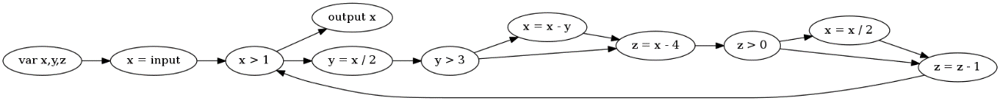
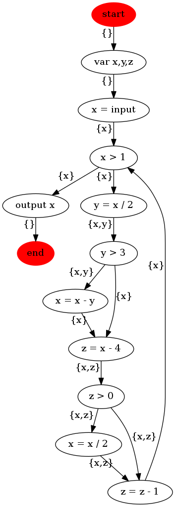
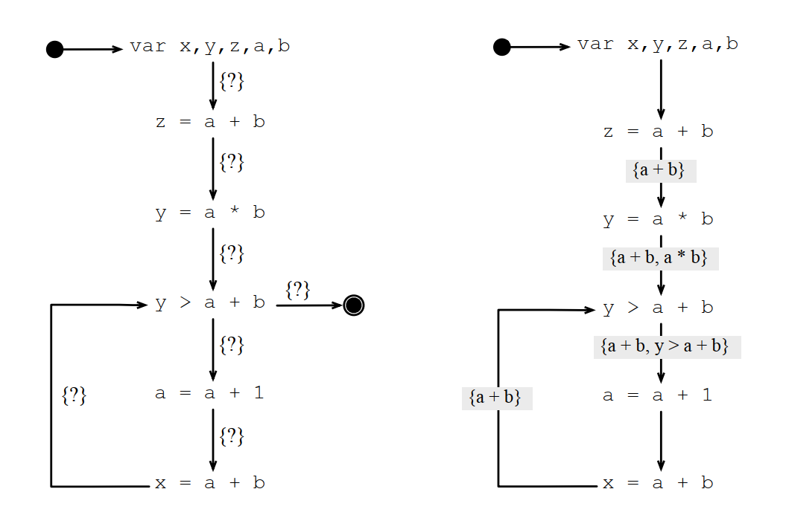
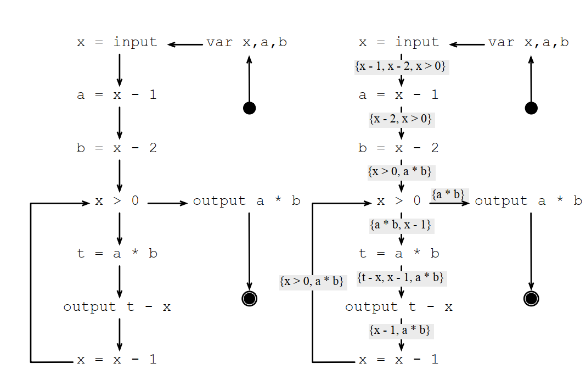
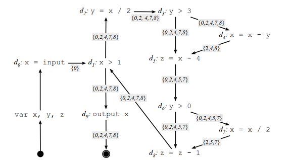
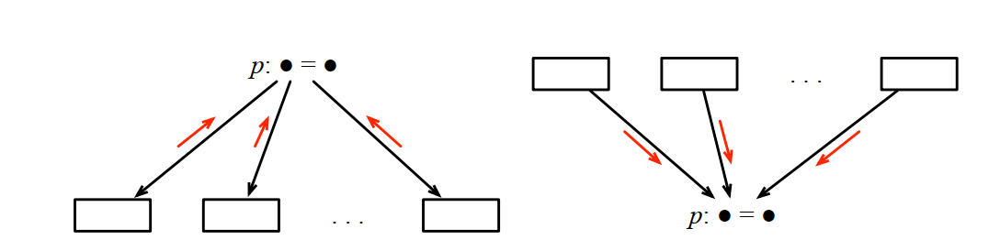

# 第 3 章 数据流分析

本章是系列文章的第三章，介绍了基于数据流分析的一些优化方法。包括生命周期、可获得表达式、常用表达式与可达定义（reaching definition）。本章在介绍这四种分析方法的基础上提取出它们的通用模式。本章形式化内容较多，建议自行手工推导，否则理解难度较大。

道生一，一生二，二生三，三生万物。万物负阴而抱阳，冲气以为和。

——老子·《道德经》

## 3.1 生命周期

对下面的程序：

| 1 | var x,y,z; |
| --- | --- |
| 2 | x = input; |
| 3 | while (x > 1) { |
| 4 | y = x / 2; |
| 5 | if (y > 3) |
| 6 | x = x - y; |
| 7 | z = x - 4; |
| 8 | if (z > 0) |
| 9 | x = x / 2; |
| 10 | z = z - 1; |
| 11 | } |
| 12 | output x; |

可以生成控制流图如下：

图3.1 一个简单程序的控制流图

图的dot文件如下，方便用户自己画图：

| 1 | digraph "CFG for 3.1"{ |
| --- | --- |
| 2 | rankdir=LR |
| 3 | "var x,y,z" -> "x = input" -> "x > 1" -> {"output x" "y = x / 2"} |
| 4 | "y = x / 2" -> "y > 3" -> {"x = x - y" "z = x - 4"} |
| 5 | "x = x - y" -> "z = x - 4" -> "z > 0" -> {"x = x / 2" "z = z - 1"} |
| 6 | "x = x / 2" -> "z = z - 1" -> "x > 1" |

但仅有控制流分析，还有很多问题无法解决。第一个问题是计算机需要知道这个程序需要多少寄存器，甚至需要控制流执行到某条边的时候，需要多少个寄存器？有什么通用的方法能用来回答这个问题？

活跃变量：如果程序在执行点需要使用某个变量，并且该使用不是定义类的使用，那么程序需要在紧靠该执行点之前就要能访问这个变量，这种变量称为活跃变量（alive）。

对每个程序执行点p，我们定义2个集合：

IN是在紧靠p之前活着的变量集合。

OUT是在紧靠p之后活着的变量集合。

活跃变量的数据流等式：

对 p : v = E

IN(p) = ( OUT(p) \ {v} ) ∪ vars(E)

OUT(p) = ∪ IN(ps), ps ∈ succ(p)

IN(p) ：p之前的活跃的变量集合

OUT(p) ：p之后的活跃的变量集合

vars(E) ：表达式E中出现的所有变量的集合

succ(p) ：控制流图中p的所有后继的集合

对CFG上的每个点，代入上面2个等式，直到2个集合不再变化，我们就得到了任意点的变量生命周期。

这个等式最早是Allen用prolog实现的：

| 1 | diff([], _, []). |
| --- | --- |
| 2 | diff([H|T], L, LL) :- member(H, L), diff(T, L, LL). |
| 3 | diff([H|T], L, [H|LL]) |
| 4 | :- \+member(H, L), diff(T, L, LL). |
| 5 | union([], L, L). |
| 6 | union([H|T], L, LL) :- member(H, L), union(T, L, LL). |
| 7 | union([H|T], L, [H|LL]) |
| 8 | :- \+ member(H, L), union(T, L, LL). |
| 9 | in(1, L) :- out(1, Out), diff(Out, [y], L). |
| 10 | in(2, L) :- out(2, Out), diff(Out, [x], L). |
| 11 | in(3, L) :- out(3, Out), diff(Out, [z], Diff), |
| 12 | union(Diff, [x, y], L). |
| 13 | in(4, L) :- out(4, Out), union(Out, [z], L). |
| 14 | out(1, L) :- in(2, L). |
| 15 | out(2, L) :- in(3, L). |
| 16 | out(3, L) :- in(4, L). |
| 17 | out(4, []). |

上面的控制流图，给每条边加上变量的生命周期之后的结果的dot表达是这样的：

| 1 | digraph "CFG for 3.2"{ |
| --- | --- |
| 2 | "start" [bgcolor=black color=red style=filled] |
| 3 | "start" -> "var x,y,z" [xlabel="{}"] |
| 4 | "var x,y,z" -> "x = input" [xlabel="{}"] |
| 5 | "x = input" -> "x > 1" [xlabel="{x}"] |
| 6 | "x > 1" -> "output x" [xlabel="{x}"] |
| 7 | "x > 1" -> "y = x / 2" [xlabel="{x}"] |
| 8 | "y = x / 2" -> "y > 3" [xlabel="{x,y}"] |
| 9 | "y > 3" -> "x = x - y" [xlabel="{x,y}"] |
| 10 | "y > 3" -> "z = x - 4" [xlabel="{x}"] |
| 11 | "x = x - y" -> "z = x - 4" [xlabel="{x}"] |
| 12 | "z = x - 4" -> "z > 0" [xlabel="{x,z}"] |
| 13 | "z > 0" -> "x = x / 2" [xlabel="{x,z}"] |
| 14 | "z > 0" -> "z = z - 1" [xlabel="{x,z}"] |
| 15 | "x = x / 2" -> "z = z - 1" [xlabel="{x,z}"] |
| 16 | "z = z - 1" -> "x > 1" [xlabel="{x}"] |
| 17 | "output x" -> "end" [xlabel="{}"] |
| 18 | "end" [bgcolor=black color=red style=filled] |
| 19 | } |

dot文件生成的svg图是这样的：

图3.2 加上生命周期分析之后的控制流图

## 3.2 可访问表达式（Available Expressions）

可访问表达式：一个表达式E在程序点p是可访问表达式，当且仅当：

E在p之前是可访问表达式，

并且E的任意一个变量在p未重新定义；

或者：

E在p处被使用，

E的所有变量没有在p处重新定义。

可访问表达式的数据流等式：

对 p : v = E

IN(p) = ∩OUT(ps), ps ∈ pred(p)

OUT(p) = ( IN(p) ∪ {E}) \ {Expr(v)}

IN(p) ：p之前的可访问表达式集合

OUT(p) ：p之后的可访问表达式集合
pred(p) ：控制流图中p的所有前驱的集合

Expr(v) ：使用变量v的所有表达式的集合

可访问表达式的例子：

图3.3 加上可访问表达式分析之后的控制流图

## 3.3 常用表达式（Very Busy Expressions）

常用表达式：当表达式E从p开始到程序结束前的每条路径上都会计算，则称表达式E在p处是常用表达式。形式化描述就是：

E在p之后是常用表达式，

并且E的所有变量并没有在p处重新定义；

或者：

p处使用了表达式E。

常用表达式的数据流等式：

对 p : v = E

IN(p) = ( OUT(p) \ {Expr(v)}) ∪ {E}

OUT(p) = ∩ IN(ps), ps ∈ succ(p)

IN(p) ：p之前的常用表达式集合

OUT(p) ：p之后的常用表达式集合

succ(p) ：控制流图中p的所有后继的集合

常用表达式的例子：

图3.4 加上常用表达式分析之后的控制流图

安全的代码修改（Safe Code Hositing）：如果某个修改，在任何场景下都不会导致程序做额外的工作，该修改就是安全的修改。

## 3.4 可获得性定义（Reaching Definitions）

可获得性定义：如果控制流图上存在一条边从程序点p到程序点p‘，并且这条边上没有任意一个结点对变量v重新定义，则称为p在程序点p定义的变量v在程序的p'可获得。

可获得性的推导：变量v在程序点p可获得当且仅当：

在p之前v可获得，

并且v在p处没有重新定义；

或者

p处定义了变量v。

可获得性定义的数据流等式：

对 p : v = E

IN(p) = ∪ OUT(ps), ps ∈ pred(p)

OUT(p) = ( IN(p) \ {defs(v)} )∪ {(p, v)}

IN(p) ：p之前的可获得性定义集合

OUT(p) ：p之后的可获得性定义集合
defs(v) ：程序中所有v的定义集合

(p, v): p处定义的v

可获得性定义的例子：

图3.5 加上可获得性定义分析之后的控制流图

图3.5中在d8为何能删除d5的定义？

## 3.5 MONOTONE框架

### 3.5.1 几种数据流分析方法的比较

本章学到了四种数据流分析方法：

|  | 正向分析 | 后向分析 |
| --- | --- | --- |
| 可以 | IN(p) = (OUT(p) \ {v}) ∪ vars(E) OUT(p) = ∪ IN (ps), ps ∈ succ(p) 生命周期分析 | IN(p) = ∪ OUT (ps), ps ∈ pred(p) OUT(p) = (IN (p) \ {defs(v)}) ∪ {p} 可获得性定义分析 |
| 必须 | IN(p) = (OUT(p) \ {v}) ∪ {E} OUT(p) = ∩ IN (ps), ps ∈ succ(p) 常用表达式分析 | IN(p) = ∩ OUT (ps), ps ∈ pred(p) OUT(p) = (IN (p) ∪ {E}) \ {Expr(v)} 可访问表达式分析 |

数据流分析按汇总方向有正向分析和反向分析两种。

正向分析是从程序的起始点往结束点方向分析，每次输入都是通过这之前所有的输出通过运算（交集或者并集）得到，输出是基于p点的输入和p点的表达式计算出来。例如本章讲到的可获得性定义和可访问表达式的分析。正向分析也可以翻译成前向分析。

反向分析相反，需要从程序的结束点往起始点分析，分析方向和数据流动的方向相反。每次先计算输出，每个p的输出都是这之后的输入通过运算得到，输入是基于p点的输出和p点的表达式计算出来。例如本章讲到的生命周期分析和常用表达式分析。

按汇总方法有可以分为确定性分析（MUST，必须）和可能性分析（MAY，可以）2种。区别在于集合从多点汇聚到一个点的时候应该使用交集还是并集。

### 3.5.2 转换函数

数据流分析过程需要对程序进行一些翻译，数据流分析不能直接分析程序的具体语义（要不然分析就永远无法终结），而是分析一种抽象的语义。转换函数就是抽取程序的抽象语义的函数。

正向分析的转换函数是通过输入生成输出的函数：

OUT[s] = fs(IN[s])

相反，反向分析的转换函数是通过输出计算输入的函数：

IN[s] = fs(OUT[s])

### 3.5.3 合并函数

合并函数确定多条岔路汇聚成一条路或者一条路分成多条岔路时的处理过程。

图3.6 合并函数示意图

给定一个转换函数，一个合并函数，和一个特定的初始化的IN和OUT的集合，能够证明它必然导致抽象翻译的正常结束。

数据流分析的过程就是按上面的框架找到一个转换函数，和一个合并函数，并给定一个IN和OUT的初始集合。

## 3.6 数据流分析简史

Frances Allen got the Turing Award of 2007. Some of her contributions touch dataflow analyses。2007年的图灵奖授予给Frances Allen，主要是基于他对数据流分析的贡献。

Allen, F. E., "Program Optimizations", Annual Review in Automatic Programming 5 (1969), pp. 239-307。Frances Allen在1969年在《自动编程年度回顾》上发表《程序优化》文章，第一次引入了数据流分析的方法。

Allen, F. E., "Control Flow Analysis", ACM Sigplan Notices 5:7 (1970), pp. 1-19。1970年Frances Allen又在《美国计算机学会程序设计语言专业组通讯》中又引入的控制流分析的方法。

Kam, J. B. and J. D. Ullman, "Monotone Data Flow Analysis Frameworks", Actal Informatica 7:3 (1977), pp. 305-318。1977年Kam, J. B和J. D. Ullman在

Kildall, G. "A Unified Approach to Global Program Optimizations", ACM Symposium on Principles of Programming Languages (1973), pp. 194-206

## 3.7 LLVM的数据流分析实现

LLVM中的常用表达式主要体现在CSE（Common Subexpression Elimination）中，其中上一章讲述的early-cse是编译前期（SSA处理化之前）的处理，这章我们继续分析编译后期（SSA处理化之后）的CSE转换。

### 3.7.1 LLVM中的CSE

CSE的转换流程主要体现在mlir\lib\Transforms\CSE.cpp中，这个文件只有231行。之前说过SSA处理之后因为不用考虑变量的不同版本（ “代”），很多处理会简化很多，CSE.cpp的231行相对于EarlyCSE.cpp的1492行，确实简化了非常多。

而且EarlyCSE是有限制的，对变量的版本特别多的情况下会导致分析性能急剧下降，所以有几个统计值来确保版本太多之后跳过EarlyCSE的转换，而SSA转换之后的CSE基本上没有限制。

CSE的功能本身也体现在MLIR的子项目中，所以我们在这里第一次看到引入MLIR的头文件，MLIR是Multi-Level Intermediate Representation的简称，是LLVM的一个子项目（参见https://mlir.llvm.org/）。

MLIR项目为不同企业，不同产品定义自己的方言提供了便利的接口。

mlir\lib\Transforms\CSE.cpp

| 14 | #include "PassDetail.h" |
| --- | --- |
|   | // 对控制流图进行支配分析 |
| 15 | #include "mlir/IR/Dominance.h" |
| 16 | #include "mlir/Pass/Pass.h" |
| 17 | #include "mlir/Transforms/Passes.h" |
| 18 | #include "mlir/Transforms/Utils.h" |
|   | // LLVM的抽象数据类型 |
| 19 | #include "llvm/ADT/DenseMapInfo.h" |
| 20 | #include "llvm/ADT/Hashing.h" |
| 21 | #include "llvm/ADT/ScopedHashTable.h" |
| 22 | #include "llvm/Support/Allocator.h" |
| 23 | #include "llvm/Support/RecyclingAllocator.h" |
| 24 | #include <deque> |

和LLVM类似，MLIR里面的对外接口都放在mlir的命名空间中。

mlir\lib\Transforms\CSE.cpp

| 26 | using namespace mlir; |
| --- | --- |

匿名命名空间中包含详细的实现细节，不希望其他模块看到，也不污染全局命名空间。

#### 3.7.1.1 SimpleOperationInfo类

这里定义了一个局部使用的SimpleOperationInfo类，对外提供求Operation的哈希值和相等比较判断的方法。

mlir\lib\Transforms\CSE.cpp

| 28 | namespace { |
| --- | --- |
| 29 | struct SimpleOperationInfo : public llvm::DenseMapInfo<Operation *> { |
| 30 | static unsigned getHashValue(const Operation *opC) { |
| 31 | return OperationEquivalence::computeHash(const_cast<Operation *>(opC)); |
| 32 | } |
| 33 | static bool isEqual(const Operation *lhsC, const Operation *rhsC) { |
| 34 | auto *lhs = const_cast<Operation *>(lhsC); |
| 35 | auto *rhs = const_cast<Operation *>(rhsC); |
| 36 | if (lhs == rhs) |
| 37 | return true; |
|   | /// 简单判断一下是否是一些特殊的指针，如果是特殊指针直接返回不相等。 |
| 38 | if (lhs == getTombstoneKey() || lhs == getEmptyKey() || |
| 39 | rhs == getTombstoneKey() || rhs == getEmptyKey()) |
| 40 | return false; |
|   | /// 不是特殊指针，使用OperationEquivalence来判断是否相等。 |
| 41 | return OperationEquivalence::isEquivalentTo(const_cast<Operation *>(lhsC), |
| 42 | const_cast<Operation *>(rhsC)); |
| 43 | } |
| 44 | }; |
| 45 | } // end anonymous namespace |

下面是CSE的具体实现。CSE这个类的定义也在匿名命名空间中。

mlir\lib\Transforms\CSE.cpp

| 47 | namespace { |
| --- | --- |
|   | /// struct和class的差别就是成员默认可访问特性，struct默认公开，class默认私有。既然是放在匿名命名空间中的类，反正其他模块访问不了，在模块内部还不如大方一点，也简洁一点，都公开算了。 |
| 48 | /// Simple common sub-expression elimination. |
| 49 | struct CSE : public CSEBase<CSE> { |
| 50 | /// Shared implementation of operation elimination and scoped map definitions. |
| 51 | using AllocatorTy = llvm::RecyclingAllocator< |
| 52 | llvm::BumpPtrAllocator, |
| 53 | llvm::ScopedHashTableVal<Operation *, Operation *>>; |
| 54 | using ScopedMapTy = llvm::ScopedHashTable<Operation *, Operation *, |
| 55 | SimpleOperationInfo, AllocatorTy>; |
|   | /// 同一个CFG，不同的分析或者转换的关注点不同，都会定义自己的节点信息。 |
| 56 |  |
| 57 | /// Represents a single entry in the depth first traversal of a CFG. |
| 58 | struct CFGStackNode { |
| 59 | CFGStackNode(ScopedMapTy &knownValues, DominanceInfoNode *node) |
| 60 | : scope(knownValues), node(node), childIterator(node->begin()), |
| 61 | processed(false) {} |
| 62 |  |
| 63 | /// Scope for the known values. |
| 64 | ScopedMapTy::ScopeTy scope; |
| 65 |  |
| 66 | DominanceInfoNode *node; |
| 67 | DominanceInfoNode::const_iterator childIterator; |
| 68 |  |
| 69 | /// If this node has been fully processed yet or not. |
| 70 | bool processed; |
| 71 | }; |
|   | /// LLVM里面说简化，大多数情况下就是直接删除，删繁就简 |
| 72 |  |
| 73 | /// Attempt to eliminate a redundant operation. Returns success if the |
| 74 | /// operation was marked for removal, failure otherwise. |
| 75 | LogicalResult simplifyOperation(ScopedMapTy &knownValues, Operation *op); |
| 76 |  |
| 77 | void simplifyBlock(ScopedMapTy &knownValues, DominanceInfo &domInfo, |
| 78 | Block *bb); |
| 79 | void simplifyRegion(ScopedMapTy &knownValues, DominanceInfo &domInfo, |
| 80 | Region &region); |
| 81 |  |
| 82 | void runOnOperation() override; |
| 83 |  |
| 84 | private: |
| 85 | /// Operations marked as dead and to be erased. |
| 86 | std::vector<Operation *> opsToErase; |
| 87 | }; |
| 88 | } // end anonymous namespace |
| 89 | private: |
| 90 | /// Operations marked as dead and to be erased. |
| 91 | std::vector<Operation *> opsToErase; |
| 92 | }; |
| 93 | } // end anonymous namespace |
| 94 |  |
| 95 |  |
| 96 |  |

#### 3.7.1.2 CSE的simplifyOperation方法的实现

mlir\lib\Transforms\CSE.cpp

|   | /// 尝试删除冗余的操作 |
| --- | --- |
| 90 | /// Attempt to eliminate a redundant operation. |
| 91 | LogicalResult CSE::simplifyOperation(ScopedMapTy &knownValues, Operation *op) { |
|   | // 终止操作指return、exit等指令，退出函数或者进程上下文的时候， |
|   | // 通常会做一些清理现场和恢复现场的操作， |
|   | // 误删除会导致资源泄漏，上下文异常等问题。 |
| 92 | // Don't simplify terminator operations. |
| 93 | if (op->isKnownTerminator()) |
| 94 | return failure(); |
|   | // 操作已经是最简化了，发现还可以做CSE处理， |
|   | // 说明这处和别的地方的功能完全重叠，可以直接删除。 |
| 95 |  |
| 96 | // If the operation is already trivially dead just add it to the erase list. |
| 97 | if (isOpTriviallyDead(op)) { |
| 98 | opsToErase.push_back(op); |
| 99 | ++numDCE; |
| 100 | return success(); |
| 101 | } |
|   | // 如果一个变量的定义存在多种，直接做CSE处理很容易替换错， |
|   | // 等SSA化之后，再做CSE处理更加安全。 |
| 102 |  |
| 103 | // Don't simplify operations with nested blocks. We don't currently model |
| 104 | // equality comparisons correctly among other things. It is also unclear |
| 105 | // whether we would want to CSE such operations. |
| 106 | if (op->getNumRegions() != 0) |
| 107 | return failure(); |
|   | // 存在副作用的操作，删除会有意想不到的影响 |
| 108 |  |
| 109 | // TODO: We currently only eliminate non side-effecting |
| 110 | // operations. |
| 111 | if (!MemoryEffectOpInterface::hasNoEffect(op)) |
| 112 | return failure(); |
|   | // 如果已经存在该操作的定义，则直接替换， |
|   | // 并删除当前位置的定义。 |
| 113 |  |
| 114 | // Look for an existing definition for the operation. |
| 115 | if (auto *existing = knownValues.lookup(op)) { |
| 116 | // If we find one then replace all uses of the current operation with the |
| 117 | // existing one and mark it for deletion. |
| 118 | op->replaceAllUsesWith(existing); |
|   | // 为了不影响当前的分析，删除操作等分析完延后执行。 |
| 119 | opsToErase.push_back(op); |
|   | // 为何会存在某个定义的行号未知？可能之前某种优化误删除了， |
|   | // 也可能是之前的定义代码并没有出现的目标代码里面， |
|   | // 尝试将当前的行号赋值给它，修复这个问题 |
| 120 |  |
| 121 | // If the existing operation has an unknown location and the current |
| 122 | // operation doesn't, then set the existing op's location to that of the |
| 123 | // current op. |
| 124 | if (existing->getLoc().isa<UnknownLoc>() && |
| 125 | !op->getLoc().isa<UnknownLoc>()) { |
| 126 | existing->setLoc(op->getLoc()); |
| 127 | } |
| 128 |  |
| 129 | ++numCSE; |
| 130 | return success(); |
| 131 | } |
|   | // 找不到就将当前op加入到已知值映射表 |
| 132 |  |
| 133 | // Otherwise, we add this operation to the known values map. |
| 134 | knownValues.insert(op, op); |
| 135 | return failure(); |
| 136 | } |

#### 3.7.1.3 CSE的simplifyBlock方法的实现

根据LLVM的程序概念模型，op的上一级就是基本块，simplifyBlock就是基于基本块的CSE处理，simplifyBlock通过遍历基本块的所有指令，调用simplifyOperation完成基本块的CSE处理。

mlir\lib\Transforms\CSE.cpp

| 138 | void CSE::simplifyBlock(ScopedMapTy &knownValues, DominanceInfo &domInfo, |
| --- | --- |
| 139 | Block *bb) { |
| 140 | for (auto &inst : *bb) { |
| 141 | // If the operation is simplified, we don't process any held regions. |
| 142 | if (succeeded(simplifyOperation(knownValues, &inst))) |
| 143 | continue; |
|   | // 如果按操作做CSE优化失败，剩下的语句，除了一些已经注册的特定操作 |
|   | // 或者已经特定声明了不能和上面语句一起处理的， |
|   | // 可以尝试按走嵌套分区优化 |
| 144 |  |
| 145 | // If this operation is isolated above, we can't process nested regions with |
| 146 | // the given 'knownValues' map. This would cause the insertion of implicit |
| 147 | // captures in explicit capture only regions. |
| 148 | if (!inst.isRegistered() || inst.isKnownIsolatedFromAbove()) { |
| 149 | ScopedMapTy nestedKnownValues; |
| 150 | for (auto &region : inst.getRegions()) |
| 151 | simplifyRegion(nestedKnownValues, domInfo, region); |
| 152 | continue; |
| 153 | } |
|   | // 其他情况，也就是注册的抽象操作，或者非独立的区域， |
|   | // 走默认的分区优化 |
| 154 |  |
| 155 | // Otherwise, process nested regions normally. |
| 156 | for (auto &region : inst.getRegions()) |
| 157 | simplifyRegion(knownValues, domInfo, region); |
| 158 | } |

#### 3.7.1.4 CSE的simplifyRegion方法的实现

simplifyRegion完成按区域进行CSE处理。区域是能做CSE处理的最小单位，所以不用给出成功或者失败的返回值，因为得到返回值也没什么特别的。

mlir\lib\Transforms\CSE.cpp

| 161 | void CSE::simplifyRegion(ScopedMapTy &knownValues, DominanceInfo &domInfo, |
| --- | --- |
| 162 | Region &region) { |
|   | // 如果是空的区域，直接返回。 |
| 163 | // If the region is empty there is nothing to do. |
| 164 | if (region.empty()) |
| 165 | return; |
|   | // 一个区域里面可能存在多个基本块，也可能只有一个， |
|   | // 如果是一个基本块的话，直接使用simplifyBlock进行优化。 |
| 166 |  |
| 167 | // If the region only contains one block, then simplify it directly. |
| 168 | if (std::next(region.begin()) == region.end()) { |
| 169 | ScopedMapTy::ScopeTy scope(knownValues); |
| 170 | simplifyBlock(knownValues, domInfo, &region.front()); |
| 171 | return; |
| 172 | } |
|   | // Deque是Double-ended queues的简称， |
|   | // 双端队列支持从头和尾进行插入和删除， |
|   | // 双端队列所占用的空间更多，初始化也更慢， |
|   | // 但插入删除的效率比vector更好。 |
| 173 |  |
| 174 | // Note, deque is being used here because there was significant performance |
| 175 | // gains over vector when the container becomes very large due to the |
| 176 | // specific access patterns. If/when these performance issues are no |
| 177 | // longer a problem we can change this to vector. For more information see |
| 178 | // the llvm mailing list discussion on this: |
| 179 | // http://lists.llvm.org/pipermail/llvm-commits/Week-of-Mon-20120116/135228.html |
| 180 | std::deque<std::unique_ptr<CFGStackNode>> stack; |
|   | // 处理本区域的支配树根节点。 |
| 181 |  |
| 182 | // Process the nodes of the dom tree for this region. |
| 183 | stack.emplace_back(std::make_unique<CFGStackNode>( |
| 184 | knownValues, domInfo.getRootNode(&region))); |
|   | // 控制流图不为空，说明本区域含有基本块。 |
| 185 |  |
| 186 | while (!stack.empty()) { |
|   | // CSE优化从双端队列的最后一个基本块往前遍历， |
|   | // 第一次进来时，得到的是支配树的根节点。 |
| 187 | auto &currentNode = stack.back(); |
|   | // 如果当前基本块没优化过，调用simplifyBlock进行优化。 |
|   | // 如果是因为遍历子节点走到这里，就会直接跳过。 |
| 188 |  |
| 189 | // Check to see if we need to process this node. |
| 190 | if (!currentNode->processed) { |
| 191 | currentNode->processed = true; |
| 192 | simplifyBlock(knownValues, domInfo, currentNode->node->getBlock()); |
| 193 | } |
|   | // 处理完当前节点，继续处理它的子节点。 |
|   | // 注意，循环的每次迭代只会插一个子节点进来， |
|   | // 这样可以减少双端队列的内存占用。 |
| 194 |  |
| 195 | // Otherwise, check to see if we need to process a child node. |
| 196 | if (currentNode->childIterator != currentNode->node->end()) { |
| 197 | auto *childNode = *(currentNode->childIterator++); |
|   | // 子节点直接插到双端队列的队尾。 |
| 198 | stack.emplace_back( |
| 199 | std::make_unique<CFGStackNode>(knownValues, childNode)); |
| 200 | } else { |
|   | // 如果当前节点的所有子节点都处理完了，就可以删除了。 |
| 201 | // Finally, if the node and all of its children have been processed |
| 202 | // then we delete the node. |
| 203 | stack.pop_back(); |
| 204 | } |
| 205 | } |
| 206 | } |

#### 3.7.1.5 CSE的runOnOperation方法的实现

CSE的runOnOperation完成按基于op的操作和mlir对接。

mlir\lib\Transforms\CSE.cpp

| 208 | void CSE::runOnOperation() { |
| --- | --- |
|   | /// 一个区域内的已知操作的映射表。 |
| 209 | /// A scoped hash table of defining operations within a region. |
| 210 | ScopedMapTy knownValues; |
|   | // 直接提取支配树分析的结果。 |
| 211 |  |
| 212 | DominanceInfo &domInfo = getAnalysis<DominanceInfo>(); |
|   | // 遍历操作中的所有区域，并按区域进行CSE优化。 |
| 213 | for (Region &region : getOperation()->getRegions()) |
| 214 | simplifyRegion(knownValues, domInfo, region); |
|   | // 没有需要做CSE优化的操作，则保留当前的分析结果。 |
| 215 |  |
| 216 | // If no operations were erased, then we mark all analyses as preserved. |
| 217 | if (opsToErase.empty()) |
| 218 | return markAllAnalysesPreserved(); |
|   | // 删除所有在CSE分析中需要删除的操作。 |
| 219 |  |
| 220 | /// Erase any operations that were marked as dead during simplification. |
| 221 | for (auto *op : opsToErase) |
| 222 | op->erase(); |
|   | // 最后把保存分析结果的数据结构也清理掉。 |
| 223 | opsToErase.clear(); |
|   | // 剩下的都是不能简化的， |
|   | // 将当前的支配分析和后支配分析标注成最终结果。 |
| 224 |  |
| 225 | // We currently don't remove region operations, so mark dominance as |
| 226 | // preserved. |
| 227 | markAnalysesPreserved<DominanceInfo, PostDominanceInfo>(); |
| 228 | } |
|   | // 把当前的CSE处理过程挂接到mlir的pass里面。 |
| 229 |  |
| 230 | std::unique_ptr<Pass> mlir::createCSEPass() { return std::make_unique<CSE>(); } |

### 3.7.2 LLVM中的ReachingDefAnalysis

可获得性定义的分析比CSE就要复杂许多了。

ReachingDefAnalysis（简称RDA）的很多代码里面都有Machine的前缀，LLVM中的Machine前缀表示目标机器相关的分析或者优化，例如物理寄存器（LLVM会在硬件无关优化过程中给每个变量分配虚拟寄存器，最终生成机器码的时候再和物理寄存器进行映射或者做溢出处理），或者需要特定机器指令支持的优化。可获得性定义分析中涉及的一些变量定义可能是出现在物理寄存器里面的，这些物理寄存器中保存的值在后续运算中可能做了溢出处理，对应寄存器里面保存的已经是别的变量的值（或者同一个变量的其他版本），这个上下文下面这个变量就变成不可获得了。

llvm\lib\CodeGen\ReachingDefAnalysis.cpp

| 9 | #include "llvm/ADT/SmallSet.h" |
| --- | --- |
| 10 | #include "llvm/CodeGen/LivePhysRegs.h" |
| 11 | #include "llvm/CodeGen/ReachingDefAnalysis.h" |
| 12 | #include "llvm/CodeGen/TargetRegisterInfo.h" |
| 13 | #include "llvm/CodeGen/TargetSubtargetInfo.h" |
| 14 | #include "llvm/Support/Debug.h" |
| 15 |  |
| 16 | using namespace llvm; |
| 17 |  |
| 18 | #define DEBUG_TYPE "reaching-deps-analysis" |
|   | // 一些pass相关的基础定义。 |
| 19 |  |
| 20 | char ReachingDefAnalysis::ID = 0; |
| 21 | INITIALIZE_PASS(ReachingDefAnalysis, DEBUG_TYPE, "ReachingDefAnalysis", false, |
| 22 | true) |
|   | // 这里的操作Operand定义的类变成了机器操作MachineOperand。 |
|   | // 合法寄存器先是寄存器，并且能正常查询。 |
| 23 |  |
| 24 | static bool isValidReg(const MachineOperand &MO) { |
| 25 | return MO.isReg() && MO.getReg(); |
| 26 | } |
|   | // 合法寄存器使用时合法寄存器，并且再使用状态。 |
| 27 |  |
| 28 | static bool isValidRegUse(const MachineOperand &MO) { |
| 29 | return isValidReg(MO) && MO.isUse(); |
| 30 | } |
|   | // 是某个物理寄存器的合法在用。 |
| 31 |  |
| 32 | static bool isValidRegUseOf(const MachineOperand &MO, int PhysReg) { |
| 33 | return isValidRegUse(MO) && MO.getReg() == PhysReg; |
| 34 | } |
|   | // 合法在用的物理寄存器定义。 |
| 35 |  |
| 36 | static bool isValidRegDef(const MachineOperand &MO) { |
| 37 | return isValidReg(MO) && MO.isDef(); |
| 38 | } |
|   | // 是某个物理寄存器的合法定义。 |
| 39 |  |
| 40 | static bool isValidRegDefOf(const MachineOperand &MO, int PhysReg) { |
| 41 | return isValidRegDef(MO) && MO.getReg() == PhysReg; |
| 42 | } |
| 43 |  |
| 44 |  |

#### 3.7.2.1 RDA的enterBasicBlock函数

RDA的enterBasicBlock函数主要做进入机器基本块的寄存器等上下文初始化过程，包括RDA输入集合的初始化。

llvm\lib\CodeGen\ReachingDefAnalysis.cpp

| 44 | void ReachingDefAnalysis::enterBasicBlock(MachineBasicBlock *MBB) { |
| --- | --- |
|   | // 越界检查。 |
| 45 | unsigned MBBNumber = MBB->getNumber(); |
| 46 | assert(MBBNumber < MBBReachingDefs.size() && |
| 47 | "Unexpected basic block number."); |
|   | // NumRegUnits在类的Init函数里面初始化为本地的寄存器个数。 |
|   | // 基于物理寄存器个数的可获得性分析， |
|   | // 每个时刻最多只能保存和寄存器个数一样多的定义， |
|   | // 其他变量变得不可获得， |
|   | // 或者需要重新走内存中加载到寄存器的溢出处理过程。 |
| 48 | MBBReachingDefs[MBBNumber].resize(NumRegUnits); |
|   | // 重置当前BB的指令计数器为0。 |
| 49 |  |
| 50 | // Reset instruction counter in each basic block. |
| 51 | CurInstr = 0; |
|   | // 重置LiveRegs为当前MBB可用的寄存器的默认值。 |
|   | // LLVM中设置的寄存器的默认值为-2^20， |
|   | // 表示一个非常小的数。 |
| 52 |  |
| 53 | // Set up LiveRegs to represent registers entering MBB. |
| 54 | // Default values are 'nothing happened a long time ago'. |
| 55 | if (LiveRegs.empty()) |
| 56 | LiveRegs.assign(NumRegUnits, ReachingDefDefaultVal); |
|   | // 入口基本块没有前驱。 |
| 57 |  |
| 58 | // This is the entry block. |
| 59 | if (MBB->pred_empty()) { |
|   | // 遍历当前BB的所有活跃指令。 |
| 60 | for (const auto &LI : MBB->liveins()) { |
| 61 | for (MCRegUnitIterator Unit(LI.PhysReg, TRI); Unit.isValid(); ++Unit) { |
|   | // 假设live-ins在第一条指令执行前正好定义好。 |
|   | // 通常函数的参数会延迟到函数调用前计算好。 |
| 62 | // Treat function live-ins as if they were defined just before the first |
| 63 | // instruction.  Usually, function arguments are set up immediately |
| 64 | // before the call. |
|   | // 当前寄存器的值如果不是-1，说明之前的BB使用过该寄存器， |
|   | // 需要保存一下对应寄存器的上下文。 |
| 65 | if (LiveRegs[*Unit] != -1) { |
| 66 | LiveRegs[*Unit] = -1; |
| 67 | MBBReachingDefs[MBBNumber][*Unit].push_back(-1); |
| 68 | } |
| 69 | } |
| 70 | } |
| 71 | LLVM_DEBUG(dbgs() << printMBBReference(*MBB) << ": entry\n"); |
| 72 | return; |
| 73 | } |
|   | // 试着合并前驱BB里面已经确定不会再使用的寄存器。 |
| 74 |  |
| 75 | // Try to coalesce live-out registers from predecessors. |
| 76 | for (MachineBasicBlock *pred : MBB->predecessors()) { |
|   | // 越界检查。 |
| 77 | assert(unsigned(pred->getNumber()) < MBBOutRegsInfos.size() && |
| 78 | "Should have pre-allocated MBBInfos for all MBBs"); |
| 79 | const LiveRegsDefInfo &Incoming = MBBOutRegsInfos[pred->getNumber()]; |
|   | // 输出集合为空，说明还没开始处理该节点。 |
| 80 | // Incoming is null if this is a backedge from a BB |
| 81 | // we haven't processed yet |
| 82 | if (Incoming.empty()) |
| 83 | continue; |
|   | // LiveRegs和Incoming是整型数组，里面的值是变量的版本号。 |
| 84 |  |
| 85 | // Find the most recent reaching definition from a predecessor. |
| 86 | for (unsigned Unit = 0; Unit != NumRegUnits; ++Unit) |
|   | // 如果当前变量的版本号比前驱的小，则直接用前驱的版本号。 |
|   | // 特别的，当前BB并没有该变量的定义，则数组的值为-1， |
|   | // 此时如果前驱中有该变量的定义，则直接用前驱的定义。 |
| 87 | LiveRegs[Unit] = std::max(LiveRegs[Unit], Incoming[Unit]); |
| 88 | } |
|   | // 如果LiveRegs的值修改过，则先保存到MBBReachingDefs。 |
| 89 |  |
| 90 | // Insert the most recent reaching definition we found. |
| 91 | for (unsigned Unit = 0; Unit != NumRegUnits; ++Unit) |
| 92 | if (LiveRegs[Unit] != ReachingDefDefaultVal) |
| 93 | MBBReachingDefs[MBBNumber][Unit].push_back(LiveRegs[Unit]); |
| 94 | } |
| 95 | } |

#### 3.7.2.2 RDA的leaveBasicBlock函数

RDA的leaveBasicBlock函数主要做离开机器基本块的上下文清理和生成RDA输出集合的过程。

llvm\lib\CodeGen\ReachingDefAnalysis.cpp

| 96 | void ReachingDefAnalysis::leaveBasicBlock(MachineBasicBlock *MBB) { |
| --- | --- |
|   | // 经过上下文初始化过程的LiveRegs不应该为空。 |
| 97 | assert(!LiveRegs.empty() && "Must enter basic block first."); |
|   | // 越界保护。 |
| 98 | unsigned MBBNumber = MBB->getNumber(); |
| 99 | assert(MBBNumber < MBBOutRegsInfos.size() && |
| 100 | "Unexpected basic block number."); |
|   | // 保存输出集合到MBBOutRegsInfos |
| 101 | // Save register clearances at end of MBB - used by enterBasicBlock(). |
| 102 | MBBOutRegsInfos[MBBNumber] = LiveRegs; |
|   | // 当处理BB时，变量的定义位置是相对于BB的起始地址， |
|   | // 但后续使用的时候，相对于结束地址的相对位置更方便， |
|   | // 所以最终输出时的相对位置做一些调整。 |
| 103 |  |
| 104 | // While processing the basic block, we kept `Def` relative to the start |
| 105 | // of the basic block for convenience. However, future use of this information |
| 106 | // only cares about the clearance from the end of the block, so adjust |
| 107 | // everything to be relative to the end of the basic block. |
| 108 | for (int &OutLiveReg : MBBOutRegsInfos[MBBNumber]) |
| 109 | if (OutLiveReg != ReachingDefDefaultVal) |
| 110 | OutLiveReg -= CurInstr; |
| 111 | LiveRegs.clear(); |
| 112 | } |

processDefs

#### 3.7.2.3 RDA的processDefs函数

RDA的processDefs函数主要处理一条指令中的各个参数，如果该参数在这条指令是变量的新定义，就更新寄存器的指令位置。

llvm\lib\CodeGen\ReachingDefAnalysis.cpp

| 114 | void ReachingDefAnalysis::processDefs(MachineInstr *MI) { |
| --- | --- |
|   | // 调试语句不需要处理 |
| 115 | assert(!MI->isDebugInstr() && "Won't process debug instructions"); |
| 116 |  |
| 117 | unsigned MBBNumber = MI->getParent()->getNumber(); |
|   | // 越界检查 |
| 118 | assert(MBBNumber < MBBReachingDefs.size() && |
| 119 | "Unexpected basic block number."); |
|   | // 遍历指令的所有参数 |
| 120 |  |
| 121 | for (auto &MO : MI->operands()) { |
|   | // 我们只关心已经放到寄存器里面的变量定义 |
| 122 | if (!isValidRegDef(MO)) |
| 123 | continue; |
|   | // 一个操作符可能占用一组寄存器 |
| 124 | for (MCRegUnitIterator Unit(MO.getReg(), TRI); Unit.isValid(); ++Unit) { |
| 125 | // This instruction explicitly defines the current reg unit. |
| 126 | LLVM_DEBUG(dbgs() << printReg(*Unit, TRI) << ":\t" << CurInstr |
| 127 | << '\t' << *MI); |
|   | // 更新寄存器的指令位置 |
| 128 |  |
| 129 | // How many instructions since this reg unit was last written? |
| 130 | if (LiveRegs[*Unit] != CurInstr) { |
| 131 | LiveRegs[*Unit] = CurInstr; |
|   | // 对一个寄存器的完整生命周期，可能保存多个变量， |
|   | // 也可能保存一个变量的多个版本。 |
| 132 | MBBReachingDefs[MBBNumber][*Unit].push_back(CurInstr); |
| 133 | } |
| 134 | } |
| 135 | } |
|   | // 更新指令位置 |
| 136 | InstIds[MI] = CurInstr; |
| 137 | ++CurInstr; |
| 138 | } |

#### 3.7.2.4 RDA的reprocessBasicBlock函数

RDA的reprocessBasicBlock函数主要对BB进行二次处理，根据最新的前驱输出集合重新计算自己的输入集合和输出集合。

llvm\lib\CodeGen\ReachingDefAnalysis.cpp

| 140 | void ReachingDefAnalysis::reprocessBasicBlock(MachineBasicBlock *MBB) { |
| --- | --- |
| 141 | unsigned MBBNumber = MBB->getNumber(); |
| 142 | assert(MBBNumber < MBBReachingDefs.size() && |
| 143 | "Unexpected basic block number."); |
|   | // 只关心非调试指令的个数。 |
| 144 |  |
| 145 | // Count number of non-debug instructions for end of block adjustment. |
| 146 | int NumInsts = 0; |
| 147 | for (const MachineInstr &MI : *MBB) |
| 148 | if (!MI.isDebugInstr()) |
| 149 | NumInsts++; |
|   | // 二次处理的时候，主要收集所有前驱的输出集合， |
|   | // 并入到当前指令的输入集合，再重新计算当前指令的输出集合。 |
| 150 |  |
| 151 | // When reprocessing a block, the only thing we need to do is check whether |
| 152 | // there is now a more recent incoming reaching definition from a predecessor. |
|   | // 遍历所有前驱。 |
| 153 | for (MachineBasicBlock *pred : MBB->predecessors()) { |
| 154 | assert(unsigned(pred->getNumber()) < MBBOutRegsInfos.size() && |
| 155 | "Should have pre-allocated MBBInfos for all MBBs"); |
|   | // 获得前驱的输出集合。 |
| 156 | const LiveRegsDefInfo &Incoming = MBBOutRegsInfos[pred->getNumber()]; |
|   | // 部分前驱可能没有输出集合，例如不可能走到的前驱。 |
| 157 | // Incoming may be empty for dead predecessors. |
| 158 | if (Incoming.empty()) |
| 159 | continue; |
| 160 |  |
| 161 | for (unsigned Unit = 0; Unit != NumRegUnits; ++Unit) { |
| 162 | int Def = Incoming[Unit]; |
| 163 | if (Def == ReachingDefDefaultVal) |
| 164 | continue; |
| 165 |  |
| 166 | auto Start = MBBReachingDefs[MBBNumber][Unit].begin(); |
| 167 | if (Start != MBBReachingDefs[MBBNumber][Unit].end() && *Start < 0) { |
|   | // 如果当前保存的版本比前驱更新，直接调过。 |
| 168 | if (*Start >= Def) |
| 169 | continue; |
|   | // 否则需要更新为最新版本。 |
| 170 |  |
| 171 | // Update existing reaching def from predecessor to a more recent one. |
| 172 | *Start = Def; |
| 173 | } else { |
|   | // 如果这个寄存器还没被使用过，直接插入新定义。 |
| 174 | // Insert new reaching def from predecessor. |
| 175 | MBBReachingDefs[MBBNumber][Unit].insert(Start, Def); |
| 176 | } |
|   | // 更新RDA集合，这里保存的是相对于最后指令的负偏移。 |
| 177 |  |
| 178 | // Update reaching def at end of of BB. Keep in mind that these are |
| 179 | // adjusted relative to the end of the basic block. |
| 180 | if (MBBOutRegsInfos[MBBNumber][Unit] < Def - NumInsts) |
| 181 | MBBOutRegsInfos[MBBNumber][Unit] = Def - NumInsts; |
| 182 | } |
| 183 | } |
| 184 | } |

#### 3.7.2.5 RDA的processBasicBlock函数

RDA的processBasicBlock函数主要对BB进行第一次处理，根据当前能获取到的所有前驱输出集合计算自己的输入集合和输出集合。

llvm\lib\CodeGen\ReachingDefAnalysis.cpp

| 186 | void ReachingDefAnalysis::processBasicBlock( |
| --- | --- |
| 187 | const LoopTraversal::TraversedMBBInfo &TraversedMBB) { |
| 188 | MachineBasicBlock *MBB = TraversedMBB.MBB; |
| 189 | LLVM_DEBUG(dbgs() << printMBBReference(*MBB) |
| 190 | << (!TraversedMBB.IsDone ? ": incomplete\n" |
| 191 | : ": all preds known\n")); |
|   | // 第一次遍历MBB的时候，PrimaryPass为真。 |
| 192 |  |
| 193 | if (!TraversedMBB.PrimaryPass) { |
| 194 | // Reprocess MBB that is part of a loop. |
|   | // 不是第一次遍历MBB的话，调用reprocessBasicBlock。 |
| 195 | reprocessBasicBlock(MBB); |
| 196 | return; |
| 197 | } |
|   | // 如果第一次遍历MBB，需要调用enterBasicBlock初始化上下文。 |
| 198 |  |
| 199 | enterBasicBlock(MBB); |
|   | // 然后遍历每条指令。 |
| 200 | for (MachineInstr &MI : *MBB) { |
|   | // 对非调试指令。 |
| 201 | if (!MI.isDebugInstr()) |
|   | // 分析指令中所有操作符的变量定义。 |
| 202 | processDefs(&MI); |
| 203 | } |
| 204 | leaveBasicBlock(MBB); |
| 205 | } |

#### 3.7.2.6 RDA的runOnMachineFunction函数

RDA的runOnMachineFunction函数是对父类MachineFunctionPass的重载，硬件相关的函数级别的分析和优化依赖这个重载函数和LLVM建立联系。

llvm\lib\CodeGen\ReachingDefAnalysis.cpp

| 207 | bool ReachingDefAnalysis::runOnMachineFunction(MachineFunction &mf) { |
| --- | --- |
|   | // 将父类的信息和当前对象建立联系，包括机器函数和寄存器信息。 |
| 208 | MF = &mf; |
| 209 | TRI = MF->getSubtarget().getRegisterInfo(); |
| 210 | LLVM_DEBUG(dbgs() << "********** REACHING DEFINITION ANALYSIS |
| 211 | **********\n"); |
|   | // 初始化。 |
| 215 |  |
| 223 |  |
| 226 | init(); |
|   | // 开始遍历。 |
| 227 | traverse(); |
|   | // 所有重载的函数，如果有返回值的， |
|   | // 返回假——一般是分析类pass——表示没有对处理的程序进行修改， |
|   | // 返回真——一般是优化类pass——表示对处理的程序进行过修改。 |
| 228 | return false; |
| 229 |  |
| 237 | } |

#### 3.7.2.7 RDA的releaseMemory函数

RDA的releaseMemory函数，顾名思义，就是将RDA分析过程中申请的全局内存都释放掉。

llvm\lib\CodeGen\ReachingDefAnalysis.cpp

| 216 | void ReachingDefAnalysis::releaseMemory() { |
| --- | --- |
| 217 | // Clear the internal vectors. |
| 218 | MBBOutRegsInfos.clear(); |
| 219 | MBBReachingDefs.clear(); |
| 220 | InstIds.clear(); |
| 221 | LiveRegs.clear(); |
| 222 | } |

#### 3.7.2.8 RDA的reset函数

RDA的reset函数，负责释放内存，并从头再做一次初始化和遍历。

llvm\lib\CodeGen\ReachingDefAnalysis.cpp

| 224 | void ReachingDefAnalysis::reset() { |
| --- | --- |
| 225 | releaseMemory(); |
| 226 | init(); |
| 227 | traverse(); |
| 228 | } |

#### 3.7.2.9 RDA的init函数

RDA的init函数，负责初始化寄存器个数，输出集合，遍历MBB顺序。

llvm\lib\CodeGen\ReachingDefAnalysis.cpp

| 230 | void ReachingDefAnalysis::init() { |
| --- | --- |
| 231 | NumRegUnits = TRI->getNumRegUnits(); |
| 232 | MBBReachingDefs.resize(MF->getNumBlockIDs()); |
| 233 | // Initialize the MBBOutRegsInfos |
| 234 | MBBOutRegsInfos.resize(MF->getNumBlockIDs()); |
| 235 | LoopTraversal Traversal; |
| 236 | TraversedMBBOrder = Traversal.traverse(*MF); |
| 237 | } |

#### 3.7.2.10 RDA的traverse函数

RDA的traverse函数，按遍历顺序遍历所有MBB。如果是调试版本，会检查遍历顺序是否正确。

llvm\lib\CodeGen\ReachingDefAnalysis.cpp

| 239 | void ReachingDefAnalysis::traverse() { |
| --- | --- |
| 240 | // Traverse the basic blocks. |
| 241 | for (LoopTraversal::TraversedMBBInfo TraversedMBB : TraversedMBBOrder) |
|   | // 正式发布版本，直接调用processBasicBlock遍历就结束了。 |
| 242 | processBasicBlock(TraversedMBB); |
| 243 | #ifndef NDEBUG |
| 244 | // Make sure reaching defs are sorted and unique. |
| 245 | for (MBBDefsInfo &MBBDefs : MBBReachingDefs) { |
| 246 | for (MBBRegUnitDefs &RegUnitDefs : MBBDefs) { |
| 247 | int LastDef = ReachingDefDefaultVal; |
| 248 | for (int Def : RegUnitDefs) { |
|   | // 调试版本，需要校验一下遍历顺序。 |
| 249 | assert(Def > LastDef && "Defs must be sorted and unique"); |
| 250 | LastDef = Def; |
| 251 | } |
| 252 | } |
| 253 | } |
| 254 | #endif |
| 255 | } |

#### 3.7.2.11 RDA的getReachingDef函数

RDA的getReachingDef函数，遍历RDA分析结果，找到和当前指令最近的物理寄存器的定义。

llvm\lib\CodeGen\ReachingDefAnalysis.cpp

| 257 | int ReachingDefAnalysis::getReachingDef(MachineInstr *MI, int PhysReg) const { |
| --- | --- |
|   | // 只对非调试指令进行分析。 |
| 258 | assert(InstIds.count(MI) && "Unexpected machine instuction."); |
|   | // 找到当前指令的映射ID。 |
| 259 | int InstId = InstIds.lookup(MI); |
|   | // 将当前定义初始化成一个非常小的值-220。 |
| 260 | int DefRes = ReachingDefDefaultVal; |
|   | // 指令归属的MBB的序列号。 |
| 261 | unsigned MBBNumber = MI->getParent()->getNumber(); |
|   | // 越界保护。 |
| 262 | assert(MBBNumber < MBBReachingDefs.size() && |
| 263 | "Unexpected basic block number."); |
|   | // 将最新的定义也初始化成一个非常小的值-220。 |
| 264 | int LatestDef = ReachingDefDefaultVal; |
|   | // 遍历物理寄存器的所有版本。 |
| 265 | for (MCRegUnitIterator Unit(PhysReg, TRI); Unit.isValid(); ++Unit) { |
|   | // 遍历RDA分析结果中与对应物理寄存器相关的定义。 |
| 266 | for (int Def : MBBReachingDefs[MBBNumber][*Unit]) { |
|   | // 如果定义的代码已经遍历到在当前指令后面，就不用遍历了。 |
| 267 | if (Def >= InstId) |
| 268 | break; |
|   | // 更新当前定义。 |
| 269 | DefRes = Def; |
| 270 | } |
|   | // 取当前定义和历史最新定义的最大值作为最新定义进行更新。 |
| 271 | LatestDef = std::max(LatestDef, DefRes); |
| 272 | } |
| 273 | return LatestDef; |
| 274 | } |

#### 3.7.2.12 RDA的getReachingLocalMIDef函数

RDA的getReachingLocalMIDef函数，封装了一下getReachingDef，和getReachingDef返回指令的ID不一样，getReachingLocalMIDef返回指令本身。

llvm\lib\CodeGen\ReachingDefAnalysis.cpp

| 276 | MachineInstr* ReachingDefAnalysis::getReachingLocalMIDef(MachineInstr *MI, |
| --- | --- |
| 277 | int PhysReg) const { |
| 278 | return getInstFromId(MI->getParent(), getReachingDef(MI, PhysReg)); |
| 279 | } |

#### 3.7.2.13 RDA的hasSameReachingDef函数

RDA的hasSameReachingDef函数，调用getReachingDef，判断两个指令是否使用同一个变量的同一个版本。

llvm\lib\CodeGen\ReachingDefAnalysis.cpp

| 281 | bool ReachingDefAnalysis::hasSameReachingDef(MachineInstr *A, MachineInstr *B, |
| --- | --- |
| 282 | int PhysReg) const { |
| 283 | MachineBasicBlock *ParentA = A->getParent(); |
| 284 | MachineBasicBlock *ParentB = B->getParent(); |
| 285 | if (ParentA != ParentB) |
| 286 | return false; |
| 287 |  |
| 288 | return getReachingDef(A, PhysReg) == getReachingDef(B, PhysReg); |
| 289 | } |
| 290 |  |
| 291 |  |

#### 3.7.2.14 RDA的getInstFromId函数

RDA的getInstFromId函数，遍历MBB和InstIds，通过直接比较ID，找到对应的指令。从指令得到它的ID非常简单，直接查InstIds映射表就可以了，但反过来查性能就比较差，依靠查找算法的性能，最差情况下需要O(N2)的时间复杂度。

llvm\lib\CodeGen\ReachingDefAnalysis.cpp

| 291 | MachineInstr *ReachingDefAnalysis::getInstFromId(MachineBasicBlock *MBB, |
| --- | --- |
| 292 | int InstId) const { |
|   | // 很多越界检查。 |
| 293 | assert(static_cast<size_t>(MBB->getNumber()) < MBBReachingDefs.size() && |
| 294 | "Unexpected basic block number."); |
| 295 | assert(InstId < static_cast<int>(MBB->size()) && |
| 296 | "Unexpected instruction id."); |
|   | // 入参保护。 |
| 297 |  |
| 298 | if (InstId < 0) |
| 299 | return nullptr; |
|   | // 遍历MBB的所有指令。 |
| 300 |  |
| 301 | for (auto &MI : *MBB) { |
|   | // 遍历MBB的所有指令。 |
| 302 | auto F = InstIds.find(&MI); |
|   | // 如果找到和InstId一致的指令，则返回对应指令。 |
| 303 | if (F != InstIds.end() && F->second == InstId) |
| 304 | return &MI; |
| 305 | } |
|   | // 否则返回空指针。 |
| 306 |  |
| 307 | return nullptr; |
| 308 | } |

#### 3.7.2.15 RDA的getClearance函数

RDA的getClearance函数，返回遍历的最近定义和当前指令直接的间隔。

llvm\lib\CodeGen\ReachingDefAnalysis.cpp

| 310 | int |
| --- | --- |
| 311 | ReachingDefAnalysis::getClearance(MachineInstr *MI, MCPhysReg PhysReg) const { |
| 312 | assert(InstIds.count(MI) && "Unexpected machine instuction."); |
| 313 | return InstIds.lookup(MI) - getReachingDef(MI, PhysReg); |
| 314 | } |

#### 3.7.2.16 RDA的hasLocalDefBefore函数

RDA的hasLocalDefBefore函数，如果当前指令的对应的物理寄存器在这之前有过定义，则返回真，否则返回假。

llvm\lib\CodeGen\ReachingDefAnalysis.cpp

| 316 | bool |
| --- | --- |
| 317 | ReachingDefAnalysis::hasLocalDefBefore(MachineInstr *MI, int PhysReg) const { |
| 318 | return getReachingDef(MI, PhysReg) >= 0; |
| 319 | } |

#### 3.7.2.17 RDA的getReachingLocalUses函数

RDA的getReachingLocalUses函数，从当前指令的定义开始遍历，返回MBB内对该指令的所有使用的集合。

llvm\lib\CodeGen\ReachingDefAnalysis.cpp

| 321 | void ReachingDefAnalysis::getReachingLocalUses(MachineInstr *Def, int PhysReg, |
| --- | --- |
| 322 | InstSet &Uses) const { |
|   | // 或者归属MBB和当前指令在对应MBB内的迭代器。 |
| 323 | MachineBasicBlock *MBB = Def->getParent(); |
| 324 | MachineBasicBlock::iterator MI = MachineBasicBlock::iterator(Def); |
|   | // Local的意思就是在某个BB内部的优化和分析， |
|   | // 所以只需要遍历规则的MBB就可以得到了 |
| 325 | while (++MI != MBB->end()) { |
|   | // 跳过调试指令 |
| 326 | if (MI->isDebugInstr()) |
| 327 | continue; |
|   | // 如果遍历到一个新的定义，那之后的使用肯定是对新定义的， |
|   | // 和当前的定义没有关系了。 |
| 328 |  |
| 329 | // If/when we find a new reaching def, we know that there's no more uses |
| 330 | // of 'Def'. |
| 331 | if (getReachingLocalMIDef(&*MI, PhysReg) != Def) |
| 332 | return; |
|   | // 对每条指令的每个参数判断是否是对应寄存器的使用。 |
| 333 |  |
| 334 | for (auto &MO : MI->operands()) { |
| 335 | if (!isValidRegUseOf(MO, PhysReg)) |
| 336 | continue; |
|   | // 如果是的话，插入使用集合。 |
| 337 |  |
| 338 | Uses.insert(&*MI); |
|   | // Kill指令是对当前定义的逆操作，类似shell里面的unset。 |
|   | // 出现对应指令的Kill指令之后，后面也不可能有对应指令的使用了。 |
| 339 | if (MO.isKill()) |
| 340 | return; |
| 341 | } |
| 342 | } |
| 343 | } |

#### 3.7.2.18 RDA的getLiveInUses函数

RDA的getLiveInUses函数，对于给定的块，收集使用所提供寄存器的指令。如果该值在函数退出时仍然是可获得的，则返回真，否则返回假。

llvm\lib\CodeGen\ReachingDefAnalysis.cpp

| 345 | bool |
| --- | --- |
| 346 | ReachingDefAnalysis::getLiveInUses(MachineBasicBlock *MBB, int PhysReg, |
| 347 | InstSet &Uses) const { |
|   | // 遍历MBB中的所有指令。 |
| 348 | for (auto &MI : *MBB) { |
| 349 | if (MI.isDebugInstr()) |
| 350 | continue; |
|   | // 遍历指令中的所有操作数。 |
| 351 | for (auto &MO : MI.operands()) { |
| 352 | if (!isValidRegUseOf(MO, PhysReg)) |
| 353 | continue; |
|   | // 如果有更新版本的定义，则返回假。 |
| 354 | if (getReachingDef(&MI, PhysReg) >= 0) |
| 355 | return false; |
|   | // 否则加到使用集合中。 |
| 356 | Uses.insert(&MI); |
| 357 | } |
| 358 | } |
|   | // 下一个MBB中是否还能访问这个物理寄存器的值，如果能则返回真。 |
| 359 | return isReachingDefLiveOut(&MBB->back(), PhysReg); |
| 360 | } |

#### 3.7.2.19 RDA的getGlobalUses函数

RDA的getGlobalUses函数，获取所有使用对应指令定义的寄存器值的指令集合。

llvm\lib\CodeGen\ReachingDefAnalysis.cpp

| 362 | void |
| --- | --- |
| 363 | ReachingDefAnalysis::getGlobalUses(MachineInstr *MI, int PhysReg, |
| 364 | InstSet &Uses) const { |
|   | // 获取MI归属的MBB。 |
| 365 | MachineBasicBlock *MBB = MI->getParent(); |
|   | // 获取MBB内部的使用指令集合。 |
| 366 |  |
| 367 | // Collect the uses that each def touches within the block. |
| 368 | getReachingLocalUses(MI, PhysReg, Uses); |
|   | // 如果该寄存器在MBB出口已经被重新定义， |
|   | // 则不会有其他使用的指令了。 |
| 369 |  |
| 370 | // Handle live-out values. |
| 371 | if (auto *LiveOut = getLocalLiveOutMIDef(MI->getParent(), PhysReg)) { |
| 372 | if (LiveOut != MI) |
| 373 | return; |
|   | // 常规的BB的后继一般是一个或者两个， |
|   | // 再加上当前MBB，总共三个，再预留一个。 |
|   | // 初始化成4个元素的数组可以节省空间， |
|   | // 某些语言存在多余4个后继的情况也可以自动膨胀。 |
| 374 |  |
| 375 | SmallVector<MachineBasicBlock*, 4> ToVisit; |
|   | // 现将当前MBB的所有后继插入到待访问列表。 |
| 376 | ToVisit.insert(ToVisit.begin(), MBB->successors().begin(), |
| 377 | MBB->successors().end()); |
|   | // 已访问列表也初始化成4个元素的集合。 |
|   | // 为何待访问列表的是数组，已访问列表是集合？ |
|   | // 因为需要使用集合的自动去重功能。 |
| 378 | SmallPtrSet<MachineBasicBlock*, 4>Visited; |
|   | // 下面的流程有点类似后面一章讲的worklist算法。 |
| 379 | while (!ToVisit.empty()) { |
|   | // 从数组尾部取出一个元素。 |
| 380 | MachineBasicBlock *MBB = ToVisit.back(); |
| 381 | ToVisit.pop_back(); |
|   | // 后面插入后继MBB的时候， |
|   | // 可能存在部分已经遍历过的MBB是当前遍历MBB的后继。 |
|   | // 如果待遍历的MBB已经遍历过， |
|   | // 或者待统计的寄存器版本在该MBB中已经失效， |
|   | // 则跳过对该MBB的统计。 |
| 382 | if (Visited.count(MBB) || !MBB->isLiveIn(PhysReg)) |
| 383 | continue; |
|   | // 否则从该MBB中汇总对当前指令的使用统计。 |
|   | // getLiveInUses返回真表示MBB出口处该指令使用的寄存器还没有失效， |
|   | // 需要继续遍历后续MBB。 |
| 384 | if (getLiveInUses(MBB, PhysReg, Uses)) |
| 385 | ToVisit.insert(ToVisit.end(), MBB->successors().begin(), |
| 386 | MBB->successors().end()); |
|   | // 将当前处理的MBB插入已访问集合，避免重复遍历。 |
| 387 | Visited.insert(MBB); |
| 388 | } |
| 389 | } |
| 390 | } |

#### 3.7.2.20 RDA的getLiveOuts函数

RDA的getLiveOuts函数，在MBB中搜索PhysReg的定义并将其插入Defs中。如果没有找到定义，则递归地搜索它们的前驱MBB。

llvm\lib\CodeGen\ReachingDefAnalysis.cpp

| 392 | void ReachingDefAnalysis::getLiveOuts(MachineBasicBlock *MBB, int PhysReg, |
| --- | --- |
| 393 | InstSet &Defs) const { |
|   | // 预留两个元素空间来存放已访问的MBB集合。 |
| 394 | SmallPtrSet<MachineBasicBlock*, 2> VisitedBBs; |
| 395 | getLiveOuts(MBB, PhysReg, Defs, VisitedBBs); |
| 396 | } |
| 397 |  |
| 398 | void |
| 399 | ReachingDefAnalysis::getLiveOuts(MachineBasicBlock *MBB, int PhysReg, |
| 400 | InstSet &Defs, BlockSet &VisitedBBs) const { |
| 401 | if (VisitedBBs.count(MBB)) |
| 402 | return; |
|   | // 当前MBB先插入，避免多次遍历。 |
| 403 |  |
| 404 | VisitedBBs.insert(MBB); |
| 405 | LivePhysRegs LiveRegs(*TRI); |
|   | // 方法addLiveOuts获取在MBB出口仍然在生命期内的寄存器集合， |
|   | // 并加入到活跃寄存器数组。 |
| 406 | LiveRegs.addLiveOuts(*MBB); |
|   | // 如果要查询的寄存器，不在待处理的MBB的活跃寄存器集合里面， |
|   | // 就可以直接返回，不用再处理了。 |
| 407 | if (!LiveRegs.contains(PhysReg)) |
| 408 | return; |
|   | // 如果当前MBB中有定义，直接插入到定义集合。 |
| 409 |  |
| 410 | if (auto *Def = getLocalLiveOutMIDef(MBB, PhysReg)) |
| 411 | Defs.insert(Def); |
| 412 | else |
|   | // 如果当前MBB中没有定义，需要遍历它的前驱MBB。 |
| 413 | for (auto *Pred : MBB->predecessors()) |
| 414 | getLiveOuts(Pred, PhysReg, Defs, VisitedBBs); |
| 415 | } |

#### 3.7.2.21 RDA的getUniqueReachingMIDef函数

RDA的getUniqueReachingMIDef函数，如果只有一个指令创建了可获得性定义，则返回它，否则返回null。

llvm\lib\CodeGen\ReachingDefAnalysis.cpp

| 417 | MachineInstr *ReachingDefAnalysis::getUniqueReachingMIDef(MachineInstr *MI, |
| --- | --- |
| 418 | int PhysReg) const { |
|   | // MBB内部当前MI之前有一处定义，则可以直接返回它。 |
| 419 | // If there's a local def before MI, return it. |
| 420 | MachineInstr *LocalDef = getReachingLocalMIDef(MI, PhysReg); |
| 421 | if (LocalDef && InstIds.lookup(LocalDef) < InstIds.lookup(MI)) |
| 422 | return LocalDef; |
| 423 |  |
| 424 | SmallPtrSet<MachineBasicBlock*, 4> VisitedBBs; |
| 425 | SmallPtrSet<MachineInstr*, 2> Incoming; |
|   | // 遍历前驱的定义，是否存在生命周期活到本MBB的变量定义。 |
| 426 | for (auto *Pred : MI->getParent()->predecessors()) |
| 427 | getLiveOuts(Pred, PhysReg, Incoming, VisitedBBs); |
|   | // 如果本地和前驱中都有该变量的定义，那说明这个定义不是唯一的。 |
| 428 |  |
| 429 | // If we have a local def and an incoming instruction, then there's not a |
| 430 | // unique instruction def. |
| 431 | if (!Incoming.empty() && LocalDef) |
| 432 | return nullptr; |
|   | // 如果前驱中该变量的定义只有一份，则用前驱的定义。 |
| 433 | else if (Incoming.size() == 1) |
| 434 | return *Incoming.begin(); |
| 435 | else |
|   | // 如果前驱中没有该变量的定义，则用本地的定义。 |
| 436 | return LocalDef; |
| 437 | } |

#### 3.7.2.22 RDA的getMIOperand函数

RDA的getMIOperand函数，是对前面的getUniqueReachingMIDef函数的封装，从某个具体的寄存器作为入参，改成指令的参数序号，或者具体的参数。

llvm\lib\CodeGen\ReachingDefAnalysis.cpp

| 439 | MachineInstr *ReachingDefAnalysis::getMIOperand(MachineInstr *MI, |
| --- | --- |
| 440 | unsigned Idx) const { |
| 441 | assert(MI->getOperand(Idx).isReg() && "Expected register operand"); |
|   | // 用参数序号得到参数，再得到参数使用的寄存器。 |
| 442 | return getUniqueReachingMIDef(MI, MI->getOperand(Idx).getReg()); |
| 443 | } |
| 444 |  |
| 445 | MachineInstr *ReachingDefAnalysis::getMIOperand(MachineInstr *MI, |
| 446 | MachineOperand &MO) const { |
| 447 | assert(MO.isReg() && "Expected register operand"); |
|   | // 直接从指令的参数，得到参数使用的寄存器。 |
| 448 | return getUniqueReachingMIDef(MI, MO.getReg()); |
| 449 | } |

#### 3.7.2.23 RDA的isRegUsedAfter函数

RDA的isRegUsedAfter函数，检查该变量的生命期是否可以持续到MI所在的行，如果可以，返回真，如果不行，返回假。

llvm\lib\CodeGen\ReachingDefAnalysis.cpp

| 451 | bool ReachingDefAnalysis::isRegUsedAfter(MachineInstr *MI, int PhysReg) const { |
| --- | --- |
| 452 | MachineBasicBlock *MBB = MI->getParent(); |
| 453 | LivePhysRegs LiveRegs(*TRI); |
| 454 | LiveRegs.addLiveOuts(*MBB); |
|   | // 如果在MBB出口，这个寄存器还在生命期以内， |
|   | // 那在当前指令处肯定也在生命期以内。 |
| 455 |  |
| 456 | // Yes if the register is live out of the basic block. |
| 457 | if (LiveRegs.contains(PhysReg)) |
| 458 | return true; |
|   | // 如果在MBB出口已经出了生命期，那就要从出口往前遍历， |
|   | // 看看生命期的最后时间点是否比入参的MI晚。 |
| 459 |  |
| 460 | // Walk backwards through the block to see if the register is live at some |
| 461 | // point. |
| 462 | for (auto Last = MBB->rbegin(), End = MBB->rend(); Last != End; ++Last) { |
| 463 | LiveRegs.stepBackward(*Last); |
| 464 | if (LiveRegs.contains(PhysReg)) |
| 465 | return InstIds.lookup(&*Last) > InstIds.lookup(MI); |
| 466 | } |
| 467 | return false; |
| 468 | } |

#### 3.7.2.24 RDA的isRegDefinedAfter函数

RDA的isRegDefinedAfter函数，检查该变量的生命期是否在MI行之后才开始，如果是，返回真，如果不是，返回假。

llvm\lib\CodeGen\ReachingDefAnalysis.cpp

| 470 | bool ReachingDefAnalysis::isRegDefinedAfter(MachineInstr *MI, |
| --- | --- |
| 471 | int PhysReg) const { |
| 472 | MachineBasicBlock *MBB = MI->getParent(); |
|   | // 如果在MI之前的该变量定义和MBB出口处的该变量定义不一样， |
|   | // 说明在MI之后有更新的定义。 |
| 473 | if (getReachingDef(MI, PhysReg) != getReachingDef(&MBB->back(), PhysReg)) |
| 474 | return true; |
|   | // 如果该变量的生命期持续到MBB之外， |
|   | // 而且MBB的生命期定义输出集合中该变量的定义指令和MI处一样， |
|   | // 说明该变量的定义没有变，也返回真。 |
| 475 |  |
| 476 | if (auto *Def = getLocalLiveOutMIDef(MBB, PhysReg)) |
| 477 | return Def == getReachingLocalMIDef(MI, PhysReg); |
|   | // 否则，返回假。 |
| 478 |  |
| 479 | return false; |
| 480 | } |

#### 3.7.2.25 RDA的isReachingDefLiveOut函数

RDA的isReachingDefLiveOut函数，如果MI在当前MBB的输出集合中，则返回真，否则返回假。

llvm\lib\CodeGen\ReachingDefAnalysis.cpp

| 482 | bool |
| --- | --- |
| 483 | ReachingDefAnalysis::isReachingDefLiveOut(MachineInstr *MI, int PhysReg) const { |
|   | // 如果变量不在当前MBB的输出集合中，返回假。 |
| 484 | MachineBasicBlock *MBB = MI->getParent(); |
| 485 | LivePhysRegs LiveRegs(*TRI); |
| 486 | LiveRegs.addLiveOuts(*MBB); |
| 487 | if (!LiveRegs.contains(PhysReg)) |
| 488 | return false; |
|   | // 如果变量在输出集合中，确认一下最后一行查到的定义行号和MI是否一致， |
|   | // 不一致说明输出集合中的变量版本和MI不一致，返回假。 |
| 489 |  |
| 490 | MachineInstr *Last = &MBB->back(); |
| 491 | int Def = getReachingDef(MI, PhysReg); |
| 492 | if (getReachingDef(Last, PhysReg) != Def) |
| 493 | return false; |
|   | // 最后确定一下最后一行是否会重新定义这个寄存器。 |
| 494 |  |
| 495 | // Finally check that the last instruction doesn't redefine the register. |
| 496 | for (auto &MO : Last->operands()) |
| 497 | if (isValidRegDefOf(MO, PhysReg)) |
| 498 | return false; |
| 499 |  |
| 500 | return true; |
| 501 | } |

#### 3.7.2.26 RDA的getLocalLiveOutMIDef函数

RDA的getLocalLiveOutMIDef函数，查询当前MBB是否有对应寄存器的定义并且该定义出现在输出集合中，有则返回对应的指令，否则返回空。

llvm\lib\CodeGen\ReachingDefAnalysis.cpp

| 503 | MachineInstr* ReachingDefAnalysis::getLocalLiveOutMIDef(MachineBasicBlock *MBB, |
| --- | --- |
| 504 | int PhysReg) const { |
|   | // 如果变量不在当前MBB的输出集合中，返回空。 |
| 505 | LivePhysRegs LiveRegs(*TRI); |
| 506 | LiveRegs.addLiveOuts(*MBB); |
| 507 | if (!LiveRegs.contains(PhysReg)) |
| 508 | return nullptr; |
|   | // 如果最后一条指令中还能访问该变量，再看看最后一条指令是否有该变量的定义， |
|   | // 最后一条指令有该变量的定义，则直接返回最后一行指令。 |
| 509 |  |
| 510 | MachineInstr *Last = &MBB->back(); |
| 511 | int Def = getReachingDef(Last, PhysReg); |
| 512 | for (auto &MO : Last->operands()) |
| 513 | if (isValidRegDefOf(MO, PhysReg)) |
| 514 | return Last; |
|   | // 找到在最后一条指令中仍然存在的变量定义的指令。 |
| 515 |  |
| 516 | return Def < 0 ? nullptr : getInstFromId(MBB, Def); |
| 517 | } |

#### 3.7.2.27 RDA的mayHaveSideEffects函数

RDA的mayHaveSideEffects函数，检查对应指令是否有副作用，是否会加载或者保存内存，是否会终止函数执行，是否会产生异常，是否会有未定义的副作用，是否会调用其他函数，挥着存在数据栅栏，是否会跳转或者返回。总结下来就是会跳出MBB的指令是有副作用的，当然，访问内存的指令也是有副作用的。

llvm\lib\CodeGen\ReachingDefAnalysis.cpp

| 519 | static bool mayHaveSideEffects(MachineInstr &MI) { |
| --- | --- |
| 520 | return MI.mayLoadOrStore() || MI.mayRaiseFPException() || |
| 521 | MI.hasUnmodeledSideEffects() || MI.isTerminator() || |
| 522 | MI.isCall() || MI.isBarrier() || MI.isBranch() || MI.isReturn(); |
| 523 | } |

#### 3.7.2.28 RDA的isSafeToMove函数

RDA的isSafeToMove函数，主要从指令移动的起始位置开始，遍历到指令移动的终止位置，如果中间的所有指令都没有副作用，并且起始指令不会定义中间使用的寄存器，并且终止指令也不会定义任何起始指令定义的寄存器。

llvm\lib\CodeGen\ReachingDefAnalysis.cpp

|   | // 安全的含义就是移动之后不能改变当前的语义。 |
| --- | --- |
|   | // 如果移动指令定义的寄存器移动中间段不使用，说明起始指令可以移动到终止指令位置。 |
|   | // 如果终止指令没有重新定义任何起始指令和中间指令要用的寄存器， |
|   | // 则终止指令可以移动到起始指令位置。 |
| 525 | // Can we safely move 'From' to just before 'To'? To satisfy this, 'From' must |
| 526 | // not define a register that is used by any instructions, after and including, |
| 527 | // 'To'. These instructions also must not redefine any of Froms operands. |
| 528 | template<typename Iterator> |
| 529 | bool ReachingDefAnalysis::isSafeToMove(MachineInstr *From, |
| 530 | MachineInstr *To) const { |
|   | // 跨基本块的移动，肯定不是安全的移动！ |
| 531 | if (From->getParent() != To->getParent()) |
| 532 | return false; |
| 533 |  |
| 534 | SmallSet<int, 2> Defs; |
| 535 | // First check that From would compute the same value if moved. |
|   | // 遍历起始指令的所有参数。 |
| 536 | for (auto &MO : From->operands()) { |
|   | // 不使用寄存器的参数是安全的。 |
| 537 | if (!isValidReg(MO)) |
| 538 | continue; |
|   | // 找到起始指令定义的寄存器集合。 |
| 539 | if (MO.isDef()) |
| 540 | Defs.insert(MO.getReg()); |
|   | // 如果起始指令使用的某个寄存器的值和终止指令不一样， |
|   | // 则说明中间有修改过对应寄存器的值，这种情况下移动也不安全。 |
| 541 | else if (!hasSameReachingDef(From, To, MO.getReg())) |
| 542 | return false; |
| 543 | } |
|   | // 从起始开始遍历到终止指令，根据迭代器的定义， |
|   | // 可能是向前，也可能是向后。 |
| 544 |  |
| 545 | // Now walk checking that the rest of the instructions will compute the same |
| 546 | // value and that we're not overwriting anything. Don't move the instruction |
| 547 | // past any memory, control-flow or other ambiguous instructions. |
| 548 | for (auto I = ++Iterator(From), E = Iterator(To); I != E; ++I) { |
|   | // 中间有副作用的指令肯定不能移动。 |
| 549 | if (mayHaveSideEffects(*I)) |
| 550 | return false; |
|   | // 中间指令使用了起始指令定义的寄存器，也不能移动。 |
| 551 | for (auto &MO : I->operands()) |
| 552 | if (MO.isReg() && MO.getReg() && Defs.count(MO.getReg())) |
| 553 | return false; |
| 554 | } |
| 555 | return true; |
| 556 | } |
|   | // 向前遍历，表示向前移动。 |
| 557 |  |
| 558 | bool ReachingDefAnalysis::isSafeToMoveForwards(MachineInstr *From, |
| 559 | MachineInstr *To) const { |
| 560 | return isSafeToMove<MachineBasicBlock::reverse_iterator>(From, To); |
| 561 | } |
|   | // 向后遍历，表示向后移动。 |
| 562 |  |
| 563 | bool ReachingDefAnalysis::isSafeToMoveBackwards(MachineInstr *From, |
| 564 | MachineInstr *To) const { |
| 565 | return isSafeToMove<MachineBasicBlock::iterator>(From, To); |
| 566 | } |

#### 3.7.2.29 RDA的isSafeToRemove函数

RDA的isSafeToRemove函数，主要检查该指令是否能够安全删除，函数另外一个参数作为出参，返回可以删除的定义-使用链。根据不同使用场景，另外封装了一个不同入参版本的isSafeToRemove，另外还用遍历指令列表实现了一个递归版本。

llvm\lib\CodeGen\ReachingDefAnalysis.cpp

|   | // 没有遍历指令集合，也没有需要忽略的指令版本。 |
| --- | --- |
| 568 | bool ReachingDefAnalysis::isSafeToRemove(MachineInstr *MI, |
| 569 | InstSet &ToRemove) const { |
| 570 | SmallPtrSet<MachineInstr*, 1> Ignore; |
| 571 | SmallPtrSet<MachineInstr*, 2> Visited; |
| 572 | return isSafeToRemove(MI, Visited, ToRemove, Ignore); |
| 573 | } |
|   | // 没有遍历指令集合的版本。 |
| 574 |  |
| 575 | bool |
| 576 | ReachingDefAnalysis::isSafeToRemove(MachineInstr *MI, InstSet &ToRemove, |
| 577 | InstSet &Ignore) const { |
| 578 | SmallPtrSet<MachineInstr*, 2> Visited; |
| 579 | return isSafeToRemove(MI, Visited, ToRemove, Ignore); |
| 580 | } |
|   | // 已遍历的指令集合主要是给内部用，方便用递归来实现遍历。 |
| 581 |  |
| 582 | bool |
| 583 | ReachingDefAnalysis::isSafeToRemove(MachineInstr *MI, InstSet &Visited, |
| 584 | InstSet &ToRemove, InstSet &Ignore) const { |
|   | // 如果需要检查的指令在已访问指令集合或者在忽略集合里面，直接返回真。 |
| 585 | if (Visited.count(MI) || Ignore.count(MI)) |
| 586 | return true; |
|   | // 如果需要检查的指令本身有副作用，它的影响就是未知的，当然不能删除。 |
|   | // 先做忽略指令检查，再做副作用检查，用户可以强制忽略它的副作用来删除。 |
| 587 | else if (mayHaveSideEffects(*MI)) { |
| 588 | // Unless told to ignore the instruction, don't remove anything which has |
| 589 | // side effects. |
| 590 | return false; |
| 591 | } |
|   | // 先更新已访问指令集合。 |
| 592 |  |
| 593 | Visited.insert(MI); |
|   | // 再遍历指令的所有参数。 |
| 594 | for (auto &MO : MI->operands()) { |
|   | // 没有定义新的寄存器的指令是安全的。 |
| 595 | if (!isValidRegDef(MO)) |
| 596 | continue; |
|   | // 获取指令的所有使用集合。 |
| 597 |  |
| 598 | SmallPtrSet<MachineInstr*, 4> Uses; |
| 599 | getGlobalUses(MI, MO.getReg(), Uses); |
| 600 |  |
| 601 | for (auto I : Uses) { |
|   | // 调过已经在忽略或者删除指令集合中的指令。 |
| 602 | if (Ignore.count(I) || ToRemove.count(I)) |
| 603 | continue; |
|   | // 分析使用MI的I指令是否可以安全删除。 |
|   | // 如果存在不能安全删除的时候，那也不能删除当前指令。 |
| 604 | if (!isSafeToRemove(I, Visited, ToRemove, Ignore)) |
| 605 | return false; |
| 606 | } |
| 607 | } |
|   | // 如果MI的所有使用都能安全删除，则继续删除MI。 |
| 608 | ToRemove.insert(MI); |
| 609 | return true; |
| 610 | } |

#### 3.7.2.30 RDA的collectKilledOperands函数

RDA的collectKilledOperands函数，假定MI可以安全删除的前提下，递归检查还有哪些指令可以安全删除。

llvm\lib\CodeGen\ReachingDefAnalysis.cpp

| 612 | void ReachingDefAnalysis::collectKilledOperands(MachineInstr *MI, |
| --- | --- |
| 613 | InstSet &Dead) const { |
|   | // 先删除MI。 |
| 614 | Dead.insert(MI); |
|   | // 定义了一个λ函数，给定已有删除集合的前提下， |
|   | // 判断某条指令定义的寄存器是否可以删除。 |
| 615 | auto IsDead = [this, &Dead](MachineInstr *Def, int PhysReg) { |
| 616 | unsigned LiveDefs = 0; |
|   | // 这个逻辑和isSafeToRemove有点像，不过isSafeToRemove判断的是使用， |
|   | // 这里判断的是操作数。 |
| 617 | for (auto &MO : Def->operands()) { |
|   | // 没有定义寄存器变量的操作数是可以安全删除的。 |
| 618 | if (!isValidRegDef(MO)) |
| 619 | continue; |
|   | // 定义了寄存器变量，如果寄存器变量本身可以安全删除，也可以不用操心。 |
|   | // 定义的寄存器变量，如果还不能安全删除就加个计数器。 |
| 620 | if (!MO.isDead()) |
| 621 | ++LiveDefs; |
| 622 | } |
|   | // 如果有两个或者更多操作数不能安全删除， |
|   | // 那这条指令肯定不能安全删除。 |
| 623 |  |
| 624 | if (LiveDefs > 1) |
| 625 | return false; |
|   | // 下面对全局使用的处理，和isSafeToRemove完全一样。 |
| 626 |  |
| 627 | SmallPtrSet<MachineInstr*, 4> Uses; |
| 628 | getGlobalUses(Def, PhysReg, Uses); |
| 629 | for (auto *Use : Uses) |
| 630 | if (!Dead.count(Use)) |
| 631 | return false; |
|   | // 为什么存在一个操作数不能安全删除的情况下，还能正常删除当前指令？ |
|   | // 因为这唯一的操作数就是指令的返回值本身。 |
| 632 | return true; |
| 633 | }; |
|   | // 变量当前指令的所有操作数。 |
| 634 |  |
| 635 | for (auto &MO : MI->operands()) { |
|   | // 如果操作数没有使用任何寄存器（一般是常量），不影响当前指令的安全删除。 |
| 636 | if (!isValidRegUse(MO)) |
| 637 | continue; |
|   | // 如果操作数对应的指令已经可以删除，将其加入到删除指令集合， |
|   | // 并且递归计算其他可以删除的指令。 |
| 638 | if (MachineInstr *Def = getMIOperand(MI, MO)) |
| 639 | if (IsDead(Def, MO.getReg())) |
| 640 | collectKilledOperands(Def, Dead); |
| 641 | } |
| 642 | } |

#### 3.7.2.31 RDA的isSafeToDefRegAt函数

RDA的isSafeToDefRegAt函数，有两个版本，用户可以传一个忽略的指令集合，也可以不传。主要是检查一下某个寄存器的某个版本定义是否可以安全的插入到MI指令处，前提是不影响程序的功能。

llvm\lib\CodeGen\ReachingDefAnalysis.cpp

|   | // 版本一，不带忽略的指令集合，初始化一个空的忽略指令集合。 |
| --- | --- |
|   | // LLVM的代码中喜欢用引用，不喜欢用指针，这里如果用指针的话， |
|   | // 感觉可以少申请一个数组对象，理论上资源消耗更加经济才对。 |
| 644 | bool ReachingDefAnalysis::isSafeToDefRegAt(MachineInstr *MI, |
| 645 | int PhysReg) const { |
| 646 | SmallPtrSet<MachineInstr*, 1> Ignore; |
| 647 | return isSafeToDefRegAt(MI, PhysReg, Ignore); |
| 648 | } |
|   | // 版本二，带忽略的指令集合。 |
| 649 |  |
| 650 | bool ReachingDefAnalysis::isSafeToDefRegAt(MachineInstr *MI, int PhysReg, |
| 651 | InstSet &Ignore) const { |
|   | // 检查MI指令之后是否有对应寄存器的使用。 |
| 652 | // Check for any uses of the register after MI. |
| 653 | if (isRegUsedAfter(MI, PhysReg)) { |
|   | // 如果在MI之后有该寄存器的时候，则需要找到该寄存器在MI附近的定义。 |
| 654 | if (auto *Def = getReachingLocalMIDef(MI, PhysReg)) { |
| 655 | SmallPtrSet<MachineInstr*, 2> Uses; |
|   | // 找到MBB内的所有寄存器的使用。 |
| 656 | getReachingLocalUses(Def, PhysReg, Uses); |
|   | // 遍历所有使用。 |
| 657 | for (auto *Use : Uses) |
|   | // 如果存在不可忽略的使用，则不能移动。 |
| 658 | if (!Ignore.count(Use)) |
| 659 | return false; |
|   | // 如果该寄存器的定义不在当前MBB，不能跨MBB迁移。 |
| 660 | } else |
| 661 | return false; |
| 662 | } |
| 663 |  |
| 664 | MachineBasicBlock *MBB = MI->getParent(); |
|   | // 检查这个寄存器是否是在MI指令之后定义的。 |
| 665 | // Check for any defs after MI. |
| 666 | if (isRegDefinedAfter(MI, PhysReg)) { |
|   | // 从MI开始向MBB后面遍历。 |
| 667 | auto I = MachineBasicBlock::iterator(MI); |
| 668 | for (auto E = MBB->end(); I != E; ++I) { |
|   | // 忽略忽略集合中的指令。 |
| 669 | if (Ignore.count(&*I)) |
| 670 | continue; |
|   | // 遍历所有操作数。 |
| 671 | for (auto &MO : I->operands()) |
|   | // 如果存在操作数是对应寄存器的定义，则不能迁移该寄存器的定义。 |
| 672 | if (isValidRegDefOf(MO, PhysReg)) |
| 673 | return false; |
| 674 | } |
| 675 | } |
|   | // 如果寄存器的定义和使用都在MI之前，那它移动到MI处应该没有风险。 |
|   | // 其他情况，除非是用户想要忽略的情况，否则都不能移动。 |
| 676 | return true; |
| 677 | } |

