# 第 4 章 工作列表（worklist）算法

本章是系列文章的第四章，介绍工作列表（worklist）算法。该算法是图分析的核心，掌握后即可谓编译器优化入门。本章较难，希望融会贯通的读者可参考多校教程对照阅读，如卡耐基梅隆大学 15745、密西根大学 583f18 与哈工大《编译原理》。密西根 583f18 未涉及 worklist 算法，仅介绍基础数据流分析；15745 虽提及 worklist 但较简，DCC888 中讲述相对详细。

别人说知识爆炸，我们先做知识轰炸，说不定哪天就把脑子炸开了。

子贡问为仁。子曰：“工欲善其事，必先利其器。居是邦也，事其大夫之贤者，友其士之仁者。

——孔子·《论语·卫灵公》

## 4.1 解析约束

数据流分析的本质是创建约束系统，约束系统是对问题的高级抽象，解析约束系统有很多有效的算法，对待解决问题的描述同样也提供了一种解决方案。怎么在计算机世界解析一种约束系统？找到一种性能上可行并且有很大概率是正确的算法。

### 4.1.1 使用prolog进行约束解析

手头没有prolog的同学可以从下面链接里面下载一个win64的版本：

https://www.swi-prolog.org/download/stable/bin/swipl-8.4.2-1.x64.exe

如果喜欢linux的也可以在安装一个linux的版本，例如ubuntu的下载命令：

apt install gprolog

安装完之后执行swipl可以进入swipl的prolog界面（linux下面安装的是gprolog，所以执行gprolog）。prolog的每条命令都用“.”结束，例如启动之后可以敲“pwd.”看到当前目录，退出可以敲“halt.”。

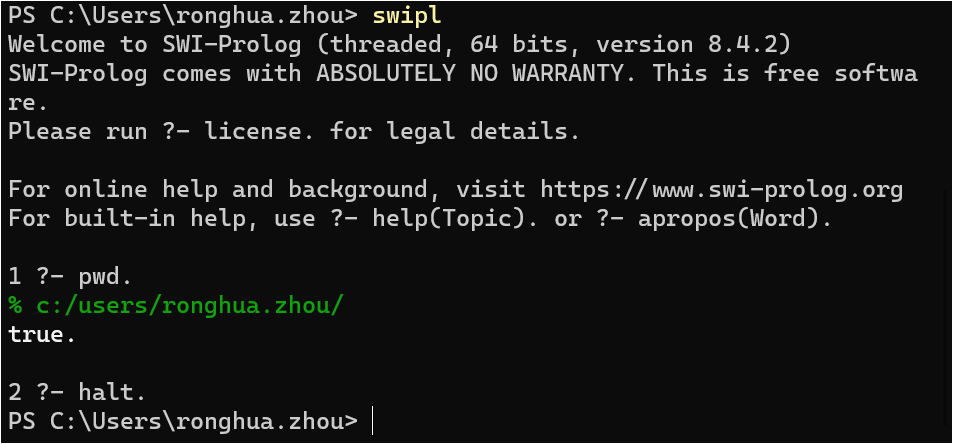

图4.1 swipl的prolog界面

给定程序，这里面有几个BB基本块？

| 1 | if b1 |
| --- | --- |
| 2 | then |
| 3 | while b2 |
| 4 | do x = a1 |
| 5 | else |
| 6 | while b3 |
|  | do x = a2 |
|  | x = a3 |
|  |  |

BB列表：

1: b1

2: b2

3: x=a1

4: b3

5: x=a2

6: x=a3

通过BB分析画出CFG的dot描述：

| 1 | digraph { |
| --- | --- |
| 2 | "1: b1" -> {"2: b2" "4: b3"} |
| 3 | "2: b2" -> "3: x=a1" -> "2: b2" |
| 4 | "4: b3" -> "5: x=a2" -> "4: b3" |
| 5 | {"2: b2" "4: b3"} -> "6: x=a3" |
| 6 | } |

转化成图的样子：

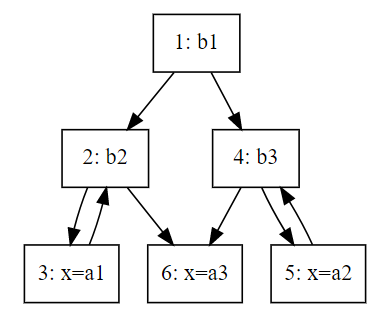

图4.2 一个简单的控制流图

下面复习上一章的可达定义（reaching definition），上例的推导过程如下：

| 1 | IN[x1] = {} |
| --- | --- |
| 2 | IN[x2] = OUT[x1] ∪ OUT[x3] |
| 3 | IN[x3] = OUT[x2] |
| 4 | IN[x4] = OUT[x1] ∪ OUT[x5] |
| 5 | IN[x5] = OUT[x4] |
| 6 | IN[x6] = OUT[x2] ∪ OUT[x4] |
| 7 | OUT[x1] = IN[x1] |
| 8 | OUT[x2] = IN[x2] |
| 9 | OUT[x3] = (IN[x3]\{3,5,6}) ∪ {3} |
| 10 | OUT[x4] = IN[x4] |
| 11 | OUT[x5] = (IN[x5]\{3,5,6}) ∪ {5} |
| 12 | OUT[x6] = (IN[x6]\{3,5,6}) ∪ {6} |

我们将这里的过程整理成prolog代码：

| 1 | diff([], _, []). |
| --- | --- |
| 2 | diff([H|T], L, LL) :- member(H, L), diff(T, L, LL). |
| 3 | diff([H|T], L, [H|LL]) |
| 4 | :- \+ member(H, L), diff(T, L, LL). |
| 5 | union([], L, L). |
| 6 | union([H|T], L, [H|LL]) |
| 7 | :- union(T, L, LL). |
| 8 | solution([X1_IN, X2_IN, X3_IN, X4_IN, X5_IN, X6_IN, |
| 9 | X1_OUT, X2_OUT, X3_OUT, X4_OUT, X5_OUT, X6_OUT]) :- |
| 10 | X1_IN = [], |
| 11 | union(X1_OUT, X3_OUT, X2_IN), |
| 12 | X3_IN = X2_OUT, |
| 13 | union(X1_OUT, X5_OUT, X4_IN), |
| 14 | X5_IN = X4_OUT, |
| 15 | union(X2_OUT, X4_OUT, X6_IN), |
| 16 | X1_OUT = X1_IN, |
| 17 | X2_OUT = X2_IN, |
| 18 | diff(X3_IN, [3, 5, 6], XA), union(XA, [3], X3_OUT), |
| 19 | X4_OUT = X4_IN, |
| 20 | diff(X5_IN, [3, 5, 6], XB), union(XB, [5], X5_OUT), |
| 21 | diff(X6_IN, [3, 5, 6], XC), union(XC, [6], X6_OUT), !. |
| 22 |  |
| 23 |  |

prolog的语法可以参考swi-prolog的手册manual (swi-prolog.org)，注意swi的prolog自己扩展了一些prolog函数，有些函数在其他版本的prolog里面不一定能用。

将上面的prolog代码保存成一个pl文件，例如rd.pl，运行swipl(linux 下是gprolog)，加载并运行，可以得到solution([[], [3], [3], [5], [5], [3, 5], [], [3], [3], [5], [5], [6]]) 的返回值是true（gprolog返回yes）。如果想知道推导过程，可以用“trace.”打开单步执行：

| 1 | PS D:\doc\DC888\hw> swipl |
| --- | --- |
| 2 | 1 ?- [rd]. |
| 3 | true. |
| 4 | 2 ?- solution([[], [3], [3], [5], [5], [3, 5], [], [3], [3], [5], [5], [6]]). |
| 5 | true. |
| 6 | 3 ?- trace. |
| 7 | true. |
| 8 | [trace] 3 ?- solution([[], [3], [3], [5], [5], [3, 5], [], [3], [3], [5], [5], [6]]). |
| 9 | Call: (10) solution([[], [3], [3], [5], [5], [3, 5], [], [...]|...]) ? creep |
| 10 | Call: (11) []=[] ? creep |
| 11 | Exit: (11) []=[] ? creep |
| 12 | Call: (11) union([], [3], [3]) ? creep |
| 13 | Exit: (11) union([], [3], [3]) ? creep |
| 14 | Call: (11) [3]=[3] ? creep |
| 15 | Exit: (11) [3]=[3] ? creep |
| 16 | Call: (11) union([], [5], [5]) ? creep |
| 17 | Exit: (11) union([], [5], [5]) ? creep |
| 18 | Call: (11) [5]=[5] ? creep |
| 19 | Exit: (11) [5]=[5] ? creep |
| 20 | Call: (11) union([3], [5], [3, 5]) ? creep |
| 21 | Call: (12) lists:member(3, [5]) ? creep |
| 22 | Fail: (12) lists:member(3, [5]) ? creep |
| 23 | Redo: (11) union([3], [5], [3, 5]) ? creep |
| 24 | Call: (12) lists:member(3, [5]) ? creep |
| 25 | Fail: (12) lists:member(3, [5]) ? creep |
| 26 | Redo: (11) union([3], [5], [3, 5]) ? creep |
| 27 | Call: (12) union([], [5], [5]) ? creep |
| 28 | Exit: (12) union([], [5], [5]) ? creep |
| 29 | Exit: (11) union([3], [5], [3, 5]) ? creep |
| 30 | Call: (11) []=[] ? creep |
| 31 | Exit: (11) []=[] ? creep |
| 32 | Call: (11) [3]=[3] ? creep |
| 33 | Exit: (11) [3]=[3] ? creep |
| 34 | Call: (11) diff([3], [3, 5, 6], _20084) ? creep |
| 35 | Call: (12) lists:member(3, [3, 5, 6]) ? creep |
| 36 | Exit: (12) lists:member(3, [3, 5, 6]) ? creep |
| 37 | Call: (12) diff([], [3, 5, 6], _20084) ? creep |
| 38 | Exit: (12) diff([], [3, 5, 6], []) ? creep |
| 39 | Exit: (11) diff([3], [3, 5, 6], []) ? creep |
| 40 | Call: (11) union([], [3], [3]) ? creep |
| 41 | Exit: (11) union([], [3], [3]) ? creep |
| 42 | Call: (11) [5]=[5] ? creep |
| 43 | Exit: (11) [5]=[5] ? creep |
| 44 | Call: (11) diff([5], [3, 5, 6], _27698) ? creep |
| 45 | Call: (12) lists:member(5, [3, 5, 6]) ? creep |
| 46 | Exit: (12) lists:member(5, [3, 5, 6]) ? creep |
| 47 | Call: (12) diff([], [3, 5, 6], _27698) ? creep |
| 48 | Exit: (12) diff([], [3, 5, 6], []) ? creep |
| 49 | Exit: (11) diff([5], [3, 5, 6], []) ? creep |
| 50 | Call: (11) union([], [5], [5]) ? creep |
| 51 | Exit: (11) union([], [5], [5]) ? creep |
| 52 | Call: (11) diff([3, 5], [3, 5, 6], _2514) ? creep |
| 53 | Call: (12) lists:member(3, [3, 5, 6]) ? creep |
| 54 | Exit: (12) lists:member(3, [3, 5, 6]) ? creep |
| 55 | Call: (12) diff([5], [3, 5, 6], _2514) ? creep |
| 56 | Call: (13) lists:member(5, [3, 5, 6]) ? creep |
| 57 | Exit: (13) lists:member(5, [3, 5, 6]) ? creep |
| 58 | Call: (13) diff([], [3, 5, 6], _2514) ? creep |
| 59 | Exit: (13) diff([], [3, 5, 6], []) ? creep |
| 60 | Exit: (12) diff([5], [3, 5, 6], []) ? creep |
| 61 | Exit: (11) diff([3, 5], [3, 5, 6], []) ? creep |
| 62 | Call: (11) union([], [6], [6]) ? creep |
| 63 | Exit: (11) union([], [6], [6]) ? creep |
| 64 | Exit: (10) solution([[], [3], [3], [5], [5], [3, 5], [], [...]|...]) ? creep |
| 65 | true. |
| 66 |  |
| 67 |  |
| 68 |  |
| 69 |  |

solution([[], [3], [3], [5], [5], [3, 5], [], [3], [3], [5], [5], [6]])执行返回true表示，1~6处的reaching definition的输入集合分别为：

[], [3], [3], [5], [5], [3, 5]，

输出集合分别为：

[], [3], [3], [5], [5], [6]

的情况下，是能被验证成功的。

但验证通过的集合不一定是最优解，例如，如果在一些集合中加入4，一样也能推导成功：

solution([[], [3], [3], [4, 5], [4, 5], [3, 4, 5], [], [3], [3], [4, 5], [4, 5], [4, 6]]).

一般的，把这些4换成任意变量也是能成功的：

| 1 | PS D:\doc\DC888\hw> swipl |
| --- | --- |
| 2 | 1 ?- [rd]. |
| 3 | true. |
| 4 | 2 ?- solution([[], [3], [3], [a, 5], [a, 5], [3, a, 5], [], [3], [3], [a, 5], [a, 5], [a, 6]]). |
| 5 | true. |
| 6 | 3 ?- |
| 7 |  |
| 8 |  |
| 9 |  |

这主要是因为集合的diff和union函数中有一个特殊处理，下面2个函数的意思是，不论H是否是L的成员diff([H|T], L, [H|LL])和diff(T, L, LL)等价，union([H|T], L, [H|LL])和union(T, L, LL)等价，这对一些未知元素的推导会非常有用：

| 1 | diff([H|T], L, [H|LL]) |
| --- | --- |
| 2 | :- \+ member(H, L), diff(T, L, LL). |
| 3 | union([H|T], L, [H|LL]) |
| 4 | :- \+ member(H, L), union(T, L, LL). |
| 5 | ji |

就实际意义而言，程序点4或者程序点2处，如果新定义了变量，则可以传递到后面程序点的reaching definition集合里面，如果没有定义任何变量（例如当前的例程只是做了true和false的判断），那后面就没有程序点4或者程序点2处新增的变量集合。

虽然这个推导能容忍不同的答案，但还是能保证一致性，如果将X6_OUT换成空，则程序会报false：

| 1 | PS D:\doc\DC888\hw> swipl |
| --- | --- |
| 2 | 1 ?- [rd]. |
| 3 | true. |
| 4 | 2 ?- solution([[], [3], [3], [a, 5], [a, 5], [3, a, 5], [], [3], [3], [a, 5], [a, 5], []]). |
| 5 | false. |
| 6 | 3 ?- |
| 7 |  |
| 8 |  |
| 9 |  |

因为不论前面的输入或者输出集合怎么变化，在程序点6新定义了变量x，这个新增的变量x肯定是能进入程序点6的reaching definition的输出集合的。

### 4.1.2 静态分析和动态分析结果

静态分析有时候会提供一些在实际运行中不可能发生的结果。

例如对下面的CFG，由于y是x的平方，肯定不会小于0，所以程序点4肯定执行不到。

如果实际运行中某个定义D在基本块B处可达，但静态分析推导出来的结果是不可达，则称该静态分析为假不可达（false negative，与核酸检测中的假阴性类似）。假不可达属于错误结论。若本为阳性却检出阴性且未复核，会导致漏检；假阴性在分析中的后果同样严重。

相对的，如果静态分析的结果认为某个定义D在基本块B处可达，但实际运行过程中不可达，则认为这个静态分析是假的可达（false positive，类似核酸检测的假阳）。假的可达是不严密的（imprecise），但不能算错误。例如核酸检测中出现假阳，后面会专门进行复核，如果多次复核之后发现是假阳，之前的检测结果可以取消掉。

图4.3 一个存在不可达节点的控制流图

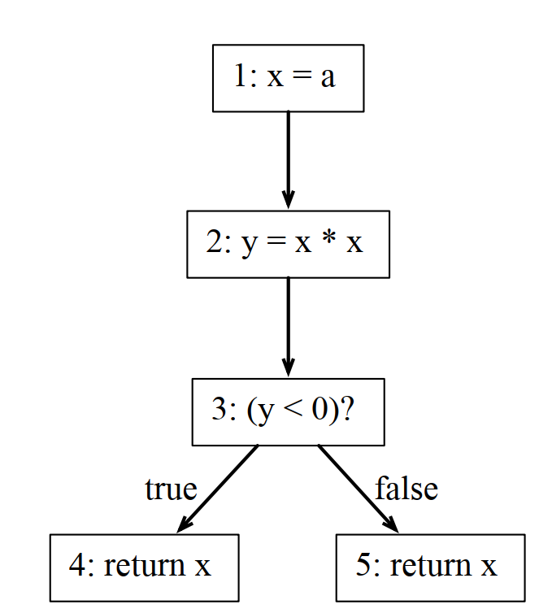

### 4.1.3 使用prolog找到解决方案

前面prolog执行过程主要都是检查某个解决方案是否正确，但实际上也可以用prolog找到解决方案。

但要注意，prolog是对系统空间的穷举计算（类似tla+，Temporal Logic of Actions，参见The TLA+ Home Page (lamport.azurewebsites.net)），所以有些推导可能是非常耗时，甚至由于中间存在循环，可能永远无法结束。

还是上面的例子，如果执行下面的命令，在windows下面会一直循环下去，在linux下执行会提示堆栈溢出，加了“length(X5_OUT, 1), ”限制就能正常跑出结果：

solution([X1_IN, X2_IN, X3_IN, X4_IN, X5_IN, X6_IN, X1_OUT, X2_OUT,
X3_OUT, X4_OUT, [5], X6_OUT]).

| 1 | root@794bb5fbd58a:~/DCC888# gprolog |
| --- | --- |
| 2 | GNU Prolog 1.3.0 |
| 3 | By Daniel Diaz |
| 4 | Copyright (C) 1999-2007 Daniel Diaz |
| 5 | | ?- [rd1]. |
| 6 | compiling /home/ronghua.zhou/DCC888/rd1.pl for byte code... |
| 7 | /home/ronghua.zhou/DCC888/rd1.pl compiled, 21 lines read - 4036 bytes written, 6 ms |
| 8 | yes |
| 9 | | ?- X5_OUT = [5], |
| 10 | X1_IN = [], |
| 11 | X2_IN = [3], |
| 12 | X3_IN = [3], |
| 13 | X4_IN = [5], |
| 14 | X5_IN = [5], |
| 15 | X6_IN = [3, 5], |
| 16 | OUT = [], |
| 17 | X2X1_OUT = [], |
| 18 | _OUTX2_OUT = [3], |
| 19 | X3_OUT = [3], |
| 20 | X4_OUT = [5], |
| 21 | X6_OUT = [6] . |
| 22 | X1_IN = [] |
| 23 | X1_OUT = [] |
| 24 | X2_IN = [3] |
| 25 | X2_OUT = [3] |
| 26 | X3_IN = [3] |
| 27 | X3_OUT = [3] |
| 28 | X4_IN = [5] |
| 29 | X4_OUT = [5] |
| 30 | X5_IN = [5] |
| 31 | X5_OUT = [5] |
| 32 | X6_IN = [3,5] |
| 33 | X6_OUT = [6] |
| 34 | yes |
| 35 | | ?- length(X5_OUT, 1), solution([X1_IN, X2_IN, X3_IN, X4_IN, X5_IN, X6_IN, |
| 36 | X1_OUT, X2_OUT, X3_OUT, X4_OUT, X5_OUT, X6_OUT]). |
| 37 | X1_IN = [] |
| 38 | X1_OUT = [] |
| 39 | X2_IN = [3] |
| 40 | X2_OUT = [3] |
| 41 | X3_IN = [3] |
| 42 | X3_OUT = [3] |
| 43 | X4_IN = [5] |
| 44 | X4_OUT = [5] |
| 45 | X5_IN = [5] |
| 46 | X5_OUT = [5] |
| 47 | X6_IN = [3,5] |
| 48 | X6_OUT = [6] |
| 49 | yes |
| 50 | | ?- solution([X1_IN, X2_IN, X3_IN, X4_IN, X5_IN, X6_IN, |
| 51 | X1_OUT, X2_OUT, X3_OUT, X4_OUT, X5_OUT, X6_OUT]). |
| 52 | Fatal Error: local stack overflow (size: 8192 Kb, environment variable used: LOCALSZ) |
| 53 |  |
| 54 |  |
| 55 |  |
| 56 |  |
| 57 |  |
| 58 |  |

## 4.2 解决循环worklist的方法

混沌迭代：假定很多约束放在一个袋子里面，每次从袋子中提取一个约束，并解析它，直到所有约束都从袋子里面取出。

### 4.2.1 用混沌迭代解决reaching definition

| 1 | for each i ∈ {1, 2, 3, 4, 5, 6} |
| --- | --- |
| 2 | IN[xi] = {} |
| 3 | OUT[xi] = {} |
| 4 | repeat |
| 5 | for each i ∈ {1, 2, 3, 4, 5, 6} |
| 6 | IN'[xi] = IN[xi]; |
| 7 | OUT'[xi] = OUT[xi]; |
| 8 | OUT[xi] = def(xi) ∪ (IN[xi] \ kill(xi)); |
| 9 | IN[xi] = ∪ OUT[s], s ∈ pred[xi]; |
| 10 | until ∀ i ∈ {1, 2, 3, 4, 5, 6} |
| 11 | IN'[xi] = IN[xi] and OUT'[xi] = OUT[xi] |

### 4.2.2 抽象之后的混沌迭代算法

| 1 | x1 = ⊥ , x2 = ⊥ , … , xn = ⊥ |
| --- | --- |
| 2 | do |
| 3 | t1 = x1 ; … ; tn = xn |
| 4 | x1 = F1 (x1, …, xn) |
| 5 | … |
| 6 | xn = Fn (x1, …, xn) |
| 7 | while (x1 ≠ t1 or … or xn ≠ tn) |

根据不动点原理（Fixed Point Theory，参见Fixed Point Theory - an overview | ScienceDirect Topics），可以证明该计算过程存在一个不动点，也就是即使在不规定具体执行顺序的情况下，也能正常终结。但这个原始算法的复杂度是O(n5)，几乎比所有真实存在的算法的复杂度都要高。但如果给定条件是所有节点之间是有序的，这个复杂度可以最终降维到O(n)，也就是线性复杂度，很多实验也证实了这种假定。

下面是课程中给出混沌迭代算法是线性复杂度的证据，列举了污染分析和指针分析的复杂度相对程序规模的增长情况（这个图左边坐标系是指数坐标系，如果复杂度相对指数坐标系是线性，那只能说明这个复杂度是指数复杂度）：

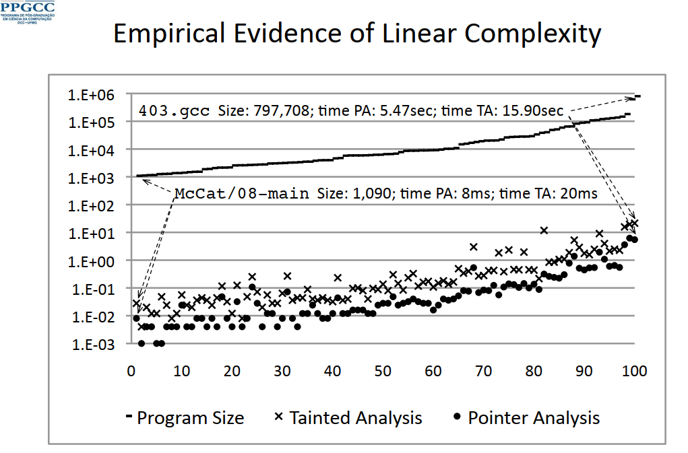

图4.4 几种常见的分析算法的复杂度统计

### 4.2.3 混沌迭代计算的加速

对等式的计算如果不加排序，复杂度是惊人的，但通过一定的计算排序，可以有效降低计算复杂度。

找到约束变量之间的依赖图：

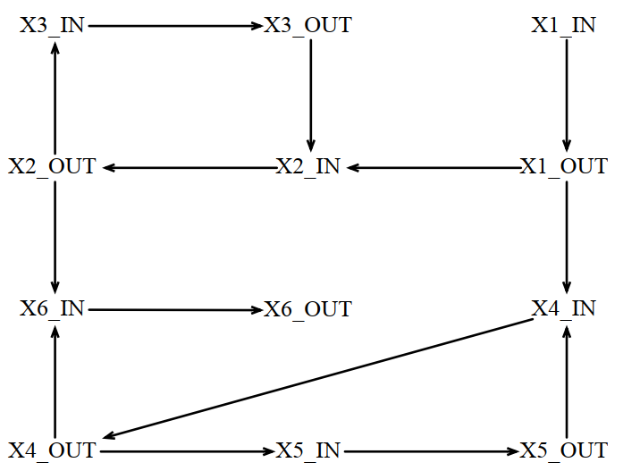

图4.5 迭代计算输入输出之间的依赖关系图

### 4.2.4 混沌迭代的worklist表达

| 1 | x1 = ⊥ , x2 = ⊥ , … , xn = ⊥ |
| --- | --- |
| 2 | w = [v1, …, vn] |
| 3 | while (w ≠ []) |
| 4 | vi = extract(w) |
| 5 | y = Fi (x1, …, xn) |
| 6 | if y ≠ xi |
| 7 | for v ∈ dep(vi) |
| 8 | w = insert(w, v) |
| 9 | xi = y |

为了方便讲解，原来的计算方法对6个程序点，存在12个参数（6个IN，6个OUT），但实际上IN和OUT能相互推导，所以只保留6个输入的集合不会影响计算效果，简化版的reaching definition的推导程序如下：

| 1 | solution([X1_IN, X2_IN, X3_IN, X4_IN, X5_IN, X6_IN]) :- |
| --- | --- |
| 2 | X1_IN = [], /* F1 */ |
| 3 | diff(X3_IN, [3, 5, 6], XA), union(XA, X1_IN, XB), union(XB, [3], X2_IN), /* F2 */ |
| 4 | X3_IN = X2_IN, /* F3 */ |
| 5 | diff(X5_IN, [3, 5, 6], XC), union(XC, X1_IN, XD), union(XD, [5], X4_IN), /* F4 */ |
| 6 | X5_IN = X4_IN, /* F5 */ |
| 7 | union(X2_IN, X5_IN, X6_IN), !. /* F6 */ |

注意，上面solution函数中的每一行都是生成worklist算法中y的Fi，worklist中的dep(vi)是之前依赖图中的依赖关系集合，例如对程序点1，实际上所有程序点的输入和输出集合都依赖它，即使简化之后只剩下输入集合，也是2到6的输入集合都依赖程序点1，但dep(vi)只计算直接依赖，也就是说dep(v1)={x2, x4}，为了便于推导，我们先生成简化版依赖图。

| 1 | digraph { |
| --- | --- |
| 2 | "X1_IN" -> {"X2_IN" "X4_IN"} |
| 3 | "X2_IN" -> "X3_IN" -> "X2_IN" |
| 4 | "X4_IN" -> "X5_IN" -> "X4_IN" |
| 5 | {"X2_IN" "X4_IN"} -> "X6_IN" |
| 6 | } |

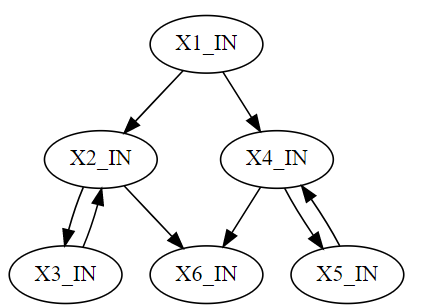

图4.6 简化的计算输入输出之间的依赖关系图

从这幅简化版的依赖图中可以看出与 CFG 的对应关系：简化依赖图本质上即 CFG（当某 BB 不只有一条指令时，简化依赖图中每个变量会对应一个变量集合，依赖关系仍与 CFG 一致）。因此后续做 worklist 计算时，只需依据 CFG 即可完成。

下面手工推导 worklist 表。注意推导中 insert 与 extract 采用 LIFO 栈（Last-In, First-Out，后进先出），且不关心栈中是否已存在对应元素：

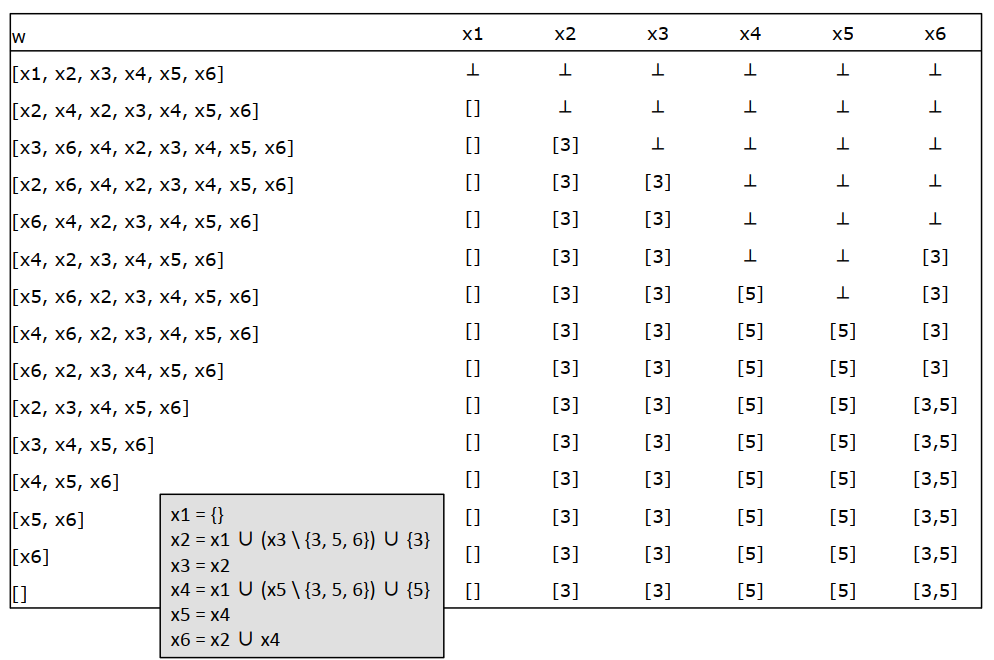

图4.6 工作列表的推导过程

### 4.2.5 寻找更好的遍历顺序

因为前面画出来的依赖图是对部分节点并不存在循环，所以它不存在一个拓扑意义上的遍历顺序，但我们可以有一个准遍历顺序（quasi-ordering）。

以下概念参考Directed graph traversal, orderings and applications to data-flow analysis - Eli Bendersky's website (thegreenplace.net)。

深度优先搜索（Depth-First Search），也称为深度优先遍历（Depth-First Span），从根节点开始遍历。将当前遍历节点加入遍历过的列表，并对与当前节点有联通边的所有节点进行深度优先遍历。下面是python的伪代码：

| 1 | def dfs(graph, root, visitor): |
| --- | --- |
| 2 | """DFS over a graph. |
| 3 | Start with node 'root', calling 'visitor' for every visited node. |
| 4 | """ |
| 5 | visited = set() |
| 6 | def dfs_walk(node): |
| 7 | visited.add(node) |
| 8 | visitor(node) |
| 9 | for succ in graph.successors(node): |
| 10 | if not succ in visited: |
| 11 | dfs_walk(succ) |
| 12 | dfs_walk(root) |

图中的DFS和普通的树不一样，因为可能一个节点有多个父节点，可能会存在部分节点先遍历子结点再遍历父节点的情况。例如对之前那个例程的CFG，DFS的顺序是[1, 2, 3, 6, 4, 5]，画成图这样的：

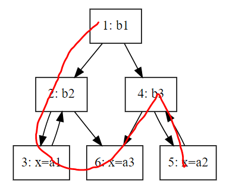

图4.6 先根深度优先遍历顺序

后根序列（post-order）：和DFS的遍历过程类似，但注意这里是先遍历，再加入到列表。生成的顺序是[3, 6, 2, 5, 4, 1]（按算法本身来说也可能生成[6, 3, 2, 5, 4, 1]）。下面是后根序列的python代码：

| 1 | def postorder(graph, root): |
| --- | --- |
| 2 | """Return a post-order ordering of nodes in the graph.""" |
| 3 | visited = set() |
| 4 | order = [] |
| 5 | def dfs_walk(node): |
| 6 | visited.add(node) |
| 7 | for succ in graph.successors(node): |
| 8 | if not succ in visited: |
| 9 | dfs_walk(succ) |
| 10 | order.append(node) |
| 11 | dfs_walk(root) |
| 12 | return order |

画出来的图是这样的：

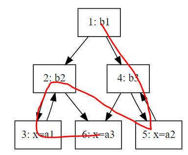

图4.6 后根深度优先遍历顺序

反向后根遍历（Reverse postorder）：即后根遍历序列的逆序，简称 rPostorder。生成的顺序是[1,4, 5, 2, 6, 3]。图和后根遍历的一样，只不过方向相反。

当然，一个图转换成DFS或者rPostorder的时候，由于对多个节点共父节点的情况下，这多个节点之间的顺序是不确定的，所以可能会存在多个DFS或者Postorder，也就会有多个rPostorder。

基于rPostorder的worklist算法伪代码：

| 1 | insert(v, P): |
| --- | --- |
| 2 | return P ∪ {v} |
| 3 | extract(C, P): |
| 4 | if C = [] |
| 5 | C = sort_rPostorder(P) |
| 6 | P = {} |
| 7 | return (head(C), (tail(C), P)) |
| 8 | main: |
| 9 | x1 = ⊥ , x2 = ⊥ , … , xn = ⊥ |
| 10 | C=[], P={v1, ... , vn} |
| 11 | while (C ≠ [] || P ≠ {}) |
| 12 | vi, C, P = extract(C, P) |
| 13 | y = Fi (x1, …, xn) |
| 14 | if y ≠ xi |
| 15 | for v ∈ dep(vi) |
| 16 | P = insert(v, P) |
| 17 | xi = y |
| 18 |  |
| 19 |  |

下面的rPostorder版本的worklist算法是按[1, 2, 3, 4, 6, 5]的排序来进行的，换成其他 rPostorder 序列，推导步数相同。

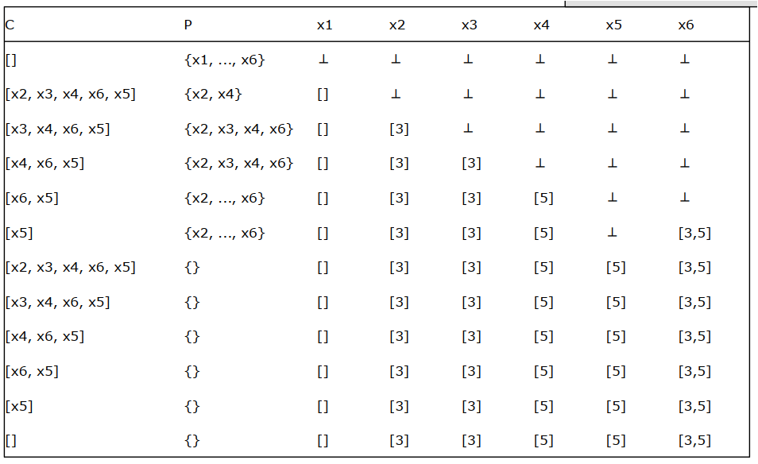

图4.7 使用逆后根排序的工作列表的推导过程

这样排序造成的一个直接后果就是所有子结点的遍历必须在父节点之后，这样确保它的所有前驱节点都先遍历，这样导致第一轮C计算到[]之后，第二轮遍历过程中P不会再有新的元素出现，确保两轮遍历之后算法结束。

从上图看，第一轮遍历完之后，所有输入集合基本上就不变了，那第二轮遍历是否可以省略？

## 4.3 强子图

强子图（Strong Components，简称SC或者SCG）：如果某个图中存在一个最大的子图，子图中任意节点之间都联通，则称为强子图，也可以叫强连通子图（简称SCC或者SCCG）。

由于SC的拓扑一致性，也就是说把SC当做一个普通节点计算出来的约束系统和把SC中的所有节点拆分开之后计算出来的约束系统是一致的，所以通常可以用SC来对图进行降维。

降维之后的CFG的dot描述如下：

| 1 | digraph { |
| --- | --- |
| 2 | "1: b1" -> {"2: b2, 3: x=a1" "4: b3, 5: x=a2"} -> "6: x=a3" |
| 3 | } |

画出来的图是这样的：

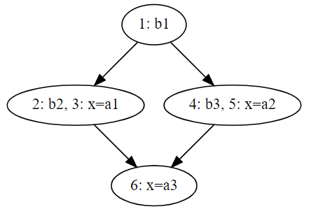

图4.8 降维之后的控制流图

基于SCC的拓扑一致性，可以先将某个SCC或者其前驱程序点的约束计算完（计算完的意思是计算到某个不动点），再计算该SCC后继的程序点，计算后继节点的程序点时不需要往前遍历。基于SCC的worklist遍历过程：

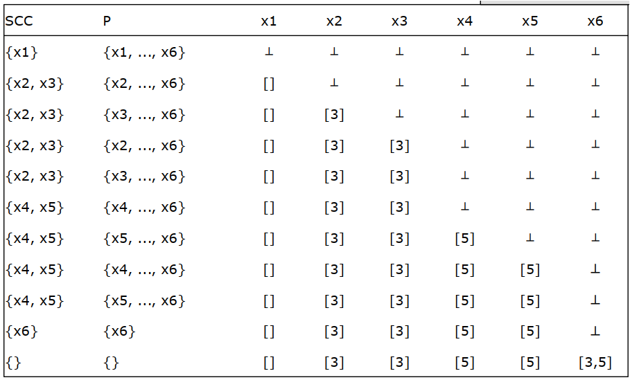

图4.9 基于强子图优化之后的工作列表的推导过程

## 4.4 算法简化：轮转迭代

轮转迭代不用保存一个待解析的列表，也不用怎么实现extract和insert，但会迭代更多次数。

| 1 | x1 = ⊥ , x2 = ⊥ , … , xn = ⊥ |
| --- | --- |
| 2 | change = true |
| 3 | while (change) |
| 4 | change = false |
| 5 | for i = 1 to n do |
| 6 | y = Fi (x1, …, xn) |
| 7 | if y ≠ xi |
| 8 | change = true |
| 9 | xi = y |

15步可以把约束系统计算完毕：

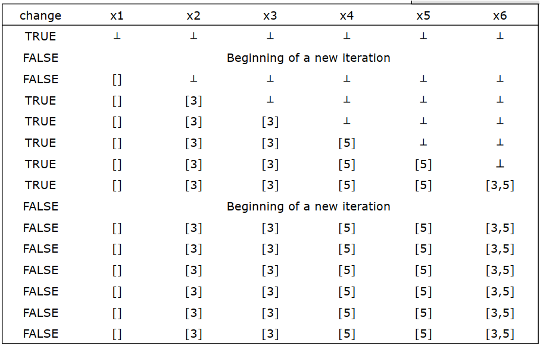

图4.10 简化算法的工作列表的推导过程

## 4.5 集合的表达

### 4.5.1 bit-vectors位图矩阵

位图矩阵一般在紧密分析中适用，每个元素占用一个bit，空间上只需要N/K个字，其中N是元素个数，K是每个字的bit位个数，插入的复杂度是O(1)，运行复杂度是线性的。

### 4.5.2 其他表达方式

哈希表和链表通常对稀疏分析时适用，因为大多数元素并不会在某个程序点有值，适用哈希表可以只保存有值的元素。

## 4.6 工作列表（worklist）算法简史

第一次引入worklist：Kildall, G. "A Unified Approach to Global Program Optimization", POPL, 194-206 (1973)

第一次使用SCC进行数据流分析：Horwitz, S. Demers, A. and Teitelbaum, T. "An efficient general iterative algorithm for dataflow analysis", Acta Informatica, 24, 679-694 (1987)

其他分析：Hecht, M. S. "Flow Analysis of Computer Programs", North Holland, (1977)

## 4.7 LLVM的工作列表算法实现

### 4.7.1 Clang中使用worklist代码分析

LLVM 中的 worklist 算法分散在各处实现，无单独模块；下面摘录的是 clang 中抽象出的 worklist 相关代码。

#### 4.7.1.1 头文件和全局定义

clang\lib\StaticAnalyzer\Core\WorkList.cpp

|   | // 头文件和全局宏定义。 |
| --- | --- |
| 13 | #include "clang/StaticAnalyzer/Core/PathSensitive/WorkList.h" |
| 14 | #include "llvm/ADT/PriorityQueue.h" |
| 15 | #include "llvm/ADT/DenseSet.h" |
| 16 | #include "llvm/ADT/DenseMap.h" |
| 17 | #include "llvm/ADT/STLExtras.h" |
| 18 | #include "llvm/ADT/Statistic.h" |
| 19 | #include <deque> |
| 20 | #include <vector> |
| 21 |  |
| 22 | using namespace clang; |
| 23 | using namespace ento; |
| 24 |  |
| 25 | #define DEBUG_TYPE "WorkList" |
|   | // worklist的最大队列长度和最大可达统计。 |
| 26 |  |
| 27 | STATISTIC(MaxQueueSize, "Maximum size of the worklist"); |
| 28 | STATISTIC(MaxReachableSize, "Maximum size of auxiliary worklist set"); |
| 29 |  |

#### 4.7.1.2 深度优先遍历和广度优先遍历的worklist实现

这里先生成了两种基本的worklist，DFS，深度优先遍历worklist，和BFS，广度优先遍历worklist。

clang\lib\StaticAnalyzer\Core\WorkList.cpp

| 30 | //===----------------------------------------------------------------------===// |
| --- | --- |
| 31 | // Worklist classes for exploration of reachable states. |
| 32 | //===----------------------------------------------------------------------===// |
| 33 |  |
| 34 | namespace { |
|   | // 深度优先遍历方法的worklist实现是基于vector的。 |
| 35 |  |
| 36 | class DFS : public WorkList { |
| 37 | SmallVector<WorkListUnit, 20> Stack; |
| 38 |  |
| 39 | public: |
|   | // worklist的实现继承类需要实现是否有遗留工作方法。 |
| 40 | bool hasWork() const override { |
| 41 | return !Stack.empty(); |
| 42 | } |
|   | // worklist的实现继承类需要实现入队方法。 |
| 43 |  |
| 44 | void enqueue(const WorkListUnit& U) override { |
| 45 | Stack.push_back(U); |
| 46 | } |
|   | // worklist的实现继承类需要实现出队方法。 |
| 47 |  |
| 48 | WorkListUnit dequeue() override { |
| 49 | assert(!Stack.empty()); |
| 50 | const WorkListUnit& U = Stack.back(); |
| 51 | Stack.pop_back(); // This technically "invalidates" U, but we are fine. |
| 52 | return U; |
| 53 | } |
| 54 | }; |
|   | // 广度优先遍历方法的worklist实现是基于deque的。 |
| 55 |  |
| 56 | class BFS : public WorkList { |
| 57 | std::deque<WorkListUnit> Queue; |
| 58 |  |
| 59 | public: |
|   | // 广度优先遍历方法的worklist的hasWork实现和深度优先一样。 |
| 60 | bool hasWork() const override { |
| 61 | return !Queue.empty(); |
| 62 | } |
|   | // 广度优先遍历方法的worklist的入队实现和深度优先也一样。 |
| 63 |  |
| 64 | void enqueue(const WorkListUnit& U) override { |
| 65 | Queue.push_back(U); |
| 66 | } |
|   | // 广度优先遍历方法的worklist的出队实现和深度优先不一样。 |
|   | // 广度优先遍历方法是从头出队，深度优先是从尾出队。 |
| 67 |  |
| 68 | WorkListUnit dequeue() override { |
| 69 | WorkListUnit U = Queue.front(); |
| 70 | Queue.pop_front(); |
| 71 | return U; |
| 72 | } |
| 73 | }; |
| 74 |  |
| 75 | } // namespace |
| 76 |  |

#### 4.7.1.3 生成广度优先和深度优先的worklist

clang\lib\StaticAnalyzer\Core\WorkList.cpp

|   | // 存在虚拟成员函数的类，需要有虚拟析构函数，但实在不知道该写啥， |
| --- | --- |
|   | // 就让编译器帮自动生成一个。 |
| 77 | // Place the dstor for WorkList here because it contains virtual member |
| 78 | // functions, and we the code for the dstor generated in one compilation unit. |
| 79 | WorkList::~WorkList() = default; |
|   | // 生成一个深度优先遍历的worklist唯一对象。 |
| 80 |  |
| 81 | std::unique_ptr<WorkList> WorkList::makeDFS() { |
| 82 | return std::make_unique<DFS>(); |
| 83 | } |
|   | // 生成一个广度优先遍历的worklist唯一对象。 |
| 84 |  |
| 85 | std::unique_ptr<WorkList> WorkList::makeBFS() { |
| 86 | return std::make_unique<BFS>(); |
| 87 | } |

广度和深度优先遍历结合的worklist：BFSBlockDFSContents

BFSBlockDFSContents是广度优先遍历的worklist和深度优先遍历的worklist相互结合的产物，对基本块的遍历采用广度优先，先遍历平级节点。对每个基本块的内容，采用深度优先。

clang\lib\StaticAnalyzer\Core\WorkList.cpp

| 89 | namespace { |
| --- | --- |
| 90 |  |
| 91 | class BFSBlockDFSContents : public WorkList { |
| 92 | std::deque<WorkListUnit> Queue; |
| 93 | SmallVector<WorkListUnit, 20> Stack; |
| 94 |  |
| 95 | public: |
|   | // 如果基本块和工作内容都为空，才表示没事可做。 |
| 96 | bool hasWork() const override { |
| 97 | return !Queue.empty() || !Stack.empty(); |
| 98 | } |
|   | // 如果加入的工作是基本块，则入队列，否则入栈。 |
| 99 |  |
| 100 | void enqueue(const WorkListUnit& U) override { |
| 101 | if (U.getNode()->getLocation().getAs<BlockEntrance>()) |
| 102 | Queue.push_front(U); |
| 103 | else |
| 104 | Stack.push_back(U); |
| 105 | } |
|   | // 先处理栈里面的实际工作内容。 |
| 106 |  |
| 107 | WorkListUnit dequeue() override { |
| 108 | // Process all basic blocks to completion. |
| 109 | if (!Stack.empty()) { |
| 110 | const WorkListUnit& U = Stack.back(); |
| 111 | Stack.pop_back(); // This technically "invalidates" U, but we are fine. |
| 112 | return U; |
| 113 | } |
|   | // 再处理BB队列里面的工作。 |
| 114 |  |
| 115 | assert(!Queue.empty()); |
| 116 | // Don't use const reference.  The subsequent pop_back() might make it |
| 117 | // unsafe. |
| 118 | WorkListUnit U = Queue.front(); |
| 119 | Queue.pop_front(); |
| 120 | return U; |
| 121 | } |
| 122 | }; |
| 123 |  |
| 124 | } // namespace |
|   | // 生成BFSBlockDFSContents对象。 |
| 125 |  |
| 126 | std::unique_ptr<WorkList> WorkList::makeBFSBlockDFSContents() { |
| 127 | return std::make_unique<BFSBlockDFSContents>(); |
| 128 | } |
| 129 |  |
| 130 |  |

#### 4.7.1.5 未知节点先遍历的worklist：UnexploredFirstStack

UnexploredFirstStack的实现和BFSBlockDFSContents类似，也是有两个可以用来存储剩余工作的数据结构，一个是基本块，一个是具体工作内容。和BFSBlockDFSContents不一样的是，UnexploredFirstStack优先遍历基本块，只有没有基本块需要遍历的情况下，才会遍历具体的工作内容。另外，UnexploredFirstStack用来保存剩余工作的两个数据结构都是基于深度优先遍历。

clang\lib\StaticAnalyzer\Core\WorkList.cpp

| 130 | namespace { |
| --- | --- |
| 131 |  |
| 132 | class UnexploredFirstStack : public WorkList { |
|   | /// 未遍历基本块的vector。 |
| 133 | /// Stack of nodes known to have statements we have not traversed yet. |
| 134 | SmallVector<WorkListUnit, 20> StackUnexplored; |
|   | /// 其他未完成工作内容的vector。 |
| 135 |  |
| 136 | /// Stack of all other nodes. |
| 137 | SmallVector<WorkListUnit, 20> StackOthers; |
|   | /// 基本块ID和行标识的类型定义。 |
|   | /// 注意，某一行对应一个基本块，和自己的一些堆栈上下文。 |
|   | /// 这里说的堆栈帧和函数调用时的堆栈帧是两个不同的概念。 |
| 138 |  |
| 139 | using BlockID = unsigned; |
| 140 | using LocIdentifier = std::pair<BlockID, const StackFrameContext *>; |
|   | /// 可达行是一个基于行标识的集合。 |
| 141 |  |
| 142 | llvm::DenseSet<LocIdentifier> Reachable; |
| 143 |  |
| 144 | public: |
|   | /// 基本块和具体工作内容都为空的时候，才表示无事可做。 |
| 145 | bool hasWork() const override { |
| 146 | return !(StackUnexplored.empty() && StackOthers.empty()); |
| 147 | } |
|   | /// 如果入队的是基本块首行指令，则入基本块的vector |
| 148 |  |
| 149 | void enqueue(const WorkListUnit &U) override { |
| 150 | const ExplodedNode *N = U.getNode(); |
| 151 | auto BE = N->getLocation().getAs<BlockEntrance>(); |
| 152 |  |
| 153 | if (!BE) { |
|   | // 假定之前处理完之后，每个基本块的当前指令就是基本块的第一行。 |
|   | // 所以如果当前需要处理的工作是针对基本块第一行的，就当做基本块第一次处理， |
|   | // 将当前处理任务加入到基本块的vector。 |
| 154 | // Assume the choice of the order of the preceding block entrance was |
| 155 | // correct. |
| 156 | StackUnexplored.push_back(U); |
| 157 | } else { |
|   | // 如果当前需要处理的工作不是针对基本块第一行的，就当做普通任务来处理。 |
|   | // 位置ID使用的上下文，是位置上下文信息里面的堆栈帧。 |
| 158 | LocIdentifier LocId = std::make_pair( |
| 159 | BE->getBlock()->getBlockID(), |
| 160 | N->getLocationContext()->getStackFrame()); |
|   | // 将位置ID信息插入到可达集合。 |
| 161 | auto InsertInfo = Reachable.insert(LocId); |
|   | // InsertInfo的第二个元素就是刚刚获得的堆栈帧上下文。 |
|   | // 基本块可以获得堆栈帧上下文。 |
| 162 |  |
| 163 | if (InsertInfo.second) { |
| 164 | StackUnexplored.push_back(U); |
|   | // 其他工作任务没有堆栈帧上下文。 |
| 165 | } else { |
| 166 | StackOthers.push_back(U); |
| 167 | } |
| 168 | } |
|   | // 更新统计信息。 |
| 169 | MaxReachableSize.updateMax(Reachable.size()); |
| 170 | MaxQueueSize.updateMax(StackUnexplored.size() + StackOthers.size()); |
| 171 | } |
|   | /// 出队时，如果存在未遍历的基本块，优先遍历基本块， |
|   | /// 如果基本块遍历完了，再遍历其他工作内容。 |
| 172 |  |
| 173 | WorkListUnit dequeue() override { |
| 174 | if (!StackUnexplored.empty()) { |
| 175 | WorkListUnit &U = StackUnexplored.back(); |
| 176 | StackUnexplored.pop_back(); |
| 177 | return U; |
| 178 | } else { |
| 179 | WorkListUnit &U = StackOthers.back(); |
| 180 | StackOthers.pop_back(); |
| 181 | return U; |
| 182 | } |
| 183 | } |
| 184 | }; |
| 185 |  |
| 186 | } // namespace |
|   | /// 创建UnexploredFirstStack对象。 |
| 187 |  |
| 188 | std::unique_ptr<WorkList> WorkList::makeUnexploredFirst() { |
| 189 | return std::make_unique<UnexploredFirstStack>(); |
| 190 | } |

4.7.1.6有优先级的UnexploredFirstStack：UnexploredFirstPriorityQueue

UnexploredFirstPriorityQueue是有优先级的UnexploredFirstStack实现，优先级由该任务的访问次数决定，由于入队的时候，对访问次数取了负数，所以实际上变成访问次数越多，优先级越低，也就是未访问的节点优先级最高。

clang\lib\StaticAnalyzer\Core\WorkList.cpp

| 192 | namespace { |
| --- | --- |
| 193 | class UnexploredFirstPriorityQueue : public WorkList { |
| 194 | using BlockID = unsigned; |
| 195 | using LocIdentifier = std::pair<BlockID, const StackFrameContext *>; |
|   | // 每行代码的访问次数map表。实际使用的时候求负， |
|   | // 这样可以得到一个逆序的代码访问次数排列。 |
| 196 |  |
| 197 | // How many times each location was visited. |
| 198 | // Is signed because we negate it later in order to have a reversed |
| 199 | // comparison. |
| 200 | using VisitedTimesMap = llvm::DenseMap<LocIdentifier, int>; |
|   | // 优先级是一个pair数据结构， |
|   | // 该结构的第一个元素是访问次数（负的，为了让最常访问的排在最后）， |
|   | // 第二个元素是插入时间，实际上是一个递增的数字，插入的越晚排在越前。 |
| 201 |  |
| 202 | // Compare by number of times the location was visited first (negated |
| 203 | // to prefer less often visited locations), then by insertion time (prefer |
| 204 | // expanding nodes inserted sooner first). |
| 205 | using QueuePriority = std::pair<int, unsigned long>; |
| 206 | using QueueItem = std::pair<WorkListUnit, QueuePriority>; |
|   | // 比较器是一个结构体，实现了()运算符来计算大小。 |
| 207 |  |
| 208 | struct ExplorationComparator { |
| 209 | bool operator() (const QueueItem &LHS, const QueueItem &RHS) { |
|   | // QueueItem是两层pair结构，第一层是位置ID+pair， |
|   | // 第二层pair是负的访问次数+插入时间， |
|   | // 这里的second的比较会先比较负的访问次数，如果左值小，则返回真； |
|   | // 如果访问次数一样，则比较pair的第二个元素插入时间，如果左值小，则返回真。 |
| 210 | return LHS.second < RHS.second; |
| 211 | } |
| 212 | }; |
|   | // 插入的递增计数，用来在访问次数一样的情况下，区分优先级。 |
| 213 |  |
| 214 | // Number of inserted nodes, used to emulate DFS ordering in the priority |
| 215 | // queue when insertions are equal. |
| 216 | unsigned long Counter = 0; |
|   | // 访问次数的map表。 |
| 217 |  |
| 218 | // Number of times a current location was reached. |
| 219 | VisitedTimesMap NumReached; |
|   | // LLVM的PriorityQueue封装了std::priority_queue， |
|   | // 这里的比较函数的语义是小于，也就是说返回真排在后面。 |
|   | // 优先级队列的top返回的是最大的元素。 |
| 220 |  |
| 221 | // The top item is the largest one. |
| 222 | llvm::PriorityQueue<QueueItem, std::vector<QueueItem>, ExplorationComparator> |
| 223 | queue; |
| 224 |  |
| 225 | public: |
| 226 | bool hasWork() const override { |
| 227 | return !queue.empty(); |
| 228 | } |
|   | // 入队的元素先获取位置ID，然后再计算优先级。 |
| 229 |  |
| 230 | void enqueue(const WorkListUnit &U) override { |
| 231 | const ExplodedNode *N = U.getNode(); |
| 232 | unsigned NumVisited = 0; |
|   | // 注意这里的实际效果和UnexploredFirstStack不一样。 |
|   | // UnexploredFirstStack入队的时候，基本块首行和其他行入不同的队列， |
|   | // 出队的时候，先看基本块队列，再看其他任务队列， |
|   | // 所以导致没有遍历的基本块最先访问。 |
|   | // UnexploredFirstPriorityQueue在入队的时候，如果不是基本块首行的话， |
|   | // 会获取不到访问次数，实际效果是取了默认值0，最终产生的效果是优先级更高！ |
|   | // 这应该是clang里面UnexploredFirstPriorityQueue的实现bug。 |
|   | // 而且这个bug在最新的15版本也没有解决。 |
| 233 | if (auto BE = N->getLocation().getAs<BlockEntrance>()) { |
| 234 | LocIdentifier LocId = std::make_pair( |
| 235 | BE->getBlock()->getBlockID(), |
| 236 | N->getLocationContext()->getStackFrame()); |
| 237 | NumVisited = NumReached[LocId]++; |
| 238 | } |
|   | // 根据位置ID，负的访问次数和插入时间构建队列元素。 |
| 239 |  |
| 240 | queue.push(std::make_pair(U, std::make_pair(-NumVisited, ++Counter))); |
| 241 | } |
|   | // 出队就直接取最大元素。 |
| 242 |  |
| 243 | WorkListUnit dequeue() override { |
| 244 | QueueItem U = queue.top(); |
| 245 | queue.pop(); |
| 246 | return U.first; |
| 247 | } |
| 248 | }; |
| 249 | } // namespace |
|   | /// 生成UnexploredFirstPriorityQueue对象。 |
| 250 |  |
| 251 | std::unique_ptr<WorkList> WorkList::makeUnexploredFirstPriorityQueue() { |
| 252 | return std::make_unique<UnexploredFirstPriorityQueue>(); |
| 253 | } |

4.7.1.7带位置的UnexploredFirstPriorityQueue：UnexploredFirstPriorityLocationQueue

UnexploredFirstPriorityLocationQueue从命名上看，是UnexploredFirstPriorityQueue带上位置信息之后的版本。

clang\lib\StaticAnalyzer\Core\WorkList.cpp

| 255 | namespace { |
| --- | --- |
| 256 | class UnexploredFirstPriorityLocationQueue : public WorkList { |
|   | // 这里的LocIdentifier变了，不是基本块ID和堆栈帧上下文， |
|   | // 改成了控制流图上基本块的指针。 |
| 257 | using LocIdentifier = const CFGBlock *; |
|   | // 这个访问次数表和UnexploredFirstPriorityQueue的定义一样。 |
|   | // 不过因为LocIdentifier的定义变成了基本块的指针， |
|   | // 所以这里实际的含义有细微差异。 |
| 258 |  |
| 259 | // How many times each location was visited. |
| 260 | // Is signed because we negate it later in order to have a reversed |
| 261 | // comparison. |
| 262 | using VisitedTimesMap = llvm::DenseMap<LocIdentifier, int>; |
|   | // 优先级的定义和UnexploredFirstPriorityQueue的定义也一样。 |
| 263 |  |
| 264 | // Compare by number of times the location was visited first (negated |
| 265 | // to prefer less often visited locations), then by insertion time (prefer |
| 266 | // expanding nodes inserted sooner first). |
| 267 | using QueuePriority = std::pair<int, unsigned long>; |
| 268 | using QueueItem = std::pair<WorkListUnit, QueuePriority>; |
|   | // 比较器的定义和UnexploredFirstPriorityQueue的定义也一样。 |
| 269 |  |
| 270 | struct ExplorationComparator { |
| 271 | bool operator() (const QueueItem &LHS, const QueueItem &RHS) { |
| 272 | return LHS.second < RHS.second; |
| 273 | } |
| 274 | }; |
|   | // 插入时间的定义和UnexploredFirstPriorityQueue的定义也一样。 |
| 275 |  |
| 276 | // Number of inserted nodes, used to emulate DFS ordering in the priority |
| 277 | // queue when insertions are equal. |
| 278 | unsigned long Counter = 0; |
|   | // 访问次数的map表的定义和UnexploredFirstPriorityQueue的定义也一样。 |
| 279 |  |
| 280 | // Number of times a current location was reached. |
| 281 | VisitedTimesMap NumReached; |
|   | // 优先级队列的定义和UnexploredFirstPriorityQueue的定义也一样。 |
| 282 |  |
| 283 | // The top item is the largest one. |
| 284 | llvm::PriorityQueue<QueueItem, std::vector<QueueItem>, ExplorationComparator> |
| 285 | queue; |
| 286 |  |
| 287 | public: |
| 288 | bool hasWork() const override { |
| 289 | return !queue.empty(); |
| 290 | } |
| 291 |  |
| 292 | void enqueue(const WorkListUnit &U) override { |
| 293 | const ExplodedNode *N = U.getNode(); |
| 294 | unsigned NumVisited = 0; |
| 295 | if (auto BE = N->getLocation().getAs<BlockEntrance>()) |
|   | // 因为LocIdentifier定义的差异， |
|   | // 这里计算累加映射表里面的访问次数的方法也略有差别， |
|   | // 看起来更简洁了。 |
| 296 | NumVisited = NumReached[BE->getBlock()]++; |
| 297 |  |
| 298 | queue.push(std::make_pair(U, std::make_pair(-NumVisited, ++Counter))); |
| 299 | } |
|   | // 出队方法的定义和UnexploredFirstPriorityQueue的定义也一样。 |
| 300 |  |
| 301 | WorkListUnit dequeue() override { |
| 302 | QueueItem U = queue.top(); |
| 303 | queue.pop(); |
| 304 | return U.first; |
| 305 | } |
| 306 |  |
| 307 | }; |
| 308 |  |
| 309 | } |
|   | // 生成UnexploredFirstPriorityLocationQueue对象。 |
| 310 |  |
| 311 | std::unique_ptr<WorkList> WorkList::makeUnexploredFirstPriorityLocationQueue() { |
| 312 | return std::make_unique<UnexploredFirstPriorityLocationQueue>(); |
| 313 | } |

第 2 篇

进阶分析

少年不识愁滋味，爱上层楼。爱上层楼。为赋新词强说愁。

而今识尽愁滋味，欲说还休。欲说还休。却道天凉好个秋。

——辛弃疾《丑奴儿·书博山道中壁》

