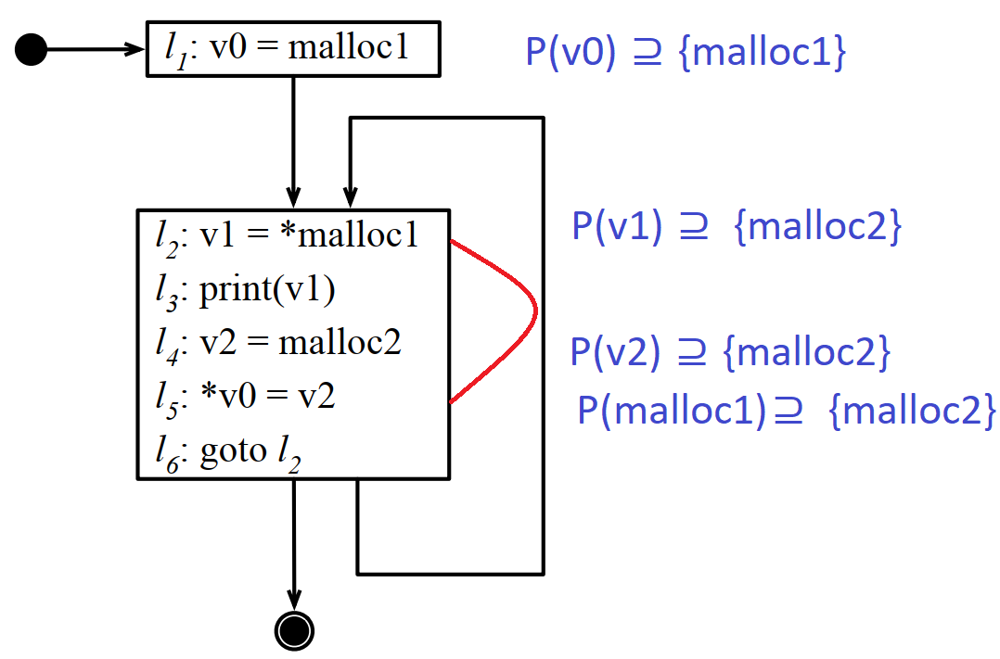
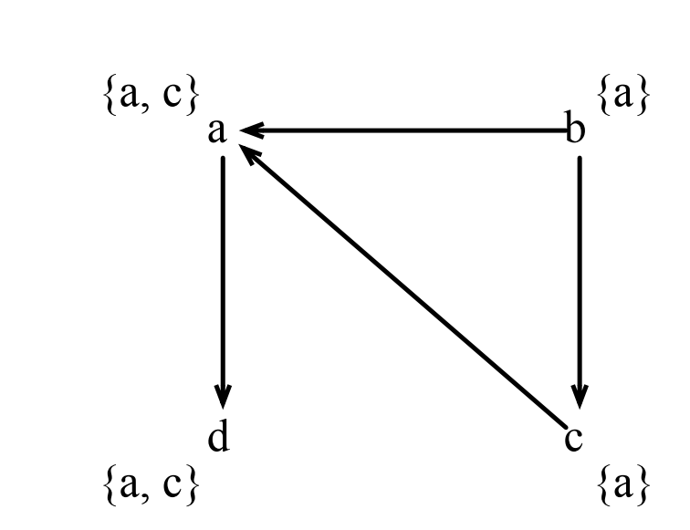
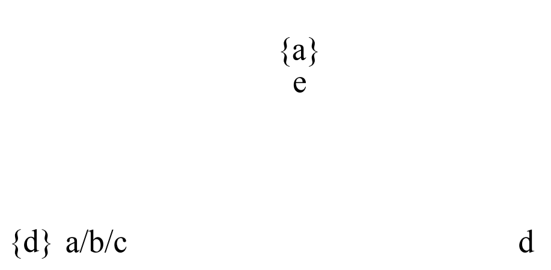
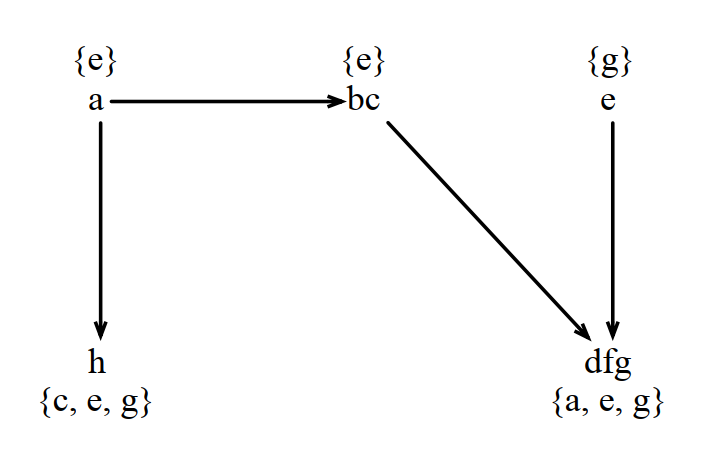
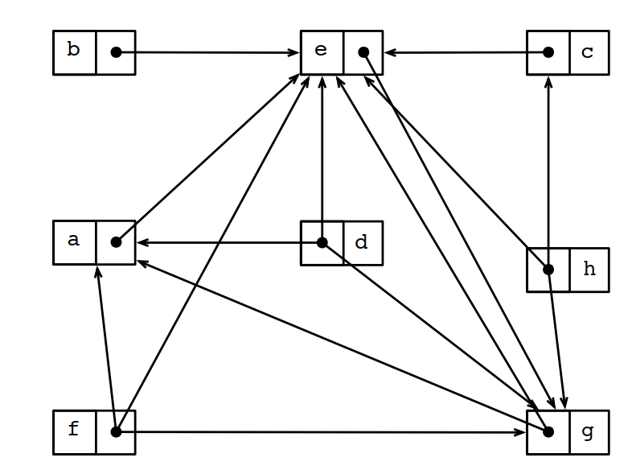
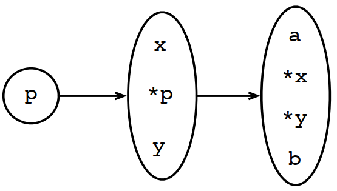
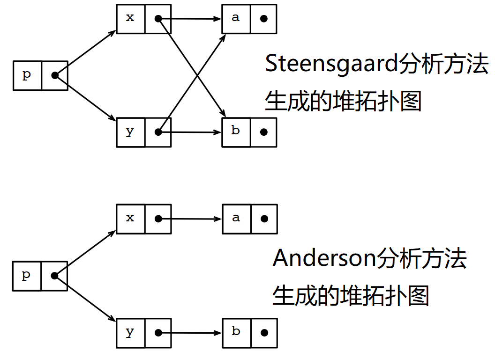

# 第 5 章 指针分析

本章是系列文章的第五章，介绍了指针分析方法。指针分析在C/C++语言中非常重要（除了C/C++，早期的Pascal，中期的Delphi，和现代的go/rust等也都支持指针操作），分析的结果可以有效提升指针的优化效率。

赵高欲为乱，恐群臣不听，乃先设验（设法试探），持鹿献于二世，曰：“马也。”二世笑曰：“丞相误邪？谓鹿为马。”问左右，左右或默，或言马以阿顺赵高。或言鹿者，高因阴中诸言鹿者以法。后群臣皆畏高。

——司马迁《史记·秦始皇本纪》

## 5.1 概念

指针是许多重要编程语言的特性之一。早期的有C,Pascal，各种汇编语言，中期的有Delphi，C++，现代编程语言里面设计目标是替代C/C++语言的go和rust，也支持指针操作。即使是一些语法上不支持指针的编程语言，例如java、C#、vb等，一方面它的底层实现不可避免的使用指针，另外一方面这些编程语言的对象编程了对象的句柄，可以认为是指针的另外一种抽象。

指针的使用，可以避免大量的数据拷贝。函数调用的时候，传递指针或者对象的引用比直接传递一个对象本身的性能会好很多。协议栈上底层协议和上层协议之间的信息传递，如果不使用指针，会将协议处理过程中的净荷拷贝次数翻很多倍，这对网络吞吐量非常大的应用场景是不可接受的。

指针的分析的难度很大，并且一直是理解和修改程序的主要障碍。指针这个概念的产生，如果从汇编语言算起的话，相当于有编程语言就有指针了，但第一篇有实际落地价值的指针分析的论文，1994年才出现。

指针分析（Pointer Analysis），又可以称为别名分析（Alias Analysis），或者指向分析（Points-To Analysis）。

## 5.2 为什么需要指针分析

| 1 | #include <stdio.h> |
| --- | --- |
| 2 | int main() { |
| 3 | int i = 7; |
| 4 | int *p = &i; |
| 5 | *p = 13; |
| 6 | printf("The value of i = %d\n", i); |
| 7 | } |

给定上面的例子。gcc的-O1选项能优化成什么样子？

将上述代码保存到pta5.1.cc，并使用“gcc -O1 pta5.1.cc -S”进行编译，生成的汇编代码如下：

| 1 | .file   "pta5.1.cc" |
| --- | --- |
| 2 | .section    .rodata.str1.1,"aMS",@progbits,1 |
| 3 | .LC0: |
| 4 | .string "The value of i = %d\n" |
| 5 | .text |
| 6 | .globl  main |
| 7 | .type   main, @function |
| 8 | main: |
| 9 | .LFB30: |
| 10 | .cfi_startproc |
| 11 | subq    $8, %rsp |
| 12 | .cfi_def_cfa_offset 16 |
| 13 | movl    $13, %edx |
| 14 | movl    $.LC0, %esi |
| 15 | movl    $1, %edi |
| 16 | movl    $0, %eax |
| 17 | call    __printf_chk |
| 18 | movl    $0, %eax |
| 19 | addq    $8, %rsp |
| 20 | .cfi_def_cfa_offset 8 |
| 21 | ret |
| 22 | .cfi_endproc |
| 23 | .LFE30: |
| 24 | .size   main, .-main |
| 25 | .ident  "GCC: (Ubuntu 5.4.0-6ubuntu1~16.04.12) 5.4.0 20160609" |
| 26 | .section    .note.GNU-stack,"",@progbits |

从汇编代码看，程序直接忽略掉了第3行和第4行的初始化和传地址操作，直接实现了第5行的赋值和第6行的打印。性能是不是强大了很多。

再看个例子：

| 1 | #include <stdio.h> |
| --- | --- |
| 2 | #include <stdlib.h> |
| 3 | void sum0(int *a, int *b, int *r, int N) { |
| 4 | int i; |
| 5 | for (i = 0; i < N; i++) { |
| 6 | r[i] = a[i]; |
| 7 | if (!b[i]) { |
| 8 | r[i] = b[i]; |
| 9 | } |
| 10 | } |
| 11 | } |
| 12 | void sum1(int *a, int *b, int *r, int N) { |
| 13 | int i; |
| 14 | for (i = 0; i < N; i++) { |
| 15 | int tmp = a[i]; |
| 16 | if (!b[i]) { |
| 17 | tmp = b[i]; |
| 18 | } |
| 19 | r[i] = tmp; |
| 20 | } |
| 21 | } |
| 22 | void print(int *a, int N) { |
| 23 | int i; |
| 24 | for (i = 0; i < N; i++) { |
| 25 | if (i % 10 == 0) { |
| 26 | printf("\n"); |
| 27 | } |
| 28 | printf("%8d", a[i]); |
| 29 | } |
| 30 | } |
| 31 | #define SIZE 10000 |
| 32 | #define LOOP 100000 |
| 33 | int main(int argc, char **argv) { |
| 34 | int *a = (int *)malloc(SIZE * 4); |
| 35 | int *b = (int *)malloc(SIZE * 4); |
| 36 | int *c = (int *)malloc(SIZE * 4); |
| 37 | int i; |
| 38 | for (i = 0; i < SIZE; i++) { |
| 39 | a[i] = i; |
| 40 | b[i] = i % 2; |
| 41 | } |
| 42 | if (argc % 2) { |
| 43 | printf("sum0\n"); |
| 44 | for (i = 0; i < LOOP; i++) { |
| 45 | sum0(a, b, c, SIZE); |
| 46 | } |
| 47 | } else { |
| 48 | printf("sum1\n"); |
| 49 | for (i = 0; i < LOOP; i++) { |
| 50 | sum1(a, b, c, SIZE); |
| 51 | } |
| 52 | } |
| 53 | } |

用gcc5编译实测下来的结果是-O0，确实不会优化，-O1仍然有很好的优化（时间是-O0的十分之一），并且sum0和sum1性能上差别不大。

| 1 | ronghua.zhou@794bb5fbd58a:~/DCC888$ gcc pta5.2.c -O0 |
| --- | --- |
| 2 | ronghua.zhou@794bb5fbd58a:~/DCC888$ time ./a.out |
| 3 | sum0 |
| 4 | real    0m5.772s |
| 5 | user    0m5.767s |
| 6 | sys     0m0.004s |
| 7 | ronghua.zhou@794bb5fbd58a:~/DCC888$ time ./a.out a |
| 8 | sum1 |
| 9 | real    0m4.766s |
| 10 | user    0m4.761s |
| 11 | sys     0m0.004s |
| 12 | ronghua.zhou@794bb5fbd58a:~/DCC888$ gcc pta5.2.c -O1 |
| 13 | ronghua.zhou@794bb5fbd58a:~/DCC888$ time ./a.out |
| 14 | sum0 |
| 15 | real    0m0.542s |
| 16 | user    0m0.541s |
| 17 | sys     0m0.000s |
| 18 | ronghua.zhou@794bb5fbd58a:~/DCC888$ time ./a.out a |
| 19 | sum1 |
| 20 | real    0m0.473s |
| 21 | user    0m0.473s |
| 22 | sys     0m0.000s |
| 23 |  |
| 24 |  |
| 25 |  |
| 26 |  |

因 sum0 与 sum1 的计算时间相近，下面主要对比 sum0 在 -O0 与 -O1 下的代码差异。

不优化的结果：

| 1 | sum0: |
| --- | --- |
| 2 | .LFB2: |
| 3 | .cfi_startproc |
| 4 | pushq   %rbp |
| 5 | .cfi_def_cfa_offset 16 |
| 6 | .cfi_offset 6, -16 |
| 7 | movq    %rsp, %rbp |
| 8 | .cfi_def_cfa_register 6 |
| 9 | movq    %rdi, -24(%rbp) |
| 10 | movq    %rsi, -32(%rbp) |
| 11 | movq    %rdx, -40(%rbp) |
| 12 | movl    %ecx, -44(%rbp) |
| 13 | movl    $0, -4(%rbp) |
| 14 | jmp .L2 |
| 15 | .L4: |
| 16 | movl    -4(%rbp), %eax |
| 17 | cltq |
| 18 | leaq    0(,%rax,4), %rdx |
| 19 | movq    -40(%rbp), %rax |
| 20 | addq    %rax, %rdx |
| 21 | movl    -4(%rbp), %eax |
| 22 | cltq |
| 23 | leaq    0(,%rax,4), %rcx |
| 24 | movq    -24(%rbp), %rax |
| 25 | addq    %rcx, %rax |
| 26 | movl    (%rax), %eax |
| 27 | movl    %eax, (%rdx) |
| 28 | movl    -4(%rbp), %eax |
| 29 | cltq |
| 30 | leaq    0(,%rax,4), %rdx |
| 31 | movq    -32(%rbp), %rax |
| 32 | addq    %rdx, %rax |
| 33 | movl    (%rax), %eax |
| 34 | testl   %eax, %eax |
| 35 | jne .L3 |
| 36 | movl    -4(%rbp), %eax |
| 37 | cltq |
| 38 | leaq    0(,%rax,4), %rdx |
| 39 | movq    -40(%rbp), %rax |
| 40 | addq    %rax, %rdx |
| 41 | movl    -4(%rbp), %eax |
| 42 | cltq |
| 43 | leaq    0(,%rax,4), %rcx |
| 44 | movq    -32(%rbp), %rax |
| 45 | addq    %rcx, %rax |
| 46 | movl    (%rax), %eax |
| 47 | movl    %eax, (%rdx) |
| 48 | .L3: |
| 49 | addl    $1, -4(%rbp) |
| 50 | .L2: |
| 51 | movl    -4(%rbp), %eax |
| 52 | cmpl    -44(%rbp), %eax |
| 53 | jl  .L4 |
| 54 | nop |
| 55 | popq    %rbp |
| 56 | .cfi_def_cfa 7, 8 |
| 57 | ret |
| 58 | .cfi_endproc |
| 59 | .LFE2: |
| 60 | .size   sum0, .-sum0 |
| 61 | .globl  sum1 |
| 62 | .type   sum1, @function |

O1优化后的结果：

| 1 | sum0: |
| --- | --- |
| 2 | .LFB38: |
| 3 | .cfi_startproc |
| 4 | testl   %ecx, %ecx |
| 5 | jle .L1 |
| 6 | movl    $0, %eax |
| 7 | .L4: |
| 8 | movl    (%rdi,%rax,4), %r9d |
| 9 | movl    %r9d, (%rdx,%rax,4) |
| 10 | movl    (%rsi,%rax,4), %r8d |
| 11 | testl   %r8d, %r8d |
| 12 | cmovne  %r9d, %r8d |
| 13 | movl    %r8d, (%rdx,%rax,4) |
| 14 | addq    $1, %rax |
| 15 | cmpl    %eax, %ecx |
| 16 | jg  .L4 |
| 17 | .L1: |
| 18 | rep ret |
| 19 | .cfi_endproc |
| 20 | .LFE38: |
| 21 | .size   sum0, .-sum0 |
| 22 | .globl  sum1 |
| 23 | .type   sum1, @function |

这个函数从O0到O1的优化过程中使用了很多优化方法，对于这里说的指针分析，由于指针的求地址和解引用非常耗时，O1使用cmovne将必要和拷贝优化成单个指令，起到了很好的效果。

在大多数情况下，sum0和sum1是等价的，但如果b和r这2个指针指向同一个地址的时候，2个算法就会有一些差别，所以编译器不能直接将sum0优化成sum1。

## 5.3 指针分析

指针分析的目标是找到每个指针指向的地址。

指针分析经常使用基于约束系统的分析方法来描述和解决。

性能最好的指针分析算法的复杂度是O(n3)。

为了提升效率和精准度，指针分析是编译器设计中仅次于寄存器分配方法的第二大课题。

## 5.4 尝试使用数据流分析方法解决指针分析

如下图所示，由于l2和l5会相互影响，但很难通过简单的语法分析就能找到他们之间的联系，所以基本的数据流分析对指针分析会失效。

为了方便讨论，下图中引入了几种表达方法：

{a}表示一个指向集合，该指向集合中只有一个元素a。

P(a)表示a是一个指针，P(a)是a的指向集合。

P(a)⊇ {b} 表示a的指向集合中包含b。

P(a) ⊇ P(b) 表示b的指向集合是a的指向集合的子集。

图5.1 指针分析的过程

## 5.5 ANDERSEN指针分析算法

常见的四种指针构造过程（控制流分析中曾用 ⊆ 表示“右边是左边的约束”，易与指针分析中的约束方向混淆——约束为 ⊇，对应到控制流需转为 ⊆；为避免混淆，下文改用 <- 表示控制流图中边的方向）：

| 指令 | 约束名 | 约束 | 控制流分析结果 |
| --- | --- | --- | --- |
| a = &b | base | P(a)⊇ {b} | lhs <- rhs |
| a = b | simple | P(a)⊇ P(b) | lhs <- rhs |
| a = *b | load | t ∈ P(b)⇒ P(a)⊇ P(t) | {t} <- rhs' ⇒ lhs <- rhs |
| *a = b | store | t ∈ P(a)⇒ P(t)⊇ P(b) | {t} <- rhs' ⇒ lhs <- rhs |

Andersen指针分析法，又称为基于集合包含的约束分析法。

Anderson的指向图算法：

| 1 | let G = (V, E) |
| --- | --- |
| 2 | W = V |
| 3 | while W ≠ [] do |
| 4 | n = hd(W) |
| 5 | for each v ∈ P(n) do |
| 6 | for each load "a = *n" do |
| 7 | if (v, a) ∉ E then |
| 8 | E = E ∪ {(v, a)} |
| 9 | W = v::W |
| 10 | for each store "*n = b" do |
| 11 | if (b, v) ∉ E then |
| 12 | E = E ∪ {(v, a)} |
| 13 | W = b::W |
| 14 | for each (n, z) ∈ E do |
| 15 | P(z) = P(z) ∪ P(n) |
| 16 | if P(z) has changed then |
| 17 | W = z::W |

上面的算法做一些解释：

W = v::W  的含义是将W这个数组的头部增加一个元素v。

n = hd(W) 表示从数组W中取出头结点，赋值给n。

例如，对下面的代码：

| 1 | b = &a |
| --- | --- |
| 2 | a = &c |
| 3 | d = a |
| 4 | *d = b |
| 5 | a = *d |

生成的指向图是这样的：

图5.2 Andersen算法生成的指向图

## 5.6 循环坍塌（COLLAPSING CYCLES）

找到图的传递闭包的算法复杂度达到O(n3)，使得科学家们一直没停止过对它的优化。

循环坍塌是二十一世纪初发现的一种优化方法，循环坍塌的理论基础是强连通图的拓扑一致性，在指向分析图中，表示形成循环的所有节点，都有一致的指向分析集合。

算法能用和算法在实际中能用是两个概念。

### 5.6.1 循环识别

DFS可以发现循环，但发现的复杂度也不低。DFS的目标是遍历所有节点，但如果想要通过DFS发现环的话，就不但要记录节点，还要记录节点的所有边，这样才能区别一个节点的子结点已经遍历过的情况下判断出只是菱形依赖，还是环。

常见的循环识别方法有波传递算法（Wave propagation），深度传递算法（Deep propagation）和惰性循环检测方法（Lazy cycle detection）。

### 5.6.2 惰性循环检测（Lazy Cycle Detection）

参见The ant and the grasshopper: fast and accurate pointer analysis for millions of lines of code, 2007。这篇文章实际提出了两种循环检测方法，一种是惰性循环检测，一种是混合循环检测。

增加惰性循环检测之后的算法相对于没有循环检测的方法，主要增加了第2行和第16~18行。其中第2行是增加了一个集合初始化（用来避免重复进行循环检测）。16~18行主要是发现某条边的2个节点的指向集合相等的情况下触发循环检测，检测成功就直接触发循环坍塌。不论是否检测到循环，都会将疑似循环的边加入到已检测的集合中。

| 1 | let G = (V, E) |
| --- | --- |
| 2 | R = {} |
| 3 | W = V |
| 4 | while W ≠ [] do |
| 5 | n = hd(W) |
| 6 | for each v ∈ P(n) do |
| 7 | for each load "a = *n" do |
| 8 | if (v, a) ∉ E then |
| 9 | E = E ∪ {(v, a)} |
| 10 | W = v::W |
| 11 | for each store "*n = b" do |
| 12 | if (b, v) ∉ E then |
| 13 | E = E ∪ {(v, a)} |
| 14 | W = b::W |
| 15 | for each (n, z) ∈ E do |
| 16 | if P(z) = P(n) and (n, z) ∉ R then |
| 17 | DETECTANDCOLLAPSECYCLES(z) |
| 18 | R = R∪ {(n, z)} |
| 19 | P(z) = P(z) ∪ P(n) |
| 20 | if P(z) has changed then |
| 21 | W = z::W |

优点：仅在非常大可能性能找到环的情况下才触发环形检测；概念简单，容易实现。

缺点：触发检测前环已经存在一段时间，会降低部分性能；即使概率很大的时候，环形检测还是有可能失败（当前还没有失败的证据）。

对下面的伪代码：

| 1 | c = &d |
| --- | --- |
| 2 | e = &a |
| 3 | a = b |
| 4 | b = c |
| 5 | c = *e |

生成的指向图如下（其中a/b/c触发了循环坍塌）：

图5.3 循环坍塌之后的指向图

### 5.6.3 波传递算法（Wave Propagation）

波传递算法的伪代码如下：

| 1 | repeat |
| --- | --- |
| 2 | changed = false |
| 3 | collapse Strongly Connected Components |
| 4 | WAVEPROPAGATION |
| 5 | ADDNEWEDGES |
| 6 | if a new edge has been added to G then |
| 7 | changed = true |
| 8 | until changed = false |
| 9 | WAVEPROPAGATION(G, P, T) |
| 10 | while T ≠ [] |
| 11 | v = hd(T) |
| 12 | Pdif = Pcur(v) – Pold(v) |
| 13 | Pold(v) = Pcur(v) |
| 14 | if Pdif ≠ {} |
| 15 | for each w such that (v, w) ∈ E do |
| 16 | Pcur(w) = Pcur(w) ∪ Pdif |
| 17 | ADDNEWEDGES(G = (E, V), C) |
| 18 | for each operation c such as l = *r ∈ C do |
| 19 | Pnew = Pcur(r) – Pcache(c) |
| 20 | Pcache(c) = Pcache(c) ∪ Pnew |
| 21 | for each v ∈ Pnew do |
| 22 | if (v, l) ∉ E then |
| 23 | E = E ∪ {(v, l)} |
| 24 | Pcur(l) = Pcur(l) ∪ Pold(v) |
| 25 | for each operation c such as *l = r do |
| 26 | Pnew = Pcur(l) – Pcache(c) |
| 27 | Pcache(c) = Pcache(c) ∪ Pnew |
| 28 | for each v ∈ Pnew do |
| 29 | if (r, v) ∉ E then |
| 30 | E = E ∪ {(r, v)} |
| 31 | Pcur(v) = Pcur(v) ∪ Pold(r) |
| 32 |  |
| 33 |  |
| 34 |  |
| 35 |  |

上述算法中的参数的含义如下：

G：指向图

P：指向集合

T：G中所有节点的拓扑顺序

Pcache：上一次计算出来的指向集合，初始化为{}

对下面的伪代码：

| 1 | h = &c |
| --- | --- |
| 2 | e = &g |
| 3 | b = c |
| 4 | h = &g |
| 5 | h = a |
| 6 | c = b |
| 7 | a = &e |
| 8 | f = d |
| 9 | b = a |
| 10 | d = *h |
| 11 | *e = f |
| 12 | f = &a |

生成的指向图如下（其中b/c和d/f/g触发了循环坍塌）：

图5.4 波传递算法分析生成的指向图

对应的堆内存拓扑图如下：

图5.5 波传递算法分析生成的堆内存拓扑图

## 5.7 STEENSGAARD指针分析算法

如果把Anderson指针分析算法中的集合包含换成等号（将包含符号左右两侧的集合先求并集，然后赋值给原来的两个集合），就形成了Steensgaard指针分析算法，也称为基于集合并集的指针分析算法。

对下面的伪代码：

| 1 | x = &a; |
| --- | --- |
| 2 | y = &b; |
| 3 | p = &x; |
| 4 | p = &y; |

生成的指向图如下：

图5.6 STEENSGAARD算法分析生成的指向图

### 5.7.1 Union-Find

基于链式并集计算的复杂度可以达到α(n)，其中α是Ackermann function的简称，该算法实现也称为Union-Find。算法的具体描述参见An Improved Equivalence Algorithms (1964)。

### 5.7.2 Steensgaard指针分析算法没有Anderson指针分析算法精准

例如上面例子生成的两个堆的拓扑图，按Steensgaard的分析结论，x可能指向b，y可能指向a。但Anderson的分析结论，x不可能指向b，y不可能指向a，显然Anderson的分析结论更接近事实。

图5.6 两种算法分析的内存拓扑图

## 5.8 总结

### 5.8.1 一种通用模式（A Common Pattern）

迄今为止，所有分析算法都遵循一种模式：迭代，直到找到一个不动点（也就是说，如果某次迭代后，所有变量都不变，后面再触发迭代，也不会再改变）。

这个通用模式适用于数据流分析、控制流分析和指向分析，能够找到一个不动点，是这些分析能够收敛的理论基础。

### 5.8.2 流相关性（Flow Sensitiveness）

尽管Anderson分析算法比Steensgaard算法精确，但由于它是流无关算法，所以仍然存在一些结论是实际运行中不可能出现，或者不可能同时出现的，这就是流无关分析算法（Flow Insensitive）的局限性。

但是如果按照流相关分析算法（Flow Sensitive）进行分析，每个程序点都需要保留一份独立的分析结论，这对大规模程序的分析是非常昂贵的（常常会带来OOM:)）。

## 5.9 指针分析简史

Andersen, L. "Program Analysis and Specialization for the C Programming Language", PhD Thesis, University of Copenhagen, (1994)，这篇文章中Andersen第一次详细讲解了自己发明的指针分析算法。

Hardekopf, B. and Lin, C. "The Ant and the Grasshopper: fast and accurate pointer analysis for millions of lines of code", PLDI, pp 290-299 (2007)，文章介绍了惰性循环检测和混合循环检测的方法，并针对当时主流的一些开源软件进行分析，展现了相对传统分析方法更高的效率和准确性。

Pereira, F. and Berlin, D. "Wave Propagation and Deep Propagation for Pointer Analysis", CGO, pp 126-135 (2009)，DCC888课程老师费尔南多教授和另外以为教授合作发表的论文，讲述了波传递算法和深度传递算法在指针分析过程中的应用。

Steensgaard, B., "Points-to Analysis in Almost Linear Time", POPL, pp 32-41 (1995)，Steensgaard的指针分析算法。

## 5.10 LLVM的AliasAnalysis

### 5.10.1 LLVM的别名分析基础AliasAnalysis

#### 5.10.1.1 头文件和全局定义

llvm\lib\Analysis\AliasAnalysis.cpp

| 26 | #include "llvm/Analysis/AliasAnalysis.h" |
| --- | --- |
| 27 | #include "llvm/Analysis/BasicAliasAnalysis.h" |
| 28 | #include "llvm/Analysis/CFLAndersAliasAnalysis.h" |
| 29 | #include "llvm/Analysis/CFLSteensAliasAnalysis.h" |
| 30 | #include "llvm/Analysis/CaptureTracking.h" |
| 31 | #include "llvm/Analysis/GlobalsModRef.h" |
| 32 | #include "llvm/Analysis/MemoryLocation.h" |
| 33 | #include "llvm/Analysis/ObjCARCAliasAnalysis.h" |
| 34 | #include "llvm/Analysis/ScalarEvolutionAliasAnalysis.h" |
| 35 | #include "llvm/Analysis/ScopedNoAliasAA.h" |
| 36 | #include "llvm/Analysis/TargetLibraryInfo.h" |
| 37 | #include "llvm/Analysis/TypeBasedAliasAnalysis.h" |
| 38 | #include "llvm/Analysis/ValueTracking.h" |
| 39 | #include "llvm/IR/Argument.h" |
| 40 | #include "llvm/IR/Attributes.h" |
| 41 | #include "llvm/IR/BasicBlock.h" |
| 42 | #include "llvm/IR/Instruction.h" |
| 43 | #include "llvm/IR/Instructions.h" |
| 44 | #include "llvm/IR/Module.h" |
| 45 | #include "llvm/IR/Type.h" |
| 46 | #include "llvm/IR/Value.h" |
| 47 | #include "llvm/InitializePasses.h" |
| 48 | #include "llvm/Pass.h" |
| 49 | #include "llvm/Support/AtomicOrdering.h" |
| 50 | #include "llvm/Support/Casting.h" |
| 51 | #include "llvm/Support/CommandLine.h" |
| 52 | #include <algorithm> |
| 53 | #include <cassert> |
| 54 | #include <functional> |
| 55 | #include <iterator> |
| 56 |  |
| 57 | using namespace llvm; |
|   | /// 别名分析的结果很多依赖基本的别名分析， |
|   | /// 所以禁止基本别名分析的这个开关默认关闭。 |
| 58 |  |
| 59 | /// Allow disabling BasicAA from the AA results. This is particularly useful |
| 60 | /// when testing to isolate a single AA implementation. |
| 61 | static cl::opt<bool> DisableBasicAA("disable-basic-aa", cl::Hidden, |
| 62 | cl::init(false)); |
| 63 |  |

5.10.1.2构造函数和析构函数

llvm\lib\Analysis\AliasAnalysis.cpp

|   | /// C++里面&&支持右值引用， |
| --- | --- |
|   | /// 即使入参是一个没有固定存储位置的临时对象或者随机数都可以用来作为引用。 |
|   | /// 这里定义的拷贝构造函数基本上是把所有属性都调用一次拷贝构造函数。 |
| 64 | AAResults::AAResults(AAResults &&Arg) |
| 65 | : TLI(Arg.TLI), AAs(std::move(Arg.AAs)), AADeps(std::move(Arg.AADeps)) { |
|   | // AAs是AA的复数形式，表示多个AA，实际上AAs是Concept的矩阵。 |
|   | // 而Concept是单个别名分析的抽象。 |
| 66 | for (auto &AA : AAs) |
|   | // 将每个AA和this建立联系。 |
| 67 | AA->setAAResults(this); |
| 68 | } |
|   | /// 析构函数。理论上析构函数要等于构造函数的负函数， |
|   | /// 构造函数里面设置了AAs中每个AA和this指针的联系， |
|   | /// 所以析构函数理论上需要解除这种联系。 |
|   | /// 但实际上没联系也关系不大，因为AAs对象本身也销毁了， |
|   | /// AAs的成员变量里面的悬挂指针理论上应该没机会访问了才对。 |
| 69 |  |
| 70 | AAResults::~AAResults() { |
| 71 | // FIXME; It would be nice to at least clear out the pointers back to this |
| 72 | // aggregation here, but we end up with non-nesting lifetimes in the legacy |
| 73 | // pass manager that prevent this from working. In the legacy pass manager |
| 74 | // we'll end up with dangling references here in some cases. |
| 75 | #if 0 |
| 76 | for (auto &AA : AAs) |
| 77 | AA->setAAResults(nullptr); |
| 78 | #endif |
| 79 | } |

#### 5.10.1.3 失效检查

|   | /// invalidate处理失效事件，主要检查当前的AA分析结果是否还有效。 |
| --- | --- |
|   | /// 如果底层存在对象失效，则整体返回失效。 |
| 81 | bool AAResults::invalidate(Function &F, const PreservedAnalyses &PA, |
| 82 | FunctionAnalysisManager::Invalidator &Inv) { |
|   | // preservedWhenStateless在当前分析结果还有效的时候返回true， |
|   | // 如果无效则返回false，此时AA分析结果也失效。 |
| 83 | // AAResults preserves the AAManager by default, due to the stateless nature |
| 84 | // of AliasAnalysis. There is no need to check whether it has been preserved |
| 85 | // explicitly. Check if any module dependency was invalidated and caused the |
| 86 | // AAManager to be invalidated. Invalidate ourselves in that case. |
| 87 | auto PAC = PA.getChecker<AAManager>(); |
| 88 | if (!PAC.preservedWhenStateless()) |
| 89 | return true; |
|   | // 如果函数的所有依赖都有效，则继续，否则返回失效。 |
| 90 |  |
| 91 | // Check if any of the function dependencies were invalidated, and invalidate |
| 92 | // ourselves in that case. |
| 93 | for (AnalysisKey *ID : AADeps) |
| 94 | if (Inv.invalidate(ID, F, PA)) |
| 95 | return true; |
|   | // 所有检查都过了，说明当前分析还有效。 |
| 96 |  |
| 97 | // Everything we depend on is still fine, so are we. Nothing to invalidate. |
| 98 | return false; |
| 99 | } |

#### 5.10.1.4 alias接口

接口函数alias调用一些具体算法的别名分析方法，返回对应的结果。例如CFLAndersAliasAnalysis是用CFL（context free languages，也就是上下文无关语法）描述的Anderson分析算法的别名分析，CFLSteensAliasAnalysis是用CFL描述的Steensgaard分析算法的别名分析。如果对应的分析结果中存在非模棱两可的结果，则返回其分析结果，否则返回模棱两可的分析结果MayAlias。编译器的分析都是基于保守的原则处理，所以即使有1%的可能性有别名关系，就会把它们当做有别名关系处理。

| 101 | //===----------------------------------------------------------------------===// |
| --- | --- |
| 102 | // Default chaining methods |
| 103 | //===----------------------------------------------------------------------===// |
|   | // 对外接口，入参是两行代码，返回是否有别名关系。 |
| 104 |  |
| 105 | AliasResult AAResults::alias(const MemoryLocation &LocA, |
| 106 | const MemoryLocation &LocB) { |
|   | // 内部实现还会保留一个查询上下文信息AAQIP，方便知道之前的查询结果。 |
| 107 | AAQueryInfo AAQIP; |
| 108 | return alias(LocA, LocB, AAQIP); |
| 109 | } |
|   | // 查询上下文信息AAQIP，在多次调用过程中会传递。 |
| 110 |  |
| 111 | AliasResult AAResults::alias(const MemoryLocation &LocA, |
| 112 | const MemoryLocation &LocB, AAQueryInfo &AAQI) { |
| 113 | for (const auto &AA : AAs) { |
| 114 | auto Result = AA->alias(LocA, LocB, AAQI); |
|   | // MayAlias的信息约等于零，表示可能有别名关系，也可能没有，其他结果有： |
|   | // NoAlias表示完全没有别名关系, |
|   | // PartialAlias偏序别名（A对B有别名关系，但B对A没有）， |
|   | // MustAlias确定别名（A对B有别名关系，但B对A也有别名关系）。 |
|   | // 如果存在一个分析结果中得到确定的别名关系结果，则返回对应的结果。 |
| 115 | if (Result != MayAlias) |
| 116 | return Result; |
| 117 | } |
|   | // 否则只能继续保持暧昧关系。 |
| 118 | return MayAlias; |
| 119 | } |

#### 5.10.1.5 pointsToConstantMemory接口

接口函数pointsToConstantMemory调用某个具体算法的pointsToConstantMemory分析结果，逻辑和alias类似。

| 121 | bool AAResults::pointsToConstantMemory(const MemoryLocation &Loc, |
| --- | --- |
| 122 | bool OrLocal) { |
| 123 | AAQueryInfo AAQIP; |
| 124 | return pointsToConstantMemory(Loc, AAQIP, OrLocal); |
| 125 | } |
| 126 |  |
| 127 | bool AAResults::pointsToConstantMemory(const MemoryLocation &Loc, |
| 128 | AAQueryInfo &AAQI, bool OrLocal) { |
| 129 | for (const auto &AA : AAs) |
|   | // 如果任意一种分析算法认为当前代码行是指向常量内存的指针，则返回真。 |
| 130 | if (AA->pointsToConstantMemory(Loc, AAQI, OrLocal)) |
| 131 | return true; |
|   | // 否则返回假。 |
| 132 |  |
| 133 | return false; |
| 134 | } |

#### 5.10.1.6 getArgModRefInfo接口

函数getArgModRefInfo获取某个函数的某个参数是否会修改或者访问内存的结果，执行过程还是通过调用底层算法的对应接口，并整合出最终结果。

| 136 | ModRefInfo AAResults::getArgModRefInfo(const CallBase *Call, unsigned ArgIdx) { |
| --- | --- |
|   | // 初始化成可能会对内存进行修改或者访问。 |
| 137 | ModRefInfo Result = ModRefInfo::ModRef; |
| 138 |  |
| 139 | for (const auto &AA : AAs) { |
|   | // 对每种算法的结果求交集。 |
| 140 | Result = intersectModRef(Result, AA->getArgModRefInfo(Call, ArgIdx)); |
|   | // 如果某个算法已经能够确定对应参数确实不会访问和修改内存，则直接返回结果。 |
| 141 |  |
| 142 | // Early-exit the moment we reach the bottom of the lattice. |
| 143 | if (isNoModRef(Result)) |
| 144 | return ModRefInfo::NoModRef; |
| 145 | } |
| 146 |  |
| 147 | return Result; |
| 148 | } |

#### 5.10.1.6 getModRefInfo接口

函数getModRefInfo根据入参不一样，有很多版本，主要功能都是查询进行内存修改或者访问可能性信息，有的是查询函数调用和内存地址的匹配关系，有的是查询多个函数调用之间的是否存在访问或者修改同一片内存的可能性。

llvm\lib\Analysis\AliasAnalysis.cpp

|   | // 这个版本的getModRefInfo获取某条指令和某个函数调用是否会访问和修改同一块内存。 |
| --- | --- |
| 150 | ModRefInfo AAResults::getModRefInfo(Instruction *I, const CallBase *Call2) { |
| 151 | AAQueryInfo AAQIP; |
| 152 | return getModRefInfo(I, Call2, AAQIP); |
| 153 | } |
|   | // 这个版本的getModRefInfo是指令+函数调用的带查询上下文的内部实现版本。 |
| 154 |  |
| 155 | ModRefInfo AAResults::getModRefInfo(Instruction *I, const CallBase *Call2, |
| 156 | AAQueryInfo &AAQI) { |
|   | // 如果该指令也是函数调用的话，调用两个函数调用的版本。 |
| 157 | // We may have two calls. |
| 158 | if (const auto *Call1 = dyn_cast<CallBase>(I)) { |
| 159 | // Check if the two calls modify the same memory. |
| 160 | return getModRefInfo(Call1, Call2, AAQI); |
|   | // 如果该指令是栅栏指令，直接返回可能有修改和访问的结果。 |
|   | // 这是因为别名分析的结果都是为了做优化， |
|   | // 但用户使用栅栏指令的目的是禁止优化，所以后面的分析就没有意义了。 |
| 161 | } else if (I->isFenceLike()) { |
| 162 | // If this is a fence, just return ModRef. |
| 163 | return ModRefInfo::ModRef; |
| 164 | } else { |
|   | // 否则，检查调用是否修改或引用此内存访问定义的位置。 |
|   | // 如果调用引用（读或者写）了这条指令定义的内容， |
|   | // 那么就将它标记为必然引用了该位置。 |
| 165 | // Otherwise, check if the call modifies or references the |
| 166 | // location this memory access defines.  The best we can say |
| 167 | // is that if the call references what this instruction |
| 168 | // defines, it must be clobbered by this location. |
| 169 | const MemoryLocation DefLoc = MemoryLocation::get(I); |
| 170 | ModRefInfo MR = getModRefInfo(Call2, DefLoc, AAQI); |
|   | // 注意条件判断的时候，只要读或者写操作有一个bit位设置了就返回真。 |
| 171 | if (isModOrRefSet(MR)) |
|   | // 但set的时候是直接把读和写这2个bit都加上。 |
| 172 | return setModAndRef(MR); |
| 173 | } |
|   | // 否则将结果设置成没有引用关系。 |
| 174 | return ModRefInfo::NoModRef; |
| 175 | } |
|   | // 查询某条指令对某个内存地址是否有访问或修改关系。 |
| 176 |  |
| 177 | ModRefInfo AAResults::getModRefInfo(const CallBase *Call, |
| 178 | const MemoryLocation &Loc) { |
| 179 | AAQueryInfo AAQIP; |
| 180 | return getModRefInfo(Call, Loc, AAQIP); |
| 181 | } |
|   | // 查询某条指令对某个内存地址是否有访问或修改关系的内部版本。 |
| 182 |  |
| 183 | ModRefInfo AAResults::getModRefInfo(const CallBase *Call, |
| 184 | const MemoryLocation &Loc, |
| 185 | AAQueryInfo &AAQI) { |
|   | // 初始化成有读写关系。 |
| 186 | ModRefInfo Result = ModRefInfo::ModRef; |
|   | // 遍历所有分析结果。 |
| 187 |  |
| 188 | for (const auto &AA : AAs) { |
|   | // 取交集。 |
| 189 | Result = intersectModRef(Result, AA->getModRefInfo(Call, Loc, AAQI)); |
|   | // 如果有一个分析结果明确告知不存在读写引用关系。 |
| 190 |  |
| 191 | // Early-exit the moment we reach the bottom of the lattice. |
| 192 | if (isNoModRef(Result)) |
|   | // 则利用该结果返回。 |
| 193 | return ModRefInfo::NoModRef; |
| 194 | } |
|   | // 用其他方法将计算结果更精确。 |
| 195 |  |
| 196 | // Try to refine the mod-ref info further using other API entry points to the |
| 197 | // aggregate set of AA results. |
|   | // 获取该函数调用的内存访问行为。 |
| 198 | auto MRB = getModRefBehavior(Call); |
|   | // 如果该行为本身只会访问不可达内存，那么这个行为肯定不会修改和访问其他内存。 |
| 199 | if (onlyAccessesInaccessibleMem(MRB)) |
| 200 | return ModRefInfo::NoModRef; |
|   | // 如果该行为对内存只有读操作，则清除结果中的写bit位。 |
| 201 |  |
| 202 | if (onlyReadsMemory(MRB)) |
| 203 | Result = clearMod(Result); |
|   | // 如果该行为不会对内存进行读操作，则清除结果中的读bit位。 |
| 204 | else if (doesNotReadMemory(MRB)) |
| 205 | Result = clearRef(Result); |
|   | // 如果该行为仅访问入参的指针指向的内存， |
|   | // 或者仅访问不可达内存或者入参的内存。 |
| 206 |  |
| 207 | if (onlyAccessesArgPointees(MRB) || onlyAccessesInaccessibleOrArgMem(MRB)) { |
|   | // 先初始化别名关系为有别名关系。 |
| 208 | bool IsMustAlias = true; |
|   | // 但访问属性初始化为没有读写访问。 |
| 209 | ModRefInfo AllArgsMask = ModRefInfo::NoModRef; |
|   | // 如果访问了参数的指针。 |
| 210 | if (doesAccessArgPointees(MRB)) { |
|   | // 遍历所有参数，AI是参数迭代器的简称。 |
| 211 | for (auto AI = Call->arg_begin(), AE = Call->arg_end(); AI != AE; ++AI) { |
| 212 | const Value *Arg = *AI; |
|   | // 如果参数不是指针类型的参数，就没必要分析了。 |
| 213 | if (!Arg->getType()->isPointerTy()) |
| 214 | continue; |
|   | // 查询当前是第几个参数。 |
| 215 | unsigned ArgIdx = std::distance(Call->arg_begin(), AI); |
|   | // 获取参数访问的内存位置。 |
| 216 | MemoryLocation ArgLoc = |
| 217 | MemoryLocation::getForArgument(Call, ArgIdx, TLI); |
|   | // 查询函数对应参数的内存和待查询的内存地址之间是否有别名关系。 |
| 218 | AliasResult ArgAlias = alias(ArgLoc, Loc); |
|   | // 如果有别名关系。 |
| 219 | if (ArgAlias != NoAlias) { |
|   | // 再检查是否有读写关系。 |
| 220 | ModRefInfo ArgMask = getArgModRefInfo(Call, ArgIdx); |
|   | // 所有参数的读写关系取并集。 |
| 221 | AllArgsMask = unionModRef(AllArgsMask, ArgMask); |
| 222 | } |
|   | // 如果存在参数没有确定的别名关系，需要清除确定别名关系的开关。 |
|   | // 按这个逻辑，只要有一个指针参数和待分析的内存没有确定的别名关系， |
|   | // 就要删除确定别名关系的开关，这个逻辑有点问题。 |
| 223 | // Conservatively clear IsMustAlias unless only MustAlias is found. |
| 224 | IsMustAlias &= (ArgAlias == MustAlias); |
| 225 | } |
| 226 | } |
|   | // 如果所有参数都没有读写引用关系，返回没有读写引用关系。 |
| 227 | // Return NoModRef if no alias found with any argument. |
| 228 | if (isNoModRef(AllArgsMask)) |
| 229 | return ModRefInfo::NoModRef; |
|   | // 在多个分析中取交集，必须所有分析的结论都是有别名关系，才能确定有别名关系。 |
| 230 | // Logical & between other AA analyses and argument analysis. |
| 231 | Result = intersectModRef(Result, AllArgsMask); |
| 232 | // If only MustAlias found above, set Must bit. |
| 233 | Result = IsMustAlias ? setMust(Result) : clearMust(Result); |
| 234 | } |
|   | // 如果待分析的内存空间是只读内存空间，那对应函数的调用不可能有写操作。 |
| 235 |  |
| 236 | // If Loc is a constant memory location, the call definitely could not |
| 237 | // modify the memory location. |
| 238 | if (isModSet(Result) && pointsToConstantMemory(Loc, /*OrLocal*/ false)) |
| 239 | Result = clearMod(Result); |
| 240 |  |
| 241 | return Result; |
| 242 | } |
|   | // 这个版本获取两个函数调用之间的内存引用关系。 |
| 243 |  |
| 244 | ModRefInfo AAResults::getModRefInfo(const CallBase *Call1, |
| 245 | const CallBase *Call2) { |
| 246 | AAQueryInfo AAQIP; |
| 247 | return getModRefInfo(Call1, Call2, AAQIP); |
| 248 | } |
|   | // 获取两个函数调用之间的内存引用关系的内部版本。 |
| 249 |  |
| 250 | ModRefInfo AAResults::getModRefInfo(const CallBase *Call1, |
| 251 | const CallBase *Call2, AAQueryInfo &AAQI) { |
| 252 | ModRefInfo Result = ModRefInfo::ModRef; |
|   | // 取交集，早终结的思路和之前的几个函数一样。 |
| 253 |  |
| 254 | for (const auto &AA : AAs) { |
| 255 | Result = intersectModRef(Result, AA->getModRefInfo(Call1, Call2, AAQI)); |
| 256 |  |
| 257 | // Early-exit the moment we reach the bottom of the lattice. |
| 258 | if (isNoModRef(Result)) |
| 259 | return ModRefInfo::NoModRef; |
| 260 | } |
|   | // 强化分析结果的思路这里主要利用函数调用的行为分析的结果。 |
| 261 |  |
| 262 | // Try to refine the mod-ref info further using other API entry points to the |
| 263 | // aggregate set of AA results. |
| 264 |  |
| 265 | // If Call1 or Call2 are readnone, they don't interact. |
| 266 | auto Call1B = getModRefBehavior(Call1); |
|   | // FMRB是FunctionModRefBehavior，也就是函数修改引用行为的简称。 |
|   | // 如果函数1本身不会访问内存，那这2个函数的内存引用肯定没有交集。 |
| 267 | if (Call1B == FMRB_DoesNotAccessMemory) |
| 268 | return ModRefInfo::NoModRef; |
|   | // 如果函数2本身不会访问内存，那这2个函数的内存引用肯定没有交集。 |
| 269 |  |
| 270 | auto Call2B = getModRefBehavior(Call2); |
| 271 | if (Call2B == FMRB_DoesNotAccessMemory) |
| 272 | return ModRefInfo::NoModRef; |
|   | // 如果两个函数都是对内存只读访问，那这两个函数相互之间也没有依赖。 |
| 273 |  |
| 274 | // If they both only read from memory, there is no dependence. |
| 275 | if (onlyReadsMemory(Call1B) && onlyReadsMemory(Call2B)) |
| 276 | return ModRefInfo::NoModRef; |
|   | // 如果函数1只有只读访问内存，则两个函数没有修改依赖。 |
|   | // 这时除非函数2修改的内存在函数1中有读操作，才会形成依赖。 |
| 277 |  |
| 278 | // If Call1 only reads memory, the only dependence on Call2 can be |
| 279 | // from Call1 reading memory written by Call2. |
| 280 | if (onlyReadsMemory(Call1B)) |
| 281 | Result = clearMod(Result); |
|   | // 如果函数1不会读内存，则两个函数除非同时写某个内存地址，才会形成依赖。 |
| 282 | else if (doesNotReadMemory(Call1B)) |
| 283 | Result = clearRef(Result); |
|   | // 上面的只读内存访问和读内存访问的分析仅针对函数1做了处理， |
|   | // 理论上函数2也可以做类似处理。 |
|   | // 参数的内存访问分析是针对两个函数都做了处理。 |
|   | // 函数只有通过参数访问内存的典型例子是函数内部没有使用任何全局变量， |
|   | // 从这里可以看出如果函数不直接使用全局变量来传递信息，编译优化会简单很多。 |
| 284 |  |
| 285 | // If Call2 only access memory through arguments, accumulate the mod/ref |
| 286 | // information from Call1's references to the memory referenced by |
| 287 | // Call2's arguments. |
|   | // 从自然语言的语义上看，只通过参数访问内存和参数不访问内存两个判断放到一起似乎是废话， |
|   | // 但程序实现过程中每个函数的功能尽可能小，可以减少复杂度，也会少引入问题。 |
| 288 | if (onlyAccessesArgPointees(Call2B)) { |
|   | // 如果函数2不访问内存，两个函数自然没有内存依赖。 |
| 289 | if (!doesAccessArgPointees(Call2B)) |
| 290 | return ModRefInfo::NoModRef; |
|   | // 初始化成没有依赖关系，后面做并集的时候不会引入额外的依赖关系。 |
| 291 | ModRefInfo R = ModRefInfo::NoModRef; |
|   | // 初始化成有别名关系，如果任何一次分析下来有确定性的不依赖结果， |
|   | // 可以直接得到最终结果。 |
| 292 | bool IsMustAlias = true; |
|   | // 遍历函数2的所有参数。 |
| 293 | for (auto I = Call2->arg_begin(), E = Call2->arg_end(); I != E; ++I) { |
| 294 | const Value *Arg = *I; |
|   | // 如果直接走的传值调用，肯定不会产生内存访问依赖。 |
|   | // 走引用或者指针传递参数虽然可以节省内存拷贝，但会增加指针分析的复杂度。 |
| 295 | if (!Arg->getType()->isPointerTy()) |
| 296 | continue; |
| 297 | unsigned Call2ArgIdx = std::distance(Call2->arg_begin(), I); |
|   | // 或者参数使用内存的定义位置信息。 |
| 298 | auto Call2ArgLoc = |
| 299 | MemoryLocation::getForArgument(Call2, Call2ArgIdx, TLI); |
| 300 |  |
| 301 | // ArgModRefC2 indicates what Call2 might do to Call2ArgLoc, and the |
| 302 | // dependence of Call1 on that location is the inverse: |
| 303 | // - If Call2 modifies location, dependence exists if Call1 reads or |
| 304 | //   writes. |
| 305 | // - If Call2 only reads location, dependence exists if Call1 writes. |
| 306 | ModRefInfo ArgModRefC2 = getArgModRefInfo(Call2, Call2ArgIdx); |
| 307 | ModRefInfo ArgMask = ModRefInfo::NoModRef; |
| 308 | if (isModSet(ArgModRefC2)) |
| 309 | ArgMask = ModRefInfo::ModRef; |
| 310 | else if (isRefSet(ArgModRefC2)) |
| 311 | ArgMask = ModRefInfo::Mod; |
| 312 |  |
| 313 | // ModRefC1 indicates what Call1 might do to Call2ArgLoc, and we use |
| 314 | // above ArgMask to update dependence info. |
| 315 | ModRefInfo ModRefC1 = getModRefInfo(Call1, Call2ArgLoc); |
| 316 | ArgMask = intersectModRef(ArgMask, ModRefC1); |
| 317 |  |
| 318 | // Conservatively clear IsMustAlias unless only MustAlias is found. |
| 319 | IsMustAlias &= isMustSet(ModRefC1); |
| 320 |  |
| 321 | R = intersectModRef(unionModRef(R, ArgMask), Result); |
| 322 | if (R == Result) { |
| 323 | // On early exit, not all args were checked, cannot set Must. |
| 324 | if (I + 1 != E) |
| 325 | IsMustAlias = false; |
| 326 | break; |
| 327 | } |
| 328 | } |
| 329 |  |
| 330 | if (isNoModRef(R)) |
| 331 | return ModRefInfo::NoModRef; |
| 332 |  |
| 333 | // If MustAlias found above, set Must bit. |
| 334 | return IsMustAlias ? setMust(R) : clearMust(R); |
| 335 | } |
| 336 |  |
| 337 | // If Call1 only accesses memory through arguments, check if Call2 references |
| 338 | // any of the memory referenced by Call1's arguments. If not, return NoModRef. |
| 339 | if (onlyAccessesArgPointees(Call1B)) { |
| 340 | if (!doesAccessArgPointees(Call1B)) |
| 341 | return ModRefInfo::NoModRef; |
| 342 | ModRefInfo R = ModRefInfo::NoModRef; |
| 343 | bool IsMustAlias = true; |
| 344 | for (auto I = Call1->arg_begin(), E = Call1->arg_end(); I != E; ++I) { |
| 345 | const Value *Arg = *I; |
| 346 | if (!Arg->getType()->isPointerTy()) |
| 347 | continue; |
| 348 | unsigned Call1ArgIdx = std::distance(Call1->arg_begin(), I); |
| 349 | auto Call1ArgLoc = |
| 350 | MemoryLocation::getForArgument(Call1, Call1ArgIdx, TLI); |
| 351 |  |
| 352 | // ArgModRefC1 indicates what Call1 might do to Call1ArgLoc; if Call1 |
| 353 | // might Mod Call1ArgLoc, then we care about either a Mod or a Ref by |
| 354 | // Call2. If Call1 might Ref, then we care only about a Mod by Call2. |
| 355 | ModRefInfo ArgModRefC1 = getArgModRefInfo(Call1, Call1ArgIdx); |
| 356 | ModRefInfo ModRefC2 = getModRefInfo(Call2, Call1ArgLoc); |
| 357 | if ((isModSet(ArgModRefC1) && isModOrRefSet(ModRefC2)) || |
| 358 | (isRefSet(ArgModRefC1) && isModSet(ModRefC2))) |
| 359 | R = intersectModRef(unionModRef(R, ArgModRefC1), Result); |
| 360 |  |
| 361 | // Conservatively clear IsMustAlias unless only MustAlias is found. |
| 362 | IsMustAlias &= isMustSet(ModRefC2); |
| 363 |  |
| 364 | if (R == Result) { |
| 365 | // On early exit, not all args were checked, cannot set Must. |
| 366 | if (I + 1 != E) |
| 367 | IsMustAlias = false; |
| 368 | break; |
| 369 | } |
| 370 | } |
| 371 |  |
| 372 | if (isNoModRef(R)) |
| 373 | return ModRefInfo::NoModRef; |
| 374 |  |
| 375 | // If MustAlias found above, set Must bit. |
| 376 | return IsMustAlias ? setMust(R) : clearMust(R); |
| 377 | } |
| 378 |  |
| 379 | return Result; |
| 380 | } |

#### 5.10.1.7 getModRefBehavior接口

函数getModRefBehavior有两个版本分别获得函数调用和函数本身的内存修改引用行为。

llvm\lib\Analysis\AliasAnalysis.cpp

|   | // 获取对应函数调用的修改引用行为分析结果。 |
| --- | --- |
| 382 | FunctionModRefBehavior AAResults::getModRefBehavior(const CallBase *Call) { |
|   | // 初始化为未知结果FMRL_Anywhere+ModRefInfo::ModRef |
| 383 | FunctionModRefBehavior Result = FMRB_UnknownModRefBehavior; |
|   | // 遍历别名分析结果。 |
| 384 |  |
| 385 | for (const auto &AA : AAs) { |
|   | // 对所有该函数调用的别名分析结果求交集。 |
| 386 | Result = FunctionModRefBehavior(Result & AA->getModRefBehavior(Call)); |
|   | // 如果该函数调用不会访问内存，则直接返回。 |
| 387 |  |
| 388 | // Early-exit the moment we reach the bottom of the lattice. |
| 389 | if (Result == FMRB_DoesNotAccessMemory) |
| 390 | return Result; |
| 391 | } |
|   | // 返回汇总之后的结果。 |
| 392 |  |
| 393 | return Result; |
| 394 | } |
|   | // 获取对应函数的修改引用行为分析结果。 |
|   | // 此函数的逻辑和函数调用分析结果的计算流程类似。 |
| 395 |  |
| 396 | FunctionModRefBehavior AAResults::getModRefBehavior(const Function *F) { |
| 397 | FunctionModRefBehavior Result = FMRB_UnknownModRefBehavior; |
| 398 |  |
| 399 | for (const auto &AA : AAs) { |
| 400 | Result = FunctionModRefBehavior(Result & AA->getModRefBehavior(F)); |
| 401 |  |
| 402 | // Early-exit the moment we reach the bottom of the lattice. |
| 403 | if (Result == FMRB_DoesNotAccessMemory) |
| 404 | return Result; |
| 405 | } |
| 406 |  |
| 407 | return Result; |
| 408 | } |

#### 5.10.1.8 流式打印接口

流式打印接口将别名分析结果转换成原始输出流。

llvm\lib\Analysis\AliasAnalysis.cpp

|   | // 原始输出流的实现比较简单，也没有花哨的处理过程， |
| --- | --- |
|   | // 只是建立枚举值和字符串的匹配关系。 |
| 410 | raw_ostream &llvm::operator<<(raw_ostream &OS, AliasResult AR) { |
| 411 | switch (AR) { |
| 412 | case NoAlias: |
| 413 | OS << "NoAlias"; |
| 414 | break; |
| 415 | case MustAlias: |
| 416 | OS << "MustAlias"; |
| 417 | break; |
| 418 | case MayAlias: |
| 419 | OS << "MayAlias"; |
| 420 | break; |
| 421 | case PartialAlias: |
| 422 | OS << "PartialAlias"; |
| 423 | break; |
| 424 | } |
| 425 | return OS; |
| 426 | } |

#### 5.10.1.9 更多版本的getModRefInfo接口实现

下面这个分段，LLVM原来代码里面的注释说是“帮助函数实现”，即把别名分析中常用的子过程封装成函数，便于组织代码；别名分析的主要逻辑实则在以下帮助函数中，前文代码更多是接口封装。

llvm\lib\Analysis\AliasAnalysis.cpp

| 428 | //===----------------------------------------------------------------------===// |
| --- | --- |
| 429 | // Helper method implementation |
| 430 | //===----------------------------------------------------------------------===// |
|   | // 获得某条加载指令对某个内存位置的修改引用信息。 |
| 431 |  |
| 432 | ModRefInfo AAResults::getModRefInfo(const LoadInst *L, |
| 433 | const MemoryLocation &Loc) { |
|   | // 查询指令的修改引用信息的过程，除了生成最终结果，还会有一些临时数据， |
|   | // 这些都保存在AAQIP这个局部变量中，并作为引用传递到后续的分析过程中。 |
|   | // 后面这个局部变量的简写都是AAQI，AAQI也正好是AAQueryInfo的首字母缩写。 |
|   | // 所以这里的AAQIP的P是什么意思？ |
| 434 | AAQueryInfo AAQIP; |
| 435 | return getModRefInfo(L, Loc, AAQIP); |
| 436 | } |
| 437 | ModRefInfo AAResults::getModRefInfo(const LoadInst *L, |
| 438 | const MemoryLocation &Loc, |
| 439 | AAQueryInfo &AAQI) { |
|   | // 因为原子操作会影响所有指令的并行，所以如果遇到原子操作， |
|   | // 先按会修改引用所有内存来计算。 |
| 440 | // Be conservative in the face of atomic. |
| 441 | if (isStrongerThan(L->getOrdering(), AtomicOrdering::Unordered)) |
| 442 | return ModRefInfo::ModRef; |
|   | // 如果加载指令的地址和入参中的内存地址没有别名关系， |
|   | // 那该指令和入参中的内存肯定不存在读写引用关系。 |
| 443 |  |
| 444 | // If the load address doesn't alias the given address, it doesn't read |
| 445 | // or write the specified memory. |
|   | // 内存地址不为空的情况下才有分析价值。 |
| 446 | if (Loc.Ptr) { |
|   | // 获取L的内存地址和Loc的内存地址之间的别名关系。 |
| 447 | AliasResult AR = alias(MemoryLocation::get(L), Loc, AAQI); |
|   | // 如果两者没有别名关系，则加载指令和入参中的内存地址没有读写引用关系。 |
| 448 | if (AR == NoAlias) |
| 449 | return ModRefInfo::NoModRef; |
|   | // 如果两者有必然的别名关系，则加载指令和入参中的内存地址至少有读引用关系。 |
|   | // 另外，加载指令没有写操作，所以最多也只能是读引用关系。 |
| 450 | if (AR == MustAlias) |
| 451 | return ModRefInfo::MustRef; |
| 452 | } |
|   | // 对空指针或者没有必然别名关系的情况下，直接按读访问来处理。 |
| 453 | // Otherwise, a load just reads. |
| 454 | return ModRefInfo::Ref; |
| 455 | } |
|   | // 获得某条保存指令对某个内存位置的修改引用信息。 |
| 456 |  |
| 457 | ModRefInfo AAResults::getModRefInfo(const StoreInst *S, |
| 458 | const MemoryLocation &Loc) { |
| 459 | AAQueryInfo AAQIP; |
| 460 | return getModRefInfo(S, Loc, AAQIP); |
| 461 | } |
| 462 | ModRefInfo AAResults::getModRefInfo(const StoreInst *S, |
| 463 | const MemoryLocation &Loc, |
| 464 | AAQueryInfo &AAQI) { |
|   | // 对原子操作同样用保守方式进行处理。 |
| 465 | // Be conservative in the face of atomic. |
| 466 | if (isStrongerThan(S->getOrdering(), AtomicOrdering::Unordered)) |
| 467 | return ModRefInfo::ModRef; |
| 468 |  |
| 469 | if (Loc.Ptr) { |
| 470 | AliasResult AR = alias(MemoryLocation::get(S), Loc, AAQI); |
|   | // 如果保存指令的地址和入参中的内存地址没有别名关系， |
|   | // 那么保存指令和入参中的内存地址不可能存在修改引用关系。 |
| 471 | // If the store address cannot alias the pointer in question, then the |
| 472 | // specified memory cannot be modified by the store. |
| 473 | if (AR == NoAlias) |
| 474 | return ModRefInfo::NoModRef; |
|   | // 如果入参中的内存地址指向一个常量内存， |
|   | // 那保存指令也不可能和它有修改引用关系。 |
| 475 |  |
| 476 | // If the pointer is a pointer to constant memory, then it could not have |
| 477 | // been modified by this store. |
| 478 | if (pointsToConstantMemory(Loc, AAQI)) |
| 479 | return ModRefInfo::NoModRef; |
|   | // 如果保存地址的地址和入参中的内存地址存在必然的别名关系， |
|   | // 那保存指令和入参中的内存地址必然存在修改关系。 |
| 480 |  |
| 481 | // If the store address aliases the pointer as must alias, set Must. |
| 482 | if (AR == MustAlias) |
| 483 | return ModRefInfo::MustMod; |
| 484 | } |
|   | // 其他情况，保守方法就是设置成可能存在修改关系。 |
| 485 |  |
| 486 | // Otherwise, a store just writes. |
| 487 | return ModRefInfo::Mod; |
| 488 | } |
|   | // 获得某条栅栏指令对某个内存位置的修改引用信息。 |
| 489 |  |
| 490 | ModRefInfo AAResults::getModRefInfo(const FenceInst *S, const MemoryLocation &Loc) { |
| 491 | AAQueryInfo AAQIP; |
| 492 | return getModRefInfo(S, Loc, AAQIP); |
| 493 | } |
| 494 |  |
| 495 | ModRefInfo AAResults::getModRefInfo(const FenceInst *S, |
| 496 | const MemoryLocation &Loc, |
| 497 | AAQueryInfo &AAQI) { |
|   | // 如果入参中的内存地址是常量内存地址，栅栏指令也最多会有只读访问 |
| 498 | // If we know that the location is a constant memory location, the fence |
| 499 | // cannot modify this location. |
| 500 | if (Loc.Ptr && pointsToConstantMemory(Loc, AAQI)) |
| 501 | return ModRefInfo::Ref; |
|   | // 否则，认为栅栏指令对所有内存都有读写干涉关系 |
| 502 | return ModRefInfo::ModRef; |
| 503 | } |
|   | // 获得某条可变参数指令对某个内存位置的修改引用信息。 |
| 504 |  |
| 505 | ModRefInfo AAResults::getModRefInfo(const VAArgInst *V, |
| 506 | const MemoryLocation &Loc) { |
| 507 | AAQueryInfo AAQIP; |
| 508 | return getModRefInfo(V, Loc, AAQIP); |
| 509 | } |
|   | // 实际处理逻辑和前面的函数类似，入参的指针是非空指针的情况下， |
|   | // 通过检查是否与指令的内存位置有别名关系，是否指向常量地址， |
|   | // 来生成修改引用关系。 |
| 510 |  |
| 511 | ModRefInfo AAResults::getModRefInfo(const VAArgInst *V, |
| 512 | const MemoryLocation &Loc, |
| 513 | AAQueryInfo &AAQI) { |
| 514 | if (Loc.Ptr) { |
| 515 | AliasResult AR = alias(MemoryLocation::get(V), Loc, AAQI); |
| 516 | // If the va_arg address cannot alias the pointer in question, then the |
| 517 | // specified memory cannot be accessed by the va_arg. |
| 518 | if (AR == NoAlias) |
| 519 | return ModRefInfo::NoModRef; |
| 520 |  |
| 521 | // If the pointer is a pointer to constant memory, then it could not have |
| 522 | // been modified by this va_arg. |
| 523 | if (pointsToConstantMemory(Loc, AAQI)) |
| 524 | return ModRefInfo::NoModRef; |
| 525 |  |
| 526 | // If the va_arg aliases the pointer as must alias, set Must. |
| 527 | if (AR == MustAlias) |
| 528 | return ModRefInfo::MustModRef; |
| 529 | } |
| 530 |  |
| 531 | // Otherwise, a va_arg reads and writes. |
| 532 | return ModRefInfo::ModRef; |
| 533 | } |
|   | // 获得某条CatchPad指令对某个内存位置的修改引用信息。 |
|   | // CatchPad类似C语言中的catch语句，用来匹配某种异常。 |
| 534 |  |
| 535 | ModRefInfo AAResults::getModRefInfo(const CatchPadInst *CatchPad, |
| 536 | const MemoryLocation &Loc) { |
| 537 | AAQueryInfo AAQIP; |
| 538 | return getModRefInfo(CatchPad, Loc, AAQIP); |
| 539 | } |
|   | // 因为CatchPad指令可能是从任何指令跳转过来的，所以具体处理逻辑类似栅栏指令。 |
| 540 |  |
| 541 | ModRefInfo AAResults::getModRefInfo(const CatchPadInst *CatchPad, |
| 542 | const MemoryLocation &Loc, |
| 543 | AAQueryInfo &AAQI) { |
| 544 | if (Loc.Ptr) { |
| 545 | // If the pointer is a pointer to constant memory, |
| 546 | // then it could not have been modified by this catchpad. |
| 547 | if (pointsToConstantMemory(Loc, AAQI)) |
| 548 | return ModRefInfo::NoModRef; |
| 549 | } |
| 550 |  |
| 551 | // Otherwise, a catchpad reads and writes. |
| 552 | return ModRefInfo::ModRef; |
| 553 | } |
|   | // 获得某条CatchReturn指令对某个内存位置的修改引用信息。 |
|   | // CatchReturn是catch语句后面基本块的终结指令，功能类似跳转指令。 |
| 554 |  |
| 555 | ModRefInfo AAResults::getModRefInfo(const CatchReturnInst *CatchRet, |
| 556 | const MemoryLocation &Loc) { |
| 557 | AAQueryInfo AAQIP; |
| 558 | return getModRefInfo(CatchRet, Loc, AAQIP); |
| 559 | } |
|   | // CatchReturn的分析过程也类似栅栏指令。 |
| 560 |  |
| 561 | ModRefInfo AAResults::getModRefInfo(const CatchReturnInst *CatchRet, |
| 562 | const MemoryLocation &Loc, |
| 563 | AAQueryInfo &AAQI) { |
| 564 | if (Loc.Ptr) { |
| 565 | // If the pointer is a pointer to constant memory, |
| 566 | // then it could not have been modified by this catchpad. |
| 567 | if (pointsToConstantMemory(Loc, AAQI)) |
| 568 | return ModRefInfo::NoModRef; |
| 569 | } |
| 570 |  |
| 571 | // Otherwise, a catchret reads and writes. |
| 572 | return ModRefInfo::ModRef; |
| 573 | } |
|   | // 获得某条原子比较交换指令对某个内存位置的修改引用信息。 |
| 574 |  |
| 575 | ModRefInfo AAResults::getModRefInfo(const AtomicCmpXchgInst *CX, |
| 576 | const MemoryLocation &Loc) { |
| 577 | AAQueryInfo AAQIP; |
| 578 | return getModRefInfo(CX, Loc, AAQIP); |
| 579 | } |
|   | // 原子比较交换指令对内存肯定会有修改动作， |
|   | // 所以相对于常规别名分析就是少了一个常量地址判断。 |
| 580 |  |
| 581 | ModRefInfo AAResults::getModRefInfo(const AtomicCmpXchgInst *CX, |
| 582 | const MemoryLocation &Loc, |
| 583 | AAQueryInfo &AAQI) { |
| 584 | // Acquire/Release cmpxchg has properties that matter for arbitrary addresses. |
| 585 | if (isStrongerThanMonotonic(CX->getSuccessOrdering())) |
| 586 | return ModRefInfo::ModRef; |
| 587 |  |
| 588 | if (Loc.Ptr) { |
| 589 | AliasResult AR = alias(MemoryLocation::get(CX), Loc, AAQI); |
| 590 | // If the cmpxchg address does not alias the location, it does not access |
| 591 | // it. |
| 592 | if (AR == NoAlias) |
| 593 | return ModRefInfo::NoModRef; |
| 594 |  |
| 595 | // If the cmpxchg address aliases the pointer as must alias, set Must. |
| 596 | if (AR == MustAlias) |
| 597 | return ModRefInfo::MustModRef; |
| 598 | } |
| 599 |  |
| 600 | return ModRefInfo::ModRef; |
| 601 | } |
|   | // 获得某条AtomicRMW指令对某个内存位置的修改引用信息。 |
|   | // AtomicRMW指令实现从内存中读取一个值，并且和另外一个参数的值进行运算， |
|   | // 运算结果保存到之前的内存，返回内存中原来的值。 |
|   | // AtomicRMW是一组llvm的汇编指令，包括llvm.atomic.load.add，llvm.atomic.load.sub等。 |
|   | // 绝大多数AtomicRMW指令有栅栏指令的效果，不过它只影响自己关注的内存问题， |
|   | // 所以只需要关注指令读写内存和入参内存地址之间的别名关系。 |
|   | // AtomicRMW会有写操作。所以不需要只读内存的判断了。 |
| 602 |  |
| 603 | ModRefInfo AAResults::getModRefInfo(const AtomicRMWInst *RMW, |
| 604 | const MemoryLocation &Loc) { |
| 605 | AAQueryInfo AAQIP; |
| 606 | return getModRefInfo(RMW, Loc, AAQIP); |
| 607 | } |
| 608 |  |
| 609 | ModRefInfo AAResults::getModRefInfo(const AtomicRMWInst *RMW, |
| 610 | const MemoryLocation &Loc, |
| 611 | AAQueryInfo &AAQI) { |
| 612 | // Acquire/Release atomicrmw has properties that matter for arbitrary addresses. |
| 613 | if (isStrongerThanMonotonic(RMW->getOrdering())) |
| 614 | return ModRefInfo::ModRef; |
| 615 |  |
| 616 | if (Loc.Ptr) { |
| 617 | AliasResult AR = alias(MemoryLocation::get(RMW), Loc, AAQI); |
| 618 | // If the atomicrmw address does not alias the location, it does not access |
| 619 | // it. |
| 620 | if (AR == NoAlias) |
| 621 | return ModRefInfo::NoModRef; |
| 622 |  |
| 623 | // If the atomicrmw address aliases the pointer as must alias, set Must. |
| 624 | if (AR == MustAlias) |
| 625 | return ModRefInfo::MustModRef; |
| 626 | } |
| 627 |  |
| 628 | return ModRefInfo::ModRef; |
| 629 | } |

#### 5.10.1.10 callCapturesBefore函数

函数callCapturesBefore获取某个指令I之前对内存MemLoc的读写访问关系。常规的别名分析不需要此功能，在LLVM中，这个分析主要用来辅助删除不必要的保存指令和内存拷贝优化。

llvm\lib\Analysis\AliasAnalysis.cpp

| 631 | /// Return information about whether a particular call site modifies |
| --- | --- |
| 632 | /// or reads the specified memory location \p MemLoc before instruction \p I |
| 633 | /// in a BasicBlock. |
| 634 | /// FIXME: this is really just shoring-up a deficiency in alias analysis. |
| 635 | /// BasicAA isn't willing to spend linear time determining whether an alloca |
| 636 | /// was captured before or after this particular call, while we are. However, |
| 637 | /// with a smarter AA in place, this test is just wasting compile time. |
| 638 | ModRefInfo AAResults::callCapturesBefore(const Instruction *I, |
| 639 | const MemoryLocation &MemLoc, |
| 640 | DominatorTree *DT) { |
|   | // 如果没有支配树结果，没法进行指令的前后影响分析。 |
| 641 | if (!DT) |
| 642 | return ModRefInfo::ModRef; |
|   | // 这里说的底层对象，更像是原始对象，就是尽可能的剥离一些地址的运算， |
|   | // 指针的转换（剥离的深度默认是6层）。 |
| 643 |  |
| 644 | const Value *Object = |
| 645 | GetUnderlyingObject(MemLoc.Ptr, I->getModule()->getDataLayout()); |
|   | // 函数isIdentifiedObject表示该对象是一个能识别的对象， |
|   | // 一般包括全局变量或者函数（不能是别名），内存申请，传值的参数， |
|   | // 非别名的return语句，例如malloc的返回值。 |
|   | // 如果入参中的内存地址指向一个全局可以访问到的对象， |
|   | // 那指令I之前随时有可能会被访问或者修改。 |
| 646 | if (!isIdentifiedObject(Object) || isa<GlobalValue>(Object) || |
| 647 | isa<Constant>(Object)) |
| 648 | return ModRefInfo::ModRef; |
|   | // 如果指令I是CallBase的子类对象，那指令I的执行可能会跳到其他函数， |
|   | // 这种情况下想要更精确的分析比较困难，先给个可能有读写访问的结果。 |
| 649 |  |
| 650 | const auto *Call = dyn_cast<CallBase>(I); |
| 651 | if (!Call || Call == Object) |
| 652 | return ModRefInfo::ModRef; |
|   | // 如果这个底层对象在I之前会被return指令返回（或者返回其中一部分）， |
|   | // 或者被保存指令存储到某个内存，那这个对象和I指令之前的指令有写引用关系。 |
| 653 |  |
| 654 | if (PointerMayBeCapturedBefore(Object, /* ReturnCaptures */ true, |
| 655 | /* StoreCaptures */ true, I, DT, |
| 656 | /* include Object */ true)) |
| 657 | return ModRefInfo::ModRef; |
|   | // 遍历I指令的所有参数 |
| 658 |  |
| 659 | unsigned ArgNo = 0; |
| 660 | ModRefInfo R = ModRefInfo::NoModRef; |
|   | // 初始化为有确定的别名关系 |
| 661 | bool IsMustAlias = true; |
|   | // 如果遍历完所有参数，才能确定是否有必然别名关系 |
| 662 | // Set flag only if no May found and all operands processed. |
| 663 | for (auto CI = Call->data_operands_begin(), CE = Call->data_operands_end(); |
| 664 | CI != CE; ++CI, ++ArgNo) { |
|   | // 传值的参数肯定不会产生别名关系，不用专门分析。 |
|   | // 确定有捕获关系的也不用分析，就是默认值必然别名的来历。 |
| 665 | // Only look at the no-capture or byval pointer arguments.  If this |
| 666 | // pointer were passed to arguments that were neither of these, then it |
| 667 | // couldn't be no-capture. |
| 668 | if (!(*CI)->getType()->isPointerTy() || |
| 669 | (!Call->doesNotCapture(ArgNo) && ArgNo < Call->getNumArgOperands() && |
| 670 | !Call->isByValArgument(ArgNo))) |
| 671 | continue; |
|   | // 排除掉上面这些必然捕获或者传值的不可能有别名关系的参数外， |
|   | // 其他都是一些和底层对象可能存在别名关系的参数， |
|   | // 这里只需要得到他们是必然有别名关系，还是不明确必然关系。 |
| 672 |  |
| 673 | AliasResult AR = alias(MemoryLocation(*CI), MemoryLocation(Object)); |
| 674 | // If this is a no-capture pointer argument, see if we can tell that it |
| 675 | // is impossible to alias the pointer we're checking.  If not, we have to |
| 676 | // assume that the call could touch the pointer, even though it doesn't |
| 677 | // escape. |
|   | // 有一个参数不是必然别名关系，就把必然别名关系置非？ |
| 678 | if (AR != MustAlias) |
| 679 | IsMustAlias = false; |
|   | // 如果这个参数和底层对象明显没有别名关系，不影响总体结果 |
| 680 | if (AR == NoAlias) |
| 681 | continue; |
|   | // 当前参数肯定不访问内存，不影响整体必然别名分析 |
| 682 | if (Call->doesNotAccessMemory(ArgNo)) |
| 683 | continue; |
|   | // 如果访问内存，那和底层对象就有可能会有别名关系 |
| 684 | if (Call->onlyReadsMemory(ArgNo)) { |
| 685 | R = ModRefInfo::Ref; |
| 686 | continue; |
| 687 | } |
|   | // 如果存在部分参数无法确定没有别名或者有别名关系， |
|   | // 保守起见，先按可能别名关系返回 |
| 688 | // Not returning MustModRef since we have not seen all the arguments. |
| 689 | return ModRefInfo::ModRef; |
| 690 | } |
| 691 | return IsMustAlias ? setMust(R) : clearMust(R); |
| 692 | } |

#### 5.10.1.11 canBasicBlockModify和canInstructionRangeModRef接口

canBasicBlockModify和canInstructionRangeModRef接口返回一个基本块或者一段代码对某个内存的修改信息。

llvm\lib\Analysis\AliasAnalysis.cpp

|   | /// canBasicBlockModify是对canInstructionRangeModRef的简单封装， |
| --- | --- |
|   | /// 可以得到基于BB的分析结果。 |
|   | /// 如果该基本块有可能对特定地址进行写操作，就返回真。 |
| 694 | /// canBasicBlockModify - Return true if it is possible for execution of the |
| 695 | /// specified basic block to modify the location Loc. |
| 696 | /// |
| 697 | bool AAResults::canBasicBlockModify(const BasicBlock &BB, |
| 698 | const MemoryLocation &Loc) { |
| 699 | return canInstructionRangeModRef(BB.front(), BB.back(), Loc, ModRefInfo::Mod); |
| 700 | } |
| 701 |  |
| 702 | /// canInstructionRangeModRef - Return true if it is possible for the |
| 703 | /// execution of the specified instructions to mod\ref (according to the |
| 704 | /// mode) the location Loc. The instructions to consider are all |
| 705 | /// of the instructions in the range of [I1,I2] INCLUSIVE. |
| 706 | /// I1 and I2 must be in the same basic block. |
|   | /// canInstructionRangeModRef接口返回某个代码段， |
|   | /// 是否有可能对某个特定内存地址进行读或者写操作。 |
| 707 | bool AAResults::canInstructionRangeModRef(const Instruction &I1, |
| 708 | const Instruction &I2, |
| 709 | const MemoryLocation &Loc, |
| 710 | const ModRefInfo Mode) { |
|   | // 这个代码段必须归属某个基本块，不能跨基本块。 |
| 711 | assert(I1.getParent() == I2.getParent() && |
| 712 | "Instructions not in same basic block!"); |
|   | // 获取其实指令和结束指令的迭代器。 |
| 713 | BasicBlock::const_iterator I = I1.getIterator(); |
| 714 | BasicBlock::const_iterator E = I2.getIterator(); |
|   | // 结束指令必须遍历到。 |
|   | // 如果结束指令是BB的最后一条指令会怎么样？ |
| 715 | ++E;  // Convert from inclusive to exclusive range. |
|   | // for循环的终止标记是不包含的 |
| 716 |  |
| 717 | for (; I != E; ++I) // Check every instruction in range |
| 718 | if (isModOrRefSet(intersectModRef(getModRefInfo(&*I, Loc), Mode))) |
| 719 | return true; |
| 720 | return false; |
| 721 | } |
|   | // 提供一个默认的虚析构函数，让编译器帮忙做一些自动回收处理。 |
| 722 |  |
| 723 | // Provide a definition for the root virtual destructor. |
| 724 | AAResults::Concept::~Concept() = default; |
|   | // Key的值并不重要，llvm使用Key的地址来标志这个pass。 |
| 725 |  |
| 726 | // Provide a definition for the static object used to identify passes. |
| 727 | AnalysisKey AAManager::Key; |
|   | // 这个空的匿名命名空间应该是代码模板的一部分， |
|   | // 用来放不愿意对外暴露的内容，别名分析类不存在类似定义。 |
| 728 |  |
| 729 | namespace { |
| 730 |  |
| 731 |  |
| 732 | } // end anonymous namespace |

#### 5.10.1.11 pass注册和其他外部接口

Pass的注册流程和其他pass类似，主要是定义初始化过程，包括依赖、名称等信息。

llvm\lib\Analysis\AliasAnalysis.cpp

|   | // ExternalAAWrapperPass 构造函数，也是靠ID字段的地址类标识pass |
| --- | --- |
| 734 | ExternalAAWrapperPass::ExternalAAWrapperPass() : ImmutablePass(ID) { |
| 735 | initializeExternalAAWrapperPassPass(*PassRegistry::getPassRegistry()); |
| 736 | } |
|   | // 另外一个版本的ExternalAAWrapperPass 构造函数，带一个回调 |
| 737 |  |
| 738 | ExternalAAWrapperPass::ExternalAAWrapperPass(CallbackT CB) |
| 739 | : ImmutablePass(ID), CB(std::move(CB)) { |
| 740 | initializeExternalAAWrapperPassPass(*PassRegistry::getPassRegistry()); |
| 741 | } |
| 742 |  |
| 743 | char ExternalAAWrapperPass::ID = 0; |
|   | // INITIALIZE_PASS宏展开之后，就是上面构造函数调用的 |
|   | // initializeExternalAAWrapperPassPass函数。 |
| 744 |  |
| 745 | INITIALIZE_PASS(ExternalAAWrapperPass, "external-aa", "External Alias Analysis", |
| 746 | false, true) |
|   | // ExternalAAWrapperPass的对象生成方法。 |
| 747 |  |
| 748 | ImmutablePass * |
| 749 | llvm::createExternalAAWrapperPass(ExternalAAWrapperPass::CallbackT Callback) { |
| 750 | return new ExternalAAWrapperPass(std::move(Callback)); |
| 751 | } |
|   | // AAResultsWrapperPass的构造函数。 |
| 752 |  |
| 753 | AAResultsWrapperPass::AAResultsWrapperPass() : FunctionPass(ID) { |
| 754 | initializeAAResultsWrapperPassPass(*PassRegistry::getPassRegistry()); |
| 755 | } |
| 756 |  |
| 757 | char AAResultsWrapperPass::ID = 0; |
|   | // initializeAAResultsWrapperPassPass函数依赖下面的一堆宏来生成。 |
| 758 |  |
| 759 | INITIALIZE_PASS_BEGIN(AAResultsWrapperPass, "aa", |
| 760 | "Function Alias Analysis Results", false, true) |
|   | // AAResultsWrapperPass依赖下面这些pass来工作。 |
| 761 | INITIALIZE_PASS_DEPENDENCY(BasicAAWrapperPass) |
| 762 | INITIALIZE_PASS_DEPENDENCY(CFLAndersAAWrapperPass) |
| 763 | INITIALIZE_PASS_DEPENDENCY(CFLSteensAAWrapperPass) |
| 764 | INITIALIZE_PASS_DEPENDENCY(ExternalAAWrapperPass) |
| 765 | INITIALIZE_PASS_DEPENDENCY(GlobalsAAWrapperPass) |
| 766 | INITIALIZE_PASS_DEPENDENCY(ObjCARCAAWrapperPass) |
| 767 | INITIALIZE_PASS_DEPENDENCY(SCEVAAWrapperPass) |
| 768 | INITIALIZE_PASS_DEPENDENCY(ScopedNoAliasAAWrapperPass) |
| 769 | INITIALIZE_PASS_DEPENDENCY(TypeBasedAAWrapperPass) |
| 770 | INITIALIZE_PASS_END(AAResultsWrapperPass, "aa", |
| 771 | "Function Alias Analysis Results", false, true) |
|   | // AAResultsWrapperPass的对象生成方法。 |
| 772 |  |
| 773 | FunctionPass *llvm::createAAResultsWrapperPass() { |
| 774 | return new AAResultsWrapperPass(); |
| 775 | } |
|   | /// 下面的AAResultsWrapperPass对已知的别名分析pass进行了简单封装。 |
|   | /// 封装实现了老接口pass和新接口pass的对接。 |
| 776 |  |
| 777 | /// Run the wrapper pass to rebuild an aggregation over known AA passes. |
| 778 | /// |
| 779 | /// This is the legacy pass manager's interface to the new-style AA results |
| 780 | /// aggregation object. Because this is somewhat shoe-horned into the legacy |
| 781 | /// pass manager, we hard code all the specific alias analyses available into |
| 782 | /// it. While the particular set enabled is configured via commandline flags, |
| 783 | /// adding a new alias analysis to LLVM will require adding support for it to |
| 784 | /// this list. |
| 785 | bool AAResultsWrapperPass::runOnFunction(Function &F) { |
|   | // 这里的NB，不是中的NB，是拉丁语 nota bene的简称，意思是注意。 |
|   | // 新创建的对象为何需要reset？ |
|   | // 因为这个对象中的保存了很多当前上下文的引用， |
|   | // 这些引用指向当前上下文，所以新建的对象和老的对象指向同样的引用。 |
|   | // 那谁来负责销毁它？实际上pass分析过程中大多数都只负责申请内存， |
|   | // 不负责回收内存，因为在正常的编译过程中， |
|   | // 每个源文件的编译都是一个进程的完整生命周期， |
|   | // 但如果要嵌入到一个大型分布式编译系统的时候就要注意内存泄漏。 |
| 786 | // NB! This *must* be reset before adding new AA results to the new |
| 787 | // AAResults object because in the legacy pass manager, each instance |
| 788 | // of these will refer to the *same* immutable analyses, registering and |
| 789 | // unregistering themselves with them. We need to carefully tear down the |
| 790 | // previous object first, in this case replacing it with an empty one, before |
| 791 | // registering new results. |
| 792 | AAR.reset( |
| 793 | new AAResults(getAnalysis<TargetLibraryInfoWrapperPass>().getTLI(F))); |
|   | // BasicAA通常都会跑，除非disable。 |
| 794 |  |
| 795 | // BasicAA is always available for function analyses. Also, we add it first |
| 796 | // so that it can trump TBAA results when it proves MustAlias. |
| 797 | // FIXME: TBAA should have an explicit mode to support this and then we |
| 798 | // should reconsider the ordering here. |
| 799 | if (!DisableBasicAA) |
| 800 | AAR->addAAResult(getAnalysis<BasicAAWrapperPass>().getResult()); |
|   | // 加上其他别名分析结果。 |
| 801 |  |
| 802 | // Populate the results with the currently available AAs. |
| 803 | if (auto *WrapperPass = getAnalysisIfAvailable<ScopedNoAliasAAWrapperPass>()) |
| 804 | AAR->addAAResult(WrapperPass->getResult()); |
| 805 | if (auto *WrapperPass = getAnalysisIfAvailable<TypeBasedAAWrapperPass>()) |
| 806 | AAR->addAAResult(WrapperPass->getResult()); |
| 807 | if (auto *WrapperPass = |
| 808 | getAnalysisIfAvailable<objcarc::ObjCARCAAWrapperPass>()) |
| 809 | AAR->addAAResult(WrapperPass->getResult()); |
| 810 | if (auto *WrapperPass = getAnalysisIfAvailable<GlobalsAAWrapperPass>()) |
| 811 | AAR->addAAResult(WrapperPass->getResult()); |
| 812 | if (auto *WrapperPass = getAnalysisIfAvailable<SCEVAAWrapperPass>()) |
| 813 | AAR->addAAResult(WrapperPass->getResult()); |
| 814 | if (auto *WrapperPass = getAnalysisIfAvailable<CFLAndersAAWrapperPass>()) |
| 815 | AAR->addAAResult(WrapperPass->getResult()); |
| 816 | if (auto *WrapperPass = getAnalysisIfAvailable<CFLSteensAAWrapperPass>()) |
| 817 | AAR->addAAResult(WrapperPass->getResult()); |
|   | // 还可以加上其他外部分析结果。 |
| 818 |  |
| 819 | // If available, run an external AA providing callback over the results as |
| 820 | // well. |
| 821 | if (auto *WrapperPass = getAnalysisIfAvailable<ExternalAAWrapperPass>()) |
| 822 | if (WrapperPass->CB) |
| 823 | WrapperPass->CB(*this, F, *AAR); |
|   | // pass的执行过程中如果会修改IR，则返回true。 |
| 824 |  |
| 825 | // Analyses don't mutate the IR, so return false. |
| 826 | return false; |
| 827 | } |
|   | /// 增加分析使用信息，方便全局的内存管理。 |
| 828 |  |
| 829 | void AAResultsWrapperPass::getAnalysisUsage(AnalysisUsage &AU) const { |
| 830 | AU.setPreservesAll(); |
| 831 | AU.addRequired<BasicAAWrapperPass>(); |
| 832 | AU.addRequired<TargetLibraryInfoWrapperPass>(); |
| 833 |  |
| 834 | // We also need to mark all the alias analysis passes we will potentially |
| 835 | // probe in runOnFunction as used here to ensure the legacy pass manager |
| 836 | // preserves them. This hard coding of lists of alias analyses is specific to |
| 837 | // the legacy pass manager. |
| 838 | AU.addUsedIfAvailable<ScopedNoAliasAAWrapperPass>(); |
| 839 | AU.addUsedIfAvailable<TypeBasedAAWrapperPass>(); |
| 840 | AU.addUsedIfAvailable<objcarc::ObjCARCAAWrapperPass>(); |
| 841 | AU.addUsedIfAvailable<GlobalsAAWrapperPass>(); |
| 842 | AU.addUsedIfAvailable<SCEVAAWrapperPass>(); |
| 843 | AU.addUsedIfAvailable<CFLAndersAAWrapperPass>(); |
| 844 | AU.addUsedIfAvailable<CFLSteensAAWrapperPass>(); |
| 845 | AU.addUsedIfAvailable<ExternalAAWrapperPass>(); |
| 846 | } |
|   | /// 对接老的pass管理器的接口。 |
| 847 |  |
| 848 | AAResults llvm::createLegacyPMAAResults(Pass &P, Function &F, |
| 849 | BasicAAResult &BAR) { |
| 850 | AAResults AAR(P.getAnalysis<TargetLibraryInfoWrapperPass>().getTLI(F)); |
| 851 |  |
| 852 | // Add in our explicitly constructed BasicAA results. |
| 853 | if (!DisableBasicAA) |
| 854 | AAR.addAAResult(BAR); |
| 855 |  |
| 856 | // Populate the results with the other currently available AAs. |
| 857 | if (auto *WrapperPass = |
| 858 | P.getAnalysisIfAvailable<ScopedNoAliasAAWrapperPass>()) |
| 859 | AAR.addAAResult(WrapperPass->getResult()); |
| 860 | if (auto *WrapperPass = P.getAnalysisIfAvailable<TypeBasedAAWrapperPass>()) |
| 861 | AAR.addAAResult(WrapperPass->getResult()); |
| 862 | if (auto *WrapperPass = |
| 863 | P.getAnalysisIfAvailable<objcarc::ObjCARCAAWrapperPass>()) |
| 864 | AAR.addAAResult(WrapperPass->getResult()); |
| 865 | if (auto *WrapperPass = P.getAnalysisIfAvailable<GlobalsAAWrapperPass>()) |
| 866 | AAR.addAAResult(WrapperPass->getResult()); |
| 867 | if (auto *WrapperPass = P.getAnalysisIfAvailable<CFLAndersAAWrapperPass>()) |
| 868 | AAR.addAAResult(WrapperPass->getResult()); |
| 869 | if (auto *WrapperPass = P.getAnalysisIfAvailable<CFLSteensAAWrapperPass>()) |
| 870 | AAR.addAAResult(WrapperPass->getResult()); |
| 871 | if (auto *WrapperPass = P.getAnalysisIfAvailable<ExternalAAWrapperPass>()) |
| 872 | if (WrapperPass->CB) |
| 873 | WrapperPass->CB(P, F, AAR); |
| 874 |  |
| 875 | return AAR; |
| 876 | } |
|   | // 有NoAlias属性的函数。 |
| 877 |  |
| 878 | bool llvm::isNoAliasCall(const Value *V) { |
| 879 | if (const auto *Call = dyn_cast<CallBase>(V)) |
| 880 | return Call->hasRetAttr(Attribute::NoAlias); |
| 881 | return false; |
| 882 | } |
|   | // 有NoAlias属性的参数。 |
| 883 |  |
| 884 | bool llvm::isNoAliasArgument(const Value *V) { |
| 885 | if (const Argument *A = dyn_cast<Argument>(V)) |
| 886 | return A->hasNoAliasAttr(); |
| 887 | return false; |
| 888 | } |
|   | // 全局变量，全局函数（不是全局函数的别名），新申请的内存， |
|   | // 传值的非别名参数，非别名的返回值。 |
| 889 |  |
| 890 | bool llvm::isIdentifiedObject(const Value *V) { |
| 891 | if (isa<AllocaInst>(V)) |
| 892 | return true; |
| 893 | if (isa<GlobalValue>(V) && !isa<GlobalAlias>(V)) |
| 894 | return true; |
| 895 | if (isNoAliasCall(V)) |
| 896 | return true; |
| 897 | if (const Argument *A = dyn_cast<Argument>(V)) |
| 898 | return A->hasNoAliasAttr() || A->hasByValAttr(); |
| 899 | return false; |
| 900 | } |
|   | // 内存申请，非别名的函数调用，非别名的参数。 |
| 901 |  |
| 902 | bool llvm::isIdentifiedFunctionLocal(const Value *V) { |
| 903 | return isa<AllocaInst>(V) || isNoAliasCall(V) || isNoAliasArgument(V); |
| 904 | } |
|   | // 给老式的pass管理器用的分析使用关系。 |
| 905 |  |
| 906 | void llvm::getAAResultsAnalysisUsage(AnalysisUsage &AU) { |
| 907 | // This function needs to be in sync with llvm::createLegacyPMAAResults -- if |
| 908 | // more alias analyses are added to llvm::createLegacyPMAAResults, they need |
| 909 | // to be added here also. |
| 910 | AU.addRequired<TargetLibraryInfoWrapperPass>(); |
| 911 | AU.addUsedIfAvailable<ScopedNoAliasAAWrapperPass>(); |
| 912 | AU.addUsedIfAvailable<TypeBasedAAWrapperPass>(); |
| 913 | AU.addUsedIfAvailable<objcarc::ObjCARCAAWrapperPass>(); |
| 914 | AU.addUsedIfAvailable<GlobalsAAWrapperPass>(); |
| 915 | AU.addUsedIfAvailable<CFLAndersAAWrapperPass>(); |
| 916 | AU.addUsedIfAvailable<CFLSteensAAWrapperPass>(); |
| 917 | AU.addUsedIfAvailable<ExternalAAWrapperPass>(); |
| 918 | } |

### 5.10.2 LLVM的CFLSteensAliasAnalysis

CFL是Context-Free-Language（上下文无关语言）的简称，是一种基于CFG（context-free grammar，上下文无关语法）生成的语言，绝大多数数学表达式是上下文无关语法产生的。LLVM中的上下文无关语言图的实现主要体现在llvm\lib\Analysis\CFLGraph.h中，是PEG（Program Expression Graph，程序表达式图）的一种表达，是对程序的一种抽象，抽取了指针分析的相关信息，裁掉了其他无关信息。实际上任何一种分析结果，都是对程序的一种抽象，通过裁掉无关信息，让有用信息的分析和表达变得更加直观。LLVM中指针分析都是基于CFL图来描述的。

#### 5.10.2.1 头文件和全局定义

头文件定义，命名空间定义（cflaa），CFLSteensAAResult的构造函数和析构函数定义，都比较简单。

llvm\lib\Analysis\CFLSteensAliasAnalysis.cpp

| 37 | #include "llvm/Analysis/CFLSteensAliasAnalysis.h" |
| --- | --- |
| 38 | #include "AliasAnalysisSummary.h" |
| 39 | #include "CFLGraph.h" |
| 40 | #include "StratifiedSets.h" |
| 41 | #include "llvm/ADT/DenseMap.h" |
| 42 | #include "llvm/ADT/Optional.h" |
| 43 | #include "llvm/ADT/SmallVector.h" |
| 44 | #include "llvm/Analysis/TargetLibraryInfo.h" |
| 45 | #include "llvm/IR/Constants.h" |
| 46 | #include "llvm/IR/Function.h" |
| 47 | #include "llvm/IR/Type.h" |
| 48 | #include "llvm/IR/Value.h" |
| 49 | #include "llvm/InitializePasses.h" |
| 50 | #include "llvm/Pass.h" |
| 51 | #include "llvm/Support/Debug.h" |
| 52 | #include "llvm/Support/raw_ostream.h" |
| 53 | #include <algorithm> |
| 54 | #include <cassert> |
| 55 | #include <limits> |
| 56 | #include <memory> |
| 57 | #include <utility> |
| 58 |  |
| 59 | using namespace llvm; |
| 60 | using namespace llvm::cflaa; |
| 61 |  |
| 62 | #define DEBUG_TYPE "cfl-steens-aa" |
| 63 |  |
| 64 | CFLSteensAAResult::CFLSteensAAResult( |
| 65 | std::function<const TargetLibraryInfo &(Function &F)> GetTLI) |
| 66 | : AAResultBase(), GetTLI(std::move(GetTLI)) {} |
| 67 | CFLSteensAAResult::CFLSteensAAResult(CFLSteensAAResult &&Arg) |
| 68 | : AAResultBase(std::move(Arg)), GetTLI(std::move(Arg.GetTLI)) {} |
| 69 | CFLSteensAAResult::~CFLSteensAAResult() = default; |
| 70 |  |
| 71 |  |
| 72 |  |

#### 5.10.2.2 FunctionInfo类的定义

FunctionInfo主要是用来保存函数相关的抽象，里面最主要的数据结构是StratifiedSets，直译是分层集合，该概念来自于章启润老师等的论文《基于戴克上下文无关语言可达性的快速算法以及起在别名分析中的应用》（《Fast Algorithms for Dyck-CFL-Reachability with Applications to Alias Analysis》），有兴趣的话可以章老师的github主页上下载到原文。

FunctionInfo定义的函数抽象信息主要包括分岔集合和别名摘要信息。

llvm\lib\Analysis\CFLSteensAliasAnalysis.cpp

| 71 | /// Information we have about a function and would like to keep around. |
| --- | --- |
| 72 | class CFLSteensAAResult::FunctionInfo { |
| 73 | StratifiedSets<InstantiatedValue> Sets; |
| 74 | AliasSummary Summary; |
| 75 |  |
| 76 | public: |
| 77 | FunctionInfo(Function &Fn, const SmallVectorImpl<Value *> &RetVals, |
| 78 | StratifiedSets<InstantiatedValue> S); |
| 79 |  |
| 80 | const StratifiedSets<InstantiatedValue> &getStratifiedSets() const { |
| 81 | return Sets; |
| 82 | } |
| 83 |  |
| 84 | const AliasSummary &getAliasSummary() const { return Summary; } |
| 85 | }; |
| 86 |  |
| 87 |  |
| 88 |  |

#### 5.10.2.3 canSkipAddingToSets函数

本段先定义了一个哨兵全局变量，然后通过canSkipAddingToSets将别名分析做了一些简化，在代码分析量非常大的情况下，每次简化都可以将计算的数量级降下来。

llvm\lib\Analysis\CFLSteensAliasAnalysis.cpp

|   | // 设置上限，防止溢出。 |
| --- | --- |
| 87 | const StratifiedIndex StratifiedLink::SetSentinel = |
| 88 | std::numeric_limits<StratifiedIndex>::max(); |
| 89 |  |
| 90 | //===----------------------------------------------------------------------===// |
| 91 | // Function declarations that require types defined in the namespace above |
| 92 | //===----------------------------------------------------------------------===// |
|   | /// 常量不需要做别名分析，常量表达式同理。 |
|   | /// 另外，如果表达式中的所有变量都是常量，也可以推导出该表达式是常量表达式， |
|   | /// 这种虽然定义阶段不是按常量表达式定义，但实际推导下来的是常量表达式的表达式， |
|   | /// 在常量折叠阶段能推导出来。 |
| 93 |  |
| 94 | /// Determines whether it would be pointless to add the given Value to our sets. |
| 95 | static bool canSkipAddingToSets(Value *Val) { |
|   | // 即使是同一个常量，如果保存在不同的内存地址，也要归属不同的集合。 |
| 96 | // Constants can share instances, which may falsely unify multiple |
| 97 | // sets, e.g. in |
| 98 | // store i32* null, i32** %ptr1 |
| 99 | // store i32* null, i32** %ptr2 |
| 100 | // clearly ptr1 and ptr2 should not be unified into the same set, so |
| 101 | // we should filter out the (potentially shared) instance to |
| 102 | // i32* null. |
| 103 | if (isa<Constant>(Val)) { |
|   | // 如果能够简单判断指针指向一个不变的量，可以减少后续的分析工作量。 |
|   | // 即使指针声明是一个常量，但如果发现实际分析过程中发现它不是编译期能推导出值的常量， |
|   | // 我们也会认为它实际指向的对象在运行期是会变化的。 |
| 104 | // TODO: Because all of these things are constant, we can determine whether |
| 105 | // the data is *actually* mutable at graph building time. This will probably |
| 106 | // come for free/cheap with offset awareness. |
| 107 | bool CanStoreMutableData = isa<GlobalValue>(Val) || |
| 108 | isa<ConstantExpr>(Val) || |
| 109 | isa<ConstantAggregate>(Val); |
| 110 | return !CanStoreMutableData; |
| 111 | } |
| 112 |  |
| 113 | return false; |
| 114 | } |

#### 5.10.2.4 FunctionInfo构造函数

这节构建FunctionInfo对象。FunctionInfo构建过程中需要一个Function对象和一系列返回值的对象，还有一个分层集合。函数对象为何不能自己获取返回值？我们看C++的原型转换（mangling，也就是把函数的参数、命名空间等信息转换成一个唯一的字符串的过程，反向过程称为demangling）过程中，只会把入参和命名空间当做转换的变量，而不会把返回值作为变量，因为函数调用过程中使用返回int *还是返回char *还是返回long *，仅仅从函数调用的语法和语义分析是很难推导出来的。我们知道C/C++的返回值只有一个（现在也支持返回一个tuple对象，一个tuple对象支持多个成员，但对象本身还是一个），但也有不少编程语言支持多个对象直接作为返回值，例如python，所以FunctionInfo的抽象也对返回值提供了多个对象的抽象。分层集合来自另外的计算过程。

llvm\lib\Analysis\CFLSteensAliasAnalysis.cpp

| 116 | CFLSteensAAResult::FunctionInfo::FunctionInfo( |
| --- | --- |
| 117 | Function &Fn, const SmallVectorImpl<Value *> &RetVals, |
| 118 | StratifiedSets<InstantiatedValue> S) |
| 119 | : Sets(std::move(S)) { |
|   | // 传统意义上的函数，参数确实不多，而且考虑到压栈的性能， |
|   | // 一般建议不要超过对应硬件平台上的专门用来传递参数的寄存器个数。 |
|   | // 但人工智能领域的应用，函数已经远远超过50个的限制了， |
|   | // GPT3有1750亿个参数，GPT4甚至有100 万亿参数。 |
| 120 | // Historically, an arbitrary upper-bound of 50 args was selected. We may want |
| 121 | // to remove this if it doesn't really matter in practice. |
| 122 | if (Fn.arg_size() > MaxSupportedArgsInSummary) |
| 123 | return; |
|   | // DenseMap用来保存key值相对集中的映射表，例如这里的分类集合索引， |
|   | // 一般都是从0或者1开始，到某个最大值结束。 |
|   | // 和DenseMap对应的是SparseMap，不过llvm没有实现SparseMap， |
|   | // 只有SparseBitVector和SparseMultiSet。 |
|   | // InterfaceValue的定义参见，llvm\lib\Analysis\AliasAnalysisSummary.h。 |
|   | // InterfaceValue用来抽象一个函数的返回值或者入参， |
|   | // 包含两个成员： |
|   | // 1) 索引，0对应返回值，非0对应第N个入参； |
|   | // 2) 解引用层级，表示要经过多少层解引用才能得到这个接口变量的值。 |
| 124 |  |
| 125 | DenseMap<StratifiedIndex, InterfaceValue> InterfaceMap; |
|   | // AddToRetParamRelations 函数主要是为了记录所有接口值， |
|   | // 这些接口值保存在返回值入参关系表里面，并且共享分层集合索引。 |
|   | // 对每个有效的接口值，我们会扫描它在分层集合里面的索引值， |
|   | // 并且检查该索引值是否保存在接口映射表中： |
|   | // 如果不存在则该映射表中增加； |
|   | // 如果存在则该接口值和映射表里面的当前值存在别名关系， |
|   | // 并将该别名关系保存到返回值入参关系表。 |
| 126 |  |
| 127 | // Our intention here is to record all InterfaceValues that share the same |
| 128 | // StratifiedIndex in RetParamRelations. For each valid InterfaceValue, we |
| 129 | // have its StratifiedIndex scanned here and check if the index is presented |
| 130 | // in InterfaceMap: if it is not, we add the correspondence to the map; |
| 131 | // otherwise, an aliasing relation is found and we add it to |
| 132 | // RetParamRelations. |
| 133 |  |
| 134 | auto AddToRetParamRelations = [&](unsigned InterfaceIndex, |
| 135 | StratifiedIndex SetIndex) { |
|   | // 从第0层开始解析。 |
| 136 | unsigned Level = 0; |
| 137 | while (true) { |
|   | // 当前层的当前接口开始。 |
| 138 | InterfaceValue CurrValue{InterfaceIndex, Level}; |
| 139 |  |
| 140 | auto Itr = InterfaceMap.find(SetIndex); |
|   | // 如果在当前接口映射表中找到， |
|   | // 则增加一个接口映射表中对应元素到到当前接口值的映射关系。 |
| 141 | if (Itr != InterfaceMap.end()) { |
| 142 | if (CurrValue != Itr->second) |
| 143 | Summary.RetParamRelations.push_back( |
| 144 | ExternalRelation{CurrValue, Itr->second, UnknownOffset}); |
| 145 | break; |
| 146 | } |
|   | // 如果在当前映射表中找不到，准备插入。 |
|   | // 获取分层集合里面的当前边。 |
| 147 |  |
| 148 | auto &Link = Sets.getLink(SetIndex); |
| 149 | InterfaceMap.insert(std::make_pair(SetIndex, CurrValue)); |
| 150 | auto ExternalAttrs = getExternallyVisibleAttrs(Link.Attrs); |
|   | // 插入外部属性。 |
| 151 | if (ExternalAttrs.any()) |
| 152 | Summary.RetParamAttributes.push_back( |
| 153 | ExternalAttribute{CurrValue, ExternalAttrs}); |
|   | // 在集合中从上往下遍历。 |
| 154 |  |
| 155 | if (!Link.hasBelow()) |
| 156 | break; |
| 157 |  |
| 158 | ++Level; |
| 159 | SetIndex = Link.Below; |
| 160 | } |
| 161 | }; |
|   | // 输入返回值的参数关系，包括参数之间的关系和外部属性。 |
| 162 |  |
| 163 | // Populate RetParamRelations for return values |
| 164 | for (auto *RetVal : RetVals) { |
| 165 | assert(RetVal != nullptr); |
| 166 | assert(RetVal->getType()->isPointerTy()); |
| 167 | auto RetInfo = Sets.find(InstantiatedValue{RetVal, 0}); |
| 168 | if (RetInfo.hasValue()) |
| 169 | AddToRetParamRelations(0, RetInfo->Index); |
| 170 | } |
|   | // 输入参数的参数关系，包括参数之间的关系和外部属性。 |
|   | // 为什么不直接给I初始化为1，这样省得每次+1，虽然优化之后的结果都一样。 |
| 171 |  |
| 172 | // Populate RetParamRelations for parameters |
| 173 | unsigned I = 0; |
| 174 | for (auto &Param : Fn.args()) { |
| 175 | if (Param.getType()->isPointerTy()) { |
| 176 | auto ParamInfo = Sets.find(InstantiatedValue{&Param, 0}); |
| 177 | if (ParamInfo.hasValue()) |
| 178 | AddToRetParamRelations(I + 1, ParamInfo->Index); |
| 179 | } |
| 180 | ++I; |
| 181 | } |
| 182 | } |

#### 5.10.2.5 buildSetsFrom函数

buildSetsFrom从函数生成分层集合图。

llvm\lib\Analysis\CFLSteensAliasAnalysis.cpp

| 184 | // Builds the graph + StratifiedSets for a function. |
| --- | --- |
| 185 | CFLSteensAAResult::FunctionInfo CFLSteensAAResult::buildSetsFrom(Function *Fn) { |
|   | // 从函数生成图构建器。 |
| 186 | CFLGraphBuilder<CFLSteensAAResult> GraphBuilder(*this, GetTLI(*Fn), *Fn); |
| 187 | StratifiedSetsBuilder<InstantiatedValue> SetBuilder; |
|   | // 从图构建器生成图。 |
| 188 |  |
| 189 | // Add all CFLGraph nodes and all Dereference edges to StratifiedSets |
| 190 | auto &Graph = GraphBuilder.getCFLGraph(); |
|   | // 对图按值集合遍历。 |
| 191 | for (const auto &Mapping : Graph.value_mappings()) { |
| 192 | auto Val = Mapping.first; |
| 193 | if (canSkipAddingToSets(Val)) |
| 194 | continue; |
| 195 | auto &ValueInfo = Mapping.second; |
| 196 |  |
| 197 | assert(ValueInfo.getNumLevels() > 0); |
|   | // 先把值的最原始引用插入集合。 |
| 198 | SetBuilder.add(InstantiatedValue{Val, 0}); |
| 199 | SetBuilder.noteAttributes(InstantiatedValue{Val, 0}, |
| 200 | ValueInfo.getNodeInfoAtLevel(0).Attr); |
|   | // 再把值的其他引用插入集合。 |
| 201 | for (unsigned I = 0, E = ValueInfo.getNumLevels() - 1; I < E; ++I) { |
| 202 | SetBuilder.add(InstantiatedValue{Val, I + 1}); |
| 203 | SetBuilder.noteAttributes(InstantiatedValue{Val, I + 1}, |
| 204 | ValueInfo.getNodeInfoAtLevel(I + 1).Attr); |
| 205 | SetBuilder.addBelow(InstantiatedValue{Val, I}, |
| 206 | InstantiatedValue{Val, I + 1}); |
| 207 | } |
| 208 | } |
|   | // 再把每个节点相关的边插入集合。 |
| 209 |  |
| 210 | // Add all assign edges to StratifiedSets |
| 211 | for (const auto &Mapping : Graph.value_mappings()) { |
| 212 | auto Val = Mapping.first; |
| 213 | if (canSkipAddingToSets(Val)) |
| 214 | continue; |
| 215 | auto &ValueInfo = Mapping.second; |
|   | // 除了原始的边，其他对这个边的引用也要插入集合。 |
| 216 |  |
| 217 | for (unsigned I = 0, E = ValueInfo.getNumLevels(); I < E; ++I) { |
| 218 | auto Src = InstantiatedValue{Val, I}; |
| 219 | for (auto &Edge : ValueInfo.getNodeInfoAtLevel(I).Edges) |
| 220 | SetBuilder.addWith(Src, Edge.Other); |
| 221 | } |
| 222 | } |
| 223 |  |
| 224 | return FunctionInfo(*Fn, GraphBuilder.getReturnValues(), SetBuilder.build()); |
| 225 | } |

#### 5.10.2.6 cache相关处理函数

Scan负责插入，evict负责删除，ensureCached负责先查询，查询不到再插入，getAliasSummary对外部获取摘要信息进行封装。

llvm\lib\Analysis\CFLSteensAliasAnalysis.cpp

|   | // Scan函数主要对每个函数生成FuncInfo，并插入到Cache中。 |
| --- | --- |
| 227 | void CFLSteensAAResult::scan(Function *Fn) { |
| 228 | auto InsertPair = Cache.insert(std::make_pair(Fn, Optional<FunctionInfo>())); |
| 229 | (void)InsertPair; |
| 230 | assert(InsertPair.second && |
| 231 | "Trying to scan a function that has already been cached"); |
|   | // 不能直接赋值，因为buildSetsFrom 函数调用过程中Cache的大小已经变了， |
|   | // 所以之前[]运算符返回的指针或者引用已经失效了。 |
| 232 |  |
| 233 | // Note that we can't do Cache[Fn] = buildSetsFrom(Fn) here: the function call |
| 234 | // may get evaluated after operator[], potentially triggering a DenseMap |
| 235 | // resize and invalidating the reference returned by operator[] |
| 236 | auto FunInfo = buildSetsFrom(Fn); |
| 237 | Cache[Fn] = std::move(FunInfo); |
| 238 |  |
| 239 | Handles.emplace_front(Fn, this); |
| 240 | } |
|   | // evict函数主要从Cache中删除某个Function的缓存。 |
| 241 |  |
| 242 | void CFLSteensAAResult::evict(Function *Fn) { Cache.erase(Fn); } |
|   | // ensureCached函数会先查询，查询不到才会调用scan函数插入cache。 |
| 243 |  |
| 244 | /// Ensures that the given function is available in the cache, and returns the |
| 245 | /// entry. |
| 246 | const Optional<CFLSteensAAResult::FunctionInfo> & |
| 247 | CFLSteensAAResult::ensureCached(Function *Fn) { |
| 248 | auto Iter = Cache.find(Fn); |
| 249 | if (Iter == Cache.end()) { |
| 250 | scan(Fn); |
| 251 | Iter = Cache.find(Fn); |
| 252 | assert(Iter != Cache.end()); |
| 253 | assert(Iter->second.hasValue()); |
| 254 | } |
| 255 | return Iter->second; |
| 256 | } |
|   | // getAliasSummary函数从cache中查找生成别名的摘要信息。 |
| 257 |  |
| 258 | const AliasSummary *CFLSteensAAResult::getAliasSummary(Function &Fn) { |
| 259 | auto &FunInfo = ensureCached(&Fn); |
| 260 | if (FunInfo.hasValue()) |
| 261 | return &FunInfo->getAliasSummary(); |
| 262 | else |
| 263 | return nullptr; |
| 264 | } |

#### 5.10.2.7 query函数

Query查询两个内存地址的别名关系。

llvm\lib\Analysis\CFLSteensAliasAnalysis.cpp

| 266 | AliasResult CFLSteensAAResult::query(const MemoryLocation &LocA, |
| --- | --- |
| 267 | const MemoryLocation &LocB) { |
|   | // 得到内存地址对应的对象。 |
| 268 | auto *ValA = const_cast<Value *>(LocA.Ptr); |
| 269 | auto *ValB = const_cast<Value *>(LocB.Ptr); |
|   | // 如果两个内存中其中一个不是指针类型，则继续分析别名没有意义。 |
| 270 |  |
| 271 | if (!ValA->getType()->isPointerTy() || !ValB->getType()->isPointerTy()) |
| 272 | return NoAlias; |
|   | // 如果两个内存中保存的对象都是全局变量或者内联汇编中定义的， |
|   | // 分析起来比较复杂，保守做法，先当做可能有别名关系来处理。 |
| 273 |  |
| 274 | Function *Fn = nullptr; |
| 275 | Function *MaybeFnA = const_cast<Function *>(parentFunctionOfValue(ValA)); |
| 276 | Function *MaybeFnB = const_cast<Function *>(parentFunctionOfValue(ValB)); |
| 277 | if (!MaybeFnA && !MaybeFnB) { |
| 278 | // The only times this is known to happen are when globals + InlineAsm are |
| 279 | // involved |
| 280 | LLVM_DEBUG( |
| 281 | dbgs() |
| 282 | << "CFLSteensAA: could not extract parent function information.\n"); |
| 283 | return MayAlias; |
| 284 | } |
|   | // 当前仅支持2个变量，要么在一个函数中定义， |
|   | // 要么一个在函数中定义，一个是全局变量。 |
|   | // 所以只要提取中任何一个变量的定义的函数就可以了。 |
| 285 |  |
| 286 | if (MaybeFnA) { |
| 287 | Fn = MaybeFnA; |
| 288 | assert((!MaybeFnB || MaybeFnB == MaybeFnA) && |
| 289 | "Interprocedural queries not supported"); |
| 290 | } else { |
| 291 | Fn = MaybeFnB; |
| 292 | } |
|   | // 这个assert其实没啥必要，肯定是真，不过反正不影响release版本， |
|   | // 多写几个assert，也就是浪费点程序员的敲代码时间而已。 |
| 293 |  |
| 294 | assert(Fn != nullptr); |
|   | // 获得变量定义的函数的FunctionInfo。 |
| 295 | auto &MaybeInfo = ensureCached(Fn); |
| 296 | assert(MaybeInfo.hasValue()); |
|   | // 获取分层集合。 |
| 297 |  |
| 298 | auto &Sets = MaybeInfo->getStratifiedSets(); |
|   | // 获取变量在分层集合中的值。 |
| 299 | auto MaybeA = Sets.find(InstantiatedValue{ValA, 0}); |
|   | // 什么情况下在分层集合中会找不到定义？ |
|   | // 除非该变量是全局变量或者内联汇编中定义的。 |
|   | // 在分层集合中找不到定义，保守起见，先按可能有别名关系处理。 |
| 300 | if (!MaybeA.hasValue()) |
| 301 | return MayAlias; |
| 302 |  |
| 303 | auto MaybeB = Sets.find(InstantiatedValue{ValB, 0}); |
| 304 | if (!MaybeB.hasValue()) |
| 305 | return MayAlias; |
|   | // 如果在分层集合中能找到定义，获取对应边的属性。 |
| 306 |  |
| 307 | auto SetA = *MaybeA; |
| 308 | auto SetB = *MaybeB; |
| 309 | auto AttrsA = Sets.getLink(SetA.Index).Attrs; |
| 310 | auto AttrsB = Sets.getLink(SetB.Index).Attrs; |
|   | // 有以下几种情况： |
|   | // 1) 因为我们的分析都是局限在函数内部的上下文， |
|   | // 所以调用当前函数的上下文（函数入参）就不是当前模块需要分析的内容， |
|   | // 对于这种情况下，直接返回可能有别名关系。 |
|   | // 2) 局部变量的别名关系在之前生成别名关系集合时已经保存了， |
|   | // 所以这里只需要查询一下就可以了。 |
|   | // 3) 局部变量在前面的别名分析中没有发现任何属性的话， |
|   | // 它不可能和一个全局变量存在别名关系。 |
|   | // 4) 如果两个变量都是全局变量的话，在当前上下文也无法确定是否有别名关系， |
|   | // 这种情况下也只能保守做法返回可能存在别名关系。 |
| 311 |  |
| 312 | // If both values are local (meaning the corresponding set has attribute |
| 313 | // AttrNone or AttrEscaped), then we know that CFLSteensAA fully models them: |
| 314 | // they may-alias each other if and only if they are in the same set. |
| 315 | // If at least one value is non-local (meaning it either is global/argument or |
| 316 | // it comes from unknown sources like integer cast), the situation becomes a |
| 317 | // bit more interesting. We follow three general rules described below: |
| 318 | // - Non-local values may alias each other |
| 319 | // - AttrNone values do not alias any non-local values |
| 320 | // - AttrEscaped do not alias globals/arguments, but they may alias |
| 321 | // AttrUnknown values |
| 322 | if (SetA.Index == SetB.Index) |
| 323 | return MayAlias; |
| 324 | if (AttrsA.none() || AttrsB.none()) |
| 325 | return NoAlias; |
| 326 | if (hasUnknownOrCallerAttr(AttrsA) || hasUnknownOrCallerAttr(AttrsB)) |
| 327 | return MayAlias; |
| 328 | if (isGlobalOrArgAttr(AttrsA) && isGlobalOrArgAttr(AttrsB)) |
| 329 | return MayAlias; |
| 330 | return NoAlias; |
| 331 | } |
|   | // 剩下的内容是pass注册的相关内容，每个pass都差不多，不细说了，代码也不贴了， |
|   | // 感兴趣的话，可以直接下载源代码阅读。 |
| 332 | …… |

