# 第 6 章 循环优化

本章是系列文章的第六章，介绍了循环的分析方法。循环优化的逻辑相对简单，但对性能提升的效果却非常明显。循环优化的分析还产生了一个图灵奖。

## 6.1 循环的重要性

90/10定律，90%的算力消耗在10%的代码上，这些代码绝大多数都是各种循环

循环的优化对获得更高的性能非常重要

基于循环的迭代空间转换的优化（本章不涉及）

维持循环的迭代空间不变进行的优化（本章重点）：

代码提升（code hoisting）

强度削减（strength reduction）

循环展开（loop unrolling）

等等

## 6.2 分解控制流图

对于下面的 C 代码，分析其循环层数，以及如何从控制流图中定义循环：

1 #include <stdio.h>

2 int main(int argc, char **argv) {

3   int sum = 0;

4   int i = 1;

5   while (i < argc) {

6     char *c = argv[i++];

7     while (*c != '\0') {

8       c++;

9       sum++;

10     }

11   }

12   printf("sum = %d\n", sum);

13 }

控制流图的生成方法见第二章（2.1.3 LLVM），此处从略；生成的 svg 图如下：

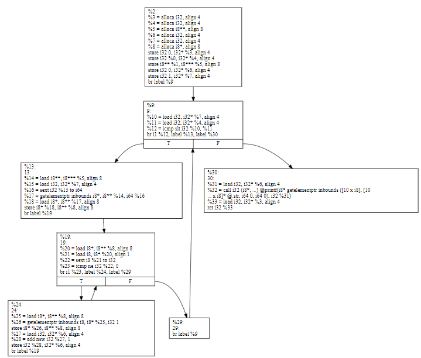

控制流图中的自然循环是具有下列属性的节点的集合S：

存在一个头结点h

S中的任意一个元素都存在路径到头结点h

S外不存在任何节点有边指向S中除h意外的其他节点

编译器中说的循环（loop）和拓扑意义上的环（cycle）是不同的。编译器领域中的环只能有一个入口，多个入口的环在编译器领域不叫做循环，因为绝大多数对循环的优化在多入口的环中都不适用。

多个入口的环在编码过程中也非常罕见，所以也不是编译器需要关心的场景。

### 6.2.1 控制流图的简化过程

如果对于边(n1, n2)，n1是n2的唯一前驱，或者n1和n2是强连通图的一部分，可以用下面的方法简化：

删除边(n1, n2)

新建节点n12

将所有n1的前驱改成n12的前驱

将所有n2的后继改成n12的后继

删除节点n1和n2

重复上述操作，直到控制流图保持不变。

例如下面的控制流图：

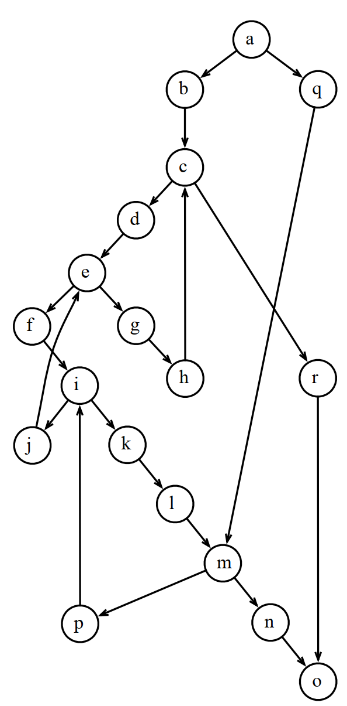

简化流程是这样的：

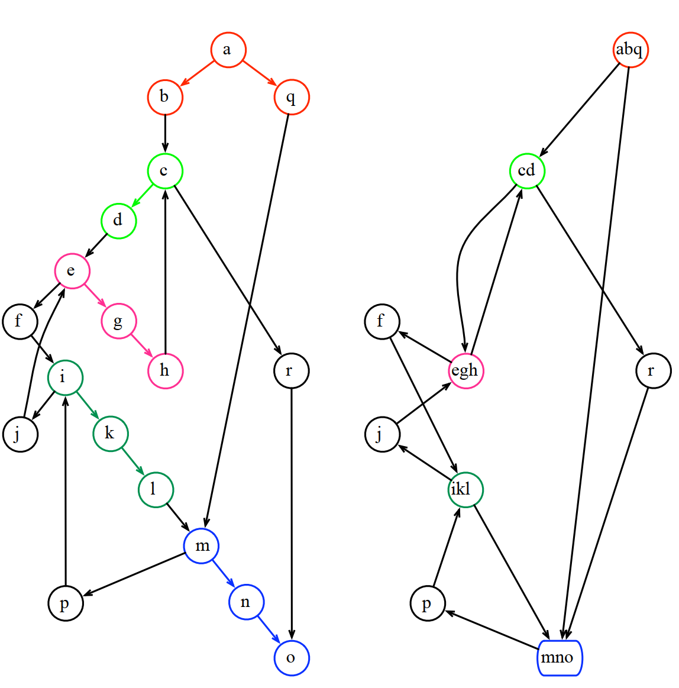

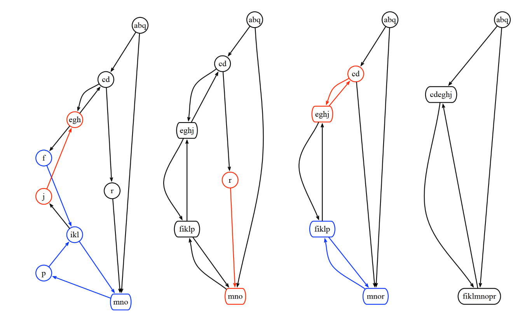

为什么要简化控制流图：

入口单一，可以在优化过程中在头结点处增加 冗余代码

简化后的图数据流分析速度更快

常规的循环语法，例如for，while，repeat，continue和break都会产生可简化的控制流图

goto会产生不可简化的流图

## 6.3 自然循环

### 6.3.1 支配节点（Dominators）

节点d是节点n的支配节点，当且仅当所有从控制流图入口到n的所有路径都经过d。

D[s0] = {s0} D[n] = {n} ∪ (∩ p∈ pred[n]D[p]), for n ≠ s0
支配节点的计算：

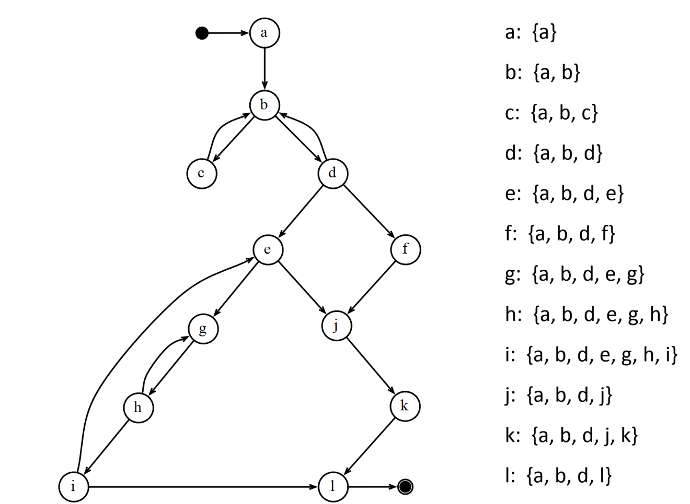

### 6.3.2 直接支配节点（Immediate Dominators）

每个阶段n都 只有唯一一个直接支配节点idom(n)，定义如下：

idom(n) 不是n

idom(n)是n的支配节点

idom(n)不是n的其他支配节点的支配节点

### 6.3.3 支配节点树（Dominator Tree）

把每个节点的直接支配节点画一条边到该节点，就形成了图的支配节点树：

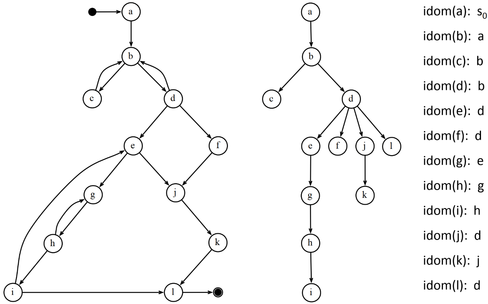

嵌套循环中优先优化内存循环。

循环的头节点h：在循环的节点集中，存在一个节点n，h是它的支配节点，并且存在边(n, h)。

如果两个循环的头结点存在支配关系，则被支配的头节点所在的循环称为内循环，支配的头节点所在的循环称为外循环。

## 6.4 安全的不变代码提升（SAFE INVARIANT CODE HOISTING）

### 6.4.1 循环不变性

如果某个计算在循环的每次迭代中都产生同样的值，则该计算时循环不变的。

循环不变表达式的通常优化方法是将该表达式提升到循环外。

满足下面任意一条要求的表达式是循环不变表达式：

表达式的参数是常量

表达式的参数定义在循环外

表达式的参数是循环不变表达式，并且在该表达式之前没有其他定义

将循环不变表达式提升到循环外的做法称为代码提升。

### 6.4.2 安全的不变代码提升

在程序点d，如果满足下面3个条件，可以对表达式t = a + b 安全的进行代码提升：

d是所有t生效区域内节点的支配节点

t在循环内只有一个定义

t在循环的头结点外没有使用

### 6.4.3 循环倒置（Loop Inversion）

将常规的while循环转换成repeat-util循环的做法称为循环倒置。倒置后的循环可以安全的进行不变代码提升。

repeat-utill循环在循环过程中每次迭代只需要进行一次跳转，所以性能也比常规的while循环要好。

## 6.5 因变量（INDUCTION VARIABLES）

### 6.5.1 基本概念

基本因变量（Basic induction variable）：如果一个变量i在循环内部仅定义一次，并且每次定义都是在原有值基础上增加或者减少循环不变量的值。

派生因变量（Derived induction variables）：如果一个变量k在循环内部仅定义一次，并且k是一个因变量与循环不变量的乘积或者和。

i系列的派生因变量（a derived induction variable in the family of i）：如果一个变量k定义中使用的因变量j仅定义一次，并且定义在循环内部，在j和k之间没有i的定义。

### 6.5.2 强度削减

将乘法运算换算成加法运算。例如下面的优化：

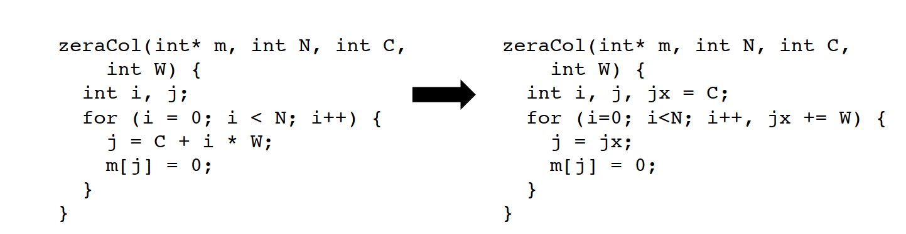

强度削减的算法基本上就是将派生因变量转换成基本因变量。算法过程一般如下：

对所有j = i * c, 假定变量i每个迭代增加b，i 初始化为a，那j每个迭代就要增加 b*c。

在循环外新增一个变量j'为第一次迭代时的j的值， j' = a*c

在循环外新增一个变量k，用来保存每个迭代j需要增加的值b*c

这样循环内部就可以优化成

j = j'

j' += k

### 6.5.3 无用代码删除（Dead Code Elimination）

首先删除的是j'，因为k'已经完成了类似的功能：

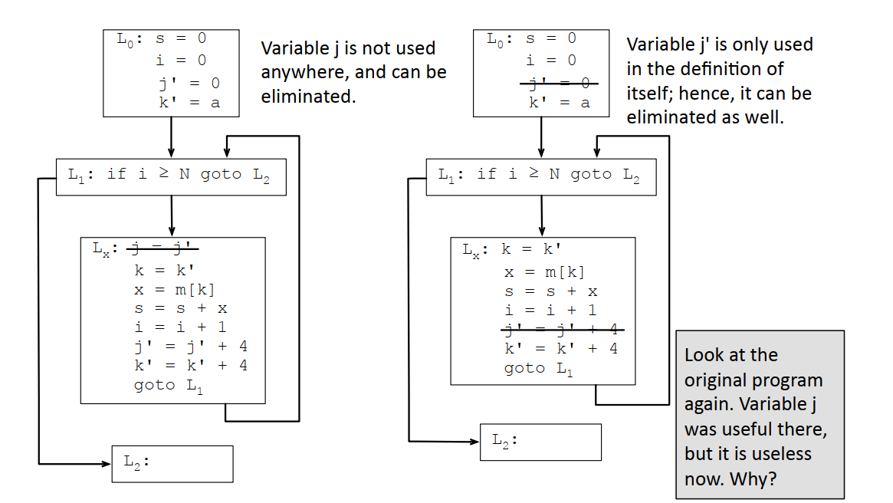

由于i除了定义就只有和循环不变量的比较，所以实际上i也是可以删除的：

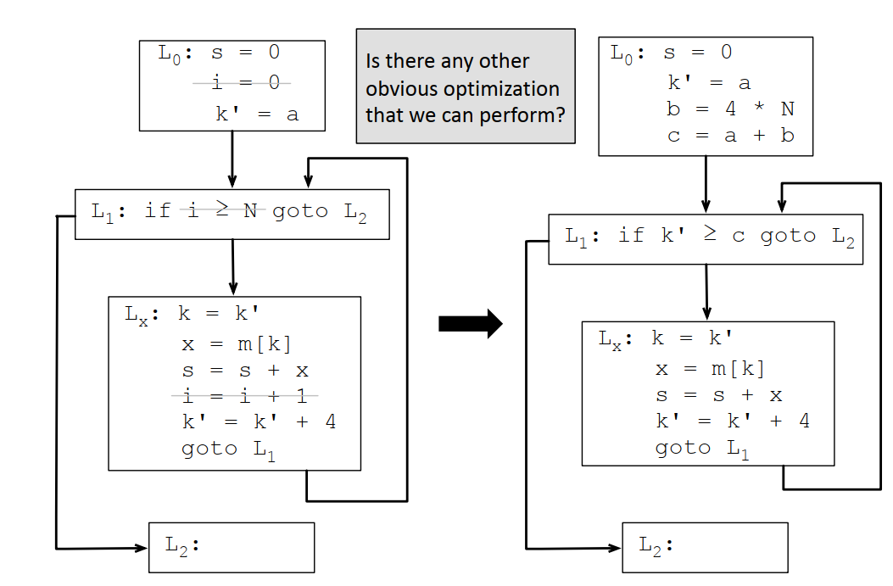

删除冗余拷贝：

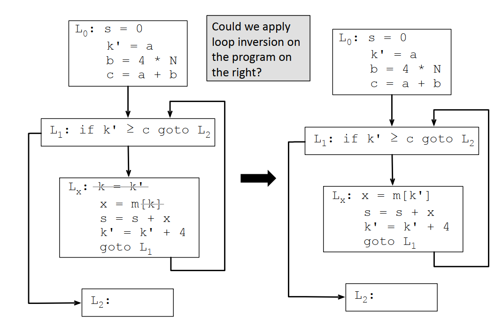

循环倒置：

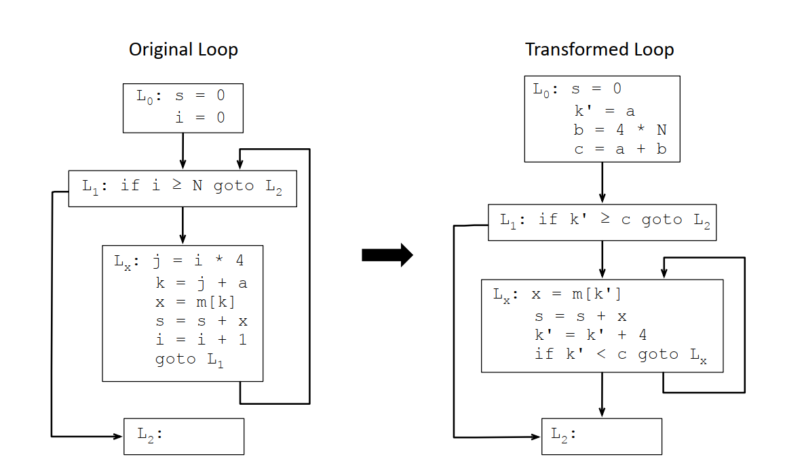

初始版本和最终优化版本的对比：

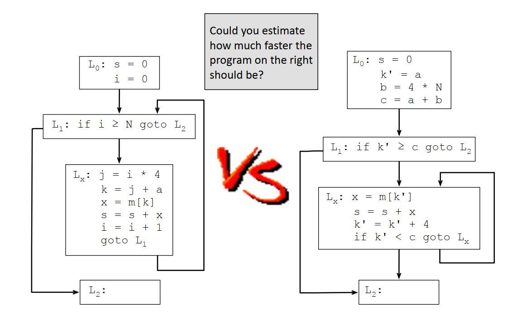

### 6.5.4 循环展开

循环展开是通过减少循环次数并增加循环内部的计算来优化的一种方式。例如对下面的代码：

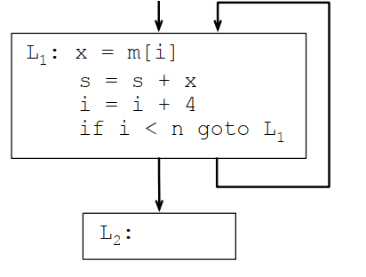

以2为因子进行循环展开之后的结果是这样的：

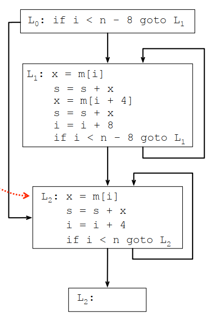

## 6.6 循环优化简史

Lowry, E. S. and Medlock, C. W. "Object Code Optimization". CACM 12(1), 13-22 (1969) 引入因变量优化和支配节点的概念。

Allen, F. E. "Control Flow Analysis". SIGPLAN Notices 23(7) 308-317. (1970)引入控制流图的化简，并因此获得图灵奖。

## 6.7 LLVM的循环优化实现

### 6.7.1 LLVM中的Dominators

支配关系分析，是很多程序分析和优化的基础，尤其在循环分析中特别关键，相对于其他模块，循环分析除了需要普通的支配关系，还需要知道某个循环的直接支配节点，直接支配节点可以生成支配节点树，支配节点数中的上下级关系构成了各种优化或者代码提升过程中的必要条件。

llvm\lib\IR\Dominators.cpp

|   | //  验证工作非常耗时，一般只在debug版本开启 |
| --- | --- |
| 32 | bool llvm::VerifyDomInfo = false; |
| 33 | static cl::opt<bool, true> |
| 34 | VerifyDomInfoX("verify-dom-info", cl::location(VerifyDomInfo), cl::Hidden, |
| 35 | cl::desc("Verify dominator info (time consuming)")); |
|   | //  相对于VerifyDomInfo打开情况下的全部验证， |
|   | //  EXPENSIVE_CHECKS仅验证一些基本的信息， |
|   | //  当然，也可以选择什么校验都不做，这就是默认做法 |
| 36 |  |
| 37 | #ifdef EXPENSIVE_CHECKS |
| 38 | static constexpr bool ExpensiveChecksEnabled = true; |
| 39 | #else |
| 40 | static constexpr bool ExpensiveChecksEnabled = false; |
| 41 | #endif |
|   | //  如果一个函数中仅有两个基本块， |
|   | //  并且两个基本块之间仅有一条边那很多分析可以简化。 |
| 42 |  |
| 43 | bool BasicBlockEdge::isSingleEdge() const { |
| 44 | const Instruction *TI = Start->getTerminator(); |
| 45 | unsigned NumEdgesToEnd = 0; |
| 46 | for (unsigned int i = 0, n = TI->getNumSuccessors(); i < n; ++i) { |
| 47 | if (TI->getSuccessor(i) == End) |
| 48 | ++NumEdgesToEnd; |
| 49 | if (NumEdgesToEnd >= 2) |
| 50 | return false; |
| 51 | } |
| 52 | assert(NumEdgesToEnd == 1); |
| 53 | return true; |
| 54 | } |
| 55 |  |
| 56 | //===----------------------------------------------------------------------===// |
|   | //  下面是支配树的实现。 |
| 57 | //  DominatorTree Implementation |
| 58 | //===----------------------------------------------------------------------===// |
| 59 | // |
|   | // 下面这些函数是在头文件里面实现的模板，这里特定化一下。 |
| 60 | // Provide public access to DominatorTree information.  Implementation details |
| 61 | // can be found in Dominators.h, GenericDomTree.h, and |
| 62 | // GenericDomTreeConstruction.h. |
| 63 | // |
| 64 | //===----------------------------------------------------------------------===// |
|   | // 支配树和后支配树的大多数逻辑都是一样的， |
|   | // 只不过后支配树有可能存在多个根节点，其他都是打印的差异。 |
| 65 |  |
| 66 | template class llvm::DomTreeNodeBase<BasicBlock>; |
| 67 | template class llvm::DominatorTreeBase<BasicBlock, false>; // DomTreeBase |
| 68 | template class llvm::DominatorTreeBase<BasicBlock, true>; // PostDomTreeBase |
| 69 |  |
| 70 | template class llvm::cfg::Update<BasicBlock *>; |
|   | // 基于基本块的支配树是对普通支配树的简化， |
|   | // 基本块支配树的每个节点都是基本块。 |
|   | // 如果说DomTree是对支配树本身的抽象， |
|   | // 那DomTreeBuilder就是对支配树构建过程的抽象，有点工厂模式的味道。 |
| 71 |  |
| 72 | template void llvm::DomTreeBuilder::Calculate<DomTreeBuilder::BBDomTree>( |
| 73 | DomTreeBuilder::BBDomTree &DT); |
| 74 | template void |
| 75 | llvm::DomTreeBuilder::CalculateWithUpdates<DomTreeBuilder::BBDomTree>( |
| 76 | DomTreeBuilder::BBDomTree &DT, BBUpdates U); |
|   | // 后支配树的做法和支配树类似。 |
| 77 |  |
| 78 | template void llvm::DomTreeBuilder::Calculate<DomTreeBuilder::BBPostDomTree>( |
| 79 | DomTreeBuilder::BBPostDomTree &DT); |
| 80 | // No CalculateWithUpdates<PostDomTree> instantiation, unless a usecase arises. |
|   | // 增。 |
| 81 |  |
| 82 | template void llvm::DomTreeBuilder::InsertEdge<DomTreeBuilder::BBDomTree>( |
| 83 | DomTreeBuilder::BBDomTree &DT, BasicBlock *From, BasicBlock *To); |
| 84 | template void llvm::DomTreeBuilder::InsertEdge<DomTreeBuilder::BBPostDomTree>( |
| 85 | DomTreeBuilder::BBPostDomTree &DT, BasicBlock *From, BasicBlock *To); |
|   | // 删。 |
| 86 |  |
| 87 | template void llvm::DomTreeBuilder::DeleteEdge<DomTreeBuilder::BBDomTree>( |
| 88 | DomTreeBuilder::BBDomTree &DT, BasicBlock *From, BasicBlock *To); |
| 89 | template void llvm::DomTreeBuilder::DeleteEdge<DomTreeBuilder::BBPostDomTree>( |
| 90 | DomTreeBuilder::BBPostDomTree &DT, BasicBlock *From, BasicBlock *To); |
|   | // 改。 |
| 91 |  |
| 92 | template void llvm::DomTreeBuilder::ApplyUpdates<DomTreeBuilder::BBDomTree>( |
| 93 | DomTreeBuilder::BBDomTree &DT, DomTreeBuilder::BBUpdates); |
| 94 | template void llvm::DomTreeBuilder::ApplyUpdates<DomTreeBuilder::BBPostDomTree>( |
| 95 | DomTreeBuilder::BBPostDomTree &DT, DomTreeBuilder::BBUpdates); |
|   | // 验。 |
| 96 |  |
| 97 | template bool llvm::DomTreeBuilder::Verify<DomTreeBuilder::BBDomTree>( |
| 98 | const DomTreeBuilder::BBDomTree &DT, |
| 99 | DomTreeBuilder::BBDomTree::VerificationLevel VL); |
| 100 | template bool llvm::DomTreeBuilder::Verify<DomTreeBuilder::BBPostDomTree>( |
| 101 | const DomTreeBuilder::BBPostDomTree &DT, |
| 102 | DomTreeBuilder::BBPostDomTree::VerificationLevel VL); |
|   | // invalidate本意是失效，所以如果所有分析都属于需要保留的内容， |
|   | // 那就失效失败，返回false。反之，就失效成功了。 |
|   | // 一般调用invalidate是为了触发支配树重新生成。 |
| 103 |  |
| 104 | bool DominatorTree::invalidate(Function &F, const PreservedAnalyses &PA, |
| 105 | FunctionAnalysisManager::Invalidator &) { |
| 106 | // Check whether the analysis, all analyses on functions, or the function's |
| 107 | // CFG have been preserved. |
| 108 | auto PAC = PA.getChecker<DominatorTreeAnalysis>(); |
| 109 | return !(PAC.preserved() || PAC.preservedSet<AllAnalysesOn<Function>>() || |
| 110 | PAC.preservedSet<CFGAnalyses>()); |
| 111 | } |
|   | // Def支配User的实际含义是，如果某个变量在Def中有定义， |
|   | // 在User处有使用，那么在User处的使用一定在Def的定义之后。 |
|   | // 也就是说，如果User中的使用在Def的定义之前， |
|   | // 那么就会出现未定义的行为。 |
|   | // 这是因为在程序执行时，必须先定义变量，然后才能使用它。 |
|   | // 是否支配 - 如果Def支配User中的使用，则返回true。 |
|   | // 如果Def和User位于相同的基本块中，则需要执行此特殊检查。 |
|   | // 请注意，Def不支配其自身的任何使用！ |
| 112 |  |
| 113 | // dominates - Return true if Def dominates a use in User. This performs |
| 114 | // the special checks necessary if Def and User are in the same basic block. |
| 115 | // Note that Def doesn't dominate a use in Def itself! |
| 116 | bool DominatorTree::dominates(const Instruction *Def, |
| 117 | const Instruction *User) const { |
|   | // 获取User所在的基本块 |
| 118 | const BasicBlock *UseBB = User->getParent(); |
|   | // 获取Def所在的基本块 |
| 119 | const BasicBlock *DefBB = Def->getParent(); |
|   | // 任何无法到达的use都被支配，即使Def == User。 |
| 120 |  |
| 121 | // Any unreachable use is dominated, even if Def == User. |
| 122 | if (!isReachableFromEntry(UseBB)) |
| 123 | return true; |
|   | // 无法到达的定义不支配任何东西。 |
| 124 |  |
| 125 | // Unreachable definitions don't dominate anything. |
| 126 | if (!isReachableFromEntry(DefBB)) |
| 127 | return false; |
|   | // 指令在其自身上不支配任何使用 |
| 128 |  |
| 129 | // An instruction doesn't dominate a use in itself. |
| 130 | if (Def == User) |
| 131 | return false; |
|   | // invoke指令定义的值只在其支配UseBB中的每个指令时才支配指令。 |
|   | // PHI仅在其支配UseBB中的每个可能使用时才被支配。 |
| 132 |  |
| 133 | // The value defined by an invoke dominates an instruction only if it |
| 134 | // dominates every instruction in UseBB. |
| 135 | // A PHI is dominated only if the instruction dominates every possible use in |
| 136 | // the UseBB. |
| 137 | if (isa<InvokeInst>(Def) || isa<CallBrInst>(Def) || isa<PHINode>(User)) |
| 138 | return dominates(Def, UseBB); |
| 139 |  |
| 140 | if (DefBB != UseBB) |
| 141 | return dominates(DefBB, UseBB); |
|   | // 如果Def不在UseBB中，则调用dominates(DefBB, UseBB)函数, |
|   | // 检查Def所在的基本块是否支配UseBB中的指令。 |
|   | // 否则，如果Def在UseBB中，则只需检查Def是否在User之前。 |
| 142 |  |
| 143 | return Def->comesBefore(User); |
| 144 | } |
|   | // 如果Def在任何位于UseBB中的指令中使用，则返回true。 |
|   | // 请注意，dominates(Def, Def->getParent())将返回false。 |
| 145 |  |
| 146 | // true if Def would dominate a use in any instruction in UseBB. |
| 147 | // note that dominates(Def, Def->getParent()) is false. |
| 148 | bool DominatorTree::dominates(const Instruction *Def, |
| 149 | const BasicBlock *UseBB) const { |
|   | // 获取Def所在的基本块 |
| 150 | const BasicBlock *DefBB = Def->getParent(); |
|   | // 任何无法到达的use都被支配，即使DefBB == UseBB。 |
| 151 |  |
| 152 | // Any unreachable use is dominated, even if DefBB == UseBB. |
| 153 | if (!isReachableFromEntry(UseBB)) |
| 154 | return true; |
|   | // 无法到达的定义不支配任何东西。 |
| 155 |  |
| 156 | // Unreachable definitions don't dominate anything. |
| 157 | if (!isReachableFromEntry(DefBB)) |
| 158 | return false; |
|   | // 如果DefBB等于UseBB，则返回false，因为这种情况下无法判断是否支配。 |
| 159 |  |
| 160 | if (DefBB == UseBB) |
| 161 | return false; |
|   | // 如果Def是一个invoke指令，则需要检查其正常目标是否可以到达UseBB。 |
|   | // 这是因为invoke结果只能在其正常目标中使用，不能在异常目标中使用。 |
| 162 |  |
| 163 | // Invoke results are only usable in the normal destination, not in the |
| 164 | // exceptional destination. |
| 165 | if (const auto *II = dyn_cast<InvokeInst>(Def)) { |
|   | // II是一个invoke指令，获取其正常目标基本块 |
| 166 | BasicBlock *NormalDest = II->getNormalDest(); |
|   | // 创建一个基本块边缘对象E，表示从DefBB到NormalDest的跳转。 |
| 167 | BasicBlockEdge E(DefBB, NormalDest); |
|   | // 调用dominates(E)函数检查从DefBB到NormalDest的跳转， |
|   | // 是否可以支配UseBB中的指令。 |
| 168 | return dominates(E, UseBB); |
| 169 | } |
|   | // 如果Def是一个CallBrInst类型的指令，则类似地只能在默认目标中使用其结果。 |
| 170 |  |
| 171 | // Callbr results are similarly only usable in the default destination. |
| 172 | if (const auto *CBI = dyn_cast<CallBrInst>(Def)) { |
|   | // 获取CallBrInst指令的默认目标基本块。 |
| 173 | BasicBlock *NormalDest = CBI->getDefaultDest(); |
|   | // 创建一个基本块边缘对象E，表示从DefBB到NormalDest的跳转。 |
| 174 | BasicBlockEdge E(DefBB, NormalDest); |
|   | // 调用dominates(E, UseBB)函数检查从DefBB到NormalDest的跳转是否可以支配UseBB中的指令。 |
| 175 | return dominates(E, UseBB); |
| 176 | } |
|   | // 如果不是CallBrInst类型的指令， |
|   | // 则直接调用dominates(DefBB, UseBB)函数检查DefBB是否可以支配UseBB中的指令。 |
| 177 |  |
| 178 | return dominates(DefBB, UseBB); |
| 179 | } |
| 180 |  |
| 181 | bool DominatorTree::dominates(const BasicBlockEdge &BBE, |
| 182 | const BasicBlock *UseBB) const { |
|   | // 如果该边的终点不支配使用的基本块，则该边也不支配。 |
| 183 | // If the BB the edge ends in doesn't dominate the use BB, then the |
| 184 | // edge also doesn't. |
| 185 | const BasicBlock *Start = BBE.getStart(); // 获取该边的起点 |
| 186 | const BasicBlock *End = BBE.getEnd(); // 获取该边的终点 |
|   | // 如果终点不支配使用的基本块，则返回false |
| 187 | if (!dominates(End, UseBB)) |
| 188 | return false; |
|   | // 简单情况：如果终点只有一个前驱节点， |
|   | // 终点支配使用的基本块意味着该边也支配。 |
| 189 |  |
| 190 | // Simple case: if the end BB has a single predecessor, the fact that it |
| 191 | // dominates the use block implies that the edge also does. |
| 192 | if (End->getSinglePredecessor()) |
| 193 | return true; |
|   | // 来自invoke的正常边是关键的。 |
|   | // 从概念上讲，我们想做的是将其拆分并检查新块是否支配使用的基本块。 |
|   | // 用X表示新块，图形将如下所示： |
| 194 |  |
| 195 | // The normal edge from the invoke is critical. Conceptually, what we would |
| 196 | // like to do is split it and check if the new block dominates the use. |
| 197 | // With X being the new block, the graph would look like: |
| 198 | // |
| 199 | //        DefBB |
| 200 | //          /\      .  . |
| 201 | //         /  \     .  . |
| 202 | //        /    \    .  . |
| 203 | //       /      \   |  | |
| 204 | //      A        X  B  C |
| 205 | //      |         \ | / |
| 206 | //      .          \|/ |
| 207 | //      .      NormalDest |
| 208 | //      . |
| 209 | // |
|   | // 根据支配的定义，如果X支配NormalDest的所有前驱节点（例如X、B、C）， |
|   | // 则NormalDest被X支配。 |
|   | // X显然支配自身，因此我们只需要检查它是否支配其他前驱节点。 |
|   | // 由于X唯一的出口是通过NormalDest， |
|   | // 因此X只能在其支配NormalDest的情况下支配节点。 |
| 210 | // Given the definition of dominance, NormalDest is dominated by X iff X |
| 211 | // dominates all of NormalDest's predecessors (X, B, C in the example). X |
| 212 | // trivially dominates itself, so we only have to find if it dominates the |
| 213 | // other predecessors. Since the only way out of X is via NormalDest, X can |
| 214 | // only properly dominate a node if NormalDest dominates that node too. |
| 215 | int IsDuplicateEdge = 0; // 记录重复边的数量 |
| 216 | for (const_pred_iterator PI = pred_begin(End), E = pred_end(End); |
| 217 | PI != E; ++PI) { |
| 218 | const BasicBlock *BB = *PI; // 获取当前前驱节点 |
| 219 | if (BB == Start) { |
|   | // 如果起点和终点之间有多个边，根据定义，它们不能支配任何东西。 |
|   | // 如果存在重复边，则返回false |
| 220 | // If there are multiple edges between Start and End, by definition they |
| 221 | // can't dominate anything. |
| 222 | if (IsDuplicateEdge++) |
| 223 | return false; |
| 224 | continue; |
| 225 | } |
| 226 |  |
| 227 | if (!dominates(End, BB)) // 如果终点不支配当前前驱节点，则返回false |
| 228 | return false; |
| 229 | } |
| 230 | return true; // 所有前驱节点都由该边所支配，因此返回true |
| 231 | } |
| 232 |  |
| 233 | bool DominatorTree::dominates(const BasicBlockEdge &BBE, const Use &U) const { |
|   | // 将Use的User转换为Instruction指针。 |
| 234 | Instruction *UserInst = cast<Instruction>(U.getUser()); |
|   | // 如果UserInst是指令，并且该指令是一个PHI节点， |
|   | // 且该PHI节点在BBE的结束处，并且该PHI节点的输入块是BBE的开始处， |
|   | // 则该BBE支配该PHI节点。 |
| 235 | // A PHI in the end of the edge is dominated by it. |
| 236 | PHINode *PN = dyn_cast<PHINode>(UserInst); |
| 237 | if (PN && PN->getParent() == BBE.getEnd() && |
| 238 | PN->getIncomingBlock(U) == BBE.getStart()) |
| 239 | return true; |
|   | // 否则，使用edge-dominates-block查询，它可以正确处理疯狂的关键边情况。 |
|   | // 获取Use的所在基本块。 |
| 240 |  |
| 241 | // Otherwise use the edge-dominates-block query, which |
| 242 | // handles the crazy critical edge cases properly. |
| 243 | const BasicBlock *UseBB; |
| 244 | if (PN) |
| 245 | UseBB = PN->getIncomingBlock(U); |
| 246 | else |
| 247 | UseBB = UserInst->getParent(); |
|   | // 调用dominates函数查询BBE是否支配UseBB |
| 248 | return dominates(BBE, UseBB); |
| 249 | } |
|   | // 这段代码定义了一个名为DominatorTree的类的成员函数dominates， |
|   | // 这个函数用于确定一个定义点（Def）是否支配一个使用点（U）。 |
|   | // 支配关系在程序中意味着，如果一个变量在某处被定义，并且在另一处使用， |
|   | // 那么定义点必须在使用点之前。 |
| 250 |  |
| 251 | bool DominatorTree::dominates(const Instruction *Def, const Use &U) const { |
|   | // 函数首先获取定义点所在的基本块（DefBB）。 |
| 252 | Instruction *UserInst = cast<Instruction>(U.getUser()); |
| 253 | const BasicBlock *DefBB = Def->getParent(); |
|   | // 然后确定使用点所在的基本块（UseBB）。 |
| 254 |  |
| 255 | // Determine the block in which the use happens. PHI nodes use |
| 256 | // their operands on edges; simulate this by thinking of the use |
| 257 | // happening at the end of the predecessor block. |
| 258 | const BasicBlock *UseBB; |
| 259 | if (PHINode *PN = dyn_cast<PHINode>(UserInst)) |
| 260 | UseBB = PN->getIncomingBlock(U); |
| 261 | else |
| 262 | UseBB = UserInst->getParent(); |
|   | // 如果使用点所在的基元块无法从程序入口可达，那么该使用点被支配， |
|   | // 即使定义点等于用户点。 |
| 263 |  |
| 264 | // Any unreachable use is dominated, even if Def == User. |
| 265 | if (!isReachableFromEntry(UseBB)) |
| 266 | return true; |
|   | // 如果定义点无法从程序入口可达，那么该定义不支配任何内容。 |
| 267 |  |
| 268 | // Unreachable definitions don't dominate anything. |
| 269 | if (!isReachableFromEntry(DefBB)) |
| 270 | return false; |
|   | // 如果定义点是一个InvokeInst（即 invoke 指令）， |
|   | // 该指令定义了其正常成功目标（NormalDest）的返回值， |
|   | // 那么这个支配关系需要特别处理。 |
|   | // 这种情况下，该指令不支配其所在块内的任何内容，除非该块中有一个 PHI 节点。 |
|   | // 所以，我们不需要再遍历该块。 |
| 271 |  |
| 272 | // Invoke instructions define their return values on the edges to their normal |
| 273 | // successors, so we have to handle them specially. |
| 274 | // Among other things, this means they don't dominate anything in |
| 275 | // their own block, except possibly a phi, so we don't need to |
| 276 | // walk the block in any case. |
| 277 | if (const InvokeInst *II = dyn_cast<InvokeInst>(Def)) { |
| 278 | BasicBlock *NormalDest = II->getNormalDest(); |
| 279 | BasicBlockEdge E(DefBB, NormalDest); |
| 280 | return dominates(E, U); |
| 281 | } |
|   | // 如果定义点是一个CallBrInst（即 callbr 指令）， |
|   | // 其结果只能在其默认目标中使用，因此需要进行类似的特别处理。 |
| 282 |  |
| 283 | // Callbr results are similarly only usable in the default destination. |
| 284 | if (const auto *CBI = dyn_cast<CallBrInst>(Def)) { |
| 285 | BasicBlock *NormalDest = CBI->getDefaultDest(); |
| 286 | BasicBlockEdge E(DefBB, NormalDest); |
| 287 | return dominates(E, U); |
| 288 | } |
|   | // 如果定义点和使用点在不同的基元块中， |
|   | // 那么会进行一个简单的 CFG 支配树查询。 |
| 289 |  |
| 290 | // If the def and use are in different blocks, do a simple CFG dominator |
| 291 | // tree query. |
| 292 | if (DefBB != UseBB) |
| 293 | return dominates(DefBB, UseBB); |
|   | // 如果定义点和使用点在同一个基元块中，如果定义点是一个 invoke 指令， |
|   | // 那么它不支配该块内的任何内容。 |
|   | // 如果定义点是一个 PHI 节点，那么它支配该块内的所有内容。 |
| 294 |  |
| 295 | // Ok, def and use are in the same block. If the def is an invoke, it |
| 296 | // doesn't dominate anything in the block. If it's a PHI, it dominates |
| 297 | // everything in the block. |
|   | // 最后，如果定义点是一个 PHI 节点，那么返回 true。 |
| 298 | if (isa<PHINode>(UserInst)) |
| 299 | return true; |
|   | // 否则，返回定义点是否在用户点之前的布尔值。 |
| 300 |  |
| 301 | return Def->comesBefore(UserInst); |
| 302 | } |
|   | // 本函数接收一个Use对象的引用作为参数，返回一个布尔值， |
|   | // 表示这个Use是否可以从入口（entry）到达。 |
| 303 |  |
| 304 | bool DominatorTree::isReachableFromEntry(const Use &U) const { |
|   | // 获取U的用户，并尝试将其动态转换为Instruction对象。 |
|   | // U的用户应该是Instruction对象，如果不是， |
|   | // 说明U的用户可能是常量表达式（ConstantExpr）。 |
| 305 | Instruction *I = dyn_cast<Instruction>(U.getUser()); |
|   | // 如果U的用户不是Instruction对象，即U的用户是常量表达式， |
|   | // 虽然它们实际上并不可从入口块到达，但它们也不需要像不可到达的代码那样被处理。 |
|   | // 因此返回true。 |
| 306 |  |
| 307 | // ConstantExprs aren't really reachable from the entry block, but they |
| 308 | // don't need to be treated like unreachable code either. |
| 309 | if (!I) return true; |
|   | // 如果U的用户是PHINode对象，尝试将其动态转换为PHINode对象。 |
|   | //  PHINode是特殊的Instruction对象，它表示基本块之间的分支。 |
| 310 |  |
| 311 | // PHI nodes use their operands on their incoming edges. |
| 312 | if (PHINode *PN = dyn_cast<PHINode>(I)) |
|   | // 对于PHINode，我们需要判断它的输入块是否可以从入口到达， |
|   | // 因此递归调用isReachableFromEntry函数。 |
| 313 | return isReachableFromEntry(PN->getIncomingBlock(U)); |
|   | // 如果U的用户不是PHINode对象，那么它是普通的Instruction对象。 |
|   | // 对于普通的Instruction对象，我们需要判断它所在的块是否可以从入口到达， |
|   | // 因此递归调用isReachableFromEntry函数。 |
| 314 |  |
| 315 | // Everything else uses their operands in their own block. |
| 316 | return isReachableFromEntry(I->getParent()); |
| 317 | } |
|   | // 如果边BBE1与边BBE2匹配，或者BBE1支配BBE2的起点， |
|   | // 则边BBE1支配边BBE2。 |
| 318 |  |
| 319 | // Edge BBE1 dominates edge BBE2 if they match or BBE1 dominates start of BBE2. |
| 320 | bool DominatorTree::dominates(const BasicBlockEdge &BBE1, |
| 321 | const BasicBlockEdge &BBE2) const { |
| 322 | if (BBE1.getStart() == BBE2.getStart() && BBE1.getEnd() == BBE2.getEnd()) |
| 323 | return true; |
| 324 | return dominates(BBE1, BBE2.getStart()); |
| 325 | } |
| 326 |  |
| 327 | //===----------------------------------------------------------------------===// |
| 328 | //  DominatorTreeAnalysis and related pass implementations |
|   | //  支配树分析和相关pass的实现。 |
| 329 | //===----------------------------------------------------------------------===// |
| 330 | // |
| 331 | // This implements the DominatorTreeAnalysis which is used with the new pass |
| 332 | // manager. It also implements some methods from utility passes. |
|   | // 这段代码实现了DominatorTreeAnalysis，它是与新的传递管理器一起使用的。 |
|   | // 它还实现了一些来自实用传递的方法。 |
| 333 | // |
| 334 | //===----------------------------------------------------------------------===// |
|   | // run函数是DominatorTreeAnalysis的一个成员， |
|   | // 它接受一个Function对象和一个FunctionAnalysisManager对象作为参数， |
|   | // 重新计算函数的支配者树，并返回计算结果。 |
| 335 |  |
| 336 | DominatorTree DominatorTreeAnalysis::run(Function &F, |
| 337 | FunctionAnalysisManager &) { |
| 338 | DominatorTree DT;  // 创建一个DominatorTree对象DT |
| 339 | DT.recalculate(F);  // 重新计算F的支配者树 |
| 340 | return DT;  // 返回计算结果 |
| 341 | } |
|   | // Key是一个静态成员变量，它的类型是AnalysisKey， |
|   | // 用于在FunctionAnalysisManager中注册DominatorTreeAnalysis。 |
| 342 |  |
| 343 | AnalysisKey DominatorTreeAnalysis::Key; |
|   | // DominatorTreePrinterPass的构造函数，接受一个raw_ostream对象作为参数， |
|   | // 并将其存储在成员变量OS中。 |
| 344 |  |
| 345 | DominatorTreePrinterPass::DominatorTreePrinterPass(raw_ostream &OS) : OS(OS) {} |
|   | // run函数是DominatorTreePrinterPass的一个成员， |
|   | // 它接受一个Function对象和一个FunctionAnalysisManager对象作为参数， |
|   | // 打印函数的支配者树，并返回PreservedAnalyses::all()，表示该传递保留了所有的分析结果。 |
| 346 |  |
| 347 | PreservedAnalyses DominatorTreePrinterPass::run(Function &F, |
| 348 | FunctionAnalysisManager &AM) { |
| 349 | OS << "DominatorTree for function: " << F.getName() << "\n";  // 打印函数的名称 |
| 350 | AM.getResult<DominatorTreeAnalysis>(F).print(OS);  // 打印函数的支配者树 |
| 351 |  |
| 352 | return PreservedAnalyses::all();  // 返回PreservedAnalyses::all() |
| 353 | } |
|   | // run函数是DominatorTreeVerifierPass的一个成员， |
|   | // 它接受一个Function对象和一个FunctionAnalysisManager对象作为参数， |
|   | // 验证函数的支配者树，并返回PreservedAnalyses::all()，表示该传递保留了所有的分析结果。 |
| 354 |  |
| 355 | PreservedAnalyses DominatorTreeVerifierPass::run(Function &F, |
| 356 | FunctionAnalysisManager &AM) { |
| 357 | auto &DT = AM.getResult<DominatorTreeAnalysis>(F);  // 获取函数的支配者树 |
| 358 | assert(DT.verify());  // 验证支配者树 |
| 359 | (void)DT;  // 防止编译器警告，在release版本中此处并未使用DT |
| 360 | return PreservedAnalyses::all();  // 返回PreservedAnalyses::all() |
| 361 | } |
| 362 |  |
| 363 | //===----------------------------------------------------------------------===// |
| 364 | //  DominatorTreeWrapperPass Implementation |
| 365 | //===----------------------------------------------------------------------===// |
| 366 | // |
| 367 | // The implementation details of the wrapper pass that holds a DominatorTree |
| 368 | // suitable for use with the legacy pass manager. |
|   | // 这段代码是Wrapper Pass的实现细节， |
|   | // 它持有一个适合与旧传递管理器一起使用的DominatorTree。 |
| 369 | // |
| 370 | //===----------------------------------------------------------------------===// |
|   | // ID是一个静态成员变量，它的类型是char， |
|   | // 用于在PassRegistry中注册DominatorTreeWrapperPass。 |
| 371 |  |
| 372 | char DominatorTreeWrapperPass::ID = 0; |
|   | // DominatorTreeWrapperPass的构造函数， |
|   | // 它调用initializeDominatorTreeWrapperPassPass函数来初始化传递。 |
| 373 |  |
| 374 | DominatorTreeWrapperPass::DominatorTreeWrapperPass() : FunctionPass(ID) { |
| 375 | initializeDominatorTreeWrapperPassPass(*PassRegistry::getPassRegistry());  // 初始化传递 |
| 376 | } |
|   | // 初始化一个Pass，Pass的名称是"domtree"， |
|   | // 描述是"Dominator Tree Construction"，并且它在函数级别的优化和验证阶段运行。 |
| 377 |  |
| 378 | INITIALIZE_PASS(DominatorTreeWrapperPass, "domtree", |
| 379 | "Dominator Tree Construction", true, true) |
|   | // runOnFunction方法是这个Pass的主要部分，它在每个函数上运行。 |
|   | // 这个方法会重新计算给定函数的支配者树，并返回false，表示这个Pass并没有修改函数。 |
| 380 |  |
| 381 | bool DominatorTreeWrapperPass::runOnFunction(Function &F) { |
| 382 | DT.recalculate(F);  // 重新计算支配者树 |
| 383 | return false;  // 返回false，表示没有修改 |
| 384 | } |
|   | // verifyAnalysis方法用于验证分析结果的有效性。 |
|   | // 如果开启了完全验证（VerifyDomInfo），它会执行完全的支配者树验证。 |
|   | // 如果没有开启完全验证但是开启了昂贵检查（ExpensiveChecksEnabled）， |
|   | // 它会执行基本的支配者树验证。 |
| 385 |  |
| 386 | void DominatorTreeWrapperPass::verifyAnalysis() const { |
| 387 | if (VerifyDomInfo) |
| 388 | assert(DT.verify(DominatorTree::VerificationLevel::Full));  // 进行完全的支配者树验证 |
| 389 | else if (ExpensiveChecksEnabled) |
| 390 | assert(DT.verify(DominatorTree::VerificationLevel::Basic));  // 进行基本的支配者树验证 |
| 391 | } |
|   | // print方法用于打印支配者树的信息。 |
| 392 |  |
| 393 | void DominatorTreeWrapperPass::print(raw_ostream &OS, const Module *) const { |
| 394 | DT.print(OS);  // 打印支配者树的信息 |
| 395 | } |

LLVM中的loop-unroll

llvm\lib\Transforms\Utils\LoopUnroll.cpp

|   | // 用例打印pass相关的名字 |
| --- | --- |
| 79 | #define DEBUG_TYPE "loop-unroll" |
|   | // LLVM中并没有其他LoopUnroll，mlir里面倒是另外有一个， |
|   | // 但和这个也是相互独立的，所以，没明白作者为何加这句注释。 |
| 80 |  |
| 81 | // TODO: Should these be here or in LoopUnroll? |
|   | // 下面的计数器名称还是比较显眼的，做了多少个loop的展开， |
|   | // 总的loop个数和总的无条件展开的loop个数。 |
| 82 | STATISTIC(NumCompletelyUnrolled, "Number of loops completely unrolled"); |
| 83 | STATISTIC(NumUnrolled, "Number of loops unrolled (completely or otherwise)"); |
| 84 | STATISTIC(NumUnrolledNotLatch, "Number of loops unrolled without a conditional " |
| 85 | "latch (completely or otherwise)"); |
|   | // 定义一个静态的cl::opt<bool>类型的变量UnrollRuntimeEpilog， |
|   | // 它的名字是"unroll-runtime-epilog"。 |
|   | // cl::init(false)表示这个选项的默认值是false。 |
|   | // cl::Hidden表示这个选项在命令行中是隐藏的，用户不能直接设置。 |
|   | // cl::desc()提供了这个选项的描述，说明这个选项的用途。 |
|   | // 默认使用epilog。 |
| 86 |  |
| 87 | static cl::opt<bool> |
| 88 | UnrollRuntimeEpilog("unroll-runtime-epilog", cl::init(false), cl::Hidden, |
| 89 | cl::desc("Allow runtime unrolled loops to be unrolled " |
| 90 | "with epilog instead of prolog.")); |
|   | // 定义一个静态的cl::opt<bool>类型的变量UnrollVerifyDomtree， |
|   | // 它的名字是"unroll-verify-domtree"。 |
|   | // cl::Hidden表示这个选项在命令行中是隐藏的，用户不能直接设置。 |
|   | // cl::desc()提供了这个选项的描述，说明这个选项的用途。 |
|   | // #ifdef EXPENSIVE_CHECKS和#else指令用于条件编译， |
|   | // 如果定义了EXPENSIVE_CHECKS，则cl::init(true)，否则cl::init(false)。 |
| 91 |  |
| 92 | static cl::opt<bool> |
| 93 | UnrollVerifyDomtree("unroll-verify-domtree", cl::Hidden, |
| 94 | cl::desc("Verify domtree after unrolling"), |
| 95 | #ifdef EXPENSIVE_CHECKS |
| 96 | cl::init(true) |
| 97 | #else |
| 98 | cl::init(false) |
| 99 | #endif |
| 100 | ); |
|   | /// 这段代码是在检查在展开循环后是否需要插入phi节点以保持LCSSA形式。 |
| 101 |  |
| 102 | /// Check if unrolling created a situation where we need to insert phi nodes to |
| 103 | /// preserve LCSSA form. |
| 104 | /// \param Blocks is a vector of basic blocks representing unrolled loop. |
| 105 | /// \param L is the outer loop. |
|   | /// 可能存在一些BB在L内部，一些BB在L外部。 |
|   | /// 如果某个变量的定义在L内部，使用在L外部，那就要插入一个φ节点， |
|   | /// 要不然就打破了LCSSA范式。 |
|   | /// LCSSA是loop closed SSA的简称，直译是闭环SSA， |
|   | /// 是对循环中的变量传递到循环外时，插入了额外的φ节点之后的代码。 |
|   | /// LCSSA和普通SSA等价，但对其他分析和处理更加友好， |
|   | /// 更详细的实现参见llvm\lib\Transforms\Utils\LCSSA.cpp。 |
| 106 | /// It's possible that some of the blocks are in L, and some are not. In this |
| 107 | /// case, if there is a use is outside L, and definition is inside L, we need to |
| 108 | /// insert a phi-node, otherwise LCSSA will be broken. |
|   | /// 这个函数是一个辅助函数， |
|   | /// 用于检查在展开循环后是否需要插入phi节点以保持LCSSA形式。 |
|   | /// 参数Blocks是一个基本块向量，代表展开后的循环。 |
|   | /// 参数L是外部循环。可能的情况是，一些块在L中，一些不在。 |
|   | /// 在这种情况下，如果有一个在L之外的使用和一个在L之内的定义， |
|   | /// 我们需要插入一个phi节点，否则LCSSA将被破坏。 |
|   | /// 如果发生这种情况，该函数将返回true，指示需要修复LCSSA。 |
| 109 | /// The function is just a helper function for llvm::UnrollLoop that returns |
| 110 | /// true if this situation occurs, indicating that LCSSA needs to be fixed. |
| 111 | static bool needToInsertPhisForLCSSA(Loop *L, std::vector<BasicBlock *> Blocks, |
| 112 | LoopInfo *LI) { |
|   | // 遍历Blocks向量中的所有基本块。 |
| 113 | for (BasicBlock *BB : Blocks) { |
|   | // 如果基本块BB属于循环L，则跳过这个基本块，进行下一个基本块的遍历。 |
| 114 | if (LI->getLoopFor(BB) == L) |
| 115 | continue; |
|   | // 遍历基本块BB中的所有指令。 |
| 116 | for (Instruction &I : *BB) { |
|   | // 遍历指令I的所有操作数。 |
| 117 | for (Use &U : I.operands()) { |
|   | // 如果操作数U是一个指令，则获取这个指令。 |
| 118 | if (auto Def = dyn_cast<Instruction>(U)) { |
|   | // 获取定义这个指令的基本块所在的循环。 |
| 119 | Loop *DefLoop = LI->getLoopFor(Def->getParent()); |
|   | // 如果定义指令的基本块不在任何循环中，则跳过这个操作数， |
|   | // 进行下一个操作数的遍历。 |
| 120 | if (!DefLoop) |
| 121 | continue; |
|   | // 如果定义指令的基本块所在的循环包含了循环L， |
|   | // 则返回true，表示需要插入PHI指令。 |
| 122 | if (DefLoop->contains(L)) |
| 123 | return true; |
| 124 | } |
| 125 | } |
| 126 | } |
| 127 | } |
|   | // 如果遍历了所有的基本块和指令，都没有发现需要插入PHI指令的情况，则返回false。 |
| 128 | return false; |
| 129 | } |
|   | /// 这个函数是用来将克隆的基本块添加到循环信息中， |
|   | /// 并在必要时为克隆的基本块创建新的循环，同时添加从原始循环到新循环的映射。 |
|   | /// 如果未创建新循环，则返回nullptr，否则返回原始基本块所在的原始循环的指针。 |
| 130 |  |
| 131 | /// Adds ClonedBB to LoopInfo, creates a new loop for ClonedBB if necessary |
| 132 | /// and adds a mapping from the original loop to the new loop to NewLoops. |
| 133 | /// Returns nullptr if no new loop was created and a pointer to the |
| 134 | /// original loop OriginalBB was part of otherwise. |
| 135 | const Loop* llvm::addClonedBlockToLoopInfo(BasicBlock *OriginalBB, |
| 136 | BasicBlock *ClonedBB, LoopInfo *LI, |
| 137 | NewLoopsMap &NewLoops) { |
|   | // 确定New所在的循环。 |
| 138 | // Figure out which loop New is in. |
| 139 | const Loop *OldLoop = LI->getLoopFor(OriginalBB); |
| 140 | assert(OldLoop && "Should (at least) be in the loop being unrolled!"); |
|   | // 如果NewLoop还没有被创建，就创建它。 |
| 141 |  |
| 142 | Loop *&NewLoop = NewLoops[OldLoop]; |
| 143 | if (!NewLoop) { |
|   | // 发现了一个新的子循环。 |
| 144 | // Found a new sub-loop. |
| 145 | assert(OriginalBB == OldLoop->getHeader() && |
| 146 | "Header should be first in RPO"); |
|   | // 分配一个新的循环。 |
| 147 |  |
| 148 | NewLoop = LI->AllocateLoop(); |
|   | // 获取新循环的父循环。 |
| 149 | Loop *NewLoopParent = NewLoops.lookup(OldLoop->getParentLoop()); |
|   | // 如果父循环存在，则将新循环添加为父循环的子循环。 |
| 150 |  |
| 151 | if (NewLoopParent) |
| 152 | NewLoopParent->addChildLoop(NewLoop); |
|   | // 否则，将新循环添加为顶级循环。 |
| 153 | else |
| 154 | LI->addTopLevelLoop(NewLoop); |
|   | // 将克隆的基本块添加到新循环中。 |
| 155 |  |
| 156 | NewLoop->addBasicBlockToLoop(ClonedBB, *LI); |
| 157 | return OldLoop; |
| 158 | } else { |
|   | // 将克隆的基本块添加到现有的新循环中。 |
| 159 | NewLoop->addBasicBlockToLoop(ClonedBB, *LI); |
| 160 | return nullptr; |
| 161 | } |
| 162 | } |
|   | /// 该函数选择哪种类型的展开（epilog 或 prolog）更有利。 |
|   | /// 当存在从常量开始的 PHI 时，epilog 展开更有利。 |
|   | /// 在这种情况下，epilog 将保留从常量开始的 PHI， |
|   | /// 但 prolog 会将其转换为非常量。 |
| 163 |  |
| 164 | /// The function chooses which type of unroll (epilog or prolog) is more |
| 165 | /// profitabale. |
| 166 | /// Epilog unroll is more profitable when there is PHI that starts from |
| 167 | /// constant.  In this case epilog will leave PHI start from constant, |
| 168 | /// but prolog will convert it to non-constant. |
| 169 | /// |
| 170 | /// loop: |
| 171 | ///   PN = PHI [I, Latch], [CI, PreHeader] |
| 172 | ///   I = foo(PN) |
| 173 | ///   ... |
| 174 | /// |
|   | /// Epilog算法展开循环的例子。 |
| 175 | /// Epilog unroll case. |
| 176 | /// loop: |
| 177 | ///   PN = PHI [I2, Latch], [CI, PreHeader] |
| 178 | ///   I1 = foo(PN) |
| 179 | ///   I2 = foo(I1) |
| 180 | ///   ... |
|   | /// Prolog算法展开循环的例子。 |
| 181 | /// Prolog unroll case. |
| 182 | ///   NewPN = PHI [PrologI, Prolog], [CI, PreHeader] |
| 183 | /// loop: |
| 184 | ///   PN = PHI [I2, Latch], [NewPN, PreHeader] |
| 185 | ///   I1 = foo(PN) |
| 186 | ///   I2 = foo(I1) |
| 187 | ///   ... |
| 188 | /// |
|   | /// 如果存在从常量开始的PHI的节点，epilog展开将保留这个常量开始的PHI节点， |
|   | /// 而prolog展开则会将其转换为非常量，此时应该选择epilog。 |
| 189 | static bool isEpilogProfitable(Loop *L) { |
| 190 | BasicBlock *PreHeader = L->getLoopPreheader(); |
| 191 | BasicBlock *Header = L->getHeader(); |
| 192 | assert(PreHeader && Header); |
| 193 | for (const PHINode &PN : Header->phis()) { |
| 194 | if (isa<ConstantInt>(PN.getIncomingValueForBlock(PreHeader))) |
| 195 | return true; |
| 196 | } |
| 197 | return false; |
| 198 | } |
|   | /// 这个函数的目标是在循环展开后执行一些清理和简化操作。 |
|   | /// 它对新的循环中的IV（IV是induction variables的简称， |
|   | /// 有的地方翻译成推导变量，诱导变量，我们这里译为因变量， |
|   | /// 意思是随着循环的递进，会随着循环线性变化的变量）进行简化， |
|   | /// 并对指令进行快速的简化/dce（死代码消除）传递。 |
| 199 |  |
| 200 | /// Perform some cleanup and simplifications on loops after unrolling. It is |
| 201 | /// useful to simplify the IV's in the new loop, as well as do a quick |
| 202 | /// simplify/dce pass of the instructions. |
| 203 | void llvm::simplifyLoopAfterUnroll(Loop *L, bool SimplifyIVs, LoopInfo *LI, |
| 204 | ScalarEvolution *SE, DominatorTree *DT, |
| 205 | AssumptionCache *AC, |
| 206 | const TargetTransformInfo *TTI) { |
|   | // 简化任何在部分展开的循环中的因变量。 |
| 207 | // Simplify any new induction variables in the partially unrolled loop. |
| 208 | if (SE && SimplifyIVs) { |
|   | // 定义一个存储已删除指令的弱引用向量 |
| 209 | SmallVector<WeakTrackingVH, 16> DeadInsts; |
|   | // 简化循环中的新归纳变量 |
| 210 | simplifyLoopIVs(L, SE, DT, LI, TTI, DeadInsts); |
| 211 |  |
| 212 | // Aggressively clean up dead instructions that simplifyLoopIVs already |
| 213 | // identified. Any remaining should be cleaned up below. |
|   | // 激进地清理 simplifyLoopIVs 已经标识的已死亡指令。 |
|   | // 任何剩余的指令都应在下面清理。 |
| 214 | while (!DeadInsts.empty()) { |
|   | // 从已删除指令的向量中弹出一个元素。 |
| 215 | Value *V = DeadInsts.pop_back_val(); |
|   | // 如果这个元素是一个指令（或可能是一个指令） |
| 216 | if (Instruction *Inst = dyn_cast_or_null<Instruction>(V)) |
|   | // 删除这个指令及其依赖的指令。 |
| 217 | RecursivelyDeleteTriviallyDeadInstructions(Inst); |
| 218 | } |
| 219 | } |
|   | // 在这一点上，代码具有良好形式。我们现在对插入的代码进行一次快速的扫描， |
|   | // 同时进行常量传播和无用代码的消除操作。 |
| 220 |  |
| 221 | // At this point, the code is well formed.  We now do a quick sweep over the |
| 222 | // inserted code, doing constant propagation and dead code elimination as we |
| 223 | // go. |
| 224 | const DataLayout &DL = L->getHeader()->getModule()->getDataLayout(); |
| 225 | for (BasicBlock *BB : L->getBlocks()) { |
| 226 | for (BasicBlock::iterator I = BB->begin(), E = BB->end(); I != E;) { |
| 227 | Instruction *Inst = &*I++; |
|   | // 如果某条指令可以被简化，并且替换值不会破坏 LCSSA |
|   | // （Least Common Subexpression Analysis）形式， |
|   | // 那么用简化值替换该指令的所有使用。 |
| 228 |  |
| 229 | if (Value *V = SimplifyInstruction(Inst, {DL, nullptr, DT, AC})) |
| 230 | if (LI->replacementPreservesLCSSAForm(Inst, V)) |
| 231 | Inst->replaceAllUsesWith(V); |
|   | // 如果某条指令无条件地等价于一个常量，那么删除该指令。 |
| 232 | if (isInstructionTriviallyDead(Inst)) |
| 233 | BB->getInstList().erase(Inst); |
| 234 | } |
| 235 | } |
|   | // TODO: 在剥离（peeling）或解构（unrolling）之后， |
|   | // 之前循环中的条件很可能会折叠为常量， |
|   | // 在这里急切地传播这些常量将需要运行更少的清理转译。 |
|   | // 或者，一个 LoopEarlyCSE（循环早期公共子表达式消除）可能是合适的。 |
| 236 |  |
| 237 | // TODO: after peeling or unrolling, previously loop variant conditions are |
| 238 | // likely to fold to constants, eagerly propagating those here will require |
| 239 | // fewer cleanup passes to be run.  Alternatively, a LoopEarlyCSE might be |
| 240 | // appropriate. |
| 241 | } |
| 242 |  |
| 243 | /// Unroll the given loop by Count. The loop must be in LCSSA form.  Unrolling |
| 244 | /// can only fail when the loop's latch block is not terminated by a conditional |
| 245 | /// branch instruction. However, if the trip count (and multiple) are not known, |
| 246 | /// loop unrolling will mostly produce more code that is no faster. |
|   | /// 这个方法接受一个带循环次数的循环（必须处于LCSSA形式）， |
|   | /// 然后进行循环展开。展开可能会失败， |
|   | /// 如果循环的Latch块不是由条件分支指令终止的。但是， |
|   | /// 如果不知道循环次数（和倍数），那么循环展开通常会产生更多的代码，并不会更快。 |
| 247 | /// |
| 248 | /// TripCount is the upper bound of the iteration on which control exits |
| 249 | /// LatchBlock. Control may exit the loop prior to TripCount iterations either |
| 250 | /// via an early branch in other loop block or via LatchBlock terminator. This |
| 251 | /// is relaxed from the general definition of trip count which is the number of |
| 252 | /// times the loop header executes. Note that UnrollLoop assumes that the loop |
| 253 | /// counter test is in LatchBlock in order to remove unnecesssary instances of |
| 254 | /// the test.  If control can exit the loop from the LatchBlock's terminator |
| 255 | /// prior to TripCount iterations, flag PreserveCondBr needs to be set. |
|   | /// 这里定义了一个变量TripCount，表示当控制流退出Latch块的上界迭代次数。 |
|   | /// 在TripCount迭代之前，控制流可以通过其他循环块的早期分支或通过Latch块的终止器退出循环。 |
|   | /// 这与行程次数的通用定义（即循环头执行的次数）有所不同。 |
|   | /// 注意，UnrollLoop假定循环计数器测试是在LatchBlock中进行的， |
|   | /// 以删除不必要的测试实例。 |
|   | /// 如果在TripCount迭代之前控制可以从LatchBlock的终止器中退出循环， |
|   | /// 则需要设置PreserveCondBr标志。 |
|   | /// 简单说一下llvm代码里面的循环定义。一个循环外面可以有一个或者多个进入段 |
|   | /// （entering block，如果只有一个进入段，则可以称为循环的前驱）。 |
|   | /// 进入段的后继是循环的头，循环的头有边一个或者多个退出块（exiting block）。 |
|   | /// 退出块判断是进入锁存块（latch block，也就是通常说的循环体）， |
|   | /// 还是退出循环（通过边指向出口块，exit block）。 |
|   | /// 锁存块执行完之后会回到循环头。 |
| 256 | /// |
| 257 | /// PreserveCondBr indicates whether the conditional branch of the LatchBlock |
| 258 | /// needs to be preserved. It is needed when we use trip count upper bound to |
| 259 | /// fully unroll the loop. If PreserveOnlyFirst is also set then only the first |
| 260 | /// conditional branch needs to be preserved. |
|   | /// PreserveCondBr表示是否需要保留LatchBlock的条件分支。 |
|   | /// 当我们使用行程计数的上界来完全展开循环时，这是必需的。 |
|   | /// 如果还设置了PreserveOnlyFirst，那么只需要保留第一个条件分支。 |
| 261 | /// |
| 262 | /// Similarly, TripMultiple divides the number of times that the LatchBlock may |
| 263 | /// execute without exiting the loop. |
|   | /// 同样，TripMultiple表示LatchBlock在不退出循环的情况下可以执行的倍数。 |
|   | /// 例如，如果我们知道循环的次数是2的倍数，则TripMultiple可以是2， |
|   | /// 循环展开可以通过展开一次的方式将循环的总次数减半。 |
|   | /// 类似的，如果TripMultiple是3，则可以展开2次的方式将循环次数减少2/3。 |
|   | /// 如果循环的次数既不是常量，也无法确定是某个整数的倍数， |
|   | /// 这里的循环展开就不一定优化了执行时间。 |
|   | /// 例如，如果运行过程中计算出来循环次数是1，但编译阶段不知道是1， |
|   | /// 这里无论怎么做优化都是负优化。编译优化一般只做可靠的优化， |
|   | /// 对可能产生优化，也可能产生负优化的代码，尽量保持原来的代码不动。 |
| 264 | /// |
| 265 | /// If AllowRuntime is true then UnrollLoop will consider unrolling loops that |
| 266 | /// have a runtime (i.e. not compile time constant) trip count.  Unrolling these |
| 267 | /// loops require a unroll "prologue" that runs "RuntimeTripCount % Count" |
| 268 | /// iterations before branching into the unrolled loop.  UnrollLoop will not |
| 269 | /// runtime-unroll the loop if computing RuntimeTripCount will be expensive and |
| 270 | /// AllowExpensiveTripCount is false. |
|   | /// 如果AllowRuntime为真，那么UnrollLoop将考虑展开具有运行时 |
|   | /// （即不是编译时常量）行程计数的循环。 |
|   | /// 展开这些循环需要一个“序言”，在分支进入展开的循环之前， |
|   | /// 先求RuntimeTripCount 除 Count的余数，进行余数次迭代。 |
|   | /// 如果计算RuntimeTripCount的开销很大且AllowExpensiveTripCount为假， |
|   | /// UnrollLoop将不会运行时展开循环。 |
| 271 | /// |
| 272 | /// If we want to perform PGO-based loop peeling, PeelCount is set to the |
| 273 | /// number of iterations we want to peel off. |
|   | ///如果我们想执行基于PGO的循环剥离，PeelCount被设置为要剥离的迭代次数。 |
| 274 | /// |
| 275 | /// The LoopInfo Analysis that is passed will be kept consistent. |
|   | ///传递的LoopInfo Analysis将保持一致。 |
| 276 | /// |
| 277 | /// This utility preserves LoopInfo. It will also preserve ScalarEvolution and |
| 278 | /// DominatorTree if they are non-null. |
|   | ///此实用程序保留LoopInfo。如果非空，还将保留ScalarEvolution和DominatorTree。 |
| 279 | /// |
| 280 | /// If RemainderLoop is non-null, it will receive the remainder loop (if |
| 281 | /// required and not fully unrolled). |
|   | ///如果RemainderLoop不为空，它将接收到剩余的循环（如果需要并且未完全展开）。 |
| 282 | LoopUnrollResult llvm::UnrollLoop(Loop *L, UnrollLoopOptions ULO, LoopInfo *LI, |
| 283 | ScalarEvolution *SE, DominatorTree *DT, |
| 284 | AssumptionCache *AC, |
| 285 | const TargetTransformInfo *TTI, |
| 286 | OptimizationRemarkEmitter *ORE, |
| 287 | bool PreserveLCSSA, Loop **RemainderLoop) { |
|   | // 获取循环的预头部（Preheader）BasicBlock。 |
|   | // 预头部是循环之前的一个BasicBlock，它只包含无条件跳转到循环头部的指令。 |
|   | // 如果没有预头部，说明循环的预处理（例如预头部插入）失败。 |
|   | // 必须先找到循环的头，否则无法判断是否是循环。 |
| 288 |  |
| 289 | BasicBlock *Preheader = L->getLoopPreheader(); |
| 290 | if (!Preheader) { |
| 291 | LLVM_DEBUG(dbgs() << "  Can't unroll; loop preheader-insertion failed.\n"); |
| 292 | return LoopUnrollResult::Unmodified; |
| 293 | } |
|   | // 获取循环的锁存块（Latch Block）。 |
|   | // 锁存块是循环中最后一个可能再次跳转到循环头部的BasicBlock。 |
|   | // 如果没有锁存块，说明循环的出口块插入失败。 |
| 294 |  |
| 295 | BasicBlock *LatchBlock = L->getLoopLatch(); |
| 296 | if (!LatchBlock) { |
| 297 | LLVM_DEBUG(dbgs() << "  Can't unroll; loop exit-block-insertion failed.\n"); |
| 298 | return LoopUnrollResult::Unmodified; |
| 299 | } |
|   | // 检查循环体是否安全克隆。如果循环体中包含indirectbr指令（间接跳转），则不能克隆。 |
| 300 |  |
| 301 | // Loops with indirectbr cannot be cloned. |
| 302 | if (!L->isSafeToClone()) { |
| 303 | LLVM_DEBUG(dbgs() << "  Can't unroll; Loop body cannot be cloned.\n"); |
| 304 | return LoopUnrollResult::Unmodified; |
| 305 | } |
|   | // 当前的循环展开过程可以展开具有以下特点的循环： |
|   | // (1) 只有一个锁存块；并且 |
|   | // (2a) 锁存块是无条件的；或者 |
|   | // (2b) 锁存块是有条件的，并且是退出块 |
|   | // FIXME: 实现可以扩展到处理更复杂的情况，例如具有多个锁存块的循环。 |
| 306 |  |
| 307 | // The current loop unroll pass can unroll loops that have |
| 308 | // (1) single latch; and |
| 309 | // (2a) latch is unconditional; or |
| 310 | // (2b) latch is conditional and is an exiting block |
| 311 | // FIXME: The implementation can be extended to work with more complicated |
| 312 | // cases, e.g. loops with multiple latches. |
| 313 | BasicBlock *Header = L->getHeader(); |
| 314 | BranchInst *LatchBI = dyn_cast<BranchInst>(LatchBlock->getTerminator()); |
|   | // 一个条件分支，它退出循环，在某些情况下可以在展开的循环中优化为无条件分支。 |
| 315 |  |
| 316 | // A conditional branch which exits the loop, which can be optimized to an |
| 317 | // unconditional branch in the unrolled loop in some cases. |
| 318 | BranchInst *ExitingBI = nullptr; // 退出循环的分支指令，初始化为nullptr。 |
| 319 | bool LatchIsExiting = L->isLoopExiting(LatchBlock); // 检查锁存块是否是退出循环的块。 |
| 320 | if (LatchIsExiting) |
| 321 | ExitingBI = LatchBI; // 如果锁存块是退出块，则设置ExitingBI为LatchBI。 |
| 322 | else if (BasicBlock *ExitingBlock = L->getExitingBlock()) |
| 323 | ExitingBI = dyn_cast<BranchInst>(ExitingBlock->getTerminator()); |
|   | // 如果锁存块没有BranchInst，或者锁存块是有条件的但不是退出块，则不能展开循环。 |
| 324 | if (!LatchBI || (LatchBI->isConditional() && !LatchIsExiting)) { |
| 325 | LLVM_DEBUG( |
| 326 | dbgs() << "Can't unroll; a conditional latch must exit the loop"); |
| 327 | return LoopUnrollResult::Unmodified; // 返回未修改的结果 |
| 328 | } |
|   | // 调试输出，显示退出块的信息。 |
| 329 | LLVM_DEBUG({ |
| 330 | if (ExitingBI) |
| 331 | dbgs() << "  Exiting Block = " << ExitingBI->getParent()->getName() |
| 332 | << "\n"; |
| 333 | else |
| 334 | dbgs() << "  No single exiting block\n"; |
| 335 | }); |
|   | // 如果循环头部的地址被取过，则不进行展开。 |
|   | // 循环旋转传递在许多情况下可以避免这个问题。 |
| 336 |  |
| 337 | if (Header->hasAddressTaken()) { |
| 338 | // The loop-rotate pass can be helpful to avoid this in many cases. |
| 339 | LLVM_DEBUG( |
| 340 | dbgs() << "  Won't unroll loop: address of header block is taken.\n"); |
| 341 | return LoopUnrollResult::Unmodified; |
| 342 | } |
|   | // 如果提供了循环的迭代次数（TripCount），则进行调试输出。 |
| 343 |  |
| 344 | if (ULO.TripCount != 0) |
| 345 | LLVM_DEBUG(dbgs() << "  Trip Count = " << ULO.TripCount << "\n"); |
|   | // 如果提供了循环的迭代倍数（TripMultiple），则进行调试输出。 |
| 346 | if (ULO.TripMultiple != 1) |
| 347 | LLVM_DEBUG(dbgs() << "  Trip Multiple = " << ULO.TripMultiple << "\n"); |
|   | // 有效地“删除”那些超出迭代次数（TripCount）且永远不会执行的展开迭代。 |
| 348 |  |
| 349 | // Effectively "DCE" unrolled iterations that are beyond the tripcount |
| 350 | // and will never be executed. |
| 351 | if (ULO.TripCount != 0 && ULO.Count > ULO.TripCount) |
| 352 | ULO.Count = ULO.TripCount; // 如果指定的展开次数大于TripCount，则将其限制为TripCount。 |
|   | // 如果没有需要展开的迭代（TripCount为0，Count小于2，且PeelCount为0）， |
|   | // 则不进入展开代码。 |
| 353 |  |
| 354 | // Don't enter the unroll code if there is nothing to do. |
| 355 | if (ULO.TripCount == 0 && ULO.Count < 2 && ULO.PeelCount == 0) { |
| 356 | LLVM_DEBUG(dbgs() << "Won't unroll; almost nothing to do\n"); |
| 357 | return LoopUnrollResult::Unmodified; |
| 358 | } |
|   | // 断言确保ULO.Count（展开次数）和ULO.TripMultiple（迭代倍数）都是正数。 |
| 359 |  |
| 360 | assert(ULO.Count > 0); |
| 361 | assert(ULO.TripMultiple > 0); |
|   | // 断言确保如果提供了TripCount（迭代次数），那么它应该是TripMultiple（迭代倍数）的整数倍。 |
| 362 | assert(ULO.TripCount == 0 || ULO.TripCount % ULO.TripMultiple == 0); |
|   | // 判断我们是否要完全 |
| 363 |  |
| 364 | // Are we eliminating the loop control altogether? |
| 365 | bool CompletelyUnroll = ULO.Count == ULO.TripCount; |
|   | // 定义一个存储退出块的小型向量 |
| 366 | SmallVector<BasicBlock *, 4> ExitBlocks; |
|   | // 获取循环L的所有退出块，并将它们添加到ExitBlocks向量中 |
| 367 | L->getExitBlocks(ExitBlocks); |
|   | // 获取循环L的所有基本块的向量 |
| 368 | std::vector<BasicBlock*> OriginalLoopBlocks = L->getBlocks(); |
|   | // 遍历循环L的所有退出块，并检查是否存在phi节点。 |
|   | // 我们保守地假设这些phi节点 |
|   | // 是为了保持LCSSA形式而插入的，这意味着完全展开可能会破坏这种形式。 |
|   | //我们需要在转换后原地修复它，或者完全重建LCSSA。 |
|   | // TODO: 目前，我们只是为外部循环重新计算LCSSA，但应该有可能原地修复它。 |
| 369 |  |
| 370 | // Go through all exits of L and see if there are any phi-nodes there. We just |
| 371 | // conservatively assume that they're inserted to preserve LCSSA form, which |
| 372 | // means that complete unrolling might break this form. We need to either fix |
| 373 | // it in-place after the transformation, or entirely rebuild LCSSA. TODO: For |
| 374 | // now we just recompute LCSSA for the outer loop, but it should be possible |
| 375 | // to fix it in-place. |
| 376 | bool NeedToFixLCSSA = PreserveLCSSA && CompletelyUnroll && |
| 377 | any_of(ExitBlocks,  { |
| 378 | return isa<PHINode>(BB->begin()); |
| 379 | }); |
|   | // 如果编译器无法计算出循环的迭代次数，并且指定了unroll-runtime标志， |
|   | // 我们则假设运行时的迭代次数。 |
| 380 |  |
| 381 | // We assume a run-time trip count if the compiler cannot |
| 382 | // figure out the loop trip count and the unroll-runtime |
| 383 | // flag is specified. |
| 384 | bool RuntimeTripCount = |
| 385 | (ULO.TripCount == 0 && ULO.Count > 0 && ULO.AllowRuntime); |
|   | // 断言检查：我们期望在相同的循环中不同时进行运行时迭代次数的展开和剥离 |
| 386 |  |
| 387 | assert((!RuntimeTripCount || !ULO.PeelCount) && |
| 388 | "Did not expect runtime trip-count unrolling " |
| 389 | "and peeling for the same loop"); |
|   | // 初始化一个标志，表示循环是否已被剥离 |
| 390 |  |
| 391 | bool Peeled = false; |
|   | // 如果ULO.PeelCount非零，表示需要剥离循环 |
| 392 | if (ULO.PeelCount) { |
|   | // 尝试剥离循环，剥离次数为ULO.PeelCount，并更新Peeled标志 |
| 393 | Peeled = peelLoop(L, ULO.PeelCount, LI, SE, DT, AC, PreserveLCSSA); |
|   | // 如果剥离成功，可能会导致循环的preheader和迭代次数发生变化 |
|   | // 如果我们稍后要展开循环，我们希望这些值是最新的 |
| 394 |  |
| 395 | // Successful peeling may result in a change in the loop preheader/trip |
| 396 | // counts. If we later unroll the loop, we want these to be updated. |
| 397 | if (Peeled) { |
|   | // 根据我们的性价比检查，唯一有意义的退出应该是latch块 |
|   | // 其他退出都导向deopt，所以我们不关心它们 |
| 398 | // According to our guards and profitability checks the only |
| 399 | // meaningful exit should be latch block. Other exits go to deopt, |
| 400 | // so we do not worry about them. |
| 401 | BasicBlock *ExitingBlock = L->getLoopLatch(); |
|   | // 断言检查：确保存在退出块，且它是循环的latch块 |
| 402 | assert(ExitingBlock && "Loop without exiting block?"); |
|   | // 断言检查：确保latch块确实是循环的退出块 |
| 403 | assert(L->isLoopExiting(ExitingBlock) && "Latch is not exiting?"); |
|   | // 更新循环的preheader |
| 404 | Preheader = L->getLoopPreheader(); |
|   | // 重新计算并更新循环的迭代次数和迭代倍数 |
| 405 | ULO.TripCount = SE->getSmallConstantTripCount(L, ExitingBlock); |
| 406 | ULO.TripMultiple = SE->getSmallConstantTripMultiple(L, ExitingBlock); |
| 407 | } |
| 408 | } |
|   | // 如果循环中包含收敛指令，那么展开计数必须是循环迭代倍数的约数。 |
| 409 |  |
| 410 | // Loops containing convergent instructions must have a count that divides |
| 411 | // their TripMultiple. |
| 412 | LLVM_DEBUG( |
| 413 | { |
|   | // 初始化一个标志，表示循环中是否存在收敛指令 |
| 414 | bool HasConvergent = false; |
|   | // 遍历循环中的所有基本块 |
| 415 | for (auto &BB : L->blocks()) |
|   | // 遍历基本块中的所有指令 |
| 416 | for (auto &I : *BB) |
|   | // 如果指令是一个调用基类（包括函数调用、内联汇编等） |
| 417 | if (auto *CB = dyn_cast<CallBase>(&I)) |
|   | // 检查调用是否标记为收敛，并更新HasConvergent标志 |
| 418 | HasConvergent |= CB->isConvergent(); |
|   | // 断言检查：如果循环中存在收敛操作，确保展开计数能整除迭代倍数 |
| 419 | assert((!HasConvergent || ULO.TripMultiple % ULO.Count == 0) && |
| 420 | "Unroll count must divide trip multiple if loop contains a " |
| 421 | "convergent operation."); |
| 422 | }); |
|   | // 根据命令行选项UnrollRuntimeEpilog的出现次数来决定是否考虑尾部的盈利性。 |
|   | // 如果没有明确指定，则调用isEpilogProfitable函数来判断循环尾部的盈利性。 |
| 423 |  |
| 424 | bool EpilogProfitability = |
| 425 | UnrollRuntimeEpilog.getNumOccurrences() ? UnrollRuntimeEpilog |
| 426 | : isEpilogProfitable(L); |
|   | // 如果运行时迭代次数已知，且迭代倍数不能被展开计数整除， |
|   | // 尝试展开循环的余数部分。如果无法展开，根据ULO.Force的值决定是否强制继续展开， |
|   | // 或者返回未修改状态。 |
| 427 |  |
| 428 | if (RuntimeTripCount && ULO.TripMultiple % ULO.Count != 0 && |
| 429 | !UnrollRuntimeLoopRemainder(L, ULO.Count, ULO.AllowExpensiveTripCount, |
| 430 | EpilogProfitability, ULO.UnrollRemainder, |
| 431 | ULO.ForgetAllSCEV, LI, SE, DT, AC, TTI, |
| 432 | PreserveLCSSA, RemainderLoop)) { |
| 433 | if (ULO.Force) |
|   | // 如果强制展开，则忽略运行时迭代次数 |
| 434 | RuntimeTripCount = false; |
| 435 | else { |
|   | // 如果不强制展开，则输出调试信息并返回未修改状态 |
| 436 | LLVM_DEBUG(dbgs() << "Won't unroll; remainder loop could not be " |
| 437 | "generated when assuming runtime trip count\n"); |
| 438 | return LoopUnrollResult::Unmodified; |
| 439 | } |
| 440 | } |
|   | // 如果已知循环的迭代次数，我们可以计算出余数 |
| 441 |  |
| 442 | // If we know the trip count, we know the multiple... |
| 443 | unsigned BreakoutTrip = 0; |
| 444 | if (ULO.TripCount != 0) { |
|   | // 如果ULO.TripCount非零，计算展开后的余数迭代次数 |
| 445 | BreakoutTrip = ULO.TripCount % ULO.Count; |
|   | // 并将迭代倍数设置为0，因为我们已经知道确切的迭代次数 |
| 446 | ULO.TripMultiple = 0; |
| 447 | } else { |
|   | // 如果不知道确切的迭代次数，则计算展开计数和迭代倍数的最大公约数， |
|   | // 并将其设置为新的迭代倍数和余数迭代次数。 |
| 448 | // Figure out what multiple to use. |
| 449 | BreakoutTrip = ULO.TripMultiple = |
| 450 | (unsigned)GreatestCommonDivisor64(ULO.Count, ULO.TripMultiple); |
| 451 | } |
|   | // 使用ore命名空间，这通常是LLVM优化注释和报告的命名空间。 |
| 452 |  |
| 453 | using namespace ore; |
|   | // 报告完全展开决策。 |
| 454 | // Report the unrolling decision. |
| 455 | if (CompletelyUnroll) { |
|   | // 如果是完全展开，则在调试输出中打印相关信息。 |
| 456 | LLVM_DEBUG(dbgs() << "COMPLETELY UNROLLING loop %" << Header->getName() |
| 457 | << " with trip count " << ULO.TripCount << "!\n"); |
|   | // 如果存在优化注释报告器（ORE），则发出一个优化注释。 |
| 458 | if (ORE) |
| 459 | ORE->emit([&]() { |
|   | // 创建一个优化注释，包含循环被完全展开的信息和展开次数。 |
| 460 | return OptimizationRemark(DEBUG_TYPE, "FullyUnrolled", L->getStartLoc(), |
| 461 | L->getHeader()) |
| 462 | << "completely unrolled loop with " |
| 463 | << NV("UnrollCount", ULO.TripCount) << " iterations"; |
| 464 | }); |
|   | // 报告剥离决策。 |
| 465 | } else if (ULO.PeelCount) { |
|   | // 如果是剥离，则在调试输出中打印相关信息。 |
| 466 | LLVM_DEBUG(dbgs() << "PEELING loop %" << Header->getName() |
| 467 | << " with iteration count " << ULO.PeelCount << "!\n"); |
|   | // 如果存在优化注释报告器（ORE），则发出一个优化注释。 |
| 468 | if (ORE) |
| 469 | ORE->emit([&]() { |
|   | // 创建一个优化注释，包含循环被剥离的信息和剥离次数。 |
| 470 | return OptimizationRemark(DEBUG_TYPE, "Peeled", L->getStartLoc(), |
| 471 | L->getHeader()) |
| 472 | << " peeled loop by " << NV("PeelCount", ULO.PeelCount) |
| 473 | << " iterations"; |
| 474 | }); |
|   | // 报告部分展开决策。 |
| 475 | } else { |
|   | // 定义一个lambda函数来构建部分展开的优化注释。 |
| 476 | auto DiagBuilder = [&]() { |
|   | // 创建一个优化注释，包含循环被部分展开的信息和展开因子。 |
| 477 | OptimizationRemark Diag(DEBUG_TYPE, "PartialUnrolled", L->getStartLoc(), |
| 478 | L->getHeader()); |
| 479 | return Diag << "unrolled loop by a factor of " |
| 480 | << NV("UnrollCount", ULO.Count); |
| 481 | }; |
|   | // 在调试输出中打印部分展开循环的信息 |
| 482 |  |
| 483 | LLVM_DEBUG(dbgs() << "UNROLLING loop %" << Header->getName() << " by " |
| 484 | << ULO.Count); |
|   | // 处理展开时的不同情况。 |
| 485 | if (ULO.TripMultiple == 0 || BreakoutTrip != ULO.TripMultiple) { |
|   | // 如果TripMultiple为0或者BreakoutTrip不等于TripMultiple，则打印并发出带有breakout的注释。 |
| 486 | LLVM_DEBUG(dbgs() << " with a breakout at trip " << BreakoutTrip); |
| 487 | if (ORE) |
| 488 | ORE->emit([&]() { |
|   | // 使用之前定义的DiagBuilder来构建并发出优化注释，包含breakout的信息。 |
| 489 | return DiagBuilder() << " with a breakout at trip " |
| 490 | << NV("BreakoutTrip", BreakoutTrip); |
| 491 | }); |
| 492 | } else if (ULO.TripMultiple != 1) { |
|   | // 如果每个分支有多个迭代（TripMultiple不等于1），则打印并发出相应的注释。 |
| 493 | LLVM_DEBUG(dbgs() << " with " << ULO.TripMultiple << " trips per branch"); |
| 494 | if (ORE) |
| 495 | ORE->emit([&]() { |
|   | // 使用DiagBuilder构建并发出优化注释，包含每个分支的迭代次数信息。 |
| 496 | return DiagBuilder() |
| 497 | << " with " << NV("TripMultiple", ULO.TripMultiple) |
| 498 | << " trips per branch"; |
| 499 | }); |
| 500 | } else if (RuntimeTripCount) { |
|   | // 如果存在运行时迭代次数（RuntimeTripCount），则打印并发出相应的注释。 |
| 501 | LLVM_DEBUG(dbgs() << " with run-time trip count"); |
| 502 | if (ORE) |
| 503 | ORE->emit( |
| 504 | [&]() { return DiagBuilder() << " with run-time trip count"; }); |
| 505 | } |
|   | // 在调试输出中添加换行符，结束当前消息。 |
| 506 | LLVM_DEBUG(dbgs() << "!\n"); |
| 507 | } |
| 508 |  |
| 509 | // We are going to make changes to this loop. SCEV may be keeping cached info |
| 510 | // about it, in particular about backedge taken count. The changes we make |
| 511 | // are guaranteed to invalidate this information for our loop. It is tempting |
| 512 | // to only invalidate the loop being unrolled, but it is incorrect as long as |
| 513 | // all exiting branches from all inner loops have impact on the outer loops, |
| 514 | // and if something changes inside them then any of outer loops may also |
| 515 | // change. When we forget outermost loop, we also forget all contained loops |
| 516 | // and this is what we need here. |
|   | // 如果存在SE，并且ULO要求忘记所有SCEV（循环不变代码退出值）信息， |
|   | // 则调用forgetAllLoops()方法来忘记所有循环的信息。否则，只忘记最顶层的循环L。 |
| 517 | if (SE) { |
| 518 | if (ULO.ForgetAllSCEV) |
| 519 | SE->forgetAllLoops(); |
| 520 | else |
| 521 | SE->forgetTopmostLoop(L); |
| 522 | } |
|   | // 如果LatchIsExiting为假，表示循环的出口不是Latch块， |
|   | // 那么增加未展开的循环计数器NumUnrolledNotLatch。 |
| 523 |  |
| 524 | if (!LatchIsExiting) |
| 525 | ++NumUnrolledNotLatch; |
|   | // 定义一个可选布尔值ContinueOnTrue，初始为无值。 |
| 526 | Optional<bool> ContinueOnTrue = None; |
|   | // 如果存在ExitingBI（可能代表退出基本块），则定义LoopExit为ExitingBI的第一个后继块。 |
|   | // 同时，根据ContinueOnTrue的值，确定是否继续循环。 |
| 527 | BasicBlock *LoopExit = nullptr; |
| 528 | if (ExitingBI) { |
| 529 | ContinueOnTrue = L->contains(ExitingBI->getSuccessor(0)); |
| 530 | LoopExit = ExitingBI->getSuccessor(*ContinueOnTrue); |
| 531 | } |
| 532 |  |
| 533 | // For the first iteration of the loop, we should use the precloned values for |
| 534 | // PHI nodes.  Insert associations now. |
| 535 | ValueToValueMapTy LastValueMap; |
| 536 | std::vector<PHINode*> OrigPHINode; |
| 537 | for (BasicBlock::iterator I = Header->begin(); isa<PHINode>(I); ++I) { |
| 538 | OrigPHINode.push_back(cast<PHINode>(I)); |
| 539 | } |
|   | // 初始化一些向量，用于存储循环的头部、退出块、退出后继块和Latch块。 |
| 540 |  |
| 541 | std::vector<BasicBlock *> Headers; |
| 542 | std::vector<BasicBlock *> ExitingBlocks; |
| 543 | std::vector<BasicBlock *> ExitingSucc; |
| 544 | std::vector<BasicBlock *> Latches; |
| 545 | Headers.push_back(Header); |
| 546 | Latches.push_back(LatchBlock); |
| 547 | if (ExitingBI) { |
| 548 | ExitingBlocks.push_back(ExitingBI->getParent()); |
| 549 | ExitingSucc.push_back(ExitingBI->getSuccessor(!(*ContinueOnTrue))); |
| 550 | } |
| 551 |  |
| 552 | // The current on-the-fly SSA update requires blocks to be processed in |
| 553 | // reverse postorder so that LastValueMap contains the correct value at each |
| 554 | // exit. |
|   | // 使用LoopBlocksDFS对象DFS来对循环L进行深度优先搜索，并执行搜索。 |
| 555 | LoopBlocksDFS DFS(L); |
| 556 | DFS.perform(LI); |
| 557 |  |
| 558 | // Stash the DFS iterators before adding blocks to the loop. |
|   | // 在添加新块到循环之前，保存DFS的迭代器。 |
| 559 | LoopBlocksDFS::RPOIterator BlockBegin = DFS.beginRPO(); |
| 560 | LoopBlocksDFS::RPOIterator BlockEnd = DFS.endRPO(); |
|   | // 获取循环L中的所有基本块。 |
| 561 |  |
| 562 | std::vector<BasicBlock*> UnrolledLoopBlocks = L->getBlocks(); |
| 563 |  |
| 564 | // Loop Unrolling might create new loops. While we do preserve LoopInfo, we |
| 565 | // might break loop-simplified form for these loops (as they, e.g., would |
| 566 | // share the same exit blocks). We'll keep track of loops for which we can |
| 567 | // break this so that later we can re-simplify them. |
|   | // 循环展开可能会创建新的循环。我们虽然保留了LoopInfo，但可能会破坏这些新循环的简化形式。 |
|   | // 我们将跟踪这些循环，以便稍后重新简化它们。 |
| 568 | SmallSetVector<Loop *, 4> LoopsToSimplify; |
| 569 | for (Loop *SubLoop : *L) |
| 570 | LoopsToSimplify.insert(SubLoop); |
|   | // 如果当前循环所在的父级基本块是用于性能分析的调试信息，则对每个指令进行处理。 |
| 571 |  |
| 572 | if (Header->getParent()->isDebugInfoForProfiling()) |
| 573 | for (BasicBlock *BB : L->getBlocks()) |
| 574 | for (Instruction &I : *BB) |
| 575 | if (!isa<DbgInfoIntrinsic>(&I)) |
| 576 | if (const DILocation *DIL = I.getDebugLoc()) { |
| 577 | auto NewDIL = DIL->cloneByMultiplyingDuplicationFactor(ULO.Count); |
| 578 | if (NewDIL) |
| 579 | I.setDebugLoc(NewDIL.getValue()); |
| 580 | else |
| 581 | LLVM_DEBUG(dbgs() |
| 582 | << "Failed to create new discriminator: " |
| 583 | << DIL->getFilename() << " Line: " << DIL->getLine()); |
| 584 | } |
|   | // 循环展开的主体部分，迭代ULO.Count次，每次迭代都会创建新的块副本。 |
| 585 |  |
| 586 | for (unsigned It = 1; It != ULO.Count; ++It) { |
| 587 | SmallVector<BasicBlock *, 8> NewBlocks; |
| 588 | SmallDenseMap<const Loop *, Loop *, 4> NewLoops; |
| 589 | NewLoops[L] = L; |
|   | // 遍历DFS迭代器，克隆每个基本块，并使用ValueToValueMapTy来映射原始值到新值。 |
| 590 |  |
| 591 | for (LoopBlocksDFS::RPOIterator BB = BlockBegin; BB != BlockEnd; ++BB) { |
| 592 | ValueToValueMapTy VMap; |
| 593 | BasicBlock *New = CloneBasicBlock(*BB, VMap, "." + Twine(It)); |
| 594 | Header->getParent()->getBasicBlockList().push_back(New); |
|   | // 断言确保Header块不是子循环的头部，并且它属于当前循环L。 |
| 595 |  |
| 596 | assert((*BB != Header || LI->getLoopFor(*BB) == L) && |
| 597 | "Header should not be in a sub-loop"); |
| 598 | // Tell LI about New. |
|   | // 将克隆的块添加到LoopInfo中，并更新NewLoops映射。 |
| 599 | const Loop *OldLoop = addClonedBlockToLoopInfo(*BB, New, LI, NewLoops); |
| 600 | if (OldLoop) |
| 601 | LoopsToSimplify.insert(NewLoops[OldLoop]); |
|   | // 如果当前块是循环的头部，更新PHI节点以使用来自上一个块的值。 |
| 602 |  |
| 603 | if (*BB == Header) |
| 604 | // Loop over all of the PHI nodes in the block, changing them to use |
| 605 | // the incoming values from the previous block. |
| 606 | for (PHINode *OrigPHI : OrigPHINode) { |
| 607 | PHINode *NewPHI = cast<PHINode>(VMap[OrigPHI]); |
| 608 | Value *InVal = NewPHI->getIncomingValueForBlock(LatchBlock); |
| 609 | if (Instruction *InValI = dyn_cast<Instruction>(InVal)) |
| 610 | if (It > 1 && L->contains(InValI)) |
| 611 | InVal = LastValueMap[InValI]; |
| 612 | VMap[OrigPHI] = InVal; |
| 613 | New->getInstList().erase(NewPHI); |
| 614 | } |
| 615 |  |
| 616 | // Update our running map of newest clones |
|   | // 更新LastValueMap，使其包含最新的克隆块。 |
| 617 | LastValueMap[*BB] = New; |
| 618 | for (ValueToValueMapTy::iterator VI = VMap.begin(), VE = VMap.end(); |
| 619 | VI != VE; ++VI) |
| 620 | LastValueMap[VI->first] = VI->second; |
| 621 |  |
| 622 | // Add phi entries for newly created values to all exit blocks. |
|   | // 为所有退出块添加新的PHI入口。 |
| 623 | for (BasicBlock *Succ : successors(*BB)) { |
| 624 | if (L->contains(Succ)) |
| 625 | continue; |
| 626 | for (PHINode &PHI : Succ->phis()) { |
| 627 | Value *Incoming = PHI.getIncomingValueForBlock(*BB); |
| 628 | ValueToValueMapTy::iterator It = LastValueMap.find(Incoming); |
| 629 | if (It != LastValueMap.end()) |
| 630 | Incoming = It->second; |
| 631 | PHI.addIncoming(Incoming, New); |
| 632 | } |
| 633 | } |
| 634 | // Keep track of new headers and latches as we create them, so that |
| 635 | // we can insert the proper branches later. |
|   | // 更新新头部和Latch块的列表。 |
| 636 | if (*BB == Header) |
| 637 | Headers.push_back(New); |
| 638 | if (*BB == LatchBlock) |
| 639 | Latches.push_back(New); |
| 640 |  |
| 641 | // Keep track of the exiting block and its successor block contained in |
| 642 | // the loop for the current iteration. |
|   | // 更新当前迭代中包含在循环内的退出块及其后继块的列表。 |
| 643 | if (ExitingBI) { |
| 644 | if (*BB == ExitingBlocks[0]) |
| 645 | ExitingBlocks.push_back(New); |
| 646 | if (*BB == ExitingSucc[0]) |
| 647 | ExitingSucc.push_back(New); |
| 648 | } |
|   | // 将新创建的块添加到NewBlocks列表中， |
|   | // 并将其添加到循环的所有块列表UnrolledLoopBlocks中。 |
| 649 |  |
| 650 | NewBlocks.push_back(New); |
| 651 | UnrolledLoopBlocks.push_back(New); |
| 652 |  |
| 653 | // Update DomTree: since we just copy the loop body, and each copy has a |
| 654 | // dedicated entry block (copy of the header block), this header's copy |
| 655 | // dominates all copied blocks. That means, dominance relations in the |
| 656 | // copied body are the same as in the original body. |
|   | // 更新支配树（DomTree）。由于我们刚刚复制了循环体，每个复制都有一个专门的入口块（头部块的副本）， |
|   | // 这个头部的副本支配所有复制的块。这意味着，复制体中的支配关系与原始体中的相同。 |
| 657 | if (DT) { |
| 658 | if (*BB == Header) |
| 659 | DT->addNewBlock(New, Latches[It - 1]); |
| 660 | else { |
| 661 | auto BBDomNode = DT->getNode(*BB); |
| 662 | auto BBIDom = BBDomNode->getIDom(); |
| 663 | BasicBlock *OriginalBBIDom = BBIDom->getBlock(); |
| 664 | DT->addNewBlock( |
| 665 | New, cast<BasicBlock>(LastValueMap[cast<Value>(OriginalBBIDom)])); |
| 666 | } |
| 667 | } |
| 668 | } |
| 669 |  |
| 670 | // Remap all instructions in the most recent iteration |
|   | // 重映射最新迭代中的所有指令。 |
| 671 | remapInstructionsInBlocks(NewBlocks, LastValueMap); |
| 672 | for (BasicBlock *NewBlock : NewBlocks) { |
| 673 | for (Instruction &I : *NewBlock) { |
| 674 | if (auto *II = dyn_cast<IntrinsicInst>(&I)) |
| 675 | if (II->getIntrinsicID() == Intrinsic::assume) |
| 676 | AC->registerAssumption(II); |
| 677 | } |
| 678 | } |
| 679 | } |
| 680 |  |
| 681 | // Loop over the PHI nodes in the original block, setting incoming values. |
|   | // 遍历原始块中的PHI节点，设置传入值。 |
| 682 | for (PHINode *PN : OrigPHINode) { |
| 683 | if (CompletelyUnroll) { |
|   | // 如果完全展开循环，则用PHI节点的预头部块的传入值替换所有使用，并从头部块中删除PHI节点。 |
| 684 | PN->replaceAllUsesWith(PN->getIncomingValueForBlock(Preheader)); |
| 685 | Header->getInstList().erase(PN); |
| 686 | } else if (ULO.Count > 1) { |
|   | // 如果不是完全展开，并且ULO.Count大于1，则移除PHI节点的来自Latch块的传入值。 |
| 687 | Value *InVal = PN->removeIncomingValue(LatchBlock, false); |
| 688 | // If this value was defined in the loop, take the value defined by the |
| 689 | // last iteration of the loop. |
|   | // 如果这个值在循环中定义，取最后一次迭代的值。 |
| 690 | if (Instruction *InValI = dyn_cast<Instruction>(InVal)) { |
| 691 | if (L->contains(InValI)) |
| 692 | InVal = LastValueMap[InVal]; |
| 693 | } |
|   | // 断言最后一个Latch块是LastValueMap中Latch块的映射，并且添加新的传入值到PHI节点。 |
| 694 | assert(Latches.back() == LastValueMap[LatchBlock] && "bad last latch"); |
| 695 | PN->addIncoming(InVal, Latches.back()); |
| 696 | } |
| 697 | } |
|   | // 定义一个lambda函数setDest，用于设置源块Src到目标块Dest的分支，以及是否需要条件分支。 |
| 698 |  |
| 699 | auto setDest =  { |
|   | // 转换Src块的终结者为分支指令。 |
| 702 | auto *Term = cast<BranchInst>(Src->getTerminator()); |
| 703 | if (NeedConditional) { |
| 704 | // Update the conditional branch's successor for the following |
| 705 | // iteration. |
|   | // 如果需要条件分支，更新条件分支的后继块为下一次迭代。 |
| 706 | assert(ContinueOnTrue.hasValue() && |
| 707 | "Expecting valid ContinueOnTrue when NeedConditional is true"); |
| 708 | Term->setSuccessor(!(*ContinueOnTrue), Dest); |
| 709 | } else { |
| 710 | // Remove phi operands at this loop exit |
|   | // 如果不需要条件分支，移除phi操作数在这个循环出口。 |
| 711 | if (!IsDestLoopExit) { |
| 712 | BasicBlock *BB = Src; |
| 713 | for (BasicBlock *Succ : successors(BB)) { |
| 714 | // Preserve the incoming value from BB if we are jumping to the block |
| 715 | // in the current loop. |
|   | // 保留从BB来的传入值，如果我们跳转到当前循环迭代中的块。 |
| 716 | if (Succ == BlockInLoop) |
| 717 | continue; |
| 718 | for (PHINode &Phi : Succ->phis()) |
| 719 | Phi.removeIncomingValue(BB, false); |
| 720 | } |
| 721 | } |
| 722 | // Replace the conditional branch with an unconditional one. |
|   | // 用无条件分支替换条件分支。 |
| 723 | BranchInst::Create(Dest, Term); |
| 724 | Term->eraseFromParent(); |
| 725 | } |
| 726 | }; |
| 727 |  |
| 728 | // Connect latches of the unrolled iterations to the headers of the next |
| 729 | // iteration. If the latch is also the exiting block, the conditional branch |
| 730 | // may have to be preserved. |
|   | // 连接展开迭代的Latch块到下一个迭代的头部。如果Latch块也是退出块，条件分支可能需要保留。 |
| 731 | for (unsigned i = 0, e = Latches.size(); i != e; ++i) { |
| 732 | // The branch destination. |
|   | // 确定分支目的地。 |
| 733 | unsigned j = (i + 1) % e; |
| 734 | BasicBlock *Dest = Headers[j]; |
| 735 | bool NeedConditional = LatchIsExiting; |
| 736 |  |
| 737 | if (LatchIsExiting) { |
|   | // 如果Latch是退出块，根据运行时迭代次数和ULO设置确定是否需要条件分支。 |
| 738 | if (RuntimeTripCount && j != 0) |
| 739 | NeedConditional = false; |
| 740 |  |
| 741 | // For a complete unroll, make the last iteration end with a branch |
| 742 | // to the exit block. |
|   | // 如果完全展开循环，对于最后一次迭代，分支到退出块。 |
| 743 | if (CompletelyUnroll) { |
| 744 | if (j == 0) |
| 745 | Dest = LoopExit; |
| 746 | // If using trip count upper bound to completely unroll, we need to |
| 747 | // keep the conditional branch except the last one because the loop |
| 748 | // may exit after any iteration. |
|   | // 如果使用trip count upper bound来完全展开，我们需要保留条件分支，除了最后一个迭代。 |
| 749 | assert(NeedConditional && |
| 750 | "NeedCondition cannot be modified by both complete " |
| 751 | "unrolling and runtime unrolling"); |
| 752 | NeedConditional = |
| 753 | (ULO.PreserveCondBr && j && !(ULO.PreserveOnlyFirst && i != 0)); |
|   | // 如果我们知道循环的迭代次数或其倍数，我们可以安全地使用无条件分支。 |
| 754 | } else if (j != BreakoutTrip && |
| 755 | (ULO.TripMultiple == 0 || j % ULO.TripMultiple != 0)) { |
| 756 | // If we know the trip count or a multiple of it, we can safely use an |
| 757 | // unconditional branch for some iterations. |
| 758 | NeedConditional = false; |
| 759 | } |
| 760 | } |
|   | // 使用setDest函数设置从Latch[i]到Dest的分支，以及是否需要条件分支，ContinueOnTrue的值， |
|   | // 以及是否是目的地循环退出块。 |
| 761 |  |
| 762 | setDest(Latches[i], Dest, Headers[i], NeedConditional, ContinueOnTrue, |
| 763 | Dest == LoopExit); |
| 764 | } |
|   | // 如果Latch不是退出块，我们可能能够简化展开的退出块中的条件分支。 |
| 765 |  |
| 766 | if (!LatchIsExiting) { |
| 767 | // If the latch is not exiting, we may be able to simplify the conditional |
| 768 | // branches in the unrolled exiting blocks. |
| 769 | for (unsigned i = 0, e = ExitingBlocks.size(); i != e; ++i) { |
| 770 | // The branch destination. |
|   | // 确定分支目的地。 |
| 771 | unsigned j = (i + 1) % e; |
| 772 | bool NeedConditional = true; |
|   | // 如果有运行时迭代次数，或者不是第一次迭代，则不需要条件分支。 |
| 773 |  |
| 774 | if (RuntimeTripCount && j != 0) |
| 775 | NeedConditional = false; |
| 776 |  |
| 777 | if (CompletelyUnroll) |
| 778 | // We cannot drop the conditional branch for the last condition, as we |
| 779 | // may have to execute the loop body depending on the condition. |
|   | // 如果完全展开循环，我们不能为最后一个条件去掉条件分支，因为可能需要根据条件执行循环体。 |
| 780 | NeedConditional = j == 0 || ULO.PreserveCondBr; |
| 781 | else if (j != BreakoutTrip && |
| 782 | (ULO.TripMultiple == 0 || j % ULO.TripMultiple != 0)) |
| 783 | // If we know the trip count or a multiple of it, we can safely use an |
| 784 | // unconditional branch for some iterations. |
|   | // 如果我们知道循环的迭代次数或其倍数，我们可以安全地使用无条件分支。 |
| 785 | NeedConditional = false; |
| 786 |  |
| 787 | // Conditional branches from non-latch exiting block have successors |
| 788 | // either in the same loop iteration or outside the loop. The branches are |
| 789 | // already correct. |
|   | // 如果需要条件分支，则跳过。 |
| 790 | if (NeedConditional) |
| 791 | continue; |
|   | // 使用setDest函数设置从ExitingBlocks[i]到ExitingSucc[i]的分支，以及是否需要条件分支。 |
| 792 | setDest(ExitingBlocks[i], ExitingSucc[i], ExitingSucc[i], NeedConditional, |
| 793 | None, false); |
| 794 | } |
| 795 |  |
| 796 | // When completely unrolling, the last latch becomes unreachable. |
|   | // 如果完全展开循环，最后一次迭代的Latch变得无法到达。 |
| 797 | if (CompletelyUnroll) { |
| 798 | BranchInst *Term = cast<BranchInst>(Latches.back()->getTerminator()); |
| 799 | new UnreachableInst(Term->getContext(), Term); |
| 800 | Term->eraseFromParent(); |
| 801 | } |
| 802 | } |
| 803 |  |
| 804 | // Update dominators of blocks we might reach through exits. |
| 805 | // Immediate dominator of such block might change, because we add more |
| 806 | // routes which can lead to the exit: we can now reach it from the copied |
| 807 | // iterations too. |
|   | // 更新我们可能通过退出点到达的块的支配者。 |
|   | // 这样的块的直接支配者可能发生变化，因为我们添加了更多可以到达退出点的路径： |
|   | // 我们现在可以从复制的迭代中到达它。 |
| 808 | if (DT && ULO.Count > 1) { |
| 809 | for (auto *BB : OriginalLoopBlocks) { |
| 810 | auto *BBDomNode = DT->getNode(BB); |
| 811 | SmallVector<BasicBlock *, 16> ChildrenToUpdate; |
| 812 | for (auto *ChildDomNode : BBDomNode->children()) { |
| 813 | auto *ChildBB = ChildDomNode->getBlock(); |
| 814 | if (!L->contains(ChildBB)) |
| 815 | ChildrenToUpdate.push_back(ChildBB); |
| 816 | } |
| 817 | BasicBlock *NewIDom; |
| 818 | if (ExitingBI && BB == ExitingBlocks[0]) { |
| 819 | // The latch is special because we emit unconditional branches in |
| 820 | // some cases where the original loop contained a conditional branch. |
| 821 | // Since the latch is always at the bottom of the loop, if the latch |
| 822 | // dominated an exit before unrolling, the new dominator of that exit |
| 823 | // must also be a latch.  Specifically, the dominator is the first |
| 824 | // latch which ends in a conditional branch, or the last latch if |
| 825 | // there is no such latch. |
| 826 | // For loops exiting from non latch exiting block, we limit the |
| 827 | // branch simplification to single exiting block loops. |
|   | // 如果Latch是特殊的，因为在某些情况下，原始循环包含条件分支，我们发出了无条件分支。 |
|   | // 由于Latch总是在循环的底部，如果Latch在展开前支配了一个退出点， |
|   | // 那么该退出点的新支配者 |
|   | // 也必须是Latch。具体来说，新的支配者是第一个以条件分支结束的Latch， |
|   | // 或者如果没有这样的Latch，则是最后一个Latch。 |
|   | // 对于从非Latch退出块退出的循环，我们将分支简化限制在单个退出块循环中。 |
| 828 | NewIDom = ExitingBlocks.back(); |
| 829 | for (unsigned i = 0, e = ExitingBlocks.size(); i != e; ++i) { |
| 830 | Instruction *Term = ExitingBlocks[i]->getTerminator(); |
| 831 | if (isa<BranchInst>(Term) && cast<BranchInst>(Term)->isConditional()) { |
| 832 | NewIDom = |
| 833 | DT->findNearestCommonDominator(ExitingBlocks[i], Latches[i]); |
| 834 | break; |
| 835 | } |
| 836 | } |
| 837 | } else { |
| 838 | // The new idom of the block will be the nearest common dominator |
| 839 | // of all copies of the previous idom. This is equivalent to the |
| 840 | // nearest common dominator of the previous idom and the first latch, |
| 841 | // which dominates all copies of the previous idom. |
|   | // 新的支配者将是所有副本的前一个支配者的最近公共支配者。 |
|   | // 这等价于前一个支配者和第一个Latch的最近公共支配者，这支配了所有副本的前一个支配者。 |
| 842 | NewIDom = DT->findNearestCommonDominator(BB, LatchBlock); |
| 843 | } |
| 844 | for (auto *ChildBB : ChildrenToUpdate) |
| 845 | DT->changeImmediateDominator(ChildBB, NewIDom); |
| 846 | } |
| 847 | } |
|   | // 断言支配树的验证。 |
| 848 |  |
| 849 | assert(!DT || !UnrollVerifyDomtree || |
| 850 | DT->verify(DominatorTree::VerificationLevel::Fast)); |
|   | // 创建DomTreeUpdater对象DTU，使用延迟更新策略。 |
| 851 |  |
| 852 | DomTreeUpdater DTU(DT, DomTreeUpdater::UpdateStrategy::Lazy); |
| 853 | // Merge adjacent basic blocks, if possible. |
|   | // 如果可能，合并相邻的基本块。 |
| 854 | for (BasicBlock *Latch : Latches) { |
| 855 | BranchInst *Term = dyn_cast<BranchInst>(Latch->getTerminator()); |
|   | // 断言终止者为分支指令，除非完全展开且Latch不是退出块，且Latch是最后一个。 |
| 856 | assert((Term || |
| 857 | (CompletelyUnroll && !LatchIsExiting && Latch == Latches.back())) && |
| 858 | "Need a branch as terminator, except when fully unrolling with " |
| 859 | "unconditional latch"); |
| 860 | if (Term && Term->isUnconditional()) { |
| 861 | BasicBlock *Dest = Term->getSuccessor(0); |
| 862 | BasicBlock *Fold = Dest->getUniquePredecessor(); |
| 863 | if (MergeBlockIntoPredecessor(Dest, &DTU, LI)) { |
| 864 | // Dest has been folded into Fold. Update our worklists accordingly. |
|   | // 如果Dest已经被合并到其前驱Fold中，更新我们的工作列表。 |
| 865 | std::replace(Latches.begin(), Latches.end(), Dest, Fold); |
| 866 | UnrolledLoopBlocks.erase(std::remove(UnrolledLoopBlocks.begin(), |
| 867 | UnrolledLoopBlocks.end(), Dest), |
| 868 | UnrolledLoopBlocks.end()); |
| 869 | } |
| 870 | } |
| 871 | } |
| 872 | // Apply updates to the DomTree. |
|   | // 应用更新到支配树。 |
| 873 | DT = &DTU.getDomTree(); |
| 874 |  |
| 875 | // At this point, the code is well formed.  We now simplify the unrolled loop, |
| 876 | // doing constant propagation and dead code elimination as we go. |
|   | // 此时，代码已经形成良好。我们现在简化展开后的循环，同时进行常量传播和死代码消除。 |
| 877 | simplifyLoopAfterUnroll(L, !CompletelyUnroll && (ULO.Count > 1 || Peeled), LI, |
| 878 | SE, DT, AC, TTI); |
|   | // 增加完全展开的循环计数器。 |
| 879 |  |
| 880 | NumCompletelyUnrolled += CompletelyUnroll; |
|   | // 增加展开循环的计数器。 |
| 881 | ++NumUnrolled; |
|   | // 获取循环L的外层循环OuterL。 |
| 882 |  |
| 883 | Loop *OuterL = L->getParentLoop(); |
| 884 | // Update LoopInfo if the loop is completely removed. |
|   | // 如果循环完全展开，则更新LoopInfo。 |
| 885 | if (CompletelyUnroll) |
| 886 | LI->erase(L); |
| 887 |  |
| 888 | // After complete unrolling most of the blocks should be contained in OuterL. |
| 889 | // However, some of them might happen to be out of OuterL (e.g. if they |
| 890 | // precede a loop exit). In this case we might need to insert PHI nodes in |
| 891 | // order to preserve LCSSA form. |
| 892 | // We don't need to check this if we already know that we need to fix LCSSA |
| 893 | // form. |
| 894 | // TODO: For now we just recompute LCSSA for the outer loop in this case, but |
| 895 | // it should be possible to fix it in-place. |
|   | // 展开后，大多数块应该包含在OuterL中。然而，有些块可能不在OuterL中（例如，如果它们在循环退出前）。 |
|   | // 在这种情况下，我们可能需要插入PHI节点以保持LC SSA形式。 |
|   | // 如果我们已经知道需要修复LC SSA形式，我们就不需要检查这个。 |
|   | // TODO: 目前我们只是重新计算外层循环的LC SSA，但实际上我们应该能够就地修复它。 |
| 896 | if (PreserveLCSSA && OuterL && CompletelyUnroll && !NeedToFixLCSSA) |
| 897 | NeedToFixLCSSA |= ::needToInsertPhisForLCSSA(OuterL, UnrolledLoopBlocks, LI); |
| 898 |  |
| 899 | // If we have a pass and a DominatorTree we should re-simplify impacted loops |
| 900 | // to ensure subsequent analyses can rely on this form. We want to simplify |
| 901 | // at least one layer outside of the loop that was unrolled so that any |
| 902 | // changes to the parent loop exposed by the unrolling are considered. |
|   | // 如果我们有传递和支配树，我们应该重新简化受影响的循环，以确保后续分析可以依赖这种形式。 |
|   | // 我们想要至少简化展开循环的外层循环，这样通过展开循环暴露的任何对父循环的更改都会被考虑。 |
| 903 | if (DT) { |
| 904 | if (OuterL) { |
| 905 | // OuterL includes all loops for which we can break loop-simplify, so |
| 906 | // it's sufficient to simplify only it (it'll recursively simplify inner |
| 907 | // loops too). |
|   | // 如果OuterL包含所有我们可以打破循环简化的循环，那么我们只需要简化它（它会递归地简化内部循环）。 |
| 908 | if (NeedToFixLCSSA) { |
| 909 | // LCSSA must be performed on the outermost affected loop. The unrolled |
| 910 | // loop's last loop latch is guaranteed to be in the outermost loop |
| 911 | // after LoopInfo's been updated by LoopInfo::erase. |
|   | // LCSSA必须在最外层受影响的循环上执行。展开循环的最后一个循环Latch保证在LoopInfo |
|   | // 更新后在最外层循环中。 |
| 912 | Loop *LatchLoop = LI->getLoopFor(Latches.back()); |
| 913 | Loop *FixLCSSALoop = OuterL; |
| 914 | if (!FixLCSSALoop->contains(LatchLoop)) |
| 915 | while (FixLCSSALoop->getParentLoop() != LatchLoop) |
| 916 | FixLCSSALoop = FixLCSSALoop->getParentLoop(); |
|   | // 递归地形成LC SSA。 |
| 917 |  |
| 918 | formLCSSARecursively(*FixLCSSALoop, *DT, LI, SE); |
| 919 | } else if (PreserveLCSSA) { |
|   | // 断言OuterL在DT中的循环应该是LC SSA形式。 |
| 920 | assert(OuterL->isLCSSAForm(*DT) && |
| 921 | "Loops should be in LCSSA form after loop-unroll."); |
| 922 | } |
| 923 |  |
| 924 | // TODO: That potentially might be compile-time expensive. We should try |
| 925 | // to fix the loop-simplified form incrementally. |
|   | // TODO: 这可能会很耗时。我们应该尝试增量地修复循环简化形式。 |
| 926 | simplifyLoop(OuterL, DT, LI, SE, AC, nullptr, PreserveLCSSA); |
| 927 | } else { |
| 928 | // Simplify loops for which we might've broken loop-simplify form. |
|   | // 简化我们可能已经破坏了循环简化形式的循环。 |
| 929 | for (Loop *SubLoop : LoopsToSimplify) |
| 930 | simplifyLoop(SubLoop, DT, LI, SE, AC, nullptr, PreserveLCSSA); |
| 931 | } |
| 932 | } |
|   | // 返回展开结果，如果完全展开则返回FullyUnrolled，否则返回PartiallyUnrolled。 |
| 933 |  |
| 934 | return CompletelyUnroll ? LoopUnrollResult::FullyUnrolled |
| 935 | : LoopUnrollResult::PartiallyUnrolled; |
| 936 | } |
|   | /// GetUnrollMetadata用于从LLVM循环（llvm.loop）的元数据节点中 |
|   | /// 获取特定的循环展开提示元数据节点。这些元数据节点可能包含循环展开的相关信息， |
|   | /// 例如展开的次数。函数的目的是查找并返回与指定名称 |
|   | /// （例如"llvm.loop.unroll.count"）相关联的元数据节点。 |
|   | /// 如果找不到这样的节点，则返回nullptr。 |
| 937 |  |
| 938 | /// Given an llvm.loop loop id metadata node, returns the loop hint metadata |
| 939 | /// node with the given name (for example, "llvm.loop.unroll.count"). If no |
| 940 | /// such metadata node exists, then nullptr is returned. |
|   | /// 给定一个LLVM循环（llvm.loop）的循环ID元数据节点， |
|   | /// 返回具有给定名称（例如，“llvm.loop.unroll.count”）的循环提示元数据节点。 |
|   | /// 如果不存在这样的元数据节点，则返回nullptr。 |
| 941 | MDNode *llvm::GetUnrollMetadata(MDNode *LoopID, StringRef Name) { |
| 942 | // First operand should refer to the loop id itself. |
|   | // 循环ID的第一个操作数应该引用循环ID本身。 |
| 943 | assert(LoopID->getNumOperands() > 0 && "requires at least one operand"); |
|   | // 断言循环ID的第一个操作数是循环ID本身，这是一个验证步骤，确保我们有一个有效的循环ID元数据节点。 |
| 944 | assert(LoopID->getOperand(0) == LoopID && "invalid loop id"); |
|   | // 遍历循环ID元数据节点的所有操作数，从第二个操作数开始，因为第一个操作数是循环ID本身。 |
| 945 |  |
| 946 | for (unsigned i = 1, e = LoopID->getNumOperands(); i < e; ++i) { |
|   | // 尝试将当前操作数转换为MDNode类型。 |
| 947 | MDNode *MD = dyn_cast<MDNode>(LoopID->getOperand(i)); |
| 948 | if (!MD) |
| 949 | continue; // 如果转换失败，跳过当前操作数。 |
|   | // 尝试将MDNode的第一个操作数转换为MDString类型。 |
| 950 |  |
| 951 | MDString *S = dyn_cast<MDString>(MD->getOperand(0)); |
| 952 | if (!S) |
| 953 | continue; // 如果转换失败，跳过当前MDNode。 |
|   | // 检查当前MDString的字符串内容是否与我们要查找的名称Name匹配。 |
| 954 |  |
| 955 | if (Name.equals(S->getString())) |
| 956 | return MD; // 如果找到匹配的元数据节点，返回它。 |
| 957 | } |
|   | // 如果遍历完所有操作数都没有找到匹配的元数据节点，返回nullptr。 |
| 958 | return nullptr; |
| 959 | } |

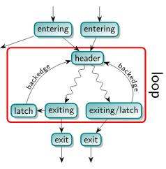

