# 7 静态单赋值（SSA）

本章是系列文章的第七章，终于来到了鼎鼎大名的SSA，SSA是编译器领域最伟大的发明之一，也是影响最广的发明。

7.1 控制流图回顾

对下面的c代码保存成7.1.cc：

1 int max(int a, int b) {

2   int ans = a;

3   if (b > a) {

4     ans = b;

5   }

6   return ans;

7 }

直接用clang生成bc → dot → svg，最终svg的结果如下：

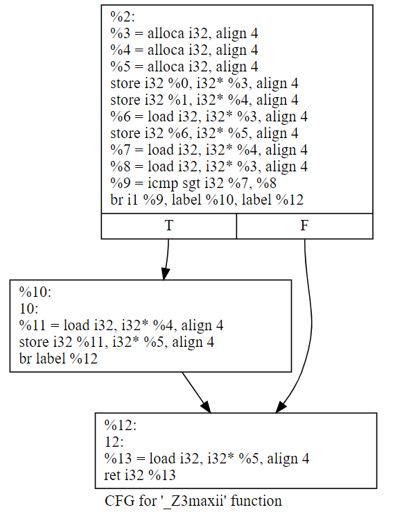

如果经过一轮opt的优化“opt -mem2reg 7.1.ll -o 7.1.1.bc”之后的结果，就变成了这样（注意，需要删除ll里面的optnone属性，否则opt不会生效）：

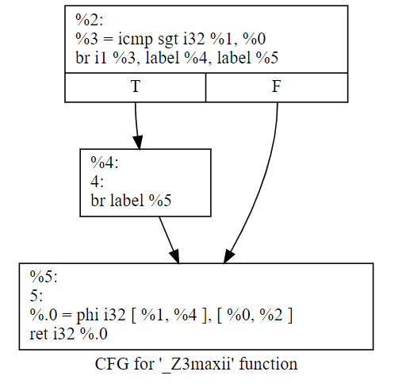

除了我们本来准备跑的mem2reg的pass外，优化前后最后一个BB里是不是还多了一个phi函数？

7.1.1 静态单赋值范式（SSA Form）

静态单赋值，字面意思是对静态的变量只有一次赋值点。这是现在所有编译器都广泛使用的属性，也是编译器历史上最具有突破性意义的属性，简化了各种分析和优化的过程。

1991年SSA的奠基论文被引用打到2800+次，这还是截止2019年的数据，这个引用次数每年还在增加。

几乎每本讲编译器的书都会说到SSA。google学术上用SSA能搜到5000+个结果。

每年来自全世界的编译器专家，都会在SSA研讨会上庆祝一次SSA的诞生。

和静态单赋值对应的是动态单赋值，也就是程序执行过程中，每个变量只能赋值一次。和动态单赋值不同，静态单赋值，只要求每个变量的赋值程序点只能有一个，这个程序点可以出现在循环内部（这意味着动态执行过程中这个程序点会多次执行）。

7.2 从SSA来到SSA去

7.2.1 将线性代码转换成SSA Form

如果一个程序没有任何分叉，则称这个程序是线性代码。

例如下面的代码：

1 double baskhara(double a, double b, double c) {

2   double delta = b * b - 4 * a * c;

3   double sqrDelta = sqrt(delta);

4   double root = (b + sqrDelta) / 2 * a;

5   return root;

6 }

其实它本身就是符合SSA定义的（每个变量只定义一次），但一般经过opt转换之后的代码是这样：

1 define double @baskhara(double %a, double %b, double %c) {

2   %1 = fmul double %b, %b

3   %2 = fmul double 4.000000e+00, %a

4   %3 = fmul double %2, %c

5   %4 = fsub double %1, %3

6   %5 = call double @sqrt(double %4)

7   %6 = fadd double %b, %5

8   %7 = fdiv double %6, 2.000000e+00

9   %8 = fmul double %7, %a

10   ret double %8

11 }

线性代码转换成SSA范式的的算法比较直接：

1 for each variable a:

2     Count[a] = 0

3     Stack[a] = [0]

4 rename_basic_block(B) =

5     for each instruction S in block B:

6         for each use of a variable x in S:

7             i = top(Stack[x])

8             replace the use of x with xi

9         for each variable a that S defines

10             count[a] = Count[a] + 1

11             i = Count[a]

12             push i onto Stack[a]

13             replace definition of a with ai

例如，下面的c代码：

1 a = x + y;

2 b = a - 1;

3 a = y + b;

4 b = 4 * x;

5 a = a + b;

经过SSA转换之后会变成这样：

1 a1 = x0 + y0;

2 b1 = a1 - 1;

3 a2 = y0 + b1;

4 b2 = 4 * x0;

5 a3 = a2 + b2;

7.2.2 Phi函数

前面说了线性代码的SSA转换过程，那非线性代码应该怎么处理呢？

例如下面的控制流图，SSA转换之后L5处使用的b是哪一个b？：

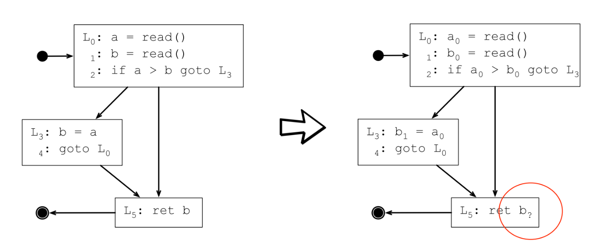

答案是要看情况，如果控制流图上从L4执行到L5，则L5处的b应该是b1；如果是从L2执行到L5，则L5处的b应该是b0。

为了处理这种情况，需要引入phi函数（φ），φ函数会根据路径做选择，根据进入φ函数的路径选择不同的定义。

插入φ函数之后的SSA转换结果如下：

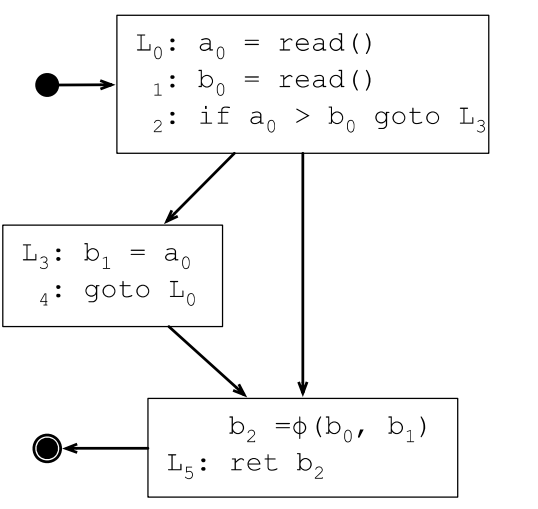

φ函数会插入到每个基本块的最开始地方，对N个变量生成N个φ函数，φ函数的参数个数取决于执行到该基本块的直接前驱有几个。

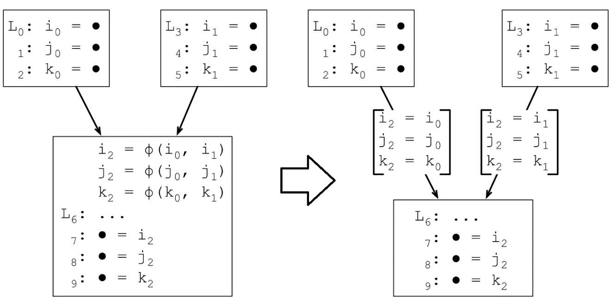

7.2.3 临界边

如果一条边的起始点BB有多个直接后继BB，终止点的BB有多个前驱BB，则称为该边为临界边。

7.2.4 临界边分裂

在临界边上插入一个空的BB（这个BB只有一个简单的goto语句），来解决临界边的上的φ函数自动注入问题。

7.2.5 φ函数的插入策略

存在一个基本块x包含b的定义

存在一个非x的基本块y包含b的定义

存在至少一条路径Pxz从x到z

存在至少一条路径Pyz从y到z

Pyz和Pxz除了z节点外，没有其他公共节点

z不会同时出现在Pxz和Pyz路径中间，但可以出现在其中一条路径的中间

7.2.6 SSA范式的支配属性

在一个有根的有向图中，d支配n的意思是所有从根节点到n的路径都通过d。

在严格SSA范式（严格的意思是所有变量都是在使用前初始化）程序中，每个变量的定义都支配它的使用：

在基本块n中，如果x是φ函数的第i个参数，则x的定义支配n的第3个前驱。

在一个使用x的不存在φ函数的基本块n中，x的定义支配基本块n。

7.2.7 支配前沿（The Dominance Frontier）

一个节点x严格支配节点w，当且仅当x支配w，并且x≠w。

节点x的支配前沿是所有具有下面属性的节点w的集合：x支配w的前驱，但不严格支配w。

支配前沿策略：如果节点x函数变量a的定义，那么x的支配前沿中的任意节点z都需要一个a的φ函数。

支配前沿迭代：因为φ函数本身会产生一个定义，所以需要循环执行支配前沿策略，直到没有节点需要额外增加φ函数。

定理：迭代支配前沿策略和迭代路径覆盖策略生成同样的φ函数集合。

7.2.8 支配前沿的计算

DF[n] = DFlocal[n] ∪ { DFup[c] | c ∈ children[n] }
Where:
DFlocal[n]: 不被n严格支配（SSA的1989年版本要求的是严格支配，但1991年版本优化成直接支配，前一篇在ACM会议上，后一篇在ACM期刊上，Cytron果然是混职级的高手）的n的后继节点
DFup[c]: c的支配前沿集合中不被n严格支配的节点
children[n]: 支配树中n的子结点集合

转换成算法之后的伪代码如下：

1 computeDF[n]:

2 S = {}

3 for each node y in succ[n]

4     if idom(y) ≠ n

5         S = S ∪ {y}

6 for each child c of n in the dom-tree

7     computeDF[c]

8     for each w ∈ DF[c]

9         if n does not dom w, or n = w

10             S = S ∪ {w}

11 DF[n] = S

7.2.9 插入φ函数

插入的算法描述如下：

1 place-phi-functions:

2   for each node n:

3     for each variable a ∈ Aorig[n]:

4       defsites[a] = defsites[a] ∪ [n]

5   for each variable a:

6     W = defsites[a]

7     while W ≠ empty list

8       remove some node n from W

9       for each y in DF[n]:

10       if a ∉ Aphi[y]

11         insert-phi(y, a)

12         Aphi[y] = Aphi[y] ∪ {a}

13         if a ∉ Aorig[y]

14         W = W ∪ {y}

15

16 insert-phi(y, a):

17   insert the statement a = ϕ(a, a, …, a)

18   at the top of block y, where the

19   phi-function has as many arguments

20   as y has predecessors

21 Where:

22 Aorig[n]:  the  set  of  variables  defined  at  node  "n"

23 Aphi[y]:  the  set  of  variables  that  have  phi-functions  at  node  "y"

7.2.10 变量重命名

1 rename(n):

2   rename-basic-block(n)

3   for each successor Y of n, where n is the j-th predecessor of Y:

4     for each phi-function f in Y, where the operand of f is ‘a’

5       i = top(Stack[a])

6       replace j-th operand with ai

7   for each child X of n:

8     rename(X)

9   for each instruction S ∈ n:

10     for each variable v that S defines:

11       pop Stack[v]

rename-basic-block的定义参照之前的，这里只是增加了一些场景。

7.3 跑一下整个流程

7.3.1 伪代码

1 i = 1

2 j = 1

3 k = 0

4 while k < 100

5   if j < 20

6     j = i

7     k = k + 1

8   else

9     j = k

10     k = k + 2

11 return j

7.3.2 生成控制流图

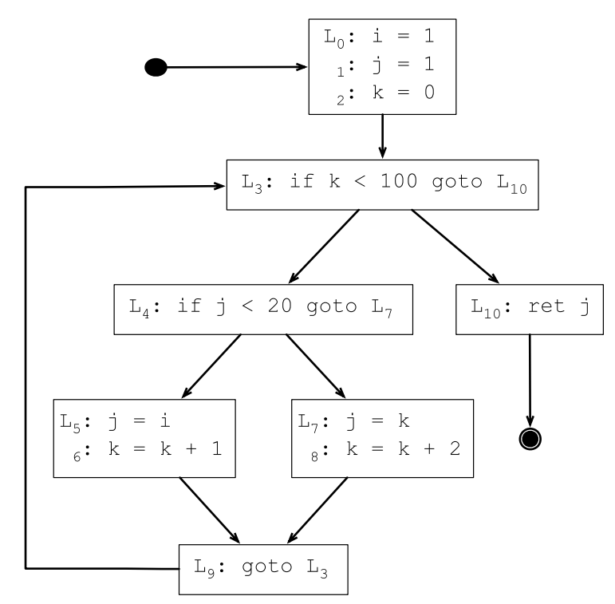

7.3.3 根据控制流图生成支配树

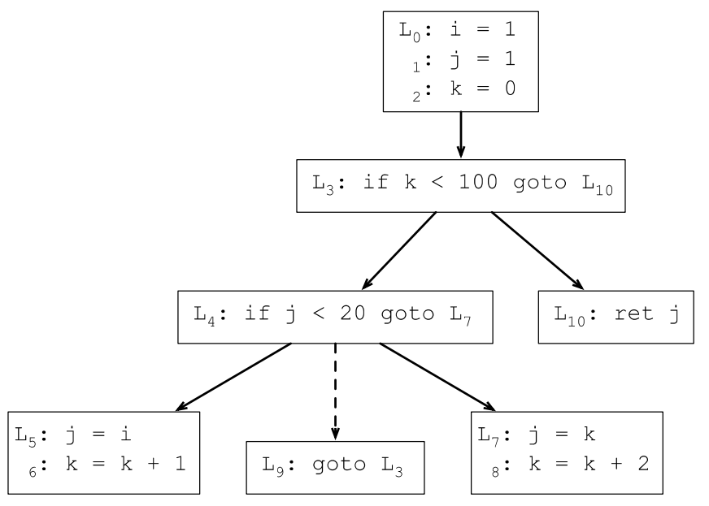

7.3.4 计算支配前沿

一般从支配树的叶子节点开始计算，第一轮计算所有叶子节点：

DF(7) = {9}, DF(9) = {3}, DF(5) = {9}, DF(10) = {}

第二轮去掉支配树的所有叶子节点，计算第二轮叶子节点的支配前沿：

DF(4) = {3}

第三轮删掉叶子节点，并计算当前叶子节点的支配前沿：

DF(3) = {3}

第四轮删掉叶子节点，并计算当前叶子节点的支配前沿：

DF(0) = {}

7.3.5 插入φ函数

上一节求出来的DF集合其实只有2个元素，所以只需要在L3和L9的基本块开始处插入φ函数，存在多种定义的变量只有j和k，所以下面在L3和L9插入j和k的φ函数：

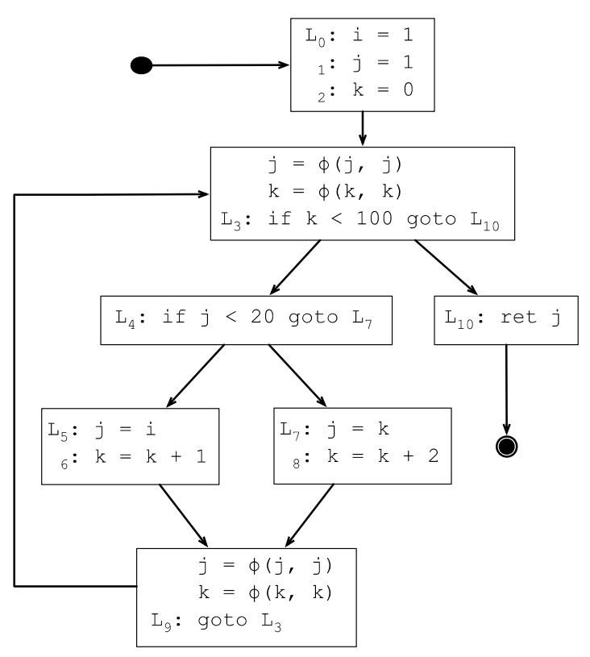

7.3.6 φ函数的参数个数

是否存在只有一个前驱的φ函数？如果只有一个前驱，那说明变量只有一个定义，自然就不需要φ函数。

是否存在参数多余2个的φ函数？如果前驱个数大于2，自然就会出现参数多余2的φ函数。

7.3.7 变量重命名

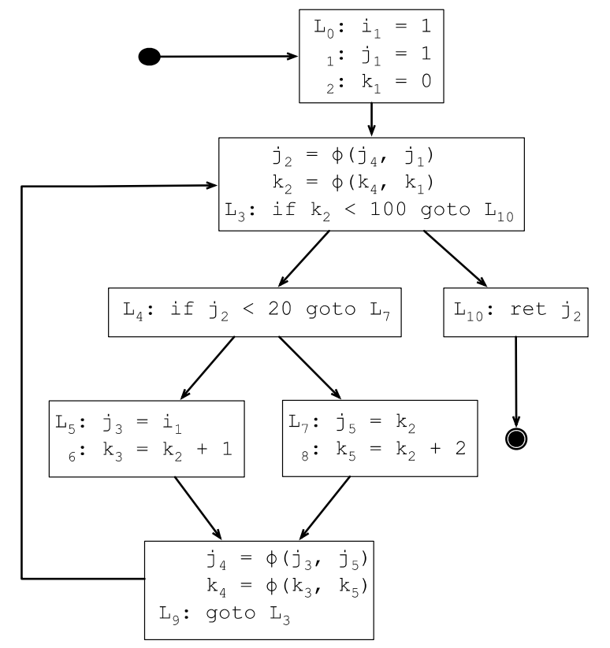

7.3.8 优化SSA范式

上面生成的SSA范式，从SSA的定义上看虽然已经是最简的了，但可能存在一些用不上的变量定义，砍掉这些冗余的定义是生命周期检查的工作，经过生命周期检查，仅在变量i还处在生命周期范围内的程序点才需要插入i的φ函数。

下面L1处的i的定义后面没机会使用了，所以L1处的φ函数插入是不必要的：

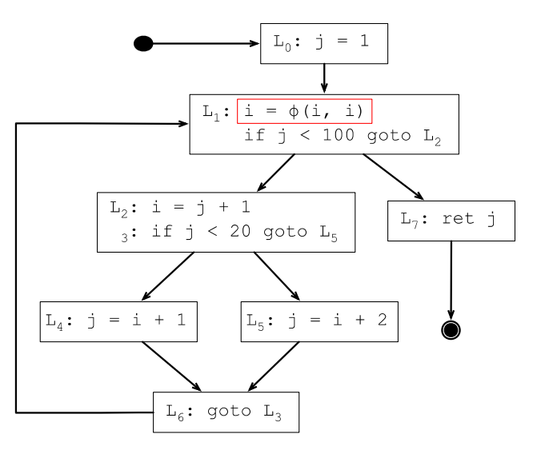

7.4 使用SSA简化分析

SSA范式可以用来简化各种基于数据流的分析。SSA范式之前，数据流分析的某个变量的定义是一个集合，SSA范式转换之后这些变量都变成了唯一定义；而且由于每个变量只有一次定义，相当于说每个变量都可以转换成常量（循环内定义的变量除外，每次循环迭代，变量都会被重新定义）。

7.4.1 简化冗余代码删除

如果一个变量定义了，没有使用，并且该定义的语句也没有其他副作用，可以将该变量定义的语句删除。（SSA之前变量是否被使用的含义就要复杂多了，因为会有多个版本的变量定义）

给每个SSA转换之后的每个变量保存一个计数器，初始化为0。遍历一遍代码，每次使用就将计数器加一，遍历完如果某个变量的使用计数器为0，则可以删除变量的定义语句。

7.4.2 简化常量传播

因为每个变量的定义都只有一个定义，所以在变量定义时就能判断变量是常量，还是真的变量。如果变量的定义依赖某个外部输入，则它不是常量。如果变量的定义依赖的是一个常量，或者依赖的变量是一个常量，则常量可以一直传播下去，所有类似的变量都能转换成常量。直到明确所有变量都是依赖某个外部输入。

如果碰到φ函数怎么办？因为φ函数会给变量的赋值增加多种可能性，所以变量的定义变成了一个集合，只有当集合中所有定义都是常量的情况下，才能将该变量转换成常量。

下面是llvm的常量传播的实现：

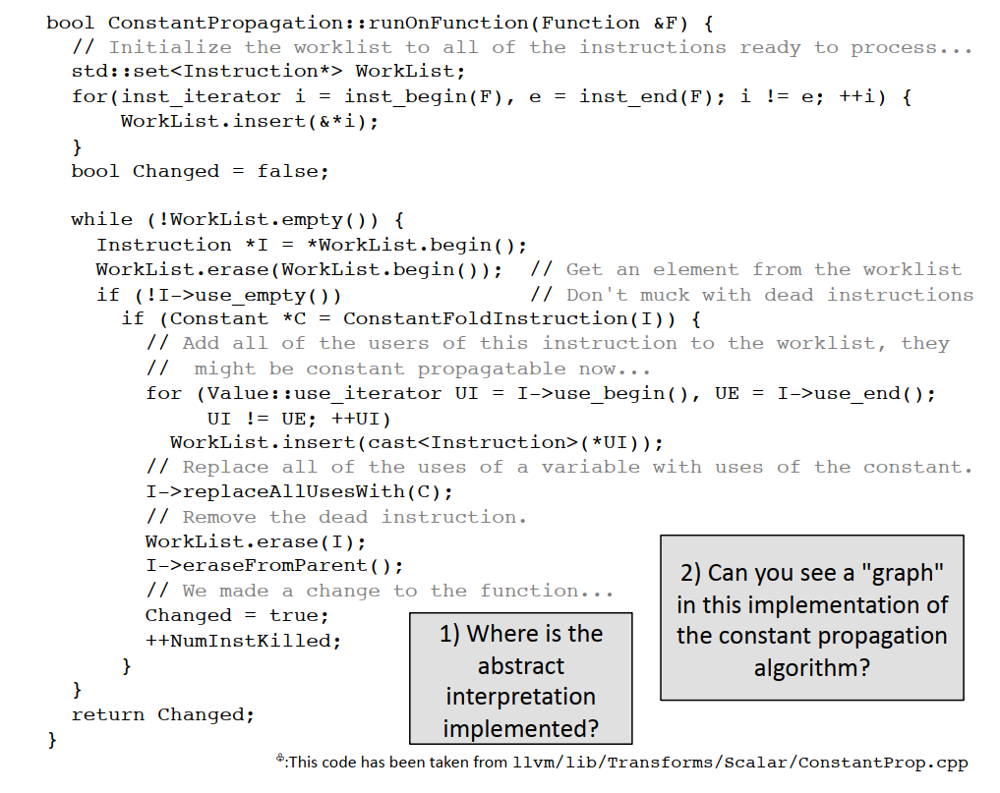

7.4.3 SSA范式转换之后的生命周期分析

新的生命周期分析算法如下：

1 For each statement S in the program:

2   IN[S] = OUT[S] = {}

3 For each variable v in the program:

4   For each statement S that uses v:

5     live(S, v)

6 live(S, v):

7   IN[S] = IN[S] ∪ {v}

8   For each P in pred(S):

9     OUT[P] = OUT[P] ∪ {v}

10     if P does not define v

11       live(P, v)

7.5 SSA简史

“An Efficient Method of Computing Static Single Assignment Form,” appeared in the conference Record of the 16th ACM Symposium on principles of Programming Languages (Jan. 1989). https://c9x.me/compile/bib/ssa.pdf Cython因为SSA发了2篇ACM，在国内也绝对是升职高手😊

Efficiently Computing Static Single Assignment Form and the Control Dependence Graph, ACM Transactions on Programming Languages and Systems, VO1 13, NO 4, October, le91, Pages 451.490. Efficiently computing static single assignment form and the control dependence graph (utexas.edu).

Lengauer, T. and Tarjan, R. "A Fast Algorithm for Finding Dominators in a Flowgraph", TOPLAS, 1:1 (1979) pp 121-141.

Briggs, P. and Cooper, K. and Harvey, J. and Simpson, L. "Practical Improvements to the Construction and Destruction of Static Single Assignment Form", SP&E (28:8), (1998) pp 859-881.

7.6 LLVM的SSA实现

7.6.1 LLVM中的MemorySSA

LLVM中的MemorySSA提供了一个接口，用于构建/使用内存SSA（静态单赋值形式），以便通过使用/定义图来遍历内存指令。

MemorySSA类构建了一种SSA形式，将诸如加载（loads）、存储（stores）、原子操作（atomics）和调用（calls）等内存访问指令相互关联。此外，它进行了一种简单的“堆版本控制”。每当程序中的内存状态发生变化时，我们都会生成一个新的堆版本。它生成的MemoryDef/Uses/Phis会叠加在现有指令之上。

假定原来的IR是这样的：

LLVM IR

| 1 | define i32 @main() #0 { |
| --- | --- |
| 2 | entry: |
| 3 | %call = call noalias i8* @_Znwm(i64 4) #2 |
| 4 | %0 = bitcast i8* %call to i32* |
| 5 | %call1 = call noalias i8* @_Znwm(i64 4) #2 |
| 6 | %1 = bitcast i8* %call1 to i32* |
| 7 | store i32 5, i32* %0, align 4 |
| 8 | store i32 7, i32* %1, align 4 |
| 9 | %2 = load i32* %0, align 4 |
| 10 | %3 = load i32* %1, align 4 |
| 11 | %add = add nsw i32 %2, %3 |
| 12 | ret i32 %add |
| 13 | } |

经过MemorySSA处理过之后，会加上一堆MemoryDef和MemoryUse。

LLVM IR

| 1 | define i32 @main() #0 { |
| --- | --- |
| 2 | entry: |
| 3 | ; 1 = MemoryDef(0) |
| 4 | %call = call noalias i8* @_Znwm(i64 4) #3 |
| 5 | %2 = bitcast i8* %call to i32* |
| 6 | ; 2 = MemoryDef(1) |
| 7 | %call1 = call noalias i8* @_Znwm(i64 4) #3 |
| 8 | %4 = bitcast i8* %call1 to i32* |
| 9 | ; 3 = MemoryDef(2) |
| 10 | store i32 5, i32* %2, align 4 |
| 11 | ; 4 = MemoryDef(3) |
| 12 | store i32 7, i32* %4, align 4 |
| 13 | ; MemoryUse(3) |
| 14 | %7 = load i32* %2, align 4 |
| 15 | ; MemoryUse(4) |
| 16 | %8 = load i32* %4, align 4 |
| 17 | %add = add nsw i32 %7, %8 |
| 18 | ret i32 %add |
| 19 | } |

通过这个例子，我们可以总结出内存申请（new或者malloc）和修改是MemoryDef，内存的加载并不会产生新的对象，所以会当做MemoryUse处理。

内存加载到寄存器之后，代码对寄存器的读写操作是不是MemorySSA该处理的代码？答案是普通寄存器的读写在LLVM IR里面天然就是SSA化的，所以不用额外处理了。

llvm\lib\Analysis\MemorySSA.cpp

| 60 | /// 调试类型定义 |
| --- | --- |
| 61 | #define DEBUG_TYPE "memoryssa" |
| 62 | /// PASS注册 |
| 63 | INITIALIZE_PASS_BEGIN(MemorySSAWrapperPass, "memoryssa", "Memory SSA", false, |
| 64 | true) |
| 65 | INITIALIZE_PASS_DEPENDENCY(DominatorTreeWrapperPass) |
| 66 | INITIALIZE_PASS_DEPENDENCY(AAResultsWrapperPass) |
| 67 | INITIALIZE_PASS_END(MemorySSAWrapperPass, "memoryssa", "Memory SSA", false, |
| 68 | true) |
| 69 | INITIALIZE_PASS_BEGIN(MemorySSAPrinterLegacyPass, "print-memoryssa", |
| 70 | "Memory SSA Printer", false, false) |
| 71 | INITIALIZE_PASS_DEPENDENCY(MemorySSAWrapperPass) |
| 72 | INITIALIZE_PASS_END(MemorySSAPrinterLegacyPass, "print-memoryssa", |
| 73 | "Memory SSA Printer", false, false) |
| 74 | /// 定义一个命令行选项，用于设置MemorySSA在进行分析时尝试走过的存储/Phi |
| 75 | /// 节点的最大数量。这个选项是隐藏的，并且默认值为100。 |
| 76 | static cl::opt<unsigned> MaxCheckLimit( |
| 77 | "memssa-check-limit", cl::Hidden, cl::init(100), |
| 78 | cl::desc("The maximum number of stores/phis MemorySSA" |
| 79 | "will consider trying to walk past (default = 100)")); |
| 80 | // 如果启用了昂贵的检查，则始终验证MemorySSA。 |
| 81 | // Always verify MemorySSA if expensive checking is enabled. |
| 82 | #ifdef EXPENSIVE_CHECKS |
| 83 | // 如果定义了EXPENSIVE_CHECKS，则启用MemorySSA的验证 |
| 84 | bool llvm::VerifyMemorySSA = true; |
| 85 | #else |
| 86 | // 否则，不启用MemorySSA的验证 |
| 87 | bool llvm::VerifyMemorySSA = false; |
| 88 | #endif |
| 89 | /// 定义一个命令行选项，用于在旧版pass管理器中为循环pass启用MemorySSA依赖。 |
| 90 | /// Enables memory ssa as a dependency for loop passes in legacy pass manager. |
| 91 | cl::opt<bool> llvm::EnableMSSALoopDependency( |
| 92 | "enable-mssa-loop-dependency", cl::Hidden, cl::init(true), |
| 93 | cl::desc("Enable MemorySSA dependency for loop pass manager")); |
| 94 | /// 定义一个命令行选项，用于启用MemorySSA的验证。 |
| 95 | /// 这个选项使用了静态变量VerifyMemorySSA的位置。 |
| 96 | static cl::opt<bool, true> |
| 97 | VerifyMemorySSAX("verify-memoryssa", cl::location(VerifyMemorySSA), |
| 98 | cl::Hidden, cl::desc("Enable verification of MemorySSA.")); |
| 99 | namespace llvm { |
| 100 | /// 定义一个用于在注释中打印Memory SSA信息的汇编注释器类。 |
| 101 | /// An assembly annotator class to print Memory SSA information in |
| 102 | /// comments. |
| 103 | class MemorySSAAnnotatedWriter : public AssemblyAnnotationWriter { |
| 104 | // MemorySSA类是这个注释器类的朋友，可以访问私有成员 |
| 105 | friend class MemorySSA; |
| 106 | // 指向MemorySSA对象的指针 |
| 107 | const MemorySSA *MSSA; |
| 108 | public: |
| 109 | // 构造函数，初始化MemorySSA指针 |
| 110 | MemorySSAAnnotatedWriter(const MemorySSA *M) : MSSA(M) {} |
| 111 | // 重写基类方法，用于在基本块开始时添加注释 |
| 112 | void emitBasicBlockStartAnnot(const BasicBlock *BB, |
| 113 | formatted_raw_ostream &OS) override { |
| 114 | // 如果基本块有关联的内存访问，则打印它 |
| 115 | if (MemoryAccess *MA = MSSA->getMemoryAccess(BB)) |
| 116 | OS << "; " << *MA << "\n"; |
| 117 | } |
| 118 | // 重写基类方法，用于在指令上添加注释 |
| 119 | void emitInstructionAnnot(const Instruction *I, |
| 120 | formatted_raw_ostream &OS) override { |
| 121 | // 如果指令有关联的内存访问，则打印它 |
| 122 | if (MemoryAccess *MA = MSSA->getMemoryAccess(I)) |
| 123 | OS << "; " << *MA << "\n"; |
| 124 | } |
| 125 | }; |
| 126 | } // end namespace llvm |
| 127 | // 匿名命名空间，用于定义一些只在当前文件中使用的类和函数。 |
| 128 | namespace { |
| 129 | /// MemoryLocOrCall 类用于区分内存位置（MemoryLocation）和函数调用（CallBase）。 |
| 130 | /// 这个类简化了那些需要“影响内存的指令和相关数据”作为键的代码。 |
| 131 | /// 例如，这个类被用作 use optimizer 中的 densemap 键。 |
| 132 | /// Our current alias analysis API differentiates heavily between calls and |
| 133 | /// non-calls, and functions called on one usually assert on the other. |
| 134 | /// This class encapsulates the distinction to simplify other code that wants |
| 135 | /// "Memory affecting instructions and related data" to use as a key. |
| 136 | /// For example, this class is used as a densemap key in the use optimizer. |
| 137 | class MemoryLocOrCall { |
| 138 | public: |
| 139 | bool IsCall = false; |
| 140 | // 构造函数，从 MemoryUseOrDef 对象创建 MemoryLocOrCall |
| 141 | MemoryLocOrCall(MemoryUseOrDef *MUD) |
| 142 | : MemoryLocOrCall(MUD->getMemoryInst()) {} |
| 143 | MemoryLocOrCall(const MemoryUseOrDef *MUD) |
| 144 | : MemoryLocOrCall(MUD->getMemoryInst()) {} |
| 145 | // 构造函数，从指令创建 MemoryLocOrCall |
| 146 | MemoryLocOrCall(Instruction *Inst) { |
| 147 | if (auto *C = dyn_cast<CallBase>(Inst)) { |
| 148 | IsCall = true; |
| 149 | Call = C; |
| 150 | } else { |
| 151 | IsCall = false; |
| 152 | // There is no such thing as a memorylocation for a fence inst, and it is |
| 153 | // unique in that regard. |
| 154 | if (!isa<FenceInst>(Inst)) |
| 155 | Loc = MemoryLocation::get(Inst); |
| 156 | } |
| 157 | } |
| 158 | // 从 MemoryLocation 创建 MemoryLocOrCall。这里加explicit， |
| 159 | // 主要是为了避免入参是别的类型的时候，被编译器自动插入了 |
| 160 | // MemoryLocation的构造函数。 |
| 161 | explicit MemoryLocOrCall(const MemoryLocation &Loc) : Loc(Loc) {} |
| 162 | // 获取调用信息 |
| 163 | const CallBase *getCall() const { |
| 164 | assert(IsCall); |
| 165 | return Call; |
| 166 | } |
| 167 | // 获取内存位置 |
| 168 | MemoryLocation getLoc() const { |
| 169 | assert(!IsCall); |
| 170 | return Loc; |
| 171 | } |
| 172 | // 比较两个 MemoryLocOrCall 对象是否相等 |
| 173 | bool operator==(const MemoryLocOrCall &Other) const { |
| 174 | if (IsCall != Other.IsCall) |
| 175 | return false; |
| 176 | if (!IsCall) |
| 177 | return Loc == Other.Loc; |
| 178 | if (Call->getCalledOperand() != Other.Call->getCalledOperand()) |
| 179 | return false; |
| 180 | return Call->arg_size() == Other.Call->arg_size() && |
| 181 | std::equal(Call->arg_begin(), Call->arg_end(), |
| 182 | Other.Call->arg_begin()); |
| 183 | } |
| 184 | private: |
| 185 | union { |
| 186 | const CallBase *Call; // 函数调用 |
| 187 | MemoryLocation Loc; // 内存位置 |
| 188 | }; |
| 189 | }; |
| 190 | } // end anonymous namespace |
| 191 | // 定义 DenseMapInfo 特化，用于 MemoryLocOrCall 类型的键 |
| 192 | namespace llvm { |
| 193 | template <> struct DenseMapInfo<MemoryLocOrCall> { |
| 194 | static inline MemoryLocOrCall getEmptyKey() { |
| 195 | return MemoryLocOrCall(DenseMapInfo<MemoryLocation>::getEmptyKey()); |
| 196 | } |
| 197 | static inline MemoryLocOrCall getTombstoneKey() { |
| 198 | return MemoryLocOrCall(DenseMapInfo<MemoryLocation>::getTombstoneKey()); |
| 199 | } |
| 200 | static unsigned getHashValue(const MemoryLocOrCall &MLOC) { |
| 201 | if (!MLOC.IsCall) |
| 202 | return hash_combine( |
| 203 | MLOC.IsCall, |
| 204 | DenseMapInfo<MemoryLocation>::getHashValue(MLOC.getLoc())); |
| 205 | hash_code hash = |
| 206 | hash_combine(MLOC.IsCall, DenseMapInfo<const Value *>::getHashValue( |
| 207 | MLOC.getCall()->getCalledOperand())); |
| 208 | for (const Value *Arg : MLOC.getCall()->args()) |
| 209 | hash = hash_combine(hash, DenseMapInfo<const Value *>::getHashValue(Arg)); |
| 210 | return hash; |
| 211 | } |
| 212 | static bool isEqual(const MemoryLocOrCall &LHS, const MemoryLocOrCall &RHS) { |
| 213 | return LHS == RHS; |
| 214 | } |
| 215 | }; |
| 216 | } // end namespace llvm |
| 217 | /// 检查是否可以将 Use 提升到 MayClobber 之上。 |
| 218 | /// 这个函数只进行单向检查，不会反过来检查。 |
| 219 | /// 这个函数假设，对于 MemorySSA 的目的，Use 直接跟在 MayClobber 后面， |
| 220 | /// 它们之间没有可能篡改内存的操作。 |
| 221 | /// （可能篡改内存的操作包括内存屏障、别名存储等。） |
| 222 | /// This does one-way checks to see if Use could theoretically be hoisted above |
| 223 | /// MayClobber. This will not check the other way around. |
| 224 | /// |
| 225 | /// This assumes that, for the purposes of MemorySSA, Use comes directly after |
| 226 | /// MayClobber, with no potentially clobbering operations in between them. |
| 227 | /// (Where potentially clobbering ops are memory barriers, aliased stores, etc.) |
| 228 | static bool areLoadsReorderable(const LoadInst *Use, |
| 229 | const LoadInst *MayClobber) { |
| 230 | bool VolatileUse = Use->isVolatile(); // 检查 Use 是否是 volatile 操作 |
| 231 | bool VolatileClobber = MayClobber->isVolatile(); |
| 232 | // 如果两个操作都是 volatile，则它们不能被重新排序。 |
| 233 | // Volatile operations may never be reordered with other volatile operations. |
| 234 | if (VolatileUse && VolatileClobber) |
| 235 | return false; |
| 236 | // 否则，volatile 属性在此并不重要。根据语言规范： |
| 237 | // 'optimizers may change the order of volatile operations relative to |
| 238 | // non-volatile operations.' |
| 239 | // 即优化器可以改变 volatile 操作与非 volatile 操作的顺序。 |
| 240 | // Otherwise, volatile doesn't matter here. From the language reference: |
| 241 | // 'optimizers may change the order of volatile operations relative to |
| 242 | // non-volatile operations.'" |
| 243 | // 如果一个加载操作是 seq_cst（顺序一致）的，它不能被移动到其他加载操作之上。 |
| 244 | // 如果它的顺序更弱，它可以被移动到其他加载操作之上。 |
| 245 | // 我们需要确保 MayClobber 不是一个 acquire（获取）加载，因为加载不能被移动到 |
| 246 | // acquire 加载之上。 |
| 247 | // 注意，这明确 *允许* 相同地址的单调（或更弱）加载操作的自由重新排序。 |
| 248 | // If a load is seq_cst, it cannot be moved above other loads. If its ordering |
| 249 | // is weaker, it can be moved above other loads. We just need to be sure that |
| 250 | // MayClobber isn't an acquire load, because loads can't be moved above |
| 251 | // acquire loads. |
| 252 | // |
| 253 | // Note that this explicitly *does* allow the free reordering of monotonic (or |
| 254 | // weaker) loads of the same address. |
| 255 | // 检查 Use 是否是顺序一致的加载 |
| 256 | bool SeqCstUse = Use->getOrdering() == AtomicOrdering::SequentiallyConsistent; |
| 257 | // 检查 MayClobber 是否至少是 acquire 顺序 |
| 258 | bool MayClobberIsAcquire = isAtLeastOrStrongerThan(MayClobber->getOrdering(), |
| 259 | AtomicOrdering::Acquire); |
| 260 | // 如果 Use 是顺序一致的或者 MayClobber 是 acquire 的，则不允许重新排序 |
| 261 | return !(SeqCstUse || MayClobberIsAcquire); |
| 262 | } |
| 263 | namespace { |
| 264 | // ClobberAlias 结构体用于表示一个指令是否覆盖另一个指令的别名信息。 |
| 265 | struct ClobberAlias { |
| 266 | bool IsClobber; // 布尔值，表示是否发生了覆盖 |
| 267 | Optional<AliasResult> AR; // 可选的 AliasResult，存储别名关系的详细信息 |
| 268 | }; |
| 269 | } // end anonymous namespace |
| 270 | // 模板函数，用于查询一个内存定义是否覆盖了另一个指令的内存位置。 |
| 271 | // AliasAnalysisType 参数化类型，表示别名分析的类型。 |
| 272 | // Return a pair of {IsClobber (bool), AR (AliasResult)}. It relies on AR being |
| 273 | // ignored if IsClobber = false. |
| 274 | template <typename AliasAnalysisType> |
| 275 | static ClobberAlias |
| 276 | instructionClobbersQuery(const MemoryDef *MD, const MemoryLocation &UseLoc, |
| 277 | const Instruction *UseInst, AliasAnalysisType &AA) { |
| 278 | // 获取定义内存的指令 |
| 279 | Instruction *DefInst = MD->getMemoryInst(); |
| 280 | // 断言获取的指令非空 |
| 281 | assert(DefInst && "Defining instruction not actually an instruction"); |
| 282 | // 尝试将使用指令转换为函数调用 |
| 283 | const auto *UseCall = dyn_cast<CallBase>(UseInst); |
| 284 | Optional<AliasResult> AR; // 可选的别名结果 |
| 285 | if (const IntrinsicInst *II = dyn_cast<IntrinsicInst>(DefInst)) { |
| 286 | // 这些内联汇编指令虽然会影响内存，但它们主要是作为标记使用的 |
| 287 | // FIXME: 我们可能根本不希望 MemorySSA 模型包含这些（包括为它们创建 MemoryAccesses）： |
| 288 | // 我们最终只是在发明不存在的覆盖。有关详细信息，请参见 D43269。 |
| 289 | // These intrinsics will show up as affecting memory, but they are just |
| 290 | // markers, mostly. |
| 291 | // |
| 292 | // FIXME: We probably don't actually want MemorySSA to model these at all |
| 293 | // (including creating MemoryAccesses for them): we just end up inventing |
| 294 | // clobbers where they don't really exist at all. Please see D43269 for |
| 295 | // context. |
| 296 | switch (II->getIntrinsicID()) { |
| 297 | case Intrinsic::lifetime_start: // 内存生命周期开始 |
| 298 | if (UseCall) |
| 299 | return {false, NoAlias}; // 如果使用指令是函数调用，则不覆盖 |
| 300 | AR = AA.alias(MemoryLocation(II->getArgOperand(1)), UseLoc); // 别名分析 |
| 301 | return {AR != NoAlias, AR}; // 返回是否覆盖及别名结果 |
| 302 | case Intrinsic::lifetime_end: // 内存生命周期结束 |
| 303 | case Intrinsic::invariant_start: // 内存不变开始 |
| 304 | case Intrinsic::invariant_end: // 内存不变结束 |
| 305 | case Intrinsic::assume: // 假设 |
| 306 | return {false, NoAlias}; // 这些内联汇编指令不覆盖 |
| 307 | case Intrinsic::dbg_addr: // 调试地址 |
| 308 | case Intrinsic::dbg_declare: // 调试声明 |
| 309 | case Intrinsic::dbg_label: // 调试标签 |
| 310 | case Intrinsic::dbg_value: // 调试值 |
| 311 | // 调试信息不应该有关联的定义 |
| 312 | llvm_unreachable("debuginfo shouldn't have associated defs!"); |
| 313 | default: |
| 314 | break; // 默认情况，不处理 |
| 315 | } |
| 316 | } |
| 317 | // 如果使用指令是函数调用 |
| 318 | if (UseCall) { |
| 319 | ModRefInfo I = AA.getModRefInfo(DefInst, UseCall); // 获取修改和引用信息 |
| 320 | AR = isMustSet(I) ? MustAlias : MayAlias; // 根据修改和引用信息设置别名结果 |
| 321 | return {isModOrRefSet(I), AR}; // 返回是否覆盖及别名结果 |
| 322 | } |
| 323 | // 如果定义指令和使用指令都是加载指令 |
| 324 | if (auto *DefLoad = dyn_cast<LoadInst>(DefInst)) |
| 325 | if (auto *UseLoad = dyn_cast<LoadInst>(UseInst)) |
| 326 | // 如果加载指令不能重新排序，则它们相互覆盖 |
| 327 | return {!areLoadsReorderable(UseLoad, DefLoad), MayAlias}; |
| 328 | // 获取定义指令对使用位置的修改和引用信息 |
| 329 | ModRefInfo I = AA.getModRefInfo(DefInst, UseLoc); |
| 330 | AR = isMustSet(I) ? MustAlias : MayAlias; // 根据修改和引用信息设置别名结果 |
| 331 | return {isModSet(I), AR}; // 返回是否覆盖及别名结果 |
| 332 | } |
| 333 | // 模板函数，用于查询一个内存定义是否覆盖了另一个内存使用或定义的内存位置。 |
| 334 | // AliasAnalysisType 参数化类型，表示别名分析的类型。 |
| 335 | template <typename AliasAnalysisType> |
| 336 | static ClobberAlias instructionClobbersQuery(MemoryDef *MD,  // 指向内存定义的指针 |
| 337 | // 指向内存使用或定义的指针 |
| 338 | const MemoryUseOrDef *MU, |
| 339 | // 包含内存位置或函数调用信息的对象 |
| 340 | const MemoryLocOrCall &UseMLOC, |
| 341 | AliasAnalysisType &AA) { // 别名分析对象的引用 |
| 342 | // FIXME: 这是一个临时解决方案，允许在推动 MemoryLocOrCall 到不同地方时存在单一的 |
| 343 | // instructionClobbersQuery 函数。 |
| 344 | // FIXME: This is a temporary hack to allow a single instructionClobbersQuery |
| 345 | // to exist while MemoryLocOrCall is pushed through places. |
| 346 | if (UseMLOC.IsCall) |
| 347 | // 如果 UseMLOC 表示一个函数调用，则调用不带 MemoryLocation 参数的 |
| 348 | // instructionClobbersQuery 函数。 |
| 349 | return instructionClobbersQuery(MD, MemoryLocation(), MU->getMemoryInst(), |
| 350 | AA); |
| 351 | // 否则，调用带 MemoryLocation 参数的 instructionClobbersQuery 函数。 |
| 352 | return instructionClobbersQuery(MD, UseMLOC.getLoc(), MU->getMemoryInst(), |
| 353 | AA); |
| 354 | } |
| 355 | // 当 MD 可能与 MU 别名时返回 true，否则返回 false。 |
| 356 | // 这个函数用于检查一个内存定义（MD）是否可能覆盖 |
| 357 | //（即与）一个内存使用或定义（MU）相同的内存位置。 |
| 358 | // Return true when MD may alias MU, return false otherwise. |
| 359 | bool MemorySSAUtil::defClobbersUseOrDef(MemoryDef *MD, // 指向内存定义的指针 |
| 360 | const MemoryUseOrDef *MU, // 指向内存使用或定义的指针 |
| 361 | AliasAnalysis &AA // 别名分析对象的引用 |
| 362 | ) { |
| 363 | // 使用 instructionClobbersQuery 函数来查询 MD 是否覆盖 MU。 |
| 364 | // 这里将 MU 包装为 MemoryLocOrCall 对象，然后传递给 instructionClobbersQuery 函数。 |
| 365 | // instructionClobbersQuery 函数返回一个 ClobberAlias 结构体，我们只关心 IsClobber 字段， |
| 366 | // 它表示是否发生了覆盖。 |
| 367 | return instructionClobbersQuery(MD, MU, MemoryLocOrCall(MU), AA).IsClobber; |
| 368 | } |
| 369 | namespace { |
| 370 | // UpwardsMemoryQuery 结构体用于在内存SSA分析中向上查询内存访问信息。 |
| 371 | struct UpwardsMemoryQuery { |
| 372 | // 如果原始查询是针对函数调用开始的，则为 true。 |
| 373 | // True if our original query started off as a call |
| 374 | bool IsCall = false; |
| 375 | // 我们开始查询时使用的指针位置。如果 IsCall 为 true，则该值为空。 |
| 376 | // The pointer location we started the query with. This will be empty if |
| 377 | // IsCall is true. |
| 378 | MemoryLocation StartingLoc; |
| 379 | // 这是我们进行查询的指令。 |
| 380 | // This is the instruction we were querying about. |
| 381 | const Instruction *Inst = nullptr; |
| 382 | // 这是实际调用时使用的 MemoryAccess，用于测试局部支配关系。 |
| 383 | // The MemoryAccess we actually got called with, used to test local domination |
| 384 | const MemoryAccess *OriginalAccess = nullptr; |
| 385 | // 可选的别名结果，默认为 MayAlias，表示可能别名。 |
| 386 | Optional<AliasResult> AR = MayAlias; |
| 387 | // 是否跳过自身访问的标记。 |
| 388 | bool SkipSelfAccess = false; |
| 389 | // 默认构造函数。 |
| 390 | UpwardsMemoryQuery() = default; |
| 391 | // 构造函数，接受一个指令和一个内存访问对象。 |
| 392 | UpwardsMemoryQuery(const Instruction *Inst, const MemoryAccess *Access) |
| 393 | : IsCall(isa<CallBase>(Inst)), Inst(Inst), OriginalAccess(Access) { |
| 394 | if (!IsCall) |
| 395 | StartingLoc = MemoryLocation::get(Inst); |
| 396 | } |
| 397 | }; |
| 398 | } // end anonymous namespace |
| 399 | // 静态函数，用于检查给定的内存定义（MD）是否表示特定内存位置（Loc）的生命周期结束。 |
| 400 | static bool lifetimeEndsAt(MemoryDef *MD, const MemoryLocation &Loc, |
| 401 | BatchAAResults &AA) { |
| 402 | // 获取内存定义关联的指令。 |
| 403 | Instruction *Inst = MD->getMemoryInst(); |
| 404 | // 尝试将指令转换为内联汇编指令（IntrinsicInst）。 |
| 405 | if (IntrinsicInst *II = dyn_cast<IntrinsicInst>(Inst)) { |
| 406 | // 根据内联汇编指令的ID进行判断。 |
| 407 | switch (II->getIntrinsicID()) { |
| 408 | case Intrinsic::lifetime_end: |
| 409 | // 使用别名分析（AA）来检查 lifetime.end 指令的参数（通常是指向内存的指针） |
| 410 | // 和给定的内存位置（Loc）是否别名。 |
| 411 | // 如果是 MustAlias，表示它们指向相同的内存位置，即生命周期在此结束。 |
| 412 | return AA.alias(MemoryLocation(II->getArgOperand(1)), Loc) == MustAlias; |
| 413 | default: // 对于其他类型的内联汇编指令，返回 false。 |
| 414 | return false; |
| 415 | } |
| 416 | } |
| 417 | // 如果指令不是内联汇编指令，也返回 false。 |
| 418 | return false; |
| 419 | } |
| 420 | // 模板函数，用于检查给定的指令是否可以简单地优化为“live on entry”。 |
| 421 | // “live on entry”直译是在该函数内存活的意思，也就是生命周期从函数开始到函数结束。 |
| 422 | // 在 LLVM 编译器框架中，"LiveOnEntry"（LOE）是一个内存SSA（Static Single |
| 423 | // Assignment）的概念，用于描述某些内存定义在函数的开始就已经存在，而不是在函数内 |
| 424 | // 部的某个点被定义。这意味着这些内存位置在函数开始执行时就已经被初始化，且在函 |
| 425 | // 数的整个执行过程中不会被修改。 |
| 426 | // ### LiveOnEntry 的特点： |
| 427 | // |
| 428 | // 1. **全局和静态变量**：通常，全局变量和静态变量在程序的生命周期内保持存在，它们 |
| 429 | // 的值在函数开始执行时就已经确定，因此它们通常被认为是 LiveOnEntry。 |
| 430 | // |
| 431 | // 2. **常量内存**：如果一个内存位置始终指向一个常量值，那么这个内存位置也可以被认 |
| 432 | // 为是 LiveOnEntry。这是因为常量值在程序执行期间不会改变。 |
| 433 | // |
| 434 | // 3. **函数参数**：函数的参数也可以被视为 LiveOnEntry，因为它们在函数调用时就已经 |
| 435 | // 被传递进来，且在函数的整个执行过程中，它们的值不会被修改（除非函数内部有显式的 |
| 436 | // 修改操作）。 |
| 437 | // |
| 438 | // 4. **不变性**：在 LLVM 中，如果一个加载指令被标记为 `invariant.load`，这意味着该 |
| 439 | // 加载操作加载的内存位置在当前函数的执行过程中不会改变。这样的加载指令可以被认为 |
| 440 | // 是 LiveOnEntry。 |
| 441 | // |
| 442 | // ### LiveOnEntry 的优化： |
| 443 | // |
| 444 | // - **指令重排**：由于 LiveOnEntry 的内存定义在函数开始时就已经存在，编译器可以更自 |
| 445 | // 由地重新安排这些内存定义相关的指令，以优化代码的执行顺序，提高性能。 |
| 446 | // - **消除冗余操作**：如果一个指令的结果在函数的整个执行过程中都不会改变，编译器可 |
| 447 | // 以消除对该内存位置的重复读写操作，减少不必要的计算和内存访问。 |
| 448 | // - **内存优化**：LiveOnEntry 的信息可以帮助编译器更好地理解程序的内存使用模式，从而 |
| 449 | // 进行更有效的内存优化。 |
| 450 | // |
| 451 | // 在 LLVM 的内存SSA中，LiveOnEntry 的概念是内存优化和代码生成过程中的一个重 |
| 452 | // 要部分，它允许编译器做出更准确的优化决策。 |
| 453 | template <typename AliasAnalysisType> |
| 454 | static bool isUseTriviallyOptimizableToLiveOnEntry(AliasAnalysisType &AA, |
| 455 | const Instruction *I) { |
| 456 | // 检查指令 I 是否是一个加载指令（LoadInst）。 |
| 457 | // 如果是加载指令，进一步检查以下条件： |
| 458 | // 1. 指令 I 是否有元数据 LLVMContext::MD_invariant_load，这表示加载的内存位置在函数执行期间不会改变。 |
| 459 | // 2. 使用别名分析对象 AA 检查加载的内存位置是否指向常量内存。 |
| 460 | // 如果满足上述任一条件，说明加载的内存不会被覆盖，因此可以安全地优化为“live on entry”。 |
| 461 | // If the memory can't be changed, then loads of the memory can't be |
| 462 | // clobbered. |
| 463 | return isa<LoadInst>(I) && (I->hasMetadata(LLVMContext::MD_invariant_load) || |
| 464 | AA.pointsToConstantMemory(MemoryLocation( |
| 465 | cast<LoadInst>(I)->getPointerOperand()))); |
| 466 | } |
| 467 | /// 验证 `Start` 被 `ClobberAt` 覆盖，并且 `Start` 和 `ClobberAt` 之间的任何操作 |
| 468 | /// 都不会覆盖 `Start`。 |
| 469 | /// |
| 470 | /// 这个函数设计得尽可能简单和自包含。因为它不使用缓存等，所以可能相对较昂贵。 |
| 471 | /// |
| 472 | /// \param Start    我们想要从其开始遍历的 MemoryAccess。 |
| 473 | /// \param ClobberAt 覆盖 Start 的操作。 |
| 474 | /// \param StartLoc  Start 的 MemoryLocation。 |
| 475 | /// \param MSSA     Start 和 ClobberAt 所属的 MemorySSA 实例。 |
| 476 | /// \param Query    我们用于搜索的 UpwardsMemoryQuery。 |
| 477 | /// \param AA       我们用于搜索的 AliasAnalysis。 |
| 478 | /// \param AllowImpreciseClobber 除非我们进行放宽验证，否则始终为 false。 |
| 479 | /// Verifies that `Start` is clobbered by `ClobberAt`, and that nothing |
| 480 | /// inbetween `Start` and `ClobberAt` can clobbers `Start`. |
| 481 | /// |
| 482 | /// This is meant to be as simple and self-contained as possible. Because it |
| 483 | /// uses no cache, etc., it can be relatively expensive. |
| 484 | /// |
| 485 | /// \param Start     The MemoryAccess that we want to walk from. |
| 486 | /// \param ClobberAt A clobber for Start. |
| 487 | /// \param StartLoc  The MemoryLocation for Start. |
| 488 | /// \param MSSA      The MemorySSA instance that Start and ClobberAt belong to. |
| 489 | /// \param Query     The UpwardsMemoryQuery we used for our search. |
| 490 | /// \param AA        The AliasAnalysis we used for our search. |
| 491 | /// \param AllowImpreciseClobber Always false, unless we do relaxed verify. |
| 492 | template <typename AliasAnalysisType> |
| 493 | LLVM_ATTRIBUTE_UNUSED static void |
| 494 | checkClobberSanity(const MemoryAccess *Start, MemoryAccess *ClobberAt, |
| 495 | const MemoryLocation &StartLoc, const MemorySSA &MSSA, |
| 496 | const UpwardsMemoryQuery &Query, AliasAnalysisType &AA, |
| 497 | bool AllowImpreciseClobber = false) { |
| 498 | // 断言 ClobberAt 支配 Start，否则抛出错误。 |
| 499 | assert(MSSA.dominates(ClobberAt, Start) && "Clobber doesn't dominate start?"); |
| 500 | // 如果 Start 是一个 LiveOnEntry 定义，那么它必须自己覆盖自己。 |
| 501 | if (MSSA.isLiveOnEntryDef(Start)) { |
| 502 | assert(MSSA.isLiveOnEntryDef(ClobberAt) && |
| 503 | "liveOnEntry must clobber itself"); |
| 504 | return; |
| 505 | } |
| 506 | bool FoundClobber = false; |
| 507 | DenseSet<ConstMemoryAccessPair> VisitedPhis; |
| 508 | SmallVector<ConstMemoryAccessPair, 8> Worklist; |
| 509 | Worklist.emplace_back(Start, StartLoc); |
| 510 | // 遍历从 Start 到 ClobberAt 的所有路径，同时寻找覆盖。如果找到，就报错。 |
| 511 | // Walk all paths from Start to ClobberAt, while looking for clobbers. If one |
| 512 | // is found, complain. |
| 513 | while (!Worklist.empty()) { |
| 514 | auto MAP = Worklist.pop_back_val(); |
| 515 | // 我们只关心从 Start 到 ClobberAt 之间没有操作覆盖 Start。 |
| 516 | // 重新访问节点不会给我们带来新信息。 |
| 517 | // All we care about is that nothing from Start to ClobberAt clobbers Start. |
| 518 | // We learn nothing from revisiting nodes. |
| 519 | if (!VisitedPhis.insert(MAP).second) |
| 520 | continue; |
| 521 | for (const auto *MA : def_chain(MAP.first)) { |
| 522 | if (MA == ClobberAt) { |
| 523 | if (const auto *MD = dyn_cast<MemoryDef>(MA)) { |
| 524 | // 检查是否覆盖，但不使用短路逻辑，因为 MD 可能只对 N 个 MemoryLocations |
| 525 | // 中的一个覆盖。 |
| 526 | // instructionClobbersQuery isn't essentially free, so don't use `|=`, |
| 527 | // since it won't let us short-circuit. |
| 528 | // |
| 529 | // Also, note that this can't be hoisted out of the `Worklist` loop, |
| 530 | // since MD may only act as a clobber for 1 of N MemoryLocations. |
| 531 | FoundClobber = FoundClobber || MSSA.isLiveOnEntryDef(MD); |
| 532 | if (!FoundClobber) { |
| 533 | ClobberAlias CA = |
| 534 | instructionClobbersQuery(MD, MAP.second, Query.Inst, AA); |
| 535 | if (CA.IsClobber) { |
| 536 | FoundClobber = true; |
| 537 | // Not used: CA.AR; |
| 538 | } |
| 539 | } |
| 540 | } |
| 541 | break; |
| 542 | } |
| 543 | // 我们不应该在到达 ClobberAt 之前遇到 liveOnEntry。 |
| 544 | // We should never hit liveOnEntry, unless it's the clobber. |
| 545 | assert(!MSSA.isLiveOnEntryDef(MA) && "Hit liveOnEntry before clobber?"); |
| 546 | if (const auto *MD = dyn_cast<MemoryDef>(MA)) { |
| 547 | // 如果 Start 是一个定义，跳过自己。 |
| 548 | // If Start is a Def, skip self. |
| 549 | if (MD == Start) |
| 550 | continue; |
| 551 | assert(!instructionClobbersQuery(MD, MAP.second, Query.Inst, AA) |
| 552 | .IsClobber && |
| 553 | "Found clobber before reaching ClobberAt!"); |
| 554 | continue; |
| 555 | } |
| 556 | if (const auto *MU = dyn_cast<MemoryUse>(MA)) { |
| 557 | (void)MU; |
| 558 | assert (MU == Start && |
| 559 | "Can only find use in def chain if Start is a use"); |
| 560 | continue; |
| 561 | } |
| 562 | assert(isa<MemoryPhi>(MA)); |
| 563 | Worklist.append( |
| 564 | upward_defs_begin({const_cast<MemoryAccess *>(MA), MAP.second}, |
| 565 | MSSA.getDomTree()), |
| 566 | upward_defs_end()); |
| 567 | } |
| 568 | } |
| 569 | // 如果在优化后进行验证，ClobberAt 可能是保守的覆盖，我们现在可以推断它不是真正的覆盖。 |
| 570 | // 如果是这种情况，不要因为那个而使验证失败。 |
| 571 | // If the verify is done following an optimization, it's possible that |
| 572 | // ClobberAt was a conservative clobbering, that we can now infer is not a |
| 573 | // true clobbering access. Don't fail the verify if that's the case. |
| 574 | // We do have accesses that claim they're optimized, but could be optimized |
| 575 | // further. Updating all these can be expensive, so allow it for now (FIXME). |
| 576 | if (AllowImpreciseClobber) |
| 577 | return; |
| 578 | // 如果 ClobberAt 是一个 MemoryPhi，我们可以假设它上面的某个操作是覆盖。 |
| 579 | // 否则，ClobberAt 应该在某个时候起到了覆盖的作用。 |
| 580 | // If ClobberAt is a MemoryPhi, we can assume something above it acted as a |
| 581 | // clobber. Otherwise, `ClobberAt` should've acted as a clobber at some point. |
| 582 | assert((isa<MemoryPhi>(ClobberAt) || FoundClobber) && |
| 583 | "ClobberAt never acted as a clobber"); |
| 584 | } |
| 585 | namespace { |
| 586 | /// ClobberWalker 类用于遍历和尝试优化内存覆盖。 |
| 587 | /// Our algorithm for walking (and trying to optimize) clobbers, all wrapped up |
| 588 | /// in one class. |
| 589 | template <class AliasAnalysisType> class ClobberWalker { |
| 590 | /// Save a few bytes by using unsigned instead of size_t. |
| 591 | using ListIndex = unsigned; |
| 592 | /// DefPath 结构体表示一系列连续的 MemoryDefs，可能以 MemoryPhi 结尾。 |
| 593 | /// Represents a span of contiguous MemoryDefs, potentially ending in a |
| 594 | /// MemoryPhi. |
| 595 | struct DefPath { |
| 596 | MemoryLocation Loc; |
| 597 | // Note that, because we always walk in reverse, Last will always dominate |
| 598 | // First. Also note that First and Last are inclusive. |
| 599 | MemoryAccess *First; |
| 600 | MemoryAccess *Last; |
| 601 | Optional<ListIndex> Previous; |
| 602 | /// 构造函数，初始化 DefPath。 |
| 603 | DefPath(const MemoryLocation &Loc, MemoryAccess *First, MemoryAccess *Last, |
| 604 | Optional<ListIndex> Previous) |
| 605 | : Loc(Loc), First(First), Last(Last), Previous(Previous) {} |
| 606 | /// 另一个构造函数，用于初始化只有单个内存访问的 DefPath。 |
| 607 | DefPath(const MemoryLocation &Loc, MemoryAccess *Init, |
| 608 | Optional<ListIndex> Previous) |
| 609 | : DefPath(Loc, Init, Init, Previous) {} |
| 610 | }; |
| 611 | /// 类成员变量。 |
| 612 | const MemorySSA &MSSA; |
| 613 | AliasAnalysisType &AA; |
| 614 | DominatorTree &DT; |
| 615 | UpwardsMemoryQuery *Query; |
| 616 | unsigned *UpwardWalkLimit; |
| 617 | // Phi optimization bookkeeping |
| 618 | SmallVector<DefPath, 32> Paths; |
| 619 | DenseSet<ConstMemoryAccessPair> VisitedPhis; |
| 620 | /// 查找从 MemoryPhi 可以合法优化到的最近的内存定义或内存Phi。 |
| 621 | /// Find the nearest def or phi that `From` can legally be optimized to. |
| 622 | const MemoryAccess *getWalkTarget(const MemoryPhi *From) const { |
| 623 | assert(From->getNumOperands() && "Phi with no operands?"); |
| 624 | BasicBlock *BB = From->getBlock(); |
| 625 | MemoryAccess *Result = MSSA.getLiveOnEntryDef(); |
| 626 | DomTreeNode *Node = DT.getNode(BB); |
| 627 | while ((Node = Node->getIDom())) { |
| 628 | auto *Defs = MSSA.getBlockDefs(Node->getBlock()); |
| 629 | if (Defs) |
| 630 | return &*Defs->rbegin(); |
| 631 | } |
| 632 | return Result; |
| 633 | } |
| 634 | /// 结构体，用于存储向上遍历至Phi节点或覆盖（Clobber）的结果。 |
| 635 | /// Result of calling walkToPhiOrClobber. |
| 636 | struct UpwardsWalkResult { |
| 637 | /// 遍历的结果。可能是覆盖、遍历的最后一个元素，或两者都有。当找到覆盖时， |
| 638 | /// 包含别名信息。 |
| 639 | /// The "Result" of the walk. Either a clobber, the last thing we walked, or |
| 640 | /// both. Include alias info when clobber found. |
| 641 | MemoryAccess *Result; |
| 642 | /// 指示是否已知为覆盖。 |
| 643 | bool IsKnownClobber; |
| 644 | /// 可选的别名结果。 |
| 645 | Optional<AliasResult> AR; |
| 646 | }; |
| 647 | /// 从Desc.Last开始，向上遍历至下一个Phi节点或覆盖。 |
| 648 | /// 这将更新Desc.Last。（可选）也可以在StopAt处停止。 |
| 649 | /// |
| 650 | /// 这不检查StopAt是否为覆盖。 |
| 651 | /// Walk to the next Phi or Clobber in the def chain starting at Desc.Last. |
| 652 | /// This will update Desc.Last as it walks. It will (optionally) also stop at |
| 653 | /// StopAt. |
| 654 | /// |
| 655 | /// This does not test for whether StopAt is a clobber |
| 656 | UpwardsWalkResult |
| 657 | walkToPhiOrClobber(DefPath &Desc, const MemoryAccess *StopAt = nullptr, |
| 658 | const MemoryAccess *SkipStopAt = nullptr) const { |
| 659 | /// 断言Desc.Last不是MemoryUse类型。 |
| 660 | assert(!isa<MemoryUse>(Desc.Last) && "Uses don't exist in my world"); |
| 661 | /// 断言UpwardWalkLimit有效。 |
| 662 | assert(UpwardWalkLimit && "Need a valid walk limit"); |
| 663 | bool LimitAlreadyReached = false; |
| 664 | // 如果(*UpwardWalkLimit)为0，由于tryOptimizePhi中的循环，将其设置为1。 |
| 665 | // 这将不会进行任何alias()调用。它要么在下面的循环的第一个迭代中返回， |
| 666 | // 要么如果所有def链都没有MemoryDefs，则将其重新设置为0。 |
| 667 | // (*UpwardWalkLimit) may be 0 here, due to the loop in tryOptimizePhi. Set |
| 668 | // it to 1. This will not do any alias() calls. It either returns in the |
| 669 | // first iteration in the loop below, or is set back to 0 if all def chains |
| 670 | // are free of MemoryDefs. |
| 671 | if (!*UpwardWalkLimit) { |
| 672 | *UpwardWalkLimit = 1; |
| 673 | LimitAlreadyReached = true; |
| 674 | } |
| 675 | for (MemoryAccess *Current : def_chain(Desc.Last)) { |
| 676 | Desc.Last = Current; |
| 677 | if (Current == StopAt || Current == SkipStopAt) |
| 678 | return {Current, false, MayAlias}; |
| 679 | if (auto *MD = dyn_cast<MemoryDef>(Current)) { |
| 680 | if (MSSA.isLiveOnEntryDef(MD)) |
| 681 | return {MD, true, MustAlias}; |
| 682 | if (!--*UpwardWalkLimit) |
| 683 | return {Current, true, MayAlias}; |
| 684 | ClobberAlias CA = |
| 685 | instructionClobbersQuery(MD, Desc.Loc, Query->Inst, AA); |
| 686 | if (CA.IsClobber) |
| 687 | return {MD, true, CA.AR}; |
| 688 | } |
| 689 | } |
| 690 | if (LimitAlreadyReached) |
| 691 | *UpwardWalkLimit = 0; |
| 692 | /// 断言Desc.Last是MemoryPhi类型。 |
| 693 | assert(isa<MemoryPhi>(Desc.Last) && |
| 694 | "Ended at a non-clobber that's not a phi?"); |
| 695 | return {Desc.Last, false, MayAlias}; |
| 696 | } |
| 697 | /// 为Phi节点添加搜索。 |
| 698 | void addSearches(MemoryPhi *Phi, SmallVectorImpl<ListIndex> &PausedSearches, |
| 699 | ListIndex PriorNode) { |
| 700 | auto UpwardDefs = make_range( |
| 701 | upward_defs_begin({Phi, Paths[PriorNode].Loc}, DT), upward_defs_end()); |
| 702 | for (const MemoryAccessPair &P : UpwardDefs) { |
| 703 | PausedSearches.push_back(Paths.size()); |
| 704 | Paths.emplace_back(P.second, P.first, PriorNode); |
| 705 | } |
| 706 | } |
| 707 | /// 表示在找到覆盖后终止的搜索。这个覆盖可能在LastNode..SearchStart的路径中， |
| 708 | /// 也可能不在，因为它可能是从缓存中检索到的。 |
| 709 | /// Represents a search that terminated after finding a clobber. This clobber |
| 710 | /// may or may not be present in the path of defs from LastNode..SearchStart, |
| 711 | /// since it may have been retrieved from cache. |
| 712 | struct TerminatedPath { |
| 713 | /// 覆盖的内存访问。 |
| 714 | MemoryAccess *Clobber; |
| 715 | /// 最后一个节点的索引。 |
| 716 | ListIndex LastNode; |
| 717 | }; |
| 718 | /// 获取一个阻止我们优化到给定Phi节点的访问。 |
| 719 | /// |
| 720 | /// PausedSearches是一个数组，包含Paths数组中的索引。它的传入值是停在最后一个 |
| 721 | /// Phi优化目标上的搜索的索引。 |
| 722 | /// 它的状态在函数返回后是未指定的。 |
| 723 | /// |
| 724 | /// 如果这个函数返回None，NewPaused是一个在StopWhere终止的搜索的向量。否则， |
| 725 | /// NewPaused的状态是未指定的。 |
| 726 | /// Get an access that keeps us from optimizing to the given phi. |
| 727 | /// |
| 728 | /// PausedSearches is an array of indices into the Paths array. Its incoming |
| 729 | /// value is the indices of searches that stopped at the last phi optimization |
| 730 | /// target. It's left in an unspecified state. |
| 731 | /// |
| 732 | /// If this returns None, NewPaused is a vector of searches that terminated |
| 733 | /// at StopWhere. Otherwise, NewPaused is left in an unspecified state. |
| 734 | Optional<TerminatedPath> |
| 735 | getBlockingAccess(const MemoryAccess *StopWhere, |
| 736 | SmallVectorImpl<ListIndex> &PausedSearches, |
| 737 | SmallVectorImpl<ListIndex> &NewPaused, |
| 738 | SmallVectorImpl<TerminatedPath> &Terminated) { |
| 739 | /// 断言PausedSearches不为空。 |
| 740 | assert(!PausedSearches.empty() && "No searches to continue?"); |
| 741 | // 在这里，广度优先搜索（BFS）和深度优先搜索（DFS）没有太大区别， |
| 742 | // 所以我们使用PausedSearches作为栈来进行DFS。 |
| 743 | // BFS vs DFS really doesn't make a difference here, so just do a DFS with |
| 744 | // PausedSearches as our stack. |
| 745 | while (!PausedSearches.empty()) { |
| 746 | ListIndex PathIndex = PausedSearches.pop_back_val(); |
| 747 | DefPath &Node = Paths[PathIndex]; |
| 748 | // 如果我们已经用这个MemoryLocation访问过这条路径，我们就不需要再次访问。 |
| 749 | // |
| 750 | // 注意：我们只是丢弃这些路径，使得缓存行为变得不一致。例如，给定一个菱形： |
| 751 | //  A |
| 752 | // B C |
| 753 | //  D |
| 754 | // |
| 755 | // ...如果我们走D, B, A, C，我们只会为A, B和D缓存Phi优化的结果；C会被跳过，因为它在这里终止了。 |
| 756 | // 这可能不是最糟糕的事情，因为： |
| 757 | //   - 我们通常以自顶向下的顺序查询事物，所以如果我们在不需要{C, MemLoc}的缓存条目的情况下走到了D， |
| 758 | //     那么这些缓存条目最终可能不会被使用。 |
| 759 | //   - 我们仍然为A缓存了东西，所以C只需要向上走一点。 |
| 760 | // 如果这种行为变得有问题，我们可以在不增加太多额外工作的情况下修复。 |
| 761 | // If we've already visited this path with this MemoryLocation, we don't |
| 762 | // need to do so again. |
| 763 | // |
| 764 | // NOTE: That we just drop these paths on the ground makes caching |
| 765 | // behavior sporadic. e.g. given a diamond: |
| 766 | //  A |
| 767 | // B C |
| 768 | //  D |
| 769 | // |
| 770 | // ...If we walk D, B, A, C, we'll only cache the result of phi |
| 771 | // optimization for A, B, and D; C will be skipped because it dies here. |
| 772 | // This arguably isn't the worst thing ever, since: |
| 773 | //   - We generally query things in a top-down order, so if we got below D |
| 774 | //     without needing cache entries for {C, MemLoc}, then chances are |
| 775 | //     that those cache entries would end up ultimately unused. |
| 776 | //   - We still cache things for A, so C only needs to walk up a bit. |
| 777 | // If this behavior becomes problematic, we can fix without a ton of extra |
| 778 | // work. |
| 779 | if (!VisitedPhis.insert({Node.Last, Node.Loc}).second) |
| 780 | continue; |
| 781 | const MemoryAccess *SkipStopWhere = nullptr; |
| 782 | if (Query->SkipSelfAccess && Node.Loc == Query->StartingLoc) { |
| 783 | assert(isa<MemoryDef>(Query->OriginalAccess)); |
| 784 | SkipStopWhere = Query->OriginalAccess; |
| 785 | } |
| 786 | UpwardsWalkResult Res = walkToPhiOrClobber(Node, |
| 787 | /*StopAt=*/StopWhere, |
| 788 | /*SkipStopAt=*/SkipStopWhere); |
| 789 | if (Res.IsKnownClobber) { |
| 790 | assert(Res.Result != StopWhere && Res.Result != SkipStopWhere); |
| 791 | // 如果这不是一个缓存命中，我们在遍历时遇到了覆盖。这是一个失败。 |
| 792 | // If this wasn't a cache hit, we hit a clobber when walking. That's a |
| 793 | // failure. |
| 794 | TerminatedPath Term{Res.Result, PathIndex}; |
| 795 | if (!MSSA.dominates(Res.Result, StopWhere)) |
| 796 | return Term; |
| 797 | // 否则，这是一个有效的潜在优化目标。 |
| 798 | // Otherwise, it's a valid thing to potentially optimize to. |
| 799 | Terminated.push_back(Term); |
| 800 | continue; |
| 801 | } |
| 802 | if (Res.Result == StopWhere || Res.Result == SkipStopWhere) { |
| 803 | // 我们达到了目标。保存这条路径，以防我们想要继续遍历。 |
| 804 | // 如果我们处于跳过OriginalAccess的模式，并且我们回到了OriginalAccess，不要保存路径， |
| 805 | // 我们只是回到了自身。 |
| 806 | // We've hit our target. Save this path off for if we want to continue |
| 807 | // walking. If we are in the mode of skipping the OriginalAccess, and |
| 808 | // we've reached back to the OriginalAccess, do not save path, we've |
| 809 | // just looped back to self. |
| 810 | if (Res.Result != SkipStopWhere) |
| 811 | NewPaused.push_back(PathIndex); |
| 812 | continue; |
| 813 | } |
| 814 | assert(!MSSA.isLiveOnEntryDef(Res.Result) && "liveOnEntry is a clobber"); |
| 815 | addSearches(cast<MemoryPhi>(Res.Result), PausedSearches, PathIndex); |
| 816 | } |
| 817 | return None; |
| 818 | } |
| 819 | /// 定义一个泛型定义路径迭代器，用于遍历特定类型的路径。 |
| 820 | template <typename T, typename Walker> |
| 821 | struct generic_def_path_iterator |
| 822 | : public iterator_facade_base<generic_def_path_iterator<T, Walker>, |
| 823 | std::forward_iterator_tag, T *> { |
| 824 | /// 默认构造函数，创建一个未初始化的迭代器。 |
| 825 | generic_def_path_iterator() {} |
| 826 | /// 构造函数，初始化迭代器并设置起始节点。 |
| 827 | /// @param W 指向Walker对象的指针，Walker对象负责管理路径。 |
| 828 | /// @param N 路径中当前节点的索引。 |
| 829 | generic_def_path_iterator(Walker *W, ListIndex N) : W(W), N(N) {} |
| 830 | /// 重载解引用运算符，返回当前节点的引用。 |
| 831 | T &operator*() const { return curNode(); } |
| 832 | /// 重载前置自增运算符，移动迭代器到下一个节点。 |
| 833 | generic_def_path_iterator &operator++() { |
| 834 | N = curNode().Previous; |
| 835 | return *this; |
| 836 | } |
| 837 | /// 重载等于运算符，用于比较两个迭代器是否相等。 |
| 838 | /// @param O 要比较的另一个迭代器。 |
| 839 | bool operator==(const generic_def_path_iterator &O) const { |
| 840 | if (N.hasValue() != O.N.hasValue()) |
| 841 | return false; |
| 842 | return !N.hasValue() || *N == *O.N; |
| 843 | } |
| 844 | private: |
| 845 | /// 获取当前节点的引用。 |
| 846 | /// @return 当前节点的引用。 |
| 847 | T &curNode() const { return W->Paths[*N]; } |
| 848 | /// 指向Walker对象的指针，Walker对象负责管理路径。 |
| 849 | Walker *W = nullptr; |
| 850 | /// 当前节点在路径列表中的索引，是一个可选值。 |
| 851 | Optional<ListIndex> N = None; |
| 852 | }; |
| 853 | /// 使用DefPath和ClobberWalker定义一个迭代器类型。 |
| 854 | using def_path_iterator = generic_def_path_iterator<DefPath, ClobberWalker>; |
| 855 | /// 使用const DefPath和const ClobberWalker定义一个const迭代器类型。 |
| 856 | using const_def_path_iterator = |
| 857 | generic_def_path_iterator<const DefPath, const ClobberWalker>; |
| 858 | /// 创建一个定义路径的迭代器范围。 |
| 859 | /// @param From 起始索引。 |
| 860 | /// @return 返回一个迭代器范围，从From开始到路径的末尾。 |
| 861 | iterator_range<def_path_iterator> def_path(ListIndex From) { |
| 862 | return make_range(def_path_iterator(this, From), def_path_iterator()); |
| 863 | } |
| 864 | /// 创建一个const定义路径的迭代器范围。 |
| 865 | /// @param From 起始索引。 |
| 866 | /// @return 返回一个const迭代器范围，从From开始到路径的末尾。 |
| 867 | /// 这个函数是const成员函数，因此它不会修改任何成员变量。 |
| 868 | iterator_range<const_def_path_iterator> const_def_path(ListIndex From) const { |
| 869 | return make_range(const_def_path_iterator(this, From), |
| 870 | const_def_path_iterator()); |
| 871 | } |
| 872 | /// 定义一个结构体，用于存储Phi优化的结果。 |
| 873 | struct OptznResult { |
| 874 | /// 包含我们结果的主要路径。 |
| 875 | /// The path that contains our result. |
| 876 | TerminatedPath PrimaryClobber; |
| 877 | /// 我们可以合法地从这些路径缓存回退，但它们不一定是Phi优化的结果。 |
| 878 | /// The paths that we can legally cache back from, but that aren't |
| 879 | /// necessarily the result of the Phi optimization. |
| 880 | SmallVector<TerminatedPath, 4> OtherClobbers; |
| 881 | }; |
| 882 | /// 获取DefPath对象在Paths容器中的索引。 |
| 883 | ListIndex defPathIndex(const DefPath &N) const { |
| 884 | // 为了使断言看起来更清晰，我们不需要对N取地址 |
| 885 | // The assert looks nicer if we don't need to do &N |
| 886 | const DefPath *NP = &N; |
| 887 | assert(!Paths.empty() && NP >= &Paths.front() && NP <= &Paths.back() && |
| 888 | "Out of bounds DefPath!"); |
| 889 | return NP - &Paths.front(); // 计算并返回索引 |
| 890 | } |
| 891 | /// 尝试尽可能地优化Phi节点。返回一个Paths的SmallVector，这些Paths作为合法的覆盖。 |
| 892 | /// 注意，这不会返回*所有*覆盖。 |
| 893 | /// |
| 894 | /// Phi优化算法简述： |
| 895 | ///   - 找到我们可以优化到的最早的def/phi，记为A |
| 896 | ///   - 检查从起始内存访问的所有路径是否最终都到达A |
| 897 | ///     - 如果不是，优化不可能。 |
| 898 | ///     - 否则，从A走到另一个覆盖或phi，记为A'。 |
| 899 | ///       - 如果A'是一个def，我们就完成了。 |
| 900 | ///       - 如果A'是一个phi，尝试优化它。 |
| 901 | /// |
| 902 | /// 一条路径是一系列{MemoryAccess, MemoryLocation}对。当找到一个覆盖MemoryLocation的MemoryAccess时，路径终止。 |
| 903 | /// Try to optimize a phi as best as we can. Returns a SmallVector of Paths |
| 904 | /// that act as legal clobbers. Note that this won't return *all* clobbers. |
| 905 | /// |
| 906 | /// Phi optimization algorithm tl;dr: |
| 907 | ///   - Find the earliest def/phi, A, we can optimize to |
| 908 | ///   - Find if all paths from the starting memory access ultimately reach A |
| 909 | ///     - If not, optimization isn't possible. |
| 910 | ///     - Otherwise, walk from A to another clobber or phi, A'. |
| 911 | ///       - If A' is a def, we're done. |
| 912 | ///       - If A' is a phi, try to optimize it. |
| 913 | /// |
| 914 | /// A path is a series of {MemoryAccess, MemoryLocation} pairs. A path |
| 915 | /// terminates when a MemoryAccess that clobbers said MemoryLocation is found. |
| 916 | OptznResult tryOptimizePhi(MemoryPhi *Phi, MemoryAccess *Start, |
| 917 | const MemoryLocation &Loc) { |
| 918 | assert(Paths.empty() && VisitedPhis.empty() && |
| 919 | "Reset the optimization state."); |
| 920 | // 将起始路径添加到Paths中 |
| 921 | Paths.emplace_back(Loc, Start, Phi, None); |
| 922 | // 存储在调用addSearches/getBlockingAccess之前我们有多少个“有效”的优化节点。 |
| 923 | // 如果我们有一个阻止器，这对于缓存是必要的。 |
| 924 | // Stores how many "valid" optimization nodes we had prior to calling |
| 925 | // addSearches/getBlockingAccess. Necessary for caching if we had a blocker. |
| 926 | auto PriorPathsSize = Paths.size(); |
| 927 | SmallVector<ListIndex, 16> PausedSearches; |
| 928 | SmallVector<ListIndex, 8> NewPaused; |
| 929 | SmallVector<TerminatedPath, 4> TerminatedPaths; |
| 930 | addSearches(Phi, PausedSearches, 0); |
| 931 | // 将具有“最被支配”覆盖的TerminatedPath移动到Paths的末尾。 |
| 932 | // Moves the TerminatedPath with the "most dominated" Clobber to the end of |
| 933 | // Paths. |
| 934 | auto MoveDominatedPathToEnd = [&](SmallVectorImpl<TerminatedPath> &Paths) { |
| 935 | assert(!Paths.empty() && "Need a path to move"); |
| 936 | auto Dom = Paths.begin(); |
| 937 | for (auto I = std::next(Dom), E = Paths.end(); I != E; ++I) |
| 938 | if (!MSSA.dominates(I->Clobber, Dom->Clobber)) |
| 939 | Dom = I; |
| 940 | auto Last = Paths.end() - 1; |
| 941 | if (Last != Dom) |
| 942 | std::iter_swap(Last, Dom); |
| 943 | }; |
| 944 | /// 当前Phi节点。 |
| 945 | MemoryPhi *Current = Phi; |
| 946 | /// 无限循环，直到找到优化结果。 |
| 947 | while (true) { |
| 948 | /// 断言当前Phi节点不是liveOnEntry定义，因为那应该被视为一个覆盖。 |
| 949 | assert(!MSSA.isLiveOnEntryDef(Current) && |
| 950 | "liveOnEntry wasn't treated as a clobber?"); |
| 951 | /// 获取遍历目标。 |
| 952 | const auto *Target = getWalkTarget(Current); |
| 953 | // 断言所有TerminatedPath都必须支配Target。 |
| 954 | // If a TerminatedPath doesn't dominate Target, then it wasn't a legal |
| 955 | // optimization for the prior phi. |
| 956 | assert(all_of(TerminatedPaths, [&](const TerminatedPath &P) { |
| 957 | return MSSA.dominates(P.Clobber, Target); |
| 958 | })); |
| 959 | /// 如果存在阻止Phi优化的TerminatedPath。 |
| 960 | // FIXME: This is broken, because the Blocker may be reported to be |
| 961 | // liveOnEntry, and we'll happily wait for that to disappear (read: never) |
| 962 | // For the moment, this is fine, since we do nothing with blocker info. |
| 963 | if (Optional<TerminatedPath> Blocker = getBlockingAccess( |
| 964 | Target, PausedSearches, NewPaused, TerminatedPaths)) { |
| 965 | // 找到我们开始的节点。 |
| 966 | // Find the node we started at. We can't search based on N->Last, since |
| 967 | // we may have gone around a loop with a different MemoryLocation. |
| 968 | auto Iter = find_if(def_path(Blocker->LastNode), [&](const DefPath &N) { |
| 969 | return defPathIndex(N) < PriorPathsSize; |
| 970 | }); |
| 971 | assert(Iter != def_path_iterator()); |
| 972 | DefPath &CurNode = *Iter; |
| 973 | assert(CurNode.Last == Current); |
| 974 | // 我们不能可靠地缓存所有NewPaused回来。考虑一个情况，NewPaused中有两个路径； |
| 975 | // 其中一个不能在这个Phi之上优化，而另一个可以。如果我们缓存了第二个路径， |
| 976 | // 我们将得到次优的缓存条目。 |
| 977 | // Two things: |
| 978 | // A. We can't reliably cache all of NewPaused back. Consider a case |
| 979 | //    where we have two paths in NewPaused; one of which can't optimize |
| 980 | //    above this phi, whereas the other can. If we cache the second path |
| 981 | //    back, we'll end up with suboptimal cache entries. We can handle |
| 982 | //    cases like this a bit better when we either try to find all |
| 983 | //    clobbers that block phi optimization, or when our cache starts |
| 984 | //    supporting unfinished searches. |
| 985 | // B. We can't reliably cache TerminatedPaths back here without doing |
| 986 | //    extra checks; consider a case like: |
| 987 | //       T |
| 988 | //      / \ |
| 989 | //     D   C |
| 990 | //      \ / |
| 991 | //       S |
| 992 | //    Where T is our target, C is a node with a clobber on it, D is a |
| 993 | //    diamond (with a clobber *only* on the left or right node, N), and |
| 994 | //    S is our start. Say we walk to D, through the node opposite N |
| 995 | //    (read: ignoring the clobber), and see a cache entry in the top |
| 996 | //    node of D. That cache entry gets put into TerminatedPaths. We then |
| 997 | //    walk up to C (N is later in our worklist), find the clobber, and |
| 998 | //    quit. If we append TerminatedPaths to OtherClobbers, we'll cache |
| 999 | //    the bottom part of D to the cached clobber, ignoring the clobber |
| 1000 | //    in N. Again, this problem goes away if we start tracking all |
| 1001 | //    blockers for a given phi optimization. |
| 1002 | TerminatedPath Result{CurNode.Last, defPathIndex(CurNode)}; |
| 1003 | return {Result, {}}; |
| 1004 | } |
| 1005 | // 如果没有剩余的搜索，那么所有路径都导致有效的覆盖，我们从缓存中获取； |
| 1006 | // 选择离起始点最近的，并允许其余的被缓存回来。 |
| 1007 | // If there's nothing left to search, then all paths led to valid clobbers |
| 1008 | // that we got from our cache; pick the nearest to the start, and allow |
| 1009 | // the rest to be cached back. |
| 1010 | if (NewPaused.empty()) { |
| 1011 | MoveDominatedPathToEnd(TerminatedPaths); |
| 1012 | TerminatedPath Result = TerminatedPaths.pop_back_val(); |
| 1013 | return {Result, std::move(TerminatedPaths)}; |
| 1014 | } |
| 1015 | MemoryAccess *DefChainEnd = nullptr; |
| 1016 | SmallVector<TerminatedPath, 4> Clobbers; |
| 1017 | for (ListIndex Paused : NewPaused) { |
| 1018 | UpwardsWalkResult WR = walkToPhiOrClobber(Paths[Paused]); |
| 1019 | if (WR.IsKnownClobber) |
| 1020 | Clobbers.push_back({WR.Result, Paused}); |
| 1021 | else |
| 1022 | // Micro-opt: If we hit the end of the chain, save it. |
| 1023 | DefChainEnd = WR.Result; |
| 1024 | } |
| 1025 | if (!TerminatedPaths.empty()) { |
| 1026 | // If we couldn't find the dominating phi/liveOnEntry in the above loop, |
| 1027 | // do it now. |
| 1028 | if (!DefChainEnd) |
| 1029 | for (auto *MA : def_chain(const_cast<MemoryAccess *>(Target))) |
| 1030 | DefChainEnd = MA; |
| 1031 | assert(DefChainEnd && "Failed to find dominating phi/liveOnEntry"); |
| 1032 | // If any of the terminated paths don't dominate the phi we'll try to |
| 1033 | // optimize, we need to figure out what they are and quit. |
| 1034 | const BasicBlock *ChainBB = DefChainEnd->getBlock(); |
| 1035 | for (const TerminatedPath &TP : TerminatedPaths) { |
| 1036 | // Because we know that DefChainEnd is as "high" as we can go, we |
| 1037 | // don't need local dominance checks; BB dominance is sufficient. |
| 1038 | if (DT.dominates(ChainBB, TP.Clobber->getBlock())) |
| 1039 | Clobbers.push_back(TP); |
| 1040 | } |
| 1041 | } |
| 1042 | // 如果我们在def链中拥有覆盖，找到离Current最近的并退出。 |
| 1043 | // If we have clobbers in the def chain, find the one closest to Current |
| 1044 | // and quit. |
| 1045 | if (!Clobbers.empty()) { |
| 1046 | MoveDominatedPathToEnd(Clobbers); |
| 1047 | TerminatedPath Result = Clobbers.pop_back_val(); |
| 1048 | return {Result, std::move(Clobbers)}; |
| 1049 | } |
| 1050 | assert(all_of(NewPaused, |
| 1051 | [&](ListIndex I) { return Paths[I].Last == DefChainEnd; })); |
| 1052 | // Because liveOnEntry is a clobber, this must be a phi. |
| 1053 | auto *DefChainPhi = cast<MemoryPhi>(DefChainEnd); |
| 1054 | PriorPathsSize = Paths.size(); |
| 1055 | PausedSearches.clear(); |
| 1056 | for (ListIndex I : NewPaused) |
| 1057 | addSearches(DefChainPhi, PausedSearches, I); |
| 1058 | NewPaused.clear(); |
| 1059 | Current = DefChainPhi; |
| 1060 | } |
| 1061 | } |
| 1062 | /// 验证优化结果。 |
| 1063 | void verifyOptResult(const OptznResult &R) const { |
| 1064 | assert(all_of(R.OtherClobbers, [&](const TerminatedPath &P) { |
| 1065 | return MSSA.dominates(P.Clobber, R.PrimaryClobber.Clobber); |
| 1066 | })); |
| 1067 | } |
| 1068 | /// 重置Phi优化状态。 |
| 1069 | void resetPhiOptznState() { |
| 1070 | Paths.clear(); // 清除路径列表。 |
| 1071 | VisitedPhis.clear(); // 清除已访问Phi节点列表。 |
| 1072 | } |
| 1073 | public: |
| 1074 | /// ClobberWalker类的构造函数。 |
| 1075 | /// @param MSSA MemorySSA分析结果。 |
| 1076 | /// @param AA 别名分析对象。 |
| 1077 | /// @param DT DominatorTree对象。 |
| 1078 | ClobberWalker(const MemorySSA &MSSA, AliasAnalysisType &AA, DominatorTree &DT) |
| 1079 | : MSSA(MSSA), AA(AA), DT(DT) {} |
| 1080 | /// 获取别名分析对象。 |
| 1081 | AliasAnalysisType *getAA() { return &AA; } |
| 1082 | /// 查找给定查询的最近覆盖，如果可能的话优化phis。 |
| 1083 | /// @param Start 起始内存访问。 |
| 1084 | /// @param Q 查询对象。 |
| 1085 | /// @param UpWalkLimit 向上遍历的限制。 |
| 1086 | /// Finds the nearest clobber for the given query, optimizing phis if |
| 1087 | /// possible. |
| 1088 | MemoryAccess *findClobber(MemoryAccess *Start, UpwardsMemoryQuery &Q, |
| 1089 | unsigned &UpWalkLimit) { |
| 1090 | Query = &Q; |
| 1091 | UpwardWalkLimit = &UpWalkLimit; |
| 1092 | // Starting limit must be > 0. |
| 1093 | if (!UpWalkLimit) |
| 1094 | UpWalkLimit++; |
| 1095 | MemoryAccess *Current = Start; |
| 1096 | // 如果我们得到一个MemoryUse，默默地获取它的定义访问。 |
| 1097 | // （这有一个好副作用，确保我们永远不会缓存uses） |
| 1098 | // This walker pretends uses don't exist. If we're handed one, silently grab |
| 1099 | // its def. (This has the nice side-effect of ensuring we never cache uses) |
| 1100 | if (auto *MU = dyn_cast<MemoryUse>(Start)) |
| 1101 | Current = MU->getDefiningAccess(); |
| 1102 | DefPath FirstDesc(Q.StartingLoc, Current, Current, None); |
| 1103 | // 对于没有复杂phi优化需求的常见情况的快速路径 |
| 1104 | // Fast path for the overly-common case (no crazy phi optimization |
| 1105 | // necessary) |
| 1106 | UpwardsWalkResult WalkResult = walkToPhiOrClobber(FirstDesc); |
| 1107 | MemoryAccess *Result; |
| 1108 | if (WalkResult.IsKnownClobber) { |
| 1109 | Result = WalkResult.Result; |
| 1110 | Q.AR = WalkResult.AR; |
| 1111 | } else { |
| 1112 | // 尝试优化Phi。 |
| 1113 | OptznResult OptRes = tryOptimizePhi(cast<MemoryPhi>(FirstDesc.Last), |
| 1114 | Current, Q.StartingLoc); |
| 1115 | verifyOptResult(OptRes); |
| 1116 | resetPhiOptznState(); |
| 1117 | Result = OptRes.PrimaryClobber.Clobber; |
| 1118 | } |
| 1119 | #ifdef EXPENSIVE_CHECKS |
| 1120 | // 如果不跳过自身访问并且向上遍历限制大于0，则进行昂贵的检查。 |
| 1121 | if (!Q.SkipSelfAccess && *UpwardWalkLimit > 0) |
| 1122 | checkClobberSanity(Current, Result, Q.StartingLoc, MSSA, Q, AA); |
| 1123 | #endif |
| 1124 | // 返回找到的覆盖。 |
| 1125 | return Result; |
| 1126 | } |
| 1127 | }; |
| 1128 | /// RenamePassData结构体用于存储重命名过程中的数据。 |
| 1129 | struct RenamePassData { |
| 1130 | /// 指向支配树节点的指针。 |
| 1131 | DomTreeNode *DTN; |
| 1132 | /// 指向当前节点的子节点迭代器。 |
| 1133 | DomTreeNode::const_iterator ChildIt; |
| 1134 | /// 指向进入当前节点的内存访问。 |
| 1135 | MemoryAccess *IncomingVal; |
| 1136 | /// 构造函数，初始化结构体成员。 |
| 1137 | RenamePassData(DomTreeNode *D, DomTreeNode::const_iterator It, |
| 1138 | MemoryAccess *M) |
| 1139 | : DTN(D), ChildIt(It), IncomingVal(M) {} |
| 1140 | /// 交换当前对象与另一个RenamePassData对象的值。 |
| 1141 | void swap(RenamePassData &RHS) { |
| 1142 | std::swap(DTN, RHS.DTN); |
| 1143 | std::swap(ChildIt, RHS.ChildIt); |
| 1144 | std::swap(IncomingVal, RHS.IncomingVal); |
| 1145 | } |
| 1146 | }; |
| 1147 | } // end anonymous namespace |
| 1148 | namespace llvm { |
| 1149 | /// ClobberWalkerBase类是一个模板类，用于执行别名分析并寻找内存访问的覆盖。 |
| 1150 | template <class AliasAnalysisType> class MemorySSA::ClobberWalkerBase { |
| 1151 | /// ClobberWalker实例，用于执行别名分析。 |
| 1152 | ClobberWalker<AliasAnalysisType> Walker; |
| 1153 | /// 指向MemorySSA实例的指针。 |
| 1154 | MemorySSA *MSSA; |
| 1155 | public: |
| 1156 | /// 构造函数，初始化Walker和MSSA。 |
| 1157 | ClobberWalkerBase(MemorySSA *M, AliasAnalysisType *A, DominatorTree *D) |
| 1158 | : Walker(*M, *A, *D), MSSA(M) {} |
| 1159 | /// 获取覆盖指定内存位置的内存访问。 |
| 1160 | /// @param MA 起始内存访问。 |
| 1161 | /// @param Loc 内存位置。 |
| 1162 | /// @param UpwardWalkLimit 向上遍历的限制。 |
| 1163 | MemoryAccess *getClobberingMemoryAccessBase(MemoryAccess *, |
| 1164 | const MemoryLocation &, |
| 1165 | unsigned &); |
| 1166 | // 获取覆盖的内存访问，可以选择跳过原始查询访问。 |
| 1167 | /// @param MA 起始内存访问。 |
| 1168 | /// @param UpwardWalkLimit 向上遍历的限制。 |
| 1169 | /// @param SkipSelf 是否跳过自身。 |
| 1170 | // Third argument (bool), defines whether the clobber search should skip the |
| 1171 | // original queried access. If true, there will be a follow-up query searching |
| 1172 | // for a clobber access past "self". Note that the Optimized access is not |
| 1173 | // updated if a new clobber is found by this SkipSelf search. If this |
| 1174 | // additional query becomes heavily used we may decide to cache the result. |
| 1175 | // Walker instantiations will decide how to set the SkipSelf bool. |
| 1176 | MemoryAccess *getClobberingMemoryAccessBase(MemoryAccess *, unsigned &, bool); |
| 1177 | }; |
| 1178 | /// CachingWalker类是一个模板类，用于执行别名分析并解决内存访问冲突。 |
| 1179 | /// 尽管它不再自己执行缓存操作，但名称暂时保留。 |
| 1180 | /// A MemorySSAWalker that does AA walks to disambiguate accesses. It no |
| 1181 | /// longer does caching on its own, but the name has been retained for the |
| 1182 | /// moment. |
| 1183 | template <class AliasAnalysisType> |
| 1184 | class MemorySSA::CachingWalker final : public MemorySSAWalker { |
| 1185 | /// 指向ClobberWalkerBase实例的指针，用于执行别名分析。 |
| 1186 | ClobberWalkerBase<AliasAnalysisType> *Walker; |
| 1187 | public: |
| 1188 | /// 构造函数，初始化MemorySSAWalker和Walker。 |
| 1189 | /// @param M MemorySSA实例的指针。 |
| 1190 | /// @param W ClobberWalkerBase实例的指针。 |
| 1191 | CachingWalker(MemorySSA *M, ClobberWalkerBase<AliasAnalysisType> *W) |
| 1192 | : MemorySSAWalker(M), Walker(W) {} |
| 1193 | /// 析构函数，使用默认实现。 |
| 1194 | ~CachingWalker() override = default; |
| 1195 | /// 使用基类MemorySSAWalker的getClobberingMemoryAccess方法。 |
| 1196 | using MemorySSAWalker::getClobberingMemoryAccess; |
| 1197 | /// 获取覆盖指定内存访问的内存访问，不指定内存位置。 |
| 1198 | /// @param MA 起始内存访问。 |
| 1199 | /// @param UWL 向上遍历的限制。 |
| 1200 | MemoryAccess *getClobberingMemoryAccess(MemoryAccess *MA, unsigned &UWL) { |
| 1201 | return Walker->getClobberingMemoryAccessBase(MA, UWL, false); |
| 1202 | } |
| 1203 | /// 获取覆盖指定内存位置的内存访问。 |
| 1204 | /// @param MA 起始内存访问。 |
| 1205 | /// @param Loc 内存位置。 |
| 1206 | /// @param UWL 向上遍历的限制。 |
| 1207 | MemoryAccess *getClobberingMemoryAccess(MemoryAccess *MA, |
| 1208 | const MemoryLocation &Loc, |
| 1209 | unsigned &UWL) { |
| 1210 | return Walker->getClobberingMemoryAccessBase(MA, Loc, UWL); |
| 1211 | } |
| 1212 | /// 重写基类方法，获取覆盖指定内存访问的内存访问。 |
| 1213 | /// 这个函数不指定内存位置，因此使用默认的向上遍历限制。 |
| 1214 | MemoryAccess *getClobberingMemoryAccess(MemoryAccess *MA) override { |
| 1215 | unsigned UpwardWalkLimit = MaxCheckLimit; |
| 1216 | return getClobberingMemoryAccess(MA, UpwardWalkLimit); |
| 1217 | } |
| 1218 | /// 重写基类方法，获取覆盖指定内存位置的内存访问。 |
| 1219 | /// 这个函数接受一个内存位置参数。 |
| 1220 | MemoryAccess *getClobberingMemoryAccess(MemoryAccess *MA, |
| 1221 | const MemoryLocation &Loc) override { |
| 1222 | unsigned UpwardWalkLimit = MaxCheckLimit; |
| 1223 | return getClobberingMemoryAccess(MA, Loc, UpwardWalkLimit); |
| 1224 | } |
| 1225 | /// 使特定内存访问的信息无效。 |
| 1226 | /// 这个函数用于在内存SSA分析中，当某个内存访问可能不再有效时调用。 |
| 1227 | void invalidateInfo(MemoryAccess *MA) override { |
| 1228 | if (auto *MUD = dyn_cast<MemoryUseOrDef>(MA)) |
| 1229 | MUD->resetOptimized(); |
| 1230 | } |
| 1231 | }; |
| 1232 | /// SkipSelfWalker类是一个模板类，用于执行别名分析并解决内存访问冲突， |
| 1233 | /// 在此过程中跳过原始查询的访问。 |
| 1234 | template <class AliasAnalysisType> |
| 1235 | class MemorySSA::SkipSelfWalker final : public MemorySSAWalker { |
| 1236 | /// 指向ClobberWalkerBase实例的指针，用于执行别名分析。 |
| 1237 | ClobberWalkerBase<AliasAnalysisType> *Walker; |
| 1238 | public: |
| 1239 | /// 构造函数，初始化MemorySSAWalker和Walker。 |
| 1240 | /// @param M MemorySSA实例的指针。 |
| 1241 | /// @param W ClobberWalkerBase实例的指针。 |
| 1242 | SkipSelfWalker(MemorySSA *M, ClobberWalkerBase<AliasAnalysisType> *W) |
| 1243 | : MemorySSAWalker(M), Walker(W) {} |
| 1244 | /// 析构函数，使用默认实现。 |
| 1245 | ~SkipSelfWalker() override = default; |
| 1246 | /// 使用基类MemorySSAWalker的getClobberingMemoryAccess方法。 |
| 1247 | using MemorySSAWalker::getClobberingMemoryAccess; |
| 1248 | /// 获取覆盖指定内存访问的内存访问，跳过原始查询的访问。 |
| 1249 | /// @param MA 起始内存访问。 |
| 1250 | /// @param UWL 向上遍历的限制。 |
| 1251 | MemoryAccess *getClobberingMemoryAccess(MemoryAccess *MA, unsigned &UWL) { |
| 1252 | return Walker->getClobberingMemoryAccessBase(MA, UWL, true); |
| 1253 | } |
| 1254 | /// 获取覆盖指定内存位置的内存访问。 |
| 1255 | /// @param MA 起始内存访问。 |
| 1256 | /// @param Loc 内存位置。 |
| 1257 | /// @param UWL 向上遍历的限制。 |
| 1258 | MemoryAccess *getClobberingMemoryAccess(MemoryAccess *MA, |
| 1259 | const MemoryLocation &Loc, |
| 1260 | unsigned &UWL) { |
| 1261 | return Walker->getClobberingMemoryAccessBase(MA, Loc, UWL); |
| 1262 | } |
| 1263 | /// 重写基类方法，获取覆盖指定内存访问的内存访问。 |
| 1264 | /// 这个函数不指定内存位置，因此使用默认的向上遍历限制。 |
| 1265 | MemoryAccess *getClobberingMemoryAccess(MemoryAccess *MA) override { |
| 1266 | unsigned UpwardWalkLimit = MaxCheckLimit; |
| 1267 | return getClobberingMemoryAccess(MA, UpwardWalkLimit); |
| 1268 | } |
| 1269 | /// 重写基类方法，获取覆盖指定内存位置的内存访问。 |
| 1270 | /// 这个函数接受一个内存位置参数。 |
| 1271 | MemoryAccess *getClobberingMemoryAccess(MemoryAccess *MA, |
| 1272 | const MemoryLocation &Loc) override { |
| 1273 | unsigned UpwardWalkLimit = MaxCheckLimit; |
| 1274 | return getClobberingMemoryAccess(MA, Loc, UpwardWalkLimit); |
| 1275 | } |
| 1276 | /// 使特定内存访问的信息无效。 |
| 1277 | /// 这个函数用于在内存SSA分析中，当某个内存访问可能不再有效时调用。 |
| 1278 | void invalidateInfo(MemoryAccess *MA) override { |
| 1279 | if (auto *MUD = dyn_cast<MemoryUseOrDef>(MA)) |
| 1280 | MUD->resetOptimized(); |
| 1281 | } |
| 1282 | }; |
| 1283 | } // end namespace llvm |
| 1284 | /// 重命名后继Phi节点。 |
| 1285 | /// @param BB 当前基本块。 |
| 1286 | /// @param IncomingVal 传入的内存访问值。 |
| 1287 | /// @param RenameAllUses 是否重命名所有使用。 |
| 1288 | void MemorySSA::renameSuccessorPhis(BasicBlock *BB, MemoryAccess *IncomingVal, |
| 1289 | bool RenameAllUses) { |
| 1290 | // 将值传递给后继节点。 |
| 1291 | // Pass through values to our successors |
| 1292 | for (const BasicBlock *S : successors(BB)) { |
| 1293 | auto It = PerBlockAccesses.find(S); |
| 1294 | // 重命名后继块中的Phi节点。 |
| 1295 | // Rename the phi nodes in our successor block |
| 1296 | if (It == PerBlockAccesses.end() || !isa<MemoryPhi>(It->second->front())) |
| 1297 | continue; |
| 1298 | AccessList *Accesses = It->second.get(); |
| 1299 | auto *Phi = cast<MemoryPhi>(&Accesses->front()); |
| 1300 | if (RenameAllUses) { |
| 1301 | bool ReplacementDone = false; |
| 1302 | for (unsigned I = 0, E = Phi->getNumIncomingValues(); I != E; ++I) |
| 1303 | if (Phi->getIncomingBlock(I) == BB) { |
| 1304 | Phi->setIncomingValue(I, IncomingVal); |
| 1305 | ReplacementDone = true; |
| 1306 | } |
| 1307 | (void) ReplacementDone; |
| 1308 | assert(ReplacementDone && "Incomplete phi during partial rename"); |
| 1309 | } else |
| 1310 | Phi->addIncoming(IncomingVal, BB); |
| 1311 | } |
| 1312 | } |
| 1313 | /// 将单个基本块重命名为MemorySSA形式。 |
| 1314 | /// 使用标准的SSA重命名算法。 |
| 1315 | /// @returns 新的传入值。 |
| 1316 | /// Rename a single basic block into MemorySSA form. |
| 1317 | /// Uses the standard SSA renaming algorithm. |
| 1318 | /// \returns The new incoming value. |
| 1319 | MemoryAccess *MemorySSA::renameBlock(BasicBlock *BB, MemoryAccess *IncomingVal, |
| 1320 | bool RenameAllUses) { |
| 1321 | auto It = PerBlockAccesses.find(BB); |
| 1322 | // 如果列表为空，则跳过大部分处理。 |
| 1323 | // Skip most processing if the list is empty. |
| 1324 | if (It != PerBlockAccesses.end()) { |
| 1325 | AccessList *Accesses = It->second.get(); |
| 1326 | for (MemoryAccess &L : *Accesses) { |
| 1327 | if (MemoryUseOrDef *MUD = dyn_cast<MemoryUseOrDef>(&L)) { |
| 1328 | if (MUD->getDefiningAccess() == nullptr || RenameAllUses) |
| 1329 | MUD->setDefiningAccess(IncomingVal); |
| 1330 | if (isa<MemoryDef>(&L)) |
| 1331 | IncomingVal = &L; |
| 1332 | } else { |
| 1333 | IncomingVal = &L; |
| 1334 | } |
| 1335 | } |
| 1336 | } |
| 1337 | return IncomingVal; |
| 1338 | } |
| 1339 | /// 实现标准的SSA重命名算法。 |
| 1340 | /// 遍历支配树，重命名访问，并填充后继中的Phi节点。 |
| 1341 | /// This is the standard SSA renaming algorithm. |
| 1342 | /// |
| 1343 | /// We walk the dominator tree in preorder, renaming accesses, and then filling |
| 1344 | /// in phi nodes in our successors. |
| 1345 | void MemorySSA::renamePass(DomTreeNode *Root, MemoryAccess *IncomingVal, |
| 1346 | SmallPtrSetImpl<BasicBlock *> &Visited, |
| 1347 | bool SkipVisited, bool RenameAllUses) { |
| 1348 | assert(Root && "Trying to rename accesses in an unreachable block"); |
| 1349 | SmallVector<RenamePassData, 32> WorkStack; |
| 1350 | // 如果已经重命名了这个块并且我们正在跳过，跳过所有操作。 |
| 1351 | // Skip everything if we already renamed this block and we are skipping. |
| 1352 | // Note: You can't sink this into the if, because we need it to occur |
| 1353 | // regardless of whether we skip blocks or not. |
| 1354 | bool AlreadyVisited = !Visited.insert(Root->getBlock()).second; |
| 1355 | if (SkipVisited && AlreadyVisited) |
| 1356 | return; |
| 1357 | IncomingVal = renameBlock(Root->getBlock(), IncomingVal, RenameAllUses); |
| 1358 | renameSuccessorPhis(Root->getBlock(), IncomingVal, RenameAllUses); |
| 1359 | WorkStack.push_back({Root, Root->begin(), IncomingVal}); |
| 1360 | while (!WorkStack.empty()) { |
| 1361 | DomTreeNode *Node = WorkStack.back().DTN; |
| 1362 | DomTreeNode::const_iterator ChildIt = WorkStack.back().ChildIt; |
| 1363 | IncomingVal = WorkStack.back().IncomingVal; |
| 1364 | if (ChildIt == Node->end()) { |
| 1365 | WorkStack.pop_back(); |
| 1366 | } else { |
| 1367 | DomTreeNode *Child = *ChildIt; |
| 1368 | ++WorkStack.back().ChildIt; |
| 1369 | BasicBlock *BB = Child->getBlock(); |
| 1370 | // Note: You can't sink this into the if, because we need it to occur |
| 1371 | // regardless of whether we skip blocks or not. |
| 1372 | AlreadyVisited = !Visited.insert(BB).second; |
| 1373 | if (SkipVisited && AlreadyVisited) { |
| 1374 | // 如果在重命名多个块时已经访问过这个块，找出传入值，即最后一个定义。 |
| 1375 | // We already visited this during our renaming, which can happen when |
| 1376 | // being asked to rename multiple blocks. Figure out the incoming val, |
| 1377 | // which is the last def. |
| 1378 | // Incoming value can only change if there is a block def, and in that |
| 1379 | // case, it's the last block def in the list. |
| 1380 | if (auto *BlockDefs = getWritableBlockDefs(BB)) |
| 1381 | IncomingVal = &*BlockDefs->rbegin(); |
| 1382 | } else |
| 1383 | IncomingVal = renameBlock(BB, IncomingVal, RenameAllUses); |
| 1384 | renameSuccessorPhis(BB, IncomingVal, RenameAllUses); |
| 1385 | WorkStack.push_back({Child, Child->begin(), IncomingVal}); |
| 1386 | } |
| 1387 | } |
| 1388 | } |
| 1389 | /// 处理不可达块中的内存访问，通过删除不可达块中的Phi节点， |
| 1390 | /// 并将所有其他不可达的MemoryAccess标记为使用活动入口定义。 |
| 1391 | /// This handles unreachable block accesses by deleting phi nodes in |
| 1392 | /// unreachable blocks, and marking all other unreachable MemoryAccess's as |
| 1393 | /// being uses of the live on entry definition. |
| 1394 | void MemorySSA::markUnreachableAsLiveOnEntry(BasicBlock *BB) { |
| 1395 | assert(!DT->isReachableFromEntry(BB) && |
| 1396 | "Reachable block found while handling unreachable blocks"); |
| 1397 | // 确保在我们可达的后继块中的Phi节点，即使我们的块是前向不可达的， |
| 1398 | // 也要为我们的入边设置LiveOnEntryDef。我们完全可以从CFG中完全断开这些块， |
| 1399 | // 但我们现在不这么做。 |
| 1400 | // Make sure phi nodes in our reachable successors end up with a |
| 1401 | // LiveOnEntryDef for our incoming edge, even though our block is forward |
| 1402 | // unreachable.  We could just disconnect these blocks from the CFG fully, |
| 1403 | // but we do not right now. |
| 1404 | for (const BasicBlock *S : successors(BB)) { |
| 1405 | if (!DT->isReachableFromEntry(S)) |
| 1406 | continue; |
| 1407 | auto It = PerBlockAccesses.find(S); |
| 1408 | // 重命名我们后继块中的Phi节点 |
| 1409 | // Rename the phi nodes in our successor block |
| 1410 | if (It == PerBlockAccesses.end() || !isa<MemoryPhi>(It->second->front())) |
| 1411 | continue; |
| 1412 | AccessList *Accesses = It->second.get(); |
| 1413 | auto *Phi = cast<MemoryPhi>(&Accesses->front()); |
| 1414 | Phi->addIncoming(LiveOnEntryDef.get(), BB); |
| 1415 | } |
| 1416 | auto It = PerBlockAccesses.find(BB); |
| 1417 | if (It == PerBlockAccesses.end()) |
| 1418 | return; |
| 1419 | auto &Accesses = It->second; |
| 1420 | for (auto AI = Accesses->begin(), AE = Accesses->end(); AI != AE;) { |
| 1421 | auto Next = std::next(AI); |
| 1422 | // 如果我们有一个Phi节点，只需删除它。我们将把所有用户替换为活动入口。 |
| 1423 | // If we have a phi, just remove it. We are going to replace all |
| 1424 | // users with live on entry. |
| 1425 | if (auto *UseOrDef = dyn_cast<MemoryUseOrDef>(AI)) |
| 1426 | UseOrDef->setDefiningAccess(LiveOnEntryDef.get()); |
| 1427 | else |
| 1428 | Accesses->erase(AI); |
| 1429 | AI = Next; |
| 1430 | } |
| 1431 | } |
| 1432 | /// MemorySSA类的构造函数。 |
| 1433 | /// 初始化MemorySSA对象并构建内存SSA形式。 |
| 1434 | MemorySSA::MemorySSA(Function &Func, AliasAnalysis *AA, DominatorTree *DT) |
| 1435 | : AA(nullptr), DT(DT), F(Func), LiveOnEntryDef(nullptr), Walker(nullptr), |
| 1436 | SkipWalker(nullptr), NextID(0) { |
| 1437 | // Build MemorySSA using a batch alias analysis. This reuses the internal |
| 1438 | // state that AA collects during an alias()/getModRefInfo() call. This is |
| 1439 | // safe because there are no CFG changes while building MemorySSA and can |
| 1440 | // significantly reduce the time spent by the compiler in AA, because we will |
| 1441 | // make queries about all the instructions in the Function. |
| 1442 | /// 断言提供了别名分析对象。 |
| 1443 | assert(AA && "No alias analysis?"); |
| 1444 | /// 使用别名分析对象创建批量分析结果，以便重用别名分析的内部状态。 |
| 1445 | BatchAAResults BatchAA(*AA); |
| 1446 | /// 使用批量别名分析结果构建内存SSA。 |
| 1447 | buildMemorySSA(BatchAA); |
| 1448 | // Intentionally leave AA to nullptr while building so we don't accidently |
| 1449 | // use non-batch AliasAnalysis. |
| 1450 | /// 为了避免在构建过程中不小心使用非批量别名分析，故意将AA设置为nullptr。 |
| 1451 | /// 然后在这里设置回提供的别名分析对象。 |
| 1452 | this->AA = AA; |
| 1453 | /// 创建walker对象，用于后续的别名分析和内存访问重命名。 |
| 1454 | // Also create the walker here. |
| 1455 | getWalker(); |
| 1456 | } |
| 1457 | /// MemorySSA类的析构函数。 |
| 1458 | /// 清理MemorySSA对象，释放所有资源。 |
| 1459 | MemorySSA::~MemorySSA() { |
| 1460 | /// 遍历每个基本块的所有内存访问，释放它们的所有引用。 |
| 1461 | // Drop all our references |
| 1462 | for (const auto &Pair : PerBlockAccesses) |
| 1463 | for (MemoryAccess &MA : *Pair.second) |
| 1464 | /// 释放单个内存访问对象的所有引用。 |
| 1465 | MA.dropAllReferences(); |
| 1466 | } |
| 1467 | /// 获取或创建指定基本块的内存访问列表。 |
| 1468 | /// @param BB 基本块指针。 |
| 1469 | /// @return 指向内存访问列表的指针。 |
| 1470 | MemorySSA::AccessList *MemorySSA::getOrCreateAccessList(const BasicBlock *BB) { |
| 1471 | auto Res = PerBlockAccesses.insert(std::make_pair(BB, nullptr)); |
| 1472 | /// 如果基本块之前不在映射中，创建一个新的内存访问列表。 |
| 1473 | if (Res.second) |
| 1474 | Res.first->second = std::make_unique<AccessList>(); |
| 1475 | /// 返回指向内存访问列表的指针。 |
| 1476 | return Res.first->second.get(); |
| 1477 | } |
| 1478 | /// 获取或创建指定基本块的内存定义列表。 |
| 1479 | /// @param BB 基本块指针。 |
| 1480 | /// @return 指向内存定义列表的指针。 |
| 1481 | MemorySSA::DefsList *MemorySSA::getOrCreateDefsList(const BasicBlock *BB) { |
| 1482 | /// 尝试将基本块插入到PerBlockDefs映射中。 |
| 1483 | auto Res = PerBlockDefs.insert(std::make_pair(BB, nullptr)); |
| 1484 | /// 如果基本块之前不在映射中，创建一个新的内存定义列表。 |
| 1485 | if (Res.second) |
| 1486 | Res.first->second = std::make_unique<DefsList>(); |
| 1487 | /// 返回指向内存定义列表的指针。 |
| 1488 | return Res.first->second.get(); |
| 1489 | } |
| 1490 | namespace llvm { |
| 1491 | /// 批量更新所有MemoryUse的defining access，指向实际覆盖它们的内存访问。 |
| 1492 | /// This class is a batch walker of all MemoryUse's in the program, and points |
| 1493 | /// their defining access at the thing that actually clobbers them.  Because it |
| 1494 | /// is a batch walker that touches everything, it does not operate like the |
| 1495 | /// other walkers.  This walker is basically performing a top-down SSA renaming |
| 1496 | /// pass, where the version stack is used as the cache.  This enables it to be |
| 1497 | /// significantly more time and memory efficient than using the regular walker, |
| 1498 | /// which is walking bottom-up. |
| 1499 | class MemorySSA::OptimizeUses { |
| 1500 | public: |
| 1501 | /// 构造函数。 |
| 1502 | /// @param MSSA 指向MemorySSA实例的指针。 |
| 1503 | /// @param Walker 用于别名分析的CachingWalker实例。 |
| 1504 | /// @param BAA 批量别名分析结果。 |
| 1505 | /// @param DT 支配树实例。 |
| 1506 | OptimizeUses(MemorySSA *MSSA, CachingWalker<BatchAAResults> *Walker, |
| 1507 | BatchAAResults *BAA, DominatorTree *DT) |
| 1508 | : MSSA(MSSA), Walker(Walker), AA(BAA), DT(DT) {} |
| 1509 | /// 优化所有内存使用。 |
| 1510 | void optimizeUses(); |
| 1511 | private: |
| 1512 | /// 表示内存位置在栈中的位置信息。 |
| 1513 | /// This represents where a given memorylocation is in the stack. |
| 1514 | struct MemlocStackInfo { |
| 1515 | // This essentially is keeping track of versions of the stack. Whenever |
| 1516 | // the stack changes due to pushes or pops, these versions increase. |
| 1517 | unsigned long StackEpoch; |
| 1518 | unsigned long PopEpoch; |
| 1519 | // This is the lower bound of places on the stack to check. It is equal to |
| 1520 | // the place the last stack walk ended. |
| 1521 | // Note: Correctness depends on this being initialized to 0, which densemap |
| 1522 | // does |
| 1523 | unsigned long LowerBound; |
| 1524 | const BasicBlock *LowerBoundBlock; |
| 1525 | // This is where the last walk for this memory location ended. |
| 1526 | unsigned long LastKill; |
| 1527 | bool LastKillValid; |
| 1528 | Optional<AliasResult> AR; |
| 1529 | }; |
| 1530 | /// 在给定的基本块内优化内存使用。 |
| 1531 | void optimizeUsesInBlock(const BasicBlock *, unsigned long &, unsigned long &, |
| 1532 | SmallVectorImpl<MemoryAccess *> &, |
| 1533 | DenseMap<MemoryLocOrCall, MemlocStackInfo> &); |
| 1534 | MemorySSA *MSSA; |
| 1535 | CachingWalker<BatchAAResults> *Walker; |
| 1536 | BatchAAResults *AA; |
| 1537 | DominatorTree *DT; |
| 1538 | }; |
| 1539 | } // end namespace llvm |
| 1540 | /// 在给定的基本块内优化内存使用。 |
| 1541 | /// 使用单一栈来跟踪每个内存位置需要检查的栈位置，以及上次结束的位置。 |
| 1542 | /// Optimize the uses in a given block This is basically the SSA renaming |
| 1543 | /// algorithm, with one caveat: We are able to use a single stack for all |
| 1544 | /// MemoryUses.  This is because the set of *possible* reaching MemoryDefs is |
| 1545 | /// the same for every MemoryUse.  The *actual* clobbering MemoryDef is just |
| 1546 | /// going to be some position in that stack of possible ones. |
| 1547 | /// |
| 1548 | /// We track the stack positions that each MemoryLocation needs |
| 1549 | /// to check, and last ended at.  This is because we only want to check the |
| 1550 | /// things that changed since last time.  The same MemoryLocation should |
| 1551 | /// get clobbered by the same store (getModRefInfo does not use invariantness or |
| 1552 | /// things like this, and if they start, we can modify MemoryLocOrCall to |
| 1553 | /// include relevant data) |
| 1554 | void MemorySSA::OptimizeUses::optimizeUsesInBlock( |
| 1555 | const BasicBlock *BB, unsigned long &StackEpoch, unsigned long &PopEpoch, |
| 1556 | SmallVectorImpl<MemoryAccess *> &VersionStack, |
| 1557 | DenseMap<MemoryLocOrCall, MemlocStackInfo> &LocStackInfo) { |
| 1558 | /// 如果没有内存访问，无需操作。 |
| 1559 | /// If no accesses, nothing to do. |
| 1560 | MemorySSA::AccessList *Accesses = MSSA->getWritableBlockAccesses(BB); |
| 1561 | if (Accesses == nullptr) |
| 1562 | return; |
| 1563 | // 从栈中弹出不支配当前块的所有内容，并增加PopEpoch。 |
| 1564 | // Pop everything that doesn't dominate the current block off the stack, |
| 1565 | // increment the PopEpoch to account for this. |
| 1566 | while (true) { |
| 1567 | assert( |
| 1568 | !VersionStack.empty() && |
| 1569 | "Version stack should have liveOnEntry sentinel dominating everything"); |
| 1570 | BasicBlock *BackBlock = VersionStack.back()->getBlock(); |
| 1571 | if (DT->dominates(BackBlock, BB)) |
| 1572 | break; |
| 1573 | while (VersionStack.back()->getBlock() == BackBlock) |
| 1574 | VersionStack.pop_back(); |
| 1575 | ++PopEpoch; |
| 1576 | } |
| 1577 | for (MemoryAccess &MA : *Accesses) { |
| 1578 | auto *MU = dyn_cast<MemoryUse>(&MA); |
| 1579 | if (!MU) { |
| 1580 | VersionStack.push_back(&MA); |
| 1581 | ++StackEpoch; |
| 1582 | continue; |
| 1583 | } |
| 1584 | // 如果使用可以被简单地优化为liveOnEntry，那么设置defining access。 |
| 1585 | if (isUseTriviallyOptimizableToLiveOnEntry(*AA, MU->getMemoryInst())) { |
| 1586 | MU->setDefiningAccess(MSSA->getLiveOnEntryDef(), true, None); |
| 1587 | continue; |
| 1588 | } |
| 1589 | MemoryLocOrCall UseMLOC(MU); |
| 1590 | auto &LocInfo = LocStackInfo[UseMLOC]; |
| 1591 | // 如果PopEpoch改变，意味着我们由于改变块而从栈顶移除了内容。 |
| 1592 | // 我们可能需要重置下限或最后杀死信息。 |
| 1593 | // If the pop epoch changed, it means we've removed stuff from top of |
| 1594 | // stack due to changing blocks. We may have to reset the lower bound or |
| 1595 | // last kill info. |
| 1596 | if (LocInfo.PopEpoch != PopEpoch) { |
| 1597 | LocInfo.PopEpoch = PopEpoch; |
| 1598 | LocInfo.StackEpoch = StackEpoch; |
| 1599 | // 如果下限在不再支配我们的内容中，我们需要重置它。 |
| 1600 | // If the lower bound was in something that no longer dominates us, we |
| 1601 | // have to reset it. |
| 1602 | // We can't simply track stack size, because the stack may have had |
| 1603 | // pushes/pops in the meantime. |
| 1604 | // XXX: This is non-optimal, but only is slower cases with heavily |
| 1605 | // branching dominator trees.  To get the optimal number of queries would |
| 1606 | // be to make lowerbound and lastkill a per-loc stack, and pop it until |
| 1607 | // the top of that stack dominates us.  This does not seem worth it ATM. |
| 1608 | // A much cheaper optimization would be to always explore the deepest |
| 1609 | // branch of the dominator tree first. This will guarantee this resets on |
| 1610 | // the smallest set of blocks. |
| 1611 | if (LocInfo.LowerBoundBlock && LocInfo.LowerBoundBlock != BB && |
| 1612 | !DT->dominates(LocInfo.LowerBoundBlock, BB)) { |
| 1613 | // Reset the lower bound of things to check. |
| 1614 | // TODO: Some day we should be able to reset to last kill, rather than |
| 1615 | // 0. |
| 1616 | LocInfo.LowerBound = 0; |
| 1617 | LocInfo.LowerBoundBlock = VersionStack[0]->getBlock(); |
| 1618 | LocInfo.LastKillValid = false; |
| 1619 | } |
| 1620 | } else if (LocInfo.StackEpoch != StackEpoch) { |
| 1621 | // If all that has changed is the StackEpoch, we only have to check the |
| 1622 | // new things on the stack, because we've checked everything before.  In |
| 1623 | // this case, the lower bound of things to check remains the same. |
| 1624 | LocInfo.PopEpoch = PopEpoch; |
| 1625 | LocInfo.StackEpoch = StackEpoch; |
| 1626 | } |
| 1627 | // 如果LastKillValid为false，则初始化LastKill和AR。 |
| 1628 | if (!LocInfo.LastKillValid) { |
| 1629 | LocInfo.LastKill = VersionStack.size() - 1; |
| 1630 | LocInfo.LastKillValid = true; |
| 1631 | LocInfo.AR = MayAlias; |
| 1632 | } |
| 1633 | // 确保LastKill和LowerBound在范围内。 |
| 1634 | // At this point, we should have corrected last kill and LowerBound to be |
| 1635 | // in bounds. |
| 1636 | assert(LocInfo.LowerBound < VersionStack.size() && |
| 1637 | "Lower bound out of range"); |
| 1638 | assert(LocInfo.LastKill < VersionStack.size() && |
| 1639 | "Last kill info out of range"); |
| 1640 | // 新的上限是栈顶。 |
| 1641 | // In any case, the new upper bound is the top of the stack. |
| 1642 | unsigned long UpperBound = VersionStack.size() - 1; |
| 1643 | // 如果需要检查的存储数量超过最大限制，则跳过优化。 |
| 1644 | if (UpperBound - LocInfo.LowerBound > MaxCheckLimit) { |
| 1645 | LLVM_DEBUG(dbgs() << "MemorySSA skipping optimization of " << *MU << " (" |
| 1646 | << *(MU->getMemoryInst()) << ")" |
| 1647 | << " because there are " |
| 1648 | << UpperBound - LocInfo.LowerBound |
| 1649 | << " stores to disambiguate\n"); |
| 1650 | // Because we did not walk, LastKill is no longer valid, as this may |
| 1651 | // have been a kill. |
| 1652 | LocInfo.LastKillValid = false; |
| 1653 | continue; |
| 1654 | } |
| 1655 | bool FoundClobberResult = false; |
| 1656 | unsigned UpwardWalkLimit = MaxCheckLimit; |
| 1657 | while (UpperBound > LocInfo.LowerBound) { |
| 1658 | if (isa<MemoryPhi>(VersionStack[UpperBound])) { |
| 1659 | // 对于Phi，使用walker找到结果，然后去那里。 |
| 1660 | // For phis, use the walker, see where we ended up, go there |
| 1661 | MemoryAccess *Result = |
| 1662 | Walker->getClobberingMemoryAccess(MU, UpwardWalkLimit); |
| 1663 | // 我们保证找到它或者有错误。 |
| 1664 | // We are guaranteed to find it or something is wrong |
| 1665 | while (VersionStack[UpperBound] != Result) { |
| 1666 | assert(UpperBound != 0); |
| 1667 | --UpperBound; |
| 1668 | } |
| 1669 | FoundClobberResult = true; |
| 1670 | break; |
| 1671 | } |
| 1672 | MemoryDef *MD = cast<MemoryDef>(VersionStack[UpperBound]); |
| 1673 | // 如果指针的生命周期在这条指令结束，则是live on entry。 |
| 1674 | // If the lifetime of the pointer ends at this instruction, it's live on |
| 1675 | // entry. |
| 1676 | if (!UseMLOC.IsCall && lifetimeEndsAt(MD, UseMLOC.getLoc(), *AA)) { |
| 1677 | // Reset UpperBound to liveOnEntryDef's place in the stack |
| 1678 | UpperBound = 0; |
| 1679 | FoundClobberResult = true; |
| 1680 | LocInfo.AR = MustAlias; |
| 1681 | break; |
| 1682 | } |
| 1683 | ClobberAlias CA = instructionClobbersQuery(MD, MU, UseMLOC, *AA); |
| 1684 | if (CA.IsClobber) { |
| 1685 | FoundClobberResult = true; |
| 1686 | LocInfo.AR = CA.AR; |
| 1687 | break; |
| 1688 | } |
| 1689 | --UpperBound; |
| 1690 | } |
| 1691 | // 注意：Phi总是有AliasResult AR设置为MayAlias。 |
| 1692 | // Note: Phis always have AliasResult AR set to MayAlias ATM. |
| 1693 | // 在这个循环结束时，UpperBound要么是一个clobber， |
| 1694 | // 要么下限PHI walking可能使其小于LowerBound。 |
| 1695 | // At the end of this loop, UpperBound is either a clobber, or lower bound |
| 1696 | // PHI walking may cause it to be < LowerBound, and in fact, < LastKill. |
| 1697 | if (FoundClobberResult || UpperBound < LocInfo.LastKill) { |
| 1698 | // 我们现在被UpperBound处的内存访问杀死。 |
| 1699 | // We were last killed now by where we got to |
| 1700 | if (MSSA->isLiveOnEntryDef(VersionStack[UpperBound])) |
| 1701 | LocInfo.AR = None; |
| 1702 | MU->setDefiningAccess(VersionStack[UpperBound], true, LocInfo.AR); |
| 1703 | LocInfo.LastKill = UpperBound; |
| 1704 | } else { |
| 1705 | // 否则，我们检查了所有新的内容，现在我们知道可以到达LastKill。 |
| 1706 | // Otherwise, we checked all the new ones, and now we know we can get to |
| 1707 | // LastKill. |
| 1708 | MU->setDefiningAccess(VersionStack[LocInfo.LastKill], true, LocInfo.AR); |
| 1709 | } |
| 1710 | LocInfo.LowerBound = VersionStack.size() - 1; |
| 1711 | LocInfo.LowerBoundBlock = BB; |
| 1712 | } |
| 1713 | } |
| 1714 | /// 优化内存使用，使它们指向实际覆盖它们的定义。 |
| 1715 | /// Optimize uses to point to their actual clobbering definitions. |
| 1716 | void MemorySSA::OptimizeUses::optimizeUses() { |
| 1717 | SmallVector<MemoryAccess *, 16> VersionStack; |
| 1718 | DenseMap<MemoryLocOrCall, MemlocStackInfo> LocStackInfo; |
| 1719 | // 将活动入口定义（liveOnEntryDef）推入版本栈。 |
| 1720 | VersionStack.push_back(MSSA->getLiveOnEntryDef()); |
| 1721 | unsigned long StackEpoch = 1; |
| 1722 | unsigned long PopEpoch = 1; |
| 1723 | // 执行非递归的自顶向下支配树遍历。 |
| 1724 | // We perform a non-recursive top-down dominator tree walk. |
| 1725 | for (const auto *DomNode : depth_first(DT->getRootNode())) |
| 1726 | optimizeUsesInBlock(DomNode->getBlock(), StackEpoch, PopEpoch, VersionStack, |
| 1727 | LocStackInfo); |
| 1728 | } |
| 1729 | /// 在适当的位置放置MemoryPhi节点。 |
| 1730 | void MemorySSA::placePHINodes( |
| 1731 | const SmallPtrSetImpl<BasicBlock *> &DefiningBlocks) { |
| 1732 | // 确定MemoryPhi应该放置的位置。 |
| 1733 | // Determine where our MemoryPhi's should go |
| 1734 | ForwardIDFCalculator IDFs(*DT); |
| 1735 | IDFs.setDefiningBlocks(DefiningBlocks); |
| 1736 | SmallVector<BasicBlock *, 32> IDFBlocks; |
| 1737 | IDFs.calculate(IDFBlocks); |
| 1738 | // 现在放置MemoryPhi节点。 |
| 1739 | // Now place MemoryPhi nodes. |
| 1740 | for (auto &BB : IDFBlocks) |
| 1741 | createMemoryPhi(BB); |
| 1742 | } |
| 1743 | /// 构建 MemorySSA 形式。 |
| 1744 | void MemorySSA::buildMemorySSA(BatchAAResults &BAA) { |
| 1745 | // 创建一个表示“入口处活动”的访问，用于参数或全局变量的用户， |
| 1746 | // 其中它们使用的内存在函数开始之前就已经定义了。 |
| 1747 | // 我们实际上并不将其插入到 IR 中。 |
| 1748 | // We create an access to represent "live on entry", for things like |
| 1749 | // arguments or users of globals, where the memory they use is defined before |
| 1750 | // the beginning of the function. We do not actually insert it into the IR. |
| 1751 | // We do not define a live on exit for the immediate uses, and thus our |
| 1752 | // semantics do *not* imply that something with no immediate uses can simply |
| 1753 | // be removed. |
| 1754 | BasicBlock &StartingPoint = F.getEntryBlock(); |
| 1755 | LiveOnEntryDef.reset(new MemoryDef(F.getContext(), nullptr, nullptr, |
| 1756 | &StartingPoint, NextID++)); |
| 1757 | // 维护每个基本块的内存访问列表，以空间换时间。 |
| 1758 | // 我们也可以通过在指令流中查找每个可能的指令的内存访问。 |
| 1759 | // We maintain lists of memory accesses per-block, trading memory for time. We |
| 1760 | // could just look up the memory access for every possible instruction in the |
| 1761 | // stream. |
| 1762 | SmallPtrSet<BasicBlock *, 32> DefiningBlocks; |
| 1763 | // 遍历每个块，确定定义发生的位置，并将所有访问链接在一起。 |
| 1764 | // Go through each block, figure out where defs occur, and chain together all |
| 1765 | // the accesses. |
| 1766 | for (BasicBlock &B : F) { |
| 1767 | bool InsertIntoDef = false; |
| 1768 | AccessList *Accesses = nullptr; |
| 1769 | DefsList *Defs = nullptr; |
| 1770 | for (Instruction &I : B) { |
| 1771 | MemoryUseOrDef *MUD = createNewAccess(&I, &BAA); |
| 1772 | if (!MUD) |
| 1773 | continue; |
| 1774 | if (!Accesses) |
| 1775 | Accesses = getOrCreateAccessList(&B); |
| 1776 | Accesses->push_back(MUD); |
| 1777 | if (isa<MemoryDef>(MUD)) { |
| 1778 | InsertIntoDef = true; |
| 1779 | if (!Defs) |
| 1780 | Defs = getOrCreateDefsList(&B); |
| 1781 | Defs->push_back(*MUD); |
| 1782 | } |
| 1783 | } |
| 1784 | if (InsertIntoDef) |
| 1785 | DefiningBlocks.insert(&B); |
| 1786 | } |
| 1787 | placePHINodes(DefiningBlocks); |
| 1788 | // 执行常规 SSA 重命名。 |
| 1789 | // Now do regular SSA renaming on the MemoryDef/MemoryUse. Visited will get |
| 1790 | // filled in with all blocks. |
| 1791 | SmallPtrSet<BasicBlock *, 16> Visited; |
| 1792 | renamePass(DT->getRootNode(), LiveOnEntryDef.get(), Visited); |
| 1793 | // 使用批量别名分析结果创建 ClobberWalkerBase 和 CachingWalker。 |
| 1794 | ClobberWalkerBase<BatchAAResults> WalkerBase(this, &BAA, DT); |
| 1795 | CachingWalker<BatchAAResults> WalkerLocal(this, &WalkerBase); |
| 1796 | // 优化使用，使它们指向实际覆盖它们的定义。 |
| 1797 | OptimizeUses(this, &WalkerLocal, &BAA, DT).optimizeUses(); |
| 1798 | // 将不可达块中的使用标记为入口处活动，以便它们有地方去。 |
| 1799 | // Mark the uses in unreachable blocks as live on entry, so that they go |
| 1800 | // somewhere. |
| 1801 | for (auto &BB : F) |
| 1802 | if (!Visited.count(&BB)) |
| 1803 | markUnreachableAsLiveOnEntry(&BB); |
| 1804 | } |
| 1805 | /// 获取 MemorySSA 的 Walker 实例。 |
| 1806 | MemorySSAWalker *MemorySSA::getWalker() { return getWalkerImpl(); } |
| 1807 | /// 获取 CachingWalker 实例。 |
| 1808 | MemorySSA::CachingWalker<AliasAnalysis> *MemorySSA::getWalkerImpl() { |
| 1809 | // 如果 Walker 已经存在，直接返回。 |
| 1810 | if (Walker) |
| 1811 | return Walker.get(); |
| 1812 | // 如果 WalkerBase 不存在，创建它。 |
| 1813 | if (!WalkerBase) |
| 1814 | WalkerBase = |
| 1815 | std::make_unique<ClobberWalkerBase<AliasAnalysis>>(this, AA, DT); |
| 1816 | // 创建 CachingWalker 实例。 |
| 1817 | Walker = |
| 1818 | std::make_unique<CachingWalker<AliasAnalysis>>(this, WalkerBase.get()); |
| 1819 | return Walker.get(); |
| 1820 | } |
| 1821 | /// 获取 SkipSelfWalker 实例。 |
| 1822 | MemorySSAWalker *MemorySSA::getSkipSelfWalker() { |
| 1823 | /// 如果 SkipWalker 已经存在，直接返回。 |
| 1824 | if (SkipWalker) |
| 1825 | return SkipWalker.get(); |
| 1826 | /// 如果 WalkerBase 不存在，创建它。 |
| 1827 | if (!WalkerBase) |
| 1828 | WalkerBase = |
| 1829 | std::make_unique<ClobberWalkerBase<AliasAnalysis>>(this, AA, DT); |
| 1830 | /// 创建 SkipSelfWalker 实例。 |
| 1831 | SkipWalker = |
| 1832 | std::make_unique<SkipSelfWalker<AliasAnalysis>>(this, WalkerBase.get()); |
| 1833 | return SkipWalker.get(); |
| 1834 | } |
| 1835 | // 这是一个辅助函数，由创建例程使用。 |
| 1836 | // 它将NewAccess插入到给定基本块的访问和定义列表中，在给定的插入点。 |
| 1837 | // This is a helper function used by the creation routines. It places NewAccess |
| 1838 | // into the access and defs lists for a given basic block, at the given |
| 1839 | // insertion point. |
| 1840 | void MemorySSA::insertIntoListsForBlock(MemoryAccess *NewAccess, |
| 1841 | const BasicBlock *BB, |
| 1842 | InsertionPlace Point) { |
| 1843 | // 获取或创建给定基本块BB的访问列表。 |
| 1844 | auto *Accesses = getOrCreateAccessList(BB); |
| 1845 | // 如果插入点是开始位置（Beginning），则执行以下操作。 |
| 1846 | if (Point == Beginning) { |
| 1847 | // 如果NewAccess是一个phi节点，它会被放在最前面，否则，它会放在任何phi节点之后。 |
| 1848 | // If it's a phi node, it goes first, otherwise, it goes after any phi |
| 1849 | // nodes. |
| 1850 | if (isa<MemoryPhi>(NewAccess)) { |
| 1851 | // 将NewAccess插入到访问列表的前面。 |
| 1852 | Accesses->push_front(NewAccess); |
| 1853 | // 获取或创建给定基本块BB的定义列表。 |
| 1854 | auto *Defs = getOrCreateDefsList(BB); |
| 1855 | // 将NewAccess插入到定义列表的前面。 |
| 1856 | Defs->push_front(*NewAccess); |
| 1857 | } else { |
| 1858 | // 找到访问列表中第一个非phi节点的位置。 |
| 1859 | auto AI = find_if_not( |
| 1860 | *Accesses,  { return isa<MemoryPhi>(MA); }); |
| 1861 | // 将NewAccess插入到该位置。 |
| 1862 | Accesses->insert(AI, NewAccess); |
| 1863 | // 如果NewAccess不是一个使用（MemoryUse）节点，那么执行以下操作。 |
| 1864 | if (!isa<MemoryUse>(NewAccess)) { |
| 1865 | // 获取或创建给定基本块BB的定义列表。 |
| 1866 | auto *Defs = getOrCreateDefsList(BB); |
| 1867 | // 找到定义列表中第一个非phi节点的位置。 |
| 1868 | auto DI = find_if_not( |
| 1869 | *Defs,  { return isa<MemoryPhi>(MA); }); |
| 1870 | // 将NewAccess插入到该位置。 |
| 1871 | Defs->insert(DI, *NewAccess); |
| 1872 | } |
| 1873 | } |
| 1874 | } else { |
| 1875 | // 如果插入点不是开始位置，将NewAccess添加到访问列表的末尾。 |
| 1876 | Accesses->push_back(NewAccess); |
| 1877 | // 如果NewAccess不是一个使用（MemoryUse）节点，那么执行以下操作。 |
| 1878 | if (!isa<MemoryUse>(NewAccess)) { |
| 1879 | // 获取或创建给定基本块BB的定义列表。 |
| 1880 | auto *Defs = getOrCreateDefsList(BB); |
| 1881 | // 将NewAccess添加到定义列表的末尾。 |
| 1882 | Defs->push_back(*NewAccess); |
| 1883 | } |
| 1884 | } |
| 1885 | // 从BlockNumberingValid中移除BB，因为插入操作可能会影响到块的编号。 |
| 1886 | BlockNumberingValid.erase(BB); |
| 1887 | } |
| 1888 | // 在给定的基本块BB的访问列表中，将What内存访问对象插入到 |
| 1889 | // InsertPt迭代器指定的位置之前。 |
| 1890 | void MemorySSA::insertIntoListsBefore(MemoryAccess *What, const BasicBlock *BB, |
| 1891 | AccessList::iterator InsertPt) { |
| 1892 | // 获取可写的访问列表，该列表包含BB中所有的内存访问。 |
| 1893 | auto *Accesses = getWritableBlockAccesses(BB); |
| 1894 | // 检查InsertPt是否指向访问列表的末尾。 |
| 1895 | bool WasEnd = InsertPt == Accesses->end(); |
| 1896 | // 在InsertPt之前插入What对象到访问列表。 |
| 1897 | Accesses->insert(AccessList::iterator(InsertPt), What); |
| 1898 | // 如果What不是一个MemoryUse对象，即它是一个定义或phi节点，那么执行以下操作。 |
| 1899 | if (!isa<MemoryUse>(What)) { |
| 1900 | // 获取或创建当前基本块BB的定义列表。 |
| 1901 | auto *Defs = getOrCreateDefsList(BB); |
| 1902 | // 如果InsertPt指向列表末尾，直接将What添加到定义列表的末尾。 |
| 1903 | // 如果InsertPt指向一个已存在的定义，我们可以直接使用迭代器插入。 |
| 1904 | // 如果InsertPt指向一个使用，我们需要找到下一个定义。 |
| 1905 | // If we got asked to insert at the end, we have an easy job, just shove it |
| 1906 | // at the end. If we got asked to insert before an existing def, we also get |
| 1907 | // an iterator. If we got asked to insert before a use, we have to hunt for |
| 1908 | // the next def. |
| 1909 | if (WasEnd) { |
| 1910 | Defs->push_back(*What); |
| 1911 | } else if (isa<MemoryDef>(InsertPt)) { |
| 1912 | // 如果InsertPt指向一个定义，直接在该定义之前插入What。 |
| 1913 | Defs->insert(InsertPt->getDefsIterator(), *What); |
| 1914 | } else { |
| 1915 | // 遍历访问列表，找到下一个定义节点。 |
| 1916 | while (InsertPt != Accesses->end() && !isa<MemoryDef>(InsertPt)) |
| 1917 | ++InsertPt; |
| 1918 | // 如果找到了定义，或者已经到达列表末尾。 |
| 1919 | // Either we found a def, or we are inserting at the end |
| 1920 | if (InsertPt == Accesses->end()) |
| 1921 | Defs->push_back(*What); |
| 1922 | else |
| 1923 | Defs->insert(InsertPt->getDefsIterator(), *What); |
| 1924 | } |
| 1925 | } |
| 1926 | // 插入操作可能会影响到块的编号，因此从BlockNumberingValid中移除BB。 |
| 1927 | BlockNumberingValid.erase(BB); |
| 1928 | } |
| 1929 | // 准备将What内存访问对象移动到BB基本块。 |
| 1930 | void MemorySSA::prepareForMoveTo(MemoryAccess *What, BasicBlock *BB) { |
| 1931 | // 保持What在查找表中的记录，但是从当前的列表中移除。 |
| 1932 | // Keep it in the lookup tables, remove from the lists |
| 1933 | removeFromLists(What, false); |
| 1934 | // 注意移动操作应该隐式地使MemoryUse的优化状态失效（phi节点不能被优化）。 |
| 1935 | // 但是，对于MemoryDef，它不会这样做。 |
| 1936 | // Note that moving should implicitly invalidate the optimized state of a |
| 1937 | // MemoryUse (and Phis can't be optimized). However, it doesn't do so for a |
| 1938 | // MemoryDef. |
| 1939 | if (auto *MD = dyn_cast<MemoryDef>(What)) |
| 1940 | MD->resetOptimized(); |
| 1941 | What->setBlock(BB); |
| 1942 | } |
| 1943 | // 将What移动到IR中的Where之前的位置。最终结果是What将属于正确的列表， |
| 1944 | // 并且设置了正确的Block，但是在其他方面不会是正确的。它不会有正确的定义访问， |
| 1945 | // 如果它是一个定义，它下面的部分不会被正确更新。 |
| 1946 | // Move What before Where in the IR.  The end result is that What will belong to |
| 1947 | // the right lists and have the right Block set, but will not otherwise be |
| 1948 | // correct. It will not have the right defining access, and if it is a def, |
| 1949 | // things below it will not properly be updated. |
| 1950 | void MemorySSA::moveTo(MemoryUseOrDef *What, BasicBlock *BB, |
| 1951 | AccessList::iterator Where) { |
| 1952 | // 准备将What移动到BB。 |
| 1953 | prepareForMoveTo(What, BB); |
| 1954 | // 在BB基本块的访问列表中，将What插入到Where迭代器指定的位置之前。 |
| 1955 | insertIntoListsBefore(What, BB, Where); |
| 1956 | } |
| 1957 | // 将What内存访问对象移动到BB基本块的Point指定位置。 |
| 1958 | void MemorySSA::moveTo(MemoryAccess *What, BasicBlock *BB, |
| 1959 | InsertionPlace Point) { |
| 1960 | // 如果What是一个phi节点，检查Point是否为Beginning，因为phi节点只能移动到块的开始位置。 |
| 1961 | if (isa<MemoryPhi>(What)) { |
| 1962 | assert(Point == Beginning && |
| 1963 | "Can only move a Phi at the beginning of the block"); |
| 1964 | // 更新查找表条目，从What原来的基本块中移除，然后插入到新的基本块BB中。 |
| 1965 | // Update lookup table entry |
| 1966 | ValueToMemoryAccess.erase(What->getBlock()); |
| 1967 | bool Inserted = ValueToMemoryAccess.insert({BB, What}).second; |
| 1968 | (void)Inserted; |
| 1969 | assert(Inserted && "Cannot move a Phi to a block that already has one"); |
| 1970 | } |
| 1971 | // 准备将What移动到BB基本块，这包括从当前列表中移除What，并更新其所属的基本块。 |
| 1972 | prepareForMoveTo(What, BB); |
| 1973 | // 将What插入到BB基本块的访问和定义列表中，根据Point指定的位置。 |
| 1974 | insertIntoListsForBlock(What, BB, Point); |
| 1975 | } |
| 1976 | // 创建一个新的MemoryPhi节点，并将其插入到指定基本块BB的开始位置。 |
| 1977 | MemoryPhi *MemorySSA::createMemoryPhi(BasicBlock *BB) { |
| 1978 | // 断言BB没有已经存在的MemoryPhi节点。 |
| 1979 | assert(!getMemoryAccess(BB) && "MemoryPhi already exists for this BB"); |
| 1980 | // 使用LLVM上下文、基本块BB和下一个可用的ID创建一个新的MemoryPhi节点。 |
| 1981 | MemoryPhi *Phi = new MemoryPhi(BB->getContext(), BB, NextID++); |
| 1982 | // MemoryPhi节点总是被放置在基本块的开始位置。 |
| 1983 | // Phi's always are placed at the front of the block. |
| 1984 | insertIntoListsForBlock(Phi, BB, Beginning); |
| 1985 | // 在查找表中记录BB对应的MemoryPhi节点。 |
| 1986 | ValueToMemoryAccess[BB] = Phi; |
| 1987 | return Phi; |
| 1988 | } |
| 1989 | // 创建一个新的定义访问（MemoryUseOrDef），它对应于指令I，并使用给定的定义和模板。 |
| 1990 | MemoryUseOrDef *MemorySSA::createDefinedAccess(Instruction *I, |
| 1991 | MemoryAccess *Definition, |
| 1992 | const MemoryUseOrDef *Template, |
| 1993 | bool CreationMustSucceed) { |
| 1994 | // 断言I不能是PHI节点，因为PHI节点不能有定义访问。 |
| 1995 | assert(!isa<PHINode>(I) && "Cannot create a defined access for a PHI"); |
| 1996 | // 使用指令I、别名分析器AA和模板创建一个新的访问节点。 |
| 1997 | MemoryUseOrDef *NewAccess = createNewAccess(I, AA, Template); |
| 1998 | // 如果CreationMustSucceed为真，断言NewAccess不是空指针，即创建必须成功。 |
| 1999 | if (CreationMustSucceed) |
| 2000 | assert(NewAccess != nullptr && "Tried to create a memory access for a " |
| 2001 | "non-memory touching instruction"); |
| 2002 | // 如果NewAccess创建成功，设置其定义访问。 |
| 2003 | if (NewAccess) |
| 2004 | NewAccess->setDefiningAccess(Definition); |
| 2005 | return NewAccess; |
| 2006 | } |
| 2007 | // 判断指令是否有排序约束。 |
| 2008 | // 特别指出，这只考虑存储和加载操作，因为其他操作仍然被getModRefInfo视为ModRef。 |
| 2009 | // Return true if the instruction has ordering constraints. |
| 2010 | // Note specifically that this only considers stores and loads |
| 2011 | // because others are still considered ModRef by getModRefInfo. |
| 2012 | static inline bool isOrdered(const Instruction *I) { |
| 2013 | if (auto *SI = dyn_cast<StoreInst>(I)) { |
| 2014 | if (!SI->isUnordered()) |
| 2015 | return true; |
| 2016 | } else if (auto *LI = dyn_cast<LoadInst>(I)) { |
| 2017 | if (!LI->isUnordered()) |
| 2018 | return true; |
| 2019 | } |
| 2020 | return false; |
| 2021 | } |
| 2022 | /// 辅助函数，用于创建新的内存访问 |
| 2023 | /// Helper function to create new memory accesses |
| 2024 | template <typename AliasAnalysisType> |
| 2025 | MemoryUseOrDef *MemorySSA::createNewAccess(Instruction *I, |
| 2026 | AliasAnalysisType *AAP, |
| 2027 | const MemoryUseOrDef *Template) { |
| 2028 | // 假设内在函数具有控制依赖性，我们通过声称它任意写入来建模。 |
| 2029 | // 当我们有一个非标准的AA管道时，调试信息内在函数可能被视为清除。 |
| 2030 | // 在这里忽略这些假的内存依赖。 |
| 2031 | // The assume intrinsic has a control dependency which we model by claiming |
| 2032 | // that it writes arbitrarily. Debuginfo intrinsics may be considered |
| 2033 | // clobbers when we have a nonstandard AA pipeline. Ignore these fake memory |
| 2034 | // dependencies here. |
| 2035 | // FIXME: Replace this special casing with a more accurate modelling of |
| 2036 | // assume's control dependency. |
| 2037 | if (IntrinsicInst *II = dyn_cast<IntrinsicInst>(I)) |
| 2038 | if (II->getIntrinsicID() == Intrinsic::assume) |
| 2039 | return nullptr; |
| 2040 | // 使用非标准的AA管道可能会给我们留下I的意外的modref结果，所以添加一个检查， |
| 2041 | // 不要模拟可能不从内存读取或写入的指令。这对于正确性是必要的。 |
| 2042 | // Using a nonstandard AA pipelines might leave us with unexpected modref |
| 2043 | // results for I, so add a check to not model instructions that may not read |
| 2044 | // from or write to memory. This is necessary for correctness. |
| 2045 | if (!I->mayReadFromMemory() && !I->mayWriteToMemory()) |
| 2046 | return nullptr; |
| 2047 | bool Def, Use; |
| 2048 | if (Template) { |
| 2049 | // 如果提供了模板，根据模板确定Def和Use。 |
| 2050 | Def = dyn_cast_or_null<MemoryDef>(Template) != nullptr; |
| 2051 | Use = dyn_cast_or_null<MemoryUse>(Template) != nullptr; |
| 2052 | #if !defined(NDEBUG) |
| 2053 | // 在非调试模式下，我们不执行这个检查。 |
| 2054 | ModRefInfo ModRef = AAP->getModRefInfo(I, None); |
| 2055 | bool DefCheck, UseCheck; |
| 2056 | DefCheck = isModSet(ModRef) || isOrdered(I); |
| 2057 | UseCheck = isRefSet(ModRef); |
| 2058 | assert(Def == DefCheck && (Def || Use == UseCheck) && "Invalid template"); |
| 2059 | #endif |
| 2060 | } else { |
| 2061 | // 如果没有提供模板，使用别名分析来确定指令对内存的影响。 |
| 2062 | // Find out what affect this instruction has on memory. |
| 2063 | ModRefInfo ModRef = AAP->getModRefInfo(I, None); |
| 2064 | // 使用isOrdered检查确保易失性操作最终成为定义（原子操作目前无论如何都是ModRef）。 |
| 2065 | // 直到我们将排序链和内存链分开，这至少使人们能够看到易失性的一些相对排序。 |
| 2066 | // 注意，getClobberingMemoryAccess仍然会给出一个绕过其他易失性加载的答案。 |
| 2067 | // TODO: 将内存别名和排序分成两个不同的链，以便我们可以精确表示 |
| 2068 | //“哪些内存将被这个读写/被清除”和“我可以移动这个操作超过哪些指令”。 |
| 2069 | // The isOrdered check is used to ensure that volatiles end up as defs |
| 2070 | // (atomics end up as ModRef right now anyway).  Until we separate the |
| 2071 | // ordering chain from the memory chain, this enables people to see at least |
| 2072 | // some relative ordering to volatiles.  Note that getClobberingMemoryAccess |
| 2073 | // will still give an answer that bypasses other volatile loads.  TODO: |
| 2074 | // Separate memory aliasing and ordering into two different chains so that |
| 2075 | // we can precisely represent both "what memory will this read/write/is |
| 2076 | // clobbered by" and "what instructions can I move this past". |
| 2077 | Def = isModSet(ModRef) || isOrdered(I); |
| 2078 | Use = isRefSet(ModRef); |
| 2079 | } |
| 2080 | // 有可能指令根本不修改内存。在构建过程中，我们忽略它们。 |
| 2081 | // It's possible for an instruction to not modify memory at all. During |
| 2082 | // construction, we ignore them. |
| 2083 | if (!Def && !Use) |
| 2084 | return nullptr; |
| 2085 | // 根据Def和Use的值创建MemoryDef或MemoryUse对象。 |
| 2086 | MemoryUseOrDef *MUD; |
| 2087 | if (Def) |
| 2088 | MUD = new MemoryDef(I->getContext(), nullptr, I, I->getParent(), NextID++); |
| 2089 | else |
| 2090 | MUD = new MemoryUse(I->getContext(), nullptr, I, I->getParent()); |
| 2091 | // 在查找表中记录指令对应的内存访问。 |
| 2092 | ValueToMemoryAccess[I] = MUD; |
| 2093 | return MUD; |
| 2094 | } |
| 2095 | /// 如果Replacer支配Replacee，则返回true。 |
| 2096 | /// Returns true if \p Replacer dominates \p Replacee . |
| 2097 | bool MemorySSA::dominatesUse(const MemoryAccess *Replacer, |
| 2098 | const MemoryAccess *Replacee) const { |
| 2099 | // 如果Replacee是MemoryUseOrDef类型，直接检查Replacer是否支配Replacee的基本块。 |
| 2100 | if (isa<MemoryUseOrDef>(Replacee)) |
| 2101 | return DT->dominates(Replacer->getBlock(), Replacee->getBlock()); |
| 2102 | const auto *MP = cast<MemoryPhi>(Replacee); |
| 2103 | // 对于phi节点，使用发生在phi节点的前驱基本块中。 |
| 2104 | // 由于我们可能在phi节点中多次出现，我们需要检查每个操作数以确保Replacer支配Replacee出现的每个操作数。 |
| 2105 | // For a phi node, the use occurs in the predecessor block of the phi node. |
| 2106 | // Since we may occur multiple times in the phi node, we have to check each |
| 2107 | // operand to ensure Replacer dominates each operand where Replacee occurs. |
| 2108 | for (const Use &Arg : MP->operands()) { |
| 2109 | if (Arg.get() != Replacee && |
| 2110 | !DT->dominates(Replacer->getBlock(), MP->getIncomingBlock(Arg))) |
| 2111 | return false; |
| 2112 | } |
| 2113 | return true; |
| 2114 | } |
| 2115 | /// 从MemorySSA的所有查找表中正确移除MA。 |
| 2116 | /// Properly remove \p MA from all of MemorySSA's lookup tables. |
| 2117 | void MemorySSA::removeFromLookups(MemoryAccess *MA) { |
| 2118 | // 断言MA没有使用，即它没有被其他内存访问对象引用。 |
| 2119 | assert(MA->use_empty() && |
| 2120 | "Trying to remove memory access that still has uses"); |
| 2121 | // 从块编号中移除MA。 |
| 2122 | BlockNumbering.erase(MA); |
| 2123 | // 如果MA是MemoryUseOrDef类型，设置其定义访问为nullptr。 |
| 2124 | if (auto *MUD = dyn_cast<MemoryUseOrDef>(MA)) |
| 2125 | MUD->setDefiningAccess(nullptr); |
| 2126 | // 如果需要，使walker的缓存失效。 |
| 2127 | // Invalidate our walker's cache if necessary |
| 2128 | if (!isa<MemoryUse>(MA)) |
| 2129 | getWalker()->invalidateInfo(MA); |
| 2130 | // 获取与MA关联的指令或基本块。 |
| 2131 | Value *MemoryInst; |
| 2132 | if (const auto *MUD = dyn_cast<MemoryUseOrDef>(MA)) |
| 2133 | MemoryInst = MUD->getMemoryInst(); |
| 2134 | else |
| 2135 | MemoryInst = MA->getBlock(); |
| 2136 | // 在ValueToMemoryAccess查找表中找到MA并移除。 |
| 2137 | auto VMA = ValueToMemoryAccess.find(MemoryInst); |
| 2138 | if (VMA->second == MA) |
| 2139 | ValueToMemoryAccess.erase(VMA); |
| 2140 | } |
| 2141 | /// 从MemorySSA的所有列表中正确移除MA。 |
| 2142 | /// |
| 2143 | /// 由于侵入式列表和使用列表的工作方式，按正确的顺序进行移除很重要。 |
| 2144 | /// ShouldDelete默认为true，表示不仅移除内存访问，还会删除它。 |
| 2145 | /// Properly remove \p MA from all of MemorySSA's lists. |
| 2146 | /// |
| 2147 | /// Because of the way the intrusive list and use lists work, it is important to |
| 2148 | /// do removal in the right order. |
| 2149 | /// ShouldDelete defaults to true, and will cause the memory access to also be |
| 2150 | /// deleted, not just removed. |
| 2151 | void MemorySSA::removeFromLists(MemoryAccess *MA, bool ShouldDelete) { |
| 2152 | BasicBlock *BB = MA->getBlock(); |
| 2153 | // 访问列表拥有引用，因此我们首先从非拥有列表中移除它。 |
| 2154 | // The access list owns the reference, so we erase it from the non-owning list |
| 2155 | // first. |
| 2156 | if (!isa<MemoryUse>(MA)) { |
| 2157 | auto DefsIt = PerBlockDefs.find(BB); |
| 2158 | std::unique_ptr<DefsList> &Defs = DefsIt->second; |
| 2159 | Defs->remove(*MA); |
| 2160 | if (Defs->empty()) |
| 2161 | PerBlockDefs.erase(DefsIt); |
| 2162 | } |
| 2163 | // 这里的erase调用将删除MA。如果我们不想删除它，我们调用remove。 |
| 2164 | // The erase call here will delete it. If we don't want it deleted, we call |
| 2165 | // remove instead. |
| 2166 | auto AccessIt = PerBlockAccesses.find(BB); |
| 2167 | std::unique_ptr<AccessList> &Accesses = AccessIt->second; |
| 2168 | if (ShouldDelete) |
| 2169 | Accesses->erase(MA); |
| 2170 | else |
| 2171 | Accesses->remove(MA); |
| 2172 | // 如果访问列表为空，从PerBlockAccesses中移除并使BlockNumberingValid失效。 |
| 2173 | if (Accesses->empty()) { |
| 2174 | PerBlockAccesses.erase(AccessIt); |
| 2175 | BlockNumberingValid.erase(BB); |
| 2176 | } |
| 2177 | } |
| 2178 | /// 打印MemorySSA信息到原始输出流OS。 |
| 2179 | void MemorySSA::print(raw_ostream &OS) const { |
| 2180 | MemorySSAAnnotatedWriter Writer(this); |
| 2181 | F.print(OS, &Writer); |
| 2182 | } |
| 2183 | /// 如果定义了NDEBUG，则dump函数不会被包含在构建中。 |
| 2184 | /// 如果定义了LLVM_ENABLE_DUMP，则启用dump方法。 |
| 2185 | /// dump方法用于调试，它会打印MemorySSA信息到dbgs()输出流， |
| 2186 | /// dbgs()是LLVM的一个调试输出流。 |
| 2187 | #if !defined(NDEBUG) || defined(LLVM_ENABLE_DUMP) |
| 2188 | LLVM_DUMP_METHOD void MemorySSA::dump() const { print(dbgs()); } |
| 2189 | #endif |
| 2190 | /// 验证MemorySSA数据结构的正确性。 |
| 2191 | void MemorySSA::verifyMemorySSA() const { |
| 2192 | verifyOrderingDominationAndDefUses(F); |
| 2193 | verifyDominationNumbers(F); |
| 2194 | verifyPrevDefInPhis(F); |
| 2195 | // 之前，验证过程还会检查MemorySSA缓存的clobberingAccess是否与之后从AA查询到的相同。 |
| 2196 | // 但由于BasicAA的脆弱性，它在分析时有任意的限制， |
| 2197 | // 在某些情况下，正确的转换会导致BasicAA在转换前后返回不同的别名答案。 |
| 2198 | // 因此，这样的验证不再准确。Invalidating MemorySSA不是一个选项， |
| 2199 | // 因为BasicAA的结果可能非常随机，在最坏的情况下， |
| 2200 | // 我们可能需要在每次转换后从头重建MemorySSA，这违背了使用它的目的。 |
| 2201 | // 有关此类情况的一个例子，参见D51960中添加的test4。 |
| 2202 | // Previously, the verification used to also verify that the clobberingAccess |
| 2203 | // cached by MemorySSA is the same as the clobberingAccess found at a later |
| 2204 | // query to AA. This does not hold true in general due to the current fragility |
| 2205 | // of BasicAA which has arbitrary caps on the things it analyzes before giving |
| 2206 | // up. As a result, transformations that are correct, will lead to BasicAA |
| 2207 | // returning different Alias answers before and after that transformation. |
| 2208 | // Invalidating MemorySSA is not an option, as the results in BasicAA can be so |
| 2209 | // random, in the worst case we'd need to rebuild MemorySSA from scratch after |
| 2210 | // every transformation, which defeats the purpose of using it. For such an |
| 2211 | // example, see test4 added in D51960. |
| 2212 | } |
| 2213 | /// 验证MemorySSA中phi节点的前驱定义是否正确。 |
| 2214 | void MemorySSA::verifyPrevDefInPhis(Function &F) const { |
| 2215 | #if !defined(NDEBUG) && defined(EXPENSIVE_CHECKS) |
| 2216 | // 只有当我们处于调试模式（NDEBUG未定义）并且定义了昂贵的检查（EXPENSIVE_CHECKS）时，才执行这个函数。 |
| 2217 | for (const BasicBlock &BB : F) { |
| 2218 | if (MemoryPhi *Phi = getMemoryAccess(&BB)) { |
| 2219 | for (unsigned I = 0, E = Phi->getNumIncomingValues(); I != E; ++I) { |
| 2220 | auto *Pred = Phi->getIncomingBlock(I); |
| 2221 | auto *IncAcc = Phi->getIncomingValue(I); |
| 2222 | // 如果前驱基本块Pred有有效的支配树节点， |
| 2223 | // 检查其最后一个定义是否与phi节点的输入值相同。 |
| 2224 | // If Pred has no unreachable predecessors, get last def looking at |
| 2225 | // IDoms. If, while walkings IDoms, any of these has an unreachable |
| 2226 | // predecessor, then the incoming def can be any access. |
| 2227 | if (auto *DTNode = DT->getNode(Pred)) { |
| 2228 | while (DTNode) { |
| 2229 | if (auto *DefList = getBlockDefs(DTNode->getBlock())) { |
| 2230 | auto *LastAcc = &*(--DefList->end()); |
| 2231 | assert(LastAcc == IncAcc && |
| 2232 | "Incorrect incoming access into phi."); |
| 2233 | break; |
| 2234 | } |
| 2235 | DTNode = DTNode->getIDom(); |
| 2236 | } |
| 2237 | } else { |
| 2238 | // 如果前驱基本块没有有效的支配树节点（可能有不可达的前驱）， |
| 2239 | // 则输入访问可以是任何访问。 |
| 2240 | // 如果前驱基本块有不可达的前驱，但至少有一个定义， |
| 2241 | // 那么输入访问可以是前驱中的最后一个定义， |
| 2242 | // 或者可能已经被优化为LiveOnEntry（LoE）。 |
| 2243 | // 在更新之后，LoE可能已经被另一个访问替换，所以IncAcc可以是任何访问。 |
| 2244 | // 如果前驱基本块有不可达的前驱并且没有定义，输入访问应该是LoE； |
| 2245 | // 然而，在更新之后，它可能是任何访问。 |
| 2246 | // If Pred has unreachable predecessors, but has at least a Def, the |
| 2247 | // incoming access can be the last Def in Pred, or it could have been |
| 2248 | // optimized to LoE. After an update, though, the LoE may have been |
| 2249 | // replaced by another access, so IncAcc may be any access. |
| 2250 | // If Pred has unreachable predecessors and no Defs, incoming access |
| 2251 | // should be LoE; However, after an update, it may be any access. |
| 2252 | } |
| 2253 | } |
| 2254 | } |
| 2255 | } |
| 2256 | #endif |
| 2257 | } |
| 2258 | /// 验证所有我们认为有有效支配编号的块实际上确实有有效的支配编号。 |
| 2259 | /// Verify that all of the blocks we believe to have valid domination numbers |
| 2260 | /// actually have valid domination numbers. |
| 2261 | void MemorySSA::verifyDominationNumbers(const Function &F) const { |
| 2262 | #ifndef NDEBUG |
| 2263 | // 如果BlockNumberingValid为空，则没有块需要验证。 |
| 2264 | if (BlockNumberingValid.empty()) |
| 2265 | return; |
| 2266 | // 创建一个小型指针集合，包含所有被认为有有效支配编号的块。 |
| 2267 | SmallPtrSet<const BasicBlock *, 16> ValidBlocks = BlockNumberingValid; |
| 2268 | for (const BasicBlock &BB : F) { |
| 2269 | // 如果当前块不在有效块集合中，则跳过。 |
| 2270 | if (!ValidBlocks.count(&BB)) |
| 2271 | continue; |
| 2272 | // 从有效块集合中移除当前块。 |
| 2273 | ValidBlocks.erase(&BB); |
| 2274 | // 获取当前块的所有内存访问。 |
| 2275 | const AccessList *Accesses = getBlockAccesses(&BB); |
| 2276 | // It's correct to say an empty block has valid numbering. |
| 2277 | if (!Accesses) |
| 2278 | continue; |
| 2279 | // 块编号从1开始。 |
| 2280 | // Block numbering starts at 1. |
| 2281 | unsigned long LastNumber = 0; |
| 2282 | for (const MemoryAccess &MA : *Accesses) { |
| 2283 | // 在BlockNumbering中查找当前内存访问的编号。 |
| 2284 | auto ThisNumberIter = BlockNumbering.find(&MA); |
| 2285 | // 断言内存访问在有效块中有支配编号。 |
| 2286 | assert(ThisNumberIter != BlockNumbering.end() && |
| 2287 | "MemoryAccess has no domination number in a valid block!"); |
| 2288 | // 获取当前内存访问的编号。 |
| 2289 | unsigned long ThisNumber = ThisNumberIter->second; |
| 2290 | // 断言支配编号是严格递增的。 |
| 2291 | assert(ThisNumber > LastNumber && |
| 2292 | "Domination numbers should be strictly increasing!"); |
| 2293 | LastNumber = ThisNumber; |
| 2294 | } |
| 2295 | } |
| 2296 | // 断言所有有效的BasicBlocks都应该存在于F中，否则可能存在悬挂指针。 |
| 2297 | assert(ValidBlocks.empty() && |
| 2298 | "All valid BasicBlocks should exist in F -- dangling pointers?"); |
| 2299 | #endif |
| 2300 | } |
| 2301 | /// 验证排序：MemoryAccesses的顺序和存在性与影响内存的指令的顺序和存在性相匹配。 |
| 2302 | /// 验证支配：每个定义支配其所有使用。 |
| 2303 | /// 验证定义-使用：对于每个使用，它出现在相应定义的使用列表中。 |
| 2304 | /// Verify ordering: the order and existence of MemoryAccesses matches the |
| 2305 | /// order and existence of memory affecting instructions. |
| 2306 | /// Verify domination: each definition dominates all of its uses. |
| 2307 | /// Verify def-uses: the immediate use information - walk all the memory |
| 2308 | /// accesses and verifying that, for each use, it appears in the appropriate |
| 2309 | /// def's use list |
| 2310 | void MemorySSA::verifyOrderingDominationAndDefUses(Function &F) const { |
| 2311 | #if !defined(NDEBUG) |
| 2312 | // 遍历所有块，比较查找结果和访问列表的结果，以及块中的顺序与访问列表中的顺序。 |
| 2313 | // Walk all the blocks, comparing what the lookups think and what the access |
| 2314 | // lists think, as well as the order in the blocks vs the order in the access |
| 2315 | // lists. |
| 2316 | SmallVector<MemoryAccess *, 32> ActualAccesses; |
| 2317 | SmallVector<MemoryAccess *, 32> ActualDefs; |
| 2318 | for (BasicBlock &B : F) { |
| 2319 | const AccessList *AL = getBlockAccesses(&B); |
| 2320 | const auto *DL = getBlockDefs(&B); |
| 2321 | MemoryPhi *Phi = getMemoryAccess(&B); |
| 2322 | if (Phi) { |
| 2323 | // 验证排序。 |
| 2324 | // Verify ordering. |
| 2325 | ActualAccesses.push_back(Phi); |
| 2326 | ActualDefs.push_back(Phi); |
| 2327 | // Verify domination |
| 2328 | for (const Use &U : Phi->uses()) |
| 2329 | assert(dominates(Phi, U) && "Memory PHI does not dominate it's uses"); |
| 2330 | #if defined(EXPENSIVE_CHECKS) |
| 2331 | // 验证定义-使用。 |
| 2332 | // Verify def-uses. |
| 2333 | assert(Phi->getNumOperands() == static_cast<unsigned>(std::distance( |
| 2334 | pred_begin(&B), pred_end(&B))) && |
| 2335 | "Incomplete MemoryPhi Node"); |
| 2336 | for (unsigned I = 0, E = Phi->getNumIncomingValues(); I != E; ++I) { |
| 2337 | verifyUseInDefs(Phi->getIncomingValue(I), Phi); |
| 2338 | assert(find(predecessors(&B), Phi->getIncomingBlock(I)) != |
| 2339 | pred_end(&B) && |
| 2340 | "Incoming phi block not a block predecessor"); |
| 2341 | } |
| 2342 | #endif |
| 2343 | } |
| 2344 | for (Instruction &I : B) { |
| 2345 | MemoryUseOrDef *MA = getMemoryAccess(&I); |
| 2346 | // 断言我们有内存影响的指令在块中，但它们不在访问列表或定义列表中。 |
| 2347 | assert((!MA || (AL && (isa<MemoryUse>(MA) || DL))) && |
| 2348 | "We have memory affecting instructions " |
| 2349 | "in this block but they are not in the " |
| 2350 | "access list or defs list"); |
| 2351 | if (MA) { |
| 2352 | // 验证排序。 |
| 2353 | // Verify ordering. |
| 2354 | ActualAccesses.push_back(MA); |
| 2355 | if (MemoryAccess *MD = dyn_cast<MemoryDef>(MA)) { |
| 2356 | // 验证排序。 |
| 2357 | // Verify ordering. |
| 2358 | ActualDefs.push_back(MA); |
| 2359 | // 验证支配。 |
| 2360 | // Verify domination. |
| 2361 | for (const Use &U : MD->uses()) |
| 2362 | assert(dominates(MD, U) && |
| 2363 | "Memory Def does not dominate it's uses"); |
| 2364 | } |
| 2365 | #if defined(EXPENSIVE_CHECKS) |
| 2366 | // 验证定义-使用。 |
| 2367 | // Verify def-uses. |
| 2368 | verifyUseInDefs(MA->getDefiningAccess(), MA); |
| 2369 | #endif |
| 2370 | } |
| 2371 | } |
| 2372 | // 要么我们遇到了断言，真的没有访问，或者我们既有访问也有访问列表。对于定义也是如此。 |
| 2373 | // Either we hit the assert, really have no accesses, or we have both |
| 2374 | // accesses and an access list. Same with defs. |
| 2375 | if (!AL && !DL) |
| 2376 | continue; |
| 2377 | // 验证排序。 |
| 2378 | // Verify ordering. |
| 2379 | assert(AL->size() == ActualAccesses.size() && |
| 2380 | "We don't have the same number of accesses in the block as on the " |
| 2381 | "access list"); |
| 2382 | assert((DL || ActualDefs.size() == 0) && |
| 2383 | "Either we should have a defs list, or we should have no defs"); |
| 2384 | assert((!DL || DL->size() == ActualDefs.size()) && |
| 2385 | "We don't have the same number of defs in the block as on the " |
| 2386 | "def list"); |
| 2387 | auto ALI = AL->begin(); |
| 2388 | auto AAI = ActualAccesses.begin(); |
| 2389 | while (ALI != AL->end() && AAI != ActualAccesses.end()) { |
| 2390 | assert(&*ALI == *AAI && "Not the same accesses in the same order"); |
| 2391 | ++ALI; |
| 2392 | ++AAI; |
| 2393 | } |
| 2394 | ActualAccesses.clear(); |
| 2395 | if (DL) { |
| 2396 | auto DLI = DL->begin(); |
| 2397 | auto ADI = ActualDefs.begin(); |
| 2398 | while (DLI != DL->end() && ADI != ActualDefs.end()) { |
| 2399 | assert(&*DLI == *ADI && "Not the same defs in the same order"); |
| 2400 | ++DLI; |
| 2401 | ++ADI; |
| 2402 | } |
| 2403 | } |
| 2404 | ActualDefs.clear(); |
| 2405 | } |
| 2406 | #endif |
| 2407 | } |
| 2408 | /// 在MemorySSA中验证def-use列表，通过验证\p Use是否出现在\p Def的使用列表中。 |
| 2409 | /// Verify the def-use lists in MemorySSA, by verifying that \p Use |
| 2410 | /// appears in the use list of \p Def. |
| 2411 | void MemorySSA::verifyUseInDefs(MemoryAccess *Def, MemoryAccess *Use) const { |
| 2412 | #ifndef NDEBUG |
| 2413 | // 如果是入口处的活动使用，可能会导致我们得到一个NULL的def |
| 2414 | // The live on entry use may cause us to get a NULL def here |
| 2415 | if (!Def) |
| 2416 | assert(isLiveOnEntryDef(Use) && |
| 2417 | "Null def but use not point to live on entry def"); |
| 2418 | else |
| 2419 | assert(is_contained(Def->users(), Use) && |
| 2420 | "Did not find use in def's use list"); |
| 2421 | #endif |
| 2422 | } |
| 2423 | /// 对块进行局部编号，以便可以在常数时间内确定指令的顺序。 |
| 2424 | /// Perform a local numbering on blocks so that instruction ordering can be |
| 2425 | /// determined in constant time. |
| 2426 | /// TODO: 我们目前只是按顺序编号。如果我们按N编号， |
| 2427 | /// 我们可以允许至少N-1个insertBefore或insertAfter的序列 |
| 2428 | /// （以及至少log2(N)个混合前后的序列）而不需要使编号失效。 |
| 2429 | /// TODO: We currently just number in order.  If we numbered by N, we could |
| 2430 | /// allow at least N-1 sequences of insertBefore or insertAfter (and at least |
| 2431 | /// log2(N) sequences of mixed before and after) without needing to invalidate |
| 2432 | /// the numbering. |
| 2433 | void MemorySSA::renumberBlock(const BasicBlock *B) const { |
| 2434 | // 前增量确保数字真正从1开始。 |
| 2435 | // The pre-increment ensures the numbers really start at 1. |
| 2436 | unsigned long CurrentNumber = 0; |
| 2437 | const AccessList *AL = getBlockAccesses(B); |
| 2438 | assert(AL != nullptr && "Asking to renumber an empty block"); |
| 2439 | for (const auto &I : *AL) |
| 2440 | BlockNumbering[&I] = ++CurrentNumber; |
| 2441 | BlockNumberingValid.insert(B); |
| 2442 | } |
| 2443 | /// 确定在同一个块中的两个内存访问，\p Dominator 是否支配 \p Dominatee。 |
| 2444 | /// 如果 \p Dominator 支配 \p Dominatee，则返回 True。 |
| 2445 | /// Determine, for two memory accesses in the same block, |
| 2446 | /// whether \p Dominator dominates \p Dominatee. |
| 2447 | /// \returns True if \p Dominator dominates \p Dominatee. |
| 2448 | bool MemorySSA::locallyDominates(const MemoryAccess *Dominator, |
| 2449 | const MemoryAccess *Dominatee) const { |
| 2450 | const BasicBlock *DominatorBlock = Dominator->getBlock(); |
| 2451 | // 确保两个内存访问在同一个块中 |
| 2452 | assert((DominatorBlock == Dominatee->getBlock()) && |
| 2453 | "Asking for local domination when accesses are in different blocks!"); |
| 2454 | // 一个节点总是支配它自己 |
| 2455 | // A node dominates itself. |
| 2456 | if (Dominatee == Dominator) |
| 2457 | return true; |
| 2458 | // 如果 Dominatee 是在函数入口处定义的，那么它不会被另一个内存访问支配 |
| 2459 | // When Dominatee is defined on function entry, it is not dominated by another |
| 2460 | // memory access. |
|  | if (isLiveOnEntryDef(Dominatee)) |
|  | return false; |
|  | // 如果 Dominator 是在函数入口处定义的，那么它支配其他内存访问 |
|  | // When Dominator is defined on function entry, it dominates the other memory |
|  | // access. |
|  | if (isLiveOnEntryDef(Dominator)) |
|  | return true; |
|  | // 如果 Dominator 所在的块没有有效的编号，则重新编号 |
|  | if (!BlockNumberingValid.count(DominatorBlock)) |
|  | renumberBlock(DominatorBlock); |
|  | // 获取 Dominator 和 Dominatee 的编号 |
|  | unsigned long DominatorNum = BlockNumbering.lookup(Dominator); |
|  | // 所有的编号都从 1 开始 |
|  | // All numbers start with 1 |
|  | assert(DominatorNum != 0 && "Block was not numbered properly"); |
|  | unsigned long DominateeNum = BlockNumbering.lookup(Dominatee); |
|  | assert(DominateeNum != 0 && "Block was not numbered properly"); |
|  | // 如果 Dominator 的编号小于 Dominatee 的编号，则 Dominator 支配 Dominatee |
|  | return DominatorNum < DominateeNum; |
|  | } |
|  | /// 确定 \p Dominator 是否支配 \p Dominatee。 |
|  | /// 如果 \p Dominator 支配 \p Dominatee，则返回 True。 |
|  | bool MemorySSA::dominates(const MemoryAccess *Dominator, |
|  | const MemoryAccess *Dominatee) const { |
|  | if (Dominator == Dominatee) |
|  | return true; |
|  | // 如果 Dominatee 是在函数入口处定义的，那么它不会被任何内存访问支配 |
|  | if (isLiveOnEntryDef(Dominatee)) |
|  | return false; |
|  | // 如果 Dominator 和 Dominatee 不在同一个块中，则使用支配树（Dominator Tree）来确定 |
|  | if (Dominator->getBlock() != Dominatee->getBlock()) |
|  | return DT->dominates(Dominator->getBlock(), Dominatee->getBlock()); |
|  | // 如果在同一个块中，则调用 locallyDominates 函数来确定 |
|  | return locallyDominates(Dominator, Dominatee); |
|  | } |
|  | /// 确定 \p Dominator 是否支配 \p Dominatee。 |
|  | /// 如果 \p Dominator 支配 \p Dominatee，则返回 True。 |
|  | bool MemorySSA::dominates(const MemoryAccess *Dominator, |
|  | const Use &Dominatee) const { |
|  | if (MemoryPhi *MP = dyn_cast<MemoryPhi>(Dominatee.getUser())) { |
|  | BasicBlock *UseBB = MP->getIncomingBlock(Dominatee); |
|  | // Def 必须支配 phi 的进入块。 |
|  | // The def must dominate the incoming block of the phi. |
|  | if (UseBB != Dominator->getBlock()) |
|  | return DT->dominates(Dominator->getBlock(), UseBB); |
|  | // 如果 UseBB 和 DefBB 是同一个块，那么在块内进行比较。 |
|  | // If the UseBB and the DefBB are the same, compare locally. |
|  | return locallyDominates(Dominator, cast<MemoryAccess>(Dominatee)); |
|  | } |
|  | // 如果这不是 PHI 节点的使用，那么正常的 dominates 函数已经可以处理。 |
|  | // If it's not a PHI node use, the normal dominates can already handle it. |
|  | return dominates(Dominator, cast<MemoryAccess>(Dominatee.getUser())); |
|  | } |
|  | // 定义一个静态常量字符串，用于表示“liveOnEntry”，即在函数入口处的活动定义。 |
|  | const static char LiveOnEntryStr[] = "liveOnEntry"; |
|  | // 打印 MemoryAccess 对象，根据其值 ID 调用相应的打印函数。 |
|  | void MemoryAccess::print(raw_ostream &OS) const { |
|  | switch (getValueID()) { |
|  | case MemoryPhiVal: return static_cast<const MemoryPhi *>(this)->print(OS); |
|  | case MemoryDefVal: return static_cast<const MemoryDef *>(this)->print(OS); |
|  | case MemoryUseVal: return static_cast<const MemoryUse *>(this)->print(OS); |
|  | } |
|  | llvm_unreachable("invalid value id"); |
|  | } |
|  | // 打印 MemoryDef 对象，包括其 ID、定义它的访问（如果有）， |
|  | // 以及优化后的状态（如果有）。 |
|  | void MemoryDef::print(raw_ostream &OS) const { |
|  | MemoryAccess *UO = getDefiningAccess(); |
|  | auto printID = [&OS](MemoryAccess *A) { |
|  | if (A && A->getID()) |
|  | OS << A->getID(); |
|  | else |
|  | OS << LiveOnEntryStr; |
|  | }; |
|  | OS << getID() << " = MemoryDef("; |
|  | printID(UO); |
|  | OS << ")"; |
|  | if (isOptimized()) { |
|  | OS << "->"; |
|  | printID(getOptimized()); |
|  | if (Optional<AliasResult> AR = getOptimizedAccessType()) |
|  | OS << " " << *AR; |
|  | } |
|  | } |
|  | // 打印 MemoryPhi对象。 |
|  | void MemoryPhi::print(raw_ostream &OS) const { |
|  | bool First = true; |
|  | OS << getID() << " = MemoryPhi("; |
|  | // 遍历 MemoryPhi 的所有操作数 |
|  | for (const auto &Op : operands()) { |
|  | BasicBlock *BB = getIncomingBlock(Op); |
|  | MemoryAccess *MA = cast<MemoryAccess>(Op); |
|  | // 如果不是第一个操作数，输出逗号分隔符 |
|  | if (!First) |
|  | OS << ','; |
|  | else |
|  | First = false; |
|  | OS << '{'; |
|  | // 如果基本块有名称，则输出名称；否则，以操作数的形式输出基本块 |
|  | if (BB->hasName()) |
|  | OS << BB->getName(); |
|  | else |
|  | BB->printAsOperand(OS, false); |
|  | OS << ','; |
|  | // 输出操作数的 ID，如果没有 ID，则输出 "liveOnEntry" |
|  | if (unsigned ID = MA->getID()) |
|  | OS << ID; |
|  | else |
|  | OS << LiveOnEntryStr; |
|  | OS << '}'; |
|  | } |
|  | OS << ')'; |
|  | } |
|  | // MemoryPhi::print 函数用于打印 MemoryPhi 对象， |
|  | // 包括其 ID、操作数以及操作数对应的基本块。 |
|  | void MemoryUse::print(raw_ostream &OS) const { |
|  | MemoryAccess *UO = getDefiningAccess(); |
|  | OS << "MemoryUse("; |
|  | // 输出定义 MemoryUse 的 MemoryAccess 的 ID，如果没有 ID，则输出 "liveOnEntry" |
|  | if (UO && UO->getID()) |
|  | OS << UO->getID(); |
|  | else |
|  | OS << LiveOnEntryStr; |
|  | OS << ')'; |
|  | // 如果有优化后的访问类型，则输出优化后的结果 |
|  | if (Optional<AliasResult> AR = getOptimizedAccessType()) |
|  | OS << " " << *AR; |
|  | } |
|  | // MemoryUse::print 函数用于打印 MemoryUse 对象，包括其定义访问和优化后的访问类型。 |
|  | void MemoryAccess::dump() const { |
|  | // 在非调试模式下，不能完全移除虚拟函数 |
|  | // Cannot completely remove virtual function even in release mode. |
|  | #if !defined(NDEBUG) || defined(LLVM_ENABLE_DUMP) |
|  | print(dbgs()); |
|  | dbgs() << "\n"; |
|  | #endif |
|  | } |
|  | // 定义 MemorySSAPrinterLegacyPass 的唯一 ID。 |
|  | char MemorySSAPrinterLegacyPass::ID = 0; |
|  | // MemorySSAPrinterLegacyPass 构造函数，注册传递。 |
|  | MemorySSAPrinterLegacyPass::MemorySSAPrinterLegacyPass() : FunctionPass(ID) { |
|  | initializeMemorySSAPrinterLegacyPassPass(*PassRegistry::getPassRegistry()); |
|  | } |
|  | // 指定传递的分析使用情况，该传递保留了所有分析， |
|  | // 并且需要 MemorySSAWrapperPass 分析。 |
|  | void MemorySSAPrinterLegacyPass::getAnalysisUsage(AnalysisUsage &AU) const { |
|  | AU.setPreservesAll(); |
|  | AU.addRequired<MemorySSAWrapperPass>(); |
|  | } |
|  | // 运行传递，打印 MemorySSA 结构，如果启用了验证，则验证 MemorySSA 结构。 |
|  | bool MemorySSAPrinterLegacyPass::runOnFunction(Function &F) { |
|  | auto &MSSA = getAnalysis<MemorySSAWrapperPass>().getMSSA(); |
|  | MSSA.print(dbgs()); |
|  | if (VerifyMemorySSA) |
|  | MSSA.verifyMemorySSA(); |
|  | return false; |
|  | } |
|  | // 定义 MemorySSAAnalysis 的分析键。 |
|  | AnalysisKey MemorySSAAnalysis::Key; |
|  | // 运行 MemorySSAAnalysis 分析，创建 MemorySSA 结构。 |
|  | MemorySSAAnalysis::Result MemorySSAAnalysis::run(Function &F, |
|  | FunctionAnalysisManager &AM) { |
|  | auto &DT = AM.getResult<DominatorTreeAnalysis>(F); |
|  | auto &AA = AM.getResult<AAManager>(F); |
|  | return MemorySSAAnalysis::Result(std::make_unique<MemorySSA>(F, &AA, &DT)); |
|  | } |
|  | // 确定 MemorySSAAnalysis 结果何时失效。 |
|  | bool MemorySSAAnalysis::Result::invalidate( |
|  | Function &F, const PreservedAnalyses &PA, |
|  | FunctionAnalysisManager::Invalidator &Inv) { |
|  | auto PAC = PA.getChecker<MemorySSAAnalysis>(); |
|  | return !(PAC.preserved() || PAC.preservedSet<AllAnalysesOn<Function>>()) || |
|  | Inv.invalidate<AAManager>(F, PA) || |
|  | Inv.invalidate<DominatorTreeAnalysis>(F, PA); |
|  | } |
|  | // 运行 MemorySSAPrinterPass 传递，打印 MemorySSA 结构。 |
|  | PreservedAnalyses MemorySSAPrinterPass::run(Function &F, |
|  | FunctionAnalysisManager &AM) { |
|  | OS << "MemorySSA for function: " << F.getName() << "\n"; |
|  | AM.getResult<MemorySSAAnalysis>(F).getMSSA().print(OS); |
|  | return PreservedAnalyses::all(); |
|  | } |
|  | // 运行 MemorySSAVerifierPass 传递，验证 MemorySSA 结构。 |
|  | PreservedAnalyses MemorySSAVerifierPass::run(Function &F, |
|  | FunctionAnalysisManager &AM) { |
|  | AM.getResult<MemorySSAAnalysis>(F).getMSSA().verifyMemorySSA(); |
|  | return PreservedAnalyses::all(); |
|  | } |
|  | // 定义 MemorySSAWrapperPass 的唯一 ID。 |
|  | char MemorySSAWrapperPass::ID = 0; |
|  | // MemorySSAWrapperPass 构造函数，注册传递。 |
|  | MemorySSAWrapperPass::MemorySSAWrapperPass() : FunctionPass(ID) { |
|  | initializeMemorySSAWrapperPassPass(*PassRegistry::getPassRegistry()); |
|  | } |
|  | void MemorySSAWrapperPass::releaseMemory() { MSSA.reset(); } |
|  | // 指定传递的分析使用情况，该传递保留了所有分析， |
|  | // 并且需要 DominatorTreeWrapperPass 和 AAResultsWrapperPass 分析。 |
|  | void MemorySSAWrapperPass::getAnalysisUsage(AnalysisUsage &AU) const { |
|  | AU.setPreservesAll(); |
|  | AU.addRequiredTransitive<DominatorTreeWrapperPass>(); |
|  | AU.addRequiredTransitive<AAResultsWrapperPass>(); |
|  | } |
|  | // MemorySSAWrapperPass 的 runOnFunction 方法，用于在函数级别上运行。 |
|  | // 这个方法获取 DominatorTree 和 AliasAnalysis 结果， |
|  | // 然后创建一个 MemorySSA 实例。 |
|  | bool MemorySSAWrapperPass::runOnFunction(Function &F) { |
|  | auto &DT = getAnalysis<DominatorTreeWrapperPass>().getDomTree(); |
|  | auto &AA = getAnalysis<AAResultsWrapperPass>().getAAResults(); |
|  | MSSA.reset(new MemorySSA(F, &AA, &DT)); |
|  | return false; |
|  | } |
|  | // verifyAnalysis 方法，如果启用了 MemorySSA 验证， |
|  | // 将调用 MemorySSA 实例的 verifyMemorySSA 方法。 |
|  | void MemorySSAWrapperPass::verifyAnalysis() const { |
|  | if (VerifyMemorySSA) |
|  | MSSA->verifyMemorySSA(); |
|  | } |
|  | // print 方法，用于打印 MemorySSA 实例。 |
|  | void MemorySSAWrapperPass::print(raw_ostream &OS, const Module *M) const { |
|  | MSSA->print(OS); |
|  | } |
|  | // MemorySSAWalker 的构造函数，接收一个 MemorySSA 实例。 |
|  | MemorySSAWalker::MemorySSAWalker(MemorySSA *M) : MSSA(M) {} |
|  | // ClobberWalkerBase 的模板方法，用于从给定的起始访问点开始，沿着 use-def 链向上查找实际 clobber 位置。 |
|  | // 这个方法考虑了 MemoryPhi、liveOnEntryDef 和内存栅栏指令。 |
|  | // 使用 UpwardsMemoryQuery 结构来存储查询信息，并使用 Walker 来执行实际的查找。 |
|  | // 最终返回找到的 clobbering memory access。 |
|  | /// Walk the use-def chains starting at \p StartingAccess and find |
|  | /// the MemoryAccess that actually clobbers Loc. |
|  | /// |
|  | /// \returns our clobbering memory access |
|  | template <typename AliasAnalysisType> |
|  | MemoryAccess * |
|  | MemorySSA::ClobberWalkerBase<AliasAnalysisType>::getClobberingMemoryAccessBase( |
|  | MemoryAccess *StartingAccess, const MemoryLocation &Loc, |
|  | unsigned &UpwardWalkLimit) { |
|  | if (isa<MemoryPhi>(StartingAccess)) |
|  | return StartingAccess; |
|  | auto *StartingUseOrDef = cast<MemoryUseOrDef>(StartingAccess); |
|  | if (MSSA->isLiveOnEntryDef(StartingUseOrDef)) |
|  | return StartingUseOrDef; |
|  | Instruction *I = StartingUseOrDef->getMemoryInst(); |
|  | // 如果遇到内存栅栏指令，保守地认为它是 clobber，不继续向上查找。 |
|  | // Conservatively, fences are always clobbers, so don't perform the walk if we |
|  | // hit a fence. |
|  | if (!isa<CallBase>(I) && I->isFenceLike()) |
|  | return StartingUseOrDef; |
|  | UpwardsMemoryQuery Q; |
|  | Q.OriginalAccess = StartingUseOrDef; |
|  | Q.StartingLoc = Loc; |
|  | Q.Inst = I; |
|  | Q.IsCall = false; |
|  | // 不向上走到 def 的 def，因为我们已经认为它是 clobbering access。 |
|  | // Unlike the other function, do not walk to the def of a def, because we are |
|  | // handed something we already believe is the clobbering access. |
|  | // We never set SkipSelf to true in Q in this method. |
|  | MemoryAccess *DefiningAccess = isa<MemoryUse>(StartingUseOrDef) |
|  | ? StartingUseOrDef->getDefiningAccess() |
|  | : StartingUseOrDef; |
|  | MemoryAccess *Clobber = |
|  | Walker.findClobber(DefiningAccess, Q, UpwardWalkLimit); |
|  | LLVM_DEBUG(dbgs() << "Starting Memory SSA clobber for " << *I << " is "); |
|  | LLVM_DEBUG(dbgs() << *StartingUseOrDef << "\n"); |
|  | LLVM_DEBUG(dbgs() << "Final Memory SSA clobber for " << *I << " is "); |
|  | LLVM_DEBUG(dbgs() << *Clobber << "\n"); |
|  | return Clobber; |
|  | } |
|  | template <typename AliasAnalysisType> |
|  | MemoryAccess * |
|  | MemorySSA::ClobberWalkerBase<AliasAnalysisType>::getClobberingMemoryAccessBase( |
|  | MemoryAccess *MA, unsigned &UpwardWalkLimit, bool SkipSelf) { |
|  | auto *StartingAccess = dyn_cast<MemoryUseOrDef>(MA); |
|  | // 如果这是一个 MemoryPhi，我们不能做任何事情。 |
|  | // If this is a MemoryPhi, we can't do anything. |
|  | if (!StartingAccess) |
|  | return MA; |
|  | bool IsOptimized = false; |
|  | // 如果这已经是一个优化过的 use 或 def，返回优化后的结果。 |
|  | // If this is an already optimized use or def, return the optimized result. |
|  | // Note: Currently, we store the optimized def result in a separate field, |
|  | // since we can't use the defining access. |
|  | if (StartingAccess->isOptimized()) { |
|  | if (!SkipSelf || !isa<MemoryDef>(StartingAccess)) |
|  | return StartingAccess->getOptimized(); |
|  | IsOptimized = true; |
|  | } |
|  | const Instruction *I = StartingAccess->getMemoryInst(); |
|  | // 我们不能对 fence 做任何合理的处理，因为它们保守地清除所有内存。 |
|  | // We can't sanely do anything with a fence, since they conservatively clobber |
|  | // all memory, and have no locations to get pointers from to try to |
|  | // disambiguate. |
|  | if (!isa<CallBase>(I) && I->isFenceLike()) |
|  | return StartingAccess; |
|  | UpwardsMemoryQuery Q(I, StartingAccess); |
|  | if (isUseTriviallyOptimizableToLiveOnEntry(*Walker.getAA(), I)) { |
|  | MemoryAccess *LiveOnEntry = MSSA->getLiveOnEntryDef(); |
|  | StartingAccess->setOptimized(LiveOnEntry); |
|  | StartingAccess->setOptimizedAccessType(None); |
|  | return LiveOnEntry; |
|  | } |
|  | MemoryAccess *OptimizedAccess; |
|  | if (!IsOptimized) { |
|  | // 从我们认为已经清除此位置的访问开始 |
|  | // Start with the thing we already think clobbers this location |
|  | MemoryAccess *DefiningAccess = StartingAccess->getDefiningAccess(); |
|  | // 在这一点上，DefiningAccess 可能是 live on entry def。 |
|  | // At this point, DefiningAccess may be the live on entry def. |
|  | // If it is, we will not get a better result. |
|  | if (MSSA->isLiveOnEntryDef(DefiningAccess)) { |
|  | StartingAccess->setOptimized(DefiningAccess); |
|  | StartingAccess->setOptimizedAccessType(None); |
|  | return DefiningAccess; |
|  | } |
|  | OptimizedAccess = Walker.findClobber(DefiningAccess, Q, UpwardWalkLimit); |
|  | StartingAccess->setOptimized(OptimizedAccess); |
|  | if (MSSA->isLiveOnEntryDef(OptimizedAccess)) |
|  | StartingAccess->setOptimizedAccessType(None); |
|  | else if (Q.AR == MustAlias) |
|  | StartingAccess->setOptimizedAccessType(MustAlias); |
|  | } else |
|  | OptimizedAccess = StartingAccess->getOptimized(); |
|  | LLVM_DEBUG(dbgs() << "Starting Memory SSA clobber for " << *I << " is "); |
|  | LLVM_DEBUG(dbgs() << *StartingAccess << "\n"); |
|  | LLVM_DEBUG(dbgs() << "Optimized Memory SSA clobber for " << *I << " is "); |
|  | LLVM_DEBUG(dbgs() << *OptimizedAccess << "\n"); |
|  | MemoryAccess *Result; |
|  | if (SkipSelf && isa<MemoryPhi>(OptimizedAccess) && |
|  | isa<MemoryDef>(StartingAccess) && UpwardWalkLimit) { |
|  | assert(isa<MemoryDef>(Q.OriginalAccess)); |
|  | Q.SkipSelfAccess = true; |
|  | Result = Walker.findClobber(OptimizedAccess, Q, UpwardWalkLimit); |
|  | } else |
|  | Result = OptimizedAccess; |
|  | LLVM_DEBUG(dbgs() << "Result Memory SSA clobber [SkipSelf = " << SkipSelf); |
|  | LLVM_DEBUG(dbgs() << "] for " << *I << " is " << *Result << "\n"); |
|  | return Result; |
|  | } |
|  | // DoNothingMemorySSAWalker 的一个方法，它简单地返回给定 MemoryAccess |
|  | // 对象的定义访问。如果 MA 是一个 MemoryUseOrDef 对象， |
|  | // 它返回该对象的 defining access；否则，直接返回 MA。 |
|  | MemoryAccess * |
|  | DoNothingMemorySSAWalker::getClobberingMemoryAccess(MemoryAccess *MA) { |
|  | if (auto *Use = dyn_cast<MemoryUseOrDef>(MA)) |
|  | return Use->getDefiningAccess(); |
|  | return MA; |
|  | } |
|  | // 另一个重载的 getClobberingMemoryAccess 方法，它接受一个 MemoryLocation 参数（在这个实现中被忽略）。 |
|  | // 这个方法也简单地返回给定 MemoryAccess 对象的 defining access，或者在不是 MemoryUseOrDef 对象时返回自身。 |
|  | MemoryAccess *DoNothingMemorySSAWalker::getClobberingMemoryAccess( |
|  | MemoryAccess *StartingAccess, const MemoryLocation &) { |
|  | if (auto *Use = dyn_cast<MemoryUseOrDef>(StartingAccess)) |
|  | return Use->getDefiningAccess(); |
|  | return StartingAccess; |
|  | } |
|  | // MemoryPhi 类的 deleteMe 方法，它删除传入的 MemoryPhi 对象。 |
|  | // Self 参数是指向要删除对象的指针，它被转换为 MemoryPhi 类型然后被删除。 |
|  | void MemoryPhi::deleteMe(DerivedUser *Self) { |
|  | delete static_cast<MemoryPhi *>(Self); |
|  | } |
|  | // MemoryDef 类的 deleteMe 方法，它删除传入的 MemoryDef 对象。 |
|  | // Self 参数是指向要删除对象的指针，它被转换为 MemoryDef 类型然后被删除。 |
|  | void MemoryDef::deleteMe(DerivedUser *Self) { |
|  | delete static_cast<MemoryDef *>(Self); |
|  | } |
|  | // MemoryUse 类的 deleteMe 方法，它删除传入的 MemoryUse 对象。 |
|  | // Self 参数是指向要删除对象的指针，它被转换为 MemoryUse 类型然后被删除。 |
|  | void MemoryUse::deleteMe(DerivedUser *Self) { |
|  | delete static_cast<MemoryUse *>(Self); |
|  | } |

LLVM中的loop-closed SSA

llvm\lib\Transforms\Utils\LCSSA.cpp

| 1 | //===-- LCSSA.cpp - Convert loops into loop-closed SSA form ---------------===// |
| --- | --- |
| 2 | // |
| 3 | // Part of the LLVM Project, under the Apache License v2.0 with LLVM Exceptions. |
| 4 | // See https://llvm.org/LICENSE.txt for license information. |
| 5 | // SPDX-License-Identifier: Apache-2.0 WITH LLVM-exception |
| 6 | // |
| 7 | //===----------------------------------------------------------------------===// |
| 8 | // |
| 9 | // 这个循环转换传递通过在循环末尾放置 phi 节点来提升循环中的活值， |
| 10 | // 这样做的主要好处是简化了后续的循环优化过程。 |
| 11 | // 这种转换是 LLVM 编译器中用于提高代码优化效率的一种技术。 |
| 12 | // This pass transforms loops by placing phi nodes at the end of the loops for |
| 13 | // all values that are live across the loop boundary.  For example, it turns |
| 14 | // the left into the right code: |
| 15 | // |
| 16 | // for (...)                for (...) |
| 17 | //   if (c)                   if (c) |
| 18 | //     X1 = ...                 X1 = ... |
| 19 | //   else                     else |
| 20 | //     X2 = ...                 X2 = ... |
| 21 | //   X3 = phi(X1, X2)         X3 = phi(X1, X2) |
| 22 | // ... = X3 + 4             X4 = phi(X3) |
| 23 | //                          ... = X4 + 4 |
| 24 | // |
| 25 | // This is still valid LLVM; the extra phi nodes are purely redundant, and will |
| 26 | // be trivially eliminated by InstCombine.  The major benefit of this |
| 27 | // transformation is that it makes many other loop optimizations, such as |
| 28 | // LoopUnswitching, simpler. |
| 29 | // |
| 30 | //===----------------------------------------------------------------------===// |
| 31 | #include "llvm/Transforms/Utils/LCSSA.h" |
| 32 | #include "llvm/ADT/STLExtras.h" |
| 33 | #include "llvm/ADT/Statistic.h" |
| 34 | #include "llvm/Analysis/AliasAnalysis.h" |
| 35 | #include "llvm/Analysis/BasicAliasAnalysis.h" |
| 36 | #include "llvm/Analysis/BranchProbabilityInfo.h" |
| 37 | #include "llvm/Analysis/GlobalsModRef.h" |
| 38 | #include "llvm/Analysis/LoopPass.h" |
| 39 | #include "llvm/Analysis/MemorySSA.h" |
| 40 | #include "llvm/Analysis/ScalarEvolution.h" |
| 41 | #include "llvm/Analysis/ScalarEvolutionAliasAnalysis.h" |
| 42 | #include "llvm/IR/Constants.h" |
| 43 | #include "llvm/IR/Dominators.h" |
| 44 | #include "llvm/IR/Function.h" |
| 45 | #include "llvm/IR/Instructions.h" |
| 46 | #include "llvm/IR/IntrinsicInst.h" |
| 47 | #include "llvm/IR/PredIteratorCache.h" |
| 48 | #include "llvm/InitializePasses.h" |
| 49 | #include "llvm/Pass.h" |
| 50 | #include "llvm/Support/CommandLine.h" |
| 51 | #include "llvm/Transforms/Utils.h" |
| 52 | #include "llvm/Transforms/Utils/Local.h" |
| 53 | #include "llvm/Transforms/Utils/LoopUtils.h" |
| 54 | #include "llvm/Transforms/Utils/SSAUpdater.h" |
| 55 | using namespace llvm; |
| 56 | // 定义调试类型为 "lcssa"。 |
| 57 | #define DEBUG_TYPE "lcssa" |
| 58 | // 定义一个统计变量，用于记录跨越循环边界的活变量数量。 |
| 59 | STATISTIC(NumLCSSA, "Number of live out of a loop variables"); |
| 60 | #ifdef EXPENSIVE_CHECKS |
| 61 | static bool VerifyLoopLCSSA = true; |
| 62 | #else |
| 63 | static bool VerifyLoopLCSSA = false; |
| 64 | #endif |
| 65 | // 定义一个命令行选项，用于在编译时控制是否验证 LCSSA 形式。 |
| 66 | // 这是一个耗时的操作，因此默认情况下在非昂贵检查模式下是关闭的。 |
| 67 | static cl::opt<bool, true> |
| 68 | VerifyLoopLCSSAFlag("verify-loop-lcssa", cl::location(VerifyLoopLCSSA), |
| 69 | cl::Hidden, |
| 70 | cl::desc("Verify loop lcssa form (time consuming)")); |
| 71 | /// 辅助函数，用于检查给定的基本块是否是循环的退出块。 |
| 72 | /// Return true if the specified block is in the list. |
| 73 | static bool isExitBlock(BasicBlock *BB, |
| 74 | const SmallVectorImpl<BasicBlock *> &ExitBlocks) { |
| 75 | return is_contained(ExitBlocks, BB); |
| 76 | } |
| 77 | /// 该函数接受一个指令工作列表、支配树、循环信息和标量演化分析作为参数， |
| 78 | /// 并返回一个布尔值表示是否进行了更改。 |
| 79 | /// For every instruction from the worklist, check to see if it has any uses |
| 80 | /// that are outside the current loop.  If so, insert LCSSA PHI nodes and |
| 81 | /// rewrite the uses. |
| 82 | bool llvm::formLCSSAForInstructions(SmallVectorImpl<Instruction *> &Worklist, |
| 83 | const DominatorTree &DT, const LoopInfo &LI, |
| 84 | ScalarEvolution *SE) { |
| 85 | // 存储需要重写的使用（Use）对象的指针。 |
| 86 | SmallVector<Use *, 16> UsesToRewrite; |
| 87 | // 存储需要移除的 PHI 节点。 |
| 88 | SmallSetVector<PHINode *, 16> PHIsToRemove; |
| 89 | // 用于缓存循环的前驱块。 |
| 90 | PredIteratorCache PredCache; |
| 91 | // 标记是否对代码进行了更改。 |
| 92 | bool Changed = false; |
| 93 | // 缓存每个循环的退出块，避免重复计算。 |
| 94 | // Cache the Loop ExitBlocks across this loop.  We expect to get a lot of |
| 95 | // instructions within the same loops, computing the exit blocks is |
| 96 | // expensive, and we're not mutating the loop structure. |
| 97 | SmallDenseMap<Loop*, SmallVector<BasicBlock *,1>> LoopExitBlocks; |
| 98 | // 遍历工作列表中的每个指令。 |
| 99 | while (!Worklist.empty()) { |
| 100 | UsesToRewrite.clear(); |
| 101 | Instruction *I = Worklist.pop_back_val(); |
| 102 | assert(!I->getType()->isTokenTy() && "Tokens shouldn't be in the worklist"); |
| 103 | BasicBlock *InstBB = I->getParent(); |
| 104 | Loop *L = LI.getLoopFor(InstBB); |
| 105 | assert(L && "Instruction belongs to a BB that's not part of a loop"); |
| 106 | if (!LoopExitBlocks.count(L)) |
| 107 | L->getExitBlocks(LoopExitBlocks[L]); |
| 108 | assert(LoopExitBlocks.count(L)); |
| 109 | const SmallVectorImpl<BasicBlock *> &ExitBlocks = LoopExitBlocks[L]; |
| 110 | // 如果没有退出块，则跳过当前指令。 |
| 111 | if (ExitBlocks.empty()) |
| 112 | continue; |
| 113 | // 检查指令的每个使用，如果使用在循环外部，则记录下来。 |
| 114 | for (Use &U : I->uses()) { |
| 115 | Instruction *User = cast<Instruction>(U.getUser()); |
| 116 | BasicBlock *UserBB = User->getParent(); |
| 117 | // 如果使用指令是 PHI 节点，则获取对应的入边块。 |
| 118 | if (auto *PN = dyn_cast<PHINode>(User)) |
| 119 | UserBB = PN->getIncomingBlock(U); |
| 120 | // 如果使用不在指令所在的块，且不在循环内，则需要重写。 |
| 121 | if (InstBB != UserBB && !L->contains(UserBB)) |
| 122 | UsesToRewrite.push_back(&U); |
| 123 | } |
| 124 | // 如果没有使用需要重写，则跳过当前指令。 |
| 125 | // If there are no uses outside the loop, exit with no change. |
| 126 | if (UsesToRewrite.empty()) |
| 127 | continue; |
| 128 | // 应用 LCSSA 转换的统计。 |
| 129 | ++NumLCSSA; // We are applying the transformation |
| 130 | // 特殊处理 invoke 指令，因为它们的结果在 unwind 边上不可用。 |
| 131 | // Invoke instructions are special in that their result value is not |
| 132 | // available along their unwind edge. The code below tests to see whether |
| 133 | // DomBB dominates the value, so adjust DomBB to the normal destination |
| 134 | // block, which is effectively where the value is first usable. |
| 135 | BasicBlock *DomBB = InstBB; |
| 136 | if (auto *Inv = dyn_cast<InvokeInst>(I)) |
| 137 | DomBB = Inv->getNormalDest(); |
| 138 | // 获取支配树节点。 |
| 139 | const DomTreeNode *DomNode = DT.getNode(DomBB); |
| 140 | // 存储新插入的 PHI 节点。 |
| 141 | SmallVector<PHINode *, 16> AddedPHIs; |
| 142 | // 存储需要后续处理的 PHI 节点。 |
| 143 | SmallVector<PHINode *, 8> PostProcessPHIs; |
| 144 | // 存储插入的 PHI 节点。 |
| 145 | SmallVector<PHINode *, 4> InsertedPHIs; |
| 146 | // 创建 SSA 更新器。 |
| 147 | SSAUpdater SSAUpdate(&InsertedPHIs); |
| 148 | SSAUpdate.Initialize(I->getType(), I->getName()); |
| 149 | // 强制重新计算指令的值，因为一些用户现在需要使用新的 PHI 节点。 |
| 150 | // Force re-computation of I, as some users now need to use the new PHI |
| 151 | // node. |
| 152 | if (SE) |
| 153 | SE->forgetValue(I); |
| 154 | // 在所有被值支配的退出块中插入 LCSSA PHI 节点，并添加到 PHI 映射中。 |
| 155 | // Insert the LCSSA phi's into all of the exit blocks dominated by the |
| 156 | // value, and add them to the Phi's map. |
| 157 | for (BasicBlock *ExitBB : ExitBlocks) { |
| 158 | // 如果当前块不被 DomNode 支配，则跳过。 |
| 159 | if (!DT.dominates(DomNode, DT.getNode(ExitBB))) |
| 160 | continue; |
| 161 | // 如果已经为这个块插入了 PHI 节点，则不再处理。 |
| 162 | // If we already inserted something for this BB, don't reprocess it. |
| 163 | if (SSAUpdate.HasValueForBlock(ExitBB)) |
| 164 | continue; |
| 165 | // 在退出块的开头创建新的 PHI 节点。 |
| 166 | PHINode *PN = PHINode::Create(I->getType(), PredCache.size(ExitBB), |
| 167 | I->getName() + ".lcssa", &ExitBB->front()); |
| 168 | // 从原始指令获取调试位置。 |
| 169 | // Get the debug location from the original instruction. |
| 170 | PN->setDebugLoc(I->getDebugLoc()); |
| 171 | // 为 PHI 节点添加来自循环内的输入。 |
| 172 | // Add inputs from inside the loop for this PHI. |
| 173 | for (BasicBlock *Pred : PredCache.get(ExitBB)) { |
| 174 | PN->addIncoming(I, Pred); |
| 175 | // 如果退出块的前驱不在循环内，则需要重写对应的入边使用。 |
| 176 | // If the exit block has a predecessor not within the loop, arrange for |
| 177 | // the incoming value use corresponding to that predecessor to be |
| 178 | // rewritten in terms of a different LCSSA PHI. |
| 179 | if (!L->contains(Pred)) |
| 180 | UsesToRewrite.push_back( |
| 181 | &PN->getOperandUse(PN->getOperandNumForIncomingValue( |
| 182 | PN->getNumIncomingValues() - 1))); |
| 183 | } |
| 184 | // 记录新插入的 PHI 节点。 |
| 185 | AddedPHIs.push_back(PN); |
| 186 | // 记录这个块中活跃的值。 |
| 187 | // Remember that this phi makes the value alive in this block. |
| 188 | SSAUpdate.AddAvailableValue(ExitBB, PN); |
| 189 | // 如果退出块是其他循环的头部，可能需要后续处理。 |
| 190 | // LoopSimplify might fail to simplify some loops (e.g. when indirect |
| 191 | // branches are involved). In such situations, it might happen that an |
| 192 | // exit for Loop L1 is the header of a disjoint Loop L2. Thus, when we |
| 193 | // create PHIs in such an exit block, we are also inserting PHIs into L2's |
| 194 | // header. This could break LCSSA form for L2 because these inserted PHIs |
| 195 | // can also have uses outside of L2. Remember all PHIs in such situation |
| 196 | // as to revisit than later on. FIXME: Remove this if indirectbr support |
| 197 | // into LoopSimplify gets improved. |
| 198 | if (auto *OtherLoop = LI.getLoopFor(ExitBB)) |
| 199 | if (!L->contains(OtherLoop)) |
| 200 | PostProcessPHIs.push_back(PN); |
| 201 | } |
| 202 | // 重写循环外的所有使用，使用新插入的 PHI 节点。 |
| 203 | // Rewrite all uses outside the loop in terms of the new PHIs we just |
| 204 | // inserted. |
| 205 | for (Use *UseToRewrite : UsesToRewrite) { |
| 206 | // 如果使用在退出块中，则直接使用新插入的 PHI 节点。 |
| 207 | // If this use is in an exit block, rewrite to use the newly inserted PHI. |
| 208 | // This is required for correctness because SSAUpdate doesn't handle uses |
| 209 | // in the same block.  It assumes the PHI we inserted is at the end of the |
| 210 | // block. |
| 211 | Instruction *User = cast<Instruction>(UseToRewrite->getUser()); |
| 212 | BasicBlock *UserBB = User->getParent(); |
| 213 | if (auto *PN = dyn_cast<PHINode>(User)) |
| 214 | UserBB = PN->getIncomingBlock(*UseToRewrite); |
| 215 | if (isa<PHINode>(UserBB->begin()) && isExitBlock(UserBB, ExitBlocks)) { |
| 216 | UseToRewrite->set(&UserBB->front()); |
| 217 | continue; |
| 218 | } |
| 219 | // 如果只添加了一个 PHI 节点，则直接重命名使用。 |
| 220 | // If we added a single PHI, it must dominate all uses and we can directly |
| 221 | // rename it. |
| 222 | if (AddedPHIs.size() == 1) { |
| 223 | UseToRewrite->set(AddedPHIs[0]); |
| 224 | continue; |
| 225 | } |
| 226 | // 否则，执行完整的 PHI 插入。 |
| 227 | // Otherwise, do full PHI insertion. |
| 228 | SSAUpdate.RewriteUse(*UseToRewrite); |
| 229 | } |
| 230 | // 更新位于循环外的现有调试值使用。 |
| 231 | SmallVector<DbgValueInst *, 4> DbgValues; |
| 232 | llvm::findDbgValues(DbgValues, I); |
| 233 | // Update pre-existing debug value uses that reside outside the loop. |
| 234 | auto &Ctx = I->getContext(); |
| 235 | for (auto DVI : DbgValues) { |
| 236 | BasicBlock *UserBB = DVI->getParent(); |
| 237 | if (InstBB == UserBB || L->contains(UserBB)) |
| 238 | continue; |
| 239 | // We currently only handle debug values residing in blocks that were |
| 240 | // traversed while rewriting the uses. If we inserted just a single PHI, |
| 241 | // we will handle all relevant debug values. |
| 242 | Value *V = AddedPHIs.size() == 1 ? AddedPHIs[0] |
| 243 | : SSAUpdate.FindValueForBlock(UserBB); |
| 244 | if (V) |
| 245 | DVI->setOperand(0, MetadataAsValue::get(Ctx, ValueAsMetadata::get(V))); |
| 246 | } |
| 247 | // 如果 SSAUpdater 在其他循环中插入了 phi-nodes，则需要后续处理以保持 LCSSA 形式。 |
| 248 | // SSAUpdater might have inserted phi-nodes inside other loops. We'll need |
| 249 | // to post-process them to keep LCSSA form. |
| 250 | for (PHINode *InsertedPN : InsertedPHIs) { |
| 251 | if (auto *OtherLoop = LI.getLoopFor(InsertedPN->getParent())) |
| 252 | if (!L->contains(OtherLoop)) |
| 253 | PostProcessPHIs.push_back(InsertedPN); |
| 254 | } |
| 255 | // 对插入到其他不相交循环中的 PHI 指令进行后续处理，并正确更新它们的退出。 |
| 256 | // Post process PHI instructions that were inserted into another disjoint |
| 257 | // loop and update their exits properly. |
| 258 | for (auto *PostProcessPN : PostProcessPHIs) |
| 259 | if (!PostProcessPN->use_empty()) |
| 260 | Worklist.push_back(PostProcessPN); |
| 261 | // 跟踪没有重写任何使用的 PHI 节点，以便移除它们。 |
| 262 | // 如果新的 PHI 节点被使用，则存储它，以便我们可以尝试传播 dbg.value 内联 intrinsics。 |
| 263 | // Keep track of PHI nodes that we want to remove because they did not have |
| 264 | // any uses rewritten. If the new PHI is used, store it so that we can |
| 265 | // try to propagate dbg.value intrinsics to it. |
| 266 | SmallVector<PHINode *, 2> NeedDbgValues; |
| 267 | for (PHINode *PN : AddedPHIs) |
| 268 | if (PN->use_empty()) |
| 269 | PHIsToRemove.insert(PN); |
| 270 | else |
| 271 | NeedDbgValues.push_back(PN); |
| 272 | insertDebugValuesForPHIs(InstBB, NeedDbgValues); |
| 273 | Changed = true; |
| 274 | } |
| 275 | // 移除没有重写任何使用的 PHI 节点。我们需要重新检查 use_empty()， |
| 276 | // Remove PHI nodes that did not have any uses rewritten. We need to redo the |
| 277 | // use_empty() check here, because even if the PHI node wasn't used when added |
| 278 | // to PHIsToRemove, later added PHI nodes can be using it.  This cleanup is |
| 279 | // not guaranteed to handle trees/cycles of PHI nodes that only are used by |
| 280 | // each other. Such situations has only been noticed when the input IR |
| 281 | // contains unreachable code, and leaving some extra redundant PHI nodes in |
| 282 | // such situations is considered a minor problem. |
| 283 | for (PHINode *PN : PHIsToRemove) |
| 284 | if (PN->use_empty()) |
| 285 | PN->eraseFromParent(); |
| 286 | return Changed; |
| 287 | } |
| 288 | // 计算循环 `L` 中至少支配一个退出块的基本块集合。 |
| 289 | // Compute the set of BasicBlocks in the loop `L` dominating at least one exit. |
| 290 | static void computeBlocksDominatingExits( |
| 291 | Loop &L, const DominatorTree &DT, SmallVector<BasicBlock *, 8> &ExitBlocks, |
| 292 | SmallSetVector<BasicBlock *, 8> &BlocksDominatingExits) { |
| 293 | // 工作列表，存储基本块。 |
| 294 | SmallVector<BasicBlock *, 8> BBWorklist; |
| 295 | // 从退出块开始，因为每个块至少支配它自己（不严格）。 |
| 296 | // We start from the exit blocks, as every block trivially dominates itself |
| 297 | // (not strictly). |
| 298 | for (BasicBlock *BB : ExitBlocks) |
| 299 | BBWorklist.push_back(BB); |
| 300 | while (!BBWorklist.empty()) { |
| 301 | BasicBlock *BB = BBWorklist.pop_back_val(); |
| 302 | // 如果是循环头，跳过。 |
| 303 | // Check if this is a loop header. If this is the case, we're done. |
| 304 | if (L.getHeader() == BB) |
| 305 | continue; |
| 306 | // 将支配树中 BB 的直接父节点添加到工作列表，除非已经访问过。 |
| 307 | // Otherwise, add its immediate predecessor in the dominator tree to the |
| 308 | // worklist, unless we visited it already. |
| 309 | BasicBlock *IDomBB = DT.getNode(BB)->getIDom()->getBlock(); |
| 310 | // 退出块的直接支配块可能不在循环内。如果退出块被循环外的块直接支配， |
| 311 | // 则意味着并非所有从该支配块到退出块的路径都经过循环。 |
| 312 | // Exit blocks can have an immediate dominator not beloinging to the |
| 313 | // loop. For an exit block to be immediately dominated by another block |
| 314 | // outside the loop, it implies not all paths from that dominator, to the |
| 315 | // exit block, go through the loop. |
| 316 | // Example: |
| 317 | // |
| 318 | // |---- A |
| 319 | // |     | |
| 320 | // |     B<-- |
| 321 | // |     |  | |
| 322 | // |---> C -- |
| 323 | //       | |
| 324 | //       D |
| 325 | // |
| 326 | // C is the exit block of the loop and it's immediately dominated by A, |
| 327 | // which doesn't belong to the loop. |
| 328 | if (!L.contains(IDomBB)) |
| 329 | continue; |
| 330 | // 如果成功插入，则将 IDomBB 添加到工作列表。 |
| 331 | if (BlocksDominatingExits.insert(IDomBB)) |
| 332 | BBWorklist.push_back(IDomBB); |
| 333 | } |
| 334 | } |
| 335 | bool llvm::formLCSSA(Loop &L, const DominatorTree &DT, const LoopInfo *LI, |
| 336 | ScalarEvolution *SE) { |
| 337 | bool Changed = false; |
| 338 | #ifdef EXPENSIVE_CHECKS |
| 339 | // 验证所有子循环已经在 LCSSA 形式。 |
| 340 | // Verify all sub-loops are in LCSSA form already. |
| 341 | for (Loop *SubLoop: L) |
| 342 | assert(SubLoop->isRecursivelyLCSSAForm(DT, *LI) && "Subloop not in LCSSA!"); |
| 343 | #endif |
| 344 | // 获取循环的退出块。 |
| 345 | SmallVector<BasicBlock *, 8> ExitBlocks; |
| 346 | L.getExitBlocks(ExitBlocks); |
| 347 | if (ExitBlocks.empty()) |
| 348 | return false; |
| 349 | // 存储支配退出块的基本块。 |
| 350 | SmallSetVector<BasicBlock *, 8> BlocksDominatingExits; |
| 351 | // 避免使用扫描，利用支配信息。 |
| 352 | // 如果一个块不支配任何循环退出块，那么循环内定义的值都不能在外部使用。 |
| 353 | // 我们提前计算满足条件的块集，沿着支配树向上走直到遇到循环头。 |
| 354 | // We want to avoid use-scanning leveraging dominance informations. |
| 355 | // If a block doesn't dominate any of the loop exits, the none of the values |
| 356 | // defined in the loop can be used outside. |
| 357 | // We compute the set of blocks fullfilling the conditions in advance |
| 358 | // walking the dominator tree upwards until we hit a loop header. |
| 359 | computeBlocksDominatingExits(L, DT, ExitBlocks, BlocksDominatingExits); |
| 360 | // 工作列表，存储需要转换为 LCSSA 的指令。 |
| 361 | SmallVector<Instruction *, 8> Worklist; |
| 362 | // 查看循环中的所有指令，检查是否有在循环外部的使用。如果有，将它们加入工作列表以重写这些使用。 |
| 363 | // Look at all the instructions in the loop, checking to see if they have uses |
| 364 | // outside the loop.  If so, put them into the worklist to rewrite those uses. |
| 365 | for (BasicBlock *BB : BlocksDominatingExits) { |
| 366 | // 跳过任何子循环的块，它们必须已经在 LCSSA 形式。 |
| 367 | // Skip blocks that are part of any sub-loops, they must be in LCSSA |
| 368 | // already. |
| 369 | if (LI->getLoopFor(BB) != &L) |
| 370 | continue; |
| 371 | for (Instruction &I : *BB) { |
| 372 | // 快速排除两种常见情况：没有使用的指令（如存储）和在同一块中的单个使用。 |
| 373 | // Reject two common cases fast: instructions with no uses (like stores) |
| 374 | // and instructions with one use that is in the same block as this. |
| 375 | if (I.use_empty() || |
| 376 | (I.hasOneUse() && I.user_back()->getParent() == BB && |
| 377 | !isa<PHINode>(I.user_back()))) |
| 378 | continue; |
| 379 | // 跳过 Token 类型的指令，因为它们不能用于 PHI 节点。 |
| 380 | // Tokens cannot be used in PHI nodes, so we skip over them. |
| 381 | // We can run into tokens which are live out of a loop with catchswitch |
| 382 | // instructions in Windows EH if the catchswitch has one catchpad which |
| 383 | // is inside the loop and another which is not. |
| 384 | if (I.getType()->isTokenTy()) |
| 385 | continue; |
| 386 | Worklist.push_back(&I); |
| 387 | } |
| 388 | } |
| 389 | // 对工作列表中的指令应用 LCSSA 转换。 |
| 390 | Changed = formLCSSAForInstructions(Worklist, DT, *LI, SE); |
| 391 | // 如果修改了代码，从 SCEV 中移除循环的任何缓存以避免悬挂条目。 |
| 392 | // If we modified the code, remove any caches about the loop from SCEV to |
| 393 | // avoid dangling entries. |
| 394 | // FIXME: This is a big hammer, can we clear the cache more selectively? |
| 395 | if (SE && Changed) |
| 396 | SE->forgetLoop(&L); |
| 397 | // 断言循环已经在 LCSSA 形式。 |
| 398 | assert(L.isLCSSAForm(DT)); |
| 399 | return Changed; |
| 400 | } |
| 401 | /// 深度优先处理循环嵌套。 |
| 402 | /// Process a loop nest depth first. |
| 403 | bool llvm::formLCSSARecursively(Loop &L, const DominatorTree &DT, |
| 404 | const LoopInfo *LI, ScalarEvolution *SE) { |
| 405 | bool Changed = false; |
| 406 | /// 递归地深度优先遍历内部循环。 |
| 407 | // Recurse depth-first through inner loops. |
| 408 | for (Loop *SubLoop : L.getSubLoops()) |
| 409 | Changed |= formLCSSARecursively(*SubLoop, DT, LI, SE); |
| 410 | /// 对当前循环应用LCSSA（Loop Closed Static Single Assignment）转换。 |
| 411 | Changed |= formLCSSA(L, DT, LI, SE); |
| 412 | return Changed; |
| 413 | } |
| 414 | /// 处理函数中的所有循环，从最内层循环开始向外处理。 |
| 415 | /// Process all loops in the function, inner-most out. |
| 416 | static bool formLCSSAOnAllLoops(const LoopInfo *LI, const DominatorTree &DT, |
| 417 | ScalarEvolution *SE) { |
| 418 | bool Changed = false; |
| 419 | // 遍历函数中的所有循环。 |
| 420 | // 这里使用LoopInfo对象来获取函数中所有的循环，并遍历它们。 |
| 421 | for (auto &L : *LI) |
| 422 | Changed |= formLCSSARecursively(*L, DT, LI, SE); |
| 423 | // 返回一个布尔值，指示是否对任何循环进行了修改。 |
| 424 | return Changed; |
| 425 | } |
| 426 | // 匿名命名空间，用于限制LCSSAWrapperPass的作用域。 |
| 427 | namespace { |
| 428 | // 定义一个结构体LCSSAWrapperPass，继承自FunctionPass。 |
| 429 | struct LCSSAWrapperPass : public FunctionPass { |
| 430 | // 静态成员变量ID，用于唯一标识这个Pass。 |
| 431 | static char ID; // Pass identification, replacement for typeid |
| 432 | // 构造函数，初始化FunctionPass，并注册这个Pass。 |
| 433 | LCSSAWrapperPass() : FunctionPass(ID) { |
| 434 | initializeLCSSAWrapperPassPass(*PassRegistry::getPassRegistry()); |
| 435 | } |
| 436 | // 缓存当前函数的分析信息。 |
| 437 | // Cached analysis information for the current function. |
| 438 | DominatorTree *DT; |
| 439 | LoopInfo *LI; |
| 440 | ScalarEvolution *SE; |
| 441 | // 重写runOnFunction方法，用于对函数F执行LCSSA转换。 |
| 442 | bool runOnFunction(Function &F) override; |
| 443 | void verifyAnalysis() const override { |
| 444 | // 重写verifyAnalysis方法，用于验证LCSSA转换的正确性。 |
| 445 | // 这个检查非常昂贵，可能会引起高达10倍的编译速度下降，因此默认情况下是禁用的。 |
| 446 | // This check is very expensive. On the loop intensive compiles it may cause |
| 447 | // up to 10x slowdown. Currently it's disabled by default. LPPassManager |
| 448 | // always does limited form of the LCSSA verification. Similar reasoning |
| 449 | // was used for the LoopInfo verifier. |
| 450 | if (VerifyLoopLCSSA) { |
| 451 | assert(all_of(*LI, |
| 452 | [&](Loop *L) { |
| 453 | return L->isRecursivelyLCSSAForm(*DT, *LI); |
| 454 | }) && |
| 455 | "LCSSA form is broken!"); |
| 456 | } |
| 457 | }; |
| 458 | /// LCSSA转换需要自然循环信息，并且要求循环预头部被插入到控制流图（CFG）中。 |
| 459 | /// 它维护了这些信息以及CFG，同时还需要支配树信息。 |
| 460 | /// This transformation requires natural loop information & requires that |
| 461 | /// loop preheaders be inserted into the CFG.  It maintains both of these, |
| 462 | /// as well as the CFG.  It also requires dominator information. |
| 463 | // 重写getAnalysisUsage方法，用于指定这个Pass需要和保持的分析信息。 |
| 464 | void getAnalysisUsage(AnalysisUsage &AU) const override { |
| 465 | AU.setPreservesCFG(); |
| 466 | // 需要支配树信息。 |
| 467 | AU.addRequired<DominatorTreeWrapperPass>(); |
| 468 | // 需要循环信息。 |
| 469 | AU.addRequired<LoopInfoWrapperPass>(); |
| 470 | // 保持LoopSimplifyPass的信息。 |
| 471 | AU.addPreservedID(LoopSimplifyID); |
| 472 | // 保持别名分析结果。 |
| 473 | AU.addPreserved<AAResultsWrapperPass>(); |
| 474 | // 保持基本别名分析。 |
| 475 | AU.addPreserved<BasicAAWrapperPass>(); |
| 476 | // 保持全局别名分析。 |
| 477 | AU.addPreserved<GlobalsAAWrapperPass>(); |
| 478 | // 保持标量演化信息。 |
| 479 | AU.addPreserved<ScalarEvolutionWrapperPass>(); |
| 480 | // 保持标量常量演化分析。 |
| 481 | AU.addPreserved<SCEVAAWrapperPass>(); |
| 482 | // 保持分支概率信息。 |
| 483 | AU.addPreserved<BranchProbabilityInfoWrapperPass>(); |
| 484 | // 保持内存SSA信息。 |
| 485 | AU.addPreserved<MemorySSAWrapperPass>(); |
| 486 | // 这是在LPPassManager中执行LCSSA验证所需的。 |
| 487 | // This is needed to perform LCSSA verification inside LPPassManager |
| 488 | // 需要LCSSA验证Pass。 |
| 489 | AU.addRequired<LCSSAVerificationPass>(); |
| 490 | // 保持LCSSA验证Pass的信息。 |
| 491 | AU.addPreserved<LCSSAVerificationPass>(); |
| 492 | } |
| 493 | }; |
| 494 | } |
| 495 | // 定义LCSSAWrapperPass的ID，用于唯一标识这个Pass。 |
| 496 | char LCSSAWrapperPass::ID = 0; |
| 497 | // 初始化LCSSAWrapperPass。 |
| 498 | INITIALIZE_PASS_BEGIN(LCSSAWrapperPass, "lcssa", "Loop-Closed SSA Form Pass", |
|  | false, false) |
|  | // LCSSAWrapperPass依赖于DominatorTreeWrapperPass。 |
|  | INITIALIZE_PASS_DEPENDENCY(DominatorTreeWrapperPass) |
|  | // LCSSAWrapperPass依赖于LoopInfoWrapperPass。 |
|  | INITIALIZE_PASS_DEPENDENCY(LoopInfoWrapperPass) |
|  | // LCSSAWrapperPass依赖于LCSSAVerificationPass。 |
|  | INITIALIZE_PASS_DEPENDENCY(LCSSAVerificationPass) |
|  | // 结束LCSSAWrapperPass的初始化。 |
|  | INITIALIZE_PASS_END(LCSSAWrapperPass, "lcssa", "Loop-Closed SSA Form Pass", |
|  | false, false) |
|  | // 创建LCSSAWrapperPass的工厂函数。 |
|  | Pass *llvm::createLCSSAPass() { return new LCSSAWrapperPass(); } |
|  | // 提供对LCSSAWrapperPass ID的引用。 |
|  | char &llvm::LCSSAID = LCSSAWrapperPass::ID; |
|  | // 将函数F转换为循环封闭的SSA形式。 |
|  | /// Transform \p F into loop-closed SSA form. |
|  | bool LCSSAWrapperPass::runOnFunction(Function &F) { |
|  | LI = &getAnalysis<LoopInfoWrapperPass>().getLoopInfo(); |
|  | DT = &getAnalysis<DominatorTreeWrapperPass>().getDomTree(); |
|  | auto *SEWP = getAnalysisIfAvailable<ScalarEvolutionWrapperPass>(); |
|  | SE = SEWP ? &SEWP->getSE() : nullptr; |
|  | // 对所有循环应用LCSSA转换，并返回是否发生了变化。 |
|  | return formLCSSAOnAllLoops(LI, *DT, SE); |
|  | } |
|  | // 使用新的Pass管理器运行LCSSA转换的函数。 |
|  | PreservedAnalyses LCSSAPass::run(Function &F, FunctionAnalysisManager &AM) { |
|  | auto &LI = AM.getResult<LoopAnalysis>(F); |
|  | auto &DT = AM.getResult<DominatorTreeAnalysis>(F); |
|  | auto *SE = AM.getCachedResult<ScalarEvolutionAnalysis>(F); |
|  | if (!formLCSSAOnAllLoops(&LI, DT, SE)) |
|  | return PreservedAnalyses::all(); |
|  | PreservedAnalyses PA; |
|  | PA.preserveSet<CFGAnalyses>(); |
|  | PA.preserve<BasicAA>(); |
|  | PA.preserve<GlobalsAA>(); |
|  | PA.preserve<SCEVAA>(); |
|  | PA.preserve<ScalarEvolutionAnalysis>(); |
|  | // BPI maps terminators to probabilities, since we don't modify the CFG, no |
|  | // updates are needed to preserve it. |
|  | PA.preserve<BranchProbabilityAnalysis>(); |
|  | PA.preserve<MemorySSAAnalysis>(); |
|  | // 返回保留的分析集合。 |
|  | return PA; |
|  | } |

