# 8 寄存器分配

本章是系列文章的第八章，用着色算法描述了寄存器的分配过程。

上山采薇，薄暮苦饥。溪谷多风，霜露沾衣。野雉群雊，猿猴相追。还望故乡，郁何垒垒！高山有崖，林木有枝。忧来无方，人莫之知。人生如寄，多忧何为？今我不乐，岁月如驰。汤汤川流，中有行舟。随波转薄，有似客游。策我良马，被我轻裘。载驰载驱，聊以忘忧。

——曹丕的《善哉行·其一》

8.1寄存器分配

寄存器分配是为程序处理的值找到存储位置的问题

这些值可以存放到寄存器，也可以存放在内存中

寄存器更快，但数量有限

内存很多，但访问速度慢

好的寄存器分配算法尽量将使用更频繁的变量保存的寄存器中

### 8.1.1 寄存器分配的主要工作

寄存器指派

寄存器溢出处理

寄存器使用合并

### 8.1.2 寄存器的约束

硬盘硬件或者编译器的限制，某些值只能保存在特定的寄存器中

虚拟寄存器（程序中的变量）和物理寄存器（实际的寄存器）

calling convention（调用约定）

同一个程序点alive的多个变量必须指派不同的寄存器

### 8.1.3 寄存器分配与生命周期管理

最小寄存器数量 ≥ 最大生命周期变量集合

不过DCC888课程胶片里面给的这个例子，我不太认同：

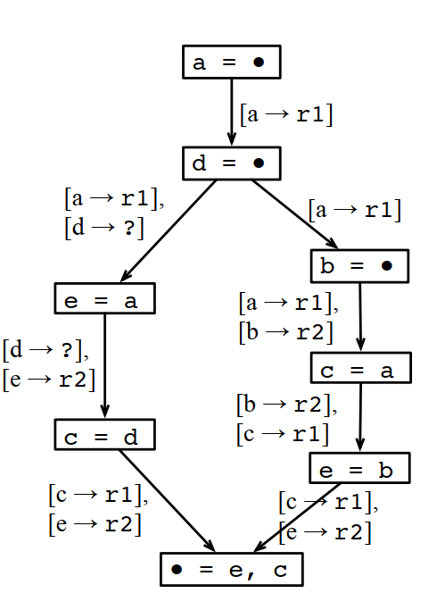

这样分配下来虽然MaxLive是2个，但MinReg需要3个。

为什么不能这样分配？因为最后输出是e和c，如果多个分支使用的e和c的寄存器不一样，那到汇聚点的时候，就没法直接用，还要做一次转移，这个转移也是需要额外的寄存器的，或者至少需要额外的计算。如果不做转移，就要插入一条store和一条load指令，这个成本更高。

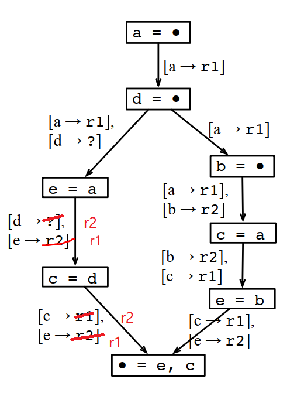

### 8.1.4 寄存器分配是个NP完成问题

它的复杂度和逻辑等同于图的着色问题。

同样的，对于这样的CFG，同样汇聚点上输出的变量往上的多个分支中，同一个变量需要使用同样的寄存器：

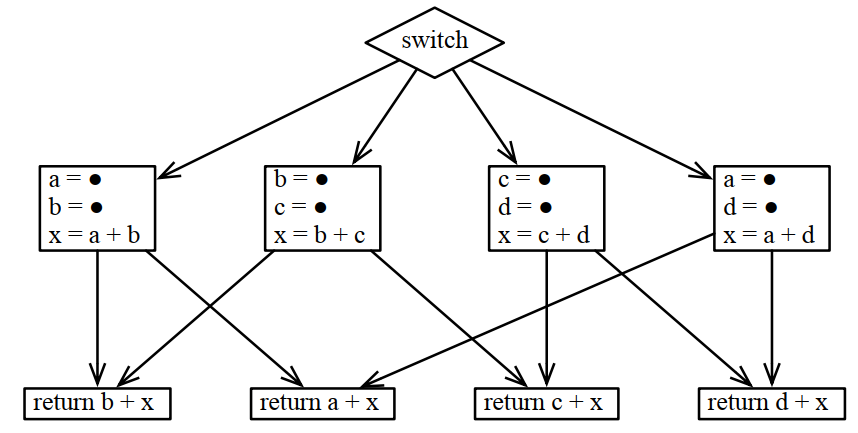

转换成着色问题的逻辑变成这样，对下面的k种颜色，需要k+1个寄存器：

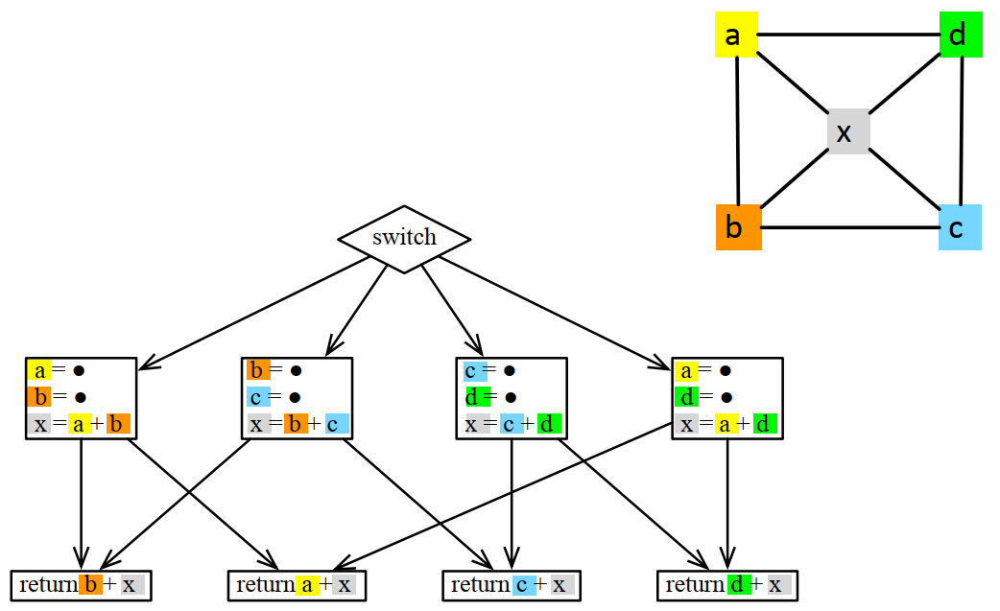

## 8.2 线性扫描

线性扫描基于区间图的贪婪着色算法：

给定一个区间序列，重叠的区间必须给定不同的颜色，求最小颜色数。

贪婪着色有最优算法

但线性扫描不是贪婪着色的最优算法，而是最优算法的一个近似解。

### 8.2.1 基本块的线性化

通常用逆后根排序对CFG做排序生成线性化的BB块序列（前面worklist算法也用了逆后根排序，看来这个排序和程序执行之间的关系非常密切）。

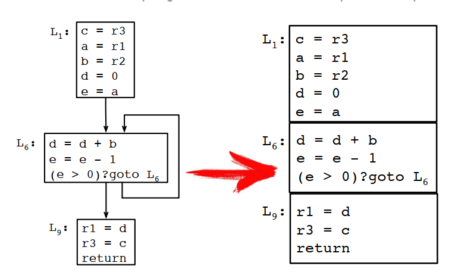

### 8.2.2 生成区间线

变量v的区间线Iv从v的生命期开始的程序点开始，到v的生命期结束的程序点结束。

为什么b和e的区间线要到第二个BB块最后，而不是在最后一次使用后就结束？因为后面还有分支，根据条件不同，第二个BB块还有可能从L6继续执行。

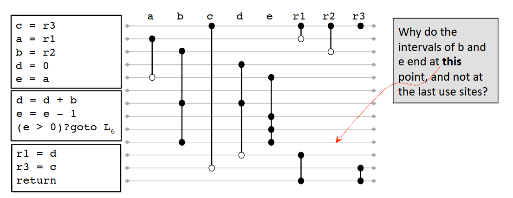

### 8.2.3 区间线的线性扫描算法

算法描述如下

1 LINEARSCANREGISTERALLOCATION♧

2   active = {}

3   foreach interval i, in order of increasing start point

4     EXPIREOLDINTERVALS(i)

5     if length(active) = R then

6       SPILLATINTERVAL(i)

7     else

8       register[i] = a register removed from the pool of free registers.

9       Add i to active, sorted by increasing end point

10

11 EXPIREOLDINTERVALS(i)

12   foreach interval j in active, in order of increasing end point

13     if endpoint[j] ≥ startpoint[i] then

14       return

15     remove j from active

16     add register[j] to pool of free registers

17

18 SPILLATINTERVAL(i)

19   spill = last interval in active

20   register[i] = register[spill]

21   location[spill] = new stack location

22   remove spill from active

23   add i to active, sorted by increasing end point

上面的例程经过算法处理之后的寄存器分配结果如下：

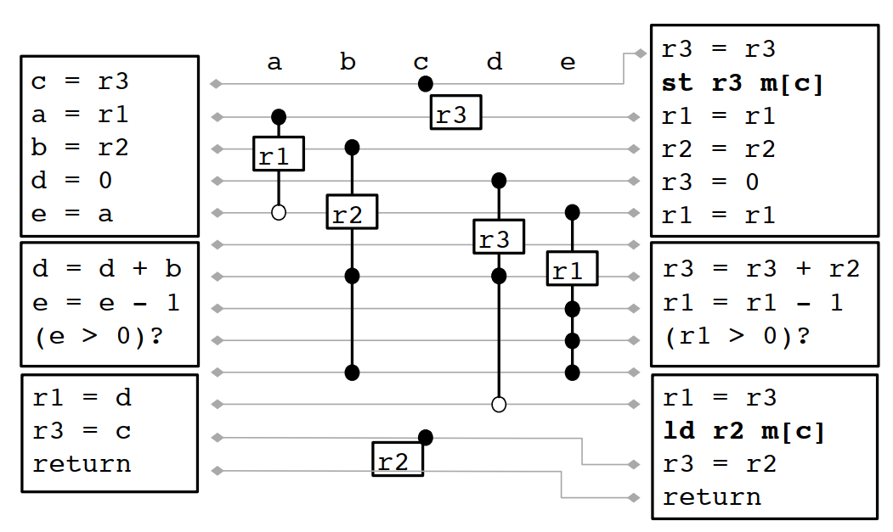

### 8.2.4 合并

上面的结果还不是最优解，需要经过合并

带合并过程的线性扫描算法如下：

1 LINEARSCANREGISTERALLOCATIONWITHCOALESCING

2   active = {}

3   foreach interval i, in order of increasing start point

4     EXPIREOLDINTERVALS(i)

5     if length(active) = R then

6       SPILLATINTERVAL(i)

7     else

8       if definition of i is "a = b" and register[b] ∈ free registers

9         register[i] = register[i(b)]

10         remove register[i(b)] from the list of free registers

11       else

12         register[i] = a register removed from the list of free registers

13       add i to active, sorted by increasing end point

合并之后的结果如下：

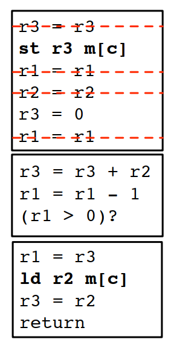

### 8.2.5 生命周期黑洞

线性扫描不是最优解，在一些场景下，和最优解相差还非差大，例如多个分支之间存在生命周期黑洞的情况。

例如对下面的CFG：

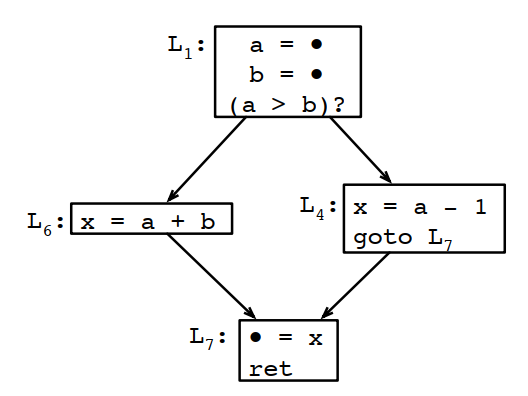

线性扫描处理的结果如下：

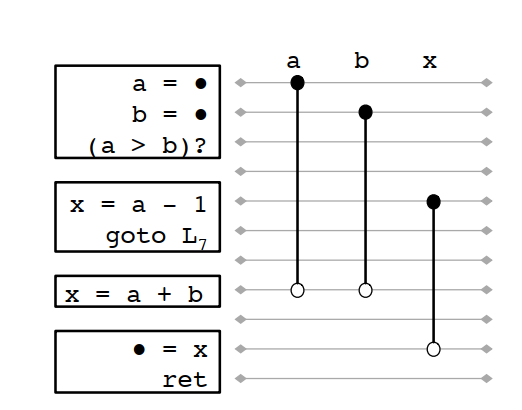

按线性扫描的结果x和a是不能共寄存器的。但如果看生命周期分析结果：

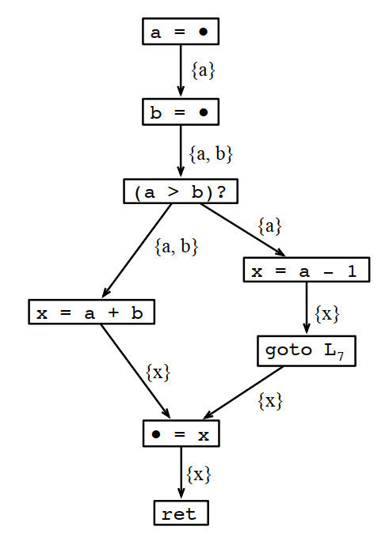

x出现后，a和b都不会再使用，也就是说x肯定是可以和a或者b共用一个寄存器的。

## 8.3 基于图着色的寄存器分配

### 8.3.1 干涉图（The Interference Graph）

最常见的寄存器分配算法家族是基于干涉图的理念推演出来的。

干涉图是基于控制流图中变量的生命周期范围的网络图：

每个变量是图的一个结点；

如果两个变量的生命周期存在重叠，则这2个节点在图上邻接，也就是存在一条边将2个节点连接起来，这样的边也称为干涉边（interference edges）。

除了干涉边，如果2个变量存在且仅存在一条move指令将2个变量关联起来，则在2个变量之间画一条虚线，称为合并边（coalescing edges）

### 8.3.2 肯普简化算法（Kempe's Simplification）

如果图中存在一个节点m，它的邻接节点小于k，设G' = G \ {m}，如果G'能被k种颜色着色，那么G也能被k种颜色着色。

通过肯普简化算法，可以将图简化到只有一个节点，或者简化到只剩下一些高阶节点，这样方便求出图的最小可着色的颜色数。

下面是简化过程：

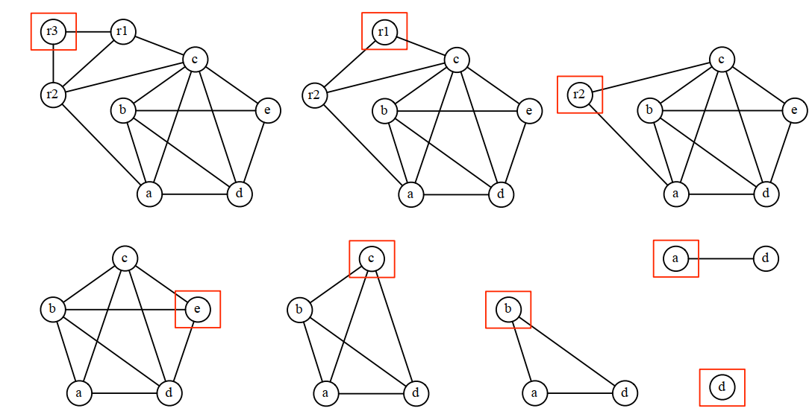

### 8.3.3 贪婪着色算法（Greedy Coloring）

贪婪着色的顺序是肯普简化算法删除节点的顺序的逆序，每次着色都要找一个邻接节点中不存在的颜色进行着色。

针对上面的简化过程，着色过程是这样的：

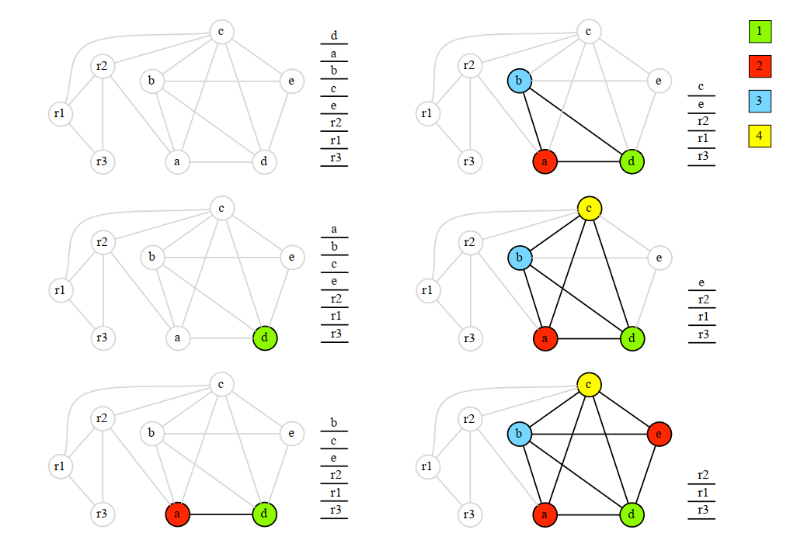

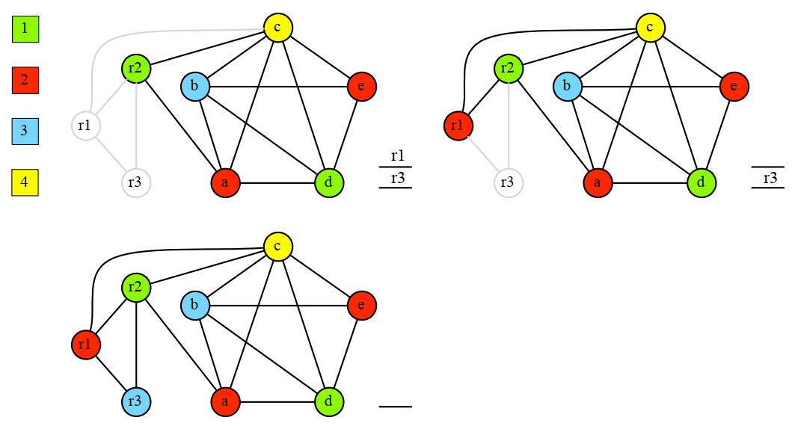

注意，上面的算法只是为了证明一个图是否能被K种颜色进行着色，但不关心是否可以用更少的颜色来着色。

## 8.4 循环进行寄存器合并

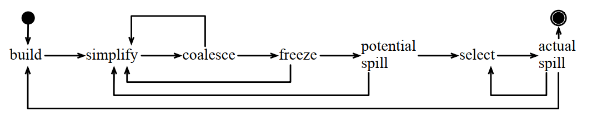

### 8.4.1 build

就是基于生命周期生成干涉图的过程：

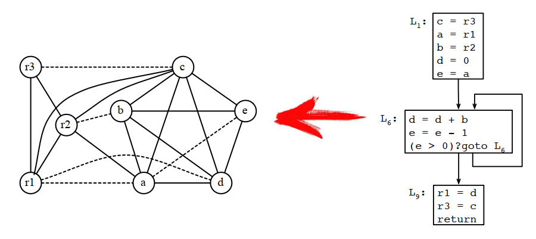

### 8.4.2 simplify

使用肯普算法删除非move相关节点：

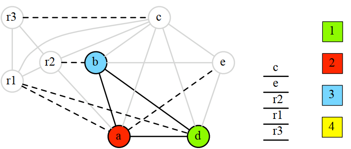

### 8.4.3 Coalesce

合并过程是将move关联节点合并成一个：

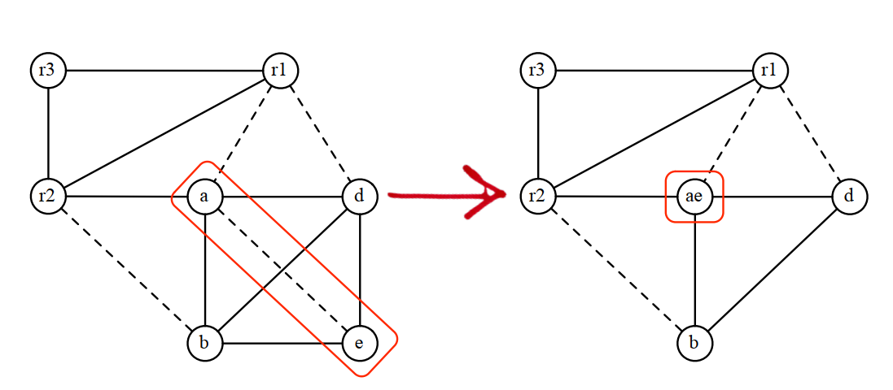

保守合并算法：

Briggs：节点a和b能合并当且仅当ab有更少的高阶（≥k）邻接节点

George：节点a和b能合并，当且仅当，所有a的邻接节点要么和b相互干涉，要么是一个低阶节点

### 8.4.4 freeze

如果前面的简化和合并都没有影响干涉图，尝试删除一条move干涉关系。

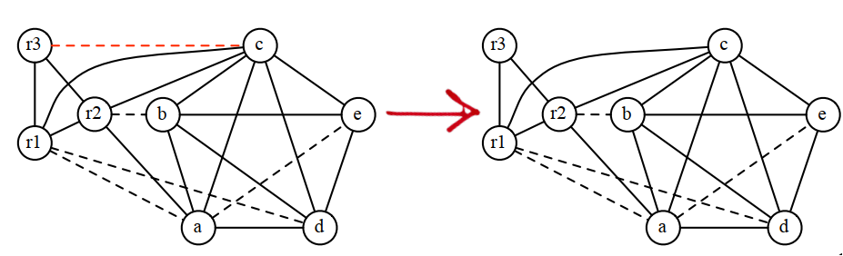

### 8.4.5 潜在溢出

如果找不到低阶节点，就要选择一个节点作为潜在的溢出节点，并将它加入到简化节点栈中。

现在还没有确定会溢出，有可能着色时，发现很多标记了溢出的节点，能够有效着色。

### 8.4.6 溢出算法（Spilling Heuristics）

溢出算法的核心是找到一个溢出代价最小的节点，我们给循环内的节点一个更高的代价因子：

1 SPILLCOST(v)

2   cost = 0

3   foreach definition at block B, or use at block B

4     cost += 10^N/D, where

5       N is B's loop nesting factor

6       D is v's degree in the interference graph

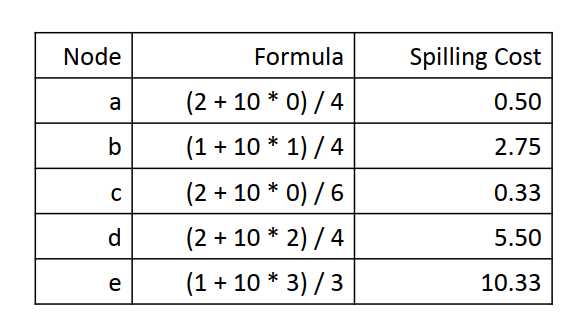

### 8.4.7 select

将栈中的节点出栈，并尝试用贪婪着色算法进行着色

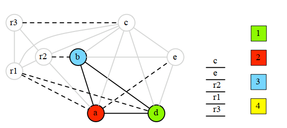

### 8.4.8 溢出

如果确定需要溢出，在变量前后增加load和store指令，并重新走一遍从build开始的整个迭代过程。

在只有3个寄存器的情况下，通过上面的计算，应该溢出c，将两次c的使用改成c0和c1，重新进行计算：

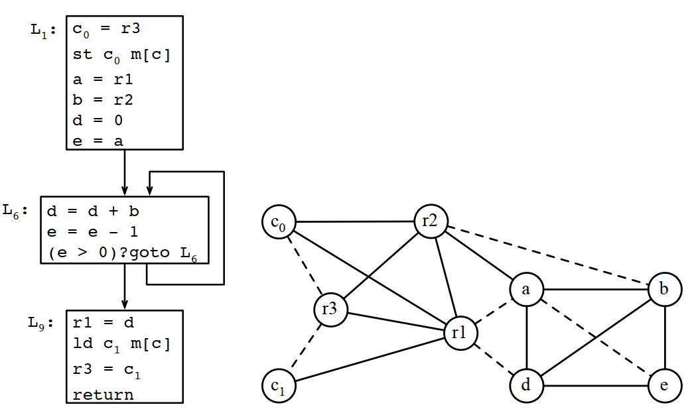

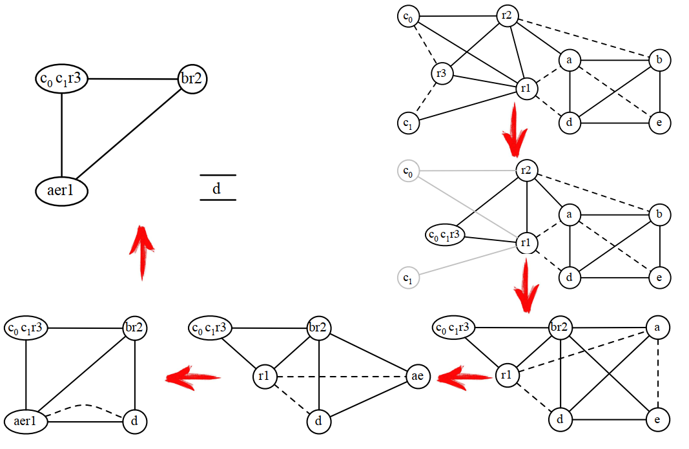

### 8.4.9 根据最终寄存器分配结果重写程序

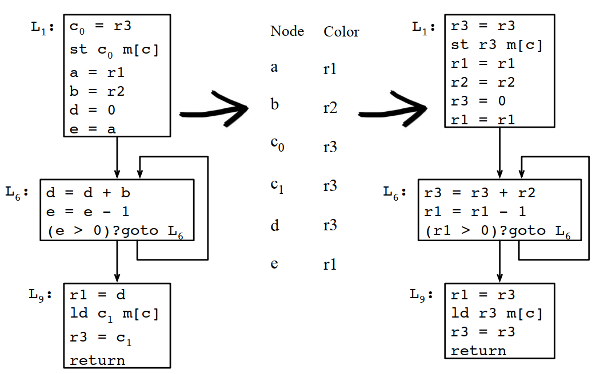

### 8.4.10 删除冗余的copy操作

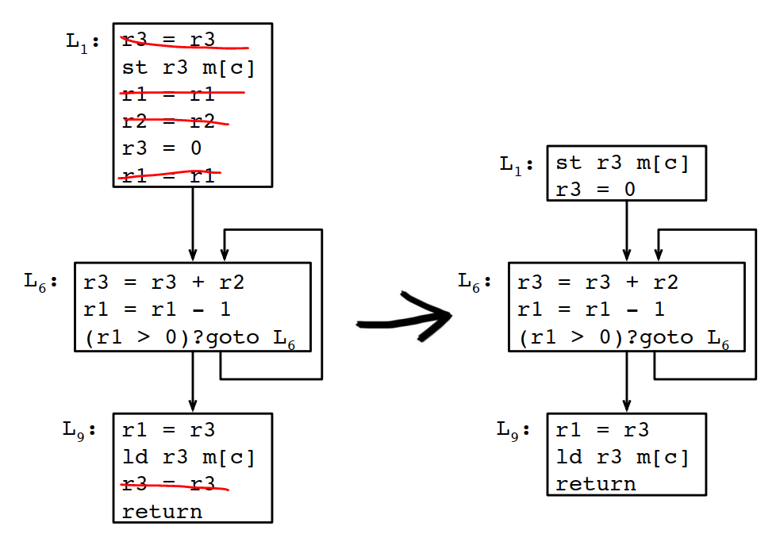

## 8.5 寄存器分配简史

Chaitin, G., Auslander, M., Chandra, A., Cocke, J., Hopkins, M., and Markstein, P. "Register allocation via coloring", Computer Languages, p 47-57 (1981)，首次将图着色引入寄存器分配。

George, L., and Appel, A., "Iterated Register Coalescing", North Holland, TOPLAS, p 300-324 (1996)，引入寄存器合并的迭代过程。

Poletto, M., and Sarkar, V., "Linear Scan Register Allocation", TOPLAS, p895-913 (1999)，将线性扫描引入寄存器分配。

## 8.6 LLVM的寄存器分配实现

### 8.6.1 LLVM中的基于生命期的寄存器分配

llvm\lib\CodeGen\RegAllocBase.cpp

| 1 | //===- RegAllocBase.cpp - Register Allocator Base Class -------------------===// |
| --- | --- |
| 2 | // |
| 3 | // Part of the LLVM Project, under the Apache License v2.0 with LLVM Exceptions. |
| 4 | // See https://llvm.org/LICENSE.txt for license information. |
| 5 | // SPDX-License-Identifier: Apache-2.0 WITH LLVM-exception |
| 6 | // |
| 7 | //===----------------------------------------------------------------------===// |
| 8 | // |
| 9 | // This file defines the RegAllocBase class which provides common functionality |
| 10 | // for LiveIntervalUnion-based register allocators. |
| 11 | // |
| 12 | //===----------------------------------------------------------------------===// |
| 13 | #include "RegAllocBase.h" |
| 14 | #include "llvm/ADT/SmallVector.h" |
| 15 | #include "llvm/ADT/Statistic.h" |
| 16 | #include "llvm/CodeGen/LiveInterval.h" |
| 17 | #include "llvm/CodeGen/LiveIntervals.h" |
| 18 | #include "llvm/CodeGen/LiveRegMatrix.h" |
| 19 | #include "llvm/CodeGen/MachineInstr.h" |
| 20 | #include "llvm/CodeGen/MachineModuleInfo.h" |
| 21 | #include "llvm/CodeGen/MachineRegisterInfo.h" |
| 22 | #include "llvm/CodeGen/Spiller.h" |
| 23 | #include "llvm/CodeGen/TargetRegisterInfo.h" |
| 24 | #include "llvm/CodeGen/VirtRegMap.h" |
| 25 | #include "llvm/Pass.h" |
| 26 | #include "llvm/Support/CommandLine.h" |
| 27 | #include "llvm/Support/Debug.h" |
| 28 | #include "llvm/Support/ErrorHandling.h" |
| 29 | #include "llvm/Support/Timer.h" |
| 30 | #include "llvm/Support/raw_ostream.h" |
| 31 | #include <cassert> |
| 32 | using namespace llvm; |
| 33 | // 定义一个宏，用于调试寄存器分配模块。 |
| 34 | #define DEBUG_TYPE "regalloc" |
| 35 | // 定义一个统计信息，用于记录新排队的活范围数量。 |
| 36 | STATISTIC(NumNewQueued    , "Number of new live ranges queued"); |
| 37 | // 临时的验证选项，直到我们可以将验证放入MachineVerifier中。 |
| 38 | // Temporary verification option until we can put verification inside |
| 39 | // MachineVerifier. |
| 40 | // 定义一个命令行选项，用于在寄存器分配期间启用验证。 |
| 41 | static cl::opt<bool, true> |
| 42 | VerifyRegAlloc("verify-regalloc", cl::location(RegAllocBase::VerifyEnabled), |
| 43 | cl::Hidden, cl::desc("Verify during register allocation")); |
| 44 | const char RegAllocBase::TimerGroupName[] = "regalloc"; |
| 45 | // 定义寄存器分配的定时器组名称和描述。 |
| 46 | const char RegAllocBase::TimerGroupDescription[] = "Register Allocation"; |
| 47 | // 初始化寄存器分配验证的启用状态为false。 |
| 48 | bool RegAllocBase::VerifyEnabled = false; |
| 49 | //===----------------------------------------------------------------------===// |
| 50 | //                         RegAllocBase Implementation |
| 51 | //===----------------------------------------------------------------------===// |
| 52 | // 固定虚表到这个文件，确保虚表只在此处定义。 |
| 53 | // Pin the vtable to this file. |
| 54 | void RegAllocBase::anchor() {} |
| 55 | // 初始化寄存器分配基础类。 |
| 56 | void RegAllocBase::init(VirtRegMap &vrm, |
| 57 | LiveIntervals &lis, |
| 58 | LiveRegMatrix &mat) { |
| 59 | TRI = &vrm.getTargetRegInfo(); |
| 60 | MRI = &vrm.getRegInfo(); |
| 61 | VRM = &vrm; |
| 62 | LIS = &lis; |
| 63 | Matrix = &mat; |
| 64 | MRI->freezeReservedRegs(vrm.getMachineFunction()); |
| 65 | RegClassInfo.runOnMachineFunction(vrm.getMachineFunction()); |
| 66 | } |
| 67 | // 访问所有活寄存器。如果它们已经被分配到物理寄存器，将它们与对应的LiveIntervalUnion统一， |
| 68 | // 否则将它们推入优先队列以便后续分配。 |
| 69 | // Visit all the live registers. If they are already assigned to a physical |
| 70 | // register, unify them with the corresponding LiveIntervalUnion, otherwise push |
| 71 | // them on the priority queue for later assignment. |
| 72 | void RegAllocBase::seedLiveRegs() { |
| 73 | // 创建一个命名区域定时器。 |
| 74 | NamedRegionTimer T("seed", "Seed Live Regs", TimerGroupName, |
| 75 | TimerGroupDescription, TimePassesIsEnabled); |
| 76 | for (unsigned i = 0, e = MRI->getNumVirtRegs(); i != e; ++i) { |
| 77 | unsigned Reg = Register::index2VirtReg(i); |
| 78 | if (MRI->reg_nodbg_empty(Reg)) |
| 79 | continue; |
| 80 | enqueue(&LIS->getInterval(Reg)); |
| 81 | } |
| 82 | } |
| 83 | // 顶层驱动函数，用于管理未分配VirtRegs的队列，并调用selectOrSplit实现。 |
| 84 | // Top-level driver to manage the queue of unassigned VirtRegs and call the |
| 85 | // selectOrSplit implementation. |
| 86 | void RegAllocBase::allocatePhysRegs() { |
| 87 | // 播种活寄存器。 |
| 88 | seedLiveRegs(); |
| 89 | // 继续为可用的物理寄存器分配虚拟寄存器。 |
| 90 | // Continue assigning vregs one at a time to available physical registers. |
| 91 | while (LiveInterval *VirtReg = dequeue()) { |
| 92 | // 确保寄存器尚未分配。 |
| 93 | assert(!VRM->hasPhys(VirtReg->reg) && "Register already assigned"); |
| 94 | // 当拼接代码片段时，未使用的寄存器可能会出现。 |
| 95 | // Unused registers can appear when the spiller coalesces snippets. |
| 96 | if (MRI->reg_nodbg_empty(VirtReg->reg)) { |
| 97 | LLVM_DEBUG(dbgs() << "Dropping unused " << *VirtReg << '\n'); |
| 98 | aboutToRemoveInterval(*VirtReg); |
| 99 | LIS->removeInterval(VirtReg->reg); |
| 100 | continue; |
| 101 | } |
| 102 | // 使所有干扰查询无效，活范围可能已经改变。 |
| 103 | // Invalidate all interference queries, live ranges could have changed. |
| 104 | Matrix->invalidateVirtRegs(); |
| 105 | // selectOrSplit请求分配器返回一个可用的物理寄存器（如果可能） |
| 106 | // 并填充由分割产生的新活区间列表。 |
| 107 | // selectOrSplit requests the allocator to return an available physical |
| 108 | // register if possible and populate a list of new live intervals that |
| 109 | // result from splitting. |
| 110 | LLVM_DEBUG(dbgs() << "\nselectOrSplit " |
| 111 | << TRI->getRegClassName(MRI->getRegClass(VirtReg->reg)) |
| 112 | << ':' << *VirtReg << " w=" << VirtReg->weight << '\n'); |
| 113 | using VirtRegVec = SmallVector<Register, 4>; |
| 114 | VirtRegVec SplitVRegs; |
| 115 | unsigned AvailablePhysReg = selectOrSplit(*VirtReg, SplitVRegs); |
| 116 | if (AvailablePhysReg == ~0u) { |
| 117 | // selectOrSplit未能找到寄存器！ |
| 118 | // 可能是由于内联汇编引起的。 |
| 119 | // ...（省略错误处理代码） |
| 120 | // 在报告错误后继续进行。 |
| 121 | // selectOrSplit failed to find a register! |
| 122 | // Probably caused by an inline asm. |
| 123 | MachineInstr *MI = nullptr; |
| 124 | for (MachineRegisterInfo::reg_instr_iterator |
| 125 | I = MRI->reg_instr_begin(VirtReg->reg), E = MRI->reg_instr_end(); |
| 126 | I != E; ) { |
| 127 | MI = &*(I++); |
| 128 | if (MI->isInlineAsm()) |
| 129 | break; |
| 130 | } |
| 131 | if (MI && MI->isInlineAsm()) { |
| 132 | MI->emitError("inline assembly requires more registers than available"); |
| 133 | } else if (MI) { |
| 134 | LLVMContext &Context = |
| 135 | MI->getParent()->getParent()->getMMI().getModule()->getContext(); |
| 136 | Context.emitError("ran out of registers during register allocation"); |
| 137 | } else { |
| 138 | report_fatal_error("ran out of registers during register allocation"); |
| 139 | } |
| 140 | // Keep going after reporting the error. |
| 141 | VRM->assignVirt2Phys(VirtReg->reg, |
| 142 | RegClassInfo.getOrder(MRI->getRegClass(VirtReg->reg)).front()); |
| 143 | continue; |
| 144 | } |
| 145 | if (AvailablePhysReg) |
| 146 | Matrix->assign(*VirtReg, AvailablePhysReg); |
| 147 | for (unsigned Reg : SplitVRegs) { |
| 148 | assert(LIS->hasInterval(Reg)); |
| 149 | LiveInterval *SplitVirtReg = &LIS->getInterval(Reg); |
| 150 | assert(!VRM->hasPhys(SplitVirtReg->reg) && "Register already assigned"); |
| 151 | if (MRI->reg_nodbg_empty(SplitVirtReg->reg)) { |
| 152 | assert(SplitVirtReg->empty() && "Non-empty but used interval"); |
| 153 | LLVM_DEBUG(dbgs() << "not queueing unused  " << *SplitVirtReg << '\n'); |
| 154 | aboutToRemoveInterval(*SplitVirtReg); |
| 155 | LIS->removeInterval(SplitVirtReg->reg); |
| 156 | continue; |
| 157 | } |
| 158 | LLVM_DEBUG(dbgs() << "queuing new interval: " << *SplitVirtReg << "\n"); |
| 159 | assert(Register::isVirtualRegister(SplitVirtReg->reg) && |
| 160 | "expect split value in virtual register"); |
| 161 | // 将新分割的虚拟寄存器加入队列。 |
| 162 | enqueue(SplitVirtReg); |
| 163 | // 增加新排队的活范围统计。 |
| 164 | ++NumNewQueued; |
| 165 | } |
| 166 | } |
| 167 | } |
| 168 | void RegAllocBase::postOptimization() { |
| 169 | // 调用 spiller 的 postOptimization 方法。 |
| 170 | // Spiller 是负责寄存器溢出处理的对象，这个方法可能包含一些优化后的清理工作。 |
| 171 | spiller().postOptimization(); |
| 172 | // 遍历所有已经标记为死亡的重排指令（DeadRemats）。 |
|  | for (auto DeadInst : DeadRemats) { |
|  | // 从LiveIntervals对象的映射中移除这些死亡指令。 |
|  | // 这是因为这些指令将要从指令流中移除，不再需要跟踪它们的寄存器使用情况。 |
|  | LIS->RemoveMachineInstrFromMaps(*DeadInst); |
|  | // 从它们的父指令组中移除这些死亡指令，实际上将它们从指令流中删除。 |
|  | DeadInst->eraseFromParent(); |
|  | } |
|  | // 清空死亡重排指令的列表，为下一次优化准备。 |
|  | DeadRemats.clear(); |
|  | } |

### 8.6.2 LLVM中的寄存器分配的贪婪算法

llvm\lib\CodeGen\RegAllocGreedy.cpp

llvm\lib\CodeGen\RegAllocGreedy.cpp

| 82 | // 定义一个宏DEBUG_TYPE，用于标识调试信息的类型，这里设置为"regalloc"，代表寄存器分配。 |
| --- | --- |
| 83 | #define DEBUG_TYPE "regalloc" |
| 84 | // 定义三个统计项，用于跟踪寄存器分配过程中的不同事件。 |
| 85 | // NumGlobalSplits：全局生命周期（live ranges）分割的次数。 |
| 86 | STATISTIC(NumGlobalSplits, "Number of split global live ranges"); |
| 87 | STATISTIC(NumLocalSplits,  "Number of split local live ranges"); |
| 88 | STATISTIC(NumEvicted,      "Number of interferences evicted"); |
| 89 | // 定义一个命令行选项SplitSpillMode，用于设置分割生命周期时的spill模式。 |
| 90 | // 这个选项是隐藏的，不会在命令行帮助中显示。 |
| 91 | static cl::opt<SplitEditor::ComplementSpillMode> SplitSpillMode( |
| 92 | "split-spill-mode", cl::Hidden, |
| 93 | cl::desc("Spill mode for splitting live ranges"), |
| 94 | cl::values(clEnumValN(SplitEditor::SM_Partition, "default", "Default"), |
| 95 | clEnumValN(SplitEditor::SM_Size, "size", "Optimize for size"), |
| 96 | clEnumValN(SplitEditor::SM_Speed, "speed", "Optimize for speed")), |
| 97 | cl::init(SplitEditor::SM_Speed)); |
| 98 | // 定义一个命令行选项LastChanceRecoloringMaxDepth，用于设置最后一次重新着色的最大深度。 |
| 99 | static cl::opt<unsigned> |
| 100 | LastChanceRecoloringMaxDepth("lcr-max-depth", cl::Hidden, |
| 101 | cl::desc("Last chance recoloring max depth"), |
| 102 | cl::init(5)); |
| 103 | // 定义一个命令行选项LastChanceRecoloringMaxInterference，用于设置最后一次重新着色时考虑的最大干扰数。 |
| 104 | static cl::opt<unsigned> LastChanceRecoloringMaxInterference( |
| 105 | "lcr-max-interf", cl::Hidden, |
| 106 | cl::desc("Last chance recoloring maximum number of considered" |
| 107 | " interference at a time"), |
| 108 | cl::init(8)); |
| 109 | // 定义一个命令行选项ExhaustiveSearch，用于设置是否进行穷举搜索以寻找寄存器， |
| 110 | // 绕过最后一次重新着色的深度和干扰限制。 |
| 111 | static cl::opt<bool> ExhaustiveSearch( |
| 112 | "exhaustive-register-search", cl::NotHidden, |
| 113 | cl::desc("Exhaustive Search for registers bypassing the depth " |
| 114 | "and interference cutoffs of last chance recoloring"), |
| 115 | cl::Hidden); |
| 116 | // 定义一个命令行选项EnableLocalReassignment，用于设置是否启用局部重新分配， |
| 117 | // 这可能会产生更好的分配决策，但可能会增加编译时间。 |
| 118 | static cl::opt<bool> EnableLocalReassignment( |
| 119 | "enable-local-reassign", cl::Hidden, |
| 120 | cl::desc("Local reassignment can yield better allocation decisions, but " |
| 121 | "may be compile time intensive"), |
| 122 | cl::init(false)); |
| 123 | // 定义一个命令行选项EnableDeferredSpilling，用于设置是否启用延迟spilling， |
| 124 | // 即不立即spill变量，而是推迟到分配结束时。 |
| 125 | static cl::opt<bool> EnableDeferredSpilling( |
| 126 | "enable-deferred-spilling", cl::Hidden, |
| 127 | cl::desc("Instead of spilling a variable right away, defer the actual " |
| 128 | "code insertion to the end of the allocation. That way the " |
| 129 | "allocator might still find a suitable coloring for this " |
| 130 | "variable because of other evicted variables."), |
| 131 | cl::init(false)); |
| 132 | // FIXME: 找到一个合适的默认值替换这个标志，并移除这个标志。 |
| 133 | // 定义一个命令行选项CSRFirstTimeCost，用于设置 |
| 134 | // 调用者保存寄存器（callee-saved register）第一次使用时的成本。 |
| 135 | // 这个选项是隐藏的，不会在命令行帮助中显示，并且默认初始化为0。 |
| 136 | // FIXME: Find a good default for this flag and remove the flag. |
| 137 | static cl::opt<unsigned> |
| 138 | CSRFirstTimeCost("regalloc-csr-first-time-cost", |
| 139 | cl::desc("Cost for first time use of callee-saved register."), |
| 140 | cl::init(0), cl::Hidden); |
| 141 | // 定义一个命令行选项ConsiderLocalIntervalCost，用于设置在选择最佳分割候选时是否考虑由分割候选创建的局部区间的成本。 |
| 142 | static cl::opt<bool> ConsiderLocalIntervalCost( |
| 143 | "consider-local-interval-cost", cl::Hidden, |
| 144 | cl::desc("Consider the cost of local intervals created by a split " |
| 145 | "candidate when choosing the best split candidate."), |
| 146 | cl::init(false)); |
| 147 | // 定义一个贪婪寄存器分配器（greedy register allocator）。 |
| 148 | // RegisterRegAlloc是一个用于注册寄存器分配器的类，这里注册了一个名为"greedy"的贪婪寄存器分配器。 |
| 149 | // createGreedyRegisterAllocator是一个工厂函数，用于创建贪婪寄存器分配器的实例。 |
| 150 | static RegisterRegAlloc greedyRegAlloc("greedy", "greedy register allocator", |
| 151 | createGreedyRegisterAllocator); |
| 152 | namespace { |
| 153 | // RAGreedy类继承自MachineFunctionPass、RegAllocBase， |
| 154 | // 并实现了LiveRangeEdit::Delegate接口。 |
| 155 | class RAGreedy : public MachineFunctionPass, |
| 156 | public RegAllocBase, |
| 157 | private LiveRangeEdit::Delegate { |
| 158 | // 定义了一些方便的别名。 |
| 159 | // Convenient shortcuts. |
| 160 | using PQueue = std::priority_queue<std::pair<unsigned, unsigned>>; |
| 161 | using SmallLISet = SmallPtrSet<LiveInterval *, 4>; |
| 162 | using SmallVirtRegSet = SmallSet<unsigned, 16>; |
| 163 | // 上下文环境 |
| 164 | // context |
| 165 | MachineFunction *MF; |
| 166 | // 一些有用的接口的快捷方式。 |
| 167 | // Shortcuts to some useful interface. |
| 168 | const TargetInstrInfo *TII; |
| 169 | const TargetRegisterInfo *TRI; |
| 170 | RegisterClassInfo RCI; |
| 171 | // 分析结果 |
| 172 | // analyses |
| 173 | SlotIndexes *Indexes; |
| 174 | MachineBlockFrequencyInfo *MBFI; |
| 175 | MachineDominatorTree *DomTree; |
| 176 | MachineLoopInfo *Loops; |
| 177 | MachineOptimizationRemarkEmitter *ORE; |
| 178 | EdgeBundles *Bundles; |
| 179 | SpillPlacement *SpillPlacer; |
| 180 | LiveDebugVariables *DebugVars; |
| 181 | AliasAnalysis *AA; |
| 182 | // 状态 |
| 183 | // state |
| 184 | std::unique_ptr<Spiller> SpillerInstance; |
| 185 | PQueue Queue; |
| 186 | unsigned NextCascade; |
| 187 | // Live ranges通过多个阶段进行分配。 |
| 188 | // Live ranges pass through a number of stages as we try to allocate them. |
| 189 | // Some of the stages may also create new live ranges: |
| 190 | // |
| 191 | // - Region splitting. |
| 192 | // - Per-block splitting. |
| 193 | // - Local splitting. |
| 194 | // - Spilling. |
| 195 | // |
| 196 | // Ranges produced by one of the stages skip the previous stages when they are |
| 197 | // dequeued. This improves performance because we can skip interference checks |
| 198 | // that are unlikely to give any results. It also guarantees that the live |
| 199 | // range splitting algorithm terminates, something that is otherwise hard to |
| 200 | // ensure. |
| 201 | enum LiveRangeStage { |
| 202 | // 新创建的live range，从未入队。 |
| 203 | /// Newly created live range that has never been queued. |
| 204 | RS_New, |
| 205 | // 仅尝试分配和驱逐，然后重新入队为RS_Split。 |
| 206 | /// Only attempt assignment and eviction. Then requeue as RS_Split. |
| 207 | RS_Assign, |
| 208 | // 如果分配不可能，则尝试live range分割。 |
| 209 | /// Attempt live range splitting if assignment is impossible. |
| 210 | RS_Split, |
| 211 | // 尝试更激进的live range分割，保证有进展。 |
| 212 | /// Attempt more aggressive live range splitting that is guaranteed to make |
| 213 | /// progress.  This is used for split products that may not be making |
| 214 | /// progress. |
| 215 | RS_Split2, |
| 216 | // live range将被spill，不再尝试分割。 |
| 217 | /// Live range will be spilled.  No more splitting will be attempted. |
| 218 | RS_Spill, |
| 219 | // live range在内存中，可能因为其他驱逐而最终进入寄存器。 |
| 220 | /// Live range is in memory. Because of other evictions, it might get moved |
| 221 | /// in a register in the end. |
| 222 | RS_Memory, |
| 223 | // 对这个live range无更多操作，如果不能分配则中止编译。 |
| 224 | /// There is nothing more we can do to this live range.  Abort compilation |
| 225 | /// if it can't be assigned. |
| 226 | RS_Done |
| 227 | }; |
| 228 | // CutOffStage枚举用于跟踪寄存器分配是否因为最后一次重新着色的截止而失败。 |
| 229 | // Enum CutOffStage to keep a track whether the register allocation failed |
| 230 | // because of the cutoffs encountered in last chance recoloring. |
| 231 | // Note: This is used as bitmask. New value should be next power of 2. |
| 232 | enum CutOffStage { |
| 233 | // 没有遇到截止。 |
| 234 | // No cutoffs encountered |
| 235 | CO_None = 0, |
| 236 | // 遇到了lcr-max-depth截止。 |
| 237 | // lcr-max-depth cutoff encountered |
| 238 | CO_Depth = 1, |
| 239 | // 遇到了lcr-max-interf截止。 |
| 240 | // lcr-max-interf cutoff encountered |
| 241 | CO_Interf = 2 |
| 242 | }; |
| 243 | // 截止信息。 |
| 244 | uint8_t CutOffInfo; |
| 245 | #ifndef NDEBUG |
| 246 | // 调试时使用的阶段名称数组。 |
| 247 | static const char *const StageName[]; |
| 248 | #endif |
| 249 | // RegInfo结构体用于存储每个live range的额外信息。 |
| 250 | // RegInfo - Keep additional information about each live range. |
| 251 | struct RegInfo { |
| 252 | // 当前阶段。 |
| 253 | LiveRangeStage Stage = RS_New; |
| 254 | // 防止驱逐循环的级联编号。 |
| 255 | // Cascade - Eviction loop prevention. See canEvictInterference(). |
| 256 | unsigned Cascade = 0; |
| 257 | // 默认构造函数。 |
| 258 | RegInfo() = default; |
| 259 | }; |
| 260 | IndexedMap<RegInfo, VirtReg2IndexFunctor> ExtraRegInfo; |
| 261 | // 获取虚拟寄存器的当前阶段。 |
| 262 | LiveRangeStage getStage(const LiveInterval &VirtReg) const { |
| 263 | return ExtraRegInfo[VirtReg.reg].Stage; |
| 264 | } |
| 265 | // 设置虚拟寄存器的阶段。 |
| 266 | void setStage(const LiveInterval &VirtReg, LiveRangeStage Stage) { |
| 267 | ExtraRegInfo.resize(MRI->getNumVirtRegs()); |
| 268 | ExtraRegInfo[VirtReg.reg].Stage = Stage; |
| 269 | } |
| 270 | // 为一系列虚拟寄存器设置阶段。 |
| 271 | template<typename Iterator> |
| 272 | void setStage(Iterator Begin, Iterator End, LiveRangeStage NewStage) { |
| 273 | ExtraRegInfo.resize(MRI->getNumVirtRegs()); |
| 274 | for (;Begin != End; ++Begin) { |
| 275 | unsigned Reg = *Begin; |
| 276 | if (ExtraRegInfo[Reg].Stage == RS_New) |
| 277 | ExtraRegInfo[Reg].Stage = NewStage; |
| 278 | } |
| 279 | } |
| 280 | // 驱逐干扰的成本结构体。 |
| 281 | /// Cost of evicting interference. |
| 282 | struct EvictionCost { |
| 283 | unsigned BrokenHints = 0; ///< Total number of broken hints. |
| 284 | float MaxWeight = 0;      ///< Maximum spill weight evicted. |
| 285 | EvictionCost() = default; |
| 286 | bool isMax() const { return BrokenHints == ~0u; } |
| 287 | void setMax() { BrokenHints = ~0u; } |
| 288 | void setBrokenHints(unsigned NHints) { BrokenHints = NHints; } |
| 289 | bool operator<(const EvictionCost &O) const { |
| 290 | return std::tie(BrokenHints, MaxWeight) < |
| 291 | std::tie(O.BrokenHints, O.MaxWeight); |
| 292 | } |
| 293 | }; |
| 294 | /// 这个类用于跟踪过去的驱逐事件，以便优化区域分割决策。 |
| 295 | /// EvictionTrack - Keeps track of past evictions in order to optimize region |
| 296 | /// split decision. |
| 297 | class EvictionTrack { |
| 298 | public: |
| 299 | /// 使用 std::pair 来存储驱逐者信息，包括驱逐者虚拟寄存器编号和物理寄存器编号。 |
| 300 | using EvictorInfo = |
| 301 | std::pair<unsigned /* evictor */, unsigned /* physreg */>; |
| 302 | /// 使用 llvm::DenseMap 来存储被驱逐者信息，键为被驱逐者虚拟寄存器编号，值为驱逐者信息。 |
| 303 | using EvicteeInfo = llvm::DenseMap<unsigned /* evictee */, EvictorInfo>; |
| 304 | private: |
| 305 | /// 存储每个在 selectOrSplit 最后阶段被驱逐的虚拟寄存器（Vreg）， |
| 306 | /// 映射到驱逐它的虚拟寄存器和它被驱逐的物理寄存器。 |
| 307 | /// Each Vreg that has been evicted in the last stage of selectOrSplit will |
| 308 | /// be mapped to the evictor Vreg and the PhysReg it was evicted from. |
| 309 | EvicteeInfo Evictees; |
| 310 | public: |
| 311 | /// 清除所有驱逐信息。 |
| 312 | /// Clear all eviction information. |
| 313 | void clear() { Evictees.clear(); } |
| 314 | /// 清除给定被驱逐者 Vreg 的驱逐信息。 |
| 315 | /// 当 Vreg 获得新的分配时，旧的驱逐信息不再相关。 |
| 316 | /// \param Evictee 我们想要清除收集的驱逐信息的被驱逐者 Vreg。 |
| 317 | ///  Clear eviction information for the given evictee Vreg. |
| 318 | /// E.g. when Vreg get's a new allocation, the old eviction info is no |
| 319 | /// longer relevant. |
| 320 | /// \param Evictee The evictee Vreg for whom we want to clear collected |
| 321 | /// eviction info. |
| 322 | void clearEvicteeInfo(unsigned Evictee) { Evictees.erase(Evictee); } |
| 323 | /// 跟踪新的驱逐事件。 |
| 324 | /// 驱逐者 vreg 已经从 Physreg 驱逐了被驱逐者 vreg。 |
| 325 | /// \param PhysReg 被驱逐者被驱逐的物理寄存器。 |
| 326 | /// \param Evictor 驱逐被驱逐者的虚拟寄存器。 |
| 327 | /// \param Evictee 被驱逐的虚拟寄存器。 |
| 328 | /// Track new eviction. |
| 329 | /// The Evictor vreg has evicted the Evictee vreg from Physreg. |
| 330 | /// \param PhysReg The physical register Evictee was evicted from. |
| 331 | /// \param Evictor The evictor Vreg that evicted Evictee. |
| 332 | /// \param Evictee The evictee Vreg. |
| 333 | void addEviction(unsigned PhysReg, unsigned Evictor, unsigned Evictee) { |
| 334 | Evictees[Evictee].first = Evictor; |
| 335 | Evictees[Evictee].second = PhysReg; |
| 336 | } |
| 337 | /// 返回驱逐 Evictee Vreg 从 PhysReg 的驱逐者 Vreg。 |
| 338 | /// \param Evictee 被驱逐的虚拟寄存器。 |
| 339 | /// \return 驱逐 Evictee Vreg 从 PhysReg 的驱逐者 Vreg。如果没有人驱逐 Evictee 从 PhysReg，则返回 0。 |
| 340 | /// Return the Evictor Vreg which evicted Evictee Vreg from PhysReg. |
| 341 | /// \param Evictee The evictee vreg. |
| 342 | /// \return The Evictor vreg which evicted Evictee vreg from PhysReg. 0 if |
| 343 | /// nobody has evicted Evictee from PhysReg. |
| 344 | EvictorInfo getEvictor(unsigned Evictee) { |
| 345 | if (Evictees.count(Evictee)) { |
| 346 | return Evictees[Evictee]; |
| 347 | } |
| 348 | return EvictorInfo(0, 0); |
| 349 | } |
| 350 | }; |
| 351 | // 用于跟踪过去的驱逐事件，以便优化区域分割决策。 |
| 352 | // Keeps track of past evictions in order to optimize region split decision. |
| 353 | EvictionTrack LastEvicted; |
| 354 | // 分割状态。 |
| 355 | // splitting state. |
| 356 | std::unique_ptr<SplitAnalysis> SA; |
| 357 | std::unique_ptr<SplitEditor> SE; |
| 358 | /// 缓存每个代码块的干扰图。 |
| 359 | /// Cached per-block interference maps |
| 360 | InterferenceCache IntfCache; |
| 361 | /// 存储当前寄存器使用的所有基本块。 |
| 362 | /// All basic blocks where the current register has uses. |
| 363 | SmallVector<SpillPlacement::BlockConstraint, 8> SplitConstraints; |
| 364 | /// 全局活范围分割候选信息。 |
| 365 | /// Global live range splitting candidate info. |
| 366 | struct GlobalSplitCandidate { |
| 367 | // 打算分配给该候选的寄存器，或者为0。 |
| 368 | // Register intended for assignment, or 0. |
| 369 | unsigned PhysReg; |
| 370 | // SplitKit区间索引，用于这个候选。 |
| 371 | // SplitKit interval index for this candidate. |
| 372 | unsigned IntvIdx; |
| 373 | // 对于PhysReg的干扰。 |
| 374 | // Interference for PhysReg. |
| 375 | InterferenceCache::Cursor Intf; |
| 376 | // 候选应该活跃的束。 |
| 377 | // Bundles where this candidate should be live. |
| 378 | BitVector LiveBundles; |
| 379 | SmallVector<unsigned, 8> ActiveBlocks; |
| 380 | // 重置候选信息。 |
| 381 | void reset(InterferenceCache &Cache, unsigned Reg) { |
| 382 | PhysReg = Reg; |
| 383 | IntvIdx = 0; |
| 384 | Intf.setPhysReg(Cache, Reg); |
| 385 | LiveBundles.clear(); |
| 386 | ActiveBlocks.clear(); |
| 387 | } |
| 388 | // 在所有LiveBundles中将B[i]设置为C，如果B[i]之前是NoCand。 |
| 389 | // Set B[i] = C for every live bundle where B[i] was NoCand. |
| 390 | unsigned getBundles(SmallVectorImpl<unsigned> &B, unsigned C) { |
| 391 | unsigned Count = 0; |
| 392 | for (unsigned i : LiveBundles.set_bits()) |
| 393 | if (B[i] == NoCand) { |
| 394 | B[i] = C; |
| 395 | Count++; |
| 396 | } |
| 397 | return Count; |
| 398 | } |
| 399 | }; |
| 400 | /// 分配顺序中每个物理寄存器的候选信息。 |
| 401 | /// 这个向量不会缩小，但会增长到最大寄存器类的大小。 |
| 402 | /// Candidate info for each PhysReg in AllocationOrder. |
| 403 | /// This vector never shrinks, but grows to the size of the largest register |
| 404 | /// class. |
| 405 | SmallVector<GlobalSplitCandidate, 32> GlobalCand; |
| 406 | // 枚举值，表示没有候选。 |
| 407 | enum : unsigned { NoCand = ~0u }; |
| 408 | /// 候选映射。每个边缘束被分配给一个GlobalCand条目，或者NoCand，表示栈区间。 |
| 409 | /// Candidate map. Each edge bundle is assigned to a GlobalCand entry, or to |
| 410 | /// NoCand which indicates the stack interval. |
| 411 | SmallVector<unsigned, 32> BundleCand; |
| 412 | /// 被调用者保存寄存器成本，每个机器函数计算一次。 |
| 413 | /// Callee-save register cost, calculated once per machine function. |
| 414 | BlockFrequency CSRCost; |
| 415 | /// 是否运行局部重新分配启发式。这些信息从TargetSubtargetInfo获得。 |
| 416 | /// Run or not the local reassignment heuristic. This information is |
| 417 | /// obtained from the TargetSubtargetInfo. |
| 418 | bool EnableLocalReassign; |
| 419 | /// 是否启用在选择最佳分割候选时考虑由分割候选创建的局部区间的成本。 |
| 420 | /// Enable or not the consideration of the cost of local intervals created |
| 421 | /// by a split candidate when choosing the best split candidate. |
| 422 | bool EnableAdvancedRASplitCost; |
| 423 | /// 可能稍后因驱逐而协调的断开的提示集合。 |
| 424 | /// Set of broken hints that may be reconciled later because of eviction. |
| 425 | SmallSetVector<LiveInterval *, 8> SetOfBrokenHints; |
| 426 | public: |
| 427 | RAGreedy(); |
| 428 | /// 返回pass名称。 |
| 429 | /// Return the pass name. |
| 430 | StringRef getPassName() const override { return "Greedy Register Allocator"; } |
| 431 | /// RAGreedy分析使用情况。 |
| 432 | /// RAGreedy analysis usage. |
| 433 | void getAnalysisUsage(AnalysisUsage &AU) const override; |
| 434 | void releaseMemory() override; |
| 435 | Spiller &spiller() override { return *SpillerInstance; } |
| 436 | void enqueue(LiveInterval *LI) override; |
| 437 | LiveInterval *dequeue() override; |
| 438 | Register selectOrSplit(LiveInterval&, SmallVectorImpl<Register>&) override; |
| 439 | void aboutToRemoveInterval(LiveInterval &) override; |
| 440 | /// 执行寄存器分配。 |
| 441 | /// Perform register allocation. |
| 442 | bool runOnMachineFunction(MachineFunction &mf) override; |
| 443 | MachineFunctionProperties getRequiredProperties() const override { |
| 444 | return MachineFunctionProperties().set( |
| 445 | MachineFunctionProperties::Property::NoPHIs); |
| 446 | } |
| 447 | static char ID; |
| 448 | private: |
| 449 | Register selectOrSplitImpl(LiveInterval &, SmallVectorImpl<Register> &, |
| 450 | SmallVirtRegSet &, unsigned = 0); |
| 451 | bool LRE_CanEraseVirtReg(unsigned) override; |
| 452 | void LRE_WillShrinkVirtReg(unsigned) override; |
| 453 | void LRE_DidCloneVirtReg(unsigned, unsigned) override; |
| 454 | void enqueue(PQueue &CurQueue, LiveInterval *LI); |
| 455 | LiveInterval *dequeue(PQueue &CurQueue); |
| 456 | BlockFrequency calcSpillCost(); |
| 457 | bool addSplitConstraints(InterferenceCache::Cursor, BlockFrequency&); |
| 458 | bool addThroughConstraints(InterferenceCache::Cursor, ArrayRef<unsigned>); |
| 459 | bool growRegion(GlobalSplitCandidate &Cand); |
| 460 | bool splitCanCauseEvictionChain(unsigned Evictee, GlobalSplitCandidate &Cand, |
| 461 | unsigned BBNumber, |
| 462 | const AllocationOrder &Order); |
| 463 | bool splitCanCauseLocalSpill(unsigned VirtRegToSplit, |
| 464 | GlobalSplitCandidate &Cand, unsigned BBNumber, |
| 465 | const AllocationOrder &Order); |
| 466 | BlockFrequency calcGlobalSplitCost(GlobalSplitCandidate &, |
| 467 | const AllocationOrder &Order, |
| 468 | bool *CanCauseEvictionChain); |
| 469 | bool calcCompactRegion(GlobalSplitCandidate&); |
| 470 | void splitAroundRegion(LiveRangeEdit&, ArrayRef<unsigned>); |
| 471 | void calcGapWeights(unsigned, SmallVectorImpl<float>&); |
| 472 | Register canReassign(LiveInterval &VirtReg, Register PrevReg); |
| 473 | bool shouldEvict(LiveInterval &A, bool, LiveInterval &B, bool); |
| 474 | bool canEvictInterference(LiveInterval&, Register, bool, EvictionCost&, |
| 475 | const SmallVirtRegSet&); |
| 476 | bool canEvictInterferenceInRange(LiveInterval &VirtReg, Register oPhysReg, |
| 477 | SlotIndex Start, SlotIndex End, |
| 478 | EvictionCost &MaxCost); |
| 479 | unsigned getCheapestEvicteeWeight(const AllocationOrder &Order, |
| 480 | LiveInterval &VirtReg, SlotIndex Start, |
| 481 | SlotIndex End, float *BestEvictWeight); |
| 482 | void evictInterference(LiveInterval&, Register, |
| 483 | SmallVectorImpl<Register>&); |
| 484 | bool mayRecolorAllInterferences(unsigned PhysReg, LiveInterval &VirtReg, |
| 485 | SmallLISet &RecoloringCandidates, |
| 486 | const SmallVirtRegSet &FixedRegisters); |
| 487 | Register tryAssign(LiveInterval&, AllocationOrder&, |
| 488 | SmallVectorImpl<Register>&, |
| 489 | const SmallVirtRegSet&); |
| 490 | unsigned tryEvict(LiveInterval&, AllocationOrder&, |
| 491 | SmallVectorImpl<Register>&, unsigned, |
| 492 | const SmallVirtRegSet&); |
| 493 | unsigned tryRegionSplit(LiveInterval&, AllocationOrder&, |
| 494 | SmallVectorImpl<Register>&); |
| 495 | /// 计算区域分割的成本。 |
| 496 | /// Calculate cost of region splitting. |
| 497 | unsigned calculateRegionSplitCost(LiveInterval &VirtReg, |
| 498 | AllocationOrder &Order, |
| 499 | BlockFrequency &BestCost, |
| 500 | unsigned &NumCands, bool IgnoreCSR, |
| 501 | bool *CanCauseEvictionChain = nullptr); |
| 502 | /// 执行区域分割。 |
| 503 | /// Perform region splitting. |
| 504 | unsigned doRegionSplit(LiveInterval &VirtReg, unsigned BestCand, |
| 505 | bool HasCompact, |
| 506 | SmallVectorImpl<Register> &NewVRegs); |
| 507 | /// 在首次使用被调用者保存寄存器之前检查其他选项。 |
| 508 | /// Check other options before using a callee-saved register for the first |
| 509 | /// time. |
| 510 | unsigned tryAssignCSRFirstTime(LiveInterval &VirtReg, AllocationOrder &Order, |
| 511 | Register PhysReg, unsigned &CostPerUseLimit, |
| 512 | SmallVectorImpl<Register> &NewVRegs); |
| 513 | void initializeCSRCost(); |
| 514 | unsigned tryBlockSplit(LiveInterval&, AllocationOrder&, |
| 515 | SmallVectorImpl<Register>&); |
| 516 | unsigned tryInstructionSplit(LiveInterval&, AllocationOrder&, |
| 517 | SmallVectorImpl<Register>&); |
| 518 | unsigned tryLocalSplit(LiveInterval&, AllocationOrder&, |
| 519 | SmallVectorImpl<Register>&); |
| 520 | unsigned trySplit(LiveInterval&, AllocationOrder&, |
| 521 | SmallVectorImpl<Register>&, |
| 522 | const SmallVirtRegSet&); |
| 523 | unsigned tryLastChanceRecoloring(LiveInterval &, AllocationOrder &, |
| 524 | SmallVectorImpl<Register> &, |
| 525 | SmallVirtRegSet &, unsigned); |
| 526 | bool tryRecoloringCandidates(PQueue &, SmallVectorImpl<Register> &, |
| 527 | SmallVirtRegSet &, unsigned); |
| 528 | void tryHintRecoloring(LiveInterval &); |
| 529 | void tryHintsRecoloring(); |
| 530 | /// 模拟一个复制端所携带的信息。 |
| 531 | /// Model the information carried by one end of a copy. |
| 532 | struct HintInfo { |
| 533 | /// 复制的频率。 |
| 534 | /// The frequency of the copy. |
| 535 | BlockFrequency Freq; |
| 536 | /// 虚拟寄存器或物理寄存器。 |
| 537 | /// The virtual register or physical register. |
| 538 | Register Reg; |
| 539 | /// 其当前分配的寄存器。 |
| 540 | /// 如果Reg == PhysReg，则为物理寄存器。 |
| 541 | /// Its currently assigned register. |
| 542 | /// In case of a physical register Reg == PhysReg. |
| 543 | MCRegister PhysReg; |
| 544 | HintInfo(BlockFrequency Freq, Register Reg, MCRegister PhysReg) |
| 545 | : Freq(Freq), Reg(Reg), PhysReg(PhysReg) {} |
| 546 | }; |
| 547 | using HintsInfo = SmallVector<HintInfo, 4>; |
| 548 | // 获取断开的提示信息的频率。 |
| 549 | BlockFrequency getBrokenHintFreq(const HintsInfo &, unsigned); |
| 550 | // 收集与给定虚拟寄存器相关的提示信息。 |
| 551 | void collectHintInfo(unsigned, HintsInfo &); |
| 552 | // 检查给定的物理寄存器是否是未使用的被调用者保存寄存器。 |
| 553 | bool isUnusedCalleeSavedReg(MCRegister PhysReg) const; |
| 554 | /// 计算并报告循环中的溢出和重载数量。 |
| 555 | // 该函数用于计算给定循环L中的溢出和重载数量。 |
| 556 | // Reloads: 重载的数量 |
| 557 | // FoldedReloads: 折叠的重载数量 |
| 558 | // Spills: 溢出的数量 |
| 559 | // FoldedSpills: 折叠的溢出数量 |
| 560 | /// Compute and report the number of spills and reloads for a loop. |
| 561 | void reportNumberOfSplillsReloads(MachineLoop *L, unsigned &Reloads, |
| 562 | unsigned &FoldedReloads, unsigned &Spills, |
| 563 | unsigned &FoldedSpills); |
| 564 | /// 报告每个循环中的溢出和重载数量。 |
| 565 | // 该函数遍历所有循环，并使用reportNumberOfSplillsReloads函数报告每个循环的 |
| 566 | // 溢出和重载数量。Loops是一个包含所有循环的集合。 |
| 567 | /// Report the number of spills and reloads for each loop. |
| 568 | void reportNumberOfSplillsReloads() { |
| 569 | for (MachineLoop *L : *Loops) { |
| 570 | unsigned Reloads, FoldedReloads, Spills, FoldedSpills; |
| 571 | reportNumberOfSplillsReloads(L, Reloads, FoldedReloads, Spills, |
| 572 | FoldedSpills); |
| 573 | } |
| 574 | } |
| 575 | }; |
| 576 | } // end anonymous namespace |
| 577 | // 为 RAGreedy 类的 ID 静态成员变量赋值。 |
| 578 | char RAGreedy::ID = 0; |
| 579 | // 将 llvm 命名空间中的 RAGreedyID 引用指向 RAGreedy 类的 ID。 |
| 580 | char &llvm::RAGreedyID = RAGreedy::ID; |
| 581 | // 初始化 RAGreedy pass的开始。 |
| 582 | INITIALIZE_PASS_BEGIN(RAGreedy, "greedy", |
| 583 | "Greedy Register Allocator", false, false) |
| 584 | // 添加 RAGreedy pass依赖的其他pass。 |
| 585 | INITIALIZE_PASS_DEPENDENCY(LiveDebugVariables) |
| 586 | INITIALIZE_PASS_DEPENDENCY(SlotIndexes) |
| 587 | INITIALIZE_PASS_DEPENDENCY(LiveIntervals) |
| 588 | INITIALIZE_PASS_DEPENDENCY(RegisterCoalescer) |
| 589 | INITIALIZE_PASS_DEPENDENCY(MachineScheduler) |
| 590 | INITIALIZE_PASS_DEPENDENCY(LiveStacks) |
| 591 | INITIALIZE_PASS_DEPENDENCY(MachineDominatorTree) |
| 592 | INITIALIZE_PASS_DEPENDENCY(MachineLoopInfo) |
| 593 | INITIALIZE_PASS_DEPENDENCY(VirtRegMap) |
| 594 | INITIALIZE_PASS_DEPENDENCY(LiveRegMatrix) |
| 595 | INITIALIZE_PASS_DEPENDENCY(EdgeBundles) |
| 596 | INITIALIZE_PASS_DEPENDENCY(SpillPlacement) |
| 597 | INITIALIZE_PASS_DEPENDENCY(MachineOptimizationRemarkEmitterPass) |
| 598 | // 初始化 RAGreedy pass的结束。 |
| 599 | INITIALIZE_PASS_END(RAGreedy, "greedy", |
| 600 | "Greedy Register Allocator", false, false) |
| 601 | #ifndef NDEBUG |
| 602 | // 在非生产模式下，定义 RAGreedy 阶段名称的数组。 |
| 603 | const char *const RAGreedy::StageName[] = { |
| 604 | "RS_New", |
| 605 | "RS_Assign", |
| 606 | "RS_Split", |
| 607 | "RS_Split2", |
| 608 | "RS_Spill", |
| 609 | "RS_Memory", |
| 610 | "RS_Done" |
| 611 | }; |
| 612 | #endif |
| 613 | // 比较浮点数时使用的滞后值。 |
| 614 | // 这有助于稳定基于浮点比较的决策。 |
| 615 | // Hysteresis to use when comparing floats. |
| 616 | // This helps stabilize decisions based on float comparisons. |
| 617 | const float Hysteresis = (2007 / 2048.0f); // 0.97998046875 |
| 618 | // 创建贪婪寄存器分配器实例的函数。 |
| 619 | FunctionPass* llvm::createGreedyRegisterAllocator() { |
| 620 | return new RAGreedy(); |
| 621 | } |
| 622 | // RAGreedy 构造函数。 |
| 623 | RAGreedy::RAGreedy(): MachineFunctionPass(ID) { |
| 624 | } |
| 625 | // 设置 RAGreedy pass的分析使用情况。 |
| 626 | void RAGreedy::getAnalysisUsage(AnalysisUsage &AU) const { |
| 627 | AU.setPreservesCFG(); |
| 628 | AU.addRequired<MachineBlockFrequencyInfo>(); |
| 629 | AU.addPreserved<MachineBlockFrequencyInfo>(); |
| 630 | AU.addRequired<AAResultsWrapperPass>(); |
| 631 | AU.addPreserved<AAResultsWrapperPass>(); |
| 632 | AU.addRequired<LiveIntervals>(); |
| 633 | AU.addPreserved<LiveIntervals>(); |
| 634 | AU.addRequired<SlotIndexes>(); |
| 635 | AU.addPreserved<SlotIndexes>(); |
| 636 | AU.addRequired<LiveDebugVariables>(); |
| 637 | AU.addPreserved<LiveDebugVariables>(); |
| 638 | AU.addRequired<LiveStacks>(); |
| 639 | AU.addPreserved<LiveStacks>(); |
| 640 | AU.addRequired<MachineDominatorTree>(); |
| 641 | AU.addPreserved<MachineDominatorTree>(); |
| 642 | AU.addRequired<MachineLoopInfo>(); |
| 643 | AU.addPreserved<MachineLoopInfo>(); |
| 644 | AU.addRequired<VirtRegMap>(); |
| 645 | AU.addPreserved<VirtRegMap>(); |
| 646 | AU.addRequired<LiveRegMatrix>(); |
| 647 | AU.addPreserved<LiveRegMatrix>(); |
| 648 | AU.addRequired<EdgeBundles>(); |
| 649 | AU.addRequired<SpillPlacement>(); |
| 650 | AU.addRequired<MachineOptimizationRemarkEmitterPass>(); |
| 651 | MachineFunctionPass::getAnalysisUsage(AU); |
| 652 | } |
| 653 | //===----------------------------------------------------------------------===// |
| 654 | //                     LiveRangeEdit delegate methods |
| 655 | //===----------------------------------------------------------------------===// |
| 656 | // LRE_CanEraseVirtReg - 确定是否可以擦除（即删除）一个虚拟寄存器。 |
| 657 | bool RAGreedy::LRE_CanEraseVirtReg(unsigned VirtReg) { |
| 658 | LiveInterval &LI = LIS->getInterval(VirtReg); |
| 659 | // 如果虚拟寄存器已经被分配了物理寄存器，则可以擦除。 |
| 660 | if (VRM->hasPhys(VirtReg)) { |
| 661 | // 从矩阵中取消分配。 |
| 662 | Matrix->unassign(LI); |
| 663 | // 通知即将移除区间。 |
| 664 | aboutToRemoveInterval(LI); |
| 665 | return true; |
| 666 | } |
| 667 | // 如果虚拟寄存器未分配物理寄存器，它可能在优先队列中。 |
| 668 | // RegAllocBase 将在出队后擦除它。 |
| 669 | // 尽管如此，清除活动范围，以便调试转储显示该 VirtReg 的正确状态。 |
| 670 | // Unassigned virtreg is probably in the priority queue. |
| 671 | // RegAllocBase will erase it after dequeueing. |
| 672 | // Nonetheless, clear the live-range so that the debug |
| 673 | // dump will show the right state for that VirtReg. |
| 674 | LI.clear(); |
| 675 | return false; |
| 676 | } |
| 677 | // LRE_WillShrinkVirtReg - 通知虚拟寄存器将要收缩（即减少其活动范围）。 |
| 678 | void RAGreedy::LRE_WillShrinkVirtReg(unsigned VirtReg) { |
| 679 | if (!VRM->hasPhys(VirtReg)) |
| 680 | return; |
| 681 | // 如果寄存器已经被分配，则将其重新放回队列以重新分配。 |
| 682 | // Register is assigned, put it back on the queue for reassignment. |
| 683 | LiveInterval &LI = LIS->getInterval(VirtReg); |
| 684 | Matrix->unassign(LI); |
| 685 | enqueue(&LI); |
| 686 | } |
| 687 | // LRE_DidCloneVirtReg - 通知虚拟寄存器已经被克隆。 |
| 688 | void RAGreedy::LRE_DidCloneVirtReg(unsigned New, unsigned Old) { |
| 689 | // 如果克隆的寄存器我们甚至还没有听说过，那么忽略它。 |
| 690 | // Cloning a register we haven't even heard about yet?  Just ignore it. |
| 691 | if (!ExtraRegInfo.inBounds(Old)) |
| 692 | return; |
| 693 | // LRE 可能会克隆一个虚拟寄存器，因为死代码消除导致它被分割成连接的组件。 |
| 694 | // 新的组件比原始的小得多，所以它们应该有机会被分配。 |
| 695 | // 与父级相同的阶段。 |
| 696 | // LRE may clone a virtual register because dead code elimination causes it to |
| 697 | // be split into connected components. The new components are much smaller |
| 698 | // than the original, so they should get a new chance at being assigned. |
| 699 | // same stage as the parent. |
| 700 | ExtraRegInfo[Old].Stage = RS_Assign; |
| 701 | ExtraRegInfo.grow(New); |
| 702 | ExtraRegInfo[New] = ExtraRegInfo[Old]; |
| 703 | } |
| 704 | // RAGreedy类的一个成员函数，用于释放内存资源 |
| 705 | void RAGreedy::releaseMemory() { |
| 706 | // 重置SpillerInstance，可能是用来释放与之相关的资源或内存 |
| 707 | SpillerInstance.reset(); |
| 708 | // 清空ExtraRegInfo，这可能是一个存储额外寄存器信息的容器 |
| 709 | ExtraRegInfo.clear(); |
| 710 | // 清空GlobalCand，这可能是一个存储全局候选信息的容器 |
| 711 | GlobalCand.clear(); |
| 712 | } |
| 713 | // RAGreedy类的一个成员函数，用于将LiveInterval对象加入队列 |
| 714 | void RAGreedy::enqueue(LiveInterval *LI) { enqueue(Queue, LI); } |
| 715 | // RAGreedy类的一个成员函数，用于将LiveInterval对象加入指定的优先队列 |
| 716 | void RAGreedy::enqueue(PQueue &CurQueue, LiveInterval *LI) { |
| 717 | // 根据LiveInterval的大小进行优先级排序，优先分配较大的区间 |
| 718 | // 队列中存储的是(size, reg)对 |
| 719 | // Prioritize live ranges by size, assigning larger ranges first. |
| 720 | // The queue holds (size, reg) pairs. |
| 721 | const unsigned Size = LI->getSize(); |
| 722 | const unsigned Reg = LI->reg; |
| 723 | // 断言确保只有虚拟寄存器才能被加入队列 |
| 724 | assert(Register::isVirtualRegister(Reg) && |
| 725 | "Can only enqueue virtual registers"); |
| 726 | unsigned Prio; |
| 727 | // 扩展ExtraRegInfo以包含当前寄存器的信息 |
| 728 | ExtraRegInfo.grow(Reg); |
| 729 | // 如果寄存器处于新状态，则更新其状态为分配状态 |
| 730 | if (ExtraRegInfo[Reg].Stage == RS_New) |
| 731 | ExtraRegInfo[Reg].Stage = RS_Assign; |
| 732 | // 如果寄存器处于分裂状态，则其优先级为其大小 |
| 733 | if (ExtraRegInfo[Reg].Stage == RS_Split) { |
| 734 | // Unsplit ranges that couldn't be allocated immediately are deferred until |
| 735 | // everything else has been allocated. |
| 736 | Prio = Size; |
| 737 | } else if (ExtraRegInfo[Reg].Stage == RS_Memory) { |
| 738 | // 内存操作数应该最后考虑，改变优先级使其按照相反的顺序分配 |
| 739 | // TODO: 将MemOp作为成员变量，并可能对提示进行处理 |
| 740 | // Memory operand should be considered last. |
| 741 | // Change the priority such that Memory operand are assigned in |
| 742 | // the reverse order that they came in. |
| 743 | // TODO: Make this a member variable and probably do something about hints. |
| 744 | static unsigned MemOp = 0; |
| 745 | Prio = MemOp++; |
| 746 | } else { |
| 747 | // 对于大型LiveInterval，使用全局分配启发式方法，以防止在极端情况下过度spill |
| 748 | // Giant live ranges fall back to the global assignment heuristic, which |
| 749 | // prevents excessive spilling in pathological cases. |
| 750 | bool ReverseLocal = TRI->reverseLocalAssignment(); |
| 751 | const TargetRegisterClass &RC = *MRI->getRegClass(Reg); |
| 752 | bool ForceGlobal = !ReverseLocal && |
| 753 | (Size / SlotIndex::InstrDist) > (2 * RC.getNumRegs()); |
| 754 | // 如果是分配状态且不是全局分配，且LiveInterval不为空，且在单个基本块中 |
| 755 | if (ExtraRegInfo[Reg].Stage == RS_Assign && !ForceGlobal && !LI->empty() && |
| 756 | LIS->intervalIsInOneMBB(*LI)) { |
| 757 | // 按照指令顺序分配原始局部范围，因为它们是单定义的， |
| 758 | // 这在没有全局干扰和其他约束的情况下产生最优着色 |
| 759 | // Allocate original local ranges in linear instruction order. Since they |
| 760 | // are singly defined, this produces optimal coloring in the absence of |
| 761 | // global interference and other constraints. |
| 762 | if (!ReverseLocal) |
| 763 | Prio = LI->beginIndex().getInstrDistance(Indexes->getLastIndex()); |
| 764 | else { |
| 765 | // 从底部向上分配可能允许许多短LRGs首先被分配到便宜的寄存器之一 |
| 766 | // 这对于具有许多物理寄存器的目标上的非常大的块可能要快得多 |
| 767 | // Allocating bottom up may allow many short LRGs to be assigned first |
| 768 | // to one of the cheap registers. This could be much faster for very |
| 769 | // large blocks on targets with many physical registers. |
| 770 | Prio = Indexes->getZeroIndex().getInstrDistance(LI->endIndex()); |
| 771 | } |
| 772 | Prio |= RC.AllocationPriority << 24; |
| 773 | } else { |
| 774 | // 全局和分裂范围按照长到短的顺序分配，不适合的长范围应该尽快spill或split， |
| 775 | // 以免造成干扰 |
| 776 | // Allocate global and split ranges in long->short order. Long ranges that |
| 777 | // don't fit should be spilled (or split) ASAP so they don't create |
| 778 | // interference.  Mark a bit to prioritize global above local ranges. |
| 779 | Prio = (1u << 29) + Size; |
| 780 | } |
| 781 | // 标记一个更高的位，以优先考虑全局和局部范围高于RS_Split |
| 782 | // Mark a higher bit to prioritize global and local above RS_Split. |
| 783 | Prio |= (1u << 31); |
| 784 | // 提升有物理寄存器提示的范围的优先级 |
| 785 | // Boost ranges that have a physical register hint. |
| 786 | if (VRM->hasKnownPreference(Reg)) |
| 787 | Prio |= (1u << 30); |
| 788 | } |
| 789 | // 虚拟寄存器编号是相同大小范围的决胜因素 |
| 790 | // 给较低的vreg编号更高的优先级，以便首先分配它们 |
| 791 | // The virtual register number is a tie breaker for same-sized ranges. |
| 792 | // Give lower vreg numbers higher priority to assign them first. |
| 793 | CurQueue.push(std::make_pair(Prio, ~Reg)); |
| 794 | } |
| 795 | // RAGreedy类的一个成员函数，用于从队列中出队一个LiveInterval对象 |
| 796 | LiveInterval *RAGreedy::dequeue() { return dequeue(Queue); } |
| 797 | // RAGreedy类的一个成员函数，用于从指定的优先队列中出队一个LiveInterval对象 |
| 798 | LiveInterval *RAGreedy::dequeue(PQueue &CurQueue) { |
| 799 | // 如果队列为空，则返回nullptr |
| 800 | if (CurQueue.empty()) |
| 801 | return nullptr; |
| 802 | // 从队列顶部取出LiveInterval对象 |
| 803 | LiveInterval *LI = &LIS->getInterval(~CurQueue.top().second); |
| 804 | CurQueue.pop(); |
| 805 | return LI; |
| 806 | } |
| 807 | //===----------------------------------------------------------------------===// |
| 808 | //                            Direct Assignment |
| 809 | //===----------------------------------------------------------------------===// |
| 810 | /// tryAssign - 尝试将虚拟寄存器VirtReg分配到一个可用的物理寄存器。 |
| 811 | /// tryAssign - Try to assign VirtReg to an available register. |
| 812 | Register RAGreedy::tryAssign(LiveInterval &VirtReg, |
| 813 | AllocationOrder &Order, |
| 814 | SmallVectorImpl<Register> &NewVRegs, |
| 815 | const SmallVirtRegSet &FixedRegisters) { |
| 816 | // 重置分配顺序 |
| 817 | Order.rewind(); |
| 818 | Register PhysReg; |
| 819 | // 遍历分配顺序，寻找一个没有干扰的物理寄存器 |
| 820 | while ((PhysReg = Order.next())) |
| 821 | if (!Matrix->checkInterference(VirtReg, PhysReg)) |
| 822 | break; |
| 823 | // 如果没有找到物理寄存器，或者当前的分配顺序是一个提示 |
| 824 | if (!PhysReg || Order.isHint()) |
| 825 | return PhysReg; |
| 826 | // 虽然找到了一个可用的物理寄存器，但可能还有更好的选择。 |
| 827 | // PhysReg is available, but there may be a better choice. |
| 828 | // 如果我们错过了一个简单的提示，尝试从首选寄存器中廉价地驱逐干扰 |
| 829 | // If we missed a simple hint, try to cheaply evict interference from the |
| 830 | // preferred register. |
| 831 | if (Register Hint = MRI->getSimpleHint(VirtReg.reg)) |
| 832 | if (Order.isHint(Hint)) { |
| 833 | LLVM_DEBUG(dbgs() << "missed hint " << printReg(Hint, TRI) << '\n'); |
| 834 | EvictionCost MaxCost; |
| 835 | MaxCost.setBrokenHints(1); |
| 836 | // 如果可以驱逐干扰 |
| 837 | if (canEvictInterference(VirtReg, Hint, true, MaxCost, FixedRegisters)) { |
| 838 | evictInterference(VirtReg, Hint, NewVRegs); |
| 839 | return Hint; |
| 840 | } |
| 841 | // 记录错过的提示，我们可能在分配结束时能够恢复 |
| 842 | // Record the missed hint, we may be able to recover |
| 843 | // at the end if the surrounding allocation changed. |
| 844 | SetOfBrokenHints.insert(&VirtReg); |
| 845 | } |
| 846 | // 尝试从一个更便宜的替代寄存器中驱逐干扰 |
| 847 | // Try to evict interference from a cheaper alternative. |
| 848 | unsigned Cost = TRI->getCostPerUse(PhysReg); |
| 849 | // 大多数寄存器的额外成本为0 |
| 850 | // Most registers have 0 additional cost. |
| 851 | if (!Cost) |
| 852 | return PhysReg; |
| 853 | LLVM_DEBUG(dbgs() << printReg(PhysReg, TRI) << " is available at cost " |
| 854 | << Cost << '\n'); |
| 855 | Register CheapReg = tryEvict(VirtReg, Order, NewVRegs, Cost, FixedRegisters); |
| 856 | return CheapReg ? CheapReg : PhysReg; |
| 857 | } |
| 858 | //===----------------------------------------------------------------------===// |
| 859 | //                         Interference eviction |
| 860 | //===----------------------------------------------------------------------===// |
| 861 | /// canReassign - 检查是否可以将虚拟寄存器VirtReg从其当前物理寄存器 |
| 862 | /// PrevReg重新分配到另一个物理寄存器。 |
| 863 | Register RAGreedy::canReassign(LiveInterval &VirtReg, Register PrevReg) { |
| 864 | // 创建一个分配顺序对象，用于遍历可能的物理寄存器 |
| 865 | AllocationOrder Order(VirtReg.reg, *VRM, RegClassInfo, Matrix); |
| 866 | Register PhysReg; |
| 867 | // 遍历所有可能的物理寄存器 |
| 868 | while ((PhysReg = Order.next())) { |
| 869 | // 如果找到的物理寄存器与当前寄存器相同，则跳过 |
| 870 | if (PhysReg == PrevReg) |
| 871 | continue; |
| 872 | // 获取物理寄存器对应的寄存器单元迭代器 |
| 873 | MCRegUnitIterator Units(PhysReg, TRI); |
| 874 | for (; Units.isValid(); ++Units) { |
| 875 | // 创建一个“子查询”，用于检查干扰 |
| 876 | // Instantiate a "subquery", not to be confused with the Queries array. |
| 877 | LiveIntervalUnion::Query subQ(VirtReg, Matrix->getLiveUnions()[*Units]); |
| 878 | // 如果发现干扰，则跳出循环 |
| 879 | if (subQ.checkInterference()) |
| 880 | break; |
| 881 | } |
| 882 | // 如果所有单元都没有干扰，则跳出循环，使用当前找到的物理寄存器 |
| 883 | // If no units have interference, break out with the current PhysReg. |
| 884 | if (!Units.isValid()) |
| 885 | break; |
| 886 | } |
| 887 | // 如果找到了一个没有干扰的物理寄存器，则打印调试信息 |
| 888 | if (PhysReg) |
| 889 | LLVM_DEBUG(dbgs() << "can reassign: " << VirtReg << " from " |
| 890 | << printReg(PrevReg, TRI) << " to " |
| 891 | << printReg(PhysReg, TRI) << '\n'); |
| 892 | return PhysReg; |
| 893 | } |
| 894 | /// shouldEvict - 确定是否应该将已分配的live range B驱逐，以便为A分配空间。 |
| 895 | /// 这个函数定义的驱逐策略与enqueue()定义的分配顺序一起决定了哪些寄存器最终会被分割和溢出。 |
| 896 | /// |
| 897 | /// 级联编号（Cascade numbers）被用来防止如果这个函数是一个循环关系时的无限循环。 |
| 898 | /// |
| 899 | /// @param A         需要被分配的live range。 |
| 900 | /// @param IsHint    当A即将被分配到其首选寄存器时为真。 |
| 901 | /// @param B         需要被驱逐的live range。 |
| 902 | /// @param BreaksHint 当B已经被分配到其首选寄存器时为真。 |
| 903 | /// shouldEvict - determine if A should evict the assigned live range B. The |
| 904 | /// eviction policy defined by this function together with the allocation order |
| 905 | /// defined by enqueue() decides which registers ultimately end up being split |
| 906 | /// and spilled. |
| 907 | /// |
| 908 | /// Cascade numbers are used to prevent infinite loops if this function is a |
| 909 | /// cyclic relation. |
| 910 | /// |
| 911 | /// @param A          The live range to be assigned. |
| 912 | /// @param IsHint     True when A is about to be assigned to its preferred |
| 913 | ///                   register. |
| 914 | /// @param B          The live range to be evicted. |
| 915 | /// @param BreaksHint True when B is already assigned to its preferred register. |
| 916 | bool RAGreedy::shouldEvict(LiveInterval &A, bool IsHint, |
| 917 | LiveInterval &B, bool BreaksHint) { |
| 918 | bool CanSplit = getStage(B) < RS_Spill; |
| 919 | // 如果B可以被分割，并且A是按照提示分配的，且B没有破坏任何提示，则积极驱逐B |
| 920 | // Be fairly aggressive about following hints as long as the evictee can be |
| 921 | // split. |
| 922 | if (CanSplit && IsHint && !BreaksHint) |
| 923 | return true; |
| 924 | // 如果A的权重大于B的权重，则驱逐B |
| 925 | if (A.weight > B.weight) { |
| 926 | LLVM_DEBUG(dbgs() << "should evict: " << B << " w= " << B.weight << '\n'); |
| 927 | return true; |
| 928 | } |
| 929 | return false; |
| 930 | } |
| 931 | /// canEvictInterference - 返回是否所有VirtReg和PhysReg之间的干扰都可以被驱逐。 |
| 932 | /// |
| 933 | /// @param VirtReg 即将被分配的live range。 |
| 934 | /// @param PhysReg 期望分配的寄存器。 |
| 935 | /// @param IsHint  当PhysReg是VirtReg的首选寄存器时为真。 |
| 936 | /// @param MaxCost 只寻找更便宜的候选寄存器，并在返回真时更新新成本。 |
| 937 | /// @returns 如果干扰可以被比MaxCost更便宜地驱逐，则返回真。 |
| 938 | /// canEvictInterference - Return true if all interferences between VirtReg and |
| 939 | /// PhysReg can be evicted. |
| 940 | /// |
| 941 | /// @param VirtReg Live range that is about to be assigned. |
| 942 | /// @param PhysReg Desired register for assignment. |
| 943 | /// @param IsHint  True when PhysReg is VirtReg's preferred register. |
| 944 | /// @param MaxCost Only look for cheaper candidates and update with new cost |
| 945 | ///                when returning true. |
| 946 | /// @returns True when interference can be evicted cheaper than MaxCost. |
| 947 | bool RAGreedy::canEvictInterference(LiveInterval &VirtReg, Register PhysReg, |
| 948 | bool IsHint, EvictionCost &MaxCost, |
| 949 | const SmallVirtRegSet &FixedRegisters) { |
| 950 | // 只能驱逐虚拟寄存器干扰 |
| 951 | // It is only possible to evict virtual register interference. |
| 952 | if (Matrix->checkInterference(VirtReg, PhysReg) > LiveRegMatrix::IK_VirtReg) |
| 953 | return false; |
| 954 | bool IsLocal = LIS->intervalIsInOneMBB(VirtReg); |
| 955 | // 查找VirtReg的级联编号。如果VirtReg从未参与过驱逐，则此编号未分配。 |
| 956 | // 如果分配了级联编号，则不允许驱逐具有相同或更新级联编号的任何东西。这防止了无限驱逐循环。 |
| 957 | // Find VirtReg's cascade number. This will be unassigned if VirtReg was never |
| 958 | // involved in an eviction before. If a cascade number was assigned, deny |
| 959 | // evicting anything with the same or a newer cascade number. This prevents |
| 960 | // infinite eviction loops. |
| 961 | // |
| 962 | // This works out so a register without a cascade number is allowed to evict |
| 963 | // anything, and it can be evicted by anything. |
| 964 | unsigned Cascade = ExtraRegInfo[VirtReg.reg].Cascade; |
| 965 | if (!Cascade) |
| 966 | Cascade = NextCascade; |
| 967 | EvictionCost Cost; |
| 968 | for (MCRegUnitIterator Units(PhysReg, TRI); Units.isValid(); ++Units) { |
| 969 | LiveIntervalUnion::Query &Q = Matrix->query(VirtReg, *Units); |
| 970 | // 如果有10个或更多的干扰，可能其中一个更重 |
| 971 | // If there is 10 or more interferences, chances are one is heavier. |
| 972 | if (Q.collectInterferingVRegs(10) >= 10) |
| 973 | return false; |
| 974 | // 检查任何干扰的live range是否比MaxWeight重 |
| 975 | // Check if any interfering live range is heavier than MaxWeight. |
| 976 | for (unsigned i = Q.interferingVRegs().size(); i; --i) { |
| 977 | LiveInterval *Intf = Q.interferingVRegs()[i - 1]; |
| 978 | assert(Register::isVirtualRegister(Intf->reg) && |
| 979 | "Only expecting virtual register interference from query"); |
| 980 | // 不允许驱逐我们正在为物理寄存器寻找的虚拟寄存器 |
| 981 | // Do not allow eviction of a virtual register if we are in the middle |
| 982 | // of last-chance recoloring and this virtual register is one that we |
| 983 | // have scavenged a physical register for. |
| 984 | if (FixedRegisters.count(Intf->reg)) |
| 985 | return false; |
| 986 | // 永远不驱逐溢出产品。它们不能分割或溢出 |
| 987 | // Never evict spill products. They cannot split or spill. |
| 988 | if (getStage(*Intf) == RS_Done) |
| 989 | return false; |
| 990 | // 一旦live range变得足够小，就迫切需要为其找到寄存器。 |
| 991 | // 这由无限溢出权重指示。这些紧急的live range几乎可以驱逐任何东西 |
| 992 | // Once a live range becomes small enough, it is urgent that we find a |
| 993 | // register for it. This is indicated by an infinite spill weight. These |
| 994 | // urgent live ranges get to evict almost anything. |
| 995 | // |
| 996 | // Also allow urgent evictions of unspillable ranges from a strictly |
| 997 | // larger allocation order. |
| 998 | bool Urgent = !VirtReg.isSpillable() && |
| 999 | (Intf->isSpillable() || |
| 1000 | RegClassInfo.getNumAllocatableRegs(MRI->getRegClass(VirtReg.reg)) < |
| 1001 | RegClassInfo.getNumAllocatableRegs(MRI->getRegClass(Intf->reg))); |
| 1002 | // 只驱逐旧的级联或没有级联的live range |
| 1003 | // Only evict older cascades or live ranges without a cascade. |
| 1004 | unsigned IntfCascade = ExtraRegInfo[Intf->reg].Cascade; |
| 1005 | if (Cascade <= IntfCascade) { |
| 1006 | if (!Urgent) |
| 1007 | return false; |
| 1008 | // 我们允许为了紧急驱逐而破坏级联。这应该是最后的手段， |
| 1009 | // 所以使其非常昂贵 |
| 1010 | // We permit breaking cascades for urgent evictions. It should be the |
| 1011 | // last resort, though, so make it really expensive. |
| 1012 | Cost.BrokenHints += 10; |
| 1013 | } |
| 1014 | // 这会破坏一个满足的提示吗？ |
| 1015 | // Would this break a satisfied hint? |
| 1016 | bool BreaksHint = VRM->hasPreferredPhys(Intf->reg); |
| 1017 | // 更新驱逐成本 |
| 1018 | // Update eviction cost. |
| 1019 | Cost.BrokenHints += BreaksHint; |
| 1020 | Cost.MaxWeight = std::max(Cost.MaxWeight, Intf->weight); |
| 1021 | // 如果这太贵了，就中止 |
| 1022 | // Abort if this would be too expensive. |
| 1023 | if (!(Cost < MaxCost)) |
| 1024 | return false; |
| 1025 | if (Urgent) |
| 1026 | continue; |
| 1027 | // 应用非紧急驱逐的驱逐策略 |
| 1028 | // Apply the eviction policy for non-urgent evictions. |
| 1029 | if (!shouldEvict(VirtReg, IsHint, *Intf, BreaksHint)) |
| 1030 | return false; |
| 1031 | // 如果!MaxCost.isMax()，那么我们只是在寻找一个便宜的寄存器。 |
| 1032 | // 在这种情况下驱逐另一个局部live range可能导致次优着色 |
| 1033 | // If !MaxCost.isMax(), then we're just looking for a cheap register. |
| 1034 | // Evicting another local live range in this case could lead to suboptimal |
| 1035 | // coloring. |
| 1036 | if (!MaxCost.isMax() && IsLocal && LIS->intervalIsInOneMBB(*Intf) && |
| 1037 | (!EnableLocalReassign || !canReassign(*Intf, PhysReg))) { |
| 1038 | return false; |
| 1039 | } |
| 1040 | } |
| 1041 | } |
| 1042 | // 更新最大成本 |
| 1043 | MaxCost = Cost; |
| 1044 | return true; |
| 1045 | } |
| 1046 | /// canEvictInterferenceInRange - 检查在指定范围内，VirtReg和PhysReg之间的所有干扰是否都可以被驱逐。 |
| 1047 | /// |
| 1048 | /// @param VirtReg 即将被分配的live range。 |
| 1049 | /// @param PhysReg 期望分配的寄存器。 |
| 1050 | /// @param Start   查找干扰的起始范围。 |
| 1051 | /// @param End     查找干扰的结束范围。 |
| 1052 | /// @param MaxCost 只寻找更便宜的候选寄存器，并在返回真时更新新成本。 |
| 1053 | /// @return 如果干扰可以被比MaxCost更便宜地驱逐，则返回真。 |
| 1054 | /// Return true if all interferences between VirtReg and PhysReg between |
| 1055 | /// Start and End can be evicted. |
| 1056 | /// |
| 1057 | /// \param VirtReg Live range that is about to be assigned. |
| 1058 | /// \param PhysReg Desired register for assignment. |
| 1059 | /// \param Start   Start of range to look for interferences. |
| 1060 | /// \param End     End of range to look for interferences. |
| 1061 | /// \param MaxCost Only look for cheaper candidates and update with new cost |
| 1062 | ///                when returning true. |
| 1063 | /// \return True when interference can be evicted cheaper than MaxCost. |
| 1064 | bool RAGreedy::canEvictInterferenceInRange(LiveInterval &VirtReg, |
| 1065 | Register PhysReg, SlotIndex Start, |
| 1066 | SlotIndex End, |
| 1067 | EvictionCost &MaxCost) { |
| 1068 | EvictionCost Cost; |
| 1069 | // 遍历PhysReg的所有寄存器单元 |
| 1070 | for (MCRegUnitIterator Units(PhysReg, TRI); Units.isValid(); ++Units) { |
| 1071 | LiveIntervalUnion::Query &Q = Matrix->query(VirtReg, *Units); |
| 1072 | // 检查任何干扰的live range是否比MaxWeight重 |
| 1073 | // Check if any interfering live range is heavier than MaxWeight. |
| 1074 | for (unsigned i = Q.interferingVRegs().size(); i; --i) { |
| 1075 | LiveInterval *Intf = Q.interferingVRegs()[i - 1]; |
| 1076 | // 如果干扰不覆盖感兴趣的段，则继续 |
| 1077 | // Check if interference overlast the segment in interest. |
| 1078 | if (!Intf->overlaps(Start, End)) |
| 1079 | continue; |
| 1080 | // 不能驱逐非虚拟寄存器干扰 |
| 1081 | // Cannot evict non virtual reg interference. |
| 1082 | if (!Register::isVirtualRegister(Intf->reg)) |
| 1083 | return false; |
| 1084 | // 永远不驱逐已经计算完成的寄存器。它们不能分割或溢出 |
| 1085 | // Never evict spill products. They cannot split or spill. |
| 1086 | if (getStage(*Intf) == RS_Done) |
| 1087 | return false; |
| 1088 | // 这会破坏一个满足的提示吗？ |
| 1089 | // Would this break a satisfied hint? |
| 1090 | bool BreaksHint = VRM->hasPreferredPhys(Intf->reg); |
| 1091 | // Update eviction cost. |
| 1092 | Cost.BrokenHints += BreaksHint; |
| 1093 | Cost.MaxWeight = std::max(Cost.MaxWeight, Intf->weight); |
| 1094 | // 如果这太贵了，就中止 |
| 1095 | // Abort if this would be too expensive. |
| 1096 | if (!(Cost < MaxCost)) |
| 1097 | return false; |
| 1098 | } |
| 1099 | } |
| 1100 | // 如果最大权重为0，则返回假 |
| 1101 | if (Cost.MaxWeight == 0) |
| 1102 | return false; |
| 1103 | MaxCost = Cost; |
| 1104 | return true; |
| 1105 | } |
| 1106 | /// getCheapestEvicteeWeight - 返回在Start和End之间创建的局部分割间隔中，最佳的驱逐候选物理寄存器。 |
| 1107 | /// |
| 1108 | /// @param Order            分配顺序 |
| 1109 | /// @param VirtReg          即将被分配的live range。 |
| 1110 | /// @param Start            查找干扰的起始范围 |
| 1111 | /// @param End              查找干扰的结束范围 |
| 1112 | /// @param BestEvictweight  该驱逐的驱逐成本 |
| 1113 | /// @return 最佳驱逐候选的物理寄存器和在BestEvictweight中的驱逐成本 |
| 1114 | /// Return the physical register that will be best |
| 1115 | /// candidate for eviction by a local split interval that will be created |
| 1116 | /// between Start and End. |
| 1117 | /// |
| 1118 | /// \param Order            The allocation order |
| 1119 | /// \param VirtReg          Live range that is about to be assigned. |
| 1120 | /// \param Start            Start of range to look for interferences |
| 1121 | /// \param End              End of range to look for interferences |
| 1122 | /// \param BestEvictweight  The eviction cost of that eviction |
| 1123 | /// \return The PhysReg which is the best candidate for eviction and the |
| 1124 | /// eviction cost in BestEvictweight |
| 1125 | unsigned RAGreedy::getCheapestEvicteeWeight(const AllocationOrder &Order, |
| 1126 | LiveInterval &VirtReg, |
| 1127 | SlotIndex Start, SlotIndex End, |
| 1128 | float *BestEvictweight) { |
| 1129 | EvictionCost BestEvictCost; |
| 1130 | BestEvictCost.setMax(); |
| 1131 | BestEvictCost.MaxWeight = VirtReg.weight; |
| 1132 | unsigned BestEvicteePhys = 0; |
| 1133 | // 遍历所有物理寄存器，找到最佳驱逐候选 |
| 1134 | // Go over all physical registers and find the best candidate for eviction |
| 1135 | for (auto PhysReg : Order.getOrder()) { |
| 1136 | // 如果可以在指定范围内驱逐干扰，则继续 |
| 1137 | if (!canEvictInterferenceInRange(VirtReg, PhysReg, Start, End, |
| 1138 | BestEvictCost)) |
| 1139 | continue; |
| 1140 | // 目前最佳 |
| 1141 | // Best so far. |
| 1142 | BestEvicteePhys = PhysReg; |
| 1143 | } |
| 1144 | *BestEvictweight = BestEvictCost.MaxWeight; |
| 1145 | return BestEvicteePhys; |
| 1146 | } |
| 1147 | /// evictInterference - 驱逐任何阻止VirtReg被分配到PhysReg的干扰寄存器。 |
| 1148 | /// 这个函数假定canEvictInterference返回了true。 |
| 1149 | /// evictInterference - Evict any interferring registers that prevent VirtReg |
| 1150 | /// from being assigned to Physreg. This assumes that canEvictInterference |
| 1151 | /// returned true. |
| 1152 | void RAGreedy::evictInterference(LiveInterval &VirtReg, Register PhysReg, |
| 1153 | SmallVectorImpl<Register> &NewVRegs) { |
| 1154 | // 确保VirtReg有一个级联编号，并给每个被驱逐的寄存器分配该级联编号。 |
| 1155 | // 这些live range只能被更新的级联驱逐，防止无限循环。 |
| 1156 | // Make sure that VirtReg has a cascade number, and assign that cascade |
| 1157 | // number to every evicted register. These live ranges than then only be |
| 1158 | // evicted by a newer cascade, preventing infinite loops. |
| 1159 | unsigned Cascade = ExtraRegInfo[VirtReg.reg].Cascade; |
| 1160 | if (!Cascade) |
| 1161 | Cascade = ExtraRegInfo[VirtReg.reg].Cascade = NextCascade++; |
| 1162 | LLVM_DEBUG(dbgs() << "evicting " << printReg(PhysReg, TRI) |
| 1163 | << " interference: Cascade " << Cascade << '\n'); |
| 1164 | // 首先收集所有干扰的虚拟寄存器。 |
| 1165 | // Collect all interfering virtregs first. |
| 1166 | SmallVector<LiveInterval*, 8> Intfs; |
| 1167 | for (MCRegUnitIterator Units(PhysReg, TRI); Units.isValid(); ++Units) { |
| 1168 | LiveIntervalUnion::Query &Q = Matrix->query(VirtReg, *Units); |
| 1169 | // 我们通常缓存干扰的VRegs，所以collectInterferingVRegs()应该很快， |
| 1170 | 如果不同的物理寄存器重叠了相同的寄存器单元，我们可能需要重新计算。 |
| 1171 | // We usually have the interfering VRegs cached so collectInterferingVRegs() |
| 1172 | // should be fast, we may need to recalculate if when different physregs |
| 1173 | // overlap the same register unit so we had different SubRanges queried |
| 1174 | // against it. |
| 1175 | Q.collectInterferingVRegs(); |
| 1176 | ArrayRef<LiveInterval*> IVR = Q.interferingVRegs(); |
| 1177 | Intfs.append(IVR.begin(), IVR.end()); |
| 1178 | } |
| 1179 | // 其次驱逐它们。这将使查询失效。 |
| 1180 | // Evict them second. This will invalidate the queries. |
| 1181 | for (unsigned i = 0, e = Intfs.size(); i != e; ++i) { |
| 1182 | LiveInterval *Intf = Intfs[i]; |
| 1183 | // 相同的VirtReg可能存在于多个RegUnits中。跳过重复项。 |
| 1184 | // The same VirtReg may be present in multiple RegUnits. Skip duplicates. |
| 1185 | if (!VRM->hasPhys(Intf->reg)) |
| 1186 | continue; |
| 1187 | LastEvicted.addEviction(PhysReg, VirtReg.reg, Intf->reg); |
| 1188 | Matrix->unassign(*Intf); |
| 1189 | assert((ExtraRegInfo[Intf->reg].Cascade < Cascade || |
| 1190 | VirtReg.isSpillable() < Intf->isSpillable()) && |
| 1191 | "Cannot decrease cascade number, illegal eviction"); |
| 1192 | ExtraRegInfo[Intf->reg].Cascade = Cascade; |
| 1193 | ++NumEvicted; |
| 1194 | NewVRegs.push_back(Intf->reg); |
| 1195 | } |
| 1196 | } |
| 1197 | /// isUnusedCalleeSavedReg – |
| 1198 | /// 返回给定的\p PhysReg是否是一个未被用于分配的callee saved寄存器。 |
| 1199 | /// Returns true if the given \p PhysReg is a callee saved register and has not |
| 1200 | /// been used for allocation yet. |
| 1201 | bool RAGreedy::isUnusedCalleeSavedReg(MCRegister PhysReg) const { |
| 1202 | MCRegister CSR = RegClassInfo.getLastCalleeSavedAlias(PhysReg); |
| 1203 | if (!CSR) |
| 1204 | return false; |
| 1205 | return !Matrix->isPhysRegUsed(PhysReg); |
| 1206 | } |
| 1207 | /// 尝试驱逐一个物理寄存器的所有干扰。 |
| 1208 | /// 返回分配给VirtReg的物理寄存器，如果没有合适的寄存器则返回0。 |
| 1209 | /// tryEvict - Try to evict all interferences for a physreg. |
| 1210 | /// @param  VirtReg Currently unassigned virtual register. |
| 1211 | /// @param  Order   Physregs to try. |
| 1212 | /// @return         Physreg to assign VirtReg, or 0. |
| 1213 | unsigned RAGreedy::tryEvict(LiveInterval &VirtReg, |
| 1214 | AllocationOrder &Order, |
| 1215 | SmallVectorImpl<Register> &NewVRegs, |
| 1216 | unsigned CostPerUseLimit, |
| 1217 | const SmallVirtRegSet &FixedRegisters) { |
| 1218 | // 计时器，用于性能分析。 |
| 1219 | NamedRegionTimer T("evict", "Evict", TimerGroupName, TimerGroupDescription, |
| 1220 | TimePassesIsEnabled); |
| 1221 | // 跟踪迄今为止看到的最便宜的干扰。 |
| 1222 | // Keep track of the cheapest interference seen so far. |
| 1223 | EvictionCost BestCost; |
| 1224 | BestCost.setMax(); |
| 1225 | unsigned BestPhys = 0; |
| 1226 | unsigned OrderLimit = Order.getOrder().size(); |
| 1227 | // 如果我们只是在寻找降低每个使用的花费，不要破坏任何提示， |
| 1228 | // 并且只驱逐较小的溢出权重。 |
| 1229 | // When we are just looking for a reduced cost per use, don't break any |
| 1230 | // hints, and only evict smaller spill weights. |
| 1231 | if (CostPerUseLimit < ~0u) { |
| 1232 | BestCost.BrokenHints = 0; |
| 1233 | BestCost.MaxWeight = VirtReg.weight; |
| 1234 | // 检查RC中的任何寄存器是否低于CostPerUseLimit。 |
| 1235 | // Check of any registers in RC are below CostPerUseLimit. |
| 1236 | const TargetRegisterClass *RC = MRI->getRegClass(VirtReg.reg); |
| 1237 | unsigned MinCost = RegClassInfo.getMinCost(RC); |
| 1238 | if (MinCost >= CostPerUseLimit) { |
| 1239 | // 如果最小成本大于或等于CostPerUseLimit，则没有更便宜的寄存器可以找到。 |
| 1240 | LLVM_DEBUG(dbgs() << TRI->getRegClassName(RC) << " minimum cost = " |
| 1241 | << MinCost << ", no cheaper registers to be found.\n"); |
| 1242 | return 0; |
| 1243 | } |
| 1244 | // 如果寄存器类有很多相同成本的寄存器，如果它们太贵，我们不需要看它们。 |
| 1245 | // It is normal for register classes to have a long tail of registers with |
| 1246 | // the same cost. We don't need to look at them if they're too expensive. |
| 1247 | if (TRI->getCostPerUse(Order.getOrder().back()) >= CostPerUseLimit) { |
| 1248 | OrderLimit = RegClassInfo.getLastCostChange(RC); |
| 1249 | LLVM_DEBUG(dbgs() << "Only trying the first " << OrderLimit |
| 1250 | << " regs.\n"); |
| 1251 | } |
| 1252 | } |
| 1253 | // 重置顺序。 |
| 1254 | Order.rewind(); |
| 1255 | while (MCRegister PhysReg = Order.next(OrderLimit)) { |
| 1256 | if (TRI->getCostPerUse(PhysReg) >= CostPerUseLimit) |
| 1257 | continue; |
| 1258 | // 第一次使用callee-saved寄存器在函数中成本为1。 |
| 1259 | // 当CostPerUseLimit很低时，不要开始使用CSR。 |
| 1260 | // The first use of a callee-saved register in a function has cost 1. |
| 1261 | // Don't start using a CSR when the CostPerUseLimit is low. |
| 1262 | if (CostPerUseLimit == 1 && isUnusedCalleeSavedReg(PhysReg)) { |
| 1263 | LLVM_DEBUG( |
| 1264 | dbgs() << printReg(PhysReg, TRI) << " would clobber CSR " |
| 1265 | << printReg(RegClassInfo.getLastCalleeSavedAlias(PhysReg), TRI) |
| 1266 | << '\n'); |
| 1267 | continue; |
| 1268 | } |
| 1269 | if (!canEvictInterference(VirtReg, PhysReg, false, BestCost, |
| 1270 | FixedRegisters)) |
| 1271 | continue; |
| 1272 | // 目前最佳。 |
| 1273 | // Best so far. |
| 1274 | BestPhys = PhysReg; |
| 1275 | // 如果可以使用提示，则停止。 |
| 1276 | // Stop if the hint can be used. |
| 1277 | if (Order.isHint()) |
| 1278 | break; |
| 1279 | } |
| 1280 | if (!BestPhys) |
| 1281 | return 0; |
| 1282 | // 驱逐干扰并分配BestPhys给VirtReg。 |
| 1283 | evictInterference(VirtReg, BestPhys, NewVRegs); |
| 1284 | return BestPhys; |
| 1285 | } |
| 1286 | //===----------------------------------------------------------------------===// |
| 1287 | //                              Region Splitting |
| 1288 | //===----------------------------------------------------------------------===// |
| 1289 | /// 如果所有SplitConstraints中的偏好都得到满足， |
| 1290 | /// 将SplitConstraints向量填充基于Physreg及其别名中的干扰模式， |
| 1291 | /// 并添加约束到SpillPlacement，返回这次分裂的静态成本。 |
| 1292 | /// addSplitConstraints - Fill out the SplitConstraints vector based on the |
| 1293 | /// interference pattern in Physreg and its aliases. Add the constraints to |
| 1294 | /// SpillPlacement and return the static cost of this split in Cost, assuming |
| 1295 | /// that all preferences in SplitConstraints are met. |
| 1296 | /// 如果没有带有正偏置的捆绑包，则返回false。 |
| 1297 | /// Return false if there are no bundles with positive bias. |
| 1298 | bool RAGreedy::addSplitConstraints(InterferenceCache::Cursor Intf, |
| 1299 | BlockFrequency &Cost) { |
| 1300 | ArrayRef<SplitAnalysis::BlockInfo> UseBlocks = SA->getUseBlocks(); |
| 1301 | // 重置依赖于干扰的信息。 |
| 1302 | // Reset interference dependent info. |
| 1303 | SplitConstraints.resize(UseBlocks.size()); |
| 1304 | BlockFrequency StaticCost = 0; |
| 1305 | for (unsigned i = 0; i != UseBlocks.size(); ++i) { |
| 1306 | const SplitAnalysis::BlockInfo &BI = UseBlocks[i]; |
| 1307 | SpillPlacement::BlockConstraint &BC = SplitConstraints[i]; |
| 1308 | BC.Number = BI.MBB->getNumber(); |
| 1309 | Intf.moveToBlock(BC.Number); |
| 1310 | BC.Entry = BI.LiveIn ? SpillPlacement::PrefReg : SpillPlacement::DontCare; |
| 1311 | BC.Exit = (BI.LiveOut && |
| 1312 | !LIS->getInstructionFromIndex(BI.LastInstr)->isImplicitDef()) |
| 1313 | ? SpillPlacement::PrefReg |
| 1314 | : SpillPlacement::DontCare; |
| 1315 | BC.ChangesValue = BI.FirstDef.isValid(); |
| 1316 | if (!Intf.hasInterference()) |
| 1317 | continue; |
| 1318 | // 插入溢出代码指令的数量。 |
| 1319 | // Number of spill code instructions to insert. |
| 1320 | unsigned Ins = 0; |
| 1321 | // 活入值的干扰。 |
| 1322 | // Interference for the live-in value. |
| 1323 | if (BI.LiveIn) { |
| 1324 | if (Intf.first() <= Indexes->getMBBStartIdx(BC.Number)) { |
| 1325 | BC.Entry = SpillPlacement::MustSpill; |
| 1326 | ++Ins; |
| 1327 | } else if (Intf.first() < BI.FirstInstr) { |
| 1328 | BC.Entry = SpillPlacement::PrefSpill; |
| 1329 | ++Ins; |
| 1330 | } else if (Intf.first() < BI.LastInstr) { |
| 1331 | ++Ins; |
| 1332 | } |
| 1333 | // 如果溢出不能在MBB开始处插入，则中止。 |
| 1334 | // Abort if the spill cannot be inserted at the MBB' start |
| 1335 | if (((BC.Entry == SpillPlacement::MustSpill) || |
| 1336 | (BC.Entry == SpillPlacement::PrefSpill)) && |
| 1337 | SlotIndex::isEarlierInstr(BI.FirstInstr, |
| 1338 | SA->getFirstSplitPoint(BC.Number))) |
| 1339 | return false; |
| 1340 | } |
| 1341 | // 活出值的干扰。 |
| 1342 | // Interference for the live-out value. |
| 1343 | if (BI.LiveOut) { |
| 1344 | if (Intf.last() >= SA->getLastSplitPoint(BC.Number)) { |
| 1345 | BC.Exit = SpillPlacement::MustSpill; |
| 1346 | ++Ins; |
| 1347 | } else if (Intf.last() > BI.LastInstr) { |
| 1348 | BC.Exit = SpillPlacement::PrefSpill; |
| 1349 | ++Ins; |
| 1350 | } else if (Intf.last() > BI.FirstInstr) { |
| 1351 | ++Ins; |
| 1352 | } |
| 1353 | } |
| 1354 | // 累积插入溢出代码的总频率。 |
| 1355 | // Accumulate the total frequency of inserted spill code. |
| 1356 | while (Ins--) |
| 1357 | StaticCost += SpillPlacer->getBlockFrequency(BC.Number); |
| 1358 | } |
| 1359 | Cost = StaticCost; |
| 1360 | // 为使用块添加约束。注意，这些是唯一可能增加正偏置的约束。 |
| 1361 | // Add constraints for use-blocks. Note that these are the only constraints |
| 1362 | // that may add a positive bias, it is downhill from here. |
| 1363 | SpillPlacer->addConstraints(SplitConstraints); |
| 1364 | return SpillPlacer->scanActiveBundles(); |
| 1365 | } |
| 1366 | /// 从Blocks中的通过块向SpillPlacer添加约束和链接。 |
| 1367 | /// addThroughConstraints - Add constraints and links to SpillPlacer from the |
| 1368 | /// live-through blocks in Blocks. |
| 1369 | bool RAGreedy::addThroughConstraints(InterferenceCache::Cursor Intf, |
| 1370 | ArrayRef<unsigned> Blocks) { |
| 1371 | const unsigned GroupSize = 8; |
| 1372 | SpillPlacement::BlockConstraint BCS[GroupSize]; |
| 1373 | unsigned TBS[GroupSize]; |
| 1374 | unsigned B = 0, T = 0; |
| 1375 | for (unsigned i = 0; i != Blocks.size(); ++i) { |
| 1376 | unsigned Number = Blocks[i]; |
| 1377 | Intf.moveToBlock(Number); |
| 1378 | if (!Intf.hasInterference()) { |
| 1379 | assert(T < GroupSize && "Array overflow"); |
| 1380 | TBS[T] = Number; |
| 1381 | if (++T == GroupSize) { |
| 1382 | SpillPlacer->addLinks(makeArrayRef(TBS, T)); |
| 1383 | T = 0; |
| 1384 | } |
| 1385 | continue; |
| 1386 | } |
| 1387 | assert(B < GroupSize && "Array overflow"); |
| 1388 | BCS[B].Number = Number; |
| 1389 | // 如果溢出不能在MBB开始处插入，则中止。 |
| 1390 | // Abort if the spill cannot be inserted at the MBB' start |
| 1391 | MachineBasicBlock *MBB = MF->getBlockNumbered(Number); |
| 1392 | if (!MBB->empty() && |
| 1393 | SlotIndex::isEarlierInstr(LIS->getInstructionIndex(MBB->instr_front()), |
| 1394 | SA->getFirstSplitPoint(Number))) |
| 1395 | return false; |
| 1396 | // 活入值的干扰。 |
| 1397 | // Interference for the live-in value. |
| 1398 | if (Intf.first() <= Indexes->getMBBStartIdx(Number)) |
| 1399 | BCS[B].Entry = SpillPlacement::MustSpill; |
| 1400 | else |
| 1401 | BCS[B].Entry = SpillPlacement::PrefSpill; |
| 1402 | // 活出值的干扰。 |
| 1403 | // Interference for the live-out value. |
| 1404 | if (Intf.last() >= SA->getLastSplitPoint(Number)) |
| 1405 | BCS[B].Exit = SpillPlacement::MustSpill; |
| 1406 | else |
| 1407 | BCS[B].Exit = SpillPlacement::PrefSpill; |
| 1408 | if (++B == GroupSize) { |
| 1409 | SpillPlacer->addConstraints(makeArrayRef(BCS, B)); |
| 1410 | B = 0; |
| 1411 | } |
| 1412 | } |
| 1413 | SpillPlacer->addConstraints(makeArrayRef(BCS, B)); |
| 1414 | SpillPlacer->addLinks(makeArrayRef(TBS, T)); |
| 1415 | return true; |
| 1416 | } |
| 1417 | /// 通过向SpillPlacer添加通过块来扩展区域。 |
| 1418 | bool RAGreedy::growRegion(GlobalSplitCandidate &Cand) { |
| 1419 | // 跟踪尚未添加到SpillPlacer的通过块。 |
| 1420 | // Keep track of through blocks that have not been added to SpillPlacer. |
| 1421 | BitVector Todo = SA->getThroughBlocks(); |
| 1422 | SmallVectorImpl<unsigned> &ActiveBlocks = Cand.ActiveBlocks; |
| 1423 | unsigned AddedTo = 0; |
| 1424 | #ifndef NDEBUG |
| 1425 | unsigned Visited = 0; |
| 1426 | #endif |
| 1427 | while (true) { |
| 1428 | ArrayRef<unsigned> NewBundles = SpillPlacer->getRecentPositive(); |
| 1429 | // 在PrefRegBundles的周边找到新的通过块。 |
| 1430 | // Find new through blocks in the periphery of PrefRegBundles. |
| 1431 | for (int i = 0, e = NewBundles.size(); i != e; ++i) { |
| 1432 | unsigned Bundle = NewBundles[i]; |
| 1433 | // 查看全图中与Bundle连接的所有块。 |
| 1434 | // Look at all blocks connected to Bundle in the full graph. |
| 1435 | ArrayRef<unsigned> Blocks = Bundles->getBlocks(Bundle); |
| 1436 | for (ArrayRef<unsigned>::iterator I = Blocks.begin(), E = Blocks.end(); |
| 1437 | I != E; ++I) { |
| 1438 | unsigned Block = *I; |
| 1439 | if (!Todo.test(Block)) |
| 1440 | continue; |
| 1441 | Todo.reset(Block); |
| 1442 | // 这是一个新的通过块。稍后将其添加到SpillPlacer。 |
| 1443 | // This is a new through block. Add it to SpillPlacer later. |
| 1444 | ActiveBlocks.push_back(Block); |
| 1445 | #ifndef NDEBUG |
| 1446 | ++Visited; |
| 1447 | #endif |
| 1448 | } |
| 1449 | } |
| 1450 | // 有新的块要添加吗？ |
| 1451 | // Any new blocks to add? |
| 1452 | if (ActiveBlocks.size() == AddedTo) |
| 1453 | break; |
| 1454 | // 根据干扰计算通过约束，或者在形成紧凑区域时假设所有通过块偏好溢出。 |
| 1455 | // Compute through constraints from the interference, or assume that all |
| 1456 | // through blocks prefer spilling when forming compact regions. |
| 1457 | auto NewBlocks = makeArrayRef(ActiveBlocks).slice(AddedTo); |
| 1458 | if (Cand.PhysReg) { |
| 1459 | if (!addThroughConstraints(Cand.Intf, NewBlocks)) |
| 1460 | return false; |
| 1461 | } else |
| 1462 | // 在通过块上提供强烈的负偏置，以防止循环后边上不需要的活性。 |
| 1463 | // Provide a strong negative bias on through blocks to prevent unwanted |
| 1464 | // liveness on loop backedges. |
| 1465 | SpillPlacer->addPrefSpill(NewBlocks, /* Strong= */ true); |
| 1466 | AddedTo = ActiveBlocks.size(); |
| 1467 | // 也许迭代可以启用更多的捆绑包？ |
| 1468 | // Perhaps iterating can enable more bundles? |
| 1469 | SpillPlacer->iterate(); |
| 1470 | } |
| 1471 | LLVM_DEBUG(dbgs() << ", v=" << Visited); |
| 1472 | return true; |
| 1473 | } |
| 1474 | /// 如果当前活范围已经是紧凑的，或者紧凑区域会形成单个块区域，则返回false。 |
| 1475 | /// calcCompactRegion - Compute the set of edge bundles that should be live |
| 1476 | /// when splitting the current live range into compact regions.  Compact |
| 1477 | /// regions can be computed without looking at interference.  They are the |
| 1478 | /// regions formed by removing all the live-through blocks from the live range. |
| 1479 | /// |
| 1480 | /// Returns false if the current live range is already compact, or if the |
| 1481 | /// compact regions would form single block regions anyway. |
| 1482 | bool RAGreedy::calcCompactRegion(GlobalSplitCandidate &Cand) { |
| 1483 | // 没有通过块，活范围已经是紧凑的。 |
| 1484 | // Without any through blocks, the live range is already compact. |
| 1485 | if (!SA->getNumThroughBlocks()) |
| 1486 | return false; |
| 1487 | // 紧凑区域不对应任何物理寄存器。 |
| 1488 | // Compact regions don't correspond to any physreg. |
| 1489 | Cand.reset(IntfCache, 0); |
| 1490 | LLVM_DEBUG(dbgs() << "Compact region bundles"); |
| 1491 | // 使用SpillPlacer确定活捆绑包。GrowRegion假装所有通过块都有干扰， |
| 1492 | // 当PhysReg未设置时。 |
| 1493 | // Use the spill placer to determine the live bundles. GrowRegion pretends |
| 1494 | // that all the through blocks have interference when PhysReg is unset. |
| 1495 | SpillPlacer->prepare(Cand.LiveBundles); |
| 1496 | // 静态分割成本将为零，因为Cand.Intf报告没有干扰。 |
| 1497 | // The static split cost will be zero since Cand.Intf reports no interference. |
| 1498 | BlockFrequency Cost; |
| 1499 | if (!addSplitConstraints(Cand.Intf, Cost)) { |
| 1500 | LLVM_DEBUG(dbgs() << ", none.\n"); |
| 1501 | return false; |
| 1502 | } |
| 1503 | if (!growRegion(Cand)) { |
| 1504 | LLVM_DEBUG(dbgs() << ", cannot spill all interferences.\n"); |
| 1505 | return false; |
| 1506 | } |
| 1507 | SpillPlacer->finish(); |
| 1508 | if (!Cand.LiveBundles.any()) { |
| 1509 | LLVM_DEBUG(dbgs() << ", none.\n"); |
| 1510 | return false; |
| 1511 | } |
| 1512 | LLVM_DEBUG({ |
| 1513 | for (int i : Cand.LiveBundles.set_bits()) |
| 1514 | dbgs() << " EB#" << i; |
| 1515 | dbgs() << ".\n"; |
| 1516 | }); |
| 1517 | return true; |
| 1518 | } |
| 1519 | /// 计算在所有使用块周围分割活范围的成本。 |
| 1520 | /// calcSpillCost - Compute how expensive it would be to split the live range in |
| 1521 | /// SA around all use blocks instead of forming bundle regions. |
| 1522 | BlockFrequency RAGreedy::calcSpillCost() { |
| 1523 | BlockFrequency Cost = 0; |
| 1524 | ArrayRef<SplitAnalysis::BlockInfo> UseBlocks = SA->getUseBlocks(); |
| 1525 | for (unsigned i = 0; i != UseBlocks.size(); ++i) { |
| 1526 | const SplitAnalysis::BlockInfo &BI = UseBlocks[i]; |
| 1527 | unsigned Number = BI.MBB->getNumber(); |
| 1528 | // 我们通常只需要一个溢出指令 - 一个加载或存储。 |
| 1529 | // We normally only need one spill instruction - a load or a store. |
| 1530 | Cost += SpillPlacer->getBlockFrequency(Number); |
| 1531 | // 除非值在块中被重新定义。 |
| 1532 | // Unless the value is redefined in the block. |
| 1533 | if (BI.LiveIn && BI.LiveOut && BI.FirstDef) |
| 1534 | Cost += SpillPlacer->getBlockFrequency(Number); |
| 1535 | } |
| 1536 | return Cost; |
| 1537 | } |
| 1538 | /// 检查分割Evictee是否可能在编号为BBNumber的基本块中创建一个局部分割区间， |
| 1539 | /// 该区间可能导致不良的驱逐链。 |
| 1540 | /// 这是为了防止如下的不良驱逐序列： |
| 1541 | /// Check if splitting Evictee will create a local split interval in |
| 1542 | /// basic block number BBNumber that may cause a bad eviction chain. This is |
| 1543 | /// intended to prevent bad eviction sequences like: |
| 1544 | /// movl	%ebp, 8(%esp)           # 4-byte Spill |
| 1545 | /// movl	%ecx, %ebp |
| 1546 | /// movl	%ebx, %ecx |
| 1547 | /// movl	%edi, %ebx |
| 1548 | /// movl	%edx, %edi |
| 1549 | /// cltd |
| 1550 | /// idivl	%esi |
| 1551 | /// movl	%edi, %edx |
| 1552 | /// movl	%ebx, %edi |
| 1553 | /// movl	%ecx, %ebx |
| 1554 | /// movl	%ebp, %ecx |
| 1555 | /// movl	16(%esp), %ebp          # 4 - byte Reload |
| 1556 | /// |
| 1557 | /// 这样的序列是在两种情况下创建的： |
| 1558 | /// Such sequences are created in 2 scenarios: |
| 1559 | /// |
| 1560 | /// 第一种情况： |
| 1561 | /// Scenario #1: |
| 1562 | /// %0 is evicted from physreg0 by %1. |
| 1563 | /// Evictee %0 is intended for region splitting with split candidate |
| 1564 | /// physreg0 (the reg %0 was evicted from). |
| 1565 | /// Region splitting creates a local interval because of interference with the |
| 1566 | /// evictor %1 (normally region splitting creates 2 interval, the "by reg" |
| 1567 | /// and "by stack" intervals and local interval created when interference |
| 1568 | /// occurs). |
| 1569 | /// One of the split intervals ends up evicting %2 from physreg1. |
| 1570 | /// Evictee %2 is intended for region splitting with split candidate |
| 1571 | /// physreg1. |
| 1572 | /// One of the split intervals ends up evicting %3 from physreg2, etc. |
| 1573 | /// |
| 1574 | /// 第二种情况： |
| 1575 | /// Scenario #2 |
| 1576 | /// %0 is evicted from physreg0 by %1. |
| 1577 | /// %2 is evicted from physreg2 by %3 etc. |
| 1578 | /// Evictee %0 is intended for region splitting with split candidate |
| 1579 | /// physreg1. |
| 1580 | /// Region splitting creates a local interval because of interference with the |
| 1581 | /// evictor %1. |
| 1582 | /// One of the split intervals ends up evicting back original evictor %1 |
| 1583 | /// from physreg0 (the reg %0 was evicted from). |
| 1584 | /// Another evictee %2 is intended for region splitting with split candidate |
| 1585 | /// physreg1. |
| 1586 | /// One of the split intervals ends up evicting %3 from physreg2, etc. |
| 1587 | /// |
| 1588 | /// \param Evictee  The register considered to be split. |
| 1589 | /// \param Cand     The split candidate that determines the physical register |
| 1590 | ///                 we are splitting for and the interferences. |
| 1591 | /// \param BBNumber The number of a BB for which the region split process will |
| 1592 | ///                 create a local split interval. |
| 1593 | /// \param Order    The physical registers that may get evicted by a split |
| 1594 | ///                 artifact of Evictee. |
| 1595 | /// \return True if splitting Evictee may cause a bad eviction chain, false |
| 1596 | /// otherwise. |
| 1597 | bool RAGreedy::splitCanCauseEvictionChain(unsigned Evictee, |
| 1598 | GlobalSplitCandidate &Cand, |
| 1599 | unsigned BBNumber, |
| 1600 | const AllocationOrder &Order) { |
| 1601 | // 获取最后一个被Evictee驱逐的寄存器信息。 |
| 1602 | EvictionTrack::EvictorInfo VregEvictorInfo = LastEvicted.getEvictor(Evictee); |
| 1603 | unsigned Evictor = VregEvictorInfo.first; |
| 1604 | unsigned PhysReg = VregEvictorInfo.second; |
| 1605 | // 如果没有实际的驱逐者。 |
| 1606 | // No actual evictor. |
| 1607 | if (!Evictor || !PhysReg) |
| 1608 | return false; |
| 1609 | // 获取可能被Evictee驱逐的寄存器中权重最大的那个。 |
| 1610 | float MaxWeight = 0; |
| 1611 | unsigned FutureEvictedPhysReg = |
| 1612 | getCheapestEvicteeWeight(Order, LIS->getInterval(Evictee), |
| 1613 | Cand.Intf.first(), Cand.Intf.last(), &MaxWeight); |
| 1614 | // 如果分割候选寄存器是驱逐寄存器，或者分割产生的寄存器将驱逐驱逐寄存器。 |
| 1615 | // The bad eviction chain occurs when either the split candidate is the |
| 1616 | // evicting reg or one of the split artifact will evict the evicting reg. |
| 1617 | if ((PhysReg != Cand.PhysReg) && (PhysReg != FutureEvictedPhysReg)) |
| 1618 | return false; |
| 1619 | // 将干扰游标移动到指定的基本块。 |
| 1620 | Cand.Intf.moveToBlock(BBNumber); |
| 1621 | // 检查驱逐者是否在给定的基本块中包含干扰（与Evictee）。如果是这样， |
| 1622 | // 这个干扰导致了Evictee从PhysReg中被驱逐。这表明我们在区域分割期间将创建 |
| 1623 | // 一个局部区间以避免这种干扰。这个局部区间可能导致不良的驱逐链。 |
| 1624 | // Check to see if the Evictor contains interference (with Evictee) in the |
| 1625 | // given BB. If so, this interference caused the eviction of Evictee from |
| 1626 | // PhysReg. This suggest that we will create a local interval during the |
| 1627 | // region split to avoid this interference This local interval may cause a bad |
| 1628 | // eviction chain. |
| 1629 | if (!LIS->hasInterval(Evictor)) |
| 1630 | return false; |
| 1631 | LiveInterval &EvictorLI = LIS->getInterval(Evictor); |
| 1632 | if (EvictorLI.FindSegmentContaining(Cand.Intf.first()) == EvictorLI.end()) |
| 1633 | return false; |
| 1634 | // 现在，检查我们即将创建的局部区间是否足够昂贵以至于会驱逐某人。如果是这样， |
| 1635 | // 这可能导致不良的驱逐链。 |
| 1636 | // Now, check to see if the local interval we will create is going to be |
| 1637 | // expensive enough to evict somebody If so, this may cause a bad eviction |
| 1638 | // chain. |
| 1639 | VirtRegAuxInfo VRAI(*MF, *LIS, VRM, getAnalysis<MachineLoopInfo>(), *MBFI); |
| 1640 | float splitArtifactWeight = |
| 1641 | VRAI.futureWeight(LIS->getInterval(Evictee), |
| 1642 | Cand.Intf.first().getPrevIndex(), Cand.Intf.last()); |
| 1643 | if (splitArtifactWeight >= 0 && splitArtifactWeight < MaxWeight) |
| 1644 | return false; |
| 1645 | // 如果上述条件都不满足，那么分割Evictee可能会导致不良的驱逐链。 |
| 1646 | return true; |
| 1647 | } |
| 1648 | /// 检查分割VirtRegToSplit是否可能在编号为BBNumber的基本块中 |
| 1649 | /// 创建一个局部分割区间，该区间可能导致溢出。 |
| 1650 | /// Check if splitting VirtRegToSplit will create a local split interval |
| 1651 | /// in basic block number BBNumber that may cause a spill. |
| 1652 | /// |
| 1653 | /// \param VirtRegToSplit The register considered to be split. |
| 1654 | /// \param Cand           The split candidate that determines the physical |
| 1655 | ///                       register we are splitting for and the interferences. |
| 1656 | /// \param BBNumber       The number of a BB for which the region split process |
| 1657 | ///                       will create a local split interval. |
| 1658 | /// \param Order          The physical registers that may get evicted by a |
| 1659 | ///                       split artifact of VirtRegToSplit. |
| 1660 | /// \return True if splitting VirtRegToSplit may cause a spill, false |
| 1661 | /// otherwise. |
| 1662 | bool RAGreedy::splitCanCauseLocalSpill(unsigned VirtRegToSplit, |
| 1663 | GlobalSplitCandidate &Cand, |
| 1664 | unsigned BBNumber, |
| 1665 | const AllocationOrder &Order) { |
| 1666 | Cand.Intf.moveToBlock(BBNumber); |
| 1667 | // 检查局部区间是否能找到不干扰的分配。 |
| 1668 | // Check if the local interval will find a non interfereing assignment. |
| 1669 | for (auto PhysReg : Order.getOrder()) { |
| 1670 | if (!Matrix->checkInterference(Cand.Intf.first().getPrevIndex(), |
| 1671 | Cand.Intf.last(), PhysReg)) |
| 1672 | return false; |
| 1673 | } |
| 1674 | // 检查局部区间是否会驱逐一个更便宜的区间。 |
| 1675 | // Check if the local interval will evict a cheaper interval. |
| 1676 | float CheapestEvictWeight = 0; |
| 1677 | unsigned FutureEvictedPhysReg = getCheapestEvicteeWeight( |
| 1678 | Order, LIS->getInterval(VirtRegToSplit), Cand.Intf.first(), |
| 1679 | Cand.Intf.last(), &CheapestEvictWeight); |
| 1680 | // 如果找到了可以被驱逐的区间。 |
| 1681 | // Have we found an interval that can be evicted? |
| 1682 | if (FutureEvictedPhysReg) { |
| 1683 | VirtRegAuxInfo VRAI(*MF, *LIS, VRM, getAnalysis<MachineLoopInfo>(), *MBFI); |
| 1684 | float splitArtifactWeight = |
| 1685 | VRAI.futureWeight(LIS->getInterval(VirtRegToSplit), |
| 1686 | Cand.Intf.first().getPrevIndex(), Cand.Intf.last()); |
| 1687 | // 如果局部区间的权重高于最便宜的被驱逐区间权重，它将驱逐它，不会溢出。 |
| 1688 | // Will the weight of the local interval be higher than the cheapest evictee |
| 1689 | // weight? If so it will evict it and will not cause a spill. |
| 1690 | if (splitArtifactWeight >= 0 && splitArtifactWeight > CheapestEvictWeight) |
| 1691 | return false; |
| 1692 | } |
| 1693 | // 如果局部区间找不到不干扰的分配，也不能驱逐一个不值得的区间，那么它可能导致溢出。 |
| 1694 | // The local interval is not able to find non interferencing assignment and |
| 1695 | // not able to evict a less worthy interval, therfore, it can cause a spill. |
| 1696 | return true; |
| 1697 | } |
| 1698 | /// 计算遵循LiveBundles中的分割模式的全局分割成本。 |
| 1699 | /// 这个成本应该加到SplitConstraints中干扰模式的局部成本上。 |
| 1700 | /// calcGlobalSplitCost - Return the global split cost of following the split |
| 1701 | /// pattern in LiveBundles. This cost should be added to the local cost of the |
| 1702 | /// interference pattern in SplitConstraints. |
| 1703 | /// |
| 1704 | BlockFrequency RAGreedy::calcGlobalSplitCost(GlobalSplitCandidate &Cand, |
| 1705 | const AllocationOrder &Order, |
| 1706 | bool *CanCauseEvictionChain) { |
| 1707 | BlockFrequency GlobalCost = 0; |
| 1708 | const BitVector &LiveBundles = Cand.LiveBundles; |
| 1709 | unsigned VirtRegToSplit = SA->getParent().reg; |
| 1710 | ArrayRef<SplitAnalysis::BlockInfo> UseBlocks = SA->getUseBlocks(); |
| 1711 | for (unsigned i = 0; i != UseBlocks.size(); ++i) { |
| 1712 | const SplitAnalysis::BlockInfo &BI = UseBlocks[i]; |
| 1713 | SpillPlacement::BlockConstraint &BC = SplitConstraints[i]; |
| 1714 | bool RegIn  = LiveBundles[Bundles->getBundle(BC.Number, false)]; |
| 1715 | bool RegOut = LiveBundles[Bundles->getBundle(BC.Number, true)]; |
| 1716 | unsigned Ins = 0; |
| 1717 | Cand.Intf.moveToBlock(BC.Number); |
| 1718 | // 检查在区域分割期间是否会创建局部区间。 |
| 1719 | // 如果启用了选项，计算高级分割成本（局部区间的成本）。 |
| 1720 | // Check wheather a local interval is going to be created during the region |
| 1721 | // split. Calculate adavanced spilt cost (cost of local intervals) if option |
| 1722 | // is enabled. |
| 1723 | if (EnableAdvancedRASplitCost && Cand.Intf.hasInterference() && BI.LiveIn && |
| 1724 | BI.LiveOut && RegIn && RegOut) { |
| 1725 | if (CanCauseEvictionChain && |
| 1726 | splitCanCauseEvictionChain(VirtRegToSplit, Cand, BC.Number, Order)) { |
| 1727 | // 这个干扰导致我们从这个分配中被驱逐，我们可能会驱逐其他人， |
| 1728 | // 最终有人会溢出，加上那个成本。 |
| 1729 | // This interference causes our eviction from this assignment, we might |
| 1730 | // evict somebody else and eventually someone will spill, add that cost. |
| 1731 | // See splitCanCauseEvictionChain for detailed description of scenarios. |
| 1732 | GlobalCost += SpillPlacer->getBlockFrequency(BC.Number); |
| 1733 | GlobalCost += SpillPlacer->getBlockFrequency(BC.Number); |
| 1734 | *CanCauseEvictionChain = true; |
| 1735 | } else if (splitCanCauseLocalSpill(VirtRegToSplit, Cand, BC.Number, |
| 1736 | Order)) { |
| 1737 | // 这个干扰导致局部区间溢出，加上那个成本。 |
| 1738 | // This interference causes local interval to spill, add that cost. |
| 1739 | GlobalCost += SpillPlacer->getBlockFrequency(BC.Number); |
| 1740 | GlobalCost += SpillPlacer->getBlockFrequency(BC.Number); |
| 1741 | } |
| 1742 | } |
| 1743 | if (BI.LiveIn) |
| 1744 | Ins += RegIn != (BC.Entry == SpillPlacement::PrefReg); |
| 1745 | if (BI.LiveOut) |
| 1746 | Ins += RegOut != (BC.Exit == SpillPlacement::PrefReg); |
| 1747 | while (Ins--) |
| 1748 | GlobalCost += SpillPlacer->getBlockFrequency(BC.Number); |
| 1749 | } |
| 1750 | for (unsigned i = 0, e = Cand.ActiveBlocks.size(); i != e; ++i) { |
| 1751 | unsigned Number = Cand.ActiveBlocks[i]; |
| 1752 | bool RegIn  = LiveBundles[Bundles->getBundle(Number, false)]; |
| 1753 | bool RegOut = LiveBundles[Bundles->getBundle(Number, true)]; |
| 1754 | if (!RegIn && !RegOut) |
| 1755 | continue; |
| 1756 | if (RegIn && RegOut) { |
| 1757 | // 如果这个块有干扰，我们需要双倍的溢出代码。 |
| 1758 | // We need double spill code if this block has interference. |
| 1759 | Cand.Intf.moveToBlock(Number); |
| 1760 | if (Cand.Intf.hasInterference()) { |
| 1761 | GlobalCost += SpillPlacer->getBlockFrequency(Number); |
| 1762 | GlobalCost += SpillPlacer->getBlockFrequency(Number); |
| 1763 | // 检查在区域分割期间是否会创建局部区间。 |
| 1764 | // Check wheather a local interval is going to be created during the |
| 1765 | // region split. |
| 1766 | if (EnableAdvancedRASplitCost && CanCauseEvictionChain && |
| 1767 | splitCanCauseEvictionChain(VirtRegToSplit, Cand, Number, Order)) { |
| 1768 | // This interference cause our eviction from this assignment, we might |
| 1769 | // evict somebody else, add that cost. |
| 1770 | // See splitCanCauseEvictionChain for detailed description of |
| 1771 | // scenarios. |
| 1772 | GlobalCost += SpillPlacer->getBlockFrequency(Number); |
| 1773 | GlobalCost += SpillPlacer->getBlockFrequency(Number); |
| 1774 | *CanCauseEvictionChain = true; |
| 1775 | } |
| 1776 | } |
| 1777 | continue; |
| 1778 | } |
| 1779 | // live-in / stack-out or stack-in live-out. |
| 1780 | GlobalCost += SpillPlacer->getBlockFrequency(Number); |
| 1781 | } |
| 1782 | return GlobalCost; |
| 1783 | } |
| 1784 | /// 围绕由BundleCand和GlobalCand确定的区域分割当前的活范围。 |
| 1785 | /// splitAroundRegion - Split the current live range around the regions |
| 1786 | /// determined by BundleCand and GlobalCand. |
| 1787 | /// |
| 1788 | /// Before calling this function, GlobalCand and BundleCand must be initialized |
| 1789 | /// so each bundle is assigned to a valid candidate, or NoCand for the |
| 1790 | /// stack-bound bundles.  The shared SA/SE SplitAnalysis and SplitEditor |
| 1791 | /// objects must be initialized for the current live range, and intervals |
| 1792 | /// created for the used candidates. |
| 1793 | /// |
| 1794 | /// @param LREdit    The LiveRangeEdit object handling the current split. |
| 1795 | /// @param UsedCands List of used GlobalCand entries. Every BundleCand value |
| 1796 | ///                  must appear in this list. |
| 1797 | void RAGreedy::splitAroundRegion(LiveRangeEdit &LREdit, |
| 1798 | ArrayRef<unsigned> UsedCands) { |
| 1799 | // 这些是为新全局范围创建的区间。我们可能会为局部范围创建更多的区间。 |
| 1800 | // These are the intervals created for new global ranges. We may create more |
| 1801 | // intervals for local ranges. |
| 1802 | const unsigned NumGlobalIntvs = LREdit.size(); |
| 1803 | LLVM_DEBUG(dbgs() << "splitAroundRegion with " << NumGlobalIntvs |
| 1804 | << " globals.\n"); |
| 1805 | assert(NumGlobalIntvs && "No global intervals configured"); |
| 1806 | // 当处理适当的子类时，即使只有一个指令也要隔离。 |
| 1807 | // 这保证了栈区间的寄存器类膨胀，因为它全部是复制的。 |
| 1808 | // Isolate even single instructions when dealing with a proper sub-class. |
| 1809 | // That guarantees register class inflation for the stack interval because it |
| 1810 | // is all copies. |
| 1811 | unsigned Reg = SA->getParent().reg; |
| 1812 | bool SingleInstrs = RegClassInfo.isProperSubClass(MRI->getRegClass(Reg)); |
| 1813 | // 首先处理所有使用块。 |
| 1814 | // First handle all the blocks with uses. |
| 1815 | ArrayRef<SplitAnalysis::BlockInfo> UseBlocks = SA->getUseBlocks(); |
| 1816 | for (unsigned i = 0; i != UseBlocks.size(); ++i) { |
| 1817 | const SplitAnalysis::BlockInfo &BI = UseBlocks[i]; |
| 1818 | unsigned Number = BI.MBB->getNumber(); |
| 1819 | unsigned IntvIn = 0, IntvOut = 0; |
| 1820 | SlotIndex IntfIn, IntfOut; |
| 1821 | if (BI.LiveIn) { |
| 1822 | unsigned CandIn = BundleCand[Bundles->getBundle(Number, false)]; |
| 1823 | if (CandIn != NoCand) { |
| 1824 | GlobalSplitCandidate &Cand = GlobalCand[CandIn]; |
| 1825 | IntvIn = Cand.IntvIdx; |
| 1826 | Cand.Intf.moveToBlock(Number); |
| 1827 | IntfIn = Cand.Intf.first(); |
| 1828 | } |
| 1829 | } |
| 1830 | if (BI.LiveOut) { |
| 1831 | unsigned CandOut = BundleCand[Bundles->getBundle(Number, true)]; |
| 1832 | if (CandOut != NoCand) { |
| 1833 | GlobalSplitCandidate &Cand = GlobalCand[CandOut]; |
| 1834 | IntvOut = Cand.IntvIdx; |
| 1835 | Cand.Intf.moveToBlock(Number); |
| 1836 | IntfOut = Cand.Intf.last(); |
| 1837 | } |
| 1838 | } |
| 1839 | // 为具有多个使用的隔离块创建单独的区间。 |
| 1840 | // Create separate intervals for isolated blocks with multiple uses. |
| 1841 | if (!IntvIn && !IntvOut) { |
| 1842 | LLVM_DEBUG(dbgs() << printMBBReference(*BI.MBB) << " isolated.\n"); |
| 1843 | if (SA->shouldSplitSingleBlock(BI, SingleInstrs)) |
| 1844 | SE->splitSingleBlock(BI); |
| 1845 | continue; |
| 1846 | } |
| 1847 | if (IntvIn && IntvOut) |
| 1848 | SE->splitLiveThroughBlock(Number, IntvIn, IntfIn, IntvOut, IntfOut); |
| 1849 | else if (IntvIn) |
| 1850 | SE->splitRegInBlock(BI, IntvIn, IntfIn); |
| 1851 | else |
| 1852 | SE->splitRegOutBlock(BI, IntvOut, IntfOut); |
| 1853 | } |
| 1854 | // 处理通过块。相关通过块存储在每个候选者的ActiveBlocks列表中。 |
| 1855 | // 我们需要过滤掉重复项。 |
| 1856 | // Handle live-through blocks. The relevant live-through blocks are stored in |
| 1857 | // the ActiveBlocks list with each candidate. We need to filter out |
| 1858 | // duplicates. |
| 1859 | BitVector Todo = SA->getThroughBlocks(); |
| 1860 | for (unsigned c = 0; c != UsedCands.size(); ++c) { |
| 1861 | ArrayRef<unsigned> Blocks = GlobalCand[UsedCands[c]].ActiveBlocks; |
| 1862 | for (unsigned i = 0, e = Blocks.size(); i != e; ++i) { |
| 1863 | unsigned Number = Blocks[i]; |
| 1864 | if (!Todo.test(Number)) |
| 1865 | continue; |
| 1866 | Todo.reset(Number); |
| 1867 | unsigned IntvIn = 0, IntvOut = 0; |
| 1868 | SlotIndex IntfIn, IntfOut; |
| 1869 | unsigned CandIn = BundleCand[Bundles->getBundle(Number, false)]; |
| 1870 | if (CandIn != NoCand) { |
| 1871 | GlobalSplitCandidate &Cand = GlobalCand[CandIn]; |
| 1872 | IntvIn = Cand.IntvIdx; |
| 1873 | Cand.Intf.moveToBlock(Number); |
| 1874 | IntfIn = Cand.Intf.first(); |
| 1875 | } |
| 1876 | unsigned CandOut = BundleCand[Bundles->getBundle(Number, true)]; |
| 1877 | if (CandOut != NoCand) { |
| 1878 | GlobalSplitCandidate &Cand = GlobalCand[CandOut]; |
| 1879 | IntvOut = Cand.IntvIdx; |
| 1880 | Cand.Intf.moveToBlock(Number); |
| 1881 | IntfOut = Cand.Intf.last(); |
| 1882 | } |
| 1883 | if (!IntvIn && !IntvOut) |
| 1884 | continue; |
| 1885 | SE->splitLiveThroughBlock(Number, IntvIn, IntfIn, IntvOut, IntfOut); |
| 1886 | } |
| 1887 | } |
| 1888 | ++NumGlobalSplits; |
| 1889 | SmallVector<unsigned, 8> IntvMap; |
| 1890 | SE->finish(&IntvMap); |
| 1891 | DebugVars->splitRegister(Reg, LREdit.regs(), *LIS); |
| 1892 | ExtraRegInfo.resize(MRI->getNumVirtRegs()); |
| 1893 | unsigned OrigBlocks = SA->getNumLiveBlocks(); |
| 1894 | // 整理由分割创建的新区间。我们得到四种类型： |
| 1895 | // - 剩余区间不应再分割。 |
| 1896 | // - 候选区间可以分配给Cand.PhysReg。 |
| 1897 | // - 块局部分割是局部分割的候选。 |
| 1898 | // - DCE残留物应重新排队。 |
| 1899 | // Sort out the new intervals created by splitting. We get four kinds: |
| 1900 | // - Remainder intervals should not be split again. |
| 1901 | // - Candidate intervals can be assigned to Cand.PhysReg. |
| 1902 | // - Block-local splits are candidates for local splitting. |
| 1903 | // - DCE leftovers should go back on the queue. |
| 1904 | for (unsigned i = 0, e = LREdit.size(); i != e; ++i) { |
| 1905 | LiveInterval &Reg = LIS->getInterval(LREdit.get(i)); |
| 1906 | // 忽略DCE中的旧区间。 |
| 1907 | // Ignore old intervals from DCE. |
| 1908 | if (getStage(Reg) != RS_New) |
| 1909 | continue; |
| 1910 | // 剩余区间。不要再尝试分割，如果不分配则溢出。 |
| 1911 | // Remainder interval. Don't try splitting again, spill if it doesn't |
| 1912 | // allocate. |
| 1913 | if (IntvMap[i] == 0) { |
| 1914 | setStage(Reg, RS_Spill); |
| 1915 | continue; |
| 1916 | } |
| 1917 | // 全局区间。只要活动块的数量严格减少，就允许重复分割。 |
| 1918 | // Global intervals. Allow repeated splitting as long as the number of live |
| 1919 | // blocks is strictly decreasing. |
| 1920 | if (IntvMap[i] < NumGlobalIntvs) { |
| 1921 | if (SA->countLiveBlocks(&Reg) >= OrigBlocks) { |
| 1922 | LLVM_DEBUG(dbgs() << "Main interval covers the same " << OrigBlocks |
| 1923 | << " blocks as original.\n"); |
| 1924 | // 作为安全防护，不允许重复分割。 |
| 1925 | // Don't allow repeated splitting as a safe guard against looping. |
| 1926 | setStage(Reg, RS_Split2); |
| 1927 | } |
| 1928 | continue; |
| 1929 | } |
| 1930 | // 其他区间被视为新的。这包括为具有多个使用的块创建的局部区间， |
| 1931 | // 以及DCE创建的任何内容。 |
| 1932 | // Other intervals are treated as new. This includes local intervals created |
| 1933 | // for blocks with multiple uses, and anything created by DCE. |
| 1934 | } |
| 1935 | if (VerifyEnabled) |
| 1936 | MF->verify(this, "After splitting live range around region"); |
| 1937 | } |
| 1938 | /// 尝试围绕AllocationOrder确定的区域分割VirtReg的活范围。 |
| 1939 | unsigned RAGreedy::tryRegionSplit(LiveInterval &VirtReg, AllocationOrder &Order, |
| 1940 | SmallVectorImpl<Register> &NewVRegs) { |
| 1941 | // 如果目标寄存器接口建议不要对VirtReg进行区域分割，则返回0。 |
| 1942 | if (!TRI->shouldRegionSplitForVirtReg(*MF, VirtReg)) |
| 1943 | return 0; |
| 1944 | unsigned NumCands = 0; |
| 1945 | BlockFrequency SpillCost = calcSpillCost(); |
| 1946 | BlockFrequency BestCost; |
| 1947 | // 检查我们是否可以围绕一个紧凑区域分割这个活范围。 |
| 1948 | // Check if we can split this live range around a compact region. |
| 1949 | bool HasCompact = calcCompactRegion(GlobalCand.front()); |
| 1950 | if (HasCompact) { |
| 1951 | // 是的，保持GlobalCand[0]作为紧凑区域候选。 |
| 1952 | // Yes, keep GlobalCand[0] as the compact region candidate. |
| 1953 | NumCands = 1; |
| 1954 | BestCost = BlockFrequency::getMaxFrequency(); |
| 1955 | } else { |
| 1956 | // 没有紧凑区域的好处，我们的退路将是逐块分割。 |
| 1957 | // 确保我们找到一个比溢出更便宜的解决方案。 |
| 1958 | // No benefit from the compact region, our fallback will be per-block |
| 1959 | // splitting. Make sure we find a solution that is cheaper than spilling. |
| 1960 | BestCost = SpillCost; |
| 1961 | LLVM_DEBUG(dbgs() << "Cost of isolating all blocks = "; |
| 1962 | MBFI->printBlockFreq(dbgs(), BestCost) << '\n'); |
| 1963 | } |
| 1964 | bool CanCauseEvictionChain = false; |
| 1965 | unsigned BestCand = |
| 1966 | calculateRegionSplitCost(VirtReg, Order, BestCost, NumCands, |
| 1967 | false /*IgnoreCSR*/, &CanCauseEvictionChain); |
| 1968 | // 分割候选区域可能会导致不良的驱逐序列。 |
| 1969 | // 为了避免它，我们需要将成本与溢出成本进行比较，而不是当前的最大频率。 |
| 1970 | // Split candidates with compact regions can cause a bad eviction sequence. |
| 1971 | // See splitCanCauseEvictionChain for detailed description of scenarios. |
| 1972 | // To avoid it, we need to comapre the cost with the spill cost and not the |
| 1973 | // current max frequency. |
| 1974 | if (HasCompact && (BestCost > SpillCost) && (BestCand != NoCand) && |
| 1975 | CanCauseEvictionChain) { |
| 1976 | return 0; |
| 1977 | } |
| 1978 | // 没有找到解决方案，退回到单块分割。 |
| 1979 | // No solutions found, fall back to single block splitting. |
| 1980 | if (!HasCompact && BestCand == NoCand) |
| 1981 | return 0; |
| 1982 | return doRegionSplit(VirtReg, BestCand, HasCompact, NewVRegs); |
| 1983 | } |
| 1984 | /// 计算围绕AllocationOrder确定的区域分割VirtReg的成本。 |
| 1985 | unsigned RAGreedy::calculateRegionSplitCost(LiveInterval &VirtReg, |
| 1986 | AllocationOrder &Order, |
| 1987 | BlockFrequency &BestCost, |
| 1988 | unsigned &NumCands, bool IgnoreCSR, |
| 1989 | bool *CanCauseEvictionChain) { |
| 1990 | unsigned BestCand = NoCand; |
| 1991 | Order.rewind(); |
| 1992 | while (unsigned PhysReg = Order.next()) { |
| 1993 | if (IgnoreCSR && isUnusedCalleeSavedReg(PhysReg)) |
| 1994 | continue; |
| 1995 | // 在我们用完干扰缓存游标之前丢弃坏候选。 |
| 1996 | // Discard bad candidates before we run out of interference cache cursors. |
| 1997 | // This will only affect register classes with a lot of registers (>32). |
| 1998 | if (NumCands == IntfCache.getMaxCursors()) { |
| 1999 | unsigned WorstCount = ~0u; |
| 2000 | unsigned Worst = 0; |
| 2001 | for (unsigned i = 0; i != NumCands; ++i) { |
| 2002 | if (i == BestCand || !GlobalCand[i].PhysReg) |
| 2003 | continue; |
| 2004 | unsigned Count = GlobalCand[i].LiveBundles.count(); |
| 2005 | if (Count < WorstCount) { |
| 2006 | Worst = i; |
| 2007 | WorstCount = Count; |
| 2008 | } |
| 2009 | } |
| 2010 | --NumCands; |
| 2011 | GlobalCand[Worst] = GlobalCand[NumCands]; |
| 2012 | if (BestCand == NumCands) |
| 2013 | BestCand = Worst; |
| 2014 | } |
| 2015 | if (GlobalCand.size() <= NumCands) |
| 2016 | GlobalCand.resize(NumCands+1); |
| 2017 | GlobalSplitCandidate &Cand = GlobalCand[NumCands]; |
| 2018 | Cand.reset(IntfCache, PhysReg); |
| 2019 | SpillPlacer->prepare(Cand.LiveBundles); |
| 2020 | BlockFrequency Cost; |
| 2021 | if (!addSplitConstraints(Cand.Intf, Cost)) { |
| 2022 | LLVM_DEBUG(dbgs() << printReg(PhysReg, TRI) << "\tno positive bundles\n"); |
| 2023 | continue; |
| 2024 | } |
| 2025 | LLVM_DEBUG(dbgs() << printReg(PhysReg, TRI) << "\tstatic = "; |
| 2026 | MBFI->printBlockFreq(dbgs(), Cost)); |
| 2027 | if (Cost >= BestCost) { |
| 2028 | LLVM_DEBUG({ |
| 2029 | if (BestCand == NoCand) |
| 2030 | dbgs() << " worse than no bundles\n"; |
| 2031 | else |
| 2032 | dbgs() << " worse than " |
| 2033 | << printReg(GlobalCand[BestCand].PhysReg, TRI) << '\n'; |
| 2034 | }); |
| 2035 | continue; |
| 2036 | } |
| 2037 | if (!growRegion(Cand)) { |
| 2038 | LLVM_DEBUG(dbgs() << ", cannot spill all interferences.\n"); |
| 2039 | continue; |
| 2040 | } |
| 2041 | SpillPlacer->finish(); |
| 2042 | // 没有活动捆绑包，推迟到splitSingleBlocks()。 |
| 2043 | // No live bundles, defer to splitSingleBlocks(). |
| 2044 | if (!Cand.LiveBundles.any()) { |
| 2045 | LLVM_DEBUG(dbgs() << " no bundles.\n"); |
| 2046 | continue; |
| 2047 | } |
| 2048 | bool HasEvictionChain = false; |
| 2049 | Cost += calcGlobalSplitCost(Cand, Order, &HasEvictionChain); |
| 2050 | LLVM_DEBUG({ |
| 2051 | dbgs() << ", total = "; |
| 2052 | MBFI->printBlockFreq(dbgs(), Cost) << " with bundles"; |
| 2053 | for (int i : Cand.LiveBundles.set_bits()) |
| 2054 | dbgs() << " EB#" << i; |
| 2055 | dbgs() << ".\n"; |
| 2056 | }); |
| 2057 | if (Cost < BestCost) { |
| 2058 | BestCand = NumCands; |
| 2059 | BestCost = Cost; |
| 2060 | // See splitCanCauseEvictionChain for detailed description of bad |
| 2061 | // eviction chain scenarios. |
| 2062 | if (CanCauseEvictionChain) |
| 2063 | *CanCauseEvictionChain = HasEvictionChain; |
| 2064 | } |
| 2065 | ++NumCands; |
| 2066 | } |
| 2067 | if (CanCauseEvictionChain && BestCand != NoCand) { |
| 2068 | // See splitCanCauseEvictionChain for detailed description of bad |
| 2069 | // eviction chain scenarios. |
| 2070 | LLVM_DEBUG(dbgs() << "Best split candidate of vreg " |
| 2071 | << printReg(VirtReg.reg, TRI) << "  may "); |
| 2072 | if (!(*CanCauseEvictionChain)) |
| 2073 | LLVM_DEBUG(dbgs() << "not "); |
| 2074 | LLVM_DEBUG(dbgs() << "cause bad eviction chain\n"); |
| 2075 | } |
| 2076 | return BestCand; |
| 2077 | } |
| 2078 | /// 对VirtReg执行区域分割，最佳候选区域由之前的分析确定。 |
| 2079 | unsigned RAGreedy::doRegionSplit(LiveInterval &VirtReg, unsigned BestCand, |
| 2080 | bool HasCompact, |
| 2081 | SmallVectorImpl<Register> &NewVRegs) { |
| 2082 | SmallVector<unsigned, 8> UsedCands; |
| 2083 | // 准备分割编辑器。 |
| 2084 | // Prepare split editor. |
| 2085 | LiveRangeEdit LREdit(&VirtReg, NewVRegs, *MF, *LIS, VRM, this, &DeadRemats); |
| 2086 | SE->reset(LREdit, SplitSpillMode); |
| 2087 | // 为所有边缘捆绑包分配首选候选或NoCand。 |
| 2088 | // Assign all edge bundles to the preferred candidate, or NoCand. |
| 2089 | BundleCand.assign(Bundles->getNumBundles(), NoCand); |
| 2090 | // 为最佳候选区域分配捆绑包。 |
| 2091 | // Assign bundles for the best candidate region. |
| 2092 | if (BestCand != NoCand) { |
| 2093 | GlobalSplitCandidate &Cand = GlobalCand[BestCand]; |
| 2094 | if (unsigned B = Cand.getBundles(BundleCand, BestCand)) { |
| 2095 | UsedCands.push_back(BestCand); |
| 2096 | Cand.IntvIdx = SE->openIntv(); |
| 2097 | LLVM_DEBUG(dbgs() << "Split for " << printReg(Cand.PhysReg, TRI) << " in " |
| 2098 | << B << " bundles, intv " << Cand.IntvIdx << ".\n"); |
| 2099 | (void)B; |
| 2100 | } |
| 2101 | } |
| 2102 | // 为紧凑区域分配捆绑包。 |
| 2103 | // Assign bundles for the compact region. |
| 2104 | if (HasCompact) { |
| 2105 | GlobalSplitCandidate &Cand = GlobalCand.front(); |
| 2106 | assert(!Cand.PhysReg && "Compact region has no physreg"); |
| 2107 | if (unsigned B = Cand.getBundles(BundleCand, 0)) { |
| 2108 | UsedCands.push_back(0); |
| 2109 | Cand.IntvIdx = SE->openIntv(); |
| 2110 | LLVM_DEBUG(dbgs() << "Split for compact region in " << B |
| 2111 | << " bundles, intv " << Cand.IntvIdx << ".\n"); |
| 2112 | (void)B; |
| 2113 | } |
| 2114 | } |
| 2115 | splitAroundRegion(LREdit, UsedCands); |
| 2116 | return 0; |
| 2117 | } |
| 2118 | //===----------------------------------------------------------------------===// |
| 2119 | //                            Per-Block Splitting |
| 2120 | //===----------------------------------------------------------------------===// |
| 2121 | /// 对每个使用全局活范围的块进行分割。 |
| 2122 | /// 这会创建许多局部活范围，如果它们无法分配寄存器， |
| 2123 | /// 将由tryLocalSplit进一步分割。 |
| 2124 | /// tryBlockSplit - Split a global live range around every block with uses. This |
| 2125 | /// creates a lot of local live ranges, that will be split by tryLocalSplit if |
| 2126 | /// they don't allocate. |
| 2127 | unsigned RAGreedy::tryBlockSplit(LiveInterval &VirtReg, AllocationOrder &Order, |
| 2128 | SmallVectorImpl<Register> &NewVRegs) { |
| 2129 | assert(&SA->getParent() == &VirtReg && "Live range wasn't analyzed"); |
| 2130 | Register Reg = VirtReg.reg; |
| 2131 | bool SingleInstrs = RegClassInfo.isProperSubClass(MRI->getRegClass(Reg)); |
| 2132 | // 准备分割编辑器。 |
| 2133 | LiveRangeEdit LREdit(&VirtReg, NewVRegs, *MF, *LIS, VRM, this, &DeadRemats); |
| 2134 | SE->reset(LREdit, SplitSpillMode); |
| 2135 | ArrayRef<SplitAnalysis::BlockInfo> UseBlocks = SA->getUseBlocks(); |
| 2136 | for (unsigned i = 0; i != UseBlocks.size(); ++i) { |
| 2137 | const SplitAnalysis::BlockInfo &BI = UseBlocks[i]; |
| 2138 | if (SA->shouldSplitSingleBlock(BI, SingleInstrs)) |
| 2139 | SE->splitSingleBlock(BI); |
| 2140 | } |
| 2141 | // 如果没有块被分割。 |
| 2142 | // No blocks were split. |
| 2143 | if (LREdit.empty()) |
| 2144 | return 0; |
| 2145 | // 我们对一些块进行了分割。 |
| 2146 | // We did split for some blocks. |
| 2147 | SmallVector<unsigned, 8> IntvMap; |
| 2148 | SE->finish(&IntvMap); |
| 2149 | // 通知LiveDebugVariables关于新范围的信息。 |
| 2150 | // Tell LiveDebugVariables about the new ranges. |
| 2151 | DebugVars->splitRegister(Reg, LREdit.regs(), *LIS); |
| 2152 | ExtraRegInfo.resize(MRI->getNumVirtRegs()); |
| 2153 | // 整理由分割创建的新区间。剩余区间直接溢出，新局部区间保持RS_New状态。 |
| 2154 | // Sort out the new intervals created by splitting. The remainder interval |
| 2155 | // goes straight to spilling, the new local ranges get to stay RS_New. |
| 2156 | for (unsigned i = 0, e = LREdit.size(); i != e; ++i) { |
| 2157 | LiveInterval &LI = LIS->getInterval(LREdit.get(i)); |
| 2158 | if (getStage(LI) == RS_New && IntvMap[i] == 0) |
| 2159 | setStage(LI, RS_Spill); |
| 2160 | } |
| 2161 | if (VerifyEnabled) |
| 2162 | MF->verify(this, "After splitting live range around basic blocks"); |
| 2163 | return 0; |
| 2164 | } |
| 2165 | //===----------------------------------------------------------------------===// |
| 2166 | //                         Per-Instruction Splitting |
| 2167 | //===----------------------------------------------------------------------===// |
| 2168 | /// 获取符合\p MI对\p Reg的约束，并且也在\p SuperRC中的可分配寄存器的数量。 |
| 2169 | /// Get the number of allocatable registers that match the constraints of \p Reg |
| 2170 | /// on \p MI and that are also in \p SuperRC. |
| 2171 | static unsigned getNumAllocatableRegsForConstraints( |
| 2172 | const MachineInstr *MI, unsigned Reg, const TargetRegisterClass *SuperRC, |
| 2173 | const TargetInstrInfo *TII, const TargetRegisterInfo *TRI, |
| 2174 | const RegisterClassInfo &RCI) { |
| 2175 | assert(SuperRC && "Invalid register class"); |
| 2176 | // 获取由于MI对Reg的约束而影响的寄存器类。 |
| 2177 | const TargetRegisterClass *ConstrainedRC = |
| 2178 | MI->getRegClassConstraintEffectForVReg(Reg, SuperRC, TII, TRI, |
| 2179 | /* ExploreBundle */ true); |
| 2180 | if (!ConstrainedRC) |
| 2181 | return 0; |
| 2182 | return RCI.getNumAllocatableRegs(ConstrainedRC); |
| 2183 | } |
| 2184 | /// 尝试对活范围围绕单个指令进行分割。这通常并不值得， |
| 2185 | /// 因为spiller本质上也在做相同的事情。 |
| 2186 | /// 但是，当活范围处于受限寄存器类中时， |
| 2187 | /// 插入复制可能有助于将活范围的一部分移动到更大的寄存器类中。 |
| 2188 | /// 这类似于向更大的寄存器类进行spill。 |
| 2189 | /// tryInstructionSplit - Split a live range around individual instructions. |
| 2190 | /// This is normally not worthwhile since the spiller is doing essentially the |
| 2191 | /// same thing. However, when the live range is in a constrained register |
| 2192 | /// class, it may help to insert copies such that parts of the live range can |
| 2193 | /// be moved to a larger register class. |
| 2194 | /// |
| 2195 | /// This is similar to spilling to a larger register class. |
| 2196 | unsigned |
| 2197 | RAGreedy::tryInstructionSplit(LiveInterval &VirtReg, AllocationOrder &Order, |
| 2198 | SmallVectorImpl<Register> &NewVRegs) { |
| 2199 | const TargetRegisterClass *CurRC = MRI->getRegClass(VirtReg.reg); |
| 2200 | // 如果没有更大的子类，那么这样做没有意义。 |
| 2201 | // There is no point to this if there are no larger sub-classes. |
| 2202 | if (!RegClassInfo.isProperSubClass(CurRC)) |
| 2203 | return 0; |
| 2204 | // 总是启用分割spill模式，因为我们实际上是在向寄存器中spill。 |
| 2205 | // Always enable split spill mode, since we're effectively spilling to a |
| 2206 | // register. |
| 2207 | LiveRangeEdit LREdit(&VirtReg, NewVRegs, *MF, *LIS, VRM, this, &DeadRemats); |
| 2208 | SE->reset(LREdit, SplitEditor::SM_Size); |
| 2209 | ArrayRef<SlotIndex> Uses = SA->getUseSlots(); |
| 2210 | if (Uses.size() <= 1) |
| 2211 | return 0; |
| 2212 | LLVM_DEBUG(dbgs() << "Split around " << Uses.size() |
| 2213 | << " individual instrs.\n"); |
| 2214 | const TargetRegisterClass *SuperRC = |
| 2215 | TRI->getLargestLegalSuperClass(CurRC, *MF); |
| 2216 | unsigned SuperRCNumAllocatableRegs = RCI.getNumAllocatableRegs(SuperRC); |
| 2217 | // 如果这次分割会放宽虚拟寄存器的约束，则围绕每个非复制指令进行分割。 |
| 2218 | // 否则，分割只是插入了无法合并的复制，这对分配没有帮助。 |
| 2219 | // Split around every non-copy instruction if this split will relax |
| 2220 | // the constraints on the virtual register. |
| 2221 | // Otherwise, splitting just inserts uncoalescable copies that do not help |
| 2222 | // the allocation. |
| 2223 | for (unsigned i = 0; i != Uses.size(); ++i) { |
| 2224 | if (const MachineInstr *MI = Indexes->getInstructionFromIndex(Uses[i])) |
| 2225 | if (MI->isFullCopy() || |
| 2226 | SuperRCNumAllocatableRegs == |
| 2227 | getNumAllocatableRegsForConstraints(MI, VirtReg.reg, SuperRC, TII, |
| 2228 | TRI, RCI)) { |
| 2229 | LLVM_DEBUG(dbgs() << "    skip:\t" << Uses[i] << '\t' << *MI); |
| 2230 | continue; |
| 2231 | } |
| 2232 | SE->openIntv(); |
| 2233 | SlotIndex SegStart = SE->enterIntvBefore(Uses[i]); |
| 2234 | SlotIndex SegStop  = SE->leaveIntvAfter(Uses[i]); |
| 2235 | SE->useIntv(SegStart, SegStop); |
| 2236 | } |
| 2237 | if (LREdit.empty()) { |
| 2238 | LLVM_DEBUG(dbgs() << "All uses were copies.\n"); |
| 2239 | return 0; |
| 2240 | } |
| 2241 | SmallVector<unsigned, 8> IntvMap; |
| 2242 | SE->finish(&IntvMap); |
| 2243 | DebugVars->splitRegister(VirtReg.reg, LREdit.regs(), *LIS); |
| 2244 | ExtraRegInfo.resize(MRI->getNumVirtRegs()); |
| 2245 | // 将所有新寄存器分配给RS_Spill。这是最后的机会。 |
| 2246 | // Assign all new registers to RS_Spill. This was the last chance. |
| 2247 | setStage(LREdit.begin(), LREdit.end(), RS_Spill); |
| 2248 | return 0; |
| 2249 | } |
| 2250 | //===----------------------------------------------------------------------===// |
| 2251 | //                             Local Splitting |
| 2252 | //===----------------------------------------------------------------------===// |
| 2253 | /// 计算在SA->UseSlots中的两个条目之间使用物理寄存器PhysReg所需的最大溢出权重。 |
| 2254 | /// GapWeight[i]表示UseSlots[i]和UseSlots[i+1]之间的间隔。 |
| 2255 | /// calcGapWeights - Compute the maximum spill weight that needs to be evicted |
| 2256 | /// in order to use PhysReg between two entries in SA->UseSlots. |
| 2257 | /// |
| 2258 | /// GapWeight[i] represents the gap between UseSlots[i] and UseSlots[i+1]. |
| 2259 | /// |
| 2260 | void RAGreedy::calcGapWeights(unsigned PhysReg, |
| 2261 | SmallVectorImpl<float> &GapWeight) { |
| 2262 | assert(SA->getUseBlocks().size() == 1 && "Not a local interval"); |
| 2263 | const SplitAnalysis::BlockInfo &BI = SA->getUseBlocks().front(); |
| 2264 | ArrayRef<SlotIndex> Uses = SA->getUseSlots(); |
| 2265 | const unsigned NumGaps = Uses.size()-1; |
| 2266 | // 干扰检查的起始和结束点。 |
| 2267 | // Start and end points for the interference check. |
| 2268 | SlotIndex StartIdx = |
| 2269 | BI.LiveIn ? BI.FirstInstr.getBaseIndex() : BI.FirstInstr; |
| 2270 | SlotIndex StopIdx = |
| 2271 | BI.LiveOut ? BI.LastInstr.getBoundaryIndex() : BI.LastInstr; |
| 2272 | GapWeight.assign(NumGaps, 0.0f); |
| 2273 | // 添加每个重叠寄存器的干扰。 |
| 2274 | // Add interference from each overlapping register. |
| 2275 | for (MCRegUnitIterator Units(PhysReg, TRI); Units.isValid(); ++Units) { |
| 2276 | if (!Matrix->query(const_cast<LiveInterval&>(SA->getParent()), *Units) |
| 2277 | .checkInterference()) |
| 2278 | continue; |
| 2279 | // 我们知道VirtReg是从FirstInstr到LastInstr的连续区间， |
| 2280 | // 所以我们不需要InterferenceQuery。 |
| 2281 | // 覆盖指令的干扰会在围绕指令的两个间隔中计算。 |
| 2282 | // StartIdx之前和StopIdx之后的干扰是例外。 |
| 2283 | // We know that VirtReg is a continuous interval from FirstInstr to |
| 2284 | // LastInstr, so we don't need InterferenceQuery. |
| 2285 | // |
| 2286 | // Interference that overlaps an instruction is counted in both gaps |
| 2287 | // surrounding the instruction. The exception is interference before |
| 2288 | // StartIdx and after StopIdx. |
| 2289 | // |
| 2290 | LiveIntervalUnion::SegmentIter IntI = |
| 2291 | Matrix->getLiveUnions()[*Units] .find(StartIdx); |
| 2292 | for (unsigned Gap = 0; IntI.valid() && IntI.start() < StopIdx; ++IntI) { |
| 2293 | // 跳过IntI之前的间隔。 |
| 2294 | // Skip the gaps before IntI. |
| 2295 | while (Uses[Gap+1].getBoundaryIndex() < IntI.start()) |
| 2296 | if (++Gap == NumGaps) |
| 2297 | break; |
| 2298 | if (Gap == NumGaps) |
| 2299 | break; |
| 2300 | // 更新IntI覆盖的间隔。 |
| 2301 | // Update the gaps covered by IntI. |
| 2302 | const float weight = IntI.value()->weight; |
| 2303 | for (; Gap != NumGaps; ++Gap) { |
| 2304 | GapWeight[Gap] = std::max(GapWeight[Gap], weight); |
| 2305 | if (Uses[Gap+1].getBaseIndex() >= IntI.stop()) |
| 2306 | break; |
| 2307 | } |
| 2308 | if (Gap == NumGaps) |
| 2309 | break; |
| 2310 | } |
| 2311 | } |
| 2312 | // 添加固定干扰。 |
| 2313 | // Add fixed interference. |
| 2314 | for (MCRegUnitIterator Units(PhysReg, TRI); Units.isValid(); ++Units) { |
| 2315 | const LiveRange &LR = LIS->getRegUnit(*Units); |
| 2316 | LiveRange::const_iterator I = LR.find(StartIdx); |
| 2317 | LiveRange::const_iterator E = LR.end(); |
| 2318 | // 同上循环。将任何重叠的间隔标记为HUGE_VALF。 |
| 2319 | // Same loop as above. Mark any overlapped gaps as HUGE_VALF. |
| 2320 | for (unsigned Gap = 0; I != E && I->start < StopIdx; ++I) { |
| 2321 | while (Uses[Gap+1].getBoundaryIndex() < I->start) |
| 2322 | if (++Gap == NumGaps) |
| 2323 | break; |
| 2324 | if (Gap == NumGaps) |
| 2325 | break; |
| 2326 | for (; Gap != NumGaps; ++Gap) { |
| 2327 | GapWeight[Gap] = huge_valf; |
| 2328 | if (Uses[Gap+1].getBaseIndex() >= I->end) |
| 2329 | break; |
| 2330 | } |
| 2331 | if (Gap == NumGaps) |
| 2332 | break; |
| 2333 | } |
| 2334 | } |
| 2335 | } |
| 2336 | /// 尝试将虚拟寄存器 VirtReg 分割成更小的区间，这些区间位于其唯一的基本块内。 |
| 2337 | /// tryLocalSplit - Try to split VirtReg into smaller intervals inside its only |
| 2338 | /// basic block. |
| 2339 | /// |
| 2340 | unsigned RAGreedy::tryLocalSplit(LiveInterval &VirtReg, AllocationOrder &Order, |
| 2341 | SmallVectorImpl<Register> &NewVRegs) { |
| 2342 | // 待办：当前函数仅处理单个 UseBlock，应该可以推广。 |
| 2343 | // TODO: the function currently only handles a single UseBlock; it should be |
| 2344 | // possible to generalize. |
| 2345 | if (SA->getUseBlocks().size() != 1) |
| 2346 | return 0; |
| 2347 | // 获取第一个 UseBlock 的信息。 |
| 2348 | const SplitAnalysis::BlockInfo &BI = SA->getUseBlocks().front(); |
| 2349 | // 如果区间是 live-in 或 live-out 但仅覆盖单个块，这是可能的。 |
| 2350 | // 我们不对此做特殊处理，假设区间从 FirstInstr 连续到 LastInstr。 |
| 2351 | // 我们需要确保不对这样的区间做非法操作。 |
| 2352 | // Note that it is possible to have an interval that is live-in or live-out |
| 2353 | // while only covering a single block - A phi-def can use undef values from |
| 2354 | // predecessors, and the block could be a single-block loop. |
| 2355 | // We don't bother doing anything clever about such a case, we simply assume |
| 2356 | // that the interval is continuous from FirstInstr to LastInstr. We should |
| 2357 | // make sure that we don't do anything illegal to such an interval, though. |
| 2358 | ArrayRef<SlotIndex> Uses = SA->getUseSlots(); |
| 2359 | if (Uses.size() <= 2) |
| 2360 | return 0; |
| 2361 | const unsigned NumGaps = Uses.size()-1; |
| 2362 | LLVM_DEBUG({ |
| 2363 | // 调试输出，打印出所有的 UseSlots。 |
| 2364 | dbgs() << "tryLocalSplit: "; |
| 2365 | for (unsigned i = 0, e = Uses.size(); i != e; ++i) |
| 2366 | dbgs() << ' ' << Uses[i]; |
| 2367 | dbgs() << '\n'; |
| 2368 | }); |
| 2369 | // 如果 VirtReg 跨越任何寄存器掩码操作数，计算寄存器掩码间隙列表。 |
| 2370 | // If VirtReg is live across any register mask operands, compute a list of |
| 2371 | // gaps with register masks. |
| 2372 | SmallVector<unsigned, 8> RegMaskGaps; |
| 2373 | if (Matrix->checkRegMaskInterference(VirtReg)) { |
| 2374 | // 获取整个块的寄存器掩码槽。 |
| 2375 | // Get regmask slots for the whole block. |
| 2376 | ArrayRef<SlotIndex> RMS = LIS->getRegMaskSlotsInBlock(BI.MBB->getNumber()); |
| 2377 | LLVM_DEBUG(dbgs() << RMS.size() << " regmasks in block:"); |
| 2378 | // 限制在 VirtReg 的活动范围内。 |
| 2379 | // Constrain to VirtReg's live range. |
| 2380 | unsigned ri = |
| 2381 | llvm::lower_bound(RMS, Uses.front().getRegSlot()) - RMS.begin(); |
| 2382 | unsigned re = RMS.size(); |
| 2383 | for (unsigned i = 0; i != NumGaps && ri != re; ++i) { |
| 2384 | // 查找 Uses[i] <= RMS <= Uses[i+1]。 |
| 2385 | // Look for Uses[i] <= RMS <= Uses[i+1]. |
| 2386 | assert(!SlotIndex::isEarlierInstr(RMS[ri], Uses[i])); |
| 2387 | if (SlotIndex::isEarlierInstr(Uses[i+1], RMS[ri])) |
| 2388 | continue; |
| 2389 | // 跳过与最后一个使用相同的指令上的寄存器掩码。它不与活动范围重叠。 |
| 2390 | // Skip a regmask on the same instruction as the last use. It doesn't |
| 2391 | // overlap the live range. |
| 2392 | if (SlotIndex::isSameInstr(Uses[i+1], RMS[ri]) && i+1 == NumGaps) |
| 2393 | break; |
| 2394 | LLVM_DEBUG(dbgs() << ' ' << RMS[ri] << ':' << Uses[i] << '-' |
| 2395 | << Uses[i + 1]); |
| 2396 | RegMaskGaps.push_back(i); |
| 2397 | // 将 ri 推进到下一个间隙。使用上的寄存器掩码在两个间隙中都计算。 |
| 2398 | // Advance ri to the next gap. A regmask on one of the uses counts in |
| 2399 | // both gaps. |
| 2400 | while (ri != re && SlotIndex::isEarlierInstr(RMS[ri], Uses[i+1])) |
| 2401 | ++ri; |
| 2402 | } |
| 2403 | LLVM_DEBUG(dbgs() << '\n'); |
| 2404 | } |
| 2405 | // 由于我们允许局部分割结果再次分割，存在创建无限循环的风险。 |
| 2406 | // 我们使用以下规则来防止这种情况： |
| 2407 | // 1. 对于 getStage() < RS_Split2 的范围，允许任何分割。 |
| 2408 | // 2. 对于 getStage() == RS_Split2 的范围，需要取得进展。所有新范围必须比分割前有更少的指令。 |
| 2409 | // 3. 新范围如果指令数相同，则标记为 RS_Split2，更小的范围标记为 RS_New。 |
| 2410 | // 这些规则允许一次 3 -> 2+3 分割，这也防止了过度分割和无限循环。 |
| 2411 | // Since we allow local split results to be split again, there is a risk of |
| 2412 | // creating infinite loops. It is tempting to require that the new live |
| 2413 | // ranges have less instructions than the original. That would guarantee |
| 2414 | // convergence, but it is too strict. A live range with 3 instructions can be |
| 2415 | // split 2+3 (including the COPY), and we want to allow that. |
| 2416 | // |
| 2417 | // Instead we use these rules: |
| 2418 | // |
| 2419 | // 1. Allow any split for ranges with getStage() < RS_Split2. (Except for the |
| 2420 | //    noop split, of course). |
| 2421 | // 2. Require progress be made for ranges with getStage() == RS_Split2. All |
| 2422 | //    the new ranges must have fewer instructions than before the split. |
| 2423 | // 3. New ranges with the same number of instructions are marked RS_Split2, |
| 2424 | //    smaller ranges are marked RS_New. |
| 2425 | // |
| 2426 | // These rules allow a 3 -> 2+3 split once, which we need. They also prevent |
| 2427 | // excessive splitting and infinite loops. |
| 2428 | // |
| 2429 | bool ProgressRequired = getStage(VirtReg) >= RS_Split2; |
| 2430 | // 最佳分割候选。 |
| 2431 | // Best split candidate. |
| 2432 | unsigned BestBefore = NumGaps; |
| 2433 | unsigned BestAfter = 0; |
| 2434 | float BestDiff = 0; |
| 2435 | // 计算块频率。 |
| 2436 | const float blockFreq = |
| 2437 | SpillPlacer->getBlockFrequency(BI.MBB->getNumber()).getFrequency() * |
| 2438 | (1.0f / MBFI->getEntryFreq()); |
| 2439 | SmallVector<float, 8> GapWeight; |
| 2440 | // 重置分配顺序。 |
| 2441 | Order.rewind(); |
| 2442 | while (unsigned PhysReg = Order.next()) { |
| 2443 | // Keep track of the largest spill weight that would need to be evicted in |
| 2444 | // order to make use of PhysReg between UseSlots[i] and UseSlots[i+1]. |
| 2445 | calcGapWeights(PhysReg, GapWeight); |
| 2446 | // 移除任何有寄存器掩码破坏的间隙。 |
| 2447 | // Remove any gaps with regmask clobbers. |
| 2448 | if (Matrix->checkRegMaskInterference(VirtReg, PhysReg)) |
| 2449 | for (unsigned i = 0, e = RegMaskGaps.size(); i != e; ++i) |
| 2450 | GapWeight[RegMaskGaps[i]] = huge_valf; |
| 2451 | // 尝试找到最佳的间隙序列来关闭。 |
| 2452 | // 新的溢出权重必须大于任何间隙干扰。 |
| 2453 | // 我们将在 Uses[SplitBefore] 之前和 Uses[SplitAfter] 之后进行分割。 |
| 2454 | // Try to find the best sequence of gaps to close. |
| 2455 | // The new spill weight must be larger than any gap interference. |
| 2456 | // We will split before Uses[SplitBefore] and after Uses[SplitAfter]. |
| 2457 | unsigned SplitBefore = 0, SplitAfter = 1; |
| 2458 | // MaxGap 应该是 max(GapWeight[SplitBefore..SplitAfter-1])。 |
| 2459 | // 它是需要被驱逐的溢出权重。 |
| 2460 | // MaxGap should always be max(GapWeight[SplitBefore..SplitAfter-1]). |
| 2461 | // It is the spill weight that needs to be evicted. |
| 2462 | float MaxGap = GapWeight[0]; |
| 2463 | while (true) { |
| 2464 | // 分割前后是否活动？ |
| 2465 | // Live before/after split? |
| 2466 | const bool LiveBefore = SplitBefore != 0 || BI.LiveIn; |
| 2467 | const bool LiveAfter = SplitAfter != NumGaps || BI.LiveOut; |
| 2468 | LLVM_DEBUG(dbgs() << printReg(PhysReg, TRI) << ' ' << Uses[SplitBefore] |
| 2469 | << '-' << Uses[SplitAfter] << " i=" << MaxGap); |
| 2470 | // 在区间变得如此之大以至于我们不会取得进展之前停止。 |
| 2471 | // Stop before the interval gets so big we wouldn't be making progress. |
| 2472 | if (!LiveBefore && !LiveAfter) { |
| 2473 | LLVM_DEBUG(dbgs() << " all\n"); |
| 2474 | break; |
| 2475 | } |
| 2476 | // 应该扩展还是缩小区间？ |
| 2477 | // Should the interval be extended or shrunk? |
| 2478 | bool Shrink = true; |
| 2479 | // 新范围将有多少个间隙？ |
| 2480 | // How many gaps would the new range have? |
| 2481 | unsigned NewGaps = LiveBefore + SplitAfter - SplitBefore + LiveAfter; |
| 2482 | // 合法的，不会导致循环？ |
| 2483 | // Legally, without causing looping? |
| 2484 | bool Legal = !ProgressRequired || NewGaps < NumGaps; |
| 2485 | if (Legal && MaxGap < huge_valf) { |
| 2486 | // 估计新的溢出权重。每个指令读取或写入寄存器。 |
| 2487 | // 保守地假设没有读-修改-写指令。 |
| 2488 | // |
| 2489 | // 尝试猜测新区间的大小。 |
| 2490 | // Estimate the new spill weight. Each instruction reads or writes the |
| 2491 | // register. Conservatively assume there are no read-modify-write |
| 2492 | // instructions. |
| 2493 | // |
| 2494 | // Try to guess the size of the new interval. |
| 2495 | const float EstWeight = normalizeSpillWeight( |
| 2496 | blockFreq * (NewGaps + 1), |
| 2497 | Uses[SplitBefore].distance(Uses[SplitAfter]) + |
| 2498 | (LiveBefore + LiveAfter) * SlotIndex::InstrDist, |
| 2499 | 1); |
| 2500 | // 这次分割可以分配吗？ |
| 2501 | // 从不分配所有间隙，我们不会取得进展。 |
| 2502 | // Would this split be possible to allocate? |
| 2503 | // Never allocate all gaps, we wouldn't be making progress. |
| 2504 | LLVM_DEBUG(dbgs() << " w=" << EstWeight); |
| 2505 | if (EstWeight * Hysteresis >= MaxGap) { |
| 2506 | Shrink = false; |
| 2507 | float Diff = EstWeight - MaxGap; |
| 2508 | if (Diff > BestDiff) { |
| 2509 | LLVM_DEBUG(dbgs() << " (best)"); |
| 2510 | BestDiff = Hysteresis * Diff; |
| 2511 | BestBefore = SplitBefore; |
| 2512 | BestAfter = SplitAfter; |
| 2513 | } |
| 2514 | } |
| 2515 | } |
| 2516 | // 尝试缩小。 |
| 2517 | // Try to shrink. |
| 2518 | if (Shrink) { |
| 2519 | if (++SplitBefore < SplitAfter) { |
| 2520 | LLVM_DEBUG(dbgs() << " shrink\n"); |
| 2521 | // 在必要时重新计算最大值。 |
| 2522 | // Recompute the max when necessary. |
| 2523 | if (GapWeight[SplitBefore - 1] >= MaxGap) { |
| 2524 | MaxGap = GapWeight[SplitBefore]; |
| 2525 | for (unsigned i = SplitBefore + 1; i != SplitAfter; ++i) |
| 2526 | MaxGap = std::max(MaxGap, GapWeight[i]); |
| 2527 | } |
| 2528 | continue; |
| 2529 | } |
| 2530 | MaxGap = 0; |
| 2531 | } |
| 2532 | // 尝试扩展区间。 |
| 2533 | // Try to extend the interval. |
| 2534 | if (SplitAfter >= NumGaps) { |
| 2535 | LLVM_DEBUG(dbgs() << " end\n"); |
| 2536 | break; |
| 2537 | } |
| 2538 | LLVM_DEBUG(dbgs() << " extend\n"); |
| 2539 | MaxGap = std::max(MaxGap, GapWeight[SplitAfter++]); |
| 2540 | } |
| 2541 | } |
| 2542 | // 没有找到任何候选者？ |
| 2543 | // Didn't find any candidates? |
| 2544 | if (BestBefore == NumGaps) |
| 2545 | return 0; |
| 2546 | LLVM_DEBUG(dbgs() << "Best local split range: " << Uses[BestBefore] << '-' |
| 2547 | << Uses[BestAfter] << ", " << BestDiff << ", " |
| 2548 | << (BestAfter - BestBefore + 1) << " instrs\n"); |
| 2549 | // 开始编辑 LiveRange。 |
| 2550 | LiveRangeEdit LREdit(&VirtReg, NewVRegs, *MF, *LIS, VRM, this, &DeadRemats); |
| 2551 | SE->reset(LREdit); |
| 2552 | // 开始编辑区间，准备进行分割。 |
| 2553 | SE->openIntv(); |
| 2554 | SlotIndex SegStart = SE->enterIntvBefore(Uses[BestBefore]); |
| 2555 | SlotIndex SegStop  = SE->leaveIntvAfter(Uses[BestAfter]); |
| 2556 | // 标记新区间的使用。 |
| 2557 | SE->useIntv(SegStart, SegStop); |
| 2558 | // 创建一个映射，用于记录分割后的新区间。 |
| 2559 | SmallVector<unsigned, 8> IntvMap; |
| 2560 | SE->finish(&IntvMap); |
| 2561 | // 将分割操作记录到调试变量中。 |
| 2562 | DebugVars->splitRegister(VirtReg.reg, LREdit.regs(), *LIS); |
| 2563 | // 如果新区间的指令数量与之前相同，将其标记为 RS_Split2， |
| 2564 | // 这样下一次分割将被迫取得进展。 |
| 2565 | // 否则，将新区间保留为 RS_New，以便它们可以参与竞争。 |
| 2566 | // If the new range has the same number of instructions as before, mark it as |
| 2567 | // RS_Split2 so the next split will be forced to make progress. Otherwise, |
| 2568 | // leave the new intervals as RS_New so they can compete. |
| 2569 | bool LiveBefore = BestBefore != 0 || BI.LiveIn; |
| 2570 | bool LiveAfter = BestAfter != NumGaps || BI.LiveOut; |
| 2571 | unsigned NewGaps = LiveBefore + BestAfter - BestBefore + LiveAfter; |
| 2572 | if (NewGaps >= NumGaps) { |
| 2573 | LLVM_DEBUG(dbgs() << "Tagging non-progress ranges: "); |
| 2574 | assert(!ProgressRequired && "Didn't make progress when it was required."); |
| 2575 | for (unsigned i = 0, e = IntvMap.size(); i != e; ++i) |
| 2576 | if (IntvMap[i] == 1) { |
| 2577 | setStage(LIS->getInterval(LREdit.get(i)), RS_Split2); |
| 2578 | LLVM_DEBUG(dbgs() << printReg(LREdit.get(i))); |
| 2579 | } |
| 2580 | LLVM_DEBUG(dbgs() << '\n'); |
| 2581 | } |
| 2582 | // 增加局部分割的计数。 |
| 2583 | ++NumLocalSplits; |
| 2584 | // 返回0表示分割成功，如果有其他返回值则表示特定的错误或状态。 |
| 2585 | return 0; |
| 2586 | } |
| 2587 | //===----------------------------------------------------------------------===// |
| 2588 | //                          Live Range Splitting |
| 2589 | //===----------------------------------------------------------------------===// |
| 2590 | /// trySplit - 尝试分割 VirtReg 或其干扰之一，使其可以被分配。 |
| 2591 | /// @return 当 VirtReg 可以被分配和/或有新的 NewVRegs 时返回物理寄存器。 |
| 2592 | /// trySplit - Try to split VirtReg or one of its interferences, making it |
| 2593 | /// assignable. |
| 2594 | /// @return Physreg when VirtReg may be assigned and/or new NewVRegs. |
| 2595 | unsigned RAGreedy::trySplit(LiveInterval &VirtReg, AllocationOrder &Order, |
| 2596 | SmallVectorImpl<Register> &NewVRegs, |
| 2597 | const SmallVirtRegSet &FixedRegisters) { |
| 2598 | // 区间必须是 Split2 或更少。 |
| 2599 | // Ranges must be Split2 or less. |
| 2600 | if (getStage(VirtReg) >= RS_Spill) |
| 2601 | return 0; |
| 2602 | // 局部区间单独处理。 |
| 2603 | // Local intervals are handled separately. |
| 2604 | if (LIS->intervalIsInOneMBB(VirtReg)) { |
| 2605 | // 命名区域计时器，用于性能分析。 |
| 2606 | NamedRegionTimer T("local_split", "Local Splitting", TimerGroupName, |
| 2607 | TimerGroupDescription, TimePassesIsEnabled); |
| 2608 | SA->analyze(&VirtReg); |
| 2609 | // 尝试局部分割。 |
| 2610 | Register PhysReg = tryLocalSplit(VirtReg, Order, NewVRegs); |
| 2611 | if (PhysReg || !NewVRegs.empty()) |
| 2612 | return PhysReg; |
| 2613 | // 如果局部分割失败，尝试指令分割。 |
| 2614 | return tryInstructionSplit(VirtReg, Order, NewVRegs); |
| 2615 | } |
| 2616 | // 命名区域计时器，用于性能分析。 |
| 2617 | NamedRegionTimer T("global_split", "Global Splitting", TimerGroupName, |
| 2618 | TimerGroupDescription, TimePassesIsEnabled); |
| 2619 | SA->analyze(&VirtReg); |
| 2620 | // FIXME: SplitAnalysis 可能修复来自合并器的破坏的 live 范围。 |
| 2621 | // 这可能导致范围变得可分配，这意味着 tryRegionSplit 不会取得进展。 |
| 2622 | // 当合并器被修复后，这个检查应该被断言替换。 |
| 2623 | // FIXME: SplitAnalysis may repair broken live ranges coming from the |
| 2624 | // coalescer. That may cause the range to become allocatable which means that |
| 2625 | // tryRegionSplit won't be making progress. This check should be replaced with |
| 2626 | // an assertion when the coalescer is fixed. |
| 2627 | if (SA->didRepairRange()) { |
| 2628 | // VirtReg 发生了变化，所以所有缓存的查询都无效了。 |
| 2629 | // VirtReg has changed, so all cached queries are invalid. |
| 2630 | Matrix->invalidateVirtRegs(); |
| 2631 | // 如果可以分配，尝试分配 VirtReg。 |
| 2632 | if (Register PhysReg = tryAssign(VirtReg, Order, NewVRegs, FixedRegisters)) |
| 2633 | return PhysReg; |
| 2634 | } |
| 2635 | // 首先尝试在多个块上进行分割。RS_Split2 区间已经通过区域分割取得了 |
| 2636 | // 可疑的进展，因此它们直接进行单块分割。 |
| 2637 | // First try to split around a region spanning multiple blocks. RS_Split2 |
| 2638 | // ranges already made dubious progress with region splitting, so they go |
| 2639 | // straight to single block splitting. |
| 2640 | if (getStage(VirtReg) < RS_Split2) { |
| 2641 | unsigned PhysReg = tryRegionSplit(VirtReg, Order, NewVRegs); |
| 2642 | if (PhysReg || !NewVRegs.empty()) |
| 2643 | return PhysReg; |
| 2644 | } |
| 2645 | // 然后隔离块。 |
| 2646 | // Then isolate blocks. |
| 2647 | return tryBlockSplit(VirtReg, Order, NewVRegs); |
| 2648 | } |
| 2649 | //===----------------------------------------------------------------------===// |
| 2650 | //                          Last Chance Recoloring |
| 2651 | //===----------------------------------------------------------------------===// |
| 2652 | /// hasTiedDef - 检查寄存器 reg 是否有任何被绑定的定义操作数。 |
| 2653 | /// @param MRI 指向 MachineRegisterInfo 实例的指针，包含有关机器操作数和寄存器的信息。 |
| 2654 | /// @param reg 要检查的寄存器编号。 |
| 2655 | /// @return 如果 reg 有被绑定的定义操作数，则返回 true；否则返回 false。 |
| 2656 | /// Return true if \p reg has any tied def operand. |
| 2657 | static bool hasTiedDef(MachineRegisterInfo *MRI, unsigned reg) { |
| 2658 | // 遍历所有定义了 reg 的操作数。 |
| 2659 | for (const MachineOperand &MO : MRI->def_operands(reg)) |
| 2660 | // 如果发现任何一个操作数是被绑定的，立即返回 true。 |
| 2661 | if (MO.isTied()) |
| 2662 | return true; |
| 2663 | // 如果遍历完所有定义操作数后没有发现被绑定的操作数，返回 false。 |
| 2664 | return false; |
| 2665 | } |
| 2666 | /// mayRecolorAllInterferences - 检查是否可以重新着色与 VirtReg 在 |
| 2667 | /// PhysReg 上发生干扰的虚拟寄存器，以释放 PhysReg。 |
| 2668 | /// @param PhysReg 要检查的物理寄存器。 |
| 2669 | /// @param VirtReg 要分配的虚拟寄存器。 |
| 2670 | /// @param RecoloringCandidates 需要重新着色的所有 live 区间的集合。 |
| 2671 | /// @param FixedRegisters 不能重新着色的虚拟寄存器集合。 |
| 2672 | /// @return 如果可以重新着色所有干扰，则返回 true；否则返回 false。 |
| 2673 | /// mayRecolorAllInterferences - Check if the virtual registers that |
| 2674 | /// interfere with \p VirtReg on \p PhysReg (or one of its aliases) may be |
| 2675 | /// recolored to free \p PhysReg. |
| 2676 | /// When true is returned, \p RecoloringCandidates has been augmented with all |
| 2677 | /// the live intervals that need to be recolored in order to free \p PhysReg |
| 2678 | /// for \p VirtReg. |
| 2679 | /// \p FixedRegisters contains all the virtual registers that cannot be |
| 2680 | /// recolored. |
| 2681 | bool |
| 2682 | RAGreedy::mayRecolorAllInterferences(unsigned PhysReg, LiveInterval &VirtReg, |
| 2683 | SmallLISet &RecoloringCandidates, |
| 2684 | const SmallVirtRegSet &FixedRegisters) { |
| 2685 | const TargetRegisterClass *CurRC = MRI->getRegClass(VirtReg.reg); |
| 2686 | // 遍历 PhysReg 及其别名对应的所有寄存器单元。 |
| 2687 | for (MCRegUnitIterator Units(PhysReg, TRI); Units.isValid(); ++Units) { |
| 2688 | LiveIntervalUnion::Query &Q = Matrix->query(VirtReg, *Units); |
| 2689 | // If there is LastChanceRecoloringMaxInterference or more interferences, |
| 2690 | // chances are one would not be recolorable. |
| 2691 | if (Q.collectInterferingVRegs(LastChanceRecoloringMaxInterference) >= |
| 2692 | LastChanceRecoloringMaxInterference && !ExhaustiveSearch) { |
| 2693 | LLVM_DEBUG(dbgs() << "Early abort: too many interferences.\n"); |
| 2694 | CutOffInfo |= CO_Interf; |
| 2695 | return false; |
| 2696 | } |
| 2697 | // 遍历所有干扰的虚拟寄存器。 |
| 2698 | for (unsigned i = Q.interferingVRegs().size(); i; --i) { |
| 2699 | LiveInterval *Intf = Q.interferingVRegs()[i - 1]; |
| 2700 | // 如果干扰寄存器已完成并且位于与 VirtReg 相同的寄存器类中， |
| 2701 | // 则它不能被重新着色，因为它与 VirtReg 处于相同的状态。 |
| 2702 | // 但是，如果 VirtReg 有绑定的定义而干扰寄存器没有，则仍需检查是否可以重新着色。 |
| 2703 | // If Intf is done and sit on the same register class as VirtReg, |
| 2704 | // it would not be recolorable as it is in the same state as VirtReg. |
| 2705 | // However, if VirtReg has tied defs and Intf doesn't, then |
| 2706 | // there is still a point in examining if it can be recolorable. |
| 2707 | if (((getStage(*Intf) == RS_Done && |
| 2708 | MRI->getRegClass(Intf->reg) == CurRC) && |
| 2709 | !(hasTiedDef(MRI, VirtReg.reg) && !hasTiedDef(MRI, Intf->reg))) || |
| 2710 | FixedRegisters.count(Intf->reg)) { |
| 2711 | LLVM_DEBUG( |
| 2712 | dbgs() << "Early abort: the interference is not recolorable.\n"); |
| 2713 | return false; |
| 2714 | } |
| 2715 | // 将需要重新着色的干扰寄存器添加到候选集合中。 |
| 2716 | RecoloringCandidates.insert(Intf); |
| 2717 | } |
| 2718 | } |
| 2719 | // 如果所有干扰都可以被重新着色，则返回 true。 |
| 2720 | return true; |
| 2721 | } |
| 2722 | /// tryLastChanceRecoloring - 尝试通过重新着色其干扰来为 VirtReg 分配一个颜色。 |
| 2723 | /// @param VirtReg 要分配颜色的虚拟寄存器。 |
| 2724 | /// @param Order 定义了 VirtReg 的优先分配顺序。 |
| 2725 | /// @param NewVRegs 将包含在此过程中创建的任何新虚拟寄存器（分裂、溢出）。 |
| 2726 | /// @param FixedRegisters 包含所有不能重新着色的虚拟寄存器。 |
| 2727 | /// @param Depth 给出最后机会着色的当前深度。 |
| 2728 | /// @return 一个可以用于 VirtReg 的物理寄存器，或者如果没有可用的则返回 ~0u。 |
| 2729 | /// tryLastChanceRecoloring - Try to assign a color to \p VirtReg by recoloring |
| 2730 | /// its interferences. |
| 2731 | /// Last chance recoloring chooses a color for \p VirtReg and recolors every |
| 2732 | /// virtual register that was using it. The recoloring process may recursively |
| 2733 | /// use the last chance recoloring. Therefore, when a virtual register has been |
| 2734 | /// assigned a color by this mechanism, it is marked as Fixed, i.e., it cannot |
| 2735 | /// be last-chance-recolored again during this recoloring "session". |
| 2736 | /// E.g., |
| 2737 | /// Let |
| 2738 | /// vA can use {R1, R2    } |
| 2739 | /// vB can use {    R2, R3} |
| 2740 | /// vC can use {R1        } |
| 2741 | /// Where vA, vB, and vC cannot be split anymore (they are reloads for |
| 2742 | /// instance) and they all interfere. |
| 2743 | /// |
| 2744 | /// vA is assigned R1 |
| 2745 | /// vB is assigned R2 |
| 2746 | /// vC tries to evict vA but vA is already done. |
| 2747 | /// Regular register allocation fails. |
| 2748 | /// |
| 2749 | /// Last chance recoloring kicks in: |
| 2750 | /// vC does as if vA was evicted => vC uses R1. |
| 2751 | /// vC is marked as fixed. |
| 2752 | /// vA needs to find a color. |
| 2753 | /// None are available. |
| 2754 | /// vA cannot evict vC: vC is a fixed virtual register now. |
| 2755 | /// vA does as if vB was evicted => vA uses R2. |
| 2756 | /// vB needs to find a color. |
| 2757 | /// R3 is available. |
| 2758 | /// Recoloring => vC = R1, vA = R2, vB = R3 |
| 2759 | /// |
| 2760 | /// \p Order defines the preferred allocation order for \p VirtReg. |
| 2761 | /// \p NewRegs will contain any new virtual register that have been created |
| 2762 | /// (split, spill) during the process and that must be assigned. |
| 2763 | /// \p FixedRegisters contains all the virtual registers that cannot be |
| 2764 | /// recolored. |
| 2765 | /// \p Depth gives the current depth of the last chance recoloring. |
| 2766 | /// \return a physical register that can be used for VirtReg or ~0u if none |
| 2767 | /// exists. |
| 2768 | unsigned RAGreedy::tryLastChanceRecoloring(LiveInterval &VirtReg, |
| 2769 | AllocationOrder &Order, |
| 2770 | SmallVectorImpl<Register> &NewVRegs, |
| 2771 | SmallVirtRegSet &FixedRegisters, |
| 2772 | unsigned Depth) { |
| 2773 | LLVM_DEBUG(dbgs() << "Try last chance recoloring for " << VirtReg << '\n'); |
| 2774 | // 必须是完成状态的区间。 |
| 2775 | // Ranges must be Done. |
| 2776 | assert((getStage(VirtReg) >= RS_Done || !VirtReg.isSpillable()) && |
| 2777 | "Last chance recoloring should really be last chance"); |
| 2778 | // 设置最大深度为 LastChanceRecoloringMaxDepth。 |
| 2779 | // Set the max depth to LastChanceRecoloringMaxDepth. |
| 2780 | // We may want to reconsider that if we end up with a too large search space |
| 2781 | // for target with hundreds of registers. |
| 2782 | // Indeed, in that case we may want to cut the search space earlier. |
| 2783 | if (Depth >= LastChanceRecoloringMaxDepth && !ExhaustiveSearch) { |
| 2784 | LLVM_DEBUG(dbgs() << "Abort because max depth has been reached.\n"); |
| 2785 | CutOffInfo |= CO_Depth; |
| 2786 | return ~0u; |
| 2787 | } |
| 2788 | // 将需要重新着色的所有 live 区间的集合。 |
| 2789 | // Set of Live intervals that will need to be recolored. |
| 2790 | SmallLISet RecoloringCandidates; |
| 2791 | // 记录原始的虚拟寄存器到物理寄存器的映射，以防重新着色失败。 |
| 2792 | // Record the original mapping virtual register to physical register in case |
| 2793 | // the recoloring fails. |
| 2794 | DenseMap<Register, Register> VirtRegToPhysReg; |
| 2795 | // 标记 VirtReg 为固定，即在此重新着色“会话”中不会再被重新着色。 |
| 2796 | // Mark VirtReg as fixed, i.e., it will not be recolored pass this point in |
| 2797 | // this recoloring "session". |
| 2798 | assert(!FixedRegisters.count(VirtReg.reg)); |
| 2799 | FixedRegisters.insert(VirtReg.reg); |
| 2800 | SmallVector<Register, 4> CurrentNewVRegs; |
| 2801 | Order.rewind(); |
| 2802 | while (Register PhysReg = Order.next()) { |
| 2803 | LLVM_DEBUG(dbgs() << "Try to assign: " << VirtReg << " to " |
| 2804 | << printReg(PhysReg, TRI) << '\n'); |
| 2805 | RecoloringCandidates.clear(); |
| 2806 | VirtRegToPhysReg.clear(); |
| 2807 | CurrentNewVRegs.clear(); |
| 2808 | // 只有虚拟寄存器的干扰才能重新着色。 |
| 2809 | // It is only possible to recolor virtual register interference. |
| 2810 | if (Matrix->checkInterference(VirtReg, PhysReg) > |
| 2811 | LiveRegMatrix::IK_VirtReg) { |
| 2812 | LLVM_DEBUG( |
| 2813 | dbgs() << "Some interferences are not with virtual registers.\n"); |
| 2814 | continue; |
| 2815 | } |
| 2816 | // 如果明显我们不能重新着色所有干扰，早点放弃这个物理寄存器。 |
| 2817 | // Early give up on this PhysReg if it is obvious we cannot recolor all |
| 2818 | // the interferences. |
| 2819 | if (!mayRecolorAllInterferences(PhysReg, VirtReg, RecoloringCandidates, |
| 2820 | FixedRegisters)) { |
| 2821 | LLVM_DEBUG(dbgs() << "Some interferences cannot be recolored.\n"); |
| 2822 | continue; |
| 2823 | } |
| 2824 | // RecoloringCandidates 包含所有在 PhysReg 上与 VirtReg 干扰的虚拟寄存器。 |
| 2825 | // 将它们排队等待重新着色并执行实际的重新着色。 |
| 2826 | // RecoloringCandidates contains all the virtual registers that interfer |
| 2827 | // with VirtReg on PhysReg (or one of its aliases). |
| 2828 | // Enqueue them for recoloring and perform the actual recoloring. |
| 2829 | PQueue RecoloringQueue; |
| 2830 | for (SmallLISet::iterator It = RecoloringCandidates.begin(), |
| 2831 | EndIt = RecoloringCandidates.end(); |
| 2832 | It != EndIt; ++It) { |
| 2833 | Register ItVirtReg = (*It)->reg; |
| 2834 | enqueue(RecoloringQueue, *It); |
| 2835 | assert(VRM->hasPhys(ItVirtReg) && |
| 2836 | "Interferences are supposed to be with allocated variables"); |
| 2837 | // 记录当前分配。 |
| 2838 | // Record the current allocation. |
| 2839 | VirtRegToPhysReg[ItVirtReg] = VRM->getPhys(ItVirtReg); |
| 2840 | // 取消相关结构的设置。 |
| 2841 | // unset the related struct. |
| 2842 | Matrix->unassign(**It); |
| 2843 | } |
| 2844 | // 假设 VirtReg 被分配到 PhysReg，以便底层的重新着色有正确的干扰和可用颜色信息。 |
| 2845 | // Do as if VirtReg was assigned to PhysReg so that the underlying |
| 2846 | // recoloring has the right information about the interferes and |
| 2847 | // available colors. |
| 2848 | Matrix->assign(VirtReg, PhysReg); |
| 2849 | // 保存当前重新着色状态。 |
| 2850 | // 如果我们不能重新着色所有干扰， |
| 2851 | // 我们将不得不从这一点开始下一次物理寄存器的重新着色。 |
| 2852 | // Save the current recoloring state. |
| 2853 | // If we cannot recolor all the interferences, we will have to start again |
| 2854 | // at this point for the next physical register. |
| 2855 | SmallVirtRegSet SaveFixedRegisters(FixedRegisters); |
| 2856 | if (tryRecoloringCandidates(RecoloringQueue, CurrentNewVRegs, |
| 2857 | FixedRegisters, Depth)) { |
| 2858 | // 将排队的 vregs 推入主队列。 |
| 2859 | // Push the queued vregs into the main queue. |
| 2860 | for (Register NewVReg : CurrentNewVRegs) |
| 2861 | NewVRegs.push_back(NewVReg); |
| 2862 | // 不要干扰全局分配过程。 |
| 2863 | // 例如，VirtReg 必须取消分配。 |
| 2864 | // Do not mess up with the global assignment process. |
| 2865 | // I.e., VirtReg must be unassigned. |
| 2866 | Matrix->unassign(VirtReg); |
| 2867 | return PhysReg; |
| 2868 | } |
| 2869 | LLVM_DEBUG(dbgs() << "Fail to assign: " << VirtReg << " to " |
| 2870 | << printReg(PhysReg, TRI) << '\n'); |
| 2871 | // 重新着色尝试失败，撤销更改。 |
| 2872 | // The recoloring attempt failed, undo the changes. |
| 2873 | FixedRegisters = SaveFixedRegisters; |
| 2874 | Matrix->unassign(VirtReg); |
| 2875 | // 对于新创建的 vreg，如果它也在 RecoloringCandidates 中， |
| 2876 | // 不要将其添加到 NewVRegs 中，因为它的物理寄存器将被恢复。 |
| 2877 | // 其他在 CurrentNewVRegs 中的 vregs 是由调用 selectOrSplit 创建的， |
| 2878 | // 应该被添加到 NewVRegs 中。 |
| 2879 | // For a newly created vreg which is also in RecoloringCandidates, |
| 2880 | // don't add it to NewVRegs because its physical register will be restored |
| 2881 | // below. Other vregs in CurrentNewVRegs are created by calling |
| 2882 | // selectOrSplit and should be added into NewVRegs. |
| 2883 | for (SmallVectorImpl<Register>::iterator Next = CurrentNewVRegs.begin(), |
| 2884 | End = CurrentNewVRegs.end(); |
| 2885 | Next != End; ++Next) { |
| 2886 | if (RecoloringCandidates.count(&LIS->getInterval(*Next))) |
| 2887 | continue; |
| 2888 | NewVRegs.push_back(*Next); |
| 2889 | } |
| 2890 | for (SmallLISet::iterator It = RecoloringCandidates.begin(), |
| 2891 | EndIt = RecoloringCandidates.end(); |
| 2892 | It != EndIt; ++It) { |
| 2893 | Register ItVirtReg = (*It)->reg; |
| 2894 | if (VRM->hasPhys(ItVirtReg)) |
| 2895 | Matrix->unassign(**It); |
| 2896 | Register ItPhysReg = VirtRegToPhysReg[ItVirtReg]; |
| 2897 | Matrix->assign(**It, ItPhysReg); |
| 2898 | } |
| 2899 | } |
| 2900 | // 最后机会着色也没有奏效，放弃。 |
| 2901 | // Last chance recoloring did not worked either, give up. |
| 2902 | return ~0u; |
| 2903 | } |
| 2904 | /// tryRecoloringCandidates - 尝试为 RecoloringQueue 中的每个寄存器分配新的颜色。 |
| 2905 | /// @param RecoloringQueue 待重新着色的寄存器队列。 |
| 2906 | /// @param NewVRegs 存储重新着色过程中创建的新虚拟寄存器。 |
| 2907 | /// @param FixedRegisters 包含所有已经被重新着色的寄存器的集合（输入/输出参数）。 |
| 2908 | /// @param Depth 最后机会着色的当前深度。 |
| 2909 | /// @return 如果 RecoloringQueue 中的所有虚拟寄存器都成功重新着色，则返回 true； |
| 2910 | /// 否则返回 false。 |
| 2911 | /// tryRecoloringCandidates - Try to assign a new color to every register |
| 2912 | /// in \RecoloringQueue. |
| 2913 | /// \p NewRegs will contain any new virtual register created during the |
| 2914 | /// recoloring process. |
| 2915 | /// \p FixedRegisters[in/out] contains all the registers that have been |
| 2916 | /// recolored. |
| 2917 | /// \return true if all virtual registers in RecoloringQueue were successfully |
| 2918 | /// recolored, false otherwise. |
| 2919 | bool RAGreedy::tryRecoloringCandidates(PQueue &RecoloringQueue, |
| 2920 | SmallVectorImpl<Register> &NewVRegs, |
| 2921 | SmallVirtRegSet &FixedRegisters, |
| 2922 | unsigned Depth) { |
| 2923 | // 只要队列不为空，就继续处理。 |
| 2924 | while (!RecoloringQueue.empty()) { |
| 2925 | LiveInterval *LI = dequeue(RecoloringQueue); |
| 2926 | LLVM_DEBUG(dbgs() << "Try to recolor: " << *LI << '\n'); |
| 2927 | // 尝试为 LI 分配一个新的物理寄存器或进行分裂。 |
| 2928 | Register PhysReg = selectOrSplitImpl(*LI, NewVRegs, FixedRegisters, |
| 2929 | Depth + 1); |
| 2930 | // 如果分裂发生，live-range 可能实际上是空的。 |
| 2931 | // 在这种情况下，即使我们没有为它找到替代颜色，也可以继续重新着色。 |
| 2932 | // 毕竟，最终不会有任何需要为 LI 着色的内容。 |
| 2933 | // When splitting happens, the live-range may actually be empty. |
| 2934 | // In that case, this is okay to continue the recoloring even |
| 2935 | // if we did not find an alternative color for it. Indeed, |
| 2936 | // there will not be anything to color for LI in the end. |
| 2937 | if (PhysReg == ~0u || (!PhysReg && !LI->empty())) |
| 2938 | return false; |
| 2939 | // 如果没有找到物理寄存器，检查 live-range 是否为空。 |
| 2940 | if (!PhysReg) { |
| 2941 | assert(LI->empty() && "Only empty live-range do not require a register"); |
| 2942 | LLVM_DEBUG(dbgs() << "Recoloring of " << *LI |
| 2943 | << " succeeded. Empty LI.\n"); |
| 2944 | continue; |
| 2945 | } |
| 2946 | LLVM_DEBUG(dbgs() << "Recoloring of " << *LI |
| 2947 | << " succeeded with: " << printReg(PhysReg, TRI) << '\n'); |
| 2948 | // 为 LI 分配物理寄存器，并标记为已固定。 |
| 2949 | Matrix->assign(*LI, PhysReg); |
| 2950 | FixedRegisters.insert(LI->reg); |
| 2951 | } |
| 2952 | // 如果所有寄存器都成功重新着色，则返回 true。 |
| 2953 | return true; |
| 2954 | } |
| 2955 | //===----------------------------------------------------------------------===// |
| 2956 | //                            Main Entry Point |
| 2957 | //===----------------------------------------------------------------------===// |
| 2958 | /// selectOrSplit - 尝试为虚拟寄存器 VirtReg 分配一个物理寄存器或者分裂它。 |
| 2959 | /// @param VirtReg 要分配或分裂的虚拟寄存器。 |
| 2960 | /// @param NewVRegs 存储在此过程中创建的新虚拟寄存器。 |
| 2961 | /// @return 分配的物理寄存器，或者 ~0U 如果分配失败且遇到了截止条件。 |
| 2962 | Register RAGreedy::selectOrSplit(LiveInterval &VirtReg, |
| 2963 | SmallVectorImpl<Register> &NewVRegs) { |
| 2964 | CutOffInfo = CO_None; |
| 2965 | LLVMContext &Ctx = MF->getFunction().getContext(); |
| 2966 | SmallVirtRegSet FixedRegisters; |
| 2967 | Register Reg = selectOrSplitImpl(VirtReg, NewVRegs, FixedRegisters); |
| 2968 | if (Reg == ~0U && (CutOffInfo != CO_None)) { |
| 2969 | uint8_t CutOffEncountered = CutOffInfo & (CO_Depth | CO_Interf); |
| 2970 | if (CutOffEncountered == CO_Depth) |
| 2971 | Ctx.emitError("register allocation failed: maximum depth for recoloring " |
| 2972 | "reached. Use -fexhaustive-register-search to skip " |
| 2973 | "cutoffs"); |
| 2974 | else if (CutOffEncountered == CO_Interf) |
| 2975 | Ctx.emitError("register allocation failed: maximum interference for " |
| 2976 | "recoloring reached. Use -fexhaustive-register-search " |
| 2977 | "to skip cutoffs"); |
| 2978 | else if (CutOffEncountered == (CO_Depth | CO_Interf)) |
| 2979 | Ctx.emitError("register allocation failed: maximum interference and " |
| 2980 | "depth for recoloring reached. Use " |
| 2981 | "-fexhaustive-register-search to skip cutoffs"); |
| 2982 | } |
| 2983 | return Reg; |
| 2984 | } |
| 2985 | /// tryAssignCSRFirstTime - 首次使用 callee-saved register (CSR) 有成本， |
| 2986 | /// 因为它会导致在 prologue/epilogue 中添加 push/pop。 |
| 2987 | /// 如果 live-range 在冷路径上，分裂或溢出它可能比首次使用 CSR 的成本更低。 |
| 2988 | /// @param VirtReg 要分配的虚拟寄存器。 |
| 2989 | /// @param Order 分配顺序。 |
| 2990 | /// @param PhysReg 要考虑的物理寄存器。 |
| 2991 | /// @param CostPerUseLimit 每次使用的成本限制。 |
| 2992 | /// @param NewVRegs 存储新创建的虚拟寄存器。 |
| 2993 | /// @return 如果决定使用 CSR，则返回物理寄存器；否则返回 0。 |
| 2994 | /// Using a CSR for the first time has a cost because it causes push|pop |
| 2995 | /// to be added to prologue|epilogue. Splitting a cold section of the live |
| 2996 | /// range can have lower cost than using the CSR for the first time; |
| 2997 | /// Spilling a live range in the cold path can have lower cost than using |
| 2998 | /// the CSR for the first time. Returns the physical register if we decide |
| 2999 | /// to use the CSR; otherwise return 0. |
| 3000 | unsigned RAGreedy::tryAssignCSRFirstTime(LiveInterval &VirtReg, |
| 3001 | AllocationOrder &Order, |
| 3002 | Register PhysReg, |
| 3003 | unsigned &CostPerUseLimit, |
| 3004 | SmallVectorImpl<Register> &NewVRegs) { |
| 3005 | // 如果虚拟寄存器已决定溢出且可溢出，且溢出成本小于 CSR 成本，则选择溢出。 |
| 3006 | if (getStage(VirtReg) == RS_Spill && VirtReg.isSpillable()) { |
| 3007 | // We choose spill over using the CSR for the first time if the spill cost |
| 3008 | // is lower than CSRCost. |
| 3009 | SA->analyze(&VirtReg); |
| 3010 | if (calcSpillCost() >= CSRCost) |
| 3011 | return PhysReg; |
| 3012 | // We are going to spill, set CostPerUseLimit to 1 to make sure that |
| 3013 | // we will not use a callee-saved register in tryEvict. |
| 3014 | CostPerUseLimit = 1; |
| 3015 | return 0; |
| 3016 | } |
| 3017 | // 如果虚拟寄存器阶段小于 RS_Split，且分裂成本小于 CSR 成本，则选择预分裂。 |
| 3018 | if (getStage(VirtReg) < RS_Split) { |
| 3019 | // We choose pre-splitting over using the CSR for the first time if |
| 3020 | // the cost of splitting is lower than CSRCost. |
| 3021 | SA->analyze(&VirtReg); |
| 3022 | unsigned NumCands = 0; |
| 3023 | BlockFrequency BestCost = CSRCost; // Don't modify CSRCost. |
| 3024 | unsigned BestCand = calculateRegionSplitCost(VirtReg, Order, BestCost, |
| 3025 | NumCands, true /*IgnoreCSR*/); |
| 3026 | if (BestCand == NoCand) |
| 3027 | // Use the CSR if we can't find a region split below CSRCost. |
| 3028 | return PhysReg; |
| 3029 | // Perform the actual pre-splitting. |
| 3030 | doRegionSplit(VirtReg, BestCand, false/*HasCompact*/, NewVRegs); |
| 3031 | return 0; |
| 3032 | } |
| 3033 | return PhysReg; |
| 3034 | } |
| 3035 | /// aboutToRemoveInterval - 当一个 live-interval 即将被移除时，清理与之相关的无效信息。 |
| 3036 | /// @param LI 即将被移除的 live-interval。 |
| 3037 | void RAGreedy::aboutToRemoveInterval(LiveInterval &LI) { |
| 3038 | // Do not keep invalid information around. |
| 3039 | SetOfBrokenHints.remove(&LI); |
| 3040 | } |
| 3041 | /// initializeCSRCost - 初始化 Callee Saved Register (CSR) 的首次使用成本。 |
| 3042 | void RAGreedy::initializeCSRCost() { |
| 3043 | // 使用命令行选项和 TRI 报告的值中较大的一个作为 CSRCost。 |
| 3044 | // We use the larger one out of the command-line option and the value report |
| 3045 | // by TRI. |
| 3046 | CSRCost = BlockFrequency( |
| 3047 | std::max((unsigned)CSRFirstTimeCost, TRI->getCSRFirstUseCost())); |
| 3048 | if (!CSRCost.getFrequency()) |
| 3049 | return; |
| 3050 | // 相对于 Entry == 2^14 的原始成本；根据实际情况进行缩放。 |
| 3051 | // Raw cost is relative to Entry == 2^14; scale it appropriately. |
| 3052 | uint64_t ActualEntry = MBFI->getEntryFreq(); |
| 3053 | if (!ActualEntry) { |
| 3054 | CSRCost = 0; |
| 3055 | return; |
| 3056 | } |
| 3057 | uint64_t FixedEntry = 1 << 14; |
| 3058 | if (ActualEntry < FixedEntry) |
| 3059 | CSRCost *= BranchProbability(ActualEntry, FixedEntry); |
| 3060 | else if (ActualEntry <= UINT32_MAX) |
| 3061 | // 反转分数并进行除法。 |
| 3062 | // Invert the fraction and divide. |
| 3063 | CSRCost /= BranchProbability(FixedEntry, ActualEntry); |
| 3064 | else |
| 3065 | // 一般不能使用 BranchProbability，因为它接受的是 32 位数字。 |
| 3066 | // Can't use BranchProbability in general, since it takes 32-bit numbers. |
| 3067 | CSRCost = CSRCost.getFrequency() * (ActualEntry / FixedEntry); |
| 3068 | } |
| 3069 | /// collectHintInfo - 为寄存器 Reg 收集暗示信息。 |
| 3070 | /// 结果存储在 Out 中。 |
| 3071 | /// Out 在填充之前不会被清空。 |
| 3072 | /// Collect the hint info for \p Reg. |
| 3073 | /// The results are stored into \p Out. |
| 3074 | /// \p Out is not cleared before being populated. |
| 3075 | void RAGreedy::collectHintInfo(unsigned Reg, HintsInfo &Out) { |
| 3076 | for (const MachineInstr &Instr : MRI->reg_nodbg_instructions(Reg)) { |
| 3077 | if (!Instr.isFullCopy()) |
| 3078 | continue; |
| 3079 | // 查找复制的另一端。 |
| 3080 | // Look for the other end of the copy. |
| 3081 | Register OtherReg = Instr.getOperand(0).getReg(); |
| 3082 | if (OtherReg == Reg) { |
| 3083 | OtherReg = Instr.getOperand(1).getReg(); |
| 3084 | if (OtherReg == Reg) |
| 3085 | continue; |
| 3086 | } |
| 3087 | // 获取当前分配。 |
| 3088 | // Get the current assignment. |
| 3089 | Register OtherPhysReg = Register::isPhysicalRegister(OtherReg) |
| 3090 | ? OtherReg |
| 3091 | : VRM->getPhys(OtherReg); |
| 3092 | // 推送收集到的信息。 |
| 3093 | // Push the collected information. |
| 3094 | Out.push_back(HintInfo(MBFI->getBlockFreq(Instr.getParent()), OtherReg, |
| 3095 | OtherPhysReg)); |
| 3096 | } |
| 3097 | } |
| 3098 | /// getBrokenHintFreq - 使用给定的 List 计算如果使用 PhysReg，破坏的暗示的成本。 |
| 3099 | /// @return List 对于 PhysReg 的成本。 |
| 3100 | /// Using the given \p List, compute the cost of the broken hints if |
| 3101 | /// \p PhysReg was used. |
| 3102 | /// \return The cost of \p List for \p PhysReg. |
| 3103 | BlockFrequency RAGreedy::getBrokenHintFreq(const HintsInfo &List, |
| 3104 | unsigned PhysReg) { |
| 3105 | BlockFrequency Cost = 0; |
| 3106 | for (const HintInfo &Info : List) { |
| 3107 | if (Info.PhysReg != PhysReg) |
| 3108 | Cost += Info.Freq; |
| 3109 | } |
| 3110 | return Cost; |
| 3111 | } |
| 3112 | /// tryHintRecoloring - 使用分配给 VirtReg 的寄存器， |
| 3113 | /// 尝试重新着色所有与 VirtReg 相关的复制 live 范围。 |
| 3114 | /// 然后，重新着色会传播到所有已经被重新着色的 live 范围，依此类推， |
| 3115 | /// 直到没有更多的复制可以合并或者这样做不再有利可图。 |
| 3116 | /// 对于给定的 live 范围，是否“有利可图”是根据 |
| 3117 | /// 它将引入的非恒等复制的频率之和来确定的。 |
| 3118 | /// Using the register assigned to \p VirtReg, try to recolor |
| 3119 | /// all the live ranges that are copy-related with \p VirtReg. |
| 3120 | /// The recoloring is then propagated to all the live-ranges that have |
| 3121 | /// been recolored and so on, until no more copies can be coalesced or |
| 3122 | /// it is not profitable. |
| 3123 | /// For a given live range, profitability is determined by the sum of the |
| 3124 | /// frequencies of the non-identity copies it would introduce with the old |
| 3125 | /// and new register. |
| 3126 | void RAGreedy::tryHintRecoloring(LiveInterval &VirtReg) { |
| 3127 | // 我们有一个破坏的暗示，检查是否可以通过重用 PhysReg |
| 3128 | // 来修复复制相关的 live 范围。 |
| 3129 | // 的确，我们驱逐了一些寄存器，PhysReg 可能对其他 live 范围可用。 |
| 3130 | // We have a broken hint, check if it is possible to fix it by |
| 3131 | // reusing PhysReg for the copy-related live-ranges. Indeed, we evicted |
| 3132 | // some register and PhysReg may be available for the other live-ranges. |
| 3133 | SmallSet<unsigned, 4> Visited; |
| 3134 | SmallVector<unsigned, 2> RecoloringCandidates; |
| 3135 | HintsInfo Info; |
| 3136 | unsigned Reg = VirtReg.reg; |
| 3137 | Register PhysReg = VRM->getPhys(Reg); |
| 3138 | // 从输入的 live 区间开始重新着色算法，然后它将传播到与之相关的复制 live 区间。 |
| 3139 | // Start the recoloring algorithm from the input live-interval, then |
| 3140 | // it will propagate to the ones that are copy-related with it. |
| 3141 | Visited.insert(Reg); |
| 3142 | RecoloringCandidates.push_back(Reg); |
| 3143 | LLVM_DEBUG(dbgs() << "Trying to reconcile hints for: " << printReg(Reg, TRI) |
| 3144 | << '(' << printReg(PhysReg, TRI) << ")\n"); |
| 3145 | do { |
| 3146 | Reg = RecoloringCandidates.pop_back_val(); |
| 3147 | // 我们不能重新着色物理寄存器。 |
| 3148 | // We cannot recolor physical register. |
| 3149 | if (Register::isPhysicalRegister(Reg)) |
| 3150 | continue; |
| 3151 | assert(VRM->hasPhys(Reg) && "We have unallocated variable!!"); |
| 3152 | // 获取与此虚拟寄存器映射的 live 区间，以便检查与新颜色的干扰。 |
| 3153 | // Get the live interval mapped with this virtual register to be able |
| 3154 | // to check for the interference with the new color. |
| 3155 | LiveInterval &LI = LIS->getInterval(Reg); |
| 3156 | Register CurrPhys = VRM->getPhys(Reg); |
| 3157 | // 检查新颜色是否符合寄存器类约束，并且在此 live 范围内是空闲的。 |
| 3158 | // Check that the new color matches the register class constraints and |
| 3159 | // that it is free for this live range. |
| 3160 | if (CurrPhys != PhysReg && (!MRI->getRegClass(Reg)->contains(PhysReg) || |
| 3161 | Matrix->checkInterference(LI, PhysReg))) |
| 3162 | continue; |
| 3163 | LLVM_DEBUG(dbgs() << printReg(Reg, TRI) << '(' << printReg(CurrPhys, TRI) |
| 3164 | << ") is recolorable.\n"); |
| 3165 | // 收集暗示信息。 |
| 3166 | // Gather the hint info. |
| 3167 | Info.clear(); |
| 3168 | collectHintInfo(Reg, Info); |
| 3169 | // 检查重新着色 live 范围是否会增加非恒等复制的成本。 |
| 3170 | // Check if recoloring the live-range will increase the cost of the |
| 3171 | // non-identity copies. |
| 3172 | if (CurrPhys != PhysReg) { |
| 3173 | LLVM_DEBUG(dbgs() << "Checking profitability:\n"); |
| 3174 | BlockFrequency OldCopiesCost = getBrokenHintFreq(Info, CurrPhys); |
| 3175 | BlockFrequency NewCopiesCost = getBrokenHintFreq(Info, PhysReg); |
| 3176 | LLVM_DEBUG(dbgs() << "Old Cost: " << OldCopiesCost.getFrequency() |
| 3177 | << "\nNew Cost: " << NewCopiesCost.getFrequency() |
| 3178 | << '\n'); |
| 3179 | if (OldCopiesCost < NewCopiesCost) { |
| 3180 | LLVM_DEBUG(dbgs() << "=> Not profitable.\n"); |
| 3181 | continue; |
| 3182 | } |
| 3183 | // 在这一点上，成本要么更便宜，要么相等。 |
| 3184 | // 如果相等，我们认为这是划算的，因为它可能暴露出更多的重新着色机会。 |
| 3185 | // At this point, the cost is either cheaper or equal. If it is |
| 3186 | // equal, we consider this is profitable because it may expose |
| 3187 | // more recoloring opportunities. |
| 3188 | LLVM_DEBUG(dbgs() << "=> Profitable.\n"); |
| 3189 | // Recolor the live-range. |
| 3190 | Matrix->unassign(LI); |
| 3191 | Matrix->assign(LI, PhysReg); |
| 3192 | } |
| 3193 | // 推送所有复制相关的 live 范围，以继续协调破坏的暗示。 |
| 3194 | // Push all copy-related live-ranges to keep reconciling the broken |
| 3195 | // hints. |
| 3196 | for (const HintInfo &HI : Info) { |
| 3197 | if (Visited.insert(HI.Reg).second) |
| 3198 | RecoloringCandidates.push_back(HI.Reg); |
| 3199 | } |
| 3200 | } while (!RecoloringCandidates.empty()); |
| 3201 | } |
| 3202 | /// 尝试重新着色破坏的提示。 |
| 3203 | /// 当一个被驱逐的变量释放了一个寄存器给一个更大的生命周期时， |
| 3204 | /// 可以通过重新着色来修复破坏的提示。 |
| 3205 | /// 考虑以下示例： |
| 3206 | /// BB1: |
| 3207 | ///   a = |
| 3208 | ///   b = |
| 3209 | /// BB2: |
| 3210 | ///   ... |
| 3211 | ///   = b |
| 3212 | ///   = a |
| 3213 | /// 假设b被拆分： |
| 3214 | /// BB1: |
| 3215 | ///   a = |
| 3216 | ///   b = |
| 3217 | /// BB2: |
| 3218 | ///   c = b |
| 3219 | ///   ... |
| 3220 | ///   d = c |
| 3221 | ///   = d |
| 3222 | ///   = a |
| 3223 | /// 由于分配工作的方式，b、c和d可能被分配不同的颜色。现在，如果a稍后被驱逐： |
| 3224 | /// BB1: |
| 3225 | ///   a = |
| 3226 | ///   st a, SpillSlot |
| 3227 | ///   b = |
| 3228 | /// BB2: |
| 3229 | ///   c = b |
| 3230 | ///   ... |
| 3231 | ///   d = c |
| 3232 | ///   = d |
| 3233 | ///   e = ld SpillSlot |
| 3234 | ///   = e |
| 3235 | /// 这很可能会为b、c和d分配相同的寄存器，从而消除2个复制操作。 |
| 3236 | /// Try to recolor broken hints. |
| 3237 | /// Broken hints may be repaired by recoloring when an evicted variable |
| 3238 | /// freed up a register for a larger live-range. |
| 3239 | /// Consider the following example: |
| 3240 | /// BB1: |
| 3241 | ///   a = |
| 3242 | ///   b = |
| 3243 | /// BB2: |
| 3244 | ///   ... |
| 3245 | ///   = b |
| 3246 | ///   = a |
| 3247 | /// Let us assume b gets split: |
| 3248 | /// BB1: |
| 3249 | ///   a = |
| 3250 | ///   b = |
| 3251 | /// BB2: |
| 3252 | ///   c = b |
| 3253 | ///   ... |
| 3254 | ///   d = c |
|  | ///   = d |
|  | ///   = a |
|  | /// Because of how the allocation work, b, c, and d may be assigned different |
|  | /// colors. Now, if a gets evicted later: |
|  | /// BB1: |
|  | ///   a = |
|  | ///   st a, SpillSlot |
|  | ///   b = |
|  | /// BB2: |
|  | ///   c = b |
|  | ///   ... |
|  | ///   d = c |
|  | ///   = d |
|  | ///   e = ld SpillSlot |
|  | ///   = e |
|  | /// This is likely that we can assign the same register for b, c, and d, |
|  | /// getting rid of 2 copies. |
|  | void RAGreedy::tryHintsRecoloring() { |
|  | for (LiveInterval *LI : SetOfBrokenHints) { |
|  | assert(Register::isVirtualRegister(LI->reg) && |
|  | "Recoloring is possible only for virtual registers"); |
|  | // 周围可能有一些死亡定义（例如，因为调试使用）。 |
|  | // 忽略它们。 |
|  | // Some dead defs may be around (e.g., because of debug uses). |
|  | // Ignore those. |
|  | if (!VRM->hasPhys(LI->reg)) |
|  | continue; |
|  | tryHintRecoloring(*LI); |
|  | } |
|  | } |
|  | /// 实现选择或拆分虚拟寄存器。 |
|  | Register RAGreedy::selectOrSplitImpl(LiveInterval &VirtReg, |
|  | SmallVectorImpl<Register> &NewVRegs, |
|  | SmallVirtRegSet &FixedRegisters, |
|  | unsigned Depth) { |
|  | unsigned CostPerUseLimit = ~0u; |
|  | // 首先尝试分配一个空闲寄存器。 |
|  | // First try assigning a free register. |
|  | AllocationOrder Order(VirtReg.reg, *VRM, RegClassInfo, Matrix); |
|  | if (unsigned PhysReg = tryAssign(VirtReg, Order, NewVRegs, FixedRegisters)) { |
|  | // 如果VirtReg得到了分配，驱逐信息就不再相关了。 |
|  | // If VirtReg got an assignment, the eviction info is no longre relevant. |
|  | LastEvicted.clearEvicteeInfo(VirtReg.reg); |
|  | // 当NewVRegs不为空时，我们可能已经做出了一些决策， |
|  | // 比如驱逐一个虚拟寄存器， |
|  | // 根据之前的决策使用物理寄存器。 |
|  | // When NewVRegs is not empty, we may have made decisions such as evicting |
|  | // a virtual register, go with the earlier decisions and use the physical |
|  | // register. |
|  | if (CSRCost.getFrequency() && isUnusedCalleeSavedReg(PhysReg) && |
|  | NewVRegs.empty()) { |
|  | Register CSRReg = tryAssignCSRFirstTime(VirtReg, Order, PhysReg, |
|  | CostPerUseLimit, NewVRegs); |
|  | if (CSRReg || !NewVRegs.empty()) |
|  | // 如果我们决定使用CSR或由于预拆分创建新的虚拟寄存器，现在就返回。 |
|  | // Return now if we decide to use a CSR or create new vregs due to |
|  | // pre-splitting. |
|  | return CSRReg; |
|  | } else |
|  | return PhysReg; |
|  | } |
|  | LiveRangeStage Stage = getStage(VirtReg); |
|  | LLVM_DEBUG(dbgs() << StageName[Stage] << " Cascade " |
|  | << ExtraRegInfo[VirtReg.reg].Cascade << '\n'); |
|  | // 尝试驱逐一个不太值得的生命周期，但仅限于主队列中的范围。 |
|  | // RS_Split范围已经尝试过这样做了，它们不应该有第二次机会， |
|  | // 直到它们被拆分。 |
|  | // Try to evict a less worthy live range, but only for ranges from the primary |
|  | // queue. The RS_Split ranges already failed to do this, and they should not |
|  | // get a second chance until they have been split. |
|  | if (Stage != RS_Split) |
|  | if (Register PhysReg = |
|  | tryEvict(VirtReg, Order, NewVRegs, CostPerUseLimit, |
|  | FixedRegisters)) { |
|  | Register Hint = MRI->getSimpleHint(VirtReg.reg); |
|  | // 如果VirtReg有提示，并且该提示被破坏了，记录这个虚拟寄存器 |
|  | // 作为破坏提示的重新着色候选。 |
|  | // 的确，因为我们在它的邻域驱逐了一个变量，我们至少可以部分重新着色 |
|  | // 一些与复制相关的生命周期。 |
|  | // If VirtReg has a hint and that hint is broken record this |
|  | // virtual register as a recoloring candidate for broken hint. |
|  | // Indeed, since we evicted a variable in its neighborhood it is |
|  | // likely we can at least partially recolor some of the |
|  | // copy-related live-ranges. |
|  | if (Hint && Hint != PhysReg) |
|  | SetOfBrokenHints.insert(&VirtReg); |
|  | // 如果VirtReg驱逐了某人，它作为被驱逐者的信息就不再相关了。 |
|  | // If VirtReg eviction someone, the eviction info for it as an evictee is |
|  | // no longre relevant. |
|  | LastEvicted.clearEvicteeInfo(VirtReg.reg); |
|  | return PhysReg; |
|  | } |
|  | assert((NewVRegs.empty() || Depth) && "Cannot append to existing NewVRegs"); |
|  | // 我们第一次看到一个生命周期时，不要尝试拆分或溢出。 |
|  | // 等到第二次，当所有较小的范围都被分配后。 |
|  | // 这可以更好地了解拆分周围的干扰。 |
|  | // The first time we see a live range, don't try to split or spill. |
|  | // Wait until the second time, when all smaller ranges have been allocated. |
|  | // This gives a better picture of the interference to split around. |
|  | if (Stage < RS_Split) { |
|  | setStage(VirtReg, RS_Split); |
|  | LLVM_DEBUG(dbgs() << "wait for second round\n"); |
|  | NewVRegs.push_back(VirtReg.reg); |
|  | return 0; |
|  | } |
|  | if (Stage < RS_Spill) { |
|  | // 尝试拆分VirtReg或干扰。 |
|  | // Try splitting VirtReg or interferences. |
|  | unsigned NewVRegSizeBefore = NewVRegs.size(); |
|  | Register PhysReg = trySplit(VirtReg, Order, NewVRegs, FixedRegisters); |
|  | if (PhysReg || (NewVRegs.size() - NewVRegSizeBefore)) { |
|  | // 如果VirtReg被拆分，驱逐信息就不再相关了。 |
|  | // If VirtReg got split, the eviction info is no longer relevant. |
|  | LastEvicted.clearEvicteeInfo(VirtReg.reg); |
|  | return PhysReg; |
|  | } |
|  | } |
|  | // 如果我们不能从溢出中分配寄存器，可能是有一些无效的内联汇编。 |
|  | // 基类将会报告它。 |
|  | // If we couldn't allocate a register from spilling, there is probably some |
|  | // invalid inline assembly. The base class will report it. |
|  | if (Stage >= RS_Done || !VirtReg.isSpillable()) |
|  | return tryLastChanceRecoloring(VirtReg, Order, NewVRegs, FixedRegisters, |
|  | Depth); |
|  | // 最后溢出VirtReg本身。 |
|  | // Finally spill VirtReg itself. |
|  | if (EnableDeferredSpilling && getStage(VirtReg) < RS_Memory) { |
|  | // TODO: 这是实验性的，特别是我们没有正确地模拟由溢出完成的生命周期拆分。 |
|  | // 我们需要与溢出器深度集成才能在这里做正确的事情。 |
|  | // 无论如何，这对于早期测试仍然是好的。 |
|  | // TODO: This is experimental and in particular, we do not model |
|  | // the live range splitting done by spilling correctly. |
|  | // We would need a deep integration with the spiller to do the |
|  | // right thing here. Anyway, that is still good for early testing. |
|  | setStage(VirtReg, RS_Memory); |
|  | LLVM_DEBUG(dbgs() << "Do as if this register is in memory\n"); |
|  | NewVRegs.push_back(VirtReg.reg); |
|  | } else { |
|  | NamedRegionTimer T("spill", "Spiller", TimerGroupName, |
|  | TimerGroupDescription, TimePassesIsEnabled); |
|  | LiveRangeEdit LRE(&VirtReg, NewVRegs, *MF, *LIS, VRM, this, &DeadRemats); |
|  | spiller().spill(LRE); |
|  | setStage(NewVRegs.begin(), NewVRegs.end(), RS_Done); |
|  | // 告诉LiveDebugVariables关于新范围的信息。不被新寄存器覆盖的范围 |
|  | // 保留在LDV中（仍然映射到旧寄存器）， |
|  | // 直到我们在稍后阶段重写LDV中的溢出位置。 |
|  | // Tell LiveDebugVariables about the new ranges. Ranges not being covered by |
|  | // the new regs are kept in LDV (still mapping to the old register), until |
|  | // we rewrite spilled locations in LDV at a later stage. |
|  | DebugVars->splitRegister(VirtReg.reg, LRE.regs(), *LIS); |
|  | if (VerifyEnabled) |
|  | MF->verify(this, "After spilling"); |
|  | } |
|  | // 请求分配的虚拟寄存器被溢出了，所以告诉调用者在这一轮不要分配任何东西。 |
|  | // The live virtual register requesting allocation was spilled, so tell |
|  | // the caller not to allocate anything during this round. |
|  | return 0; |
|  | } |
|  | /// 报告循环中的溢出和重载数量。 |
|  | /// 这个函数递归地计算给定循环及其子循环中的溢出和重载数量。 |
|  | /// @param L 指向当前循环的指针。 |
|  | /// @param Reloads 用于存储重载数量的引用。 |
|  | /// @param FoldedReloads 用于存储折叠重载数量的引用。 |
|  | /// @param Spills 用于存储溢出数量的引用。 |
|  | /// @param FoldedSpills 用于存储折叠溢出数量的引用。 |
|  | void RAGreedy::reportNumberOfSplillsReloads(MachineLoop *L, unsigned &Reloads, |
|  | unsigned &FoldedReloads, |
|  | unsigned &Spills, |
|  | unsigned &FoldedSpills) { |
|  | // 初始化计数器。 |
|  | Reloads = 0; |
|  | FoldedReloads = 0; |
|  | Spills = 0; |
|  | FoldedSpills = 0; |
|  | // 递归地计算子循环中的溢出和重载数量，并累加到总数中。 |
|  | // Sum up the spill and reloads in subloops. |
|  | for (MachineLoop *SubLoop : *L) { |
|  | unsigned SubReloads; |
|  | unsigned SubFoldedReloads; |
|  | unsigned SubSpills; |
|  | unsigned SubFoldedSpills; |
|  | reportNumberOfSplillsReloads(SubLoop, SubReloads, SubFoldedReloads, |
|  | SubSpills, SubFoldedSpills); |
|  | Reloads += SubReloads; |
|  | FoldedReloads += SubFoldedReloads; |
|  | Spills += SubSpills; |
|  | FoldedSpills += SubFoldedSpills; |
|  | } |
|  | // 获取机器框架信息。 |
|  | const MachineFrameInfo &MFI = MF->getFrameInfo(); |
|  | int FI; |
|  | // 遍历循环中的所有基本块。 |
|  | for (MachineBasicBlock *MBB : L->getBlocks()) |
|  | // 处理未包含在子循环中的块。 |
|  | // Handle blocks that were not included in subloops. |
|  | if (Loops->getLoopFor(MBB) == L) |
|  | for (MachineInstr &MI : *MBB) { |
|  | // 用于存储访问的内存操作数。 |
|  | SmallVector<const MachineMemOperand *, 2> Accesses; |
|  | // 判断是否是栈槽访问的函数。 |
|  | auto isSpillSlotAccess = [&MFI](const MachineMemOperand *A) { |
|  | return MFI.isSpillSlotObjectIndex( |
|  | cast<FixedStackPseudoSourceValue>(A->getPseudoValue()) |
|  | ->getFrameIndex()); |
|  | }; |
|  | // 如果是从一个栈槽加载，增加重载计数。 |
|  | if (TII->isLoadFromStackSlot(MI, FI) && MFI.isSpillSlotObjectIndex(FI)) |
|  | ++Reloads; |
|  | // 如果是折叠的从栈槽加载，增加折叠重载计数。 |
|  | else if (TII->hasLoadFromStackSlot(MI, Accesses) && |
|  | llvm::any_of(Accesses, isSpillSlotAccess)) |
|  | ++FoldedReloads; |
|  | // 如果是向一个栈槽存储，增加溢出计数。 |
|  | else if (TII->isStoreToStackSlot(MI, FI) && |
|  | MFI.isSpillSlotObjectIndex(FI)) |
|  | ++Spills; |
|  | // 如果是折叠的向栈槽存储，增加折叠溢出计数。 |
|  | else if (TII->hasStoreToStackSlot(MI, Accesses) && |
|  | llvm::any_of(Accesses, isSpillSlotAccess)) |
|  | ++FoldedSpills; |
|  | } |
|  | // 如果有溢出或重载，使用ORE（优化remark emitter）报告。 |
|  | if (Reloads || FoldedReloads || Spills || FoldedSpills) { |
|  | using namespace ore; |
|  | ORE->emit([&]() { |
|  | MachineOptimizationRemarkMissed R(DEBUG_TYPE, "LoopSpillReload", |
|  | L->getStartLoc(), L->getHeader()); |
|  | // 如果有溢出，添加到remark。 |
|  | if (Spills) |
|  | R << NV("NumSpills", Spills) << " spills "; |
|  | // 如果有折叠溢出，添加到remark。 |
|  | if (FoldedSpills) |
|  | R << NV("NumFoldedSpills", FoldedSpills) << " folded spills "; |
|  | // 如果有重载，添加到remark。 |
|  | if (Reloads) |
|  | R << NV("NumReloads", Reloads) << " reloads "; |
|  | // 如果有折叠重载，添加到remark。 |
|  | if (FoldedReloads) |
|  | R << NV("NumFoldedReloads", FoldedReloads) << " folded reloads "; |
|  | // 添加remark的结尾。 |
|  | R << "generated in loop"; |
|  | return R; |
|  | }); |
|  | } |
|  | } |
|  | /// 在机器函数上运行贪婪寄存器分配。 |
|  | /// 这个函数初始化所需的分析，执行寄存器分配，然后清理。 |
|  | /// @param mf 机器函数的引用。 |
|  | bool RAGreedy::runOnMachineFunction(MachineFunction &mf) { |
|  | // 输出调试信息，显示正在执行贪婪寄存器分配的函数名。 |
|  | LLVM_DEBUG(dbgs() << "********** GREEDY REGISTER ALLOCATION **********\n" |
|  | << "********** Function: " << mf.getName() << '\n'); |
|  | // 初始化成员变量。 |
|  | MF = &mf; |
|  | TRI = MF->getSubtarget().getRegisterInfo(); |
|  | TII = MF->getSubtarget().getInstrInfo(); |
|  | RCI.runOnMachineFunction(mf); |
|  | // 根据命令行参数或子目标设置确定是否启用局部重新分配。 |
|  | EnableLocalReassign = EnableLocalReassignment || |
|  | MF->getSubtarget().enableRALocalReassignment( |
|  | MF->getTarget().getOptLevel()); |
|  | // 根据命令行参数或子目标设置确定是否启用高级拆分成本计算。 |
|  | EnableAdvancedRASplitCost = |
|  | ConsiderLocalIntervalCost.getNumOccurrences() |
|  | ? ConsiderLocalIntervalCost |
|  | : MF->getSubtarget().enableAdvancedRASplitCost(); |
|  | // 如果启用了验证，验证机器函数。 |
|  | if (VerifyEnabled) |
|  | MF->verify(this, "Before greedy register allocator"); |
|  | // 初始化寄存器分配基础结构。 |
|  | RegAllocBase::init(getAnalysis<VirtRegMap>(), |
|  | getAnalysis<LiveIntervals>(), |
|  | getAnalysis<LiveRegMatrix>()); |
|  | Indexes = &getAnalysis<SlotIndexes>(); |
|  | MBFI = &getAnalysis<MachineBlockFrequencyInfo>(); |
|  | DomTree = &getAnalysis<MachineDominatorTree>(); |
|  | ORE = &getAnalysis<MachineOptimizationRemarkEmitterPass>().getORE(); |
|  | // 创建内联溢出处理器。 |
|  | SpillerInstance.reset(createInlineSpiller(*this, *MF, *VRM)); |
|  | Loops = &getAnalysis<MachineLoopInfo>(); |
|  | Bundles = &getAnalysis<EdgeBundles>(); |
|  | SpillPlacer = &getAnalysis<SpillPlacement>(); |
|  | DebugVars = &getAnalysis<LiveDebugVariables>(); |
|  | AA = &getAnalysis<AAResultsWrapperPass>().getAAResults(); |
|  | // 初始化调用保存寄存器成本。 |
|  | initializeCSRCost(); |
|  | // 计算溢出权重和提示。 |
|  | calculateSpillWeightsAndHints(*LIS, mf, VRM, *Loops, *MBFI); |
|  | // 调试：转储生命周期间隔。 |
|  | LLVM_DEBUG(LIS->dump()); |
|  | // 创建拆分分析和编辑器。 |
|  | SA.reset(new SplitAnalysis(*VRM, *LIS, *Loops)); |
|  | SE.reset(new SplitEditor(*SA, *AA, *LIS, *VRM, *DomTree, *MBFI)); |
|  | ExtraRegInfo.clear(); |
|  | ExtraRegInfo.resize(MRI->getNumVirtRegs()); |
|  | NextCascade = 1; |
|  | // 初始化接口缓存。 |
|  | IntfCache.init(MF, Matrix->getLiveUnions(), Indexes, LIS, TRI); |
|  | GlobalCand.resize(32);  // This will grow as needed. |
|  | SetOfBrokenHints.clear(); |
|  | LastEvicted.clear(); |
|  | // 分配物理寄存器。 |
|  | allocatePhysRegs(); |
|  | // 尝试重新着色破坏的提示。 |
|  | tryHintsRecoloring(); |
|  | // 执行后优化。 |
|  | postOptimization(); |
|  | // 报告溢出和重载的数量。 |
|  | reportNumberOfSplillsReloads(); |
|  | // 释放内存。 |
|  | releaseMemory(); |
|  | return true; |
|  | } |

第 3 篇

并行优化分析

