# 9 指令级并行

本章是系列文章的第九章，主要介绍 CPU 流水线、超标量体系架构等硬件设计，以及编译器如何利用这些功能减少计算的时钟周期。

## 9.1 概念

指令级并行是是让一个程序中的多个操作同时执行的方法

指令级并行对原生的顺序程序也能带来并行效果

使能指令级并行的方法：

指令流水线，一起触发一条指令，但多条指令的执行时间可以重叠

超标量体系架构执行：一条指令里面由多条标量指令打包而成触发的并行执行

## 9.2 热身

对下面的c代码：

1 void swap(int v[], int k) {

2     int temp;

3     temp = v[k];

4     v[k] = v[k + 1];

5     v[k + 1] = temp;

6 }

有两种汇编编译结果。A1：

1 lw $t0, 0($t1) # reg $t0 (temp) = v[k]

2 lw $t2, 4($t1) # reg $t2 = v[k + 1]

3 sw $t2, 0($t1) # v[k] = reg $t2

4 sw $t0, 4($t1) # v[k + 1] = reg $t0 (temp)

A2：

1 lw $t0, 0($t1)

2 lw $t2, 4($t1)

3 sw $t0, 4($t1)

4 sw $t2, 0($t1)

哪种性能更好？

其实上面两种结果主要体现在第3条指令和第4条指令，是相反的。

要理解该问题，需从 CPU 的指令流水线说起。

## 9.3 指令流水线

Instruction pipelining - Wikipedia（https://en.wikipedia.org/wiki/Instruction_pipelining）中对指令流水线的概念做了一些扫盲，总结下来就是下面这张图：

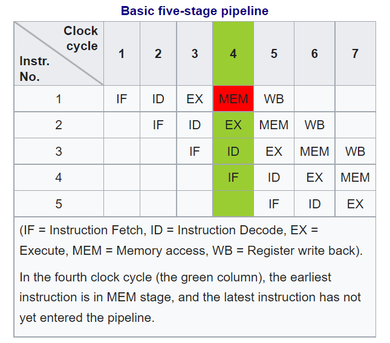

### 9.3.1 指令流水线的原理

常见的指令流水线的前提是一个指令执行过程中能被切割成好几块，当前主流的做法是切分成5个时钟周期来执行，也称为经典RISC流水线。在这个流水线中一条执行时间是5个时钟周期，但执行5个指令也只需要7个时钟周期，相对不做指令级并行的时候5*5=25个时钟周期而言，并行效果不言而喻。

#### 9.3.1.1 IF

指令获取，Instruction Fetch，从代码段中获取指令。

#### 9.3.1.2 ID

指令解码，Instruction Decode，计算机体系架构设计上，除了软件接口指令集外，最核心的就是微架构，所以一般软件生成的指令，还需要翻译成机器能识别的微指令，这样才能真正执行。

#### 9.3.1.3 EX

执行，Execute。

#### 9.3.1.4 MEM

访问内存，Memory Access。

#### 9.3.1.5 WB

寄存器回写。

有很多处理器的流水线不是固定的，例如 Intel Pentium 4，由于x86是CISC，每个指令的长度本身就不一样，实际实现是指令的执行周期也不完全一样，Pentium 4的指令执行周期有的要7步，甚至最长20步的，但设计原理是类似的Recap13.ppt (live.com)（https://view.officeapps.live.com/op/view.aspx?src=https%3A%2F%2Fcse.hkust.edu.hk%2F~hamdi%2FClass%2FCOMP381-07%2FSlides-07%2FRecap13.ppt&wdOrigin=BROWSELINK）：

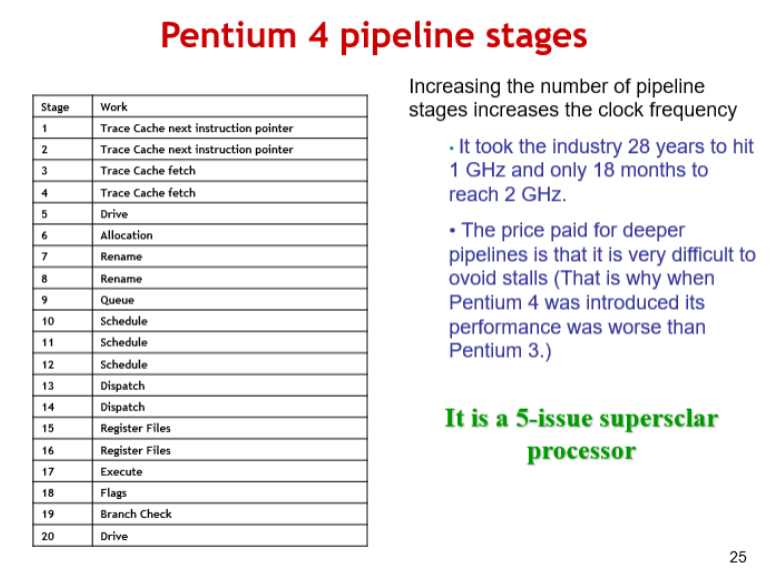

这些的并行的步骤，每个CPU（核）每次只能执行每类小步骤中的一步，不同类的小步骤是可以并发执行的，靠着将指令执行过程中的每个小步骤错开并行起来，就实现了指令流水线的功能。

如果指令的总的执行时间是固定的，那么切分出来的步骤越多，那并行效果就会越好，性能越好。

但是步骤越多，让程序能指令级并行起来，编译器的逻辑就越复杂，这种20步的流水线，估计得被编译器团队给喷死，所以后面x86体系架构再也没有突破20步 :)。

### 9.3.2 数据冲突

指令流水线能并发执行的前提是指令间没有数据冲突。如果指令I1的输入依赖指令I2的输出，那在I2执行完之前I1是没法执行的，这就是数据冲突的含义。数据冲突太多，就会造成编译器无法生成并行度很高的指令流水线序列，这种情况就会造成指令流水线熄火。

回到上面的例子，如果把$t2寄存器的读指令和写指令放到一起，那这2个指令就会造成指令流水线熄火：

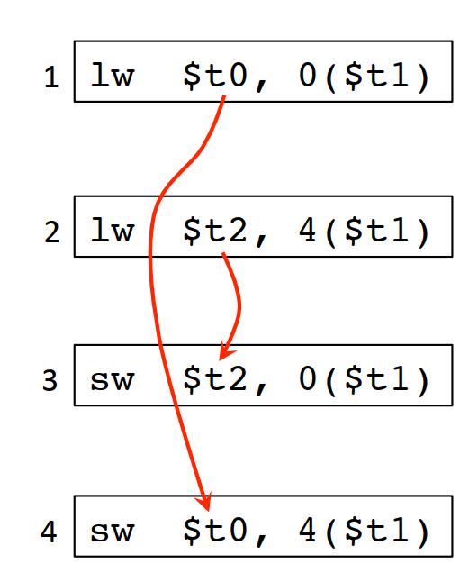

相反，如果把t0和t2寄存器的读写操作插花式排列开来，如果是2步的流水线，可以完全不熄火，对3步的流水线，最多只会熄火一步，所以后面这种插花的方式性能更好：

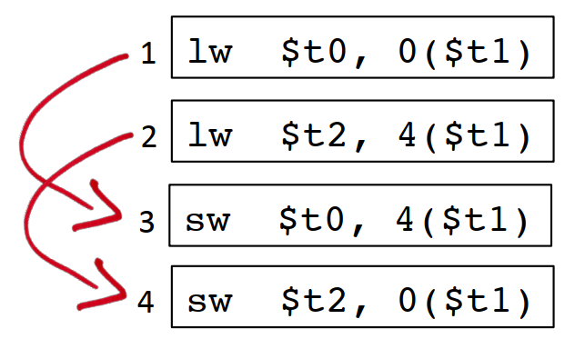

### 9.3.3 数据转发

如果某条指令的输出正好是后面指令的输入，处理器可以直接将结果转发给后面的指令：

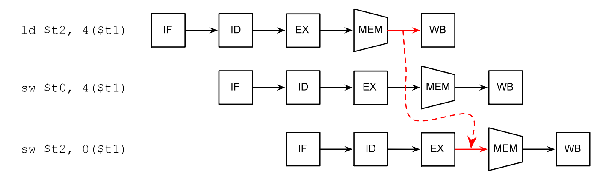

如果实在没办法，编译器会插入一些no-op指令，让处理器“怠速”一个时钟周期：

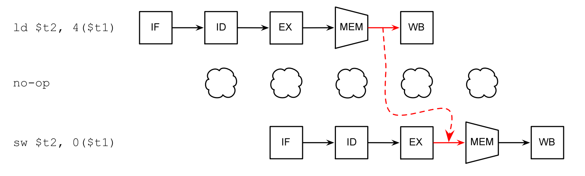

## 9.4 超标量体系架构

除了指令之间的流水线，超标量体系架构依赖指令内部的多条子指令之间的流水线来达到并行的效果。超标量体系架构其实依赖的是单个处理器中的多个IP（这里的IP不是TCP/IP协议栈里面的ip地址，是intellectual property的简称，是处理器里面可以用来拼装成一个大的处理的积木块，也是可以独立运行的处理单元）相互独立执行来实现的。例如一个VLIW（Very Long Instruction Words，超长指令字）里面可能既有主cpu的操作命令，也有DMA处理器的操作指令。一条GPU的指令里面，可能既有控制指令，也有数据指令。

## 9.5 寄存器和并行

寄存器导致的依赖分三种（下面的读、写都是相对于寄存器来说的）：

真实依赖，先写后读

lw $t0, 0($t1)
st $t0, 4($t1)

反依赖，先读后写

st $t0, 4($t1)
lw $t0, 0($t1)

输出依赖，连续写

lw $t0, 0($t1)
lw $t0, 4($t1)

除了第一种，后面两种如果寄存器数量足够的情况下，可以通过分配额外的寄存器来消除依赖。
寄存器分配算法让我们尽可能的少用寄存器，但多个变量复用同一个寄存器的做法又会额外注入数据依赖，使相关代码无法并行执行。

以(a + b) + c + (d + e)为例，默认寄存器分配算法结果是这样的：

1 LD r1, a

2 LD r2, b

3 ADD r1, r1, r2

4 LD r2, c

5 ADD r1, r1, r2

6 LD r2, d

7 LD r3, e

8 ADD r2, r2, r3

9 ADD r1, r1, r2

这样分配的结果，导致这些指令能并行的可能性非常小，仅1/2和6/7这种连续的LD指令可以并行，其他都必须等上一行执行完才能开始执行，9条指令需要7条指令顺序执行的时间。

但我们通过抽象语法树的分析看，d+e的计算，其实和这之前的两次加法也是不相干的，也可以并行；5个变量的LD指令，如果寄存器数量足够的情况下，也可以并行。

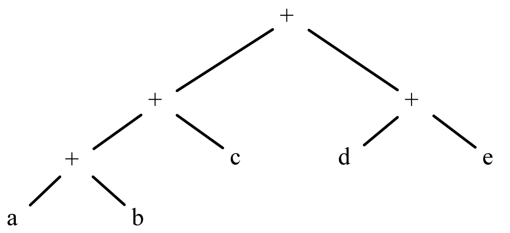

理想的并行结果是这样，只需要4条指令的执行时间就可以把这个计算完成：

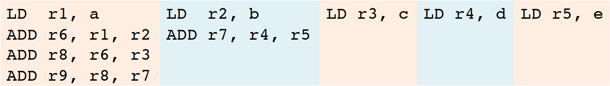

怎么样尽可能并行的前提下，减少寄存器的使用？

## 9.6 基本块调度

基本块调度（Basic Block Scheduling）也称本地调度（Local Scheduling）。主要使用指令依赖图（有的地方也称为数据依赖图）来进行分析，程序中的每条指令是一个节点，如果节点i1使用节点i0定义的变量，则存在一条边(i0, i1)。指令依赖图IDG中的每条边是一个delay，决定了最终至少需要多少个时钟周期才能完成程序执行。

以下面的程序为例：

1 LD R2, 0(R1)

2 ST 4(R1), R2

3 LD R3, 8(R1)

4 ADD R3, R3, R3

5 ADD R4, R3, R2

6 ST 12(R1), R4

7 ST 0(R7), R7

假定每条LD/ST指令需要5个时钟周期（除非LD指令紧接着ST指令，并且两个指令操作同一个内存地址，这种情况下ST指令只需要3个时钟周期），每条算术运行需要2个时钟周期，算一下该程序需要多少时钟周期？指令依赖图可以这样画：

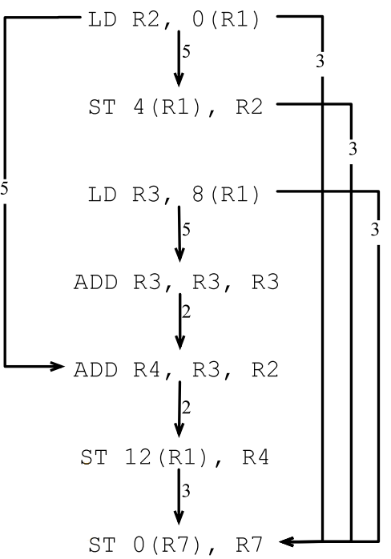

但即使不存在数据依赖，如果多个指令使用同一个资源，也需要排队，所以如果先调度LD R2, 0(R1)的话，需要的时钟周期是5+3+5+2+2+3+1=21个：

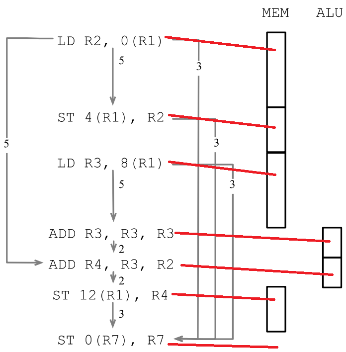

而先调度LD R3, 8(R1)的话，需要的时钟周期是5+5+3+3+1=17个。

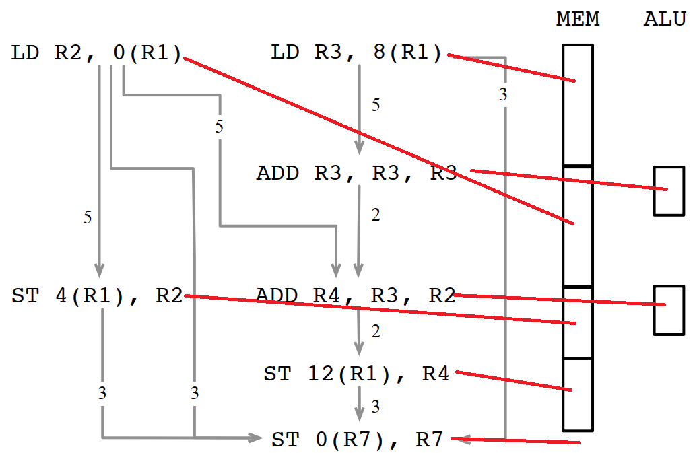

算法描述如下：

1 RT = empty reservation table

2 foreach vn ∈  V in some topological order:

3     s = MAX {S(p) + de | e = p→n ∈  E}  // 对所有n的前驱p，求p的执行开始时间和p到n之间的delay，并在其中取最大值，也就是节点n的执行开始时间

4     let i = MIN {x | RT(n, j, x) ∈  RT} in

5         s' = s + MAX(0, i – s)

6         RT(n, j, s') = vn // 在所有可获得的RT资源中，取高度最小的一个资源申请表，来调度n

下面是龙书上的算法描述，可以对照起来看：

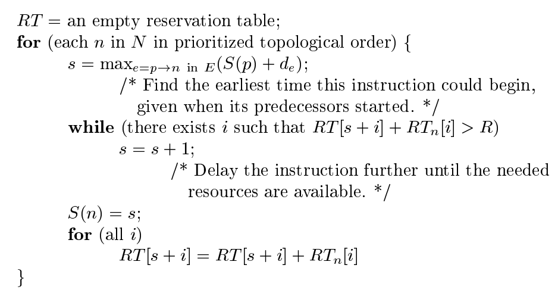

生成的资源调度图如下：

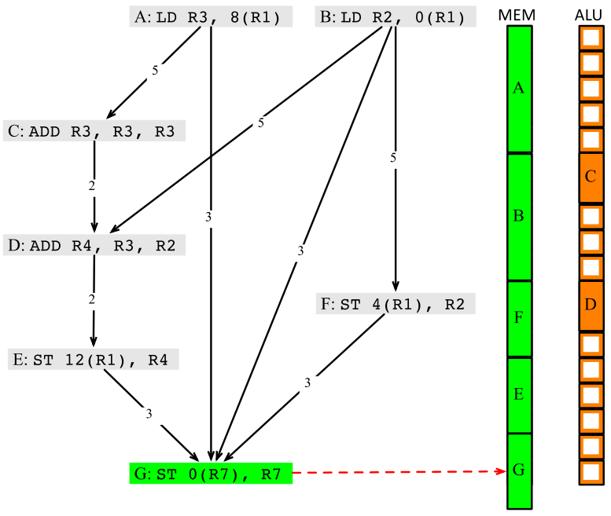

## 9.7 全局代码调度

先看一个简单的例子：

1 if (a != 0) {

2     c = b

3 }

4 e = d + d

优化前后的指令如下，红色部分是做了指令移动的代码：

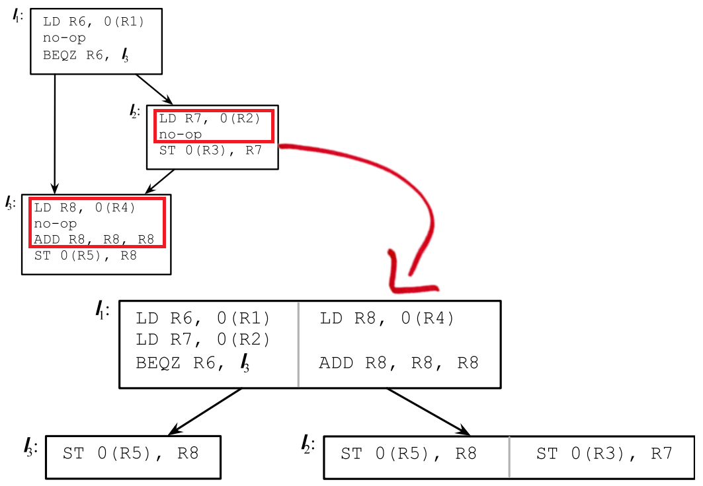

上面每个框里面有个灰色的线，将两块指令放在了一起，在普通体系架构下，只是简单的将他们进行流水线排序，如果在VLIW体系架构下，实际上是可以真正并发执行的，带来的效果类似这样：

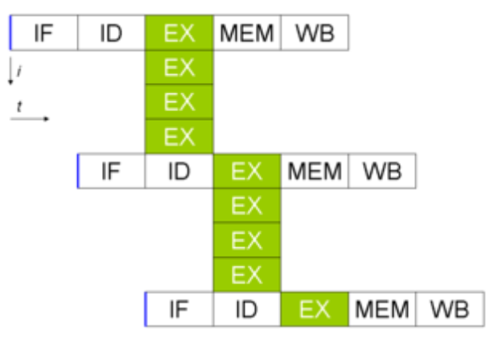

实际上全局代码调度相对于一个基本块内的调度要复杂得多，主要涉及代码移动，不安全的决策，额外执行了可能不需要的指令等问题。

后支配（Postdominate）：如果一个节点dst到程序终止的所有路径都要经过节点src，则称为src对dst有后支配关系。

控制流一致性（Control Equivalence）：如果dst支配src，并且src后支配dst，则说明src和dst是控制一致的。

如果代码移动前后对应的位置具有控制流一致性，则这种迁移理论上是安全的。

### 9.7.1 代码上移

相应的，如果上移的代码不具备后支配性，则可能在某些场景下会多执行代码。

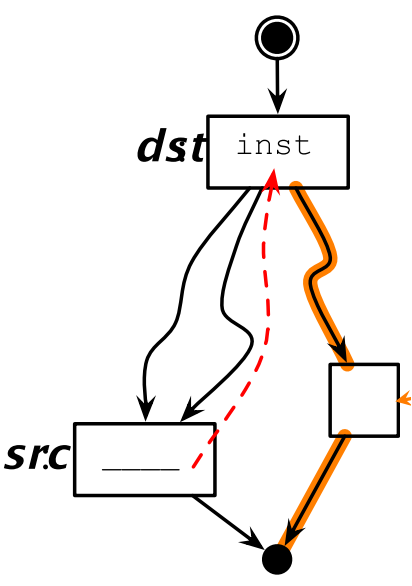

同样的，如果上移的代码不是源位置的支配节点，则需要在其他路径上插入补偿代码，来确保上移的代码在各种场景下都能执行到。

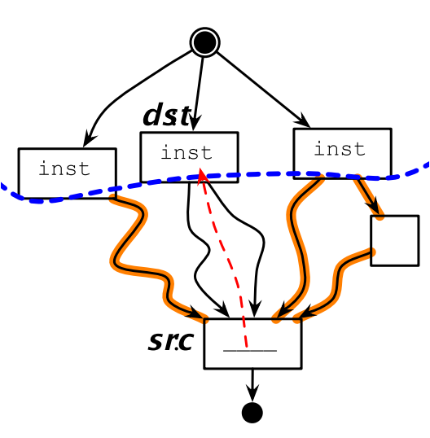

### 9.7.2 代码下移

如果src不是dst的支配节点的话，下移代码可能会覆盖另外一个分支的值：

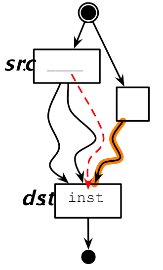

下行代码迁移也会有补偿代码的问题：

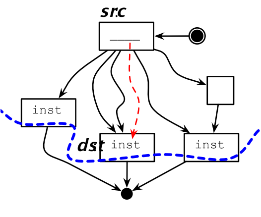

### 9.7.3 超级块

超级块是将多个基本块合并成的一个新的基本块。

例如对下面4个基本块：

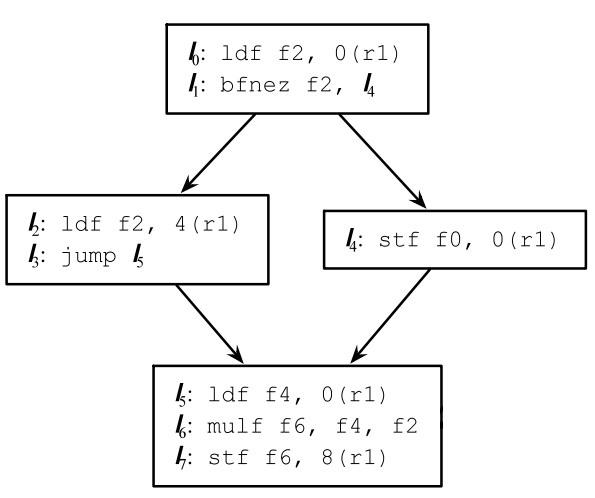

通过合并可以变成2个基本块，少了3次跳转指令，流水线就能更快的优化运行：

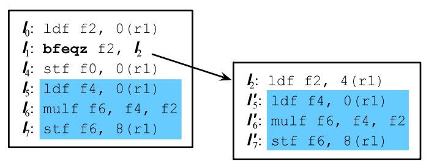

超级块的生成过程更通用一点的做法就是把DAG转换成树的过程：

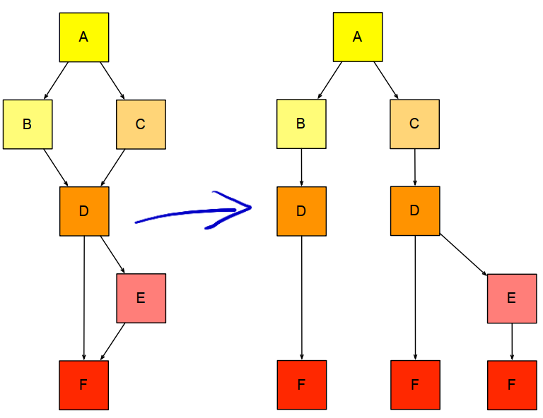

### 9.7.4 静态profiling技术

通过一些先验的概率，推断某些分支走到的可能性，来优化概率更高的分支执行速率的方法。

但多个先验概率有可能是相互矛盾的，有时需要在多个先验概率直接做一些妥协，或者计算加权概率，最有名的是Dempster-Shafer定理：

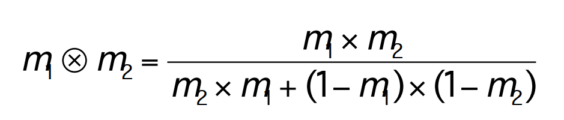

## 9.8 指令级并行研究历史

Hennessy, J. L. and D. A. Patterson, Computer Architecture: A Quantitative Approach, Third Edition, 2003. 计算机体系架构的经典书，学编译器必看系列，本章的大多数描述来自这本书。

Kuck, D., Y. Muraoka, and S. Chen, On the number of operations simultaneously executable in Fortran-like programs and their resulting speedup. IEEE Transactions on Computers, pp. 1293-1310, 1972.

Bernstein, D. and M. Rodeh, Global instruction scheduling for super-scalar machines, PLDI, pp. 241-255, 1991.

## 9.9 LLVM的指令级并行实现

### 9.9.1 LLVM中的基于SelectionDAG依赖图的指令调度

llvm\lib\CodeGen\SelectionDAG\ScheduleDAGSDNodes.cpp

llvm\lib\CodeGen\SelectionDAG\ScheduleDAGSDNodes.cpp

|   | // 定义调试类型，用于识别和过滤调试信息。 |
| --- | --- |
| 37 | #define DEBUG_TYPE "pre-RA-sched" |
|   | // 定义一个统计变量，用于记录聚集在一起的加载指令的数量。 |
| 38 |  |
| 39 | STATISTIC(LoadsClustered, "Number of loads clustered together"); |
|   | // 定义一个命令行选项，用于设置高延迟指令的粗略估计周期数。 |
|   | // 这个选项对于没有目标行程表（itinerary）的机器特别有用， |
|   | // 因为它们需要一种方法来识别高延迟指令。 |
|   | // 这个数字的选择更多地与调度启发式的平衡有关，而不是实际的机器延迟。 |
| 40 |  |
| 41 | // This allows the latency-based scheduler to notice high latency instructions |
| 42 | // without a target itinerary. The choice of number here has more to do with |
| 43 | // balancing scheduler heuristics than with the actual machine latency. |
| 44 | static cl::opt<int> HighLatencyCycles( |
| 45 | "sched-high-latency-cycles", cl::Hidden, cl::init(10), |
| 46 | cl::desc("Roughly estimate the number of cycles that 'long latency'" |
| 47 | "instructions take for targets with no itinerary")); |
|   | // ScheduleDAGSDNodes类的构造函数。 |
|   | // 这个类继承自ScheduleDAG，用于在SelectionDAG到DAG的调度过程中进行操作。 |
| 48 |  |
| 49 | ScheduleDAGSDNodes::ScheduleDAGSDNodes(MachineFunction &mf) |
| 50 | : ScheduleDAG(mf), BB(nullptr), DAG(nullptr), |
| 51 | InstrItins(mf.getSubtarget().getInstrItineraryData()) {} |
|   | /// Run - 执行指令调度。 |
| 52 |  |
| 53 | /// |
|   | /// 这个函数是ScheduleDAGSDNodes类的主要入口点， |
|   | /// 它接收一个SelectionDAG和一个MachineBasicBlock， |
|   | /// 然后执行指令调度。 |
| 54 | /// Run - perform scheduling. |
| 58 |  |
| 62 |  |
| 66 |  |
| 67 | /// |
| 68 | void ScheduleDAGSDNodes::Run(SelectionDAG *dag, MachineBasicBlock *bb) { |
| 69 | BB = bb; |
| 70 | DAG = dag; |
|   | // 清除调度器的SUnit DAG，为新的调度做准备。 |
| 71 | // Clear the scheduler's SUnit DAG. |
| 72 | ScheduleDAG::clearDAG(); |
| 73 | Sequence.clear(); |
|   | // 调用目标特定的调度选择。 |
| 74 | // Invoke the target's selection of scheduler. |
| 75 | Schedule(); |
| 88 | } |
|   | /// newSUnit - 创建一个新的SUnit并返回指向它的指针。 |
| 89 | /// |
|   | /// 这个函数用于创建一个新的SUnit，它包含了一个指令节点（SDNode）的调度信息。 |
| 90 | /// NewSUnit - Creates a new SUnit and return a ptr to it. |
| 91 | /// |
| 92 | SUnit *ScheduleDAGSDNodes::newSUnit(SDNode *N) { |
| 93 | #ifndef NDEBUG |
|   | // 在非调试模式下，我们不关心向量的重新分配，但在调试模式下，我们检查这一点。 |
| 94 | const SUnit *Addr = nullptr; |
| 95 | if (!SUnits.empty()) |
| 96 | Addr = &SUnits[0]; |
| 97 | #endif |
|   | // 在SUnits向量中添加一个新的SUnit。 |
| 98 | SUnits.emplace_back(N, (unsigned)SUnits.size()); |
|   | // 确保SUnits向量没有在运行时被重新分配。 |
| 99 | assert((Addr == nullptr || Addr == &SUnits[0]) && |
| 100 | "SUnits std::vector reallocated on the fly!"); |
|   | // 设置SUnit的原始节点。 |
| 101 | SUnits.back().OrigNode = &SUnits.back(); |
|   | // 返回新创建的SUnit的指针。 |
| 102 | SUnit *SU = &SUnits.back(); |
|   | // 获取目标Lowering信息。 |
| 103 | const TargetLowering &TLI = DAG->getTargetLoweringInfo(); |
|   | // 如果节点是隐式定义或者为空，则设置调度偏好为None。 |
| 104 | if (!N || |
| 105 | (N->isMachineOpcode() && |
| 106 | N->getMachineOpcode() == TargetOpcode::IMPLICIT_DEF)) |
| 107 | SU->SchedulingPref = Sched::None; |
| 108 | else |
|   | // 根据目标Lowering信息设置调度偏好。 |
| 109 | SU->SchedulingPref = TLI.getSchedulingPreference(N); |
| 110 | return SU; |
| 111 | } |
|   | /// Clone - 克隆一个SUnit并返回指向新的SUnit的指针。 |
| 112 | /// |
|   | /// 这个函数用于克隆一个SUnit，复制它的所有属性到新的SUnit。 |
| 113 | SUnit *ScheduleDAGSDNodes::Clone(SUnit *Old) { |
|   | // 创建一个新的SUnit，使用Old节点的SDNode。 |
| 114 | SUnit *SU = newSUnit(Old->getNode()); |
|   | // 复制Old SUnit的所有属性到新的SUnit。 |
| 115 | SU->OrigNode = Old->OrigNode; |
| 116 | SU->Latency = Old->Latency; |
| 117 | SU->isVRegCycle = Old->isVRegCycle; |
| 118 | SU->isCall = Old->isCall; |
| 119 | SU->isCallOp = Old->isCallOp; |
| 120 | SU->isTwoAddress = Old->isTwoAddress; |
| 121 | SU->isCommutable = Old->isCommutable; |
| 122 | SU->hasPhysRegDefs = Old->hasPhysRegDefs; |
| 123 | SU->hasPhysRegClobbers = Old->hasPhysRegClobbers; |
| 124 | SU->isScheduleHigh = Old->isScheduleHigh; |
| 125 | SU->isScheduleLow = Old->isScheduleLow; |
| 126 | SU->SchedulingPref = Old->SchedulingPref; |
|   | // 标记原始SUnit为已克隆。 |
| 127 | Old->isCloned = true; |
| 128 | return SU; |
| 131 | } |
|   | /// CheckForPhysRegDependency - 检查指定操作数的def和use之间 |
|   | /// 是否存在物理寄存器依赖。 |
|   | /// 如果存在，返回寄存器和复制该寄存器的成本。 |
| 132 | /// CheckForPhysRegDependency - Check if the dependency between def and use of |
| 133 | /// a specified operand is a physical register dependency. If so, returns the |
| 134 | /// register and the cost of copying the register. |
| 135 | static void CheckForPhysRegDependency(SDNode *Def, SDNode *User, unsigned Op, |
| 136 | const TargetRegisterInfo *TRI, |
| 137 | const TargetInstrInfo *TII, |
| 138 | unsigned &PhysReg, int &Cost) { |
|   | // 如果操作数不是第二个操作数或者用户节点的opcode不是ISD::CopyToReg， |
|   | // 则返回。 |
| 139 | if (Op != 2 || User->getOpcode() != ISD::CopyToReg) |
| 140 | return; |
|   | // 获取用户节点的第一个操作数，它是一个寄存器。 |
| 141 | unsigned Reg = cast<RegisterSDNode>(User->getOperand(1))->getReg(); |
|   | // 如果寄存器是虚拟寄存器，则返回。 |
| 142 | if (Register::isVirtualRegister(Reg)) |
| 143 | return; |
|   | // 获取被复制的值的资源编号。 |
| 144 | unsigned ResNo = User->getOperand(2).getResNo(); |
|   | // 如果Def节点是一个CopyFromReg节点，并且它的寄存器与 |
|   | // User节点的寄存器相同，则设置物理寄存器。 |
| 145 | if (Def->getOpcode() == ISD::CopyFromReg && |
| 146 | cast<RegisterSDNode>(Def->getOperand(1))->getReg() == Reg) { |
| 147 | PhysReg = Reg; |
| 148 | } else if (Def->isMachineOpcode()) { |
|   | // 获取Def节点的指令描述。 |
| 149 | const MCInstrDesc &II = TII->get(Def->getMachineOpcode()); |
|   | // 如果ResNo在隐式定义的寄存器范围内，并且隐式定义的寄存器 |
|   | // 与User节点的寄存器相同，则设置物理寄存器。 |
| 150 | if (ResNo >= II.getNumDefs() && |
| 151 | II.ImplicitDefs[ResNo - II.getNumDefs()] == Reg) |
| 152 | PhysReg = Reg; |
| 154 |  |
| 156 |  |
| 160 | } |
|   | // 如果找到了物理寄存器，则计算复制该寄存器的成本。 |
| 161 | if (PhysReg != 0) { |
| 162 | const TargetRegisterClass *RC = |
| 163 | TRI->getMinimalPhysRegClass(Reg, Def->getSimpleValueType(ResNo)); |
| 164 | Cost = RC->getCopyCost(); |
| 167 |  |
| 172 | } |
| 175 |  |
| 179 |  |
| 181 |  |
| 183 | } |
|   | /// CloneNodeWithValues - 辅助函数，用于克隆节点操作数。 |
| 184 | // Helper for AddGlue to clone node operands. |
| 185 | static void CloneNodeWithValues(SDNode *N, SelectionDAG *DAG, ArrayRef<EVT> VTs, |
| 186 | SDValue ExtraOper = SDValue()) { |
|   | // 创建操作数的副本。 |
| 187 | SmallVector<SDValue, 8> Ops(N->op_begin(), N->op_end()); |
| 188 | if (ExtraOper.getNode()) |
| 189 | Ops.push_back(ExtraOper); |
|   | // 获取新的值类型列表。 |
| 190 | SDVTList VTList = DAG->getVTList(VTs); |
| 191 | MachineSDNode *MN = dyn_cast<MachineSDNode>(N); |
|   | // 存储内存引用。 |
| 192 | // Store memory references. |
| 193 | SmallVector<MachineMemOperand *, 2> MMOs; |
| 194 | if (MN) |
| 195 | MMOs.assign(MN->memoperands_begin(), MN->memoperands_end()); |
|   | // 克隆节点。 |
| 196 | DAG->MorphNodeTo(N, N->getOpcode(), VTList, Ops); |
|   | // 重置内存引用。 |
| 197 | // Reset the memory references |
| 198 | if (MN) |
| 199 | DAG->setNodeMemRefs(MN, MMOs); |
| 200 | } |
|   | /// AddGlue - 添加胶合节点。 |
| 201 | static bool AddGlue(SDNode *N, SDValue Glue, bool AddGlue, SelectionDAG *DAG) { |
| 202 | SDNode *GlueDestNode = Glue.getNode(); |
|   | // 不要向自身添加胶合。 |
| 203 | // Don't add glue from a node to itself. |
| 204 | if (GlueDestNode == N) return false; |
|   | // 不要向已经使用胶合的节点添加胶合操作数。 |
| 205 | // Don't add a glue operand to something that already uses glue. |
| 206 | if (GlueDestNode && |
| 207 | N->getOperand(N->getNumOperands()-1).getValueType() == MVT::Glue) { |
| 208 |  |
| 218 |  |
| 219 | return false; |
| 220 | } |
|   | // 不要向已经有胶合值的节点添加胶合。 |
| 221 | // Don't add glue to something that already has a glue value. |
| 222 | if (N->getValueType(N->getNumValues() - 1) == MVT::Glue) return false; |
|   | // 获取节点的值类型列表。 |
| 223 | SmallVector<EVT, 4> VTs(N->value_begin(), N->value_end()); |
| 224 | if (AddGlue) |
| 225 | VTs.push_back(MVT::Glue); |
|   | // 克隆节点并添加额外的操作数。 |
| 226 | CloneNodeWithValues(N, DAG, VTs, Glue); |
| 227 | return true; |
| 228 | } |
|   | /// RemoveUnusedGlue - 在添加胶合操作未成功之后进行清理。 |
|   | /// 使用标准的方法来变形节点，尽管仅仅缩减值列表就足够了。 |
| 229 | // Cleanup after unsuccessful AddGlue. Use the standard method of morphing the |
| 230 | // node even though simply shrinking the value list is sufficient. |
| 231 | static void RemoveUnusedGlue(SDNode *N, SelectionDAG *DAG) { |
|   | // 断言检查N的最后一个值类型是MVT::Glue，并且没有节点使用这个胶合值。 |
| 232 | assert((N->getValueType(N->getNumValues() - 1) == MVT::Glue && |
| 233 | !N->hasAnyUseOfValue(N->getNumValues() - 1)) && |
| 234 | "expected an unused glue value"); |
|   | // 克隆节点，但不包括最后一个值类型（即MVT::Glue）。 |
| 235 | CloneNodeWithValues(N, DAG, |
| 236 | makeArrayRef(N->value_begin(), N->getNumValues() - 1)); |
| 240 |  |
| 251 | } |
|   | /// ClusterNeighboringLoads - 通过“胶合”将邻近的加载指令聚集在一起。 |
|   | /// 这个函数查找具有相同基指针和不同偏移量的加载指令。 |
|   | /// 如果偏移量之间的距离不远（目标特定）， |
|   | /// 它会添加MVT::Glue输入和输出，以确保它们被一起调度并且顺序正确。 |
|   | /// 这种优化可能通过提高缓存局部性来使某些目标受益。 |
| 252 | /// ClusterNeighboringLoads - Force nearby loads together by "gluing" them. |
| 253 | /// This function finds loads of the same base and different offsets. If the |
| 254 | /// offsets are not far apart (target specific), it add MVT::Glue inputs and |
| 255 | /// outputs to ensure they are scheduled together and in order. This |
| 256 | /// optimization may benefit some targets by improving cache locality. |
| 257 | void ScheduleDAGSDNodes::ClusterNeighboringLoads(SDNode *Node) { |
| 258 | SDValue Chain; |
| 259 | unsigned NumOps = Node->getNumOperands(); |
|   | // 获取最后一个操作数，它应该是一个链（chain）操作数，用于指令之间的依赖。 |
| 260 | if (Node->getOperand(NumOps-1).getValueType() == MVT::Other) |
| 261 | Chain = Node->getOperand(NumOps-1); |
| 262 | if (!Chain) |
| 264 | return; |
|   | // 跳过任何有捆绑输入的加载指令。可能存在额外的依赖关系， |
|   | // 需要不同的顺序，而且添加的胶合可能会导致循环。 |
| 265 | // Skip any load instruction that has a tied input. There may be an additional |
| 266 | // dependency requiring a different order than by increasing offsets, and the |
| 267 | // added glue may introduce a cycle. |
| 268 | auto hasTiedInput = [this](const SDNode *N) { |
| 269 | const MCInstrDesc &MCID = TII->get(N->getMachineOpcode()); |
| 270 | for (unsigned I = 0; I != MCID.getNumOperands(); ++I) { |
| 271 | if (MCID.getOperandConstraint(I, MCOI::TIED_TO) != -1) |
| 272 | return true; |
| 282 | } |
| 283 | return false; |
| 284 | }; |
|   | // 查找其他具有相同链的加载指令。找到从相同基指针加载且偏移量不同的加载指令。 |
| 285 | // Look for other loads of the same chain. Find loads that are loading from |
| 286 | // the same base pointer and different offsets. |
| 287 | SmallPtrSet<SDNode*, 16> Visited; |
| 288 | SmallVector<int64_t, 4> Offsets; |
| 289 | DenseMap<long long, SDNode*> O2SMap;  // Map from offset to SDNode. |
| 290 | bool Cluster = false; |
| 291 | SDNode *Base = Node; |
| 292 | if (hasTiedInput(Base)) |
| 293 | return; |
|   | // 此算法需要在找到匹配之前使用次数相对较低，以避免在大型块中无用地增加编译时间。 |
| 294 | // This algorithm requires a reasonably low use count before finding a match |
| 295 | // to avoid uselessly blowing up compile time in large blocks. |
| 296 | unsigned UseCount = 0; |
| 297 | for (SDNode::use_iterator I = Chain->use_begin(), E = Chain->use_end(); |
| 298 | I != E && UseCount < 100; ++I, ++UseCount) { |
| 299 | if (I.getUse().getResNo() != Chain.getResNo()) |
| 300 | continue; |
| 301 | SDNode *User = *I; |
| 302 | if (User == Node || !Visited.insert(User).second) |
| 309 |  |
| 316 | continue; |
| 317 | int64_t Offset1, Offset2; |
|   | // 如果用户节点和基节点不是从相同的基指针加载，或者偏移量相同， |
|   | // 或者用户节点有捆绑输入，则继续。 |
| 318 | if (!TII->areLoadsFromSameBasePtr(Base, User, Offset1, Offset2) || |
| 319 | Offset1 == Offset2 || |
| 320 | hasTiedInput(User)) { |
|   | // FIXME: 如果地址相同应该是可以的。 |
|   | // 但是早期优化应该已经消除了其中一个加载。 |
| 321 | // FIXME: Should be ok if they addresses are identical. But earlier |
| 322 | // optimizations really should have eliminated one of the loads. |
| 323 | continue; |
| 324 | } |
| 325 | if (O2SMap.insert(std::make_pair(Offset1, Base)).second) |
| 326 | Offsets.push_back(Offset1); |
| 327 | O2SMap.insert(std::make_pair(Offset2, User)); |
| 328 | Offsets.push_back(Offset2); |
| 329 | if (Offset2 < Offset1) |
| 330 | Base = User; |
| 331 | Cluster = true; |
|   | // 重置UseCount以允许更多匹配。 |
| 332 | // Reset UseCount to allow more matches. |
| 333 | UseCount = 0; |
| 334 | } |
| 335 | if (!Cluster) |
| 336 | return; |
|   | // 将偏移量按递增顺序排序。 |
| 337 | // Sort them in increasing order. |
| 338 | llvm::sort(Offsets); |
|   | // 检查加载是否足够接近。 |
| 339 | // Check if the loads are close enough. |
| 340 | SmallVector<SDNode*, 4> Loads; |
| 341 | unsigned NumLoads = 0; |
| 342 | int64_t BaseOff = Offsets[0]; |
| 343 | SDNode *BaseLoad = O2SMap[BaseOff]; |
| 344 | Loads.push_back(BaseLoad); |
| 345 | for (unsigned i = 1, e = Offsets.size(); i != e; ++i) { |
| 346 | int64_t Offset = Offsets[i]; |
| 347 | SDNode *Load = O2SMap[Offset]; |
| 348 | if (!TII->shouldScheduleLoadsNear(BaseLoad, Load, BaseOff, Offset,NumLoads)) |
| 349 | break; // Stop right here. Ignore loads that are further away. |
| 350 | Loads.push_back(Load); |
| 351 | ++NumLoads; |
| 352 | } |
| 353 | if (NumLoads == 0) |
| 354 | return; |
|   | // 通过添加MVT::Glue输出和输入来聚集加载。 |
|   | // 这也确保它们按地址递增的顺序被调度。 |
| 355 | // Cluster loads by adding MVT::Glue outputs and inputs. This also |
| 356 | // ensure they are scheduled in order of increasing addresses. |
| 357 | SDNode *Lead = Loads[0]; |
| 358 | SDValue InGlue = SDValue(nullptr, 0); |
| 359 | if (AddGlue(Lead, InGlue, true, DAG)) |
| 360 | InGlue = SDValue(Lead, Lead->getNumValues() - 1); |
| 361 | for (unsigned I = 1, E = Loads.size(); I != E; ++I) { |
| 362 | bool OutGlue = I < E - 1; |
| 363 | SDNode *Load = Loads[I]; |
|   | // 如果AddGlue失败，我们可能会留下一个未使用的胶合值。 |
|   | // 这应该不会导致任何问题。 |
| 364 | // If AddGlue fails, we could leave an unsused glue value. This should not |
| 365 | // cause any |
| 366 | if (AddGlue(Load, InGlue, OutGlue, DAG)) { |
| 367 | if (OutGlue) |
| 368 | InGlue = SDValue(Load, Load->getNumValues() - 1); |
| 369 | ++LoadsClustered; |
| 379 | } |
| 380 | else if (!OutGlue && InGlue.getNode()) |
| 381 | RemoveUnusedGlue(InGlue.getNode(), DAG); |
| 382 | } |
| 383 | } |
|   | /// ClusterNodes - 聚集应该一起调度的特定节点。 |
| 384 | /// ClusterNodes - Cluster certain nodes which should be scheduled together. |
| 385 | /// |
| 386 | void ScheduleDAGSDNodes::ClusterNodes() { |
| 387 | for (SDNode &NI : DAG->allnodes()) { |
| 388 | SDNode *Node = &NI; |
|   | // 跳过空节点和非机器指令节点。 |
| 389 | if (!Node || !Node->isMachineOpcode()) |
| 390 | continue; |
| 391 | unsigned Opc = Node->getMachineOpcode(); |
| 392 | const MCInstrDesc &MCID = TII->get(Opc); |
|   | // 如果节点可能加载数据，则将来自“附近”地址的加载聚集到组合的SUnit中。 |
| 393 | if (MCID.mayLoad()) |
| 394 | // Cluster loads from "near" addresses into combined SUnits. |
| 395 | ClusterNeighboringLoads(Node); |
| 398 | } |
| 400 | } |
| 401 | void ScheduleDAGSDNodes::BuildSchedUnits() { |
|   | // 在调度期间，SDNode的NodeId字段被用来映射SDNodes到它们关联的SUnits， |
|   | // 通过保存SUnits表索引。值为-1表示SDNode尚未有关联的SUnit。 |
| 402 | // During scheduling, the NodeId field of SDNode is used to map SDNodes |
| 403 | // to their associated SUnits by holding SUnits table indices. A value |
| 404 | // of -1 means the SDNode does not yet have an associated SUnit. |
| 405 | unsigned NumNodes = 0; |
| 406 | for (SDNode &NI : DAG->allnodes()) { |
| 407 | NI.setNodeId(-1); |
| 408 | ++NumNodes; |
| 410 |  |
| 417 |  |
| 420 |  |
| 423 | } |
|   | // 为正在创建的每个SUnit预留向量条目。这确保了向量不会重新分配， |
|   | // 因此SUnit*不会被使无效。 |
|   | // FIXME: 乘以2因为我们在调度期间可能会克隆节点。这是一个临时的解决方案。 |
| 424 | // Reserve entries in the vector for each of the SUnits we are creating.  This |
| 425 | // ensure that reallocation of the vector won't happen, so SUnit*'s won't get |
| 426 | // invalidated. |
| 427 | // FIXME: Multiply by 2 because we may clone nodes during scheduling. |
| 428 | // This is a temporary workaround. |
| 429 | SUnits.reserve(NumNodes * 2); |
|   | // 以深度优先的顺序添加所有节点。 |
| 430 | // Add all nodes in depth first order. |
| 431 | SmallVector<SDNode*, 64> Worklist; |
| 432 | SmallPtrSet<SDNode*, 32> Visited; |
| 433 | Worklist.push_back(DAG->getRoot().getNode()); |
| 434 | Visited.insert(DAG->getRoot().getNode()); |
| 435 | SmallVector<SUnit*, 8> CallSUnits; |
| 436 | while (!Worklist.empty()) { |
| 437 | SDNode *NI = Worklist.pop_back_val(); |
|   | // 将所有操作数添加到工作列表中，除非它们已经被添加。 |
| 438 | // Add all operands to the worklist unless they've already been added. |
| 439 | for (const SDValue &Op : NI->op_values()) |
| 440 | if (Visited.insert(Op.getNode()).second) |
| 441 | Worklist.push_back(Op.getNode()); |
| 442 | if (isPassiveNode(NI))  // Leaf node, e.g. a TargetImmediate. |
| 443 | continue; |
|   | // 如果这个节点已经被处理，停止现在。 |
| 444 | // If this node has already been processed, stop now. |
| 445 | if (NI->getNodeId() != -1) continue; |
| 446 | SUnit *NodeSUnit = newSUnit(NI); |
|   | // 查找与这个节点胶合的任何节点，如果有，将它们添加到胶合节点中。 |
|   | // 节点最多可以有一个胶合输入和一个胶合输出。 |
|   | // 胶合必须是节点的最后一个操作数和结果。 |
|   | // 向上扫描以找到胶合的前置节点。 |
| 447 | // See if anything is glued to this node, if so, add them to glued |
| 448 | // nodes.  Nodes can have at most one glue input and one glue output.  Glue |
| 449 | // is required to be the last operand and result of a node. |
| 450 | // Scan up to find glued preds. |
| 451 | SDNode *N = NI; |
| 452 | while (N->getNumOperands() && |
| 453 | N->getOperand(N->getNumOperands()-1).getValueType() == MVT::Glue) { |
| 454 | N = N->getOperand(N->getNumOperands()-1).getNode(); |
| 455 | assert(N->getNodeId() == -1 && "Node already inserted!"); |
| 456 | N->setNodeId(NodeSUnit->NodeNum); |
| 457 | if (N->isMachineOpcode() && TII->get(N->getMachineOpcode()).isCall()) |
| 458 | NodeSUnit->isCall = true; |
| 459 | } |
|   | // 向下扫描以找到任何胶合的后继节点。 |
| 460 | // Scan down to find any glued succs. |
| 461 | N = NI; |
| 462 | while (N->getValueType(N->getNumValues()-1) == MVT::Glue) { |
| 463 | SDValue GlueVal(N, N->getNumValues()-1); |
|   | // 要么没有要么有一个胶合结果的用户。 |
| 464 | // There are either zero or one users of the Glue result. |
| 465 | bool HasGlueUse = false; |
| 466 | for (SDNode::use_iterator UI = N->use_begin(), E = N->use_end(); |
| 467 | UI != E; ++UI) |
| 468 | if (GlueVal.isOperandOf(*UI)) { |
| 469 | HasGlueUse = true; |
| 470 | assert(N->getNodeId() == -1 && "Node already inserted!"); |
| 471 | N->setNodeId(NodeSUnit->NodeNum); |
| 472 | N = *UI; |
| 473 | if (N->isMachineOpcode() && TII->get(N->getMachineOpcode()).isCall()) |
| 474 | NodeSUnit->isCall = true; |
| 475 | break; |
| 476 | } |
| 477 | if (!HasGlueUse) break; |
| 478 | } |
| 479 | if (NodeSUnit->isCall) |
| 480 | CallSUnits.push_back(NodeSUnit); |
|   | // 安排零延迟的TokenFactor在可能增加调度高度的节点下方。 |
|   | // 否则，TokenFactor的祖先可能会出现错误的停顿。 |
| 481 | // Schedule zero-latency TokenFactor below any nodes that may increase the |
| 482 | // schedule height. Otherwise, ancestors of the TokenFactor may appear to |
| 483 | // have false stalls. |
| 484 | if (NI->getOpcode() == ISD::TokenFactor) |
| 485 | NodeSUnit->isScheduleLow = true; |
|   | // 如果涉及胶合操作数，N现在是被胶合在一起的节点序列的底部节点。 |
|   | // 更新SUnit。 |
| 486 | // If there are glue operands involved, N is now the bottom-most node |
| 487 | // of the sequence of nodes that are glued together. |
| 488 | // Update the SUnit. |
| 489 | NodeSUnit->setNode(N); |
| 490 | assert(N->getNodeId() == -1 && "Node already inserted!"); |
| 491 | N->setNodeId(NodeSUnit->NodeNum); |
|   | // 计算NumRegDefsLeft。这必须在AddSchedEdges之前完成。 |
| 492 | // Compute NumRegDefsLeft. This must be done before AddSchedEdges. |
| 493 | InitNumRegDefsLeft(NodeSUnit); |
|   | // 使用目标提供的信息分配NodeSUnit的Latency字段。 |
| 494 | // Assign the Latency field of NodeSUnit using target-provided information. |
| 495 | computeLatency(NodeSUnit); |
| 496 | } |
|   | // 查找所有调用操作数。 |
| 497 | // Find all call operands. |
| 498 | while (!CallSUnits.empty()) { |
| 499 | SUnit *SU = CallSUnits.pop_back_val(); |
| 500 | for (const SDNode *SUNode = SU->getNode(); SUNode; |
| 501 | SUNode = SUNode->getGluedNode()) { |
| 502 | if (SUNode->getOpcode() != ISD::CopyToReg) |
| 503 | continue; |
| 504 | SDNode *SrcN = SUNode->getOperand(2).getNode(); |
| 505 | if (isPassiveNode(SrcN)) continue;   // Not scheduled. |
| 506 | SUnit *SrcSU = &SUnits[SrcN->getNodeId()]; |
| 507 | SrcSU->isCallOp = true; |
| 514 | } |
| 515 |  |
| 526 | } |
| 527 | } |
|   | // AddSchedEdges函数的功能是为SUnit图中的节点添加调度依赖边， |
|   | // 包括前驱、后继以及物理寄存器依赖等。 |
| 528 | void ScheduleDAGSDNodes::AddSchedEdges() { |
| 529 | const TargetSubtargetInfo &ST = MF.getSubtarget(); |
| 530 | // Check to see if the scheduler cares about latencies. |
| 531 | bool UnitLatencies = forceUnitLatencies(); |
| 532 | // Pass 2: add the preds, succs, etc. |
| 533 | for (unsigned su = 0, e = SUnits.size(); su != e; ++su) { |
| 534 | SUnit *SU = &SUnits[su]; |
| 535 | SDNode *MainNode = SU->getNode(); |
| 536 | if (MainNode->isMachineOpcode()) { |
| 537 | unsigned Opc = MainNode->getMachineOpcode(); |
| 538 | const MCInstrDesc &MCID = TII->get(Opc); |
| 539 | for (unsigned i = 0; i != MCID.getNumOperands(); ++i) { |
|   | // 如果操作数被绑定，标记为二地址指令 |
| 540 | if (MCID.getOperandConstraint(i, MCOI::TIED_TO) != -1) { |
| 541 | SU->isTwoAddress = true; |
| 542 | break; |
| 543 | } |
| 544 |  |
| 550 |  |
| 557 | } |
|   | // 如果指令是可交换的，标记为可交换 |
| 558 | if (MCID.isCommutable()) |
| 559 | SU->isCommutable = true; |
| 563 | } |
| 564 | // Find all predecessors and successors of the group. |
| 565 | for (SDNode *N = SU->getNode(); N; N = N->getGluedNode()) { |
|   | // 如果指令有隐式定义的物理寄存器，标记 |
| 566 | if (N->isMachineOpcode() && |
| 567 | TII->get(N->getMachineOpcode()).getImplicitDefs()) { |
| 568 | SU->hasPhysRegClobbers = true; |
| 569 | unsigned NumUsed = InstrEmitter::CountResults(N); |
|   | // 跳过末尾未使用的值 |
| 570 | while (NumUsed != 0 && !N->hasAnyUseOfValue(NumUsed - 1)) |
| 571 | --NumUsed;    // Skip over unused values at the end. |
|   | // 如果使用的值多于定义的，标记 |
| 572 | if (NumUsed > TII->get(N->getMachineOpcode()).getNumDefs()) |
| 573 | SU->hasPhysRegDefs = true; |
| 577 | } |
| 578 | for (unsigned i = 0, e = N->getNumOperands(); i != e; ++i) { |
| 579 | SDNode *OpN = N->getOperand(i).getNode(); |
| 580 | unsigned DefIdx = N->getOperand(i).getResNo(); |
|   | // 如果节点是被动的，跳过 |
| 581 | if (isPassiveNode(OpN)) continue;   // Not scheduled. |
| 582 | SUnit *OpSU = &SUnits[OpN->getNodeId()]; |
| 583 | assert(OpSU && "Node has no SUnit!"); |
|   | // 如果在同一个组中，跳过 |
| 584 | if (OpSU == SU) continue;           // In the same group. |
| 585 | EVT OpVT = N->getOperand(i).getValueType(); |
| 586 | assert(OpVT != MVT::Glue && "Glued nodes should be in same sunit!"); |
| 587 | bool isChain = OpVT == MVT::Other; |
| 588 | unsigned PhysReg = 0; |
| 589 | int Cost = 1; |
|   | // 检查是否是物理寄存器依赖 |
| 590 | // Determine if this is a physical register dependency. |
| 591 | CheckForPhysRegDependency(OpN, N, i, TRI, TII, PhysReg, Cost); |
| 592 | assert((PhysReg == 0 || !isChain) && |
| 593 | "Chain dependence via physreg data?"); |
| 594 | // FIXME: See ScheduleDAGSDNodes::EmitCopyFromReg. For now, scheduler |
| 595 | // emits a copy from the physical register to a virtual register unless |
| 596 | // it requires a cross class copy (cost < 0). That means we are only |
| 597 | // treating "expensive to copy" register dependency as physical register |
| 598 | // dependency. This may change in the future though. |
| 599 | if (Cost >= 0 && !StressSched) |
| 600 | PhysReg = 0; |
|   | // 如果是控制依赖，延迟为1 |
| 601 | // If this is a ctrl dep, latency is 1. |
| 602 | unsigned OpLatency = isChain ? 1 : OpSU->Latency; |
|   | // 特殊处理TokenFactor链，延迟为0 |
| 603 | // Special-case TokenFactor chains as zero-latency. |
| 604 | if(isChain && OpN->getOpcode() == ISD::TokenFactor) |
| 605 | OpLatency = 0; |
| 606 | SDep Dep = isChain ? SDep(OpSU, SDep::Barrier) |
| 607 | : SDep(OpSU, SDep::Data, PhysReg); |
| 608 | Dep.setLatency(OpLatency); |
| 609 | if (!isChain && !UnitLatencies) { |
|   | // 计算操作数延迟 |
| 610 | computeOperandLatency(OpN, N, i, Dep); |
|   | // 调整调度依赖 |
| 611 | ST.adjustSchedDependency(OpSU, DefIdx, SU, i, Dep); |
| 612 |  |
| 615 |  |
| 622 | } |
| 623 | if (!SU->addPred(Dep) && !Dep.isCtrl() && OpSU->NumRegDefsLeft > 1) { |
|   | // 多个寄存器使用合并到同一个SUnit中，减少定义以平衡寄存器压力 |
| 624 | // Multiple register uses are combined in the same SUnit. For example, |
| 625 | // we could have a set of glued nodes with all their defs consumed by |
| 626 | // another set of glued nodes. Register pressure tracking sees this as |
| 627 | // a single use, so to keep pressure balanced we reduce the defs. |
| 629 |  |
| 638 |  |
| 639 | // |
| 640 | // We can't tell (without more book-keeping) if this results from |
| 641 | // glued nodes or duplicate operands. As long as we don't reduce |
| 642 | // NumRegDefsLeft to zero, we handle the common cases well. |
| 643 | --OpSU->NumRegDefsLeft; |
| 645 | } |
| 646 | } |
| 647 | } |
| 648 | } |
| 649 | } |
|   | // BuildSchedGraph函数的功能是从输入的SelectionDAG构建SUnit图。 |
|   | // SUnit图类似于SelectionDAG，但排除了与调度无关的节点， |
|   | // 并将粘合在一起的节点表示为单个SUnit。 |
| 650 | /// BuildSchedGraph - Build the SUnit graph from the selection dag that we |
| 651 | /// are input.  This SUnit graph is similar to the SelectionDAG, but |
| 652 | /// excludes nodes that aren't interesting to scheduling, and represents |
| 653 | /// glued together nodes with a single SUnit. |
| 654 | void ScheduleDAGSDNodes::BuildSchedGraph(AAResults *AA) { |
|   | // 将某些节点聚类，以便一起调度 |
| 655 | // Cluster certain nodes which should be scheduled together. |
| 656 | ClusterNodes(); |
|   | // 填充SUnits数组 |
| 657 | // Populate the SUnits array. |
| 658 | BuildSchedUnits(); |
|   | // 计算节点之间的所有调度依赖 |
| 659 | // Compute all the scheduling dependencies between nodes. |
| 660 | AddSchedEdges(); |
| 669 | } |
|   | // 初始化当前节点操作码的NumNodeDefs。 |
| 670 | // Initialize NumNodeDefs for the current Node's opcode. |
| 671 | void ScheduleDAGSDNodes::RegDefIter::InitNodeNumDefs() { |
|   | // 检查是否为物理寄存器复制。 |
| 672 | // Check for phys reg copy. |
| 673 | if (!Node) |
| 678 |  |
| 681 | return; |
|   | // 如果节点不是机器操作码，则根据其操作码初始化NumNodeDefs。 |
| 682 | if (!Node->isMachineOpcode()) { |
| 683 | if (Node->getOpcode() == ISD::CopyFromReg) |
| 684 | NodeNumDefs = 1; |
| 685 | else |
| 686 | NodeNumDefs = 0; |
| 687 | return; |
| 694 | } |
| 695 | unsigned POpc = Node->getMachineOpcode(); |
| 696 | if (POpc == TargetOpcode::IMPLICIT_DEF) { |
|   | // 对于此指令，不需要分配寄存器。 |
| 697 | // No register need be allocated for this. |
| 698 | NodeNumDefs = 0; |
| 699 | return; |
| 707 | } |
| 708 | if (POpc == TargetOpcode::PATCHPOINT && |
| 709 | Node->getValueType(0) == MVT::Other) { |
|   | // PATCHPOINT定义为有一个结果，但如果未使用CallingConv::AnyReg，则可能实际上没有结果。 |
|   | // 不要将链误认为是一个真正的定义。 |
| 710 | // PATCHPOINT is defined to have one result, but it might really have none |
| 711 | // if we're not using CallingConv::AnyReg. Don't mistake the chain for a |
| 712 | // real definition. |
| 713 | NodeNumDefs = 0; |
| 714 | return; |
| 716 | } |
| 717 | unsigned NRegDefs = SchedDAG->TII->get(Node->getMachineOpcode()).getNumDefs(); |
|   | // 有些指令定义了在选择DAG中未表示的寄存器（例如，未使用的标志）。 |
|   | // 确保我们不会访问超过NumValues。 |
| 718 | // Some instructions define regs that are not represented in the selection DAG |
| 719 | // (e.g. unused flags). Make sure we don't access past NumValues. |
| 720 | NodeNumDefs = std::min(Node->getNumValues(), NRegDefs); |
| 721 | DefIdx = 0; |
| 732 | } |
|   | // 构造一个RegDefIter用于这个SUnit，并找到第一个有效的值。 |
| 733 | // Construct a RegDefIter for this SUnit and find the first valid value. |
| 734 | ScheduleDAGSDNodes::RegDefIter::RegDefIter(const SUnit *SU, |
| 735 | const ScheduleDAGSDNodes *SD) |
| 736 | : SchedDAG(SD), Node(SU->getNode()), DefIdx(0), NodeNumDefs(0) { |
| 737 | InitNodeNumDefs(); |
| 738 | Advance(); |
| 739 | } |
|   | // 移动到SUnit定义的下一个有效值 |
| 740 | // Advance to the next valid value defined by the SUnit. |
| 741 | void ScheduleDAGSDNodes::RegDefIter::Advance() { |
|   | // 遍历所有粘合节点 |
| 742 | for (;Node;) { |
|   | // 遍历当前节点的所有定义 |
| 743 | for (;DefIdx < NodeNumDefs; ++DefIdx) { |
|   | // 如果当前定义没有被使用，则跳过 |
| 744 | if (!Node->hasAnyUseOfValue(DefIdx)) |
| 749 | continue; |
|   | // 获取当前定义的值类型 |
| 750 | ValueType = Node->getSimpleValueType(DefIdx); |
|   | // 移动到下一个定义 |
| 751 | ++DefIdx; |
|   | // 找到一个正常的寄存器定义，返回 |
| 752 | return; // Found a normal regdef. |
| 754 | } |
|   | // 移动到下一个粘合节点 |
| 755 | Node = Node->getGluedNode(); |
|   | // 如果没有更多节点，返回 |
| 756 | if (!Node) { |
| 757 | return; // No values left to visit. |
| 758 | } |
|   | // 初始化新节点的定义数量 |
| 759 | InitNodeNumDefs(); |
| 760 | } |
| 775 | } |
|   | // 初始化SUnit的剩余寄存器定义数量 |
| 776 | void ScheduleDAGSDNodes::InitNumRegDefsLeft(SUnit *SU) { |
| 777 | assert(SU->NumRegDefsLeft == 0 && "expect a new node"); |
| 778 | for (RegDefIter I(SU, this); I.IsValid(); I.Advance()) { |
| 779 | assert(SU->NumRegDefsLeft < USHRT_MAX && "overflow is ok but unexpected"); |
| 780 | ++SU->NumRegDefsLeft; |
| 783 | } |
| 784 | } |
|   | // 计算SUnit的延迟 |
| 785 | void ScheduleDAGSDNodes::computeLatency(SUnit *SU) { |
| 786 | SDNode *N = SU->getNode(); |
|   | // TokenFactor操作数的延迟被视为0，某些调度器（如Top-Down列表） |
|   | // 可能依赖于以下事实：当节点延迟非零时，操作数延迟也非零。 |
| 787 | // TokenFactor operands are considered zero latency, and some schedulers |
| 788 | // (e.g. Top-Down list) may rely on the fact that operand latency is nonzero |
| 789 | // whenever node latency is nonzero. |
| 790 | if (N && N->getOpcode() == ISD::TokenFactor) { |
| 791 | SU->Latency = 0; |
| 792 | return; |
| 793 | } |
|   | // 检查调度器是否关心延迟 |
| 794 | // Check to see if the scheduler cares about latencies. |
| 795 | if (forceUnitLatencies()) { |
| 796 | SU->Latency = 1; |
| 797 | return; |
| 809 | } |
| 810 | if (!InstrItins || InstrItins->isEmpty()) { |
|   | // 如果节点是机器操作码且是高延迟定义，则设置为高延迟周期 |
| 811 | if (N && N->isMachineOpcode() && |
| 812 | TII->isHighLatencyDef(N->getMachineOpcode())) |
| 813 | SU->Latency = HighLatencyCycles; |
| 814 | else |
|   | // 否则设置为默认延迟1 |
| 815 | SU->Latency = 1; |
| 816 | return; |
| 822 | } |
|   | // 计算节点的延迟。我们将所有粘合在一起的节点的延迟相加 |
| 823 | // Compute the latency for the node.  We use the sum of the latencies for |
| 824 | // all nodes glued together into this SUnit. |
| 825 | SU->Latency = 0; |
| 826 | for (SDNode *N = SU->getNode(); N; N = N->getGluedNode()) |
| 827 | if (N->isMachineOpcode()) |
| 828 | SU->Latency += TII->getInstrLatency(InstrItins, N); |
| 829 | } |
| 830 | void ScheduleDAGSDNodes::computeOperandLatency(SDNode *Def, SDNode *Use, |
| 831 | unsigned OpIdx, SDep& dep) const { |
|   | // 检查调度器是否关心延迟 |
| 832 | // Check to see if the scheduler cares about latencies. |
| 833 | if (forceUnitLatencies()) |
| 834 | return; |
|   | // 如果依赖类型不是数据依赖，直接返回 |
| 835 | if (dep.getKind() != SDep::Data) |
| 836 | return; |
|   | // 获取定义节点的结果索引 |
| 837 | unsigned DefIdx = Use->getOperand(OpIdx).getResNo(); |
| 838 | if (Use->isMachineOpcode()) |
|   | // 调整使用操作数的索引，跳过定义操作数 |
| 839 | // Adjust the use operand index by num of defs. |
| 840 | OpIdx += TII->get(Use->getMachineOpcode()).getNumDefs(); |
|   | // 获取操作数的延迟 |
| 841 | int Latency = TII->getOperandLatency(InstrItins, Def, DefIdx, Use, OpIdx); |
|   | // 如果延迟大于1且使用节点是CopyToReg操作，并且基本块有后继节点 |
| 842 | if (Latency > 1 && Use->getOpcode() == ISD::CopyToReg && |
| 843 | !BB->succ_empty()) { |
|   | // 获取目标寄存器 |
| 844 | unsigned Reg = cast<RegisterSDNode>(Use->getOperand(1))->getReg(); |
| 845 | if (Register::isVirtualRegister(Reg)) |
|   | // 如果寄存器是虚拟寄存器，减少延迟以避免对定义节点的惩罚 |
| 846 | // This copy is a liveout value. It is likely coalesced, so reduce the |
| 847 | // latency so not to penalize the def. |
| 848 | // FIXME: need target specific adjustment here? |
| 849 | Latency = (Latency > 1) ? Latency - 1 : 1; |
| 851 | } |
|   | // 如果延迟有效，设置依赖的延迟 |
| 852 | if (Latency >= 0) |
| 853 | dep.setLatency(Latency); |
| 856 |  |
| 860 |  |
| 866 | } |
| 867 | void ScheduleDAGSDNodes::dumpNode(const SUnit &SU) const { |
| 868 | #if !defined(NDEBUG) || defined(LLVM_ENABLE_DUMP) |
|   | // 打印节点名称 |
| 869 | dumpNodeName(SU); |
| 870 | dbgs() << ": "; |
|   | // 如果节点为空，打印物理寄存器拷贝信息 |
| 871 | if (!SU.getNode()) { |
| 872 | dbgs() << "PHYS REG COPY\n"; |
| 873 | return; |
| 874 |  |
| 877 | } |
|   | // 打印节点的详细信息 |
| 878 | SU.getNode()->dump(DAG); |
| 879 | dbgs() << "\n"; |
|   | // 收集所有粘合节点 |
| 880 | SmallVector<SDNode *, 4> GluedNodes; |
| 881 | for (SDNode *N = SU.getNode()->getGluedNode(); N; N = N->getGluedNode()) |
| 882 | GluedNodes.push_back(N); |
|   | // 打印所有粘合节点的详细信息 |
| 883 | while (!GluedNodes.empty()) { |
| 884 | dbgs() << "    "; |
| 885 | GluedNodes.back()->dump(DAG); |
| 886 | dbgs() << "\n"; |
| 887 | GluedNodes.pop_back(); |
| 893 | } |
| 894 | #endif |
| 895 | } |
| 896 | void ScheduleDAGSDNodes::dump() const { |
| 897 | #if !defined(NDEBUG) || defined(LLVM_ENABLE_DUMP) |
|   | // 如果入口节点存在，打印入口节点的所有信息 |
| 898 | if (EntrySU.getNode() != nullptr) |
| 899 | dumpNodeAll(EntrySU); |
|   | // 遍历所有SUnit并打印每个节点的所有信息 |
| 900 | for (const SUnit &SU : SUnits) |
| 901 | dumpNodeAll(SU); |
|   | // 如果出口节点存在，打印出口节点的所有信息 |
| 902 | if (ExitSU.getNode() != nullptr) |
| 903 | dumpNodeAll(ExitSU); |
| 904 | #endif |
| 911 | } |
| 912 | #if !defined(NDEBUG) || defined(LLVM_ENABLE_DUMP) |
| 913 | void ScheduleDAGSDNodes::dumpSchedule() const { |
|   | // 遍历调度序列并打印每个节点的信息 |
| 914 | for (unsigned i = 0, e = Sequence.size(); i != e; i++) { |
| 915 | if (SUnit *SU = Sequence[i]) |
| 916 | dumpNode(*SU); |
| 917 | else |
| 918 | dbgs() << "**** NOOP ****\n"; |
| 922 |  |
| 926 |  |
| 928 | } |
| 935 |  |
| 939 | } |
| 940 | #endif |
| 941 | #ifndef NDEBUG |
|   | /// 验证所有SUnit是否已被调度，并且它们的状态与Sequence中列出的节点一致。 |
| 942 | /// VerifyScheduledSequence - Verify that all SUnits were scheduled and that |
| 943 | /// their state is consistent with the nodes listed in Sequence. |
| 944 | /// |
| 945 | void ScheduleDAGSDNodes::VerifyScheduledSequence(bool isBottomUp) { |
|   | // 调用基类的验证函数，获取已调度的节点数量 |
| 946 | unsigned ScheduledNodes = ScheduleDAG::VerifyScheduledDAG(isBottomUp); |
| 947 | unsigned Noops = 0; |
|   | // 统计调度序列中的空操作（NOOP）数量 |
| 948 | for (unsigned i = 0, e = Sequence.size(); i != e; ++i) |
| 949 | if (!Sequence[i]) |
| 950 | ++Noops; |
|   | // 验证调度序列中的有效节点数量是否与已调度的节点数量一致 |
| 951 | assert(Sequence.size() - Noops == ScheduledNodes && |
| 952 | "The number of nodes scheduled doesn't match the expected number!"); |
| 954 | } |
| 955 | #endif // NDEBUG |
|   | /// 处理与节点关联的SDDbgValues。 |
| 956 | /// ProcessSDDbgValues - Process SDDbgValues associated with this node. |
| 957 | static void |
| 958 | ProcessSDDbgValues(SDNode *N, SelectionDAG *DAG, InstrEmitter &Emitter, |
| 959 | SmallVectorImpl<std::pair<unsigned, MachineInstr*> > &Orders, |
| 960 | DenseMap<SDValue, Register> &VRBaseMap, unsigned Order) { |
|   | // 如果节点没有调试值，直接返回 |
| 961 | if (!N->getHasDebugValue()) |
| 962 | return; |
|   | // 机会性地插入立即的dbg_value使用，即与N具有相同源顺序号的调试值 |
| 963 | // Opportunistically insert immediate dbg_value uses, i.e. those with the same |
| 964 | // source order number as N. |
| 965 | MachineBasicBlock *BB = Emitter.getBlock(); |
| 966 | MachineBasicBlock::iterator InsertPos = Emitter.getInsertPos(); |
|   | // 遍历与节点关联的所有调试值 |
| 967 | for (auto DV : DAG->GetDbgValues(N)) { |
|   | // 如果调试值已经发出，跳过 |
| 968 | if (DV->isEmitted()) |
| 969 | continue; |
| 970 | unsigned DVOrder = DV->getOrder(); |
|   | // 如果未指定Order或调试值的Order与当前Order匹配，则发出调试值 |
| 971 | if (!Order || DVOrder == Order) { |
| 972 | MachineInstr *DbgMI = Emitter.EmitDbgValue(DV, VRBaseMap); |
| 973 | if (DbgMI) { |
|   | // 将调试值的顺序和生成的指令记录下来 |
| 974 | Orders.push_back({DVOrder, DbgMI}); |
|   | // 将调试指令插入到基本块中 |
| 975 | BB->insert(InsertPos, DbgMI); |
| 981 | } |
| 982 | } |
| 983 | } |
| 985 | } |
|   | // 处理具有源顺序号的节点。这些节点被添加到一个向量中，EmitSchedule使用该向量 |
|   | // 来确定如何按正确顺序插入dbg_value指令。 |
| 986 | // ProcessSourceNode - Process nodes with source order numbers. These are added |
| 987 | // to a vector which EmitSchedule uses to determine how to insert dbg_value |
| 988 | // instructions in the right order. |
| 989 | static void |
| 990 | ProcessSourceNode(SDNode *N, SelectionDAG *DAG, InstrEmitter &Emitter, |
| 991 | DenseMap<SDValue, Register> &VRBaseMap, |
| 992 | SmallVectorImpl<std::pair<unsigned, MachineInstr *>> &Orders, |
| 993 | SmallSet<Register, 8> &Seen, MachineInstr *NewInsn) { |
|   | // 获取节点的IR顺序号 |
| 994 | unsigned Order = N->getIROrder(); |
|   | // 如果顺序号为0或已经处理过该顺序号 |
| 995 | if (!Order || Seen.count(Order)) { |
|   | // 即使节点没有分配顺序号，也处理任何有效的SDDbgValues |
| 996 | // Process any valid SDDbgValues even if node does not have any order |
| 997 | // assigned. |
| 998 | ProcessSDDbgValues(N, DAG, Emitter, Orders, VRBaseMap, 0); |
| 999 | return; |
| 1000 | } |
|   | // 如果为该顺序号生成了新指令，则记录下来 |
| 1001 | // If a new instruction was generated for this Order number, record it. |
| 1002 | // Otherwise, leave this order number unseen: we will either find later |
| 1003 | // instructions for it, or leave it unseen if there were no instructions at |
| 1004 | // all. |
| 1005 | if (NewInsn) { |
| 1006 | Seen.insert(Order); |
| 1007 | Orders.push_back({Order, NewInsn}); |
| 1008 | } |
|   | // 即使没有生成指令，也可能通过先前的节点定义了某个值。尝试现在处理它们。 |
| 1009 | // Even if no instruction was generated, a Value may have become defined via |
| 1010 | // earlier nodes. Try to process them now. |
| 1011 | ProcessSDDbgValues(N, DAG, Emitter, Orders, VRBaseMap, Order); |
| 1026 | } |
| 1027 | void ScheduleDAGSDNodes:: |
| 1028 | EmitPhysRegCopy(SUnit *SU, DenseMap<SUnit*, Register> &VRBaseMap, |
| 1029 | MachineBasicBlock::iterator InsertPos) { |
|   | // 遍历SU的所有前驱节点 |
| 1030 | for (SUnit::const_pred_iterator I = SU->Preds.begin(), E = SU->Preds.end(); |
| 1031 | I != E; ++I) { |
|   | // 忽略控制依赖 |
| 1032 | if (I->isCtrl()) continue;  // ignore chain preds |
|   | // 如果前驱节点是复制到物理寄存器的操作 |
| 1033 | if (I->getSUnit()->CopyDstRC) { |
|   | // 查找前驱节点对应的虚拟寄存器 |
| 1034 | DenseMap<SUnit*, Register>::iterator VRI = VRBaseMap.find(I->getSUnit()); |
| 1035 | assert(VRI != VRBaseMap.end() && "Node emitted out of order - late"); |
|   | // 查找目标物理寄存器 |
| 1036 | // Find the destination physical register. |
| 1037 | Register Reg; |
| 1038 | for (SUnit::const_succ_iterator II = SU->Succs.begin(), |
| 1039 | EE = SU->Succs.end(); II != EE; ++II) { |
|   | // 忽略控制依赖 |
| 1040 | if (II->isCtrl()) continue;  // ignore chain preds |
| 1041 | if (II->getReg()) { |
| 1042 | Reg = II->getReg(); |
| 1043 | break; |
| 1044 | } |
| 1045 | } |
|   | // 生成从虚拟寄存器到物理寄存器的复制指令 |
| 1046 | BuildMI(*BB, InsertPos, DebugLoc(), TII->get(TargetOpcode::COPY), Reg) |
| 1047 | .addReg(VRI->second); |
| 1048 | } else { |
|   | // 如果前驱节点是复制自物理寄存器的操作 |
| 1049 | // Copy from physical register. |
| 1050 | assert(I->getReg() && "Unknown physical register!"); |
|   | // 创建一个新的虚拟寄存器 |
| 1051 | Register VRBase = MRI.createVirtualRegister(SU->CopyDstRC); |
| 1052 | bool isNew = VRBaseMap.insert(std::make_pair(SU, VRBase)).second; |
| 1053 | (void)isNew; // Silence compiler warning. |
| 1054 | assert(isNew && "Node emitted out of order - early"); |
|   | // 生成从物理寄存器到虚拟寄存器的复制指令 |
| 1055 | BuildMI(*BB, InsertPos, DebugLoc(), TII->get(TargetOpcode::COPY), VRBase) |
| 1056 | .addReg(I->getReg()); |
| 1057 | } |
| 1058 | break; |
| 1059 | } |
| 1060 | } |
|   | // 发射指令序列，返回新的插入位置和包含该插入点的MachineBasicBlock |
|   | // ScheduleDAGSDNodes持有BB指针是为了方便使用，但这并不一定是指向返回的BB |
|   | // 发射器可能会拆分基本块 |
| 1061 | /// EmitSchedule - Emit the machine code in scheduled order. Return the new |
| 1062 | /// InsertPos and MachineBasicBlock that contains this insertion |
| 1063 | /// point. ScheduleDAGSDNodes holds a BB pointer for convenience, but this does |
| 1064 | /// not necessarily refer to returned BB. The emitter may split blocks. |
| 1065 | MachineBasicBlock *ScheduleDAGSDNodes:: |
| 1066 | EmitSchedule(MachineBasicBlock::iterator &InsertPos) { |
|   | // 创建指令发射器，用于将指令插入到指定的MachineBasicBlock中。 |
| 1067 | InstrEmitter Emitter(BB, InsertPos); |
|   | // 用于存储SDValue到寄存器的映射关系。 |
| 1068 | DenseMap<SDValue, Register> VRBaseMap; |
|   | // 用于存储SUnit到寄存器的映射关系。 |
| 1069 | DenseMap<SUnit*, Register> CopyVRBaseMap; |
|   | // 用于存储指令的顺序信息。 |
| 1070 | SmallVector<std::pair<unsigned, MachineInstr*>, 32> Orders; |
|   | // 用于记录已经处理过的寄存器。 |
| 1071 | SmallSet<Register, 8> Seen; |
|   | // 表示DAG中是否存在调试信息。 |
| 1072 | bool HasDbg = DAG->hasDebugValues(); |
|   | // 发射一个节点，并确定其第一条指令的位置，用于调试信息 |
| 1073 | // Emit a node, and determine where its first instruction is for debuginfo. |
| 1074 | // Zero, one, or multiple instructions can be created when emitting a node. |
| 1075 | auto EmitNode = |
| 1076 | [&](SDNode *Node, bool IsClone, bool IsCloned, |
| 1077 | DenseMap<SDValue, Register> &VRBaseMap) -> MachineInstr * { |
|   | // 获取当前插入位置之前的指令，如果不存在则返回end() |
| 1078 | // Fetch instruction prior to this, or end() if nonexistant. |
| 1079 | auto GetPrevInsn = [&](MachineBasicBlock::iterator I) { |
| 1080 | if (I == BB->begin()) |
| 1081 | return BB->end(); |
| 1082 | else |
| 1083 | return std::prev(Emitter.getInsertPos()); |
| 1084 | }; |
|   | // 记录发射前的插入位置 |
| 1085 | MachineBasicBlock::iterator Before = GetPrevInsn(Emitter.getInsertPos()); |
|   | // 发射节点对应的指令 |
| 1086 | Emitter.EmitNode(Node, IsClone, IsCloned, VRBaseMap); |
|   | // 记录发射后的插入位置 |
| 1087 | MachineBasicBlock::iterator After = GetPrevInsn(Emitter.getInsertPos()); |
|   | // 如果插入位置未改变，说明没有插入指令 |
| 1088 | // If the iterator did not change, no instructions were inserted. |
| 1089 | if (Before == After) |
| 1090 | return nullptr; |
| 1091 | MachineInstr *MI; |
| 1092 | if (Before == BB->end()) { |
|   | // 如果之前没有指令，新指令从块的开头开始 |
| 1093 | // There were no prior instructions; the new ones must start at the |
| 1094 | // beginning of the block. |
| 1095 | MI = &Emitter.getBlock()->instr_front(); |
| 1096 | } else { |
|   | // 返回已有指令之后的第一条指令 |
| 1097 | // Return first instruction after the pre-existing instructions. |
| 1098 | MI = &*std::next(Before); |
| 1099 | } |
|   | // 如果是调用指令且需要发射调用点信息，则添加调用参数转发寄存器 |
| 1100 | if (MI->isCandidateForCallSiteEntry() && |
| 1101 | DAG->getTarget().Options.EmitCallSiteInfo) |
| 1102 | MF.addCallArgsForwardingRegs(MI, DAG->getSDCallSiteInfo(Node)); |
|   | // 如果节点有禁止合并的标记，则设置指令的禁止合并标志 |
| 1103 | if (DAG->getNoMergeSiteInfo(Node)) { |
| 1104 | MI->setFlag(MachineInstr::MIFlag::NoMerge); |
| 1105 | } |
| 1106 | return MI; |
| 1107 | }; |
|   | // 如果是第一个基本块，发射byval参数的dbg_value |
| 1108 | // If this is the first BB, emit byval parameter dbg_value's. |
| 1109 | if (HasDbg && BB->getParent()->begin() == MachineFunction::iterator(BB)) { |
|   | // 获取byval参数调试信息的迭代器 |
| 1110 | SDDbgInfo::DbgIterator PDI = DAG->ByvalParmDbgBegin(); |
| 1111 | SDDbgInfo::DbgIterator PDE = DAG->ByvalParmDbgEnd(); |
| 1112 | for (; PDI != PDE; ++PDI) { |
|   | // 发射dbg_value指令 |
| 1113 | MachineInstr *DbgMI= Emitter.EmitDbgValue(*PDI, VRBaseMap); |
| 1114 | if (DbgMI) { |
|   | // 将dbg_value指令插入到基本块中 |
| 1115 | BB->insert(InsertPos, DbgMI); |
|   | // 重新发射dbg_value，使其更接近使用位置 |
| 1116 | // We re-emit the dbg_value closer to its use, too, after instructions |
| 1117 | // are emitted to the BB. |
| 1118 | (*PDI)->clearIsEmitted(); |
| 1119 | } |
| 1120 | } |
| 1121 | } |
|   | // 遍历指令序列，发射指令 |
| 1122 | for (unsigned i = 0, e = Sequence.size(); i != e; i++) { |
| 1123 | SUnit *SU = Sequence[i]; |
| 1124 | if (!SU) { |
|   | // 空SUnit*表示空操作 |
| 1125 | // Null SUnit* is a noop. |
| 1126 | TII->insertNoop(*Emitter.getBlock(), InsertPos); |
| 1127 | continue; |
| 1128 | } |
|   | // 对于预寄存器分配调度，创建SDNode对应的指令 |
|   | // 以及任何粘贴的SDNode的指令，并将它们追加到块中 |
| 1129 | // For pre-regalloc scheduling, create instructions corresponding to the |
| 1130 | // SDNode and any glued SDNodes and append them to the block. |
| 1131 | if (!SU->getNode()) { |
|   | // 发射寄存器拷贝指令 |
| 1132 | // Emit a copy. |
| 1133 | EmitPhysRegCopy(SU, CopyVRBaseMap, InsertPos); |
| 1134 | continue; |
| 1135 | } |
|   | // 获取粘贴节点并存储 |
| 1136 | SmallVector<SDNode *, 4> GluedNodes; |
| 1137 | for (SDNode *N = SU->getNode()->getGluedNode(); N; N = N->getGluedNode()) |
| 1138 | GluedNodes.push_back(N); |
| 1139 | while (!GluedNodes.empty()) { |
| 1140 | SDNode *N = GluedNodes.back(); |
|   | // 发射节点指令 |
| 1141 | auto NewInsn = EmitNode(N, SU->OrigNode != SU, SU->isCloned, VRBaseMap); |
|   | // 记录插入指令的源顺序 |
| 1142 | // Remember the source order of the inserted instruction. |
| 1143 | if (HasDbg) |
| 1144 | ProcessSourceNode(N, DAG, Emitter, VRBaseMap, Orders, Seen, NewInsn); |
|   | // 如果是堆分配指令，则设置堆分配标记 |
| 1145 | if (MDNode *MD = DAG->getHeapAllocSite(N)) |
| 1146 | if (NewInsn && NewInsn->isCall()) |
| 1147 | NewInsn->setHeapAllocMarker(MF, MD); |
| 1148 | GluedNodes.pop_back(); |
| 1149 | } |
|   | // 发射主节点指令 |
| 1150 | auto NewInsn = |
| 1151 | EmitNode(SU->getNode(), SU->OrigNode != SU, SU->isCloned, VRBaseMap); |
|   | // 记录插入指令的源顺序 |
| 1152 | // Remember the source order of the inserted instruction. |
| 1153 | if (HasDbg) |
| 1154 | ProcessSourceNode(SU->getNode(), DAG, Emitter, VRBaseMap, Orders, Seen, |
| 1155 | NewInsn); |
|   | // 如果是堆分配指令，则设置堆分配标记 |
| 1156 | if (MDNode *MD = DAG->getHeapAllocSite(SU->getNode())) { |
| 1157 | if (NewInsn && NewInsn->isCall()) |
| 1158 | NewInsn->setHeapAllocMarker(MF, MD); |
| 1159 | } |
| 1160 | } |
|   | // 将尚未插入的dbg_value按照源顺序插入 |
| 1161 | // Insert all the dbg_values which have not already been inserted in source |
| 1162 | // order sequence. |
| 1163 | if (HasDbg) { |
|   | // 获取基本块中第一个非PHI指令的位置 |
| 1164 | MachineBasicBlock::iterator BBBegin = BB->getFirstNonPHI(); |
|   | // 对源顺序指令进行排序，并使用该顺序插入调试值 |
| 1165 | // Sort the source order instructions and use the order to insert debug |
| 1166 | // values. Use stable_sort so that DBG_VALUEs are inserted in the same order |
| 1167 | // regardless of the host's implementation fo std::sort. |
| 1168 | llvm::stable_sort(Orders, less_first()); |
| 1169 | std::stable_sort(DAG->DbgBegin(), DAG->DbgEnd(), |
| 1170 |  { |
| 1171 | return LHS->getOrder() < RHS->getOrder(); |
| 1172 | }); |
|   | // 获取调试信息迭代器 |
| 1173 | SDDbgInfo::DbgIterator DI = DAG->DbgBegin(); |
| 1174 | SDDbgInfo::DbgIterator DE = DAG->DbgEnd(); |
|   | // 按照源顺序发射剩余的调试值 |
| 1175 | // Now emit the rest according to source order. |
| 1176 | unsigned LastOrder = 0; |
| 1177 | for (unsigned i = 0, e = Orders.size(); i != e && DI != DE; ++i) { |
| 1178 | unsigned Order = Orders[i].first; |
| 1179 | MachineInstr *MI = Orders[i].second; |
|   | // 插入所有顺序在"Order"之前的SDDbgValue |
| 1180 | // Insert all SDDbgValue's whose order(s) are before "Order". |
| 1181 | assert(MI); |
| 1182 | for (; DI != DE; ++DI) { |
| 1183 | if ((*DI)->getOrder() < LastOrder || (*DI)->getOrder() >= Order) |
| 1184 | break; |
| 1185 | if ((*DI)->isEmitted()) |
| 1186 | continue; |
|   | // 发射dbg_value指令 |
| 1187 | MachineInstr *DbgMI = Emitter.EmitDbgValue(*DI, VRBaseMap); |
| 1188 | if (DbgMI) { |
| 1189 | if (!LastOrder) |
|   | // 在基本块开头插入（在PHI之后） |
| 1190 | // Insert to start of the BB (after PHIs). |
| 1191 | BB->insert(BBBegin, DbgMI); |
| 1192 | else { |
|   | // 在指令处插入，如果块被自定义插入器拆分，则可能在不同的块中 |
| 1193 | // Insert at the instruction, which may be in a different |
| 1194 | // block, if the block was split by a custom inserter. |
| 1195 | MachineBasicBlock::iterator Pos = MI; |
| 1196 | MI->getParent()->insert(Pos, DbgMI); |
| 1197 | } |
| 1198 | } |
| 1199 | } |
| 1200 | LastOrder = Order; |
| 1201 | } |
|   | // 在终止符之前添加尾随的DbgValue， |
|   | // FIXME: 可能需要在某些条件分支之前添加一些？ |
| 1202 | // Add trailing DbgValue's before the terminator. FIXME: May want to add |
| 1203 | // some of them before one or more conditional branches? |
| 1204 | SmallVector<MachineInstr*, 8> DbgMIs; |
| 1205 | for (; DI != DE; ++DI) { |
| 1206 | if ((*DI)->isEmitted()) |
| 1207 | continue; |
| 1208 | assert((*DI)->getOrder() >= LastOrder && |
| 1209 | "emitting DBG_VALUE out of order"); |
| 1210 | if (MachineInstr *DbgMI = Emitter.EmitDbgValue(*DI, VRBaseMap)) |
| 1211 | DbgMIs.push_back(DbgMI); |
| 1212 | } |
|   | // 获取发射器所在的块和插入位置 |
| 1213 | MachineBasicBlock *InsertBB = Emitter.getBlock(); |
| 1214 | MachineBasicBlock::iterator Pos = InsertBB->getFirstTerminator(); |
|   | // 将调试值插入到终止符之前 |
| 1215 | InsertBB->insert(Pos, DbgMIs.begin(), DbgMIs.end()); |
|   | // 获取调试标签迭代器 |
| 1216 | SDDbgInfo::DbgLabelIterator DLI = DAG->DbgLabelBegin(); |
| 1217 | SDDbgInfo::DbgLabelIterator DLE = DAG->DbgLabelEnd(); |
|   | // 按照源顺序发射剩余的调试标签 |
| 1218 | // Now emit the rest according to source order. |
| 1219 | LastOrder = 0; |
| 1220 | for (const auto &InstrOrder : Orders) { |
| 1221 | unsigned Order = InstrOrder.first; |
| 1222 | MachineInstr *MI = InstrOrder.second; |
| 1223 | if (!MI) |
| 1224 | continue; |
|   | // 插入所有顺序在"Order"之前的SDDbgLabel |
| 1225 | // Insert all SDDbgLabel's whose order(s) are before "Order". |
| 1226 | for (; DLI != DLE && |
| 1227 | (*DLI)->getOrder() >= LastOrder && (*DLI)->getOrder() < Order; |
| 1228 | ++DLI) { |
|   | // 发射dbg_label指令 |
| 1229 | MachineInstr *DbgMI = Emitter.EmitDbgLabel(*DLI); |
| 1230 | if (DbgMI) { |
| 1231 | if (!LastOrder) |
|   | // 在基本块开头插入（在PHI之后） |
| 1232 | // Insert to start of the BB (after PHIs). |
| 1233 | BB->insert(BBBegin, DbgMI); |
| 1234 | else { |
|   | // 在指令处插入，如果块被自定义插入器拆分，则可能在不同的块中 |
| 1235 | // Insert at the instruction, which may be in a different |
| 1236 | // block, if the block was split by a custom inserter. |
| 1237 | MachineBasicBlock::iterator Pos = MI; |
| 1238 | MI->getParent()->insert(Pos, DbgMI); |
| 1239 | } |
| 1240 | } |
| 1241 | } |
| 1242 | if (DLI == DLE) |
| 1243 | break; |
| 1244 | LastOrder = Order; |
| 1245 | } |
| 1246 | } |
|   | // 更新插入位置 |
| 1247 | InsertPos = Emitter.getInsertPos(); |
|   | // 返回发射器所在的块 |
| 1248 | return Emitter.getBlock(); |
| 1249 | } |
|   | /// 返回基本块标签 |
| 1250 | /// Return the basic block label. |
| 1251 | std::string ScheduleDAGSDNodes::getDAGName() const { |
|   | // 返回包含基本块完整名称的字符串 |
| 1252 | return "sunit-dag." + BB->getFullName(); |
| 1253 | } |

### 9.9.2 LLVM中的fast 快速列表调度

LLVM的llvm\lib\CodeGen\SelectionDAG\ScheduleDAGFast.cpp中描述了fast快速列表调度的过程和不需要调度的线性化DAG。

llvm\lib\CodeGen\SelectionDAG\ScheduleDAGFast.cpp

| 30 | #define DEBUG_TYPE "pre-RA-sched" |
| --- | --- |
| 31 |  |
| 32 | STATISTIC(NumUnfolds,    "Number of nodes unfolded"); |
| 33 | STATISTIC(NumDups,       "Number of duplicated nodes"); |
| 34 | STATISTIC(NumPRCopies,   "Number of physical copies"); |
| 35 |  |
| 36 | static RegisterScheduler |
| 37 | fastDAGScheduler("fast", "Fast suboptimal list scheduling", |
| 38 | createFastDAGScheduler); |
| 39 | static RegisterScheduler |
| 40 | linearizeDAGScheduler("linearize", "Linearize DAG, no scheduling", |
| 41 | createDAGLinearizer); |
| 42 |  |
| 43 |  |
| 44 | namespace { |
|   | // FastPriorityQueue - 一个简化的优先队列，认为所有节点具有相同的优先级 |
| 45 | /// FastPriorityQueue - A degenerate priority queue that considers |
| 46 | /// all nodes to have the same priority. |
| 47 | /// |
| 48 | struct FastPriorityQueue { |
| 49 | SmallVector<SUnit *, 16> Queue; |
| 50 |  |
| 51 | bool empty() const { return Queue.empty(); } |
| 52 |  |
| 53 | void push(SUnit *U) { |
| 54 | Queue.push_back(U); |
| 55 | } |
| 56 |  |
| 57 | SUnit *pop() { |
| 58 | if (empty()) return nullptr; |
| 59 | SUnit *V = Queue.back(); |
| 60 | Queue.pop_back(); |
| 61 | return V; |
| 62 | } |
| 63 | }; |
|   | // ScheduleDAGFast - “快速”列表调度器的实际实现 |
| 64 |  |
| 65 | //===----------------------------------------------------------------------===// |
| 66 | /// ScheduleDAGFast - The actual "fast" list scheduler implementation. |
| 67 | ///. |
| 68 | class ScheduleDAGFast : public ScheduleDAGSDNodes { |
| 69 | private: |
|   | // AvailableQueue - 用于可用SUnit的优先队列 |
| 70 | /// AvailableQueue - The priority queue to use for the available SUnits. |
| 71 | FastPriorityQueue AvailableQueue; |
|   | /// LiveRegDefs - 一组“活跃”的物理寄存器及其定义。 |
|   | ///这些节点必须在修改寄存器的其他节点之前被调度 |
| 72 |  |
| 73 | /// LiveRegDefs - A set of physical registers and their definition |
| 74 | /// that are "live". These nodes must be scheduled before any other nodes that |
| 75 | /// modifies the registers can be scheduled. |
| 76 | unsigned NumLiveRegs; |
| 77 | std::vector<SUnit*> LiveRegDefs; |
| 78 | std::vector<unsigned> LiveRegCycles; |
| 79 |  |
| 80 | public: |
| 81 | ScheduleDAGFast(MachineFunction &mf) |
| 82 | : ScheduleDAGSDNodes(mf) {} |
| 83 |  |
| 84 | void Schedule() override; |
|   | /// AddPred - 向SUnit SU添加一个前驱边。 |
|   | /// 如果这是一个新的前驱，则返回true |
| 85 |  |
| 86 | /// AddPred - adds a predecessor edge to SUnit SU. |
| 87 | /// This returns true if this is a new predecessor. |
| 88 | void AddPred(SUnit *SU, const SDep &D) { |
| 89 | SU->addPred(D); |
| 90 | } |
|   | /// RemovePred - 从SUnit SU移除一个前驱边。 |
|   | /// 如果移除了边，则返回true |
| 91 |  |
| 92 | /// RemovePred - removes a predecessor edge from SUnit SU. |
| 93 | /// This returns true if an edge was removed. |
| 94 | void RemovePred(SUnit *SU, const SDep &D) { |
| 95 | SU->removePred(D); |
| 96 | } |
| 97 |  |
| 98 | private: |
| 99 | void ReleasePred(SUnit *SU, SDep *PredEdge); |
| 100 | void ReleasePredecessors(SUnit *SU, unsigned CurCycle); |
| 101 | void ScheduleNodeBottomUp(SUnit*, unsigned); |
| 102 | SUnit *CopyAndMoveSuccessors(SUnit*); |
| 103 | void InsertCopiesAndMoveSuccs(SUnit*, unsigned, |
| 104 | const TargetRegisterClass*, |
| 105 | const TargetRegisterClass*, |
| 106 | SmallVectorImpl<SUnit*>&); |
| 107 | bool DelayForLiveRegsBottomUp(SUnit*, SmallVectorImpl<unsigned>&); |
| 108 | void ListScheduleBottomUp(); |
|   | /// forceUnitLatencies - 快速调度器不关心真实的延迟 |
| 109 |  |
| 110 | /// forceUnitLatencies - The fast scheduler doesn't care about real latencies. |
| 111 | bool forceUnitLatencies() const override { return true; } |
| 112 | }; |
| 113 | }  // end anonymous namespace |
|   | // 调度 - 使用列表调度来调度DAG |
| 114 |  |
| 115 |  |
| 116 | /// Schedule - Schedule the DAG using list scheduling. |
| 117 | void ScheduleDAGFast::Schedule() { |
| 118 | LLVM_DEBUG(dbgs() << "********** List Scheduling **********\n"); |
| 119 |  |
| 120 | NumLiveRegs = 0; |
| 121 | LiveRegDefs.resize(TRI->getNumRegs(), nullptr); |
| 122 | LiveRegCycles.resize(TRI->getNumRegs(), 0); |
|   | // 构建调度图 |
| 123 |  |
| 124 | // Build the scheduling graph. |
| 125 | BuildSchedGraph(nullptr); |
| 126 |  |
| 127 | LLVM_DEBUG(dump()); |
|   | // 执行实际的调度循环 |
| 128 |  |
| 129 | // Execute the actual scheduling loop. |
| 130 | ListScheduleBottomUp(); |
| 131 | } |
| 132 |  |
| 133 | //===----------------------------------------------------------------------===// |
|   | //  自底向上调度 |
| 135 | //===----------------------------------------------------------------------===// |
| 136 | //===----------------------------------------------------------------------===// |
| 137 | //  Bottom-Up Scheduling |
| 138 | //===----------------------------------------------------------------------===// |
|   | // 释放前驱 - 减少前驱的剩余后继数量。如果数量达到零，则将其添加到可用队列中。同时更新其周期限制。 |
| 139 | /// ReleasePred - Decrement the NumSuccsLeft count of a predecessor. Add it to |
| 140 | /// the AvailableQueue if the count reaches zero. Also update its cycle bound. |
| 141 | void ScheduleDAGFast::ReleasePred(SUnit *SU, SDep *PredEdge) { |
| 142 | SUnit *PredSU = PredEdge->getSUnit(); |
| 143 | #ifndef NDEBUG |
| 144 | if (PredSU->NumSuccsLeft == 0) { |
| 145 | dbgs() << "*** Scheduling failed! ***\n"; |
| 146 | dumpNode(*PredSU); |
| 147 | dbgs() << " has been released too many times!\n"; |
| 148 | llvm_unreachable(nullptr); |
| 151 |  |
| 157 | } |
| 158 | #endif |
| 159 | --PredSU->NumSuccsLeft; |
|   | // 如果节点的所有后继都已调度，则该节点准备好被调度。 |
|   | // 忽略特殊的EntrySU节点。 |
| 160 | // If all the node's successors are scheduled, this node is ready |
| 161 | // to be scheduled. Ignore the special EntrySU node. |
| 162 | if (PredSU->NumSuccsLeft == 0 && PredSU != &EntrySU) { |
| 163 | PredSU->isAvailable = true; |
| 164 | AvailableQueue.push(PredSU); |
| 173 | } |
| 174 | } |
|   | // 释放前驱节点 |
| 175 | void ScheduleDAGFast::ReleasePredecessors(SUnit *SU, unsigned CurCycle) { |
|   | // 自底向上：释放前驱 |
| 176 | // Bottom up: release predecessors |
| 177 | for (SDep &Pred : SU->Preds) { |
| 178 | ReleasePred(SU, &Pred); |
| 179 | if (Pred.isAssignedRegDep()) { |
|   | // 这是一个物理寄存器依赖项，复制寄存器不可能或成本很高。 |
|   | // 确保在前驱和此节点之间没有调度会破坏寄存器的指令。 |
| 180 | // This is a physical register dependency and it's impossible or |
| 181 | // expensive to copy the register. Make sure nothing that can |
| 182 | // clobber the register is scheduled between the predecessor and |
| 183 | // this node. |
| 184 | if (!LiveRegDefs[Pred.getReg()]) { |
| 185 | ++NumLiveRegs; |
| 186 | LiveRegDefs[Pred.getReg()] = Pred.getSUnit(); |
| 187 | LiveRegCycles[Pred.getReg()] = CurCycle; |
| 188 |  |
| 190 |  |
| 201 | } |
| 202 | } |
| 203 | } |
| 204 |  |
| 206 | } |
|   | // 自底向上调度节点 - 将节点添加到调度序列中。减少其前驱的待处理计数。 |
|   | // 如果前驱的待处理计数为零，则将其添加到可用队列中。 |
| 207 | /// ScheduleNodeBottomUp - Add the node to the schedule. Decrement the pending |
| 208 | /// count of its predecessors. If a predecessor pending count is zero, add it to |
| 209 | /// the Available queue. |
| 210 | void ScheduleDAGFast::ScheduleNodeBottomUp(SUnit *SU, unsigned CurCycle) { |
| 211 | LLVM_DEBUG(dbgs() << "*** Scheduling [" << CurCycle << "]: "); |
| 212 | LLVM_DEBUG(dumpNode(*SU)); |
| 213 | assert(CurCycle >= SU->getHeight() && "Node scheduled below its height!"); |
| 214 | SU->setHeightToAtLeast(CurCycle); |
| 215 | Sequence.push_back(SU); |
| 216 | ReleasePredecessors(SU, CurCycle); |
|   | // 释放所有活跃的隐式物理寄存器定义。 |
| 217 | // Release all the implicit physical register defs that are live. |
| 218 | for (SDep &Succ : SU->Succs) { |
| 219 | if (Succ.isAssignedRegDep()) { |
| 220 | if (LiveRegCycles[Succ.getReg()] == Succ.getSUnit()->getHeight()) { |
| 221 | assert(NumLiveRegs > 0 && "NumLiveRegs is already zero!"); |
| 222 | assert(LiveRegDefs[Succ.getReg()] == SU && |
| 223 | "Physical register dependency violated?"); |
| 224 | --NumLiveRegs; |
| 225 | LiveRegDefs[Succ.getReg()] = nullptr; |
| 226 | LiveRegCycles[Succ.getReg()] = 0; |
| 231 | } |
| 232 | } |
| 233 | } |
| 234 | SU->isScheduled = true; |
| 235 | } |
|   | // 复制并移动后继节点 - 克隆指定的节点，并将其已调度的后继节点移动到新创建的节点。 |
| 236 | /// CopyAndMoveSuccessors - Clone the specified node and move its scheduled |
| 237 | /// successors to the newly created node. |
| 238 | SUnit *ScheduleDAGFast::CopyAndMoveSuccessors(SUnit *SU) { |
|   | // 如果节点有粘合节点，则无法复制 |
| 239 | if (SU->getNode()->getGluedNode()) |
| 240 | return nullptr; |
| 241 | SDNode *N = SU->getNode(); |
| 242 | if (!N) |
| 243 | return nullptr; |
| 244 | SUnit *NewSU; |
| 245 | bool TryUnfold = false; |
|   | // 检查节点的返回值类型，如果有MVT::Glue则无法复制 |
| 246 | for (unsigned i = 0, e = N->getNumValues(); i != e; ++i) { |
| 247 | MVT VT = N->getSimpleValueType(i); |
| 248 | if (VT == MVT::Glue) |
| 249 | return nullptr; |
| 250 | else if (VT == MVT::Other) |
| 251 | TryUnfold = true; |
| 253 |  |
| 259 | } |
|   | // 检查节点的操作数类型，如果有MVT::Glue则无法复制 |
| 260 | for (const SDValue &Op : N->op_values()) { |
| 261 | MVT VT = Op.getNode()->getSimpleValueType(Op.getResNo()); |
| 262 | if (VT == MVT::Glue) |
| 263 | return nullptr; |
| 272 | } |
|   | // 如果节点包含MVT::Other类型的值，尝试展开内存操作 |
| 273 | if (TryUnfold) { |
| 274 | SmallVector<SDNode*, 2> NewNodes; |
| 275 | if (!TII->unfoldMemoryOperand(*DAG, N, NewNodes)) |
| 276 | return nullptr; |
| 277 | LLVM_DEBUG(dbgs() << "Unfolding SU # " << SU->NodeNum << "\n"); |
| 278 | assert(NewNodes.size() == 2 && "Expected a load folding node!"); |
| 279 | N = NewNodes[1]; |
| 280 | SDNode *LoadNode = NewNodes[0]; |
| 281 | unsigned NumVals = N->getNumValues(); |
| 282 | unsigned OldNumVals = SU->getNode()->getNumValues(); |
|   | // 替换所有对原节点的使用 |
| 283 | for (unsigned i = 0; i != NumVals; ++i) |
| 284 | DAG->ReplaceAllUsesOfValueWith(SDValue(SU->getNode(), i), SDValue(N, i)); |
| 285 | DAG->ReplaceAllUsesOfValueWith(SDValue(SU->getNode(), OldNumVals-1), |
| 286 | SDValue(LoadNode, 1)); |
|   | // 创建新的SUnit |
| 287 | SUnit *NewSU = newSUnit(N); |
| 288 | assert(N->getNodeId() == -1 && "Node already inserted!"); |
| 289 | N->setNodeId(NewSU->NodeNum); |
|   | // 检查新节点是否是二地址指令或可交换指令 |
| 290 | const MCInstrDesc &MCID = TII->get(N->getMachineOpcode()); |
| 291 | for (unsigned i = 0; i != MCID.getNumOperands(); ++i) { |
| 292 | if (MCID.getOperandConstraint(i, MCOI::TIED_TO) != -1) { |
| 293 | NewSU->isTwoAddress = true; |
| 294 | break; |
| 296 | } |
| 297 |  |
| 302 | } |
| 303 | if (MCID.isCommutable()) |
| 304 | NewSU->isCommutable = true; |
|   | // 检查LoadNode是否已经存在 |
| 305 | // LoadNode may already exist. This can happen when there is another |
| 306 | // load from the same location and producing the same type of value |
| 307 | // but it has different alignment or volatileness. |
| 308 | bool isNewLoad = true; |
| 309 | SUnit *LoadSU; |
| 310 | if (LoadNode->getNodeId() != -1) { |
| 311 | LoadSU = &SUnits[LoadNode->getNodeId()]; |
| 312 | isNewLoad = false; |
| 313 | } else { |
| 314 | LoadSU = newSUnit(LoadNode); |
| 315 | LoadNode->setNodeId(LoadSU->NodeNum); |
| 322 | } |
|   | // 处理原节点的前驱和后继依赖 |
| 323 | SDep ChainPred; |
| 324 | SmallVector<SDep, 4> ChainSuccs; |
| 325 | SmallVector<SDep, 4> LoadPreds; |
| 326 | SmallVector<SDep, 4> NodePreds; |
| 327 | SmallVector<SDep, 4> NodeSuccs; |
| 328 | for (SDep &Pred : SU->Preds) { |
| 329 | if (Pred.isCtrl()) |
| 330 | ChainPred = Pred; |
| 331 | else if (Pred.getSUnit()->getNode() && |
| 332 | Pred.getSUnit()->getNode()->isOperandOf(LoadNode)) |
| 333 | LoadPreds.push_back(Pred); |
| 334 | else |
| 335 | NodePreds.push_back(Pred); |
| 337 | } |
| 338 | for (SDep &Succ : SU->Succs) { |
| 339 | if (Succ.isCtrl()) |
| 340 | ChainSuccs.push_back(Succ); |
| 341 | else |
| 342 | NodeSuccs.push_back(Succ); |
| 344 | } |
|   | // 更新依赖关系 |
| 345 | if (ChainPred.getSUnit()) { |
| 346 | RemovePred(SU, ChainPred); |
| 347 | if (isNewLoad) |
| 348 | AddPred(LoadSU, ChainPred); |
| 349 | } |
| 350 | for (unsigned i = 0, e = LoadPreds.size(); i != e; ++i) { |
| 351 | const SDep &Pred = LoadPreds[i]; |
| 352 | RemovePred(SU, Pred); |
| 353 | if (isNewLoad) { |
| 354 | AddPred(LoadSU, Pred); |
| 355 |  |
| 369 | } |
| 370 | } |
| 371 | for (unsigned i = 0, e = NodePreds.size(); i != e; ++i) { |
| 372 | const SDep &Pred = NodePreds[i]; |
| 373 | RemovePred(SU, Pred); |
| 374 | AddPred(NewSU, Pred); |
| 376 | } |
| 377 | for (unsigned i = 0, e = NodeSuccs.size(); i != e; ++i) { |
| 378 | SDep D = NodeSuccs[i]; |
| 379 | SUnit *SuccDep = D.getSUnit(); |
| 380 | D.setSUnit(SU); |
| 381 | RemovePred(SuccDep, D); |
| 382 | D.setSUnit(NewSU); |
| 383 | AddPred(SuccDep, D); |
| 384 | } |
| 385 | for (unsigned i = 0, e = ChainSuccs.size(); i != e; ++i) { |
| 386 | SDep D = ChainSuccs[i]; |
| 387 | SUnit *SuccDep = D.getSUnit(); |
| 388 | D.setSUnit(SU); |
| 389 | RemovePred(SuccDep, D); |
| 390 | if (isNewLoad) { |
| 391 | D.setSUnit(LoadSU); |
| 392 | AddPred(SuccDep, D); |
| 404 | } |
| 405 | } |
| 406 | if (isNewLoad) { |
| 407 | SDep D(LoadSU, SDep::Barrier); |
| 408 | D.setLatency(LoadSU->Latency); |
| 409 | AddPred(NewSU, D); |
| 415 |  |
| 418 |  |
| 420 | } |
| 421 | ++NumUnfolds; |
| 422 | if (NewSU->NumSuccsLeft == 0) { |
| 423 | NewSU->isAvailable = true; |
| 424 | return NewSU; |
| 431 | } |
| 432 | SU = NewSU; |
| 439 | } |
|   | // 复制节点并移动其后继节点 |
| 440 | LLVM_DEBUG(dbgs() << "Duplicating SU # " << SU->NodeNum << "\n"); |
| 441 | NewSU = Clone(SU); |
|   | // 新SUnit具有完全相同的前驱节点 |
| 442 | // New SUnit has the exact same predecessors. |
| 443 | for (SDep &Pred : SU->Preds) |
| 444 | if (!Pred.isArtificial()) |
| 445 | AddPred(NewSU, Pred); |
|   | // 仅复制已调度的后继节点。将它们从旧节点的后继列表中移除并移动到新节点 |
| 446 | // Only copy scheduled successors. Cut them from old node's successor |
| 447 | // list and move them over. |
| 448 | SmallVector<std::pair<SUnit *, SDep>, 4> DelDeps; |
| 449 | for (SDep &Succ : SU->Succs) { |
| 450 | if (Succ.isArtificial()) |
| 451 | continue; |
| 452 | SUnit *SuccSU = Succ.getSUnit(); |
| 453 | if (SuccSU->isScheduled) { |
| 454 | SDep D = Succ; |
| 455 | D.setSUnit(NewSU); |
| 456 | AddPred(SuccSU, D); |
| 457 | D.setSUnit(SU); |
| 458 | DelDeps.push_back(std::make_pair(SuccSU, D)); |
| 459 | } |
| 461 | } |
| 462 | for (unsigned i = 0, e = DelDeps.size(); i != e; ++i) |
| 463 | RemovePred(DelDeps[i].first, DelDeps[i].second); |
| 464 | ++NumDups; |
| 465 | return NewSU; |
| 471 |  |
| 478 | } |
|   | // 插入寄存器拷贝并将给定SUnit的所有已调度后继移动到最后一个拷贝。 |
|   | // 主要用于处理寄存器分配中的拷贝操作，确保寄存器的正确传递。 |
| 479 | /// InsertCopiesAndMoveSuccs - Insert register copies and move all |
| 480 | /// scheduled successors of the given SUnit to the last copy. |
| 481 | void ScheduleDAGFast::InsertCopiesAndMoveSuccs(SUnit *SU, unsigned Reg, |
| 482 | const TargetRegisterClass *DestRC, |
| 483 | const TargetRegisterClass *SrcRC, |
| 484 | SmallVectorImpl<SUnit*> &Copies) { |
|   | // 创建一个用于寄存器拷贝的源SUnit。 |
| 485 | SUnit *CopyFromSU = newSUnit(static_cast<SDNode *>(nullptr)); |
| 486 | CopyFromSU->CopySrcRC = SrcRC;  // 设置源寄存器类。 |
| 487 | CopyFromSU->CopyDstRC = DestRC; // 设置目标寄存器类。 |
|   | // 创建一个用于寄存器拷贝的目标SUnit。 |
| 488 | SUnit *CopyToSU = newSUnit(static_cast<SDNode *>(nullptr)); |
| 489 | CopyToSU->CopySrcRC = DestRC; // 设置源寄存器类。 |
| 490 | CopyToSU->CopyDstRC = SrcRC;  // 设置目标寄存器类。 |
|   | // 只复制已调度的后继节点。从旧节点的后继列表中移除它们，并将它们移动到新节点。 |
| 491 | // Only copy scheduled successors. Cut them from old node's successor |
| 492 | // list and move them over. |
| 493 | SmallVector<std::pair<SUnit *, SDep>, 4> DelDeps; |
| 494 | for (SDep &Succ : SU->Succs) { |
| 495 | if (Succ.isArtificial()) |
| 507 | continue; |
| 508 | SUnit *SuccSU = Succ.getSUnit(); |
| 509 | if (SuccSU->isScheduled) { |
| 510 | SDep D = Succ; |
| 511 | D.setSUnit(CopyToSU); |
| 512 | AddPred(SuccSU, D); |
| 513 | DelDeps.push_back(std::make_pair(SuccSU, Succ)); |
| 516 | } |
| 517 | } |
| 518 | for (unsigned i = 0, e = DelDeps.size(); i != e; ++i) { |
| 519 | RemovePred(DelDeps[i].first, DelDeps[i].second); |
| 520 | } |
|   | // 添加从SU到CopyFromSU的依赖关系。 |
| 521 | SDep FromDep(SU, SDep::Data, Reg); |
| 522 | FromDep.setLatency(SU->Latency); |
| 523 | AddPred(CopyFromSU, FromDep); |
|   | // 添加从CopyFromSU到CopyToSU的依赖关系。 |
| 524 | SDep ToDep(CopyFromSU, SDep::Data, 0); |
| 525 | ToDep.setLatency(CopyFromSU->Latency); |
| 526 | AddPred(CopyToSU, ToDep); |
|   | // 将新创建的拷贝SUnit添加到Copies列表中。 |
| 527 | Copies.push_back(CopyFromSU); |
| 528 | Copies.push_back(CopyToSU); |
|   | // 增加物理寄存器拷贝的计数。 |
| 529 | ++NumPRCopies; |
| 536 | } |
|   | /// getPhysicalRegisterVT - 返回指定节点的物理寄存器定义的ValueType。 |
|   | /// FIXME: 是否应移动到SelectionDAG？ |
| 537 | /// getPhysicalRegisterVT - Returns the ValueType of the physical register |
| 538 | /// definition of the specified node. |
| 539 | /// FIXME: Move to SelectionDAG? |
| 540 | static MVT getPhysicalRegisterVT(SDNode *N, unsigned Reg, |
| 541 | const TargetInstrInfo *TII) { |
| 542 | unsigned NumRes; |
| 543 | if (N->getOpcode() == ISD::CopyFromReg) { |
|   | // CopyFromReg的原型为"chain, Val, glue"，所以从操作数1可以得到值类型。 |
| 544 | // CopyFromReg has: "chain, Val, glue" so operand 1 gives the type. |
| 545 | NumRes = 1; |
| 546 | } else { |
| 547 | const MCInstrDesc &MCID = TII->get(N->getMachineOpcode()); |
| 548 | assert(MCID.ImplicitDefs && "Physical reg def must be in implicit def list!"); |
| 549 | NumRes = MCID.getNumDefs(); |
| 550 | for (const MCPhysReg *ImpDef = MCID.getImplicitDefs(); *ImpDef; ++ImpDef) { |
| 551 | if (Reg == *ImpDef) |
| 552 | break; |
| 553 | ++NumRes; |
| 557 | } |
| 558 | } |
| 559 | return N->getSimpleValueType(NumRes); |
| 560 | } |
|   | /// CheckForLiveRegDef - 如果指定SUnit的指定寄存器定义破坏了任何“活跃”寄存器， |
|   | /// 则返回true并更新活跃寄存器向量。 |
| 561 | /// CheckForLiveRegDef - Return true and update live register vector if the |
| 562 | /// specified register def of the specified SUnit clobbers any "live" registers. |
| 563 | static bool CheckForLiveRegDef(SUnit *SU, unsigned Reg, |
| 564 | std::vector<SUnit*> &LiveRegDefs, |
| 565 | SmallSet<unsigned, 4> &RegAdded, |
| 566 | SmallVectorImpl<unsigned> &LRegs, |
| 567 | const TargetRegisterInfo *TRI) { |
| 568 | bool Added = false; |
| 569 | for (MCRegAliasIterator AI(Reg, TRI, true); AI.isValid(); ++AI) { |
| 570 | if (LiveRegDefs[*AI] && LiveRegDefs[*AI] != SU) { |
| 571 | if (RegAdded.insert(*AI).second) { |
| 572 | LRegs.push_back(*AI); |
| 573 | Added = true; |
| 574 | } |
| 575 | } |
| 576 |  |
| 590 | } |
| 591 | return Added; |
| 599 | } |
|   | /// DelayForLiveRegsBottomUp - 如果为了满足活跃物理寄存器的依赖关系而需要延迟 |
|   | /// 调度给定节点，则返回true。如果特定节点是最后一个可调度的节点，则采取必要措施 |
|   | /// （例如回溯或克隆）使其可调度。 |
| 600 | /// DelayForLiveRegsBottomUp - Returns true if it is necessary to delay |
| 601 | /// scheduling of the given node to satisfy live physical register dependencies. |
| 602 | /// If the specific node is the last one that's available to schedule, do |
| 603 | /// whatever is necessary (i.e. backtracking or cloning) to make it possible. |
| 604 | bool ScheduleDAGFast::DelayForLiveRegsBottomUp(SUnit *SU, |
| 605 | SmallVectorImpl<unsigned> &LRegs){ |
| 606 | if (NumLiveRegs == 0) |
| 607 | return false; |
| 608 | SmallSet<unsigned, 4> RegAdded; |
|   | // 如果此节点会破坏任何“活跃”寄存器，则它尚未准备好调度。 |
| 609 | // If this node would clobber any "live" register, then it's not ready. |
| 610 | for (SDep &Pred : SU->Preds) { |
| 611 | if (Pred.isAssignedRegDep()) { |
| 612 | CheckForLiveRegDef(Pred.getSUnit(), Pred.getReg(), LiveRegDefs, |
| 613 | RegAdded, LRegs, TRI); |
| 620 | } |
| 622 |  |
| 626 | } |
| 627 | for (SDNode *Node = SU->getNode(); Node; Node = Node->getGluedNode()) { |
| 628 | if (Node->getOpcode() == ISD::INLINEASM || |
| 629 | Node->getOpcode() == ISD::INLINEASM_BR) { |
|   | // 内联汇编可能会破坏物理寄存器定义。 |
| 630 | // Inline asm can clobber physical defs. |
| 631 | unsigned NumOps = Node->getNumOperands(); |
| 632 | if (Node->getOperand(NumOps-1).getValueType() == MVT::Glue) |
| 633 | --NumOps;  // Ignore the glue operand. 忽略glue操作数。 |
| 634 | for (unsigned i = InlineAsm::Op_FirstOperand; i != NumOps;) { |
| 635 | unsigned Flags = |
| 636 | cast<ConstantSDNode>(Node->getOperand(i))->getZExtValue(); |
| 637 | unsigned NumVals = InlineAsm::getNumOperandRegisters(Flags); |
| 638 | ++i; // Skip the ID value. 跳过ID值。 |
| 639 | if (InlineAsm::isRegDefKind(Flags) || |
| 640 | InlineAsm::isRegDefEarlyClobberKind(Flags) || |
| 641 | InlineAsm::isClobberKind(Flags)) { |
|   | // 检查寄存器定义或earlyclobber寄存器定义。 |
| 642 | // Check for def of register or earlyclobber register. |
| 643 | for (; NumVals; --NumVals, ++i) { |
| 644 | unsigned Reg = cast<RegisterSDNode>(Node->getOperand(i))->getReg(); |
| 645 | if (Register::isPhysicalRegister(Reg)) |
| 646 | CheckForLiveRegDef(SU, Reg, LiveRegDefs, RegAdded, LRegs, TRI); |
| 648 |  |
| 651 |  |
| 655 |  |
| 657 | } |
| 658 | } else |
| 659 | i += NumVals; |
| 660 | } |
| 661 | continue; |
| 662 | } |
| 663 | if (!Node->isMachineOpcode()) |
| 664 | continue; |
| 665 | const MCInstrDesc &MCID = TII->get(Node->getMachineOpcode()); |
| 666 | if (!MCID.ImplicitDefs) |
| 667 | continue; |
| 668 | for (const MCPhysReg *Reg = MCID.getImplicitDefs(); *Reg; ++Reg) { |
| 669 | CheckForLiveRegDef(SU, *Reg, LiveRegDefs, RegAdded, LRegs, TRI); |
| 670 | } |
| 671 | } |
| 672 | return !LRegs.empty(); |
| 679 |  |
| 687 | } |
|   | /// ListScheduleBottomUp - 自底向上列表调度器的主循环。 |
| 688 | /// ListScheduleBottomUp - The main loop of list scheduling for bottom-up |
| 689 | /// schedulers. |
| 690 | void ScheduleDAGFast::ListScheduleBottomUp() { |
| 691 | unsigned CurCycle = 0; |
|   | // 释放特殊Exit节点的所有前驱节点。 |
| 692 | // Release any predecessors of the special Exit node. |
| 693 | ReleasePredecessors(&ExitSU, CurCycle); |
|   | // 将根节点添加到可用队列中。 |
| 694 | // Add root to Available queue. |
| 695 | if (!SUnits.empty()) { |
| 696 | SUnit *RootSU = &SUnits[DAG->getRoot().getNode()->getNodeId()]; |
| 697 | assert(RootSU->Succs.empty() && "Graph root shouldn't have successors!"); |
| 698 | RootSU->isAvailable = true; |
| 699 | AvailableQueue.push(RootSU); |
| 703 | } |
|   | // 当可用队列不为空时，取出优先级最高的节点。如果它尚未准备好，则将其放回队列。 |
|   | // 调度该节点。 |
| 704 | // While Available queue is not empty, grab the node with the highest |
| 705 | // priority. If it is not ready put it back.  Schedule the node. |
| 706 | SmallVector<SUnit*, 4> NotReady; |
| 707 | DenseMap<SUnit*, SmallVector<unsigned, 4> > LRegsMap; |
| 708 | Sequence.reserve(SUnits.size()); |
| 709 | while (!AvailableQueue.empty()) { |
| 710 | bool Delayed = false; |
| 711 | LRegsMap.clear(); |
| 712 | SUnit *CurSU = AvailableQueue.pop(); |
| 713 | while (CurSU) { |
| 714 | SmallVector<unsigned, 4> LRegs; |
| 715 | if (!DelayForLiveRegsBottomUp(CurSU, LRegs)) |
| 716 | break; |
| 717 | Delayed = true; |
| 718 | LRegsMap.insert(std::make_pair(CurSU, LRegs)); |
| 719 | CurSU->isPending = true;  // 此SU当前不在AvailableQueue中。 |
| 720 | NotReady.push_back(CurSU); |
| 721 | CurSU = AvailableQueue.pop(); |
| 722 |  |
| 733 | } |
|   | // 所有候选节点由于活跃物理寄存器依赖而被延迟。 |
|   | // 尝试通过代码复制或插入跨寄存器类副本来解决。 |
| 734 | // All candidates are delayed due to live physical reg dependencies. |
| 735 | // Try code duplication or inserting cross class copies |
| 736 | // to resolve it. |
| 737 | if (Delayed && !CurSU) { |
| 738 | if (!CurSU) { |
|   | // 尝试复制产生这些“昂贵复制”值的节点以打破依赖关系。 |
|   | // 如果即使这样也无法解决，则插入跨寄存器类副本。 |
| 739 | // Try duplicating the nodes that produces these |
| 740 | // "expensive to copy" values to break the dependency. In case even |
| 741 | // that doesn't work, insert cross class copies. |
| 742 | SUnit *TrySU = NotReady[0]; |
| 743 | SmallVectorImpl<unsigned> &LRegs = LRegsMap[TrySU]; |
| 744 | assert(LRegs.size() == 1 && "Can't handle this yet!"); |
| 745 | unsigned Reg = LRegs[0]; |
| 746 | SUnit *LRDef = LiveRegDefs[Reg]; |
| 747 | MVT VT = getPhysicalRegisterVT(LRDef->getNode(), Reg, TII); |
| 748 | const TargetRegisterClass *RC = |
| 749 | TRI->getMinimalPhysRegClass(Reg, VT); |
| 750 | const TargetRegisterClass *DestRC = TRI->getCrossCopyRegClass(RC); |
|   | // 如果跨寄存器类副本的寄存器类与RC相同，则可以直接复制值。 |
|   | // 不要尝试复制定义。 |
|   | // 如果跨寄存器类副本的寄存器类与RC不同，则可以复制值，但需要跨寄存器类副本， |
|   | // 这很昂贵。 |
|   | // 如果跨寄存器类副本的寄存器类为null，则无法复制值。 |
| 751 | // If cross copy register class is the same as RC, then it must be |
| 752 | // possible copy the value directly. Do not try duplicate the def. |
| 753 | // If cross copy register class is not the same as RC, then it's |
| 754 | // possible to copy the value but it require cross register class copies |
| 755 | // and it is expensive. |
| 756 | // If cross copy register class is null, then it's not possible to copy |
| 757 | // the value at all. |
| 758 | SUnit *NewDef = nullptr; |
| 759 | if (DestRC != RC) { |
| 760 | NewDef = CopyAndMoveSuccessors(LRDef); |
| 761 | if (!DestRC && !NewDef) |
| 762 | report_fatal_error("Can't handle live physical " |
| 763 | "register dependency!"); |
| 765 |  |
| 766 | } |
| 767 | if (!NewDef) { |
|   | // 副本问题，这些可能是昂贵的跨寄存器类副本。 |
| 768 | // Issue copies, these can be expensive cross register class copies. |
| 769 | SmallVector<SUnit*, 2> Copies; |
| 770 | InsertCopiesAndMoveSuccs(LRDef, Reg, DestRC, RC, Copies); |
| 771 | LLVM_DEBUG(dbgs() << "Adding an edge from SU # " << TrySU->NodeNum |
| 772 | << " to SU #" << Copies.front()->NodeNum << "\n"); |
| 773 | AddPred(TrySU, SDep(Copies.front(), SDep::Artificial)); |
| 774 | NewDef = Copies.back(); |
| 782 | } |
| 783 | LLVM_DEBUG(dbgs() << "Adding an edge from SU # " << NewDef->NodeNum |
| 784 | << " to SU #" << TrySU->NodeNum << "\n"); |
| 785 | LiveRegDefs[Reg] = NewDef; |
| 786 | AddPred(NewDef, SDep(TrySU, SDep::Artificial)); |
| 787 | TrySU->isAvailable = false; |
| 788 | CurSU = NewDef; |
| 790 | } |
| 791 | if (!CurSU) { |
| 792 | llvm_unreachable("Unable to resolve live physical register dependencies!"); |
| 795 |  |
| 799 | } |
| 800 |  |
| 804 | } |
|   | // 将未准备好的节点重新添加到可用列表中。 |
| 805 | // Add the nodes that aren't ready back onto the available list. |
| 806 | for (unsigned i = 0, e = NotReady.size(); i != e; ++i) { |
| 807 | NotReady[i]->isPending = false; |
|   | // 由于回溯，可能不再可用。 |
| 808 | // May no longer be available due to backtracking. |
| 809 | if (NotReady[i]->isAvailable) |
| 810 | AvailableQueue.push(NotReady[i]); |
| 811 | } |
| 812 | NotReady.clear(); |
| 813 | if (CurSU) |
| 814 | ScheduleNodeBottomUp(CurSU, CurCycle); |
| 815 | ++CurCycle; |
| 816 | } |
|   | // 由于是自底向上调度，反转顺序。 |
| 817 | // Reverse the order since it is bottom up. |
| 818 | std::reverse(Sequence.begin(), Sequence.end()); |
| 819 | #ifndef NDEBUG |
| 820 | VerifyScheduledSequence(/*isBottomUp=*/true); |
| 821 | #endif |
| 822 | } |
| 823 | namespace { |
| 824 | //===----------------------------------------------------------------------===// |
|   | // ScheduleDAGLinearize - 无调度的调度器，它简单地按拓扑顺序线性化DAG。 |
|   | // 注意：这可能不适用于具有物理寄存器依赖的目标。 |
| 825 | // |
| 826 | // ScheduleDAGLinearize - No scheduling scheduler, it simply linearize the |
| 827 | // DAG in topological order. |
| 828 | // IMPORTANT: this may not work for targets with phyreg dependency. |
| 829 | // |
| 830 | class ScheduleDAGLinearize : public ScheduleDAGSDNodes { |
| 831 | public: |
| 832 | ScheduleDAGLinearize(MachineFunction &mf) : ScheduleDAGSDNodes(mf) {} |
| 833 | void Schedule() override; |
| 834 | MachineBasicBlock * |
| 835 | EmitSchedule(MachineBasicBlock::iterator &InsertPos) override; |
| 836 | private: |
| 837 | std::vector<SDNode*> Sequence;  // 存储线性化后的节点序列 |
| 838 | DenseMap<SDNode*, SDNode*> GluedMap;  // 缓存glue值到其用户的映射 |
| 839 | void ScheduleNode(SDNode *N);  // 调度单个节点 |
| 840 | }; |
| 841 | } // end anonymous namespace |
| 842 | void ScheduleDAGLinearize::ScheduleNode(SDNode *N) { |
|   | // 如果节点已经被调度过，则报错 |
| 843 | if (N->getNodeId() != 0) |
| 844 | llvm_unreachable(nullptr); |
|   | // 如果节点是EntryToken或被动节点，则不需要转换为MI |
| 845 | if (!N->isMachineOpcode() && |
| 846 | (N->getOpcode() == ISD::EntryToken || isPassiveNode(N))) |
| 847 | // These nodes do not need to be translated into MIs. |
| 848 | return; |
| 849 | LLVM_DEBUG(dbgs() << "\n*** Scheduling: "); |
| 850 | LLVM_DEBUG(N->dump(DAG)); |
| 851 | Sequence.push_back(N);  // 将节点添加到序列中 |
| 852 | unsigned NumOps = N->getNumOperands(); |
| 853 | if (unsigned NumLeft = NumOps) { |
| 854 | SDNode *GluedOpN = nullptr; |
| 855 | do { |
| 856 | const SDValue &Op = N->getOperand(NumLeft-1); |
| 857 | SDNode *OpN = Op.getNode(); |
|   | // 如果操作数是glue类型，则将其调度到当前节点之前 |
| 858 | if (NumLeft == NumOps && Op.getValueType() == MVT::Glue) { |
| 859 | // Schedule glue operand right above N. |
| 860 | GluedOpN = OpN; |
| 861 | assert(OpN->getNodeId() != 0 && "Glue operand not ready?"); |
| 862 | OpN->setNodeId(0); |
| 863 | ScheduleNode(OpN); |
| 864 | continue; |
| 865 | } |
|   | // 如果操作数已经被调度过，则跳过 |
| 866 | if (OpN == GluedOpN) |
| 867 | // Glue operand is already scheduled. |
| 868 | continue; |
|   | // 查找glue操作数的代表用户 |
| 869 | DenseMap<SDNode*, SDNode*>::iterator DI = GluedMap.find(OpN); |
| 870 | if (DI != GluedMap.end() && DI->second != N) |
| 871 | // Users of glues are counted against the glued users. |
| 872 | OpN = DI->second; |
|   | // 减少操作数的度数，如果度数为0则调度该操作数 |
| 873 | unsigned Degree = OpN->getNodeId(); |
| 874 | assert(Degree > 0 && "Predecessor over-released!"); |
| 875 | OpN->setNodeId(--Degree); |
| 876 | if (Degree == 0) |
| 877 | ScheduleNode(OpN); |
| 878 | } while (--NumLeft); |
| 879 | } |
| 880 | } |
|   | /// findGluedUser - 通过遍历使用链找到glue值的代表用户。 |
| 881 | /// findGluedUser - Find the representative use of a glue value by walking |
| 882 | /// the use chain. |
| 883 | static SDNode *findGluedUser(SDNode *N) { |
| 884 | while (SDNode *Glued = N->getGluedUser()) |
| 885 | N = Glued; |
| 886 | return N; |
| 887 | } |
|   | // 线性化调度 - 将DAG线性化，不进行调度优化。 |
| 888 | void ScheduleDAGLinearize::Schedule() { |
| 889 | LLVM_DEBUG(dbgs() << "********** DAG Linearization **********\n"); |
|   | // 用于存储粘贴节点。 |
| 890 | SmallVector<SDNode*, 8> Glues; |
|   | // 记录DAG的大小（需要调度的节点数）。 |
| 891 | unsigned DAGSize = 0; |
|   | // 遍历DAG中的所有节点。 |
| 892 | for (SDNode &Node : DAG->allnodes()) { |
| 893 | SDNode *N = &Node; |
|   | // 使用节点ID记录节点的度（使用数量）。 |
| 894 | // Use node id to record degree. |
| 895 | unsigned Degree = N->use_size(); |
| 896 | N->setNodeId(Degree); |
| 897 | unsigned NumVals = N->getNumValues(); |
|   | // 检查是否有Glue类型的值，并且该值被使用。 |
| 898 | if (NumVals && N->getValueType(NumVals-1) == MVT::Glue && |
| 899 | N->hasAnyUseOfValue(NumVals-1)) { |
| 900 | SDNode *User = findGluedUser(N); |
| 901 | if (User) { |
| 902 | Glues.push_back(N); |
| 903 | GluedMap.insert(std::make_pair(N, User)); |
| 904 | } |
| 905 | } |
|   | // 如果是机器指令，或者不是被动节点，则计入DAG大小。 |
| 906 | if (N->isMachineOpcode() || |
| 907 | (N->getOpcode() != ISD::EntryToken && !isPassiveNode(N))) |
| 908 | ++DAGSize; |
| 909 | } |
|   | // 处理粘贴节点，更新其用户节点的度。 |
| 910 | for (unsigned i = 0, e = Glues.size(); i != e; ++i) { |
| 911 | SDNode *Glue = Glues[i]; |
| 912 | SDNode *GUser = GluedMap[Glue]; |
| 913 | unsigned Degree = Glue->getNodeId(); |
| 914 | unsigned UDegree = GUser->getNodeId(); |
|   | // 粘贴用户必须与粘贴操作一起调度，因此粘贴操作的其他用户应视为其用户。 |
| 915 | // Glue user must be scheduled together with the glue operand. So other |
| 916 | // users of the glue operand must be treated as its users. |
| 917 | SDNode *ImmGUser = Glue->getGluedUser(); |
| 918 | for (const SDNode *U : Glue->uses()) |
| 919 | if (U == ImmGUser) |
| 920 | --Degree; |
| 921 | GUser->setNodeId(UDegree + Degree); |
| 922 | Glue->setNodeId(1); |
| 923 | } |
|   | // 预留足够的空间来存储调度序列。 |
| 924 | Sequence.reserve(DAGSize); |
|   | // 从DAG的根节点开始调度。 |
| 925 | ScheduleNode(DAG->getRoot().getNode()); |
| 926 | } |
|   | // 发射调度后的指令到指定的基本块中。 |
| 927 | MachineBasicBlock* |
| 928 | ScheduleDAGLinearize::EmitSchedule(MachineBasicBlock::iterator &InsertPos) { |
|   | // 创建指令发射器，用于将指令插入到指定的基本块中。 |
| 929 | InstrEmitter Emitter(BB, InsertPos); |
|   | // 用于存储SDValue到寄存器的映射关系。 |
| 930 | DenseMap<SDValue, Register> VRBaseMap; |
| 931 | LLVM_DEBUG({ dbgs() << "\n*** Final schedule ***\n"; }); |
|   | // 获取调度序列中的节点数量。 |
| 932 | unsigned NumNodes = Sequence.size(); |
|   | // 获取当前发射器所在的基本块。 |
| 933 | MachineBasicBlock *BB = Emitter.getBlock(); |
|   | // 遍历调度序列，从后向前发射指令。 |
| 934 | for (unsigned i = 0; i != NumNodes; ++i) { |
| 935 | SDNode *N = Sequence[NumNodes-i-1]; |
| 936 | LLVM_DEBUG(N->dump(DAG)); |
|   | // 发射节点对应的指令。 |
| 937 | Emitter.EmitNode(N, false, false, VRBaseMap); |
|   | // 发射与节点关联的调试值。 |
| 938 | // Emit any debug values associated with the node. |
| 939 | if (N->getHasDebugValue()) { |
| 940 | MachineBasicBlock::iterator InsertPos = Emitter.getInsertPos(); |
| 941 | for (auto DV : DAG->GetDbgValues(N)) { |
| 942 | if (!DV->isEmitted()) |
| 943 | if (auto *DbgMI = Emitter.EmitDbgValue(DV, VRBaseMap)) |
| 944 | BB->insert(InsertPos, DbgMI); |
| 945 | } |
| 946 | } |
| 947 | } |
| 948 | LLVM_DEBUG(dbgs() << '\n'); |
|   | // 更新插入位置。 |
| 949 | InsertPos = Emitter.getInsertPos(); |
|   | // 返回发射器所在的基本块。 |
| 950 | return Emitter.getBlock(); |
| 951 | } |
| 952 | //===----------------------------------------------------------------------===// |
| 953 | //                         Public Constructor Functions |
| 954 | //===----------------------------------------------------------------------===// |
|   | // 创建快速DAG调度器实例。 |
| 955 | llvm::ScheduleDAGSDNodes * |
| 956 | llvm::createFastDAGScheduler(SelectionDAGISel *IS, CodeGenOpt::Level) { |
|   | // 返回一个新的ScheduleDAGFast实例，使用IS的MachineFunction。 |
| 957 | return new ScheduleDAGFast(*IS->MF); |
| 958 | } |
|   | // 创建DAG线性化器实例。 |
| 959 | llvm::ScheduleDAGSDNodes * |
| 960 | llvm::createDAGLinearizer(SelectionDAGISel *IS, CodeGenOpt::Level) { |
|   | // 返回一个新的ScheduleDAGLinearize实例，使用IS的MachineFunction。 |
| 961 | return new ScheduleDAGLinearize(*IS->MF); |
| 962 | } |

