# 10 多分支分析

本章是系列文章的第十一章，主要介绍GPU的编译原理，分析了多核运行过程中的内存分岔和控制流分岔的分析和处理。

10.1 什么是GPU

10.1.1 GPU的发展历史

软件控制的VGA帧缓冲区

频繁使用的图形栅格化程序

尝试用硬件来加速这些处理

流水线化的图形处理过程，例如变形，映射，切片，显示等等

工程师开始发现一些过程本身虽然不一样，但实现该功能的硬件是相似的，例如图着色

从单独的图着色API到泛化的API

GPU指令集的诞生→泛化的整数通用处理函数 → 带分支支持的处理函数

一个独立的栅格化处理芯片 + 通用处理芯片

然后栅格化处理芯片又集成到了GPU里面，变成通用处理芯片的一部分

……

10.1.2 计算机组织

传统的SIMD（Single Instruction Multiple Data）和SPMD（Single Program Multiple Data）到GPU的MSIMD（Multiple Single-Instruction Multiple-Data）

10.1.3 编程环境

主流编程环境主要有两种，开源的OpenCL和闭源的C for CUDA，后者是NVIDIA发布的，前者是其他公司组成的联盟发布的。这里主要说CUDA。

异构编程语言：一个能指定不同异构处理器上执行的编程语言。

传统的C编程语言做矩阵操作的例子：

1 void saxpy_serial(int n, float alpha, float *x, float *y) {

2   for (int i = 0; i < n; i++)

3     y[i] = alpha * x[i] + y[i];

4 }

5 // Invoke the serial function:

6 saxpy_serial(n, 2.0, x, y);

转换成CUDA的例子：

1 __global__ void saxpy_parallel(int n, float alpha, float *x, float *y) {

2   int i = blockIdx.x * blockDim.x + threadIdx.x;

3   if (i < n)

4     y[i] = alpha * x[i] + y[i];

5 }

6 // Invoke the parallel kernel:

7 int nblocks = (n + 255) / 256;

8 saxpy_parallel<<<nblocks, 256>>>(n, 2.0, x, y);

NV的GPU的组织结构：Grids → Blocks → Warps → Threads

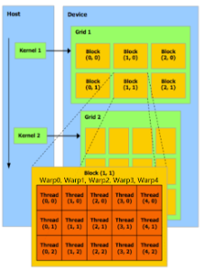

Cuda programs = CPU programs + kernels

Kernels调用语法：

kernel<<<dGrd, dBck>>>(A,B,w,C);
指定grids和block

CPU programs → host programs

kernels → PTX (Parallel Thread Execution) → SASS (Streaming ASSembly)

10.2 分岔（Divergence）

英文里面Divergence有分岔，分支，歧义等多种意思，这里表示程序执行到某个点之后，可能有多个分支的情况。

10.2.1 SIMD的优缺点

优点：更低的功耗，指令解码占用空间更少。

对于没有分支的线性程序，SIMD的性能非常好。但程序几乎不可避免会存在多个分支。

常见的分支主要有两类：

因为内存访问地址不一致导致的内存分岔

因为控制流分支导致的分岔

10.2.2 控制流分岔的例子

对下面的cuda 代码：

1 __global__ void ex(float *v) {

2   if (v[tid] < 0.0) {

3     v[tid] /= 2;

4   } else {

5     v[tid] = 0.0;

6   }

7 }

对应的控制流图是这样的：

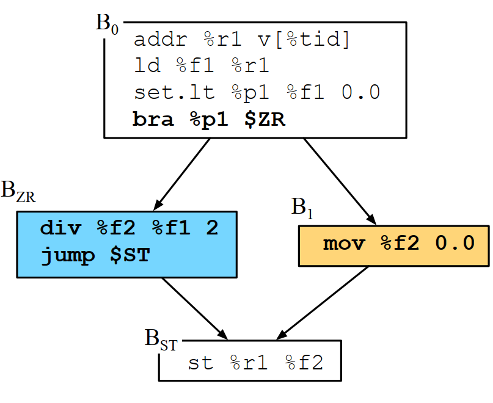

因为上面程序只有一处分岔（还记得上一章ILP中说的超级块么？上面的DAG转换成树之后只有2个叶子节点），如果有两个ALU，我们就可以在无视分岔的情况下把程序执行流水线画出来：

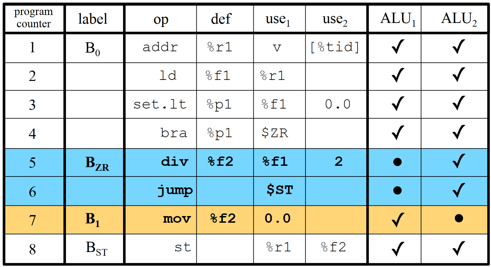

10.2.3 什么样的输入性能最好？

对下面的cuda的例子，怎么样调整输入来达到最好的性能？

1 __global__ void dec2zero(int *v, int N) {

2   int xIndex = blockIdx.x * blockDim.x + threadIdx.x;

3   if (xIndex < N) {

4     while (v[xIndex] > 0) {

5       v[xIndex]--;

6     }

7   }

8 }

下面有五种初始化的方法：

1 void vecIncInit(int *data, int size) {

2   for (int i = 0; i < size; ++i) {

3     data[i] = size - i - 1;

4   }

5 }

6 void vecConsInit(int *data, int size) {

7   int cons = size / 2;

8   for (int i = 0; i < size; ++i) {

9     data[i] = cons;

10   }

11 }

12 void vecAltInit(int *data, int size) {

13   for (int i = 0; i < size; ++i) {

14     if (i % 2) {

15       data[i] = size;

16     }

17   }

18 }

19 void vecRandomInit(int *data, int size) {

20   for (int i = 0; i < size; ++i) {

21     data[i] = random() % size;

22   }

23 }

24 void vecHalfInit(int *data, int size) {

25   for (int i = 0; i < size / 2; ++i) {

26     data[i] = 0;

27   }

28   for (int i = size / 2; i < size; ++i) {

29     data[i] = size;

30   }

31 }

测试下来的结果，在总的执行近似的情况下，没有分岔和有一个分岔的性能是2倍的差异，正好印证了之前一个分岔需要2个ALU才能确保并行处理的观点。另外一个分岔的性能和另外触发了一个随机数生成器调用的性能接近：

|  | vecIncInit | vecConsInit | vecAltInit | vecRandomInit | vecHalfInit |
| --- | --- | --- | --- | --- | --- |
| 总时间 | 20480000 | 20480000 | 20476800 | 20294984 | 20480000 |
| 实际时间 | 16250 | 16153 | 32193 | 30210 | 16157 |

10.3 分岔的动态检测

10.3.1 分岔profiling

统计分岔执行时间和执行次数的方法

在并行世界，求程序的profile的过程远比单核世界复杂，因为需要一个算法找到那时正在运行的线程将这个profile的结果保存下来。

下面是常见的找记录者的算法：

1 int writer = 0;

2 bool gotWriter = false;

3 while (!gotWriter) {

4     bool iAmWriter = false;

5     if (laneid == writer) {

6       iAmWriter = true;

7     }

8   if ( ∃ t ∈ w | iAmWriter == true) {

9   gotWriter = true;

10   }

11   else {

12     writer++;

13   }

14 }

10.3.2 经典的双调排序Bitonic Sort

输入是乱序3/2/4/1，经过5次排序和4次交换之后，变成顺序的1/2/3/4

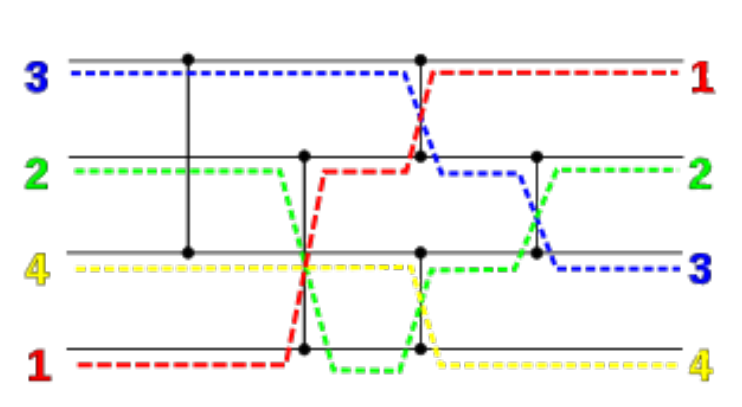

双调排序的cuda代码如下：

1 __global__ static void bitonicSort(int *values) {

2   extern __shared__ int shared[];

3   const unsigned int tid = threadIdx.x;

4   shared[tid] = values[tid];

5   __syncthreads();

6   for (unsigned int k = 2; k <= NUM; k *= 2) {

7     for (unsigned int j = k / 2; j > 0; j /= 2) {

8       unsigned int ixj = tid ^ j;

9       if (ixj > tid) {

10         if ((tid & k) == 0) {

11           if (shared[tid] > shared[ixj]) {

12             swap(shared[tid], shared[ixj]);

13           }

14         } else {

15           if (shared[tid] < shared[ixj]) {

16             swap(shared[tid], shared[ixj]);

17           }

18         }

19       }

20       __syncthreads();

21     }

22   }

23   values[tid] = shared[tid];

24 }

我们先不看外面的for循环，针对核心的8到20行生成控制流图：

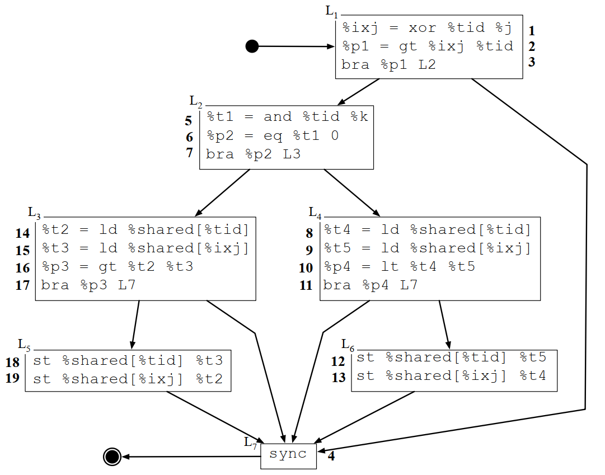

如果对执行过程做一下trace，大概结果是这样（上面代码里面有4个if，所以转换成DAG之后就有4个分岔，对应执行时的4个线程）：

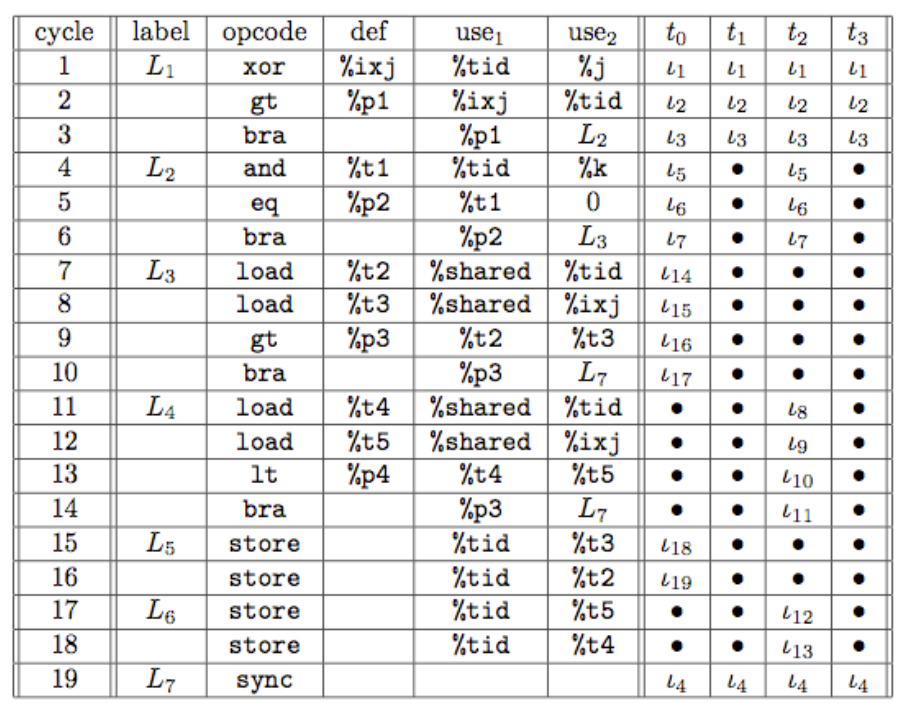

第一轮优化，3个分岔变成2个：

1 unsigned int a, b;

2 if ((tid & k) == 0) {

3   b = tid;

4   a = ixj;

5 } else {

6   b = ixj;

7   a = tid;

8 }

9 if (sh[b] > sh[a]) {

10   swap(sh[b], sh[a]);

11 }

优化之后的控制流图变成这样（性能提升6.7%）：

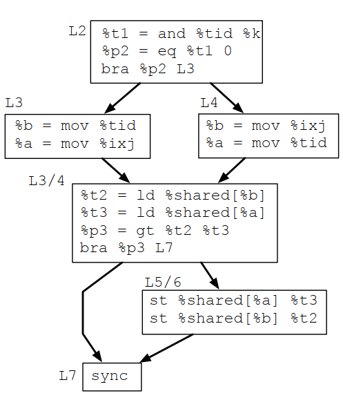

第二轮优化，2个分岔变成1个：

1 int p = (tid & k) == 0;

2 unsigned b = p ? tid : ixj;

3 unsigned a = p ? ixj : tid;

4 if (sh[b] > sh[a]) {

5   swap(sh[b], sh[a]);

6 }

实际上?表达式也是完成分岔的功能，但由于大多数指令集都有专门的问号表达式的指令，所以巧妙使用问号表达式将第一重分岔消掉，改进之后的CFG是这样的（性能提升9.2%）：

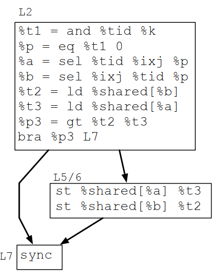

10.3.3 总结

性能优化过程主要是消灭分岔，那前面提到的profile数据对这个性能优化有帮助么？

理论上不论profile数据是什么样的，能消灭的分岔肯定优先消灭掉。profile数据对分岔消除的提示是尽可能优先消除执行时间比较长，执行次数比较多的分岔。

抛开分岔问题本身，profile的数据会提示优化执行时间和执行次数比较多的BB。

10.4 分岔的静态检测

10.4.1 分岔变量和统一变量

分岔变量（Divergent Variables）：如果一个变量对不同线程会出现不同的值，则称该变量为分岔变量。

统一变量（Uniform Variables）：如果一个变量在不同线程呈现完全相同的值，则称该变量为统一变量。

成为分岔变量的几种场景：

tid是分岔变量

原子操作产生的变量是分岔变量

如果v对分岔变量有数据依赖，则v也是分岔变量

如果v对分岔变量有控制依赖，则v也是分岔变量

分岔变量在数据流图和控制流图上具有传播性。

10.4.2 找到依赖

在一个非SSA的程序里面，找到某个变量是分岔变量还是非分岔变量是有歧义的，因为一个变量被多次赋值，可能有些赋值生成统一变量，有些赋值生成分岔变量。

但在SSA格式程序中，变量的分岔属性值就要容易确定的多。

例如下面的例子中r2在未SSA化之前，可能是分岔变量，也可能是统一变量。右边SSA化之后，r2a和r2是分岔变量，r2b是统一变量。

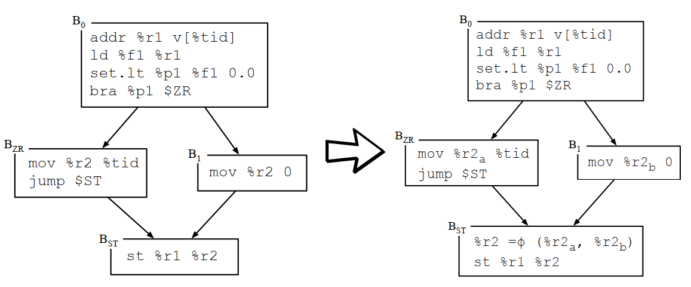

10.4.3 数据依赖图DDG

在ILP里面，我们曾经说过IDG，指令依赖图，这里说的数据依赖图和IDG其实也是类似的，关注的都是数据依赖，不过IDG关注的是指令执行过程的依赖，DDG关注的是数据本身的依赖。

对下面的CFG，会生成什么样的DDG？

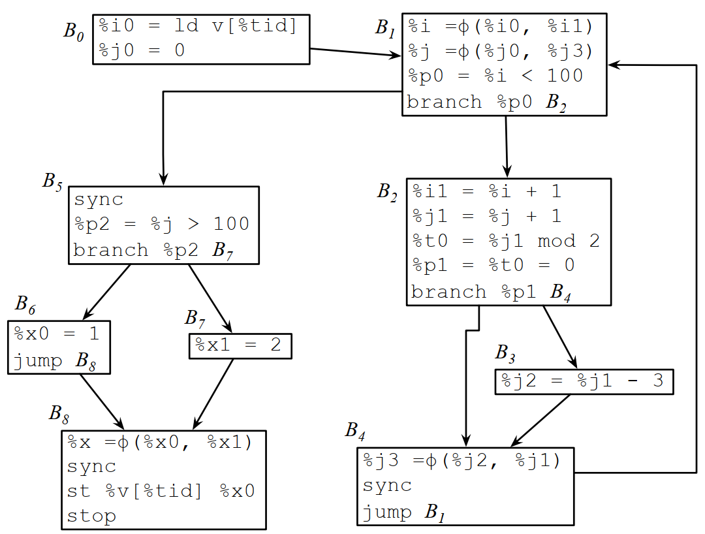

对应的DDG如下：

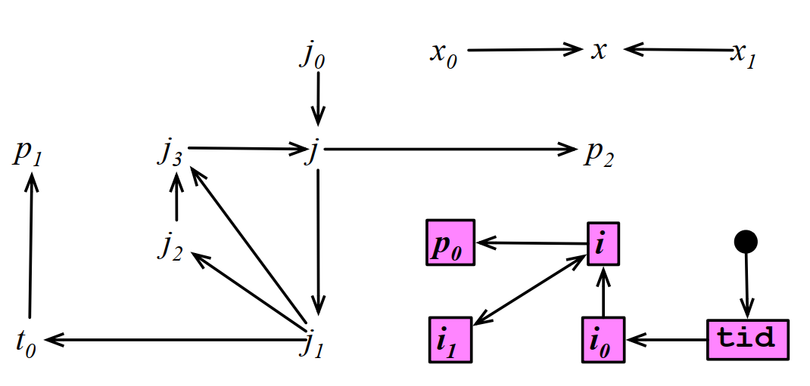

这个数据依赖对ILP可能已经足够了，但对分岔分析还不够，有些分岔变量漏掉了！

例如j的值依赖B1里面的分支，这个分支的条件是个分岔变量，这也会导致j变成分岔变量。所以除了数据依赖外，还需要考虑控制依赖。

10.4.4 控制依赖图

影响区：一个分支断言的影响区是该断言影响的基本块的集合。

后支配：相对于支配属性而言，后支配属性是一个节点B2走到程序结束的每条路径都要经过B1，则称为B1后支配B2。

直接后支配：如果节点B1后支配节点B2，并且不存在一个节点B3，B1后支配B3，并且B3后支配B2，则称为B1是B2的直接后支配。

一个分支断言的影响区是该分支所在BB到分支的直接后支配BB。

为了方便表示控制依赖导致的后支配，我们将φ函数升级扩展成为带断言的φ函数。例如下图中的x本来只对x0和x1有数据依赖，现在它也对p2有数据依赖：

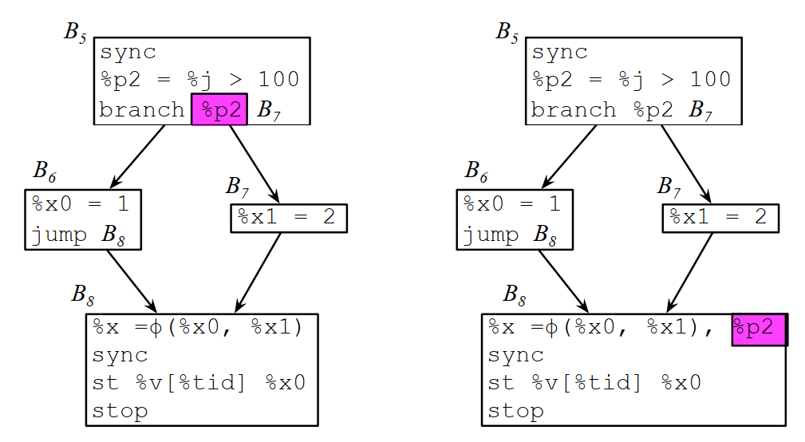

升级φ函数之后的数据依赖图：

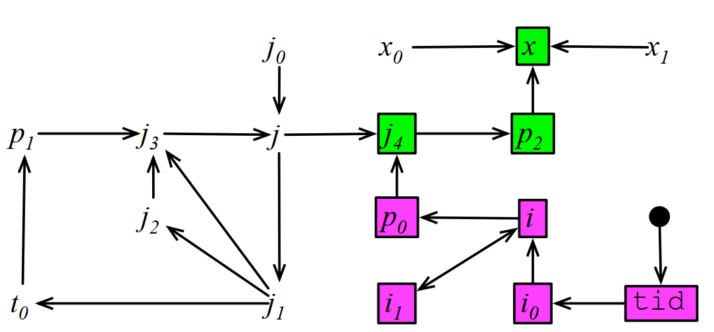

10.5 分岔优化

10.5.1 同步栅栏删除

CUDA的ptx指令集默认分支命令都是会产生分岔的，除非特定加上.uni后缀：

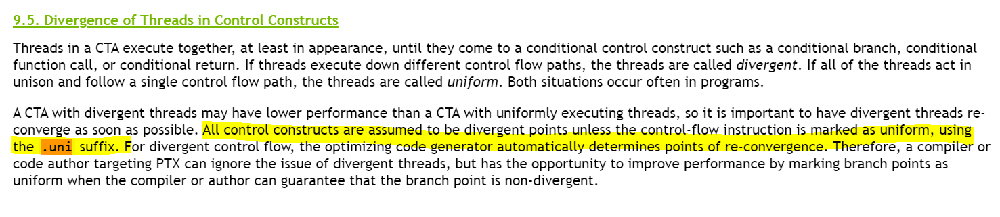

所以在明确肯定不会产生分岔变量的分支命令，可以加上.uni后缀：

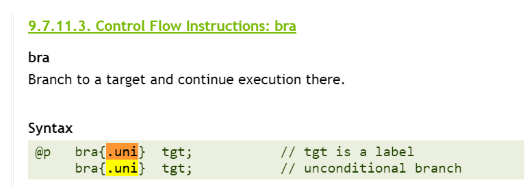

上面的截图来自PTX ISA :: CUDA Toolkit Documentation (nvidia.com)

10.5.2 寄存器分配

相对于传统单核的寄存器分配，溢出处理都是直接放到内存中，GPU场景下的寄存器溢出可以选择溢出老本地内存和全局内存，部分在多个核中共享的变量，还可以考虑放到共享内存中。

10.5.3 数据重定位

准排序算法

将数据切片，每个线程处理一个切片，并在每个切片排序完之后，再拷贝回来：

1 __global__ static void maxSort1(int *values, int N) {

2   // 1) COPY-INTO: Copy data from the values vector

3   // into  shared memory:

4   __shared__ int shared[THREAD_WORK_SIZE * NUM_THREADS];

5   for (unsigned k = 0; k < THREAD_WORK_SIZE; k++) {

6     unsigned loc = k * blockDim.x + threadIdx.x;

7     if (loc < N) {

8       shared[loc] = values[loc + blockIdx.x * blockDim.x];

9     }

10   }

11   __syncthreads();

12   // 2) SORT: each thread sorts its chunk of data

13   // with a  small sorting net.

14   int index1 = threadIdx.x * THREAD_WORK_SIZE;

15   int index2 = threadIdx.x * THREAD_WORK_SIZE + 1;

16   int index3 = threadIdx.x * THREAD_WORK_SIZE + 2;

17   int index4 = threadIdx.x * THREAD_WORK_SIZE + 3;

18   if (index4 < N) {

19     swapIfNecessary(shared, index1, index3);

20     swapIfNecessary(shared, index2, index4);

21     swapIfNecessary(shared, index1, index2);

22     swapIfNecessary(shared, index3, index4);

23     swapIfNecessary(shared, index2, index3);

24   }

25   __syncthreads();

26   // 3) SCATTER: the threads distribute their data

27   // along  the array.

28   __shared__ int scattered[THREAD_WORK_SIZE * 300];

29   unsigned int nextLoc = threadIdx.x;

30   for (unsigned i = 0; i < THREAD_WORK_SIZE; i++) {

31     scattered[nextLoc] = shared[threadIdx.x * THREAD_WORK_SIZE + i];

32     nextLoc += blockDim.x;

33   }

34   __syncthreads();

35   // 4) COPY-BACK: Copy the data back from the shared

36   // memory into the values vector:

37   for (unsigned k = 0; k < THREAD_WORK_SIZE; k++) {

38     unsigned loc = k * blockDim.x + threadIdx.x;

39     if (loc < N) {

40       values[loc + blockIdx.x * blockDim.x] = scattered[loc];

41     }

42   }

43 }

10.6 分岔研究历史

GPU的历史都比较新，所以关于GPU的分岔分析资料也比较新：

Ryoo, S. Rodrigues, C. Baghsorkhi, S. Stone, S. Kirk, D. and Hwu, Wen-Mei. "Optimization principles and application performance evaluation of a multithreaded GPU using CUDA", PPoPP, p 73-82 (2008) CUDA介绍。

Coutinho, B. Diogo, S. Pereira, F and Meira, W. "Divergence Analysis and Optimizations", PACT, p 320-329 (2011) 分岔分析与优化。

Sampaio, D. Martins, R. Collange, S. and Pereira, F. "Divergence Analysis", TOPLAS, 2013. 分岔分析。

10.7 LLVM的分岔优化实现

9.9.1 LLVM中的分岔分析

llvm\lib\Analysis\DivergenceAnalysis.cpp

llvm\lib\Analysis\DivergenceAnalysis.cpp

| 91 | #define DEBUG_TYPE "divergence-analysis" |
| --- | --- |
| 92 | // class DivergenceAnalysis |
| 93 | // DivergenceAnalysis类用于分析函数中的发散值。 |
| 94 | DivergenceAnalysis::DivergenceAnalysis( |
| 95 | const Function &F, const Loop *RegionLoop, const DominatorTree &DT, |
| 96 | const LoopInfo &LI, SyncDependenceAnalysis &SDA, bool IsLCSSAForm) |
| 97 | : F(F), RegionLoop(RegionLoop), DT(DT), LI(LI), SDA(SDA), |
| 98 | IsLCSSAForm(IsLCSSAForm) {} |
| 99 | // markDivergent - 标记一个值为发散值。 |
| 100 | void DivergenceAnalysis::markDivergent(const Value &DivVal) { |
| 101 | // 确保传入的值是Instruction或Argument类型 |
| 102 | assert(isa<Instruction>(DivVal) || isa<Argument>(DivVal)); |
| 103 | // 确保该值不是始终均匀的 |
| 104 | assert(!isAlwaysUniform(DivVal) && "cannot be a divergent"); |
| 105 | // 将该值插入到发散值集合中 |
| 106 | DivergentValues.insert(&DivVal); |
| 107 | } |
| 108 | // addUniformOverride - 添加一个值作为均匀值的覆盖。 |
| 109 | void DivergenceAnalysis::addUniformOverride(const Value &UniVal) { |
| 110 | UniformOverrides.insert(&UniVal); |
| 111 | } |
| 112 | // updateTerminator - 更新终结指令的发散状态。 |
| 113 | bool DivergenceAnalysis::updateTerminator(const Instruction &Term) const { |
| 114 | // 如果终结指令只有一个后继块，则不会导致发散 |
| 115 | if (Term.getNumSuccessors() <= 1) |
| 116 | return false; |
| 117 | // 处理条件分支指令 |
| 118 | if (auto *BranchTerm = dyn_cast<BranchInst>(&Term)) { |
| 119 | assert(BranchTerm->isConditional()); |
| 120 | return isDivergent(*BranchTerm->getCondition()); |
| 121 | } |
| 122 | // 处理Switch指令 |
| 123 | if (auto *SwitchTerm = dyn_cast<SwitchInst>(&Term)) { |
| 124 | return isDivergent(*SwitchTerm->getCondition()); |
| 125 | } |
| 126 | // 处理Invoke指令（忽略通过landingpad的异常执行） |
| 127 | if (isa<InvokeInst>(Term)) { |
| 128 | return false; // ignore abnormal executions through landingpad |
| 129 | } |
| 130 | // 其他终结指令不支持 |
| 131 | llvm_unreachable("unexpected terminator"); |
| 132 | } |
| 133 | // updateNormalInstruction - 更新普通指令的发散状态。 |
| 134 | bool DivergenceAnalysis::updateNormalInstruction(const Instruction &I) const { |
| 135 | // TODO: 处理具有副作用的函数调用等 |
| 136 | // 如果任何操作数是发散的，则该指令也是发散的 |
| 137 | // TODO function calls with side effects, etc |
| 138 | for (const auto &Op : I.operands()) { |
| 139 | if (isDivergent(*Op)) |
| 140 | return true; |
| 141 | } |
| 142 | return false; |
| 143 | } |
| 144 | // isTemporalDivergent - 检查一个值是否由于时间上的发散而发散。 |
| 145 | bool DivergenceAnalysis::isTemporalDivergent(const BasicBlock &ObservingBlock, |
| 146 | const Value &Val) const { |
| 147 | const auto *Inst = dyn_cast<const Instruction>(&Val); |
| 148 | if (!Inst) |
| 149 | return false; |
| 150 | // 检查任何携带Val的发散循环是否在控制流到达ObservingBlock之前终止 |
| 151 | // check whether any divergent loop carrying Val terminates before control |
| 152 | // proceeds to ObservingBlock |
| 153 | for (const auto *Loop = LI.getLoopFor(Inst->getParent()); |
| 154 | Loop != RegionLoop && !Loop->contains(&ObservingBlock); |
| 155 | Loop = Loop->getParentLoop()) { |
| 156 | if (DivergentLoops.find(Loop) != DivergentLoops.end()) |
| 157 | return true; |
| 158 | } |
| 159 | return false; |
| 160 | } |
| 161 | // updatePHINode - 更新PHI节点的发散状态。 |
| 162 | bool DivergenceAnalysis::updatePHINode(const PHINode &Phi) const { |
| 163 | // 如果Phi节点的父块是发散路径的汇合点，则Phi节点发散 |
| 164 | // joining divergent disjoint path in Phi parent block |
| 165 | if (!Phi.hasConstantOrUndefValue() && isJoinDivergent(*Phi.getParent())) { |
| 166 | return true; |
| 167 | } |
| 168 | // 一个输入值本身可能是发散的。 |
| 169 | // 或者，一个输入值在定义它的循环内可能是均匀的， |
| 170 | // 但从循环外部看可能是发散的。这种情况发生在发散循环退出时， |
| 171 | // 不同迭代中该均匀值的定义被丢弃。 |
| 172 | // |
| 173 | // 例如： |
| 174 | // for (int i = 0; i < n; ++i) { // 'i' 在循环内是均匀的 |
| 175 | //   if (i % thread_id == 0) break;    // 发散循环退出 |
| 176 | // } |
| 177 | // int divI = i;                 // divI 是发散的 |
| 178 | // An incoming value could be divergent by itself. |
| 179 | // Otherwise, an incoming value could be uniform within the loop |
| 180 | // that carries its definition but it may appear divergent |
| 181 | // from outside the loop. This happens when divergent loop exits |
| 182 | // drop definitions of that uniform value in different iterations. |
| 183 | // |
| 184 | // for (int i = 0; i < n; ++i) { // 'i' is uniform inside the loop |
| 185 | //   if (i % thread_id == 0) break;    // divergent loop exit |
| 186 | // } |
| 187 | // int divI = i;                 // divI is divergent |
| 188 | for (size_t i = 0; i < Phi.getNumIncomingValues(); ++i) { |
| 189 | const auto *InVal = Phi.getIncomingValue(i); |
| 190 | if (isDivergent(*Phi.getIncomingValue(i)) || |
| 191 | isTemporalDivergent(*Phi.getParent(), *InVal)) { |
| 192 | return true; |
| 193 | } |
| 194 | } |
| 195 | return false; |
| 196 | } |
| 197 | // 判断指令是否在当前分析的区域中。 |
| 198 | bool DivergenceAnalysis::inRegion(const Instruction &I) const { |
| 199 | return I.getParent() && inRegion(*I.getParent()); |
| 200 | } |
| 201 | // 判断基本块是否在当前分析的区域中。 |
| 202 | bool DivergenceAnalysis::inRegion(const BasicBlock &BB) const { |
| 203 | return (!RegionLoop && BB.getParent() == &F) || RegionLoop->contains(&BB); |
| 204 | } |
| 205 | // 检查指令是否使用了循环外的值。 |
| 206 | static bool usesLiveOut(const Instruction &I, const Loop *DivLoop) { |
| 207 | for (auto &Op : I.operands()) { |
| 208 | auto *OpInst = dyn_cast<Instruction>(&Op); |
| 209 | if (!OpInst) |
| 210 | continue; |
| 211 | if (DivLoop->contains(OpInst->getParent())) |
| 212 | return true; |
| 213 | } |
| 214 | return false; |
| 215 | } |
| 216 | // 将循环头部的循环携带值的所有用户标记为发散。 |
| 217 | // marks all users of loop-carried values of the loop headed by LoopHeader as |
| 218 | // divergent |
| 219 | void DivergenceAnalysis::taintLoopLiveOuts(const BasicBlock &LoopHeader) { |
| 220 | auto *DivLoop = LI.getLoopFor(&LoopHeader); |
| 221 | assert(DivLoop && "loopHeader is not actually part of a loop"); |
| 222 | SmallVector<BasicBlock *, 8> TaintStack; |
| 223 | DivLoop->getExitBlocks(TaintStack); |
| 224 | // 否则，循环携带值的潜在用户可能在DivLoop的支配区域内 |
| 225 | //（包括其边缘的phi节点） |
| 226 | // Otherwise potential users of loop-carried values could be anywhere in the |
| 227 | // dominance region of DivLoop (including its fringes for phi nodes) |
| 228 | DenseSet<const BasicBlock *> Visited; |
| 229 | for (auto *Block : TaintStack) { |
| 230 | Visited.insert(Block); |
| 231 | } |
| 232 | Visited.insert(&LoopHeader); |
| 233 | while (!TaintStack.empty()) { |
| 234 | auto *UserBlock = TaintStack.back(); |
| 235 | TaintStack.pop_back(); |
| 236 | // 不要将发散性传播到区域之外 |
| 237 | // don't spread divergence beyond the region |
| 238 | if (!inRegion(*UserBlock)) |
| 239 | continue; |
| 240 | assert(!DivLoop->contains(UserBlock) && |
| 241 | "irreducible control flow detected"); |
| 242 | // 支配区域边缘的phi节点 |
| 243 | // phi nodes at the fringes of the dominance region |
| 244 | if (!DT.dominates(&LoopHeader, UserBlock)) { |
| 245 | // UserBlock的所有PHI节点变为发散 |
| 246 | // all PHI nodes of UserBlock become divergent |
| 247 | for (auto &Phi : UserBlock->phis()) { |
| 248 | Worklist.push_back(&Phi); |
| 249 | } |
| 250 | continue; |
| 251 | } |
| 252 | // 标记DivLoop携带值的外部用户 |
| 253 | // taint outside users of values carried by DivLoop |
| 254 | for (auto &I : *UserBlock) { |
| 255 | if (isAlwaysUniform(I)) |
| 256 | continue; |
| 257 | if (isDivergent(I)) |
| 258 | continue; |
| 259 | if (!usesLiveOut(I, DivLoop)) |
| 260 | continue; |
| 261 | markDivergent(I); |
| 262 | if (I.isTerminator()) { |
| 263 | propagateBranchDivergence(I); |
| 264 | } else { |
| 265 | pushUsers(I); |
| 266 | } |
| 267 | } |
| 268 | // 访问支配区域内的所有块 |
| 269 | // visit all blocks in the dominance region |
| 270 | for (auto *SuccBlock : successors(UserBlock)) { |
| 271 | if (!Visited.insert(SuccBlock).second) { |
| 272 | continue; |
| 273 | } |
| 274 | TaintStack.push_back(SuccBlock); |
| 275 | } |
| 276 | } |
| 277 | } |
| 278 | // 将基本块中的所有PHI节点推入工作列表。 |
| 279 | void DivergenceAnalysis::pushPHINodes(const BasicBlock &Block) { |
| 280 | // 遍历基本块中的所有PHI节点。 |
| 281 | for (const auto &Phi : Block.phis()) { |
| 282 | // 如果PHI节点已经是发散的，则跳过。 |
| 283 | if (isDivergent(Phi)) |
| 284 | continue; |
| 285 | // 将PHI节点加入工作列表。 |
| 286 | Worklist.push_back(&Phi); |
| 287 | } |
| 288 | } |
| 289 | // 将值的所有用户推入工作列表。 |
| 290 | void DivergenceAnalysis::pushUsers(const Value &V) { |
| 291 | // 遍历值的所有用户。 |
| 292 | for (const auto *User : V.users()) { |
| 293 | // 将用户转换为指令，如果不是指令则跳过。 |
| 294 | const auto *UserInst = dyn_cast<const Instruction>(User); |
| 295 | if (!UserInst) |
| 296 | continue; |
| 297 | // 如果用户已经是发散的，则跳过。 |
| 298 | if (isDivergent(*UserInst)) |
| 299 | continue; |
| 300 | // 只在循环区域内计算发散性。 |
| 301 | // only compute divergent inside loop |
| 302 | if (!inRegion(*UserInst)) |
| 303 | continue; |
| 304 | // 将用户加入工作列表。 |
| 305 | Worklist.push_back(UserInst); |
| 306 | } |
| 307 | } |
| 308 | // 传播分支发散性到Join块。 |
| 309 | bool DivergenceAnalysis::propagateJoinDivergence(const BasicBlock &JoinBlock, |
| 310 | const Loop *BranchLoop) { |
| 311 | LLVM_DEBUG(dbgs() << "\tpropJoinDiv " << JoinBlock.getName() << "\n"); |
| 312 | // 如果Join块不在当前分析的区域内，则忽略发散性。 |
| 313 | // ignore divergence outside the region |
| 314 | if (!inRegion(JoinBlock)) { |
| 315 | return false; |
| 316 | } |
| 317 | // 将Join块中所有非发散的PHI节点推入工作列表。 |
| 318 | // push non-divergent phi nodes in JoinBlock to the worklist |
| 319 | pushPHINodes(JoinBlock); |
| 320 | // 标记Join块为发散性合并点。 |
| 321 | // disjoint-paths divergent at JoinBlock |
| 322 | markBlockJoinDivergent(JoinBlock); |
| 323 | // 如果Join块是分支循环的退出块，则返回true。 |
| 324 | // JoinBlock is a divergent loop exit |
| 325 | return BranchLoop && !BranchLoop->contains(&JoinBlock); |
| 326 | } |
| 327 | // 传播分支指令的发散性。 |
| 328 | void DivergenceAnalysis::propagateBranchDivergence(const Instruction &Term) { |
| 329 | LLVM_DEBUG(dbgs() << "propBranchDiv " << Term.getParent()->getName() << "\n"); |
| 330 | // 标记分支指令为发散。 |
| 331 | markDivergent(Term); |
| 332 | // 如果分支指令所在的块不可达，则不传播发散性。 |
| 333 | // Don't propagate divergence from unreachable blocks. |
| 334 | if (!DT.isReachableFromEntry(Term.getParent())) |
| 335 | return; |
| 336 | // 获取分支指令所在的循环。 |
| 337 | const auto *BranchLoop = LI.getLoopFor(Term.getParent()); |
| 338 | // 是否存在从BranchLoop（如果有）的发散循环退出。 |
| 339 | // whether there is a divergent loop exit from BranchLoop (if any) |
| 340 | bool IsBranchLoopDivergent = false; |
| 341 | // 遍历从Term出发在循环内通过不相交路径可达的所有块， |
| 342 | // 同时也会遍历因Term而变得发散的循环退出块。 |
| 343 | // iterate over all blocks reachable by disjoint from Term within the loop |
| 344 | // also iterates over loop exits that become divergent due to Term. |
| 345 | for (const auto *JoinBlock : SDA.join_blocks(Term)) { |
| 346 | IsBranchLoopDivergent |= propagateJoinDivergence(*JoinBlock, BranchLoop); |
| 347 | } |
| 348 | // 如果分支循环因Term中的发散分支而成为发散循环。 |
| 349 | // Branch loop is a divergent loop due to the divergent branch in Term |
| 350 | if (IsBranchLoopDivergent) { |
| 351 | assert(BranchLoop); |
| 352 | // 如果循环已经标记为发散，则直接返回。 |
| 353 | if (!DivergentLoops.insert(BranchLoop).second) { |
| 354 | return; |
| 355 | } |
| 356 | // 传播循环的发散性。 |
| 357 | propagateLoopDivergence(*BranchLoop); |
| 358 | } |
| 359 | } |
| 360 | // 传播循环的发散性。 |
| 361 | void DivergenceAnalysis::propagateLoopDivergence(const Loop &ExitingLoop) { |
| 362 | LLVM_DEBUG(dbgs() << "propLoopDiv " << ExitingLoop.getName() << "\n"); |
| 363 | // 不要将发散性传播到区域之外。 |
| 364 | // don't propagate beyond region |
| 365 | if (!inRegion(*ExitingLoop.getHeader())) |
| 366 | return; |
| 367 | const auto *BranchLoop = ExitingLoop.getParentLoop(); |
| 368 | // 循环携带值的使用可能发生在定义的支配区域内任何地方。 |
| 369 | // 所有循环携带的定义都被循环头支配（可约控制流）。 |
| 370 | // 因此，所有用户都必须在循环头的支配区域内， |
| 371 | // 除了PHI节点，它们也可以位于支配区域的边缘（传入的定义值）。 |
| 372 | // Uses of loop-carried values could occur anywhere |
| 373 | // within the dominance region of the definition. All loop-carried |
| 374 | // definitions are dominated by the loop header (reducible control). |
| 375 | // Thus all users have to be in the dominance region of the loop header, |
| 376 | // except PHI nodes that can also live at the fringes of the dom region |
| 377 | // (incoming defining value). |
| 378 | if (!IsLCSSAForm) |
| 379 | taintLoopLiveOuts(*ExitingLoop.getHeader()); |
| 380 | // 是否存在从BranchLoop（如果有）的发散循环退出。 |
| 381 | // whether there is a divergent loop exit from BranchLoop (if any) |
| 382 | bool IsBranchLoopDivergent = false; |
| 383 | // 遍历从ExitingLoop的退出块出发通过不相交路径可达的所有块， |
| 384 | // 同时也会遍历因ExitingLoop的退出而变得发散的循环退出块（BranchLoop）。 |
| 385 | // iterate over all blocks reachable by disjoint paths from exits of |
| 386 | // ExitingLoop also iterates over loop exits (of BranchLoop) that in turn |
| 387 | // become divergent. |
| 388 | for (const auto *JoinBlock : SDA.join_blocks(ExitingLoop)) { |
| 389 | IsBranchLoopDivergent |= propagateJoinDivergence(*JoinBlock, BranchLoop); |
| 390 | } |
| 391 | // 如果BranchLoop因ExitingLoop的发散退出而成为发散循环。 |
| 392 | // Branch loop is a divergent due to divergent loop exit in ExitingLoop |
| 393 | if (IsBranchLoopDivergent) { |
| 394 | assert(BranchLoop); |
| 395 | if (!DivergentLoops.insert(BranchLoop).second) { |
| 396 | return; |
| 397 | } |
| 398 | propagateLoopDivergence(*BranchLoop); |
| 399 | } |
| 400 | } |
| 401 | // 计算发散性。 |
| 402 | void DivergenceAnalysis::compute() { |
| 403 | // 将所有发散值的用户推入工作列表。 |
| 404 | for (auto *DivVal : DivergentValues) { |
| 405 | pushUsers(*DivVal); |
| 406 | } |
| 407 | // 传播发散性。 |
| 408 | // propagate divergence |
| 409 | while (!Worklist.empty()) { |
| 410 | const Instruction &I = *Worklist.back(); |
| 411 | Worklist.pop_back(); |
| 412 | // 维护覆盖指令的均匀性。 |
| 413 | // maintain uniformity of overrides |
| 414 | if (isAlwaysUniform(I)) |
| 415 | continue; |
| 416 | bool WasDivergent = isDivergent(I); |
| 417 | if (WasDivergent) |
| 418 | continue; |
| 419 | // 传播由终止符引起的发散性。 |
| 420 | // propagate divergence caused by terminator |
| 421 | if (I.isTerminator()) { |
| 422 | if (updateTerminator(I)) { |
| 423 | // 将控制发散性传播到受影响的指令。 |
| 424 | // propagate control divergence to affected instructions |
| 425 | propagateBranchDivergence(I); |
| 426 | continue; |
| 427 | } |
| 428 | } |
| 429 | // 更新由于发散操作数而引起的I的发散性。 |
| 430 | // update divergence of I due to divergent operands |
| 431 | bool DivergentUpd = false; |
| 432 | const auto *Phi = dyn_cast<const PHINode>(&I); |
| 433 | if (Phi) { |
| 434 | DivergentUpd = updatePHINode(*Phi); |
| 435 | } else { |
| 436 | DivergentUpd = updateNormalInstruction(I); |
| 437 | } |
| 438 | // 将值的发散性传播到用户。 |
| 439 | // propagate value divergence to users |
| 440 | if (DivergentUpd) { |
| 441 | markDivergent(I); |
| 442 | pushUsers(I); |
| 443 | } |
| 444 | } |
| 445 | } |
| 446 | // 判断值是否始终均匀。 |
| 447 | bool DivergenceAnalysis::isAlwaysUniform(const Value &V) const { |
| 448 | return UniformOverrides.find(&V) != UniformOverrides.end(); |
| 449 | } |
| 450 | // 判断值是否发散。 |
| 451 | bool DivergenceAnalysis::isDivergent(const Value &V) const { |
| 452 | return DivergentValues.find(&V) != DivergentValues.end(); |
| 453 | } |
| 454 | // 判断使用是否发散。 |
| 455 | bool DivergenceAnalysis::isDivergentUse(const Use &U) const { |
| 456 | Value &V = *U.get(); |
| 457 | Instruction &I = *cast<Instruction>(U.getUser()); |
| 458 | return isDivergent(V) || isTemporalDivergent(*I.getParent(), V); |
| 459 | } |
| 460 | // 打印发散分析的结果。 |
| 461 | void DivergenceAnalysis::print(raw_ostream &OS, const Module *) const { |
| 462 | if (DivergentValues.empty()) |
| 463 | return; |
| 464 | // 遍历函数中的所有指令，确保顺序是确定性的。 |
| 465 | // iterate instructions using instructions() to ensure a deterministic order. |
| 466 | for (auto &I : instructions(F)) { |
| 467 | if (isDivergent(I)) |
| 468 | OS << "DIVERGENT:" << I << '\n'; |
| 469 | } |
| 470 | } |
| 471 | // GPUDivergenceAnalysis类的构造函数。 |
| 472 | // 初始化GPUDivergenceAnalysis对象，设置相关成员变量，并标记发散值。 |
| 473 | // class GPUDivergenceAnalysis |
| 474 | GPUDivergenceAnalysis::GPUDivergenceAnalysis(Function &F, |
| 475 | const DominatorTree &DT, |
| 476 | const PostDominatorTree &PDT, |
|  | const LoopInfo &LI, |
|  | const TargetTransformInfo &TTI) |
|  | : SDA(DT, PDT, LI), DA(F, nullptr, DT, LI, SDA, false) { |
|  | // 遍历函数中的所有指令。 |
|  | for (auto &I : instructions(F)) { |
|  | // 如果指令是发散源，则标记为发散。 |
|  | if (TTI.isSourceOfDivergence(&I)) { |
|  | DA.markDivergent(I); |
|  | // 如果指令始终均匀，则添加到均匀覆盖集合中。 |
|  | } else if (TTI.isAlwaysUniform(&I)) { |
|  | DA.addUniformOverride(I); |
|  | } |
|  | } |
|  | // 遍历函数的所有参数。 |
|  | for (auto &Arg : F.args()) { |
|  | // 如果参数是发散源，则标记为发散。 |
|  | if (TTI.isSourceOfDivergence(&Arg)) { |
|  | DA.markDivergent(Arg); |
|  | } |
|  | } |
|  | // 计算发散性。 |
|  | DA.compute(); |
|  | } |
|  | // 判断值是否发散。 |
|  | bool GPUDivergenceAnalysis::isDivergent(const Value &val) const { |
|  | return DA.isDivergent(val); |
|  | } |
|  | // 判断使用是否发散。 |
|  | bool GPUDivergenceAnalysis::isDivergentUse(const Use &use) const { |
|  | return DA.isDivergentUse(use); |
|  | } |
|  | // 打印发散分析的结果。 |
|  | void GPUDivergenceAnalysis::print(raw_ostream &OS, const Module *mod) const { |
|  | // 打印内核的发散性信息。 |
|  | OS << "Divergence of kernel " << DA.getFunction().getName() << " {\n"; |
|  | // 调用DivergenceAnalysis的打印方法。 |
|  | DA.print(OS, mod); |
|  | OS << "}\n"; |
|  | } |

9.9.2 LLVM中的AMDGPU中的分岔分析对CodeGen的影响

llvm\lib\Target\AMDGPU\AMDGPUCodeGenPrepare.cpp

llvm\lib\Target\AMDGPU\AMDGPUCodeGenPrepare.cpp

| 51 | #define DEBUG_TYPE "amdgpu-codegenprepare" |
| --- | --- |
| 52 | using namespace llvm; |
| 53 | namespace { |
| 54 | // 命令行选项：在AMDGPUCodeGenPrepare中扩展子字节常量地址空间加载。 |
| 55 | static cl::opt<bool> WidenLoads( |
| 56 | "amdgpu-codegenprepare-widen-constant-loads", |
| 57 | cl::desc("Widen sub-dword constant address space loads in AMDGPUCodeGenPrepare"), |
| 58 | cl::ReallyHidden, |
| 59 | cl::init(false)); |
| 60 | // 命令行选项：在AMDGPUCodeGenPrepare中引入mul24内联函数。 |
| 61 | static cl::opt<bool> UseMul24Intrin( |
| 62 | "amdgpu-codegenprepare-mul24", |
| 63 | cl::desc("Introduce mul24 intrinsics in AMDGPUCodeGenPrepare"), |
| 64 | cl::ReallyHidden, |
| 65 | cl::init(true)); |
| 66 | // 命令行选项：通过使用通用IR扩展来合法化64位除法。 |
| 67 | // Legalize 64-bit division by using the generic IR expansion. |
| 68 | static cl::opt<bool> ExpandDiv64InIR( |
| 69 | "amdgpu-codegenprepare-expand-div64", |
| 70 | cl::desc("Expand 64-bit division in AMDGPUCodeGenPrepare"), |
| 71 | cl::ReallyHidden, |
| 72 | cl::init(false)); |
| 73 | // 命令行选项：保留所有除法操作，用于测试合法化器。 |
| 74 | // 此选项优先于ExpandDiv64InIR。 |
| 75 | // Leave all division operations as they are. This supersedes ExpandDiv64InIR |
| 76 | // and is used for testing the legalizer. |
| 77 | static cl::opt<bool> DisableIDivExpand( |
| 78 | "amdgpu-codegenprepare-disable-idiv-expansion", |
| 79 | cl::desc("Prevent expanding integer division in AMDGPUCodeGenPrepare"), |
| 80 | cl::ReallyHidden, |
| 81 | cl::init(false)); |
| 82 | class AMDGPUCodeGenPrepare : public FunctionPass, |
| 83 | public InstVisitor<AMDGPUCodeGenPrepare, bool> { |
| 84 | const GCNSubtarget *ST = nullptr; |
| 85 | AssumptionCache *AC = nullptr; |
| 86 | DominatorTree *DT = nullptr; |
| 87 | LegacyDivergenceAnalysis *DA = nullptr; |
| 88 | Module *Mod = nullptr; |
| 89 | const DataLayout *DL = nullptr; |
| 90 | bool HasUnsafeFPMath = false; |
| 91 | bool HasFP32Denormals = false; |
| 92 | // 将二元操作I的exact/nsw/nuw标志（如果有的话）复制到二元操作V。 |
| 93 | // 返回二元操作V。 |
| 94 | /// Copies exact/nsw/nuw flags (if any) from binary operation \p I to |
| 95 | /// binary operation \p V. |
| 96 | /// |
| 97 | /// \returns Binary operation \p V. |
| 98 | /// \returns \p T's base element bit width. |
| 99 | unsigned getBaseElementBitWidth(const Type *T) const; |
| 100 | // 返回给定类型T的等效32位整数类型。例如，如果T是i7，则返回i32； |
| 101 | // 如果T是<3 x i12>，则返回<3 x i32>。 |
| 102 | /// \returns Equivalent 32 bit integer type for given type \p T. For example, |
| 103 | /// if \p T is i7, then i32 is returned; if \p T is <3 x i12>, then <3 x i32> |
| 104 | /// is returned. |
| 105 | Type *getI32Ty(IRBuilder<> &B, const Type *T) const; |
| 106 | // 如果二元操作I是有符号的，则返回true，否则返回false。 |
| 107 | /// \returns True if binary operation \p I is a signed binary operation, false |
| 108 | /// otherwise. |
| 109 | bool isSigned(const BinaryOperator &I) const; |
| 110 | // 如果'select'操作I的条件来自有符号的'icmp'操作，则返回true，否则返回false。 |
| 111 | /// \returns True if the condition of 'select' operation \p I comes from a |
| 112 | /// signed 'icmp' operation, false otherwise. |
| 113 | bool isSigned(const SelectInst &I) const; |
| 114 | // 如果类型T需要被提升到32位整数类型，则返回true，否则返回false。 |
| 115 | /// \returns True if type \p T needs to be promoted to 32 bit integer type, |
| 116 | /// false otherwise. |
| 117 | bool needsPromotionToI32(const Type *T) const; |
| 118 | // 将统一的二元操作I提升到等效的32位二元操作。 |
| 119 | // I的基本元素位宽必须大于1且小于或等于16。提升是通过将操作数符号扩展或零扩展到32位， |
| 120 | // 替换I为等效的32位二元操作，并将32位二元操作的结果截断回I的原始类型。 |
| 121 | // 除法操作不会被提升。 |
| 122 | // 返回true，如果I被提升到等效的32位二元操作，否则返回false。 |
| 123 | /// Promotes uniform binary operation \p I to equivalent 32 bit binary |
| 124 | /// operation. |
| 125 | /// |
| 126 | /// \details \p I's base element bit width must be greater than 1 and less |
| 127 | /// than or equal 16. Promotion is done by sign or zero extending operands to |
| 128 | /// 32 bits, replacing \p I with equivalent 32 bit binary operation, and |
| 129 | /// truncating the result of 32 bit binary operation back to \p I's original |
| 130 | /// type. Division operation is not promoted. |
| 131 | /// |
| 132 | /// \returns True if \p I is promoted to equivalent 32 bit binary operation, |
| 133 | /// false otherwise. |
| 134 | bool promoteUniformOpToI32(BinaryOperator &I) const; |
| 135 | // 将统一的'icmp'操作I提升到32位'icmp'操作。 |
| 136 | // I的基本元素位宽必须大于1且小于或等于16。提升是通过将操作数符号扩展或零扩展到32位， |
| 137 | // 并替换I为32位'icmp'操作。 |
| 138 | // 返回true。 |
| 139 | /// Promotes uniform 'icmp' operation \p I to 32 bit 'icmp' operation. |
| 140 | /// |
| 141 | /// \details \p I's base element bit width must be greater than 1 and less |
| 142 | /// than or equal 16. Promotion is done by sign or zero extending operands to |
| 143 | /// 32 bits, and replacing \p I with 32 bit 'icmp' operation. |
| 144 | /// |
| 145 | /// \returns True. |
| 146 | bool promoteUniformOpToI32(ICmpInst &I) const; |
| 147 | // 将统一的'select'操作I提升到32位'select'操作。 |
| 148 | // I的基本元素位宽必须大于1且小于或等于16。提升是通过将操作数符号扩展或零扩展到32位， |
| 149 | // 替换I为32位'select'操作，并将32位'select'操作的结果截断回I的原始类型。 |
| 150 | // 返回true。 |
| 151 | /// Promotes uniform 'select' operation \p I to 32 bit 'select' |
| 152 | /// operation. |
| 153 | /// |
| 154 | /// \details \p I's base element bit width must be greater than 1 and less |
| 155 | /// than or equal 16. Promotion is done by sign or zero extending operands to |
| 156 | /// 32 bits, replacing \p I with 32 bit 'select' operation, and truncating the |
| 157 | /// result of 32 bit 'select' operation back to \p I's original type. |
| 158 | /// |
| 159 | /// \returns True. |
| 160 | bool promoteUniformOpToI32(SelectInst &I) const; |
| 161 | // 将统一的'bitreverse'内联函数I提升到32位'bitreverse'内联函数。 |
| 162 | // I的基本元素位宽必须大于1且小于或等于16。提升是通过将操作数零扩展到32位， |
| 163 | // 替换I为32位'bitreverse'内联函数，将32位'bitreverse'内联函数的结果向右移位（零填充）， |
| 164 | // 移位量为32减去I的基本元素位宽，并将移位操作的结果截断回I的原始类型。 |
| 165 | // 返回true。 |
| 166 | /// Promotes uniform 'bitreverse' intrinsic \p I to 32 bit 'bitreverse' |
| 167 | /// intrinsic. |
| 168 | /// |
| 169 | /// \details \p I's base element bit width must be greater than 1 and less |
| 170 | /// than or equal 16. Promotion is done by zero extending the operand to 32 |
| 171 | /// bits, replacing \p I with 32 bit 'bitreverse' intrinsic, shifting the |
| 172 | /// result of 32 bit 'bitreverse' intrinsic to the right with zero fill (the |
| 173 | /// shift amount is 32 minus \p I's base element bit width), and truncating |
| 174 | /// the result of the shift operation back to \p I's original type. |
| 175 | /// |
| 176 | /// \returns True. |
| 177 | bool promoteUniformBitreverseToI32(IntrinsicInst &I) const; |
| 178 | unsigned numBitsUnsigned(Value *Op, unsigned ScalarSize) const; |
| 179 | unsigned numBitsSigned(Value *Op, unsigned ScalarSize) const; |
| 180 | bool isI24(Value *V, unsigned ScalarSize) const; |
| 181 | bool isU24(Value *V, unsigned ScalarSize) const; |
| 182 | // 用llvm.amdgcn.mul.u24或llvm.amdgcn.mul.s24替换乘法指令。 |
| 183 | // SelectionDAG有一个问题，即断言位是已知的and。 |
| 184 | /// Replace mul instructions with llvm.amdgcn.mul.u24 or llvm.amdgcn.mul.s24. |
| 185 | /// SelectionDAG has an issue where an and asserting the bits are known |
| 186 | bool replaceMulWithMul24(BinaryOperator &I) const; |
| 187 | // 执行与DAGCombiner中同名函数相同的功能。由于我们在某些地方扩展了除法， |
| 188 | // 因此需要在隐藏之前执行此操作。 |
| 189 | /// Perform same function as equivalently named function in DAGCombiner. Since |
| 190 | /// we expand some divisions here, we need to perform this before obscuring. |
| 191 | bool foldBinOpIntoSelect(BinaryOperator &I) const; |
| 192 | bool divHasSpecialOptimization(BinaryOperator &I, |
| 193 | Value *Num, Value *Den) const; |
| 194 | int getDivNumBits(BinaryOperator &I, |
| 195 | Value *Num, Value *Den, |
| 196 | unsigned AtLeast, bool Signed) const; |
| 197 | // 扩展24位除法或取余。 |
| 198 | /// Expands 24 bit div or rem. |
| 199 | Value* expandDivRem24(IRBuilder<> &Builder, BinaryOperator &I, |
| 200 | Value *Num, Value *Den, |
| 201 | bool IsDiv, bool IsSigned) const; |
| 202 | Value *expandDivRem24Impl(IRBuilder<> &Builder, BinaryOperator &I, |
| 203 | Value *Num, Value *Den, unsigned NumBits, |
| 204 | bool IsDiv, bool IsSigned) const; |
| 205 | // 扩展32位除法或取余。 |
| 206 | /// Expands 32 bit div or rem. |
| 207 | Value* expandDivRem32(IRBuilder<> &Builder, BinaryOperator &I, |
| 208 | Value *Num, Value *Den) const; |
| 209 | // 将64位除法或取余缩小为32位。 |
| 210 | Value *shrinkDivRem64(IRBuilder<> &Builder, BinaryOperator &I, |
| 211 | Value *Num, Value *Den) const; |
| 212 | void expandDivRem64(BinaryOperator &I) const; |
| 213 | /// 扩展标量加载。 |
| 214 | /// |
| 215 | /// \details 扩展标量加载，对于从常量内存加载的统一、小类型加载，扩展到完整的32位， |
| 216 | /// 然后截断输入，以便使用标量加载而不是向量加载。 |
| 217 | /// |
| 218 | /// \returns True。 |
| 219 | /// Widen a scalar load. |
| 220 | /// |
| 221 | /// \details \p Widen scalar load for uniform, small type loads from constant |
| 222 | //  memory / to a full 32-bits and then truncate the input to allow a scalar |
| 223 | //  load instead of a vector load. |
| 224 | // |
| 225 | /// \returns True. |
| 226 | bool canWidenScalarExtLoad(LoadInst &I) const; |
| 227 | public: |
| 228 | static char ID; |
| 229 | AMDGPUCodeGenPrepare() : FunctionPass(ID) {} |
| 230 | bool visitFDiv(BinaryOperator &I); |
| 231 | bool visitInstruction(Instruction &I) { return false; } |
| 232 | bool visitBinaryOperator(BinaryOperator &I); |
| 233 | bool visitLoadInst(LoadInst &I); |
| 234 | bool visitICmpInst(ICmpInst &I); |
| 235 | bool visitSelectInst(SelectInst &I); |
| 236 | bool visitIntrinsicInst(IntrinsicInst &I); |
| 237 | bool visitBitreverseIntrinsicInst(IntrinsicInst &I); |
| 238 | bool doInitialization(Module &M) override; |
| 239 | bool runOnFunction(Function &F) override; |
| 240 | StringRef getPassName() const override { return "AMDGPU IR optimizations"; } |
| 241 | void getAnalysisUsage(AnalysisUsage &AU) const override { |
| 242 | AU.addRequired<AssumptionCacheTracker>(); |
| 243 | AU.addRequired<LegacyDivergenceAnalysis>(); |
| 244 | // FIXME: 除法扩展需要保留支配树。 |
| 245 | // FIXME: Division expansion needs to preserve the dominator tree. |
| 246 | if (!ExpandDiv64InIR) |
| 247 | AU.setPreservesAll(); |
| 248 | } |
| 249 | }; |
| 250 | } // end anonymous namespace |
| 251 | // getBaseElementBitWidth - 获取类型T的基本元素的位宽。 |
| 252 | unsigned AMDGPUCodeGenPrepare::getBaseElementBitWidth(const Type *T) const { |
| 253 | // 确保类型T需要提升到i32 |
| 254 | assert(needsPromotionToI32(T) && "T does not need promotion to i32"); |
| 255 | // 如果T是整数类型，直接返回其位宽 |
| 256 | if (T->isIntegerTy()) |
| 257 | return T->getIntegerBitWidth(); |
| 258 | // 如果T是向量类型，返回其元素类型的位宽 |
| 259 | return cast<VectorType>(T)->getElementType()->getIntegerBitWidth(); |
| 260 | } |
| 261 | // getI32Ty - 获取与类型T对应的i32类型（标量或向量）。 |
| 262 | Type *AMDGPUCodeGenPrepare::getI32Ty(IRBuilder<> &B, const Type *T) const { |
| 263 | // 确保类型T需要提升到i32 |
| 264 | assert(needsPromotionToI32(T) && "T does not need promotion to i32"); |
| 265 | // 如果T是整数类型，返回i32类型 |
| 266 | if (T->isIntegerTy()) |
| 267 | return B.getInt32Ty(); |
| 268 | // 如果T是向量类型，返回具有相同元素数量的i32向量类型 |
| 269 | return FixedVectorType::get(B.getInt32Ty(), cast<FixedVectorType>(T)); |
| 270 | } |
| 271 | // isSigned - 判断二元操作符I是否是有符号操作。 |
| 272 | bool AMDGPUCodeGenPrepare::isSigned(const BinaryOperator &I) const { |
| 273 | return I.getOpcode() == Instruction::AShr || |
| 274 | I.getOpcode() == Instruction::SDiv || I.getOpcode() == Instruction::SRem; |
| 275 | } |
| 276 | // isSigned - 判断选择指令I是否是有符号操作。 |
| 277 | bool AMDGPUCodeGenPrepare::isSigned(const SelectInst &I) const { |
| 278 | // 如果选择指令的条件是ICmpInst，则返回其是否是有符号比较 |
| 279 | return isa<ICmpInst>(I.getOperand(0)) ? |
| 280 | cast<ICmpInst>(I.getOperand(0))->isSigned() : false; |
| 281 | } |
| 282 | // needsPromotionToI32 - 判断类型T是否需要提升到i32。 |
| 283 | bool AMDGPUCodeGenPrepare::needsPromotionToI32(const Type *T) const { |
| 284 | const IntegerType *IntTy = dyn_cast<IntegerType>(T); |
| 285 | // 如果T是整数类型且位宽在2到16之间，则需要提升到i32 |
| 286 | if (IntTy && IntTy->getBitWidth() > 1 && IntTy->getBitWidth() <= 16) |
| 287 | return true; |
| 288 | // 如果T是向量类型 |
| 289 | if (const VectorType *VT = dyn_cast<VectorType>(T)) { |
| 290 | // TODO: 打包操作的支持有限，可能需要提升某些类型 |
| 291 | // 如果目标支持VOP3P指令，则不需要提升 |
| 292 | // TODO: The set of packed operations is more limited, so may want to |
| 293 | // promote some anyway. |
| 294 | if (ST->hasVOP3PInsts()) |
| 295 | return false; |
| 296 | // 递归检查向量元素类型是否需要提升 |
| 297 | return needsPromotionToI32(VT->getElementType()); |
| 298 | } |
| 299 | return false; |
| 300 | } |
| 301 | // promotedOpIsNSW - 判断提升到i32的操作是否应设置nsw（无符号溢出）标志。 |
| 302 | // Return true if the op promoted to i32 should have nsw set. |
| 303 | static bool promotedOpIsNSW(const Instruction &I) { |
| 304 | switch (I.getOpcode()) { |
| 305 | case Instruction::Shl:  // 左移 |
| 306 | case Instruction::Add:  // 加法 |
| 307 | case Instruction::Sub:  // 减法 |
| 308 | return true; |
| 309 | case Instruction::Mul:  // 乘法 |
| 310 | return I.hasNoUnsignedWrap();  // 如果乘法操作没有无符号溢出，则返回true |
| 311 | default: |
| 312 | return false; |
| 313 | } |
| 314 | } |
| 315 | // promotedOpIsNUW - 判断提升到i32的操作是否应设置nuw（无符号溢出）标志。 |
| 316 | // Return true if the op promoted to i32 should have nuw set. |
| 317 | static bool promotedOpIsNUW(const Instruction &I) { |
| 318 | switch (I.getOpcode()) { |
| 319 | case Instruction::Shl:  // 左移 |
| 320 | case Instruction::Add:  // 加法 |
| 321 | case Instruction::Mul:  // 乘法 |
| 322 | return true; |
| 323 | case Instruction::Sub:  // 减法 |
| 324 | return I.hasNoUnsignedWrap();  // 如果减法操作没有无符号溢出，则返回true |
| 325 | default: |
| 326 | return false; |
| 327 | } |
| 328 | } |
| 329 | // canWidenScalarExtLoad - 判断是否可以扩展标量加载操作。 |
| 330 | bool AMDGPUCodeGenPrepare::canWidenScalarExtLoad(LoadInst &I) const { |
| 331 | Type *Ty = I.getType(); |
| 332 | const DataLayout &DL = Mod->getDataLayout(); |
| 333 | int TySize = DL.getTypeSizeInBits(Ty); |
| 334 | Align Alignment = DL.getValueOrABITypeAlignment(I.getAlign(), Ty); |
| 335 | // 如果加载操作是简单的、类型大小小于32位、对齐大于等于4字节且是均匀的，则可以扩展 |
| 336 | return I.isSimple() && TySize < 32 && Alignment >= 4 && DA->isUniform(&I); |
| 337 | } |
| 338 | // promoteUniformOpToI32 - 将均匀的二元操作提升到i32。 |
| 339 | bool AMDGPUCodeGenPrepare::promoteUniformOpToI32(BinaryOperator &I) const { |
| 340 | assert(needsPromotionToI32(I.getType()) && |
| 341 | "I does not need promotion to i32"); |
| 342 | // 不支持除法或取余操作的提升 |
| 343 | if (I.getOpcode() == Instruction::SDiv || |
| 344 | I.getOpcode() == Instruction::UDiv || |
| 345 | I.getOpcode() == Instruction::SRem || |
| 346 | I.getOpcode() == Instruction::URem) |
| 347 | return false; |
| 348 | IRBuilder<> Builder(&I); |
| 349 | Builder.SetCurrentDebugLocation(I.getDebugLoc()); |
| 350 | Type *I32Ty = getI32Ty(Builder, I.getType()); |
| 351 | Value *ExtOp0 = nullptr; |
| 352 | Value *ExtOp1 = nullptr; |
| 353 | Value *ExtRes = nullptr; |
| 354 | Value *TruncRes = nullptr; |
| 355 | // 根据操作符的符号性进行扩展 |
| 356 | if (isSigned(I)) { |
| 357 | ExtOp0 = Builder.CreateSExt(I.getOperand(0), I32Ty); |
| 358 | ExtOp1 = Builder.CreateSExt(I.getOperand(1), I32Ty); |
| 359 | } else { |
| 360 | ExtOp0 = Builder.CreateZExt(I.getOperand(0), I32Ty); |
| 361 | ExtOp1 = Builder.CreateZExt(I.getOperand(1), I32Ty); |
| 362 | } |
| 363 | // 创建提升后的二元操作 |
| 364 | ExtRes = Builder.CreateBinOp(I.getOpcode(), ExtOp0, ExtOp1); |
| 365 | if (Instruction *Inst = dyn_cast<Instruction>(ExtRes)) { |
| 366 | // 设置提升操作的nsw和nuw标志 |
| 367 | if (promotedOpIsNSW(cast<Instruction>(I))) |
| 368 | Inst->setHasNoSignedWrap(); |
| 369 | if (promotedOpIsNUW(cast<Instruction>(I))) |
| 370 | Inst->setHasNoUnsignedWrap(); |
| 371 | // 如果原操作是精确的，则设置提升操作的精确标志 |
| 372 | if (const auto *ExactOp = dyn_cast<PossiblyExactOperator>(&I)) |
| 373 | Inst->setIsExact(ExactOp->isExact()); |
| 374 | } |
| 375 | // 将结果截断回原类型 |
| 376 | TruncRes = Builder.CreateTrunc(ExtRes, I.getType()); |
| 377 | // 替换原操作的所有使用并删除原操作 |
| 378 | I.replaceAllUsesWith(TruncRes); |
| 379 | I.eraseFromParent(); |
| 380 | return true; |
| 381 | } |
| 382 | // promoteUniformOpToI32 - 将均匀的整数比较操作提升到i32。 |
| 383 | bool AMDGPUCodeGenPrepare::promoteUniformOpToI32(ICmpInst &I) const { |
| 384 | assert(needsPromotionToI32(I.getOperand(0)->getType()) && |
| 385 | "I does not need promotion to i32"); |
| 386 | IRBuilder<> Builder(&I); |
| 387 | Builder.SetCurrentDebugLocation(I.getDebugLoc()); |
| 388 | Type *I32Ty = getI32Ty(Builder, I.getOperand(0)->getType()); |
| 389 | Value *ExtOp0 = nullptr; |
| 390 | Value *ExtOp1 = nullptr; |
| 391 | Value *NewICmp  = nullptr; |
| 392 | // 根据比较的符号性进行扩展 |
| 393 | if (I.isSigned()) { |
| 394 | ExtOp0 = Builder.CreateSExt(I.getOperand(0), I32Ty); |
| 395 | ExtOp1 = Builder.CreateSExt(I.getOperand(1), I32Ty); |
| 396 | } else { |
| 397 | ExtOp0 = Builder.CreateZExt(I.getOperand(0), I32Ty); |
| 398 | ExtOp1 = Builder.CreateZExt(I.getOperand(1), I32Ty); |
| 399 | } |
| 400 | // 创建提升后的比较操作 |
| 401 | NewICmp = Builder.CreateICmp(I.getPredicate(), ExtOp0, ExtOp1); |
| 402 | // 替换原操作的所有使用并删除原操作 |
| 403 | I.replaceAllUsesWith(NewICmp); |
| 404 | I.eraseFromParent(); |
| 405 | return true; |
| 406 | } |
| 407 | // promoteUniformOpToI32 - 将均匀的操作提升到i32。 |
| 408 | bool AMDGPUCodeGenPrepare::promoteUniformOpToI32(SelectInst &I) const { |
| 409 | assert(needsPromotionToI32(I.getType()) && |
| 410 | "I does not need promotion to i32"); |
| 411 | IRBuilder<> Builder(&I); |
| 412 | Builder.SetCurrentDebugLocation(I.getDebugLoc()); |
| 413 | Type *I32Ty = getI32Ty(Builder, I.getType()); |
| 414 | Value *ExtOp1 = nullptr; |
| 415 | Value *ExtOp2 = nullptr; |
| 416 | Value *ExtRes = nullptr; |
| 417 | Value *TruncRes = nullptr; |
| 418 | // 根据操作的符号性进行扩展 |
| 419 | if (isSigned(I)) { |
| 420 | ExtOp1 = Builder.CreateSExt(I.getOperand(1), I32Ty); |
| 421 | ExtOp2 = Builder.CreateSExt(I.getOperand(2), I32Ty); |
| 422 | } else { |
| 423 | ExtOp1 = Builder.CreateZExt(I.getOperand(1), I32Ty); |
| 424 | ExtOp2 = Builder.CreateZExt(I.getOperand(2), I32Ty); |
| 425 | } |
| 426 | // 创建提升后的操作 |
| 427 | ExtRes = Builder.CreateSelect(I.getOperand(0), ExtOp1, ExtOp2); |
| 428 | // 将结果截断回原类型 |
| 429 | TruncRes = Builder.CreateTrunc(ExtRes, I.getType()); |
| 430 | // 替换原操作的所有使用并删除原操作 |
| 431 | I.replaceAllUsesWith(TruncRes); |
| 432 | I.eraseFromParent(); |
| 433 | return true; |
| 434 | } |
| 435 | // promoteUniformBitreverseToI32 - 将均匀的bitreverse操作提升到i32。 |
| 436 | bool AMDGPUCodeGenPrepare::promoteUniformBitreverseToI32( |
| 437 | IntrinsicInst &I) const { |
| 438 | assert(I.getIntrinsicID() == Intrinsic::bitreverse && |
| 439 | "I must be bitreverse intrinsic"); |
| 440 | assert(needsPromotionToI32(I.getType()) && |
| 441 | "I does not need promotion to i32"); |
| 442 | IRBuilder<> Builder(&I); |
| 443 | Builder.SetCurrentDebugLocation(I.getDebugLoc()); |
| 444 | Type *I32Ty = getI32Ty(Builder, I.getType()); |
| 445 | // 获取i32类型的bitreverse内联函数 |
| 446 | Function *I32 = |
| 447 | Intrinsic::getDeclaration(Mod, Intrinsic::bitreverse, { I32Ty }); |
| 448 | // 扩展操作数到i32 |
| 449 | Value *ExtOp = Builder.CreateZExt(I.getOperand(0), I32Ty); |
| 450 | // 调用bitreverse内联函数 |
| 451 | Value *ExtRes = Builder.CreateCall(I32, { ExtOp }); |
| 452 | // 右移结果以匹配原类型的位宽 |
| 453 | Value *LShrOp = |
| 454 | Builder.CreateLShr(ExtRes, 32 - getBaseElementBitWidth(I.getType())); |
| 455 | // 将结果截断回原类型 |
| 456 | Value *TruncRes = |
| 457 | Builder.CreateTrunc(LShrOp, I.getType()); |
| 458 | // 替换原操作的所有使用并删除原操作 |
| 459 | I.replaceAllUsesWith(TruncRes); |
| 460 | I.eraseFromParent(); |
| 461 | return true; |
| 462 | } |
| 463 | // numBitsUnsigned - 计算无符号值的有效位数。 |
| 464 | unsigned AMDGPUCodeGenPrepare::numBitsUnsigned(Value *Op, |
| 465 | unsigned ScalarSize) const { |
| 466 | KnownBits Known = computeKnownBits(Op, *DL, 0, AC); |
| 467 | return ScalarSize - Known.countMinLeadingZeros(); |
| 468 | } |
| 469 | // numBitsSigned - 计算有符号值的有效位数。 |
| 470 | unsigned AMDGPUCodeGenPrepare::numBitsSigned(Value *Op, |
| 471 | unsigned ScalarSize) const { |
| 472 | // 对于有符号24位值，第23位必须是符号位。 |
| 473 | // In order for this to be a signed 24-bit value, bit 23, must |
| 474 | // be a sign bit. |
| 475 | return ScalarSize - ComputeNumSignBits(Op, *DL, 0, AC); |
| 476 | } |
| 477 | // isI24 - 判断值V是否可以表示为有符号24位整数。 |
| 478 | bool AMDGPUCodeGenPrepare::isI24(Value *V, unsigned ScalarSize) const { |
| 479 | return ScalarSize >= 24 && // 小于24位的类型应视为无符号24位值。 |
| 480 | // Types less than 24-bit should be treated as unsigned 24-bit values. |
| 481 | numBitsSigned(V, ScalarSize) < 24; |
| 482 | } |
| 483 | // isU24 - 判断值V是否可以表示为无符号24位整数。 |
| 484 | bool AMDGPUCodeGenPrepare::isU24(Value *V, unsigned ScalarSize) const { |
| 485 | return numBitsUnsigned(V, ScalarSize) <= 24; |
| 486 | } |
| 487 | // extractValues - 从向量值中提取所有元素。 |
| 488 | static void extractValues(IRBuilder<> &Builder, |
| 489 | SmallVectorImpl<Value *> &Values, Value *V) { |
| 490 | auto *VT = dyn_cast<FixedVectorType>(V->getType()); |
| 491 | if (!VT) { |
| 492 | Values.push_back(V); |
| 493 | return; |
| 494 | } |
| 495 | // 遍历向量中的每个元素并提取 |
| 496 | for (int I = 0, E = VT->getNumElements(); I != E; ++I) |
| 497 | Values.push_back(Builder.CreateExtractElement(V, I)); |
| 498 | } |
| 499 | // insertValues - 将一组值插入到向量中。 |
| 500 | static Value *insertValues(IRBuilder<> &Builder, |
| 501 | Type *Ty, |
| 502 | SmallVectorImpl<Value *> &Values) { |
| 503 | if (Values.size() == 1) |
| 504 | return Values[0]; |
| 505 | // 创建一个未定义的向量值 |
| 506 | Value *NewVal = UndefValue::get(Ty); |
| 507 | // 将每个值插入到向量的对应位置 |
| 508 | for (int I = 0, E = Values.size(); I != E; ++I) |
| 509 | NewVal = Builder.CreateInsertElement(NewVal, Values[I], I); |
| 510 | return NewVal; |
| 511 | } |
| 512 | // replaceMulWithMul24 - 将乘法操作替换为mul24内联函数。 |
| 513 | bool AMDGPUCodeGenPrepare::replaceMulWithMul24(BinaryOperator &I) const { |
| 514 | if (I.getOpcode() != Instruction::Mul) |
| 515 | return false; |
| 516 | Type *Ty = I.getType(); |
| 517 | unsigned Size = Ty->getScalarSizeInBits(); |
| 518 | // 如果类型大小小于等于16位且目标支持16位指令，则不替换 |
| 519 | if (Size <= 16 && ST->has16BitInsts()) |
| 520 | return false; |
| 521 | // 如果操作是均匀的，则优先使用标量乘法 |
| 522 | // Prefer scalar if this could be s_mul_i32 |
| 523 | if (DA->isUniform(&I)) |
| 524 | return false; |
| 525 | Value *LHS = I.getOperand(0); |
| 526 | Value *RHS = I.getOperand(1); |
| 527 | IRBuilder<> Builder(&I); |
| 528 | Builder.SetCurrentDebugLocation(I.getDebugLoc()); |
| 529 | Intrinsic::ID IntrID = Intrinsic::not_intrinsic; |
| 530 | // 如果操作数是无符号24位整数且目标支持mul_u24，则使用mul_u24 |
| 531 | // TODO: Should this try to match mulhi24? |
| 532 | if (ST->hasMulU24() && isU24(LHS, Size) && isU24(RHS, Size)) { |
| 533 | IntrID = Intrinsic::amdgcn_mul_u24; |
| 534 | } else if (ST->hasMulI24() && isI24(LHS, Size) && isI24(RHS, Size)) { |
| 535 | // 如果操作数是有符号24位整数且目标支持mul_i24，则使用mul_i24 |
| 536 | IntrID = Intrinsic::amdgcn_mul_i24; |
| 537 | } else |
| 538 | return false; |
| 539 | SmallVector<Value *, 4> LHSVals; |
| 540 | SmallVector<Value *, 4> RHSVals; |
| 541 | SmallVector<Value *, 4> ResultVals; |
| 542 | extractValues(Builder, LHSVals, LHS); |
| 543 | extractValues(Builder, RHSVals, RHS); |
| 544 | IntegerType *I32Ty = Builder.getInt32Ty(); |
| 545 | FunctionCallee Intrin = Intrinsic::getDeclaration(Mod, IntrID); |
| 546 | for (int I = 0, E = LHSVals.size(); I != E; ++I) { |
| 547 | Value *LHS, *RHS; |
| 548 | if (IntrID == Intrinsic::amdgcn_mul_u24) { |
| 549 | // 对于无符号mul24，将操作数扩展或截断为i32 |
| 550 | LHS = Builder.CreateZExtOrTrunc(LHSVals[I], I32Ty); |
| 551 | RHS = Builder.CreateZExtOrTrunc(RHSVals[I], I32Ty); |
| 552 | } else { |
| 553 | // 对于有符号mul24，将操作数扩展或截断为i32 |
| 554 | LHS = Builder.CreateSExtOrTrunc(LHSVals[I], I32Ty); |
| 555 | RHS = Builder.CreateSExtOrTrunc(RHSVals[I], I32Ty); |
| 556 | } |
| 557 | // 调用mul24内联函数 |
| 558 | Value *Result = Builder.CreateCall(Intrin, {LHS, RHS}); |
| 559 | if (IntrID == Intrinsic::amdgcn_mul_u24) { |
| 560 | // 对于无符号mul24，将结果扩展或截断回原类型 |
| 561 | ResultVals.push_back(Builder.CreateZExtOrTrunc(Result, |
| 562 | LHSVals[I]->getType())); |
| 563 | } else { |
| 564 | // 对于有符号mul24，将结果扩展或截断回原类型 |
| 565 | ResultVals.push_back(Builder.CreateSExtOrTrunc(Result, |
| 566 | LHSVals[I]->getType())); |
| 567 | } |
| 568 | } |
| 569 | // 将结果值插入到向量中 |
| 570 | Value *NewVal = insertValues(Builder, Ty, ResultVals); |
| 571 | NewVal->takeName(&I); |
| 572 | I.replaceAllUsesWith(NewVal); |
| 573 | I.eraseFromParent(); |
| 574 | return true; |
| 575 | } |
| 576 | // findSelectThroughCast - 通过类型转换查找选择指令。 |
| 577 | // Find a select instruction, which may have been casted. This is mostly to deal |
| 578 | // with cases where i16 selects were promoted here to i32. |
| 579 | static SelectInst *findSelectThroughCast(Value *V, CastInst *&Cast) { |
| 580 | Cast = nullptr; |
| 581 | if (SelectInst *Sel = dyn_cast<SelectInst>(V)) |
| 582 | return Sel; |
| 583 | if ((Cast = dyn_cast<CastInst>(V))) { |
| 584 | if (SelectInst *Sel = dyn_cast<SelectInst>(Cast->getOperand(0))) |
| 585 | return Sel; |
| 586 | } |
| 587 | return nullptr; |
| 588 | } |
| 589 | // foldBinOpIntoSelect - 将二元操作折叠到选择指令中。 |
| 590 | bool AMDGPUCodeGenPrepare::foldBinOpIntoSelect(BinaryOperator &BO) const { |
| 591 | // 除非旧的选择指令将被移除，否则不执行此操作。 |
| 592 | // Don't do this unless the old select is going away. We want to eliminate the |
| 593 | // binary operator, not replace a binop with a select. |
| 594 | int SelOpNo = 0; |
| 595 | CastInst *CastOp; |
| 596 | // TODO: 应该尝试处理一些多用户的情况。 |
| 597 | // 对于除法操作，复制选择指令可能是有利的。 |
| 598 | // TODO: Should probably try to handle some cases with multiple |
| 599 | // users. Duplicating the select may be profitable for division. |
| 600 | SelectInst *Sel = findSelectThroughCast(BO.getOperand(0), CastOp); |
| 601 | if (!Sel || !Sel->hasOneUse()) { |
| 602 | SelOpNo = 1; |
| 603 | Sel = findSelectThroughCast(BO.getOperand(1), CastOp); |
| 604 | } |
| 605 | if (!Sel || !Sel->hasOneUse()) |
| 606 | return false; |
| 607 | Constant *CT = dyn_cast<Constant>(Sel->getTrueValue()); |
| 608 | Constant *CF = dyn_cast<Constant>(Sel->getFalseValue()); |
| 609 | Constant *CBO = dyn_cast<Constant>(BO.getOperand(SelOpNo ^ 1)); |
| 610 | if (!CBO || !CT || !CF) |
| 611 | return false; |
| 612 | if (CastOp) { |
| 613 | if (!CastOp->hasOneUse()) |
| 614 | return false; |
| 615 | // 折叠类型转换操作 |
| 616 | CT = ConstantFoldCastOperand(CastOp->getOpcode(), CT, BO.getType(), *DL); |
| 617 | CF = ConstantFoldCastOperand(CastOp->getOpcode(), CF, BO.getType(), *DL); |
| 618 | } |
| 619 | // TODO: 处理DAG组合器中的特殊0/-1情况，尽管我们主要需要处理除法。 |
| 620 | // TODO: Handle special 0/-1 cases DAG combine does, although we only really |
| 621 | // need to handle divisions here. |
| 622 | Constant *FoldedT = SelOpNo ? |
| 623 | ConstantFoldBinaryOpOperands(BO.getOpcode(), CBO, CT, *DL) : |
| 624 | ConstantFoldBinaryOpOperands(BO.getOpcode(), CT, CBO, *DL); |
| 625 | if (isa<ConstantExpr>(FoldedT)) |
| 626 | return false; |
| 627 | Constant *FoldedF = SelOpNo ? |
| 628 | ConstantFoldBinaryOpOperands(BO.getOpcode(), CBO, CF, *DL) : |
| 629 | ConstantFoldBinaryOpOperands(BO.getOpcode(), CF, CBO, *DL); |
| 630 | if (isa<ConstantExpr>(FoldedF)) |
| 631 | return false; |
| 632 | IRBuilder<> Builder(&BO); |
| 633 | Builder.SetCurrentDebugLocation(BO.getDebugLoc()); |
| 634 | if (const FPMathOperator *FPOp = dyn_cast<const FPMathOperator>(&BO)) |
| 635 | Builder.setFastMathFlags(FPOp->getFastMathFlags()); |
| 636 | // 创建新的选择指令 |
| 637 | Value *NewSelect = Builder.CreateSelect(Sel->getCondition(), |
| 638 | FoldedT, FoldedF); |
| 639 | NewSelect->takeName(&BO); |
| 640 | BO.replaceAllUsesWith(NewSelect); |
| 641 | BO.eraseFromParent(); |
| 642 | if (CastOp) |
| 643 | CastOp->eraseFromParent(); |
| 644 | Sel->eraseFromParent(); |
| 645 | return true; |
| 646 | } |
| 647 | // optimizeWithRcp - 使用rcp优化fdiv操作： |
| 648 | // |
| 649 | // 1/x -> rcp(x) 当rcp足够精确时，或者在不安全的浮点数学或afn下允许不精确的rcp。 |
| 650 | // |
| 651 | // a/b -> a*rcp(b) 当在不安全的浮点数学或afn下允许不精确的rcp时。 |
| 652 | // Optimize fdiv with rcp: |
| 653 | // |
| 654 | // 1/x -> rcp(x) when rcp is sufficiently accurate or inaccurate rcp is |
| 655 | //               allowed with unsafe-fp-math or afn. |
| 656 | // |
| 657 | // a/b -> a*rcp(b) when inaccurate rcp is allowed with unsafe-fp-math or afn. |
| 658 | static Value *optimizeWithRcp(Value *Num, Value *Den, bool AllowInaccurateRcp, |
| 659 | bool RcpIsAccurate, IRBuilder<> &Builder, |
| 660 | Module *Mod) { |
| 661 | if (!AllowInaccurateRcp && !RcpIsAccurate) |
| 662 | return nullptr; |
| 663 | Type *Ty = Den->getType(); |
| 664 | if (const ConstantFP *CLHS = dyn_cast<ConstantFP>(Num)) { |
| 665 | if (AllowInaccurateRcp || RcpIsAccurate) { |
| 666 | if (CLHS->isExactlyValue(1.0)) { |
| 667 | Function *Decl = Intrinsic::getDeclaration( |
| 668 | Mod, Intrinsic::amdgcn_rcp, Ty); |
| 669 | // v_rcp_f32和v_rsq_f32不支持非规格化数，根据CI文档，其最坏情况误差为1 ulp。 |
| 670 | // OpenCL要求1.0 / x的误差小于等于2.5 ulp，因此只要我们不使用非规格化数， |
| 671 | // 使用rcp总是可以的。 |
| 672 | // |
| 673 | // v_rcp_f16和v_rsq_f16支持非规格化数。 |
| 674 | // 注意：v_sqrt和v_rcp稍后会合并为v_rsq，因此我们在这里不插入rsq内联函数。 |
| 675 | // 1.0 / x -> rcp(x) |
| 676 | // v_rcp_f32 and v_rsq_f32 do not support denormals, and according to |
| 677 | // the CI documentation has a worst case error of 1 ulp. |
| 678 | // OpenCL requires <= 2.5 ulp for 1.0 / x, so it should always be OK to |
| 679 | // use it as long as we aren't trying to use denormals. |
| 680 | // |
| 681 | // v_rcp_f16 and v_rsq_f16 DO support denormals. |
| 682 | // NOTE: v_sqrt and v_rcp will be combined to v_rsq later. So we don't |
| 683 | //       insert rsq intrinsic here. |
| 684 | // 1.0 / x -> rcp(x) |
| 685 | return Builder.CreateCall(Decl, { Den }); |
| 686 | } |
| 687 | // 与1.0相同，但从常量中扩展符号。 |
| 688 | // Same as for 1.0, but expand the sign out of the constant. |
| 689 | if (CLHS->isExactlyValue(-1.0)) { |
| 690 | Function *Decl = Intrinsic::getDeclaration( |
| 691 | Mod, Intrinsic::amdgcn_rcp, Ty); |
| 692 | // -1.0 / x -> rcp (fneg x) |
| 693 | Value *FNeg = Builder.CreateFNeg(Den); |
| 694 | return Builder.CreateCall(Decl, { FNeg }); |
| 695 | } |
| 696 | } |
| 697 | } |
| 698 | if (AllowInaccurateRcp) { |
| 699 | Function *Decl = Intrinsic::getDeclaration( |
| 700 | Mod, Intrinsic::amdgcn_rcp, Ty); |
| 701 | // 转换为乘以倒数。 |
| 702 | // Turn into multiply by the reciprocal. |
| 703 | // x / y -> x * (1.0 / y) |
| 704 | Value *Recip = Builder.CreateCall(Decl, { Den }); |
| 705 | return Builder.CreateFMul(Num, Recip); |
| 706 | } |
| 707 | return nullptr; |
| 708 | } |
| 709 | // optimizeWithFDivFast - 使用fdiv.fast优化fdiv操作： |
| 710 | // |
| 711 | // a/b -> fdiv.fast(a, b) 当!fpmath >= 2.5ulp且非规格化数被刷新时。 |
| 712 | // |
| 713 | // 1/x -> fdiv.fast(1,x) 当!fpmath >= 2.5ulp时。 |
| 714 | // |
| 715 | // 注意：应首先尝试optimizeWithRcp，因为rcp是首选。 |
| 716 | // optimize with fdiv.fast: |
| 717 | // |
| 718 | // a/b -> fdiv.fast(a, b) when !fpmath >= 2.5ulp with denormals flushed. |
| 719 | // |
| 720 | // 1/x -> fdiv.fast(1,x)  when !fpmath >= 2.5ulp. |
| 721 | // |
| 722 | // NOTE: optimizeWithRcp should be tried first because rcp is the preference. |
| 723 | static Value *optimizeWithFDivFast(Value *Num, Value *Den, float ReqdAccuracy, |
| 724 | bool HasDenormals, IRBuilder<> &Builder, |
| 725 | Module *Mod) { |
| 726 | // fdiv.fast可以实现2.5 ULP的精度。 |
| 727 | // fdiv.fast can achieve 2.5 ULP accuracy. |
| 728 | if (ReqdAccuracy < 2.5f) |
| 729 | return nullptr; |
| 730 | // 只有f32支持fdiv.fast。 |
| 731 | // Only have fdiv.fast for f32. |
| 732 | Type *Ty = Den->getType(); |
| 733 | if (!Ty->isFloatTy()) |
| 734 | return nullptr; |
| 735 | bool NumIsOne = false; |
| 736 | if (const ConstantFP *CNum = dyn_cast<ConstantFP>(Num)) { |
| 737 | if (CNum->isExactlyValue(+1.0) || CNum->isExactlyValue(-1.0)) |
| 738 | NumIsOne = true; |
| 739 | } |
| 740 | // fdiv不支持非规格化数。但1.0/x总是可以使用它。 |
| 741 | // fdiv does not support denormals. But 1.0/x is always fine to use it. |
| 742 | if (HasDenormals && !NumIsOne) |
| 743 | return nullptr; |
| 744 | Function *Decl = Intrinsic::getDeclaration(Mod, Intrinsic::amdgcn_fdiv_fast); |
| 745 | return Builder.CreateCall(Decl, { Num, Den }); |
| 746 | } |
| 747 | // visitFDiv - 根据fpmath、快速数学标志以及非规格化数优化fdiv操作，使用rcp或fdiv.fast。 |
| 748 | // |
| 749 | // 使用rcp： |
| 750 | //   1/x -> rcp(x) 当rcp足够精确时，或者在不安全的浮点数学或afn下允许不精确的rcp。 |
| 751 | // |
| 752 | //   a/b -> a*rcp(b) 当在不安全的浮点数学或afn下允许不精确的rcp时。 |
| 753 | // |
| 754 | // 使用fdiv.fast： |
| 755 | //   a/b -> fdiv.fast(a, b) 当!fpmath >= 2.5ulp且非规格化数被刷新时。 |
| 756 | // |
| 757 | //   1/x -> fdiv.fast(1,x) 当!fpmath >= 2.5ulp时。 |
| 758 | // |
| 759 | // 注意：在两者都合法的情况下，rcp是首选。 |
| 760 | // Optimizations is performed based on fpmath, fast math flags as well as |
| 761 | // denormals to optimize fdiv with either rcp or fdiv.fast. |
| 762 | // |
| 763 | // With rcp: |
| 764 | //   1/x -> rcp(x) when rcp is sufficiently accurate or inaccurate rcp is |
| 765 | //                 allowed with unsafe-fp-math or afn. |
| 766 | // |
| 767 | //   a/b -> a*rcp(b) when inaccurate rcp is allowed with unsafe-fp-math or afn. |
| 768 | // |
| 769 | // With fdiv.fast: |
| 770 | //   a/b -> fdiv.fast(a, b) when !fpmath >= 2.5ulp with denormals flushed. |
| 771 | // |
| 772 | //   1/x -> fdiv.fast(1,x)  when !fpmath >= 2.5ulp. |
| 773 | // |
| 774 | // NOTE: rcp is the preference in cases that both are legal. |
| 775 | bool AMDGPUCodeGenPrepare::visitFDiv(BinaryOperator &FDiv) { |
| 776 | Type *Ty = FDiv.getType()->getScalarType(); |
| 777 | // 如果目标不支持f16，则没有fdiv16的内联函数。 |
| 778 | // No intrinsic for fdiv16 if target does not support f16. |
| 779 | if (Ty->isHalfTy() && !ST->has16BitInsts()) |
| 780 | return false; |
| 781 | const FPMathOperator *FPOp = cast<const FPMathOperator>(&FDiv); |
| 782 | const float ReqdAccuracy =  FPOp->getFPAccuracy(); |
| 783 | // 在不安全的浮点数学或afn下允许不精确的rcp。 |
| 784 | // Inaccurate rcp is allowed with unsafe-fp-math or afn. |
| 785 | FastMathFlags FMF = FPOp->getFastMathFlags(); |
| 786 | const bool AllowInaccurateRcp = HasUnsafeFPMath || FMF.approxFunc(); |
| 787 | // rcp_f16在!fpmath >= 1.0ulp时是精确的。 |
| 788 | // rcp_f32在!fpmath >= 1.0ulp且非规格化数被刷新时是精确的。 |
| 789 | // rcp_f64从不精确。 |
| 790 | // rcp_f16 is accurate for !fpmath >= 1.0ulp. |
| 791 | // rcp_f32 is accurate for !fpmath >= 1.0ulp and denormals are flushed. |
| 792 | // rcp_f64 is never accurate. |
| 793 | const bool RcpIsAccurate = (Ty->isHalfTy() && ReqdAccuracy >= 1.0f) || |
| 794 | (Ty->isFloatTy() && !HasFP32Denormals && ReqdAccuracy >= 1.0f); |
| 795 | IRBuilder<> Builder(FDiv.getParent(), std::next(FDiv.getIterator())); |
| 796 | Builder.setFastMathFlags(FMF); |
| 797 | Builder.SetCurrentDebugLocation(FDiv.getDebugLoc()); |
| 798 | Value *Num = FDiv.getOperand(0); |
| 799 | Value *Den = FDiv.getOperand(1); |
| 800 | Value *NewFDiv = nullptr; |
| 801 | if (auto *VT = dyn_cast<FixedVectorType>(FDiv.getType())) { |
| 802 | NewFDiv = UndefValue::get(VT); |
| 803 | // FIXME: 对于向量部分为常量的情况，无法正确处理。 |
| 804 | // 这在标量化器首先运行时有效。 |
| 805 | // FIXME: Doesn't do the right thing for cases where the vector is partially |
| 806 | // constant. This works when the scalarizer pass is run first. |
| 807 | for (unsigned I = 0, E = VT->getNumElements(); I != E; ++I) { |
| 808 | Value *NumEltI = Builder.CreateExtractElement(Num, I); |
| 809 | Value *DenEltI = Builder.CreateExtractElement(Den, I); |
| 810 | // 首先尝试rcp。 |
| 811 | // Try rcp first. |
| 812 | Value *NewElt = optimizeWithRcp(NumEltI, DenEltI, AllowInaccurateRcp, |
| 813 | RcpIsAccurate, Builder, Mod); |
| 814 | if (!NewElt) // 尝试fdiv.fast。 |
| 815 | NewElt = optimizeWithFDivFast(NumEltI, DenEltI, ReqdAccuracy, |
| 816 | HasFP32Denormals, Builder, Mod); |
| 817 | if (!NewElt) // 保持原样。 |
| 818 | NewElt = Builder.CreateFDiv(NumEltI, DenEltI); |
| 819 | NewFDiv = Builder.CreateInsertElement(NewFDiv, NewElt, I); |
| 820 | } |
| 821 | } else { // 标量FDiv。 |
| 822 | // 首先尝试rcp。 |
| 823 | // Try rcp first. |
| 824 | NewFDiv = optimizeWithRcp(Num, Den, AllowInaccurateRcp, RcpIsAccurate, |
| 825 | Builder, Mod); |
| 826 | if (!NewFDiv) { // 尝试fdiv.fast。 |
| 827 | NewFDiv = optimizeWithFDivFast(Num, Den, ReqdAccuracy, HasFP32Denormals, |
| 828 | Builder, Mod); |
| 829 | } |
| 830 | } |
| 831 | if (NewFDiv) { |
| 832 | FDiv.replaceAllUsesWith(NewFDiv); |
| 833 | NewFDiv->takeName(&FDiv); |
| 834 | FDiv.eraseFromParent(); |
| 835 | } |
| 836 | return !!NewFDiv; |
| 837 | } |
| 838 | // hasUnsafeFPMath - 检查函数是否启用了不安全的浮点数学优化。 |
| 839 | static bool hasUnsafeFPMath(const Function &F) { |
| 840 | Attribute Attr = F.getFnAttribute("unsafe-fp-math"); |
| 841 | return Attr.getValueAsString() == "true"; |
| 842 | } |
| 843 | // getMul64 - 执行64位乘法并返回结果的低32位和高32位。 |
| 844 | static std::pair<Value*, Value*> getMul64(IRBuilder<> &Builder, |
| 845 | Value *LHS, Value *RHS) { |
| 846 | Type *I32Ty = Builder.getInt32Ty(); |
| 847 | Type *I64Ty = Builder.getInt64Ty(); |
| 848 | // 将操作数扩展为64位 |
| 849 | Value *LHS_EXT64 = Builder.CreateZExt(LHS, I64Ty); |
| 850 | Value *RHS_EXT64 = Builder.CreateZExt(RHS, I64Ty); |
| 851 | // 执行64位乘法 |
| 852 | Value *MUL64 = Builder.CreateMul(LHS_EXT64, RHS_EXT64); |
| 853 | // 提取低32位 |
| 854 | Value *Lo = Builder.CreateTrunc(MUL64, I32Ty); |
| 855 | // 提取高32位 |
| 856 | Value *Hi = Builder.CreateLShr(MUL64, Builder.getInt64(32)); |
| 857 | Hi = Builder.CreateTrunc(Hi, I32Ty); |
| 858 | return std::make_pair(Lo, Hi); |
| 859 | } |
| 860 | // getMulHu - 获取64位乘法的高32位结果。 |
| 861 | static Value* getMulHu(IRBuilder<> &Builder, Value *LHS, Value *RHS) { |
| 862 | return getMul64(Builder, LHS, RHS).second; |
| 863 | } |
| 864 | // getDivNumBits - 计算除法操作所需的实际位数。\p AtLeast 是一个优化提示， |
| 865 | // 用于在第一次ComputeNumSignBits调用不足时绕过第二次调用。失败时返回-1。 |
| 866 | /// Figure out how many bits are really needed for this ddivision. \p AtLeast is |
| 867 | /// an optimization hint to bypass the second ComputeNumSignBits call if we the |
| 868 | /// first one is insufficient. Returns -1 on failure. |
| 869 | int AMDGPUCodeGenPrepare::getDivNumBits(BinaryOperator &I, |
| 870 | Value *Num, Value *Den, |
| 871 | unsigned AtLeast, bool IsSigned) const { |
| 872 | const DataLayout &DL = Mod->getDataLayout(); |
| 873 | // 计算分子的符号位数 |
| 874 | unsigned LHSSignBits = ComputeNumSignBits(Num, DL, 0, AC, &I); |
| 875 | if (LHSSignBits < AtLeast) |
| 876 | return -1; |
| 877 | // 计算分母的符号位数 |
| 878 | unsigned RHSSignBits = ComputeNumSignBits(Den, DL, 0, AC, &I); |
| 879 | if (RHSSignBits < AtLeast) |
| 880 | return -1; |
| 881 | // 取分子和分母符号位数的最小值 |
| 882 | unsigned SignBits = std::min(LHSSignBits, RHSSignBits); |
| 883 | // 计算除法操作所需的位数 |
| 884 | unsigned DivBits = Num->getType()->getScalarSizeInBits() - SignBits; |
| 885 | if (IsSigned) |
| 886 | ++DivBits; |
| 887 | return DivBits; |
| 888 | } |
| 889 | // expandDivRem24 - 扩展24位除法或取余操作。 |
| 890 | // The fractional part of a float is enough to accurately represent up to |
| 891 | // a 24-bit signed integer. |
| 892 | Value *AMDGPUCodeGenPrepare::expandDivRem24(IRBuilder<> &Builder, |
| 893 | BinaryOperator &I, |
| 894 | Value *Num, Value *Den, |
| 895 | bool IsDiv, bool IsSigned) const { |
| 896 | // 获取除法操作所需的位数 |
| 897 | int DivBits = getDivNumBits(I, Num, Den, 9, IsSigned); |
| 898 | if (DivBits == -1) |
| 899 | return nullptr; |
| 900 | // 调用实现函数进行扩展 |
| 901 | return expandDivRem24Impl(Builder, I, Num, Den, DivBits, IsDiv, IsSigned); |
| 902 | } |
| 903 | // expandDivRem24Impl - 实现24位除法或取余操作的扩展。 |
| 904 | Value *AMDGPUCodeGenPrepare::expandDivRem24Impl(IRBuilder<> &Builder, |
| 905 | BinaryOperator &I, |
| 906 | Value *Num, Value *Den, |
| 907 | unsigned DivBits, |
| 908 | bool IsDiv, bool IsSigned) const { |
| 909 | Type *I32Ty = Builder.getInt32Ty(); |
| 910 | // 将分子和分母截断为32位 |
| 911 | Num = Builder.CreateTrunc(Num, I32Ty); |
| 912 | Den = Builder.CreateTrunc(Den, I32Ty); |
| 913 | Type *F32Ty = Builder.getFloatTy(); |
| 914 | ConstantInt *One = Builder.getInt32(1); |
| 915 | Value *JQ = One; |
| 916 | if (IsSigned) { |
| 917 | // char|short jq = ia ^ ib; |
| 918 | JQ = Builder.CreateXor(Num, Den); |
| 919 | // jq = jq >> (bitsize - 2) |
| 920 | JQ = Builder.CreateAShr(JQ, Builder.getInt32(30)); |
| 921 | // jq = jq | 0x1 |
| 922 | JQ = Builder.CreateOr(JQ, One); |
| 923 | } |
| 924 | // int ia = (int)LHS; |
| 925 | Value *IA = Num; |
| 926 | // int ib, (int)RHS; |
| 927 | Value *IB = Den; |
| 928 | // float fa = (float)ia; |
| 929 | Value *FA = IsSigned ? Builder.CreateSIToFP(IA, F32Ty) |
| 930 | : Builder.CreateUIToFP(IA, F32Ty); |
| 931 | // float fb = (float)ib; |
| 932 | Value *FB = IsSigned ? Builder.CreateSIToFP(IB,F32Ty) |
| 933 | : Builder.CreateUIToFP(IB,F32Ty); |
| 934 | // 获取rcp内联函数 |
| 935 | Function *RcpDecl = Intrinsic::getDeclaration(Mod, Intrinsic::amdgcn_rcp, |
| 936 | Builder.getFloatTy()); |
| 937 | Value *RCP = Builder.CreateCall(RcpDecl, { FB }); |
| 938 | Value *FQM = Builder.CreateFMul(FA, RCP); |
| 939 | // fq = trunc(fqm); |
| 940 | CallInst *FQ = Builder.CreateUnaryIntrinsic(Intrinsic::trunc, FQM); |
| 941 | FQ->copyFastMathFlags(Builder.getFastMathFlags()); |
| 942 | // float fqneg = -fq; |
| 943 | Value *FQNeg = Builder.CreateFNeg(FQ); |
| 944 | // float fr = mad(fqneg, fb, fa); |
| 945 | auto FMAD = !ST->hasMadMacF32Insts() |
| 946 | ? Intrinsic::fma |
| 947 | : (Intrinsic::ID)Intrinsic::amdgcn_fmad_ftz; |
| 948 | Value *FR = Builder.CreateIntrinsic(FMAD, |
| 949 | {FQNeg->getType()}, {FQNeg, FB, FA}, FQ); |
| 950 | // int iq = (int)fq; |
| 951 | Value *IQ = IsSigned ? Builder.CreateFPToSI(FQ, I32Ty) |
| 952 | : Builder.CreateFPToUI(FQ, I32Ty); |
| 953 | // fr = fabs(fr); |
| 954 | FR = Builder.CreateUnaryIntrinsic(Intrinsic::fabs, FR, FQ); |
| 955 | // fb = fabs(fb); |
| 956 | FB = Builder.CreateUnaryIntrinsic(Intrinsic::fabs, FB, FQ); |
| 957 | // int cv = fr >= fb; |
| 958 | Value *CV = Builder.CreateFCmpOGE(FR, FB); |
| 959 | // jq = (cv ? jq : 0); |
| 960 | JQ = Builder.CreateSelect(CV, JQ, Builder.getInt32(0)); |
| 961 | // dst = iq + jq; |
| 962 | Value *Div = Builder.CreateAdd(IQ, JQ); |
| 963 | Value *Res = Div; |
| 964 | if (!IsDiv) { |
| 965 | // Rem needs compensation, it's easier to recompute it |
| 966 | Value *Rem = Builder.CreateMul(Div, Den); |
| 967 | Res = Builder.CreateSub(Num, Rem); |
| 968 | } |
| 969 | if (DivBits != 0 && DivBits < 32) { |
| 970 | // Extend in register from the number of bits this divide really is. |
| 971 | if (IsSigned) { |
| 972 | int InRegBits = 32 - DivBits; |
| 973 | Res = Builder.CreateShl(Res, InRegBits); |
| 974 | Res = Builder.CreateAShr(Res, InRegBits); |
| 975 | } else { |
| 976 | ConstantInt *TruncMask |
| 977 | = Builder.getInt32((UINT64_C(1) << DivBits) - 1); |
| 978 | Res = Builder.CreateAnd(Res, TruncMask); |
| 979 | } |
| 980 | } |
| 981 | return Res; |
| 982 | } |
| 983 | // divHasSpecialOptimization - 尝试识别DAG将发出特殊优化的特殊情况， |
| 984 | // 这些优化比我们在此处执行的通用扩展更好。 |
| 985 | // Try to recognize special cases the DAG will emit special, better expansions |
| 986 | // than the general expansion we do here. |
| 987 | // TODO: It would be better to just directly handle those optimizations here. |
| 988 | bool AMDGPUCodeGenPrepare::divHasSpecialOptimization( |
| 989 | BinaryOperator &I, Value *Num, Value *Den) const { |
| 990 | if (Constant *C = dyn_cast<Constant>(Den)) { |
| 991 | // 如果分母是常量，并且类型大小小于等于32位，则DAG会生成更好的扩展。 |
| 992 | // Arbitrary constants get a better expansion as long as a wider mulhi is |
| 993 | // legal. |
| 994 | if (C->getType()->getScalarSizeInBits() <= 32) |
| 995 | return true; |
| 996 | // TODO: Sdiv检查是否为非精确值。 |
| 997 | // 如果没有更宽的mulhi，则只有2的幂次方会有更好的扩展。 |
| 998 | // TODO: Sdiv check for not exact for some reason. |
| 999 | // If there's no wider mulhi, there's only a better expansion for powers of |
| 1000 | // two. |
| 1001 | // TODO: Should really know for each vector element. |
| 1002 | if (isKnownToBeAPowerOfTwo(C, *DL, true, 0, AC, &I, DT)) |
| 1003 | return true; |
| 1004 | return false; |
| 1005 | } |
| 1006 | if (BinaryOperator *BinOpDen = dyn_cast<BinaryOperator>(Den)) { |
| 1007 | // 如果分母是左移操作，并且操作数是2的幂次方， |
| 1008 | // 则DAG会生成更好的扩展。 |
| 1009 | // fold (udiv x, (shl c, y)) -> x >>u (log2(c)+y) iff c is power of 2 |
| 1010 | if (BinOpDen->getOpcode() == Instruction::Shl && |
| 1011 | isa<Constant>(BinOpDen->getOperand(0)) && |
| 1012 | isKnownToBeAPowerOfTwo(BinOpDen->getOperand(0), *DL, true, |
| 1013 | 0, AC, &I, DT)) { |
| 1014 | return true; |
| 1015 | } |
| 1016 | } |
| 1017 | return false; |
| 1018 | } |
| 1019 | // getSign32 - 获取32位值的符号位。 |
| 1020 | static Value *getSign32(Value *V, IRBuilder<> &Builder, const DataLayout *DL) { |
| 1021 | // 检查符号是否可以静态确定。 |
| 1022 | // Check whether the sign can be determined statically. |
| 1023 | KnownBits Known = computeKnownBits(V, *DL); |
| 1024 | if (Known.isNegative()) |
| 1025 | return Constant::getAllOnesValue(V->getType()); |
| 1026 | if (Known.isNonNegative()) |
| 1027 | return Constant::getNullValue(V->getType()); |
| 1028 | return Builder.CreateAShr(V, Builder.getInt32(31)); |
| 1029 | } |
| 1030 | // expandDivRem32 - 扩展32位除法或取余操作。 |
| 1031 | Value *AMDGPUCodeGenPrepare::expandDivRem32(IRBuilder<> &Builder, |
| 1032 | BinaryOperator &I, Value *X, |
| 1033 | Value *Y) const { |
| 1034 | Instruction::BinaryOps Opc = I.getOpcode(); |
| 1035 | assert(Opc == Instruction::URem || Opc == Instruction::UDiv || |
| 1036 | Opc == Instruction::SRem || Opc == Instruction::SDiv); |
| 1037 | FastMathFlags FMF; |
| 1038 | FMF.setFast(); |
| 1039 | Builder.setFastMathFlags(FMF); |
| 1040 | if (divHasSpecialOptimization(I, X, Y)) |
| 1041 | return nullptr;  // 保留它以进行后续优化。 |
| 1042 | bool IsDiv = Opc == Instruction::UDiv || Opc == Instruction::SDiv; |
| 1043 | bool IsSigned = Opc == Instruction::SRem || Opc == Instruction::SDiv; |
| 1044 | Type *Ty = X->getType(); |
| 1045 | Type *I32Ty = Builder.getInt32Ty(); |
| 1046 | Type *F32Ty = Builder.getFloatTy(); |
| 1047 | if (Ty->getScalarSizeInBits() < 32) { |
| 1048 | if (IsSigned) { |
| 1049 | X = Builder.CreateSExt(X, I32Ty); |
| 1050 | Y = Builder.CreateSExt(Y, I32Ty); |
| 1051 | } else { |
| 1052 | X = Builder.CreateZExt(X, I32Ty); |
| 1053 | Y = Builder.CreateZExt(Y, I32Ty); |
| 1054 | } |
| 1055 | } |
| 1056 | if (Value *Res = expandDivRem24(Builder, I, X, Y, IsDiv, IsSigned)) { |
| 1057 | return IsSigned ? Builder.CreateSExtOrTrunc(Res, Ty) : |
| 1058 | Builder.CreateZExtOrTrunc(Res, Ty); |
| 1059 | } |
| 1060 | ConstantInt *Zero = Builder.getInt32(0); |
| 1061 | ConstantInt *One = Builder.getInt32(1); |
| 1062 | Value *Sign = nullptr; |
| 1063 | if (IsSigned) { |
| 1064 | Value *SignX = getSign32(X, Builder, DL); |
| 1065 | Value *SignY = getSign32(Y, Builder, DL); |
| 1066 | // 余数的符号与LHS相同 |
| 1067 | // Remainder sign is the same as LHS |
| 1068 | Sign = IsDiv ? Builder.CreateXor(SignX, SignY) : SignX; |
| 1069 | X = Builder.CreateAdd(X, SignX); |
| 1070 | Y = Builder.CreateAdd(Y, SignY); |
| 1071 | X = Builder.CreateXor(X, SignX); |
| 1072 | Y = Builder.CreateXor(Y, SignY); |
| 1073 | } |
| 1074 | // 以下算法基于“Software Integer Division”中的思想，Tom Rodeheffer, August 2008。 |
| 1075 | // |
| 1076 | // unsigned udiv(unsigned x, unsigned y) { |
| 1077 | //   // 初始估计inv(y)。常数小于2^32，以确保这是inv(y)的下界，即使某些计算向上舍入。 |
| 1078 | //   unsigned z = (unsigned)((4294967296.0 - 512.0) * v_rcp_f32((float)y)); |
| 1079 | // |
| 1080 | //   // 一轮UNR（无符号整数牛顿迭代）以改进z。 |
| 1081 | //   // 经验上，这保证给出inv(y)的“two-y”下界。 |
| 1082 | //   z += umulh(z, -y * z); |
| 1083 | // |
| 1084 | //   // 商/余数估计。 |
| 1085 | //   unsigned q = umulh(x, z); |
| 1086 | //   unsigned r = x - q * y; |
| 1087 | // |
| 1088 | //   // 两轮商/余数细化。 |
| 1089 | //   if (r >= y) { |
| 1090 | //     ++q; |
| 1091 | //     r -= y; |
| 1092 | //   } |
| 1093 | //   if (r >= y) { |
| 1094 | //     ++q; |
| 1095 | //     r -= y; |
| 1096 | //   } |
| 1097 | // |
| 1098 | //   return q; |
| 1099 | // } |
| 1100 | // 初始估计inv(y)。 |
| 1101 | // The algorithm here is based on ideas from "Software Integer Division", Tom |
| 1102 | // Rodeheffer, August 2008. |
| 1103 | // |
| 1104 | // unsigned udiv(unsigned x, unsigned y) { |
| 1105 | //   // Initial estimate of inv(y). The constant is less than 2^32 to ensure |
| 1106 | //   // that this is a lower bound on inv(y), even if some of the calculations |
| 1107 | //   // round up. |
| 1108 | //   unsigned z = (unsigned)((4294967296.0 - 512.0) * v_rcp_f32((float)y)); |
| 1109 | // |
| 1110 | //   // One round of UNR (Unsigned integer Newton-Raphson) to improve z. |
| 1111 | //   // Empirically this is guaranteed to give a "two-y" lower bound on |
| 1112 | //   // inv(y). |
| 1113 | //   z += umulh(z, -y * z); |
| 1114 | // |
| 1115 | //   // Quotient/remainder estimate. |
| 1116 | //   unsigned q = umulh(x, z); |
| 1117 | //   unsigned r = x - q * y; |
| 1118 | // |
| 1119 | //   // Two rounds of quotient/remainder refinement. |
| 1120 | //   if (r >= y) { |
| 1121 | //     ++q; |
| 1122 | //     r -= y; |
| 1123 | //   } |
| 1124 | //   if (r >= y) { |
| 1125 | //     ++q; |
| 1126 | //     r -= y; |
| 1127 | //   } |
| 1128 | // |
| 1129 | //   return q; |
| 1130 | // } |
| 1131 | // Initial estimate of inv(y). |
| 1132 | Value *FloatY = Builder.CreateUIToFP(Y, F32Ty); |
| 1133 | Function *Rcp = Intrinsic::getDeclaration(Mod, Intrinsic::amdgcn_rcp, F32Ty); |
| 1134 | Value *RcpY = Builder.CreateCall(Rcp, {FloatY}); |
| 1135 | Constant *Scale = ConstantFP::get(F32Ty, BitsToFloat(0x4F7FFFFE)); |
| 1136 | Value *ScaledY = Builder.CreateFMul(RcpY, Scale); |
| 1137 | Value *Z = Builder.CreateFPToUI(ScaledY, I32Ty); |
| 1138 | // 一轮UNR。 |
| 1139 | // One round of UNR. |
| 1140 | Value *NegY = Builder.CreateSub(Zero, Y); |
| 1141 | Value *NegYZ = Builder.CreateMul(NegY, Z); |
| 1142 | Z = Builder.CreateAdd(Z, getMulHu(Builder, Z, NegYZ)); |
| 1143 | // 商/余数估计。 |
| 1144 | // Quotient/remainder estimate. |
| 1145 | Value *Q = getMulHu(Builder, X, Z); |
| 1146 | Value *R = Builder.CreateSub(X, Builder.CreateMul(Q, Y)); |
| 1147 | // 第一轮商/余数细化。 |
| 1148 | // First quotient/remainder refinement. |
| 1149 | Value *Cond = Builder.CreateICmpUGE(R, Y); |
| 1150 | if (IsDiv) |
| 1151 | Q = Builder.CreateSelect(Cond, Builder.CreateAdd(Q, One), Q); |
| 1152 | R = Builder.CreateSelect(Cond, Builder.CreateSub(R, Y), R); |
| 1153 | // 第二轮商/余数细化。 |
| 1154 | // Second quotient/remainder refinement. |
| 1155 | Cond = Builder.CreateICmpUGE(R, Y); |
| 1156 | Value *Res; |
| 1157 | if (IsDiv) |
| 1158 | Res = Builder.CreateSelect(Cond, Builder.CreateAdd(Q, One), Q); |
| 1159 | else |
| 1160 | Res = Builder.CreateSelect(Cond, Builder.CreateSub(R, Y), R); |
| 1161 | if (IsSigned) { |
| 1162 | Res = Builder.CreateXor(Res, Sign); |
| 1163 | Res = Builder.CreateSub(Res, Sign); |
| 1164 | } |
| 1165 | Res = Builder.CreateTrunc(Res, Ty); |
| 1166 | return Res; |
| 1167 | } |
| 1168 | // shrinkDivRem64 - 将64位除法或取余操作缩小为32位或24位。 |
| 1169 | Value *AMDGPUCodeGenPrepare::shrinkDivRem64(IRBuilder<> &Builder, |
| 1170 | BinaryOperator &I, |
| 1171 | Value *Num, Value *Den) const { |
| 1172 | if (!ExpandDiv64InIR && divHasSpecialOptimization(I, Num, Den)) |
| 1173 | return nullptr;  // 保留它以进行后续优化。 |
| 1174 | Instruction::BinaryOps Opc = I.getOpcode(); |
| 1175 | bool IsDiv = Opc == Instruction::SDiv || Opc == Instruction::UDiv; |
| 1176 | bool IsSigned = Opc == Instruction::SDiv || Opc == Instruction::SRem; |
| 1177 | int NumDivBits = getDivNumBits(I, Num, Den, 32, IsSigned); |
| 1178 | if (NumDivBits == -1) |
| 1179 | return nullptr; |
| 1180 | Value *Narrowed = nullptr; |
| 1181 | if (NumDivBits <= 24) { |
| 1182 | Narrowed = expandDivRem24Impl(Builder, I, Num, Den, NumDivBits, |
| 1183 | IsDiv, IsSigned); |
| 1184 | } else if (NumDivBits <= 32) { |
| 1185 | Narrowed = expandDivRem32(Builder, I, Num, Den); |
| 1186 | } |
| 1187 | if (Narrowed) { |
| 1188 | return IsSigned ? Builder.CreateSExt(Narrowed, Num->getType()) : |
| 1189 | Builder.CreateZExt(Narrowed, Num->getType()); |
| 1190 | } |
| 1191 | return nullptr; |
| 1192 | } |
| 1193 | // expandDivRem64 - 扩展64位除法或取余操作。 |
| 1194 | void AMDGPUCodeGenPrepare::expandDivRem64(BinaryOperator &I) const { |
| 1195 | Instruction::BinaryOps Opc = I.getOpcode(); |
| 1196 | // 执行通用扩展。 |
| 1197 | // Do the general expansion. |
| 1198 | if (Opc == Instruction::UDiv || Opc == Instruction::SDiv) { |
| 1199 | expandDivisionUpTo64Bits(&I); |
| 1200 | return; |
| 1201 | } |
| 1202 | if (Opc == Instruction::URem || Opc == Instruction::SRem) { |
| 1203 | expandRemainderUpTo64Bits(&I); |
| 1204 | return; |
| 1205 | } |
| 1206 | llvm_unreachable("not a division"); |
| 1207 | } |
| 1208 | // visitBinaryOperator - 处理二元操作符。 |
| 1209 | bool AMDGPUCodeGenPrepare::visitBinaryOperator(BinaryOperator &I) { |
| 1210 | if (foldBinOpIntoSelect(I)) |
| 1211 | return true; |
| 1212 | if (ST->has16BitInsts() && needsPromotionToI32(I.getType()) && |
| 1213 | DA->isUniform(&I) && promoteUniformOpToI32(I)) |
| 1214 | return true; |
| 1215 | if (UseMul24Intrin && replaceMulWithMul24(I)) |
| 1216 | return true; |
| 1217 | bool Changed = false; |
| 1218 | Instruction::BinaryOps Opc = I.getOpcode(); |
| 1219 | Type *Ty = I.getType(); |
| 1220 | Value *NewDiv = nullptr; |
| 1221 | unsigned ScalarSize = Ty->getScalarSizeInBits(); |
| 1222 | SmallVector<BinaryOperator *, 8> Div64ToExpand; |
| 1223 | if ((Opc == Instruction::URem || Opc == Instruction::UDiv || |
| 1224 | Opc == Instruction::SRem || Opc == Instruction::SDiv) && |
| 1225 | ScalarSize <= 64 && |
| 1226 | !DisableIDivExpand) { |
| 1227 | Value *Num = I.getOperand(0); |
| 1228 | Value *Den = I.getOperand(1); |
| 1229 | IRBuilder<> Builder(&I); |
| 1230 | Builder.SetCurrentDebugLocation(I.getDebugLoc()); |
| 1231 | if (auto *VT = dyn_cast<FixedVectorType>(Ty)) { |
| 1232 | NewDiv = UndefValue::get(VT); |
| 1233 | for (unsigned N = 0, E = VT->getNumElements(); N != E; ++N) { |
| 1234 | Value *NumEltN = Builder.CreateExtractElement(Num, N); |
| 1235 | Value *DenEltN = Builder.CreateExtractElement(Den, N); |
| 1236 | Value *NewElt; |
| 1237 | if (ScalarSize <= 32) { |
| 1238 | NewElt = expandDivRem32(Builder, I, NumEltN, DenEltN); |
| 1239 | if (!NewElt) |
| 1240 | NewElt = Builder.CreateBinOp(Opc, NumEltN, DenEltN); |
| 1241 | } else { |
| 1242 | // 在生成通用扩展之前，检查是否可以将64位除法缩小为32/24位。 |
| 1243 | // See if this 64-bit division can be shrunk to 32/24-bits before |
| 1244 | // producing the general expansion. |
| 1245 | NewElt = shrinkDivRem64(Builder, I, NumEltN, DenEltN); |
| 1246 | if (!NewElt) { |
| 1247 | // 通用的64位扩展引入了控制流，并且不返回新值。 |
| 1248 | // 只需插入标量副本并推迟扩展。 |
| 1249 | // The general 64-bit expansion introduces control flow and doesn't |
| 1250 | // return the new value. Just insert a scalar copy and defer |
| 1251 | // expanding it. |
| 1252 | NewElt = Builder.CreateBinOp(Opc, NumEltN, DenEltN); |
| 1253 | Div64ToExpand.push_back(cast<BinaryOperator>(NewElt)); |
| 1254 | } |
| 1255 | } |
| 1256 | NewDiv = Builder.CreateInsertElement(NewDiv, NewElt, N); |
| 1257 | } |
| 1258 | } else { |
| 1259 | if (ScalarSize <= 32) |
| 1260 | NewDiv = expandDivRem32(Builder, I, Num, Den); |
| 1261 | else { |
| 1262 | NewDiv = shrinkDivRem64(Builder, I, Num, Den); |
| 1263 | if (!NewDiv) |
| 1264 | Div64ToExpand.push_back(&I); |
| 1265 | } |
| 1266 | } |
| 1267 | if (NewDiv) { |
| 1268 | I.replaceAllUsesWith(NewDiv); |
| 1269 | I.eraseFromParent(); |
| 1270 | Changed = true; |
| 1271 | } |
| 1272 | } |
| 1273 | if (ExpandDiv64InIR) { |
| 1274 | // TODO: 在特殊处理的常量情况下，我们得到的代码质量较差。 |
| 1275 | // TODO: We get much worse code in specially handled constant cases. |
| 1276 | for (BinaryOperator *Div : Div64ToExpand) { |
| 1277 | expandDivRem64(*Div); |
| 1278 | Changed = true; |
| 1279 | } |
| 1280 | } |
| 1281 | return Changed; |
| 1282 | } |
| 1283 | // visitLoadInst - 处理加载指令。 |
| 1284 | bool AMDGPUCodeGenPrepare::visitLoadInst(LoadInst &I) { |
| 1285 | if (!WidenLoads) |
| 1286 | return false; |
| 1287 | if ((I.getPointerAddressSpace() == AMDGPUAS::CONSTANT_ADDRESS || |
| 1288 | I.getPointerAddressSpace() == AMDGPUAS::CONSTANT_ADDRESS_32BIT) && |
| 1289 | canWidenScalarExtLoad(I)) { |
| 1290 | IRBuilder<> Builder(&I); |
| 1291 | Builder.SetCurrentDebugLocation(I.getDebugLoc()); |
| 1292 | Type *I32Ty = Builder.getInt32Ty(); |
| 1293 | Type *PT = PointerType::get(I32Ty, I.getPointerAddressSpace()); |
| 1294 | Value *BitCast= Builder.CreateBitCast(I.getPointerOperand(), PT); |
| 1295 | LoadInst *WidenLoad = Builder.CreateLoad(I32Ty, BitCast); |
| 1296 | WidenLoad->copyMetadata(I); |
| 1297 | // 如果有范围元数据，我们需要转换类型，并且不对高位做出假设。 |
| 1298 | // If we have range metadata, we need to convert the type, and not make |
| 1299 | // assumptions about the high bits. |
| 1300 | if (auto *Range = WidenLoad->getMetadata(LLVMContext::MD_range)) { |
| 1301 | ConstantInt *Lower = |
| 1302 | mdconst::extract<ConstantInt>(Range->getOperand(0)); |
| 1303 | if (Lower->getValue().isNullValue()) { |
| 1304 | WidenLoad->setMetadata(LLVMContext::MD_range, nullptr); |
| 1305 | } else { |
| 1306 | Metadata *LowAndHigh[] = { |
| 1307 | ConstantAsMetadata::get(ConstantInt::get(I32Ty, Lower->getValue().zext(32))), |
| 1308 | // 不对高位做出假设。 |
| 1309 | // Don't make assumptions about the high bits. |
| 1310 | ConstantAsMetadata::get(ConstantInt::get(I32Ty, 0)) |
| 1311 | }; |
| 1312 | WidenLoad->setMetadata(LLVMContext::MD_range, |
| 1313 | MDNode::get(Mod->getContext(), LowAndHigh)); |
| 1314 | } |
| 1315 | } |
| 1316 | int TySize = Mod->getDataLayout().getTypeSizeInBits(I.getType()); |
| 1317 | Type *IntNTy = Builder.getIntNTy(TySize); |
| 1318 | Value *ValTrunc = Builder.CreateTrunc(WidenLoad, IntNTy); |
| 1319 | Value *ValOrig = Builder.CreateBitCast(ValTrunc, I.getType()); |
| 1320 | I.replaceAllUsesWith(ValOrig); |
| 1321 | I.eraseFromParent(); |
| 1322 | return true; |
| 1323 | } |
| 1324 | return false; |
| 1325 | } |
| 1326 | // visitICmpInst - 处理整数比较指令。 |
| 1327 | bool AMDGPUCodeGenPrepare::visitICmpInst(ICmpInst &I) { |
| 1328 | bool Changed = false; |
| 1329 | if (ST->has16BitInsts() && needsPromotionToI32(I.getOperand(0)->getType()) && |
| 1330 | DA->isUniform(&I)) |
| 1331 | Changed |= promoteUniformOpToI32(I); |
| 1332 | return Changed; |
| 1333 | } |
| 1334 | // visitSelectInst - 处理选择指令。 |
| 1335 | bool AMDGPUCodeGenPrepare::visitSelectInst(SelectInst &I) { |
| 1336 | bool Changed = false; |
| 1337 | if (ST->has16BitInsts() && needsPromotionToI32(I.getType()) && |
| 1338 | DA->isUniform(&I)) |
| 1339 | Changed |= promoteUniformOpToI32(I); |
| 1340 | return Changed; |
| 1341 | } |
| 1342 | // visitIntrinsicInst - 处理内联函数指令。 |
| 1343 | bool AMDGPUCodeGenPrepare::visitIntrinsicInst(IntrinsicInst &I) { |
| 1344 | switch (I.getIntrinsicID()) { |
| 1345 | case Intrinsic::bitreverse: |
| 1346 | return visitBitreverseIntrinsicInst(I); |
| 1347 | default: |
| 1348 | return false; |
| 1349 | } |
| 1350 | } |
| 1351 | // visitBitreverseIntrinsicInst - 处理bitreverse内联函数指令。 |
| 1352 | bool AMDGPUCodeGenPrepare::visitBitreverseIntrinsicInst(IntrinsicInst &I) { |
| 1353 | bool Changed = false; |
| 1354 | if (ST->has16BitInsts() && needsPromotionToI32(I.getType()) && |
| 1355 | DA->isUniform(&I)) |
| 1356 | Changed |= promoteUniformBitreverseToI32(I); |
| 1357 | return Changed; |
| 1358 | } |
| 1359 | // doInitialization - 初始化模块。 |
| 1360 | bool AMDGPUCodeGenPrepare::doInitialization(Module &M) { |
| 1361 | Mod = &M; |
| 1362 | DL = &Mod->getDataLayout(); |
| 1363 | return false; |
| 1364 | } |
| 1365 | bool AMDGPUCodeGenPrepare::runOnFunction(Function &F) { |
| 1366 | // 如果该函数被标记为跳过优化，则直接返回 false |
| 1367 | if (skipFunction(F)) |
| 1368 | return false; |
| 1369 | // 获取目标平台的配置信息（TargetPassConfig） |
| 1370 | auto *TPC = getAnalysisIfAvailable<TargetPassConfig>(); |
| 1371 | if (!TPC) |
| 1372 | return false; // 如果无法获取目标配置，则返回 false |
| 1373 | // 获取 AMDGPU 目标机器（TargetMachine）的引用 |
| 1374 | const AMDGPUTargetMachine &TM = TPC->getTM<AMDGPUTargetMachine>(); |
| 1375 | // 获取当前函数的子目标信息（Subtarget），这里特指 GCN 架构的子目标 |
| 1376 | ST = &TM.getSubtarget<GCNSubtarget>(F); |
| 1377 | // 获取假设缓存（AssumptionCache），用于优化过程中利用假设信息 |
| 1378 | AC = &getAnalysis<AssumptionCacheTracker>().getAssumptionCache(F); |
| 1379 | // 获取分歧分析（DivergenceAnalysis），用于分析控制流的分歧情况 |
| 1380 | DA = &getAnalysis<LegacyDivergenceAnalysis>(); |
| 1381 | // 获取支配树（DominatorTree）的包装器，用于支配关系分析 |
| 1382 | auto *DTWP = getAnalysisIfAvailable<DominatorTreeWrapperPass>(); |
| 1383 | DT = DTWP ? &DTWP->getDomTree() : nullptr; // 如果存在支配树，则获取其实例 |
| 1384 | // 检查当前函数是否启用了不安全的浮点数学优化 |
| 1385 | HasUnsafeFPMath = hasUnsafeFPMath(F); |
| 1386 | // 初始化 SIModeRegisterDefaults，用于处理 AMDGPU 的浮点模式设置 |
| 1387 | AMDGPU::SIModeRegisterDefaults Mode(F); |
| 1388 | // 检查是否所有 FP32（单精度浮点数）的异常值（denormals）都处于某种模式 |
| 1389 | HasFP32Denormals = Mode.allFP32Denormals(); |
| 1390 | // 初始化一个布尔变量，用于跟踪是否发生了任何更改 |
| 1391 | bool MadeChange = false; |
| 1392 | // 声明一个迭代器，用于遍历函数中的基本块（Basic Block） |
| 1393 | Function::iterator NextBB; |
| 1394 | // 遍历函数中的每一个基本块 |
| 1395 | for (Function::iterator FI = F.begin(), FE = F.end(); FI != FE; FI = NextBB) { |
| 1396 | // 获取当前基本块的指针 |
| 1397 | BasicBlock *BB = &*FI; |
| 1398 | NextBB = std::next(FI); |
| 1399 | // 声明一个迭代器，用于遍历当前基本块中的指令 |
| 1400 | BasicBlock::iterator Next; |
| 1401 | // 遍历当前基本块中的每一条指令 |
| 1402 | for (BasicBlock::iterator I = BB->begin(), E = BB->end(); I != E; I = Next) { |
| 1403 | // 预先计算下一条指令的迭代器，以便在循环中安全地删除或修改当前指令 |
| 1404 | Next = std::next(I); |
| 1405 | // 调用 visit 函数处理当前指令，并将结果与 MadeChange 进行或运算 |
| 1406 | // 如果 visit 函数返回 true，表示发生了更改，MadeChange 将变为 true |
| 1407 | MadeChange |= visit(*I); |
| 1408 | // 检查是否发生了控制流的改变（例如，跳转或分支） |
| 1409 | if (Next != E) { // 控制流可能已经改变 |
| 1410 | // 获取下一条指令所在的基本块 |
| 1411 | BasicBlock *NextInstBB = Next->getParent(); |
| 1412 | // 如果下一条指令不在当前基本块中，说明控制流已经跳转到另一个基本块 |
| 1413 | if (NextInstBB != BB) { |
| 1414 | // 更新当前基本块为下一条指令所在的基本块 |
| 1415 | BB = NextInstBB; |
| 1416 | // 更新当前基本块的结束迭代器 |
| 1417 | E = BB->end(); |
| 1418 | // 更新函数的结束迭代器，以确保循环的正确性 |
| 1419 | FE = F.end(); |
| 1420 | } |
| 1421 | } |
| 1422 | } |
| 1423 | } |
| 1424 | // 返回是否发生了任何更改 |
| 1425 | return MadeChange; |
| 1426 | } |
| 1427 | // 初始化 AMDGPUCodeGenPrepare Pass，并声明其依赖的其他 Pass |
|  | INITIALIZE_PASS_BEGIN(AMDGPUCodeGenPrepare, DEBUG_TYPE, |
|  | "AMDGPU IR optimizations", false, false) |
|  | INITIALIZE_PASS_DEPENDENCY(AssumptionCacheTracker) // 依赖假设缓存 Pass |
|  | INITIALIZE_PASS_DEPENDENCY(LegacyDivergenceAnalysis) // 依赖分歧分析 Pass |
|  | INITIALIZE_PASS_END(AMDGPUCodeGenPrepare, DEBUG_TYPE, "AMDGPU IR optimizations", |
|  | false, false) |
|  | // 定义 AMDGPUCodeGenPrepare Pass 的唯一标识符 |
|  | char AMDGPUCodeGenPrepare::ID = 0; |
|  | // 创建一个 AMDGPUCodeGenPrepare Pass 的实例 |
|  | FunctionPass *llvm::createAMDGPUCodeGenPreparePass() { |
|  | return new AMDGPUCodeGenPrepare(); |
|  | } |

